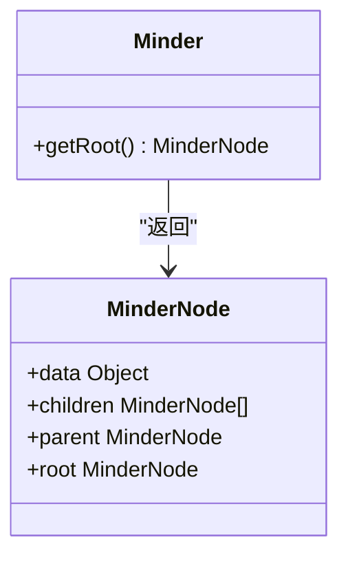
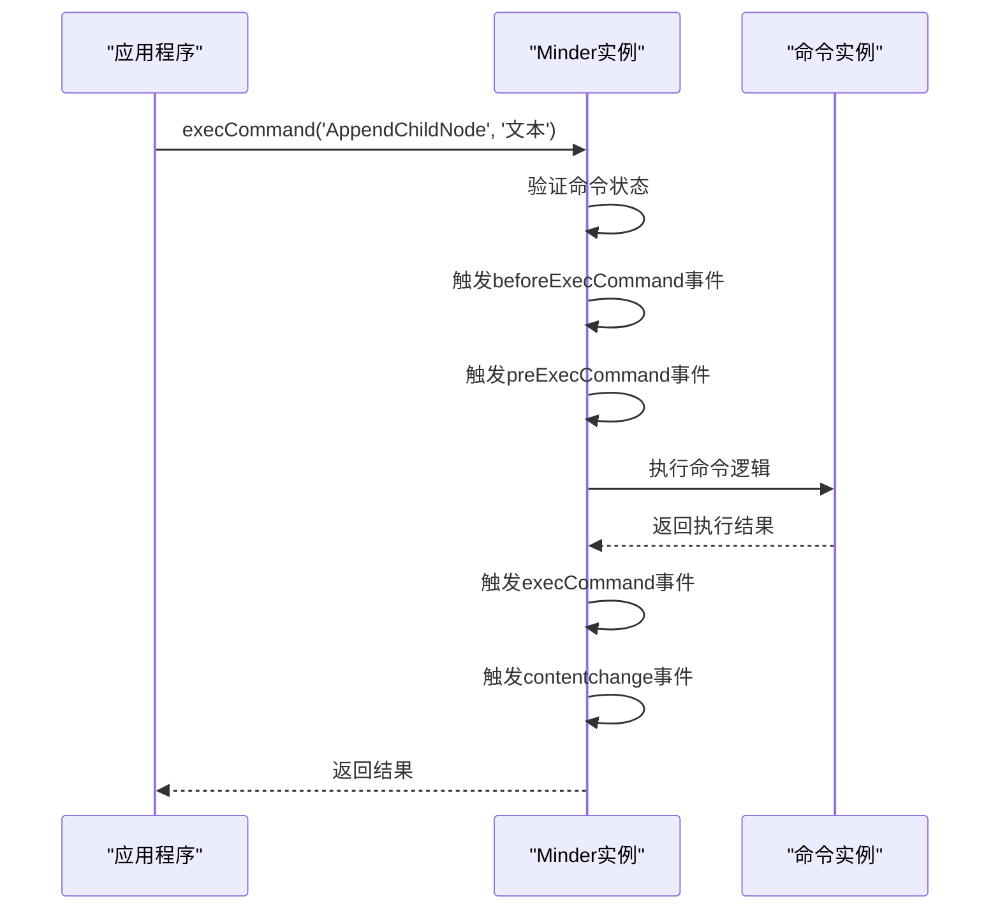
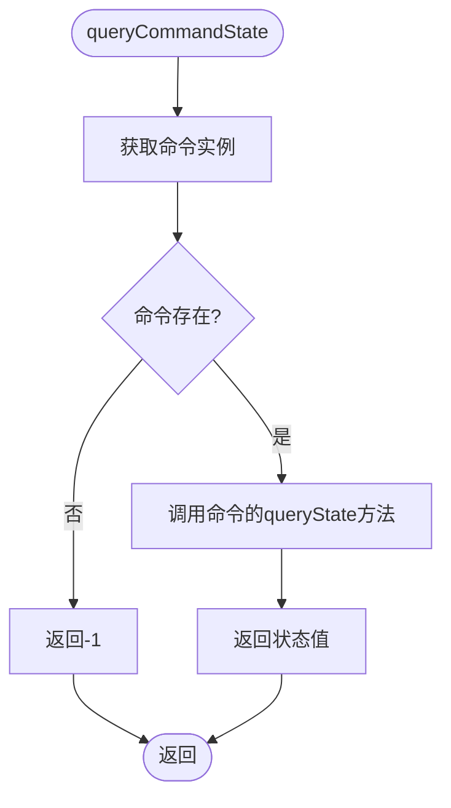
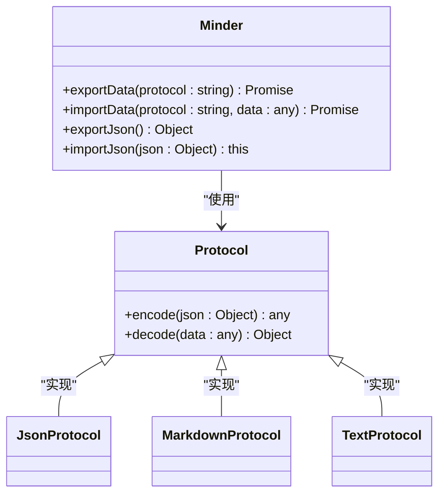
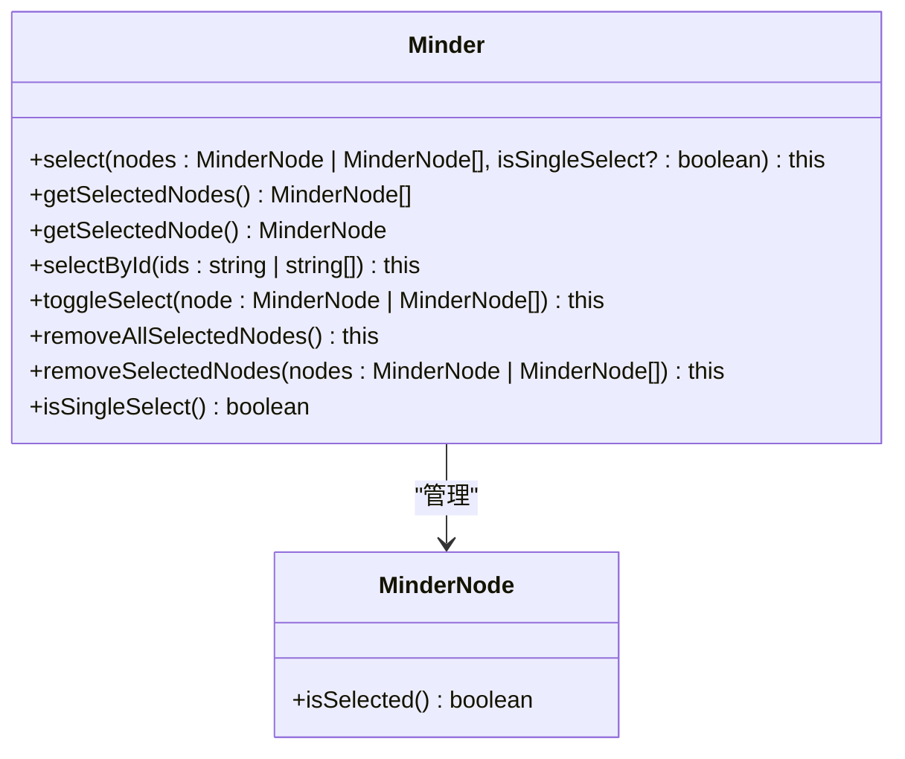
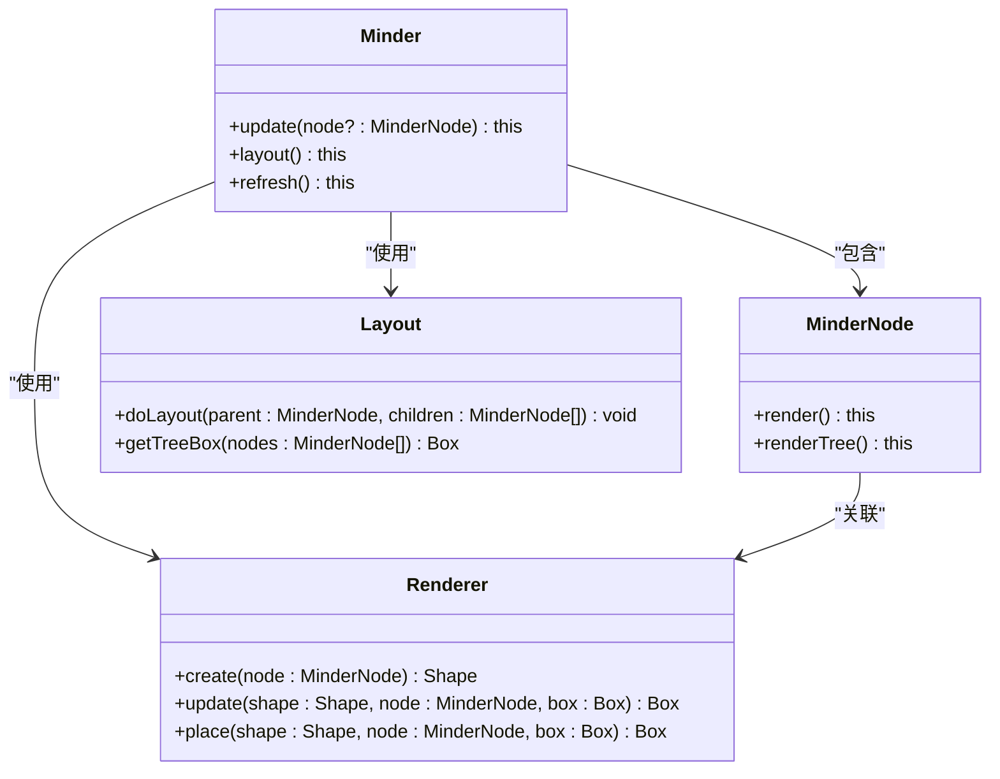
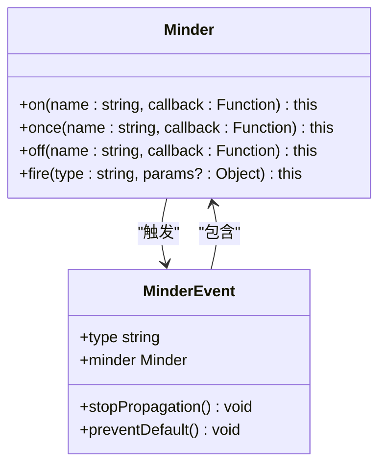
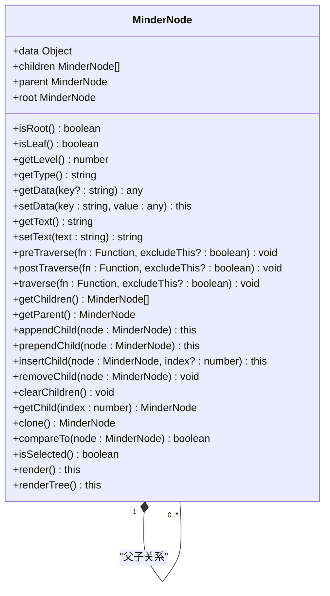

# Minder API

<cite>
**本文档中引用的文件**   
- [minder.js](file://src/core/minder.js)
- [node.js](file://src/core/node.js)
- [command.js](file://src/core/command.js)
- [event.js](file://src/core/event.js)
- [data.js](file://src/core/data.js)
- [select.js](file://src/core/select.js)
- [render.js](file://src/core/render.js)
- [layout.js](file://src/core/layout.js)
- [expand.js](file://src/module/expand.js)
- [node.js](file://src/module/node.js)
- [text.js](file://src/module/text.js)
- [clipboard.js](file://src/module/clipboard.js)
- [markdown.js](file://src/protocol/markdown.js)
- [json.js](file://src/protocol/json.js)
</cite>

## 目录
1. [简介](#简介)
2. [核心组件](#核心组件)
3. [getRoot方法](#getroot方法)
4. [execCommand方法](#execcommand方法)
5. [queryCommandState方法](#querycommandstate方法)
6. [数据导入导出方法](#数据导入导出方法)
7. [节点选择方法](#节点选择方法)
8. [渲染与布局方法](#渲染与布局方法)
9. [事件监听方法](#事件监听方法)
10. [MinderNode类](#mindernode类)

## 简介

Minder API 是一个功能强大的思维导图核心库，提供了完整的思维导图创建、编辑、渲染和交互功能。该API基于KityMinder Core构建，支持丰富的命令系统、灵活的数据格式导入导出、完整的事件机制以及可扩展的模块架构。本文档详细介绍了Minder类的所有公开方法，包括获取根节点、执行命令、查询命令状态、数据导入导出、节点选择、渲染更新和事件监听等核心功能。

## 核心组件

Minder API的核心由多个组件构成，包括Minder类、MinderNode类、命令系统、事件系统、数据处理系统、选择系统、渲染系统和布局系统。这些组件协同工作，提供了完整的思维导图功能。Minder类作为主要的API入口，封装了所有操作方法，而MinderNode类表示思维导图中的单个节点，包含节点数据、父子关系和渲染信息。

**Section sources**
- [minder.js](file://src/core/minder.js#L1-L41)
- [node.js](file://src/core/node.js#L1-L407)

## getRoot方法

getRoot方法用于获取思维导图的根节点。该方法返回一个MinderNode实例，代表思维导图的根节点。根节点是整个思维导图结构的起点，所有其他节点都是根节点的后代节点。通过根节点，可以遍历整个思维导图树结构，访问所有节点的数据和属性。



**Diagram sources **
- [minder.js](file://src/core/minder.js#L318-L320)
- [node.js](file://src/core/node.js#L318-L325)

## execCommand方法

execCommand方法是Minder API的核心功能之一，用于执行各种命令操作。该方法接受命令名称和可变参数，执行相应的操作。

### 方法签名
```javascript
execCommand(name: string, ...params: any[]): any
```

### 参数说明
- **name**: 要执行的命令名称，如'AppendChildNode'、'ExpandNode'等
- **params**: 传递给命令的其他参数，根据具体命令而定

### 常用命令示例

#### AppendChildNode命令
用于在指定节点下添加子节点：
```javascript
// 添加子节点
minder.execCommand('AppendChildNode', '新节点文本');
```

#### ExpandNode命令
用于展开指定节点：
```javascript
// 展开节点
minder.execCommand('Expand');
```

#### Collapse命令
用于收起指定节点：
```javascript
// 收起节点
minder.execCommand('Collapse');
```

#### Text命令
用于设置节点文本：
```javascript
// 设置选中节点的文本
minder.execCommand('text', '新的文本内容');
```

execCommand方法在执行前会检查命令状态，只有当命令可用时才会执行。执行过程中会触发一系列事件，包括beforeExecCommand、preExecCommand、execCommand等，允许开发者在命令执行前后进行自定义处理。



**Diagram sources **
- [command.js](file://src/core/command.js#L118-L165)
- [node.js](file://src/module/node.js#L51-L64)
- [expand.js](file://src/module/expand.js#L62-L77)

## queryCommandState方法

queryCommandState方法用于查询指定命令的当前状态。该方法返回一个数值，表示命令的可用性状态。

### 返回值说明
- **-1**: 命令不存在或当前不可用
- **0**: 命令可用
- **1**: 命令当前可用并且已经执行过

### 常用命令状态查询

#### AppendChildNode命令状态
```javascript
// 查询添加子节点命令的状态
var state = minder.queryCommandState('AppendChildNode');
// 当有节点被选中时返回0，否则返回-1
```

#### RemoveNode命令状态
```javascript
// 查询删除节点命令的状态
var state = minder.queryCommandState('RemoveNode');
// 当有非根节点被选中时返回0，否则返回-1
```

#### Expand命令状态
```javascript
// 查询展开命令的状态
var state = minder.queryCommandState('Expand');
// 当有非根节点且未展开时返回0，否则返回-1
```

#### Collapse命令状态
```javascript
// 查询收起命令的状态
var state = minder.queryCommandState('Collapse');
// 当有非根节点且已展开时返回0，否则返回-1
```

#### Copy命令状态
```javascript
// 查询复制命令的状态
var state = minder.queryCommandState('Copy');
// 当有节点被选中时返回0，否则返回-1
```

#### Paste命令状态
```javascript
// 查询粘贴命令的状态
var state = minder.queryCommandState('Paste');
// 当剪贴板中有内容且有节点被选中时返回0，否则返回-1
```

queryCommandState方法通过内部的命令注册系统查找指定名称的命令，并调用其queryState方法获取状态。这种方法使得命令状态的查询与命令的实现解耦，提高了系统的可扩展性。



**Diagram sources **
- [command.js](file://src/core/command.js#L87-L89)
- [node.js](file://src/module/node.js#L65-L68)
- [expand.js](file://src/module/expand.js#L79-L82)

## 数据导入导出方法

Minder API提供了强大的数据导入导出功能，支持多种数据格式协议，包括JSON、Markdown、文本等。

### exportData方法

exportData方法用于导出思维导图数据，支持多种数据协议。

#### 方法签名
```javascript
exportData(protocol: string, option?: any): Promise<any>
```

#### 支持的协议
- **json**: 导出为JSON格式
- **markdown**: 导出为Markdown格式
- **text**: 导出为纯文本格式
- **svg**: 导出为SVG格式
- **png**: 导出为PNG格式

#### 使用示例
```javascript
// 导出为JSON格式
minder.exportData('json').then(function(jsonData) {
    console.log(jsonData);
});

// 导出为Markdown格式
minder.exportData('markdown').then(function(markdownData) {
    console.log(markdownData);
});
```

### importData方法

importData方法用于导入思维导图数据，覆盖当前实例的脑图。

#### 方法签名
```javascript
importData(protocol: string, data: any, option?: any): Promise<any>
```

#### 支持的协议
- **json**: 导入JSON格式数据
- **markdown**: 导入Markdown格式数据
- **text**: 导入纯文本格式数据

#### 使用示例
```javascript
// 从JSON数据导入
var jsonData = {
    root: {
        data: { text: '根节点' },
        children: [
            { data: { text: '子节点1' } },
            { data: { text: '子节点2' } }
        ]
    },
    version: "2"
};
minder.importData('json', jsonData);

// 从Markdown文本导入
var markdownText = `
# 根节点
## 子节点1
## 子节点2
`;
minder.importData('markdown', markdownText);
```

### exportJson和importJson方法

exportJson和importJson方法是专门用于JSON格式数据导入导出的便捷方法。

#### exportJson方法
```javascript
// 导出为JSON对象
var json = minder.exportJson();
console.log(JSON.stringify(json, null, 2));
```

#### importJson方法
```javascript
// 从JSON对象导入
minder.importJson(jsonData);
```

JSON数据格式包含根节点、版本信息、模板和主题等元数据，确保了思维导图的完整性和可移植性。



**Diagram sources **
- [data.js](file://src/core/data.js#L319-L341)
- [data.js](file://src/core/data.js#L353-L379)
- [json.js](file://src/protocol/json.js)
- [markdown.js](file://src/protocol/markdown.js)

## 节点选择方法

Minder API提供了丰富的节点选择相关方法，用于管理思维导图中的节点选中状态。

### select方法

select方法用于选择一个或多个节点。

#### 方法签名
```javascript
select(nodes: MinderNode | MinderNode[], isSingleSelect?: boolean): this
```

#### 参数说明
- **nodes**: 要选择的节点或节点数组
- **isSingleSelect**: 是否为单选模式，默认为false

#### 使用示例
```javascript
// 选择单个节点
minder.select(node);

// 选择多个节点
minder.select([node1, node2, node3]);

// 单选模式（会清除之前的选中状态）
minder.select(node, true);
```

### getSelectedNodes方法

getSelectedNodes方法用于获取当前选中的所有节点。

#### 方法签名
```javascript
getSelectedNodes(): MinderNode[]
```

#### 使用示例
```javascript
// 获取选中的节点
var selectedNodes = minder.getSelectedNodes();
selectedNodes.forEach(function(node) {
    console.log(node.getText());
});
```

### 其他选择相关方法

#### selectById
通过节点ID选择节点：
```javascript
minder.selectById('node123');
minder.selectById(['node123', 'node456']);
```

#### toggleSelect
切换节点的选中状态：
```javascript
minder.toggleSelect(node);
minder.toggleSelect([node1, node2]);
```

#### removeAllSelectedNodes
清除所有选中状态：
```javascript
minder.removeAllSelectedNodes();
```

#### removeSelectedNodes
移除指定节点的选中状态：
```javascript
minder.removeSelectedNodes(node);
minder.removeSelectedNodes([node1, node2]);
```

#### getSelectedNode
获取第一个选中的节点（单选时使用）：
```javascript
var selectedNode = minder.getSelectedNode();
if (selectedNode) {
    console.log(selectedNode.getText());
}
```

节点选择系统支持单选和多选模式，通过事件机制通知选择状态的变化，便于UI组件的更新。



**Diagram sources **
- [select.js](file://src/core/select.js#L41-L98)
- [select.js](file://src/core/select.js#L140-L143)

## 渲染与布局方法

Minder API提供了完整的渲染和布局控制方法，用于更新思维导图的视觉呈现。

### update方法

update方法用于更新指定节点及其子树的呈现。

#### 方法签名
```javascript
update(node?: MinderNode): this
```

#### 使用示例
```javascript
// 更新特定节点
minder.update(node);

// 更新整个思维导图（根节点）
minder.update();
```

### layout方法

layout方法用于重新计算和应用思维导图的布局。

#### 方法签名
```javascript
layout(): this
```

#### 使用示例
```javascript
// 重新布局整个思维导图
minder.layout();
```

### refresh方法

refresh方法是更新和布局的组合操作，用于刷新整个思维导图。

#### 方法签名
```javascript
refresh(): this
```

#### 使用示例
```javascript
// 刷新思维导图
minder.refresh();
```

### render方法

render方法用于渲染单个节点。

#### 方法签名
```javascript
render(): this
```

#### 使用示例
```javascript
// 渲染特定节点
node.render();
```

渲染系统采用分层架构，包括渲染器（Renderer）、布局器（Layout）和绘制器（Drawer），支持自定义渲染效果和动画过渡。



**Diagram sources **
- [render.js](file://src/core/render.js#L226-L239)
- [layout.js](file://src/core/layout.js#L391-L436)
- [layout.js](file://src/core/layout.js#L443-L444)

## 事件监听方法

Minder API提供了完整的事件系统，支持事件监听、触发和移除。

### on方法

on方法用于注册事件监听器。

#### 方法签名
```javascript
on(name: string, callback: Function): this
```

#### 参数说明
- **name**: 事件名称，支持空格分隔的多个事件
- **callback**: 事件回调函数

#### 使用示例
```javascript
// 监听单个事件
minder.on('contentchange', function(e) {
    console.log('内容已更改');
});

// 监听多个事件
minder.on('selectionchange layout', function(e) {
    console.log('选择或布局已更改');
});
```

### once方法

once方法用于注册只执行一次的事件监听器。

#### 方法签名
```javascript
once(name: string, callback: Function): this
```

#### 使用示例
```javascript
// 只监听一次内容更改事件
minder.once('contentchange', function(e) {
    console.log('这是第一次也是最后一次内容更改');
});
```

### off方法

off方法用于移除事件监听器。

#### 方法签名
```javascript
off(name: string, callback: Function): this
```

#### 使用示例
```javascript
// 定义回调函数以便移除
function onContentChange(e) {
    console.log('内容已更改');
}

// 添加监听器
minder.on('contentchange', onContentChange);

// 移除监听器
minder.off('contentchange', onContentChange);
```

### fire方法

fire方法用于触发自定义事件。

#### 方法签名
```javascript
fire(type: string, params?: Object): this
```

#### 参数说明
- **type**: 事件类型
- **params**: 事件参数

#### 使用示例
```javascript
// 触发自定义事件
minder.fire('customEvent', {
    data: '自定义数据',
    timestamp: Date.now()
});
```

### 常用事件类型

#### contentchange
内容更改事件，在思维导图内容发生变化时触发。

#### selectionchange
选择更改事件，在节点选择状态发生变化时触发。

#### layout
布局事件，在开始重新布局时触发。

#### layoutallfinish
布局完成事件，在所有布局动画完成后触发。

#### nodecreate
节点创建事件，在创建新节点时触发。

#### noderemove
节点移除事件，在删除节点时触发。

事件系统采用发布-订阅模式，支持事件冒泡和阻止传播，提供了灵活的事件处理机制。



**Diagram sources **
- [event.js](file://src/core/event.js#L232-L265)
- [event.js](file://src/core/event.js#L10-L270)

## MinderNode类

MinderNode类表示思维导图中的单个节点，包含节点数据、父子关系和各种操作方法。

### 核心属性

- **data**: 节点数据对象，包含id、text等字段
- **children**: 子节点数组
- **parent**: 父节点引用
- **root**: 根节点引用

### 主要方法

#### 节点关系方法
- **getParent()**: 获取父节点
- **getChildren()**: 获取子节点数组
- **isRoot()**: 判断是否为根节点
- **isLeaf()**: 判断是否为叶子节点
- **getLevel()**: 获取节点深度

#### 数据操作方法
- **getData(key?)**: 获取节点数据
- **setData(key, value)**: 设置节点数据
- **getText()**: 获取节点文本
- **setText(text)**: 设置节点文本

#### 遍历方法
- **preTraverse(fn)**: 先序遍历
- **postTraverse(fn)**: 后序遍历
- **traverse(fn)**: 遍历（默认后序）

#### 节点操作方法
- **appendChild(node)**: 添加子节点
- **prependChild(node)**: 在开头添加子节点
- **insertChild(node, index)**: 在指定位置插入子节点
- **removeChild(node)**: 移除子节点
- **clearChildren()**: 清空所有子节点

MinderNode类是思维导图数据结构的基础，通过树形结构组织所有节点，支持高效的遍历和操作。



**Diagram sources **
- [node.js](file://src/core/node.js#L11-L407)
- [select.js](file://src/core/select.js#L140-L143)
- [render.js](file://src/core/render.js#L226-L239)