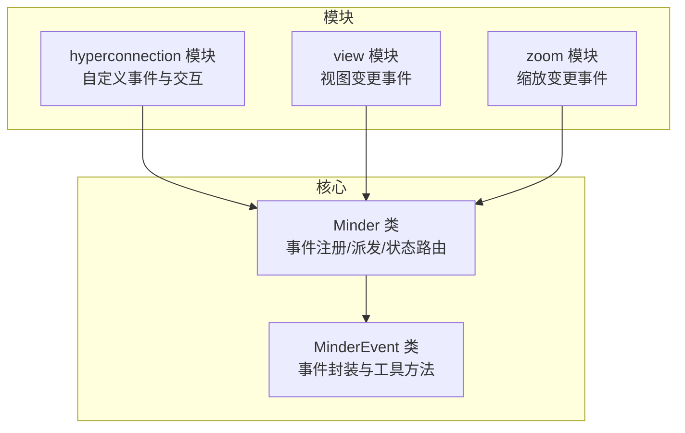
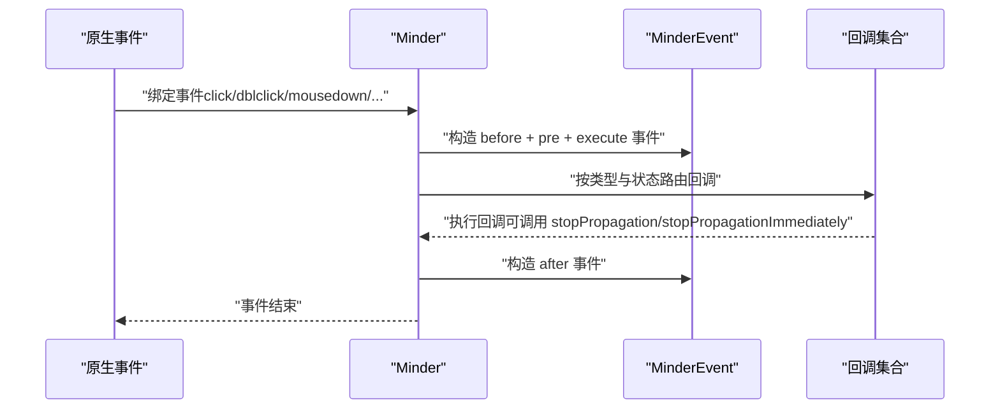
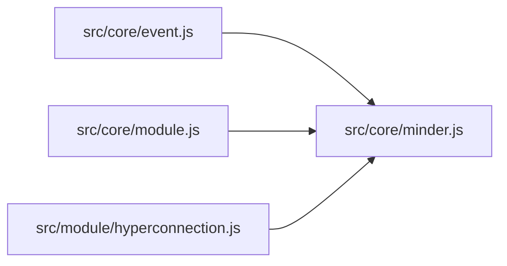

# 事件API

<cite>
**本文引用的文件**
- [src/core/event.js](file://src/core/event.js)
- [src/core/minder.js](file://src/core/minder.js)
- [doc/Architecture.md](file://doc/Architecture.md)
- [src/module/hyperconnection.js](file://src/module/hyperconnection.js)
- [src/core/module.js](file://src/core/module.js)
- [src/module/view.js](file://src/module/view.js)
- [src/module/zoom.js](file://src/module/zoom.js)
</cite>

## 目录
1. [简介](#简介)
2. [项目结构](#项目结构)
3. [核心组件](#核心组件)
4. [架构总览](#架构总览)
5. [详细组件分析](#详细组件分析)
6. [依赖分析](#依赖分析)
7. [性能考虑](#性能考虑)
8. [故障排查指南](#故障排查指南)
9. [结论](#结论)
10. [附录](#附录)

## 简介
本文件面向使用者与开发者，系统化梳理 KityMinder 的事件系统 API，重点覆盖以下能力：
- 事件监听与触发：on、once、off、fire
- MinderEvent 对象结构与行为：type、kityEvent、originEvent、getPosition、getTargetNode、stopPropagation、preventDefault 等
- 内置事件类型：交互事件、命令事件、状态事件、模块自定义事件
- 事件在模块中的实际使用示例与最佳实践

## 项目结构
事件系统主要由核心类 Minder 与 MinderEvent 两部分构成，二者通过事件绑定、派发与回调机制协同工作。模块通过 on/事件绑定的方式接入事件流，同时可在内部 fire 自定义事件。

图表来源
- [src/core/event.js](file://src/core/event.js#L133-L266)
- [src/core/minder.js](file://src/core/minder.js#L1-L41)
- [src/module/hyperconnection.js](file://src/module/hyperconnection.js#L238-L290)
- [src/module/view.js](file://src/module/view.js#L67-L70)
- [src/module/zoom.js](file://src/module/zoom.js#L53-L73)

章节来源
- [src/core/event.js](file://src/core/event.js#L133-L266)
- [src/core/minder.js](file://src/core/minder.js#L1-L41)

## 核心组件
- Minder：负责事件初始化、绑定原生事件、派发 before/pre/execute/after 生命周期事件、状态路由事件、统一 fire 分发与 off 移除。
- MinderEvent：封装事件对象，提供坐标获取、命中节点解析、事件控制（停止传播、立即停止、阻止默认行为）等能力。

章节来源
- [src/core/event.js](file://src/core/event.js#L10-L127)
- [src/core/event.js](file://src/core/event.js#L133-L266)

## 架构总览
事件系统采用“原生事件 -> MinderEvent 封装 -> before/pre/execute/after 生命周期 -> 状态路由 -> 回调执行”的链路。模块通过 on 注册事件，也可在内部 fire 自定义事件。

图表来源
- [src/core/event.js](file://src/core/event.js#L144-L182)
- [src/core/event.js](file://src/core/event.js#L194-L230)

章节来源
- [src/core/event.js](file://src/core/event.js#L144-L182)
- [src/core/event.js](file://src/core/event.js#L194-L230)

## 详细组件分析

### MinderEvent 对象
- 结构与属性
  - type：事件类型字符串（如 click、keydown、contentchange 等）
  - kityEvent：若事件源自 Kity 事件，指向原始 Kity 事件
  - originEvent：若事件源自原生 DOM 事件，指向原始 DOM 事件
  - minder：事件产生时绑定的 Minder 实例
- 坐标与命中
  - getPosition(refer)：获取事件坐标，refer 支持 "minder" 或 kity 形状；默认 "minder"
  - getTargetNode()：在鼠标事件中获取命中的节点
- 事件控制
  - stopPropagation()：停止后续回调执行
  - stopPropagationImmediately()：立即停止传播
  - shouldStopPropagation()/shouldStopPropagationImmediately()：判断是否应停止传播
  - preventDefault()：阻止默认行为
  - isRightMB()：判断右键
  - getKeyCode()：获取按键码

章节来源
- [src/core/event.js](file://src/core/event.js#L10-L127)

### Minder 事件接口
- on(name, callback)
  - 支持空格分隔的多个事件名一次性注册
  - 将回调存储在内部表中，按事件类型与当前状态进行路由
- off(name, callback)
  - 移除指定事件名对应的回调
- fire(type, params)
  - 构造 MinderEvent 并执行分发流程
- dispatchKeyEvent(e)
  - 将原生键盘事件派发到 Minder 实例

章节来源
- [src/core/event.js](file://src/core/event.js#L232-L266)

### 生命周期与状态路由
- 原生事件进入时，Minder 会构造并依次派发：
  - before + 原生事件名
  - pre + 原生事件名
  - 原生事件名（execute）
  - after + 原生事件名
- 若回调调用 stopPropagationImmediately，将中断后续回调执行
- 若回调调用 stopPropagation，将在当前回调结束后停止传播

章节来源
- [src/core/event.js](file://src/core/event.js#L162-L182)
- [src/core/event.js](file://src/core/event.js#L194-L230)

### 事件监听与触发的实际代码示例
- 模块内监听与触发
  - 监听画布点击并取消连线选中
    - 示例路径：[src/module/hyperconnection.js](file://src/module/hyperconnection.js#L280-L289)
  - 双击超链接文本触发自定义事件
    - 示例路径：[src/module/hyperconnection.js](file://src/module/hyperconnection.js#L238-L247)
  - 视图移动完成后触发 viewchange
    - 示例路径：[src/module/view.js](file://src/module/view.js#L67-L70)
  - 缩放动画完成后触发 viewchange
    - 示例路径：[src/module/zoom.js](file://src/module/zoom.js#L53-L73)
- 模块注册事件
  - 模块 events 中通过 on 注册事件
    - 示例路径：[src/core/module.js](file://src/core/module.js#L90-L95)

章节来源
- [src/module/hyperconnection.js](file://src/module/hyperconnection.js#L238-L290)
- [src/module/view.js](file://src/module/view.js#L67-L70)
- [src/module/zoom.js](file://src/module/zoom.js#L53-L73)
- [src/core/module.js](file://src/core/module.js#L90-L95)

### 内置事件类型
- 交互事件
  - click、dblclick、mousedown、mousemove、mouseup、keydown、keyup、keypress、touchstart、touchend、touchmove
- 命令事件
  - beforecommand、precommand、aftercommand
- 状态事件
  - selectionchange、contentchange、interactchange
- 模块自定义事件
  - 模块可自行触发与上述不同名的事件（如 hyperconnectiondblclick）

章节来源
- [doc/Architecture.md](file://doc/Architecture.md#L378-L387)
- [doc/Architecture.md](file://doc/Architecture.md#L389-L397)
- [doc/Architecture.md](file://doc/Architecture.md#L414-L429)

## 依赖分析
- Minder 依赖 MinderEvent 进行事件封装与分发
- 模块通过 Minder 的 on/事件绑定机制接入事件流
- 模块内部可通过 fire 触发自定义事件，供应用层监听

图表来源
- [src/core/event.js](file://src/core/event.js#L1-L20)
- [src/core/minder.js](file://src/core/minder.js#L1-L41)
- [src/core/module.js](file://src/core/module.js#L90-L95)
- [src/module/hyperconnection.js](file://src/module/hyperconnection.js#L238-L290)

章节来源
- [src/core/event.js](file://src/core/event.js#L1-L20)
- [src/core/minder.js](file://src/core/minder.js#L1-L41)
- [src/core/module.js](file://src/core/module.js#L90-L95)
- [src/module/hyperconnection.js](file://src/module/hyperconnection.js#L238-L290)

## 性能考虑
- 事件传播控制：合理使用 stopPropagation/stopPropagationImmediately，避免不必要的回调链路
- 状态路由：事件按状态拼接前缀进行路由，避免在大量状态下重复匹配
- 交互节流：interactchange 事件会进行稀释，减少高频交互导致的重复触发

章节来源
- [src/core/event.js](file://src/core/event.js#L194-L230)
- [doc/Architecture.md](file://doc/Architecture.md#L420-L429)

## 故障排查指南
- 事件未触发
  - 确认事件名大小写与注册一致（内部统一转小写）
  - 确认模块已正确注册事件（模块 events 中通过 on 注册）
- 事件传播问题
  - 检查回调中是否调用了 stopPropagation/stopPropagationImmediately
  - 检查是否在 before/pre 阶段就拦截了事件
- 坐标获取异常
  - 确认事件是否为鼠标事件（需 kityEvent）
  - 明确 getPosition 的 refer 参数（默认 "minder"）
- 命中节点为空
  - 检查目标图形透明度与容器层级
  - 确认事件坐标在节点命中区域

章节来源
- [src/core/event.js](file://src/core/event.js#L48-L84)
- [src/core/event.js](file://src/core/event.js#L93-L111)
- [src/core/event.js](file://src/core/event.js#L194-L230)

## 结论
KityMinder 的事件系统以 MinderEvent 为核心，提供统一的事件封装、生命周期与状态路由，既满足模块化扩展，又保证了事件控制的灵活性。通过 on/off/fire 的标准接口与丰富的工具方法（坐标、命中、传播控制），开发者可以高效地构建交互与自定义事件。

## 附录

### API 一览（方法与属性）
- MinderEvent
  - 属性：type、kityEvent、originEvent、minder
  - 方法：getPosition(refer)、getTargetNode()、stopPropagation()、stopPropagationImmediately()、shouldStopPropagation()、shouldStopPropagationImmediately()、preventDefault()、isRightMB()、getKeyCode()
- Minder
  - on(name, callback)、off(name, callback)、fire(type, params)、dispatchKeyEvent(e)

章节来源
- [src/core/event.js](file://src/core/event.js#L10-L127)
- [src/core/event.js](file://src/core/event.js#L133-L266)