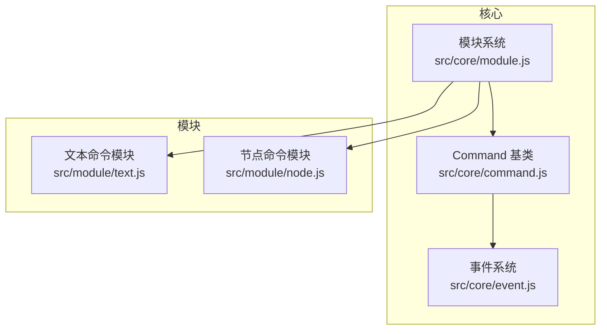
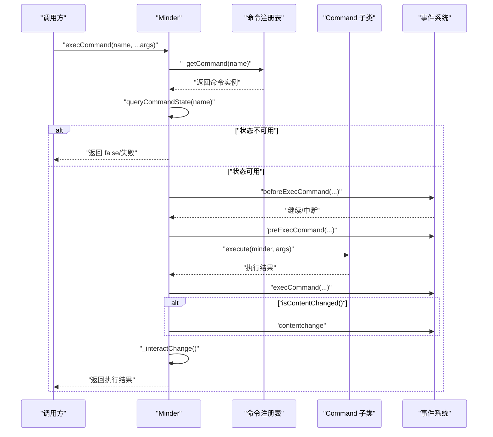
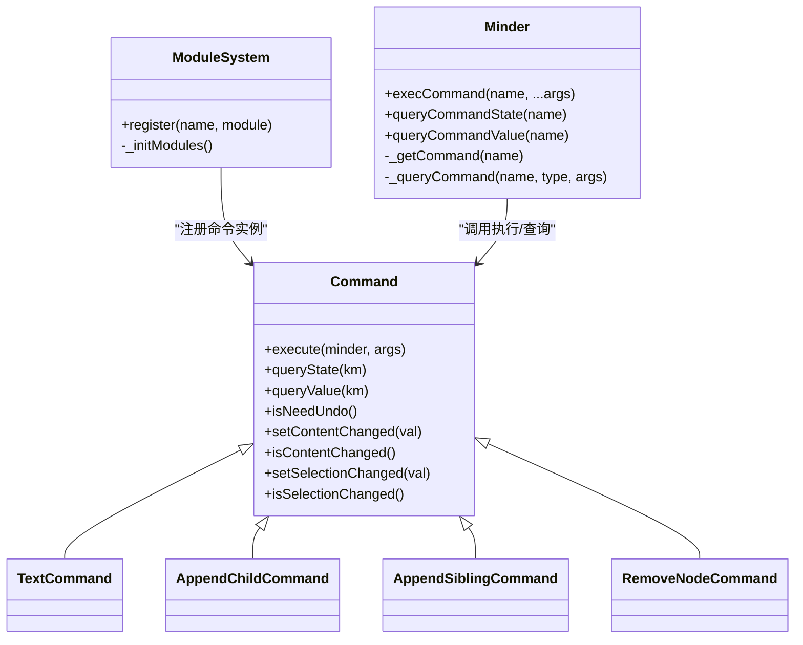

# 命令API

<cite>
**本文引用的文件**
- [src/core/command.js](file://src/core/command.js)
- [src/core/module.js](file://src/core/module.js)
- [src/module/text.js](file://src/module/text.js)
- [src/module/node.js](file://src/module/node.js)
- [src/core/event.js](file://src/core/event.js)
- [doc/Architecture.md](file://doc/Architecture.md)
</cite>

## 目录
1. [简介](#简介)
2. [项目结构](#项目结构)
3. [核心组件](#核心组件)
4. [架构总览](#架构总览)
5. [详细组件分析](#详细组件分析)
6. [依赖关系分析](#依赖关系分析)
7. [性能考量](#性能考量)
8. [故障排查指南](#故障排查指南)
9. [结论](#结论)
10. [附录：自定义命令示例与注册流程](#附录自定义命令示例与注册流程)

## 简介
本文件面向开发者，系统化梳理 KityMinder 的命令体系，重点围绕 Command 基类的 API 设计与使用规范，包括：
- execute 方法：命令执行入口，所有子类必须实现
- revert 方法：用于撤销命令执行（本仓库未直接暴露，但通过 isNeedUndo 与事件机制配合实现撤销）
- queryState 方法：返回命令状态（-1 不可用，0 可用，1 已执行），用于 UI 控件启停
- queryValue 方法：返回命令当前值（如进度条百分比），用于 UI 值显示
- setContentChanged/isContentChanged：标记与查询命令是否改变内容，触发 contentchange 事件
- setSelectionChanged/isSelectionChanged：标记与查询命令是否改变选区，影响 selectionchange 事件
- 自定义命令的编写与模块注册流程

## 项目结构
命令体系位于核心模块中，命令注册与生命周期管理由模块系统负责，命令执行由 Minder 统一调度并触发相应事件。

图表来源
- [src/core/command.js](file://src/core/command.js#L1-L169)
- [src/core/module.js](file://src/core/module.js#L1-L151)
- [src/core/event.js](file://src/core/event.js#L1-L270)
- [src/module/text.js](file://src/module/text.js#L1-L289)
- [src/module/node.js](file://src/module/node.js#L1-L150)

章节来源
- [src/core/command.js](file://src/core/command.js#L1-L169)
- [src/core/module.js](file://src/core/module.js#L1-L151)

## 核心组件
- Command 基类：定义命令的统一接口与默认行为，包括状态查询、值查询、内容变更标记、撤销需求等。
- Minder.execCommand：统一的命令执行入口，负责事件分发、状态校验、内容变更通知等。
- 模块系统：负责命令注册、事件绑定、渲染器注册等。
- 事件系统：提供 beforeExecCommand、preExecCommand、execCommand、contentchange、interactchange 等事件钩子。

章节来源
- [src/core/command.js](file://src/core/command.js#L1-L169)
- [src/core/module.js](file://src/core/module.js#L1-L151)
- [src/core/event.js](file://src/core/event.js#L1-L270)

## 架构总览
命令执行的端到端流程如下：

图表来源
- [src/core/command.js](file://src/core/command.js#L87-L166)
- [src/core/event.js](file://src/core/event.js#L162-L231)

章节来源
- [src/core/command.js](file://src/core/command.js#L87-L166)
- [src/core/event.js](file://src/core/event.js#L162-L231)

## 详细组件分析

### Command 基类 API
- execute(minder, args...)：命令执行入口，子类必须实现。minder 为当前 Minder 实例；args 为可变参数，由调用方传入。
- queryState(km)：查询命令状态，默认返回可用（0）。返回值含义：
  - -1：命令不存在或当前不可用
  - 0：命令可用
  - 1：命令可用且已执行过（用于 UI 状态区分）
- queryValue(km)：查询命令当前值，默认返回 0。典型用途：进度条百分比、开关状态等。
- isNeedUndo()：是否需要纳入撤销栈（默认 true）。用于撤销/重做机制的决策。
- setContentChanged(val)/isContentChanged()：标记与查询命令是否改变了内容。若为真，执行后会触发 contentchange 事件。
- setSelectionChanged(val)/isSelectionChanged()：标记与查询命令是否改变了选区。注意：当前实现返回的是内容变更标志，而非选区变更标志，存在逻辑差异，详见“故障排查指南”。

章节来源
- [src/core/command.js](file://src/core/command.js#L1-L57)

### Minder.execCommand 流程
- 参数解析：将命令名转为小写，收集剩余参数作为命令实参。
- 状态检查：通过 queryCommandState 校验命令可用性。
- 事件分发：依次触发 beforeExecCommand、preExecCommand；若未被中断则执行命令。
- 结果处理：触发 execCommand 事件；若 isContentChanged 为真，触发 contentchange；最后调用 _interactChange。
- 返回值：若命令返回 undefined，统一转换为 null；否则返回命令结果。

章节来源
- [src/core/command.js](file://src/core/command.js#L118-L166)

### 事件与状态
- beforeExecCommand/preExecCommand/execCommand：分别在执行前后提供钩子，允许外部拦截或扩展。
- contentchange：当命令标记内容变更时触发，用于驱动 UI 更新。
- interactchange：交互变更的去抖动通知，避免频繁刷新。

章节来源
- [src/core/command.js](file://src/core/command.js#L133-L166)
- [src/core/event.js](file://src/core/event.js#L162-L231)

### 自定义命令示例与注册
以下示例展示如何继承 Command 并在模块中注册命令：
- 文本命令示例：定义 TextCommand，覆盖 execute/queryState/queryValue，注册到模块并导出命令。
- 节点命令示例：定义 AppendChildCommand/AppendSiblingCommand/RemoveNodeCommand 等，覆盖 execute/queryState，注册到模块。

章节来源
- [src/module/text.js](file://src/module/text.js#L245-L286)
- [src/module/node.js](file://src/module/node.js#L11-L149)

## 依赖关系分析

图表来源
- [src/core/command.js](file://src/core/command.js#L1-L169)
- [src/core/module.js](file://src/core/module.js#L1-L151)
- [src/module/text.js](file://src/module/text.js#L245-L286)
- [src/module/node.js](file://src/module/node.js#L11-L149)

章节来源
- [src/core/command.js](file://src/core/command.js#L1-L169)
- [src/core/module.js](file://src/core/module.js#L1-L151)
- [src/module/text.js](file://src/module/text.js#L245-L286)
- [src/module/node.js](file://src/module/node.js#L11-L149)

## 性能考量
- 事件去抖：interactchange 使用定时器进行去抖，避免高频交互导致的重复渲染。
- 内容变更判断：仅在 isContentChanged 为真时触发 contentchange，减少不必要的 UI 更新。
- 命令状态查询：queryState 默认返回可用，避免复杂判断带来的开销；具体模块可根据场景优化状态计算。

章节来源
- [src/core/command.js](file://src/core/command.js#L148-L166)
- [src/core/event.js](file://src/core/event.js#L184-L192)

## 故障排查指南
- isSelectionChanged 逻辑差异：基类中 isSelectionChanged 返回的是内容变更标志，而非选区变更标志，这可能导致 UI 无法正确感知选区变化。建议在自定义命令中：
  - 明确区分“内容变更”与“选区变更”，必要时在命令内部维护独立的选区变更标志位。
  - 在需要触发 selectionchange 的场景，考虑通过自定义事件或手动触发的方式补充。
- revert 方法缺失：本仓库未直接暴露 revert 方法。若需撤销能力，建议：
  - 在命令中记录必要的上下文（如旧值、旧选区等）。
  - 提供自定义撤销方法（例如 undo），并在需要时调用。
  - 结合 isNeedUndo 与事件机制，将命令纳入撤销栈管理。
- UI 启停与值显示：确保 queryState 返回值与 UI 控件状态一致；queryValue 返回的值应与 UI 组件（如进度条）期望格式匹配。

章节来源
- [src/core/command.js](file://src/core/command.js#L25-L57)
- [src/core/command.js](file://src/core/command.js#L148-L166)

## 结论
Command 基类提供了清晰的命令抽象与统一的执行框架，结合模块系统与事件机制，能够支撑丰富的编辑操作。开发者在实现自定义命令时，应重点关注：
- 正确覆盖 execute 与 queryState/queryValue
- 合理使用 setContentChanged/isContentChanged 与 setSelectionChanged/isSelectionChanged
- 注意 isSelectionChanged 的实现差异，必要时补充选区变更处理
- 通过模块注册与快捷键配置，完善命令的可用性与易用性

## 附录：自定义命令示例与注册流程

### 示例一：文本命令（TextCommand）
- 继承 Command，覆盖 execute/queryState/queryValue
- 在模块中通过 Module.register 注册命令
- 导出渲染器并注册到模块

参考路径
- [src/module/text.js](file://src/module/text.js#L245-L286)

### 示例二：节点命令（AppendChildCommand/AppendSiblingCommand/RemoveNodeCommand）
- 定义多个命令类，覆盖 execute/queryState
- 通过 Module.register 将命令集合注册到模块
- 配置命令快捷键映射

参考路径
- [src/module/node.js](file://src/module/node.js#L11-L149)

### 模块注册与命令装载
- 模块系统在初始化时遍历已注册模块，将 commands 字段中的命令实例化并放入命令表
- Minder.execCommand 通过命令名查找命令实例并执行

参考路径
- [src/core/module.js](file://src/core/module.js#L83-L87)
- [src/core/command.js](file://src/core/command.js#L118-L166)

### 命令状态与 UI 应用
- queryState 返回值用于 UI 控件的禁用/启用：
  - -1：禁用
  - 0：启用
  - 1：启用且处于“已执行”状态（可用于 UI 状态区分）
- queryValue 返回值用于 UI 值显示（如进度条）

参考路径
- [src/core/command.js](file://src/core/command.js#L87-L106)
- [doc/Architecture.md](file://doc/Architecture.md#L330-L341)