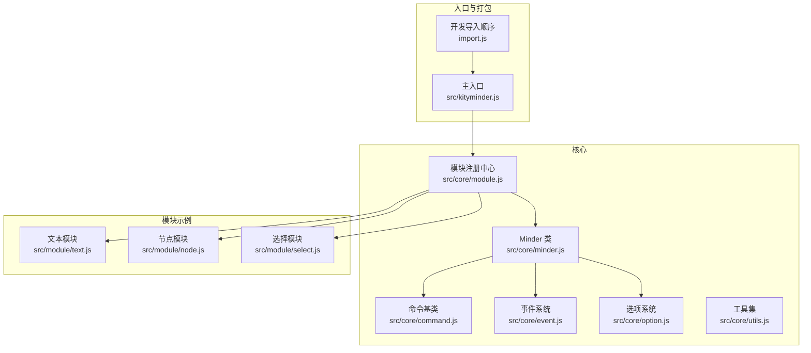
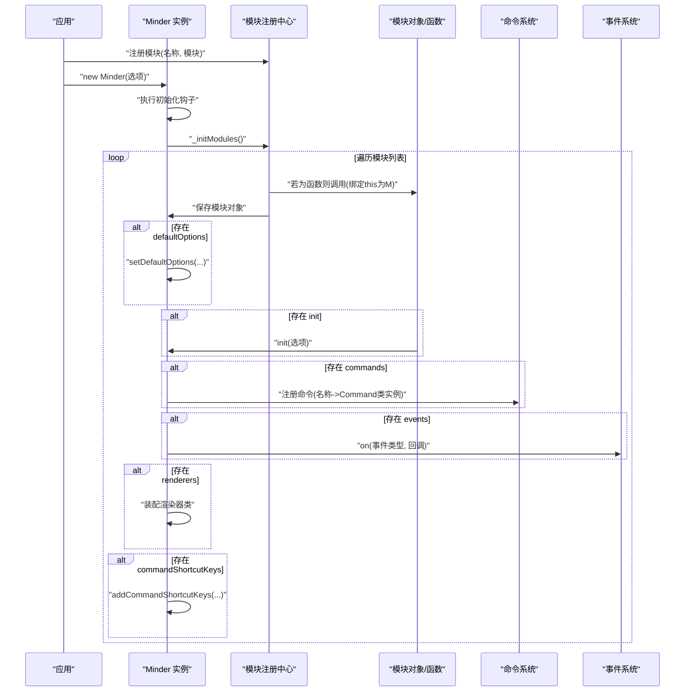
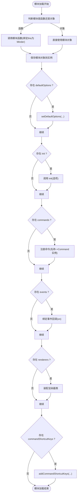
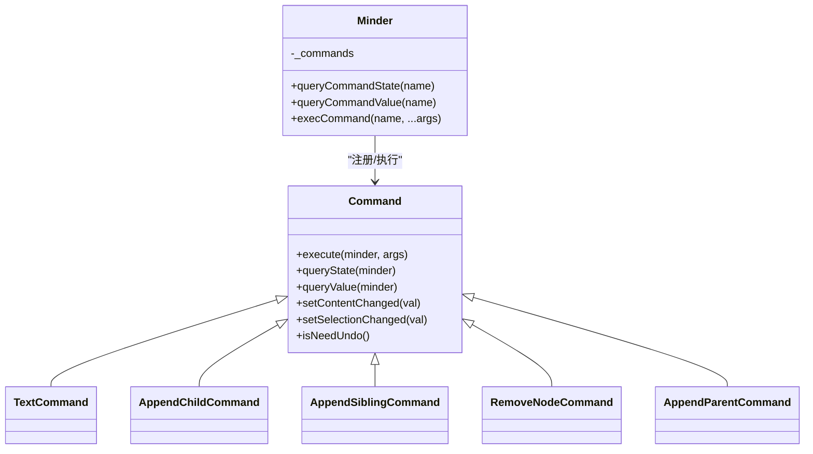
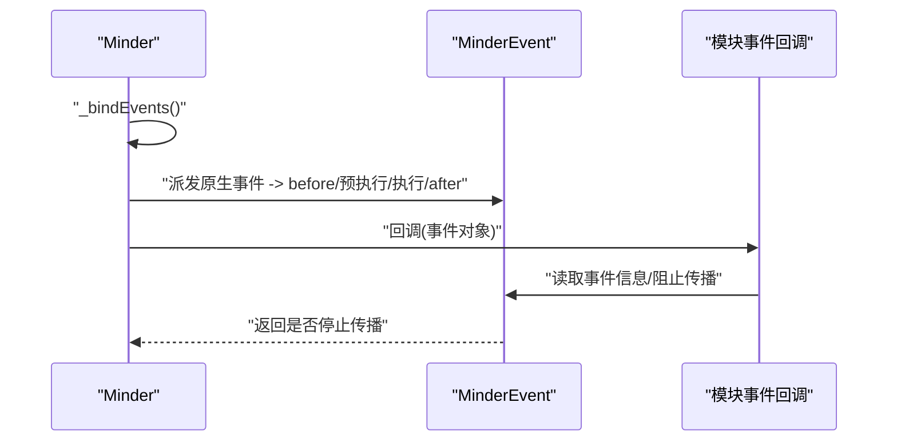
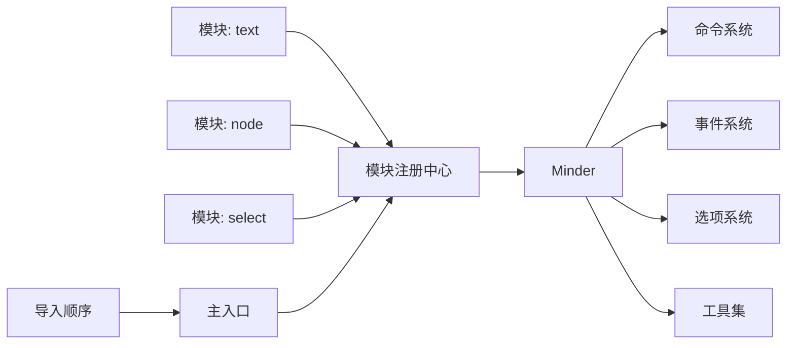

# 模块API

<cite>
**本文引用的文件**
- [src/core/module.js](file://src/core/module.js)
- [src/core/minder.js](file://src/core/minder.js)
- [src/core/command.js](file://src/core/command.js)
- [src/core/event.js](file://src/core/event.js)
- [src/core/option.js](file://src/core/option.js)
- [src/core/utils.js](file://src/core/utils.js)
- [src/module/text.js](file://src/module/text.js)
- [src/module/node.js](file://src/module/node.js)
- [src/module/select.js](file://src/module/select.js)
- [src/kityminder.js](file://src/kityminder.js)
- [import.js](file://import.js)
</cite>

## 目录
1. [简介](#简介)
2. [项目结构](#项目结构)
3. [核心组件](#核心组件)
4. [架构总览](#架构总览)
5. [详细组件分析](#详细组件分析)
6. [依赖关系分析](#依赖关系分析)
7. [性能考量](#性能考量)
8. [故障排查指南](#故障排查指南)
9. [结论](#结论)
10. [附录](#附录)

## 简介
本文件面向模块系统的使用者与扩展开发者，系统性梳理模块注册与生命周期机制，重点围绕 register 方法、模块对象结构（init、commands、events、destroy、reset）、命令与事件的集成方式，以及模块间加载顺序与依赖关系。文档同时给出模块定义与使用的最佳实践，帮助读者快速、安全地扩展 KityMinder 的能力边界。

## 项目结构
模块系统位于核心层，通过模块注册中心统一管理模块；模块在 Minder 实例初始化阶段按序加载，完成命令注册、事件绑定、渲染器装配与快捷键注入等任务；部分模块以函数形式导出，以便在 Minder 上下文中动态执行。

图表来源
- [src/core/module.js](file://src/core/module.js#L1-L151)
- [src/core/minder.js](file://src/core/minder.js#L1-L41)
- [src/core/command.js](file://src/core/command.js#L1-L169)
- [src/core/event.js](file://src/core/event.js#L1-L270)
- [src/core/option.js](file://src/core/option.js#L1-L34)
- [src/module/text.js](file://src/module/text.js#L1-L289)
- [src/module/node.js](file://src/module/node.js#L1-L150)
- [src/module/select.js](file://src/module/select.js#L1-L184)
- [src/kityminder.js](file://src/kityminder.js#L39-L81)
- [import.js](file://import.js#L1-L52)

章节来源
- [src/kityminder.js](file://src/kityminder.js#L39-L81)
- [import.js](file://import.js#L1-L52)

## 核心组件
- 模块注册中心：提供模块注册接口与模块生命周期调度，负责在 Minder 初始化钩子中触发模块加载。
- Minder 类：承载模块生命周期、命令池、事件系统、渲染器类集合、默认选项与实例状态。
- 命令系统：定义命令抽象，提供查询状态/值与执行命令的统一入口。
- 事件系统：封装 MinderEvent，提供事件分发、冒泡控制与状态感知的事件回调机制。
- 选项系统：提供默认选项与运行时选项合并策略。
- 工具集：提供 keys、extend、uuid 等通用工具。

章节来源
- [src/core/module.js](file://src/core/module.js#L1-L151)
- [src/core/minder.js](file://src/core/minder.js#L1-L41)
- [src/core/command.js](file://src/core/command.js#L1-L169)
- [src/core/event.js](file://src/core/event.js#L1-L270)
- [src/core/option.js](file://src/core/option.js#L1-L34)
- [src/core/utils.js](file://src/core/utils.js#L1-L66)

## 架构总览
模块系统采用“注册-初始化-装配”的三段式流程：
- 注册阶段：模块通过注册中心登记，键名为模块名，值可为对象或函数。
- 初始化阶段：Minder 在构造完成后执行注册的初始化钩子，触发模块加载。
- 装配阶段：遍历待加载模块列表，执行模块函数或直接取对象，提取 defaultOptions、init、commands、events、renderers、commandShortcutKeys 等字段，完成命令注册、事件绑定、渲染器装配与快捷键注入。

图表来源
- [src/core/module.js](file://src/core/module.js#L14-L118)
- [src/core/minder.js](file://src/core/minder.js#L13-L30)
- [src/core/command.js](file://src/core/command.js#L58-L166)
- [src/core/event.js](file://src/core/event.js#L232-L266)

## 详细组件分析

### 模块注册与生命周期
- 注册接口
  - 名称：字符串，作为模块唯一标识。
  - 模块：对象或函数。若为函数，将在 Minder 实例上下文中执行，返回模块对象；若为对象，直接使用。
- 生命周期钩子
  - Minder 在构造完成后执行注册的初始化钩子，触发模块加载。
  - 加载顺序：优先使用 Minder 选项中的模块列表；若未设置，则按注册顺序遍历。
- 生命周期方法
  - init：在模块加载后调用，接收 Minder 的运行时选项作为参数，用于初始化状态、默认值等。
  - destroy：在 Minder 销毁时调用，用于释放模块持有的资源。
  - reset：在 Minder 重置时调用，用于清理模块内部状态但不销毁实例。

图表来源
- [src/core/module.js](file://src/core/module.js#L14-L118)

章节来源
- [src/core/module.js](file://src/core/module.js#L1-L151)
- [src/core/minder.js](file://src/core/minder.js#L13-L30)
- [src/core/option.js](file://src/core/option.js#L14-L33)
- [src/core/utils.js](file://src/core/utils.js#L21-L29)

### 命令系统与模块命令
- 命令抽象
  - 命令类提供执行、查询状态/值、内容变更标记、是否需要撤销等能力。
  - Minder 提供统一的命令查询与执行入口，支持事件驱动的命令执行前后钩子。
- 模块命令注册
  - 模块通过 commands 字段将命令名映射到命令类，模块加载时会被实例化并注册到 Minder 的命令池。
  - 命令名在注册时会转换为小写，便于大小写无关访问。

图表来源
- [src/core/command.js](file://src/core/command.js#L1-L169)
- [src/module/text.js](file://src/module/text.js#L245-L262)
- [src/module/node.js](file://src/module/node.js#L19-L131)

章节来源
- [src/core/command.js](file://src/core/command.js#L1-L169)
- [src/core/module.js](file://src/core/module.js#L83-L95)
- [src/module/text.js](file://src/module/text.js#L245-L262)
- [src/module/node.js](file://src/module/node.js#L19-L131)

### 事件系统与模块事件
- 事件模型
  - MinderEvent 封装事件类型、原始事件、坐标、目标节点、阻止传播等能力。
  - Minder 提供事件绑定、解绑、派发与状态感知的事件回调机制。
- 模块事件绑定
  - 模块通过 events 字段声明事件类型到回调的映射，模块加载时会调用 Minder.on 进行绑定。
  - 支持状态前缀事件（如 normal.keydown），实现状态相关的事件处理。

图表来源
- [src/core/event.js](file://src/core/event.js#L133-L266)
- [src/core/module.js](file://src/core/module.js#L90-L95)
- [src/module/select.js](file://src/module/select.js#L119-L181)

章节来源
- [src/core/event.js](file://src/core/event.js#L1-L270)
- [src/core/module.js](file://src/core/module.js#L90-L95)
- [src/module/select.js](file://src/module/select.js#L119-L181)

### 渲染器与快捷键
- 渲染器装配
  - 模块通过 renderers 字段声明渲染器类型到渲染器类的映射，模块加载时会合并到 Minder 的渲染器类集合中。
- 快捷键注入
  - 模块通过 commandShortcutKeys 字段声明命令名到快捷键映射，模块加载时会注入到 Minder 的快捷键系统。

章节来源
- [src/core/module.js](file://src/core/module.js#L97-L117)
- [src/module/text.js](file://src/module/text.js#L278-L285)
- [src/module/node.js](file://src/module/node.js#L133-L149)

### 默认选项与加载顺序
- 默认选项
  - 模块可通过 defaultOptions 字段提供默认配置，Minder 在加载时将其合并到默认选项集中。
- 加载顺序
  - 若 Minder 选项中设置了 modules 数组，则按该数组顺序加载；否则按模块注册顺序加载。
- 入口与打包
  - 主入口会按依赖顺序引入各模块，确保模块在注册中心可用后再进行实例化。

章节来源
- [src/core/module.js](file://src/core/module.js#L49-L55)
- [src/core/option.js](file://src/core/option.js#L14-L33)
- [src/kityminder.js](file://src/kityminder.js#L39-L81)
- [import.js](file://import.js#L1-L52)

### 销毁与重置
- 销毁
  - Minder.destroy 会重置事件、清空画布、依次调用每个已加载模块的 destroy 方法进行资源清理。
- 重置
  - Minder.reset 会清空画布、依次调用每个已加载模块的 reset 方法进行状态复位。

章节来源
- [src/core/module.js](file://src/core/module.js#L128-L149)

## 依赖关系分析
- 模块注册中心依赖 Minder 的初始化钩子机制，确保在实例构造完成后执行模块加载。
- Minder 依赖命令系统、事件系统、选项系统与工具集，以完成命令注册、事件派发与配置合并。
- 模块示例依赖核心模块与工具集，通过注册中心暴露模块对象或函数。
- 主入口与开发导入顺序保证模块在注册中心可用之前已被加载。

图表来源
- [src/core/module.js](file://src/core/module.js#L1-L151)
- [src/core/minder.js](file://src/core/minder.js#L1-L41)
- [src/core/command.js](file://src/core/command.js#L1-L169)
- [src/core/event.js](file://src/core/event.js#L1-L270)
- [src/core/option.js](file://src/core/option.js#L1-L34)
- [src/module/text.js](file://src/module/text.js#L1-L289)
- [src/module/node.js](file://src/module/node.js#L1-L150)
- [src/module/select.js](file://src/module/select.js#L1-L184)
- [src/kityminder.js](file://src/kityminder.js#L39-L81)
- [import.js](file://import.js#L1-L52)

章节来源
- [src/core/module.js](file://src/core/module.js#L1-L151)
- [src/kityminder.js](file://src/kityminder.js#L39-L81)
- [import.js](file://import.js#L1-L52)

## 性能考量
- 命令注册与事件绑定发生在实例初始化阶段，避免在运行期重复装配。
- 渲染器类集合按类型聚合，减少重复实例化成本。
- 事件派发采用状态感知的回调队列，避免无效回调执行。
- 模块加载顺序可控，有助于按需加载与懒加载策略的实施。

[本节为通用指导，不涉及具体文件分析]

## 故障排查指南
- 模块未生效
  - 检查模块是否已通过注册中心注册，名称是否正确。
  - 确认 Minder 选项中 modules 是否包含该模块名，或模块是否在注册顺序中。
- 命令无法执行
  - 检查命令是否正确注册到 commands，名称大小写是否一致。
  - 确认命令状态查询返回非禁用值。
- 事件未触发
  - 检查事件类型与状态前缀是否匹配，确认回调是否正确绑定。
  - 使用 Minder.on/off 进行事件监听与解绑验证。
- 销毁/重置异常
  - 确认模块是否实现了 destroy/reset 方法，确保资源释放逻辑正确。

章节来源
- [src/core/module.js](file://src/core/module.js#L83-L118)
- [src/core/command.js](file://src/core/command.js#L58-L166)
- [src/core/event.js](file://src/core/event.js#L232-L266)

## 结论
模块系统通过注册中心与 Minder 的初始化钩子，实现了模块的统一加载与装配。模块对象需提供 init、commands、events、destroy、reset 等可选字段，以满足初始化、命令扩展、事件监听、资源清理与状态复位的需求。通过 defaultOptions、renderers、commandShortcutKeys 等字段，模块还能提供默认配置、渲染器与快捷键支持。模块加载顺序由 Minder 选项控制，确保可预测的装配行为。

[本节为总结性内容，不涉及具体文件分析]

## 附录

### registerModule 静态方法详解
- 参数
  - name：模块名称（字符串），作为模块唯一标识。
  - module：模块对象或函数。若为函数，会在 Minder 实例上下文中执行，返回模块对象；若为对象，直接使用。
- 返回
  - 无显式返回值，仅完成模块注册。
- 注意事项
  - 函数形式的模块应返回包含上述生命周期字段的对象。
  - 命令名在注册时会转换为小写，大小写不敏感。

章节来源
- [src/core/module.js](file://src/core/module.js#L9-L11)

### init 方法调用时机与 options 参数
- 调用时机
  - 在模块加载阶段，若模块对象包含 init 方法，将在模块装配后调用。
- options 参数
  - 传入 Minder 的运行时选项，模块可据此初始化状态、默认值等。

章节来源
- [src/core/module.js](file://src/core/module.js#L53-L55)

### commands 对象与命令映射
- 映射规则
  - 将命令名映射到命令类，模块加载时会实例化命令类并注册到 Minder 的命令池。
  - 命令名会转换为小写，便于访问。
- 使用建议
  - 命令类应继承命令基类，实现执行与查询方法。
  - 合理设置内容变更与选择变更标记，影响后续交互与撤销机制。

章节来源
- [src/core/module.js](file://src/core/module.js#L83-L95)
- [src/core/command.js](file://src/core/command.js#L58-L166)
- [src/module/text.js](file://src/module/text.js#L245-L262)
- [src/module/node.js](file://src/module/node.js#L133-L149)

### events 对象与事件监听
- 监听方式
  - 通过 events 字段声明事件类型到回调的映射，模块加载时调用 Minder.on 进行绑定。
  - 支持状态前缀事件（如 normal.keydown），实现状态相关的事件处理。
- 事件对象
  - 回调接收 MinderEvent 对象，可读取事件类型、坐标、目标节点、原始事件等信息，并可阻止传播。

章节来源
- [src/core/module.js](file://src/core/module.js#L90-L95)
- [src/core/event.js](file://src/core/event.js#L133-L266)
- [src/module/select.js](file://src/module/select.js#L119-L181)

### destroy 方法与资源清理
- 触发时机
  - 在 Minder.destroy 时，依次调用每个已加载模块的 destroy 方法。
- 作用
  - 释放模块持有的资源，避免内存泄漏与外部事件残留。

章节来源
- [src/core/module.js](file://src/core/module.js#L128-L138)

### reset 方法与状态复位
- 触发时机
  - 在 Minder.reset 时，依次调用每个已加载模块的 reset 方法。
- 作用
  - 清理模块内部状态，保持实例可继续使用。

章节来源
- [src/core/module.js](file://src/core/module.js#L140-L149)

### 完整模块定义示例（步骤说明）
以下为一个典型模块定义的步骤说明，帮助你编写自定义模块：
- 步骤1：在模块文件中定义命令类（继承命令基类），实现执行与查询方法。
- 步骤2：定义模块对象，包含 commands 字段（命令名到命令类的映射）。
- 步骤3：（可选）在模块对象中提供 events 字段，声明事件监听。
- 步骤4：（可选）在模块对象中提供 defaultOptions、renderers、commandShortcutKeys 等字段。
- 步骤5：通过注册中心注册模块（名称与模块对象/函数）。
- 步骤6：在 Minder 选项中设置 modules 数组，确保模块按预期顺序加载。

参考示例文件：
- 文本模块：展示了命令与渲染器的注册方式。
- 节点模块：展示了多命令与快捷键的注册方式。
- 选择模块：展示了事件监听与状态前缀事件的使用方式。

章节来源
- [src/module/text.js](file://src/module/text.js#L245-L285)
- [src/module/node.js](file://src/module/node.js#L133-L149)
- [src/module/select.js](file://src/module/select.js#L119-L181)