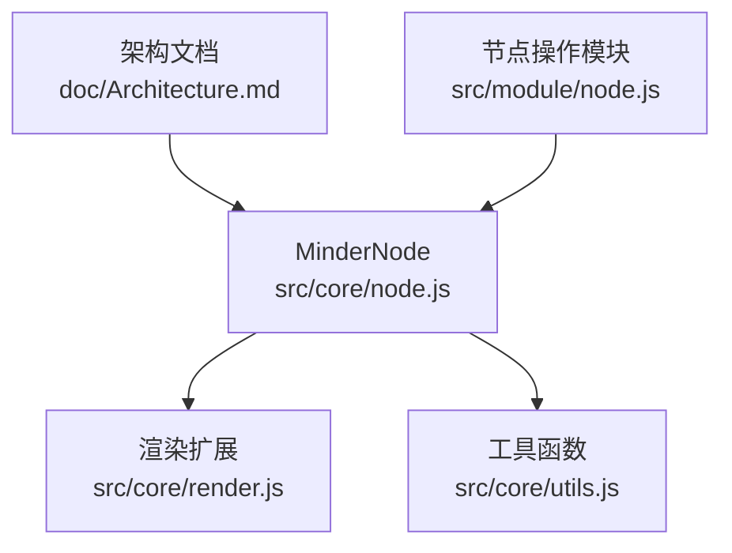
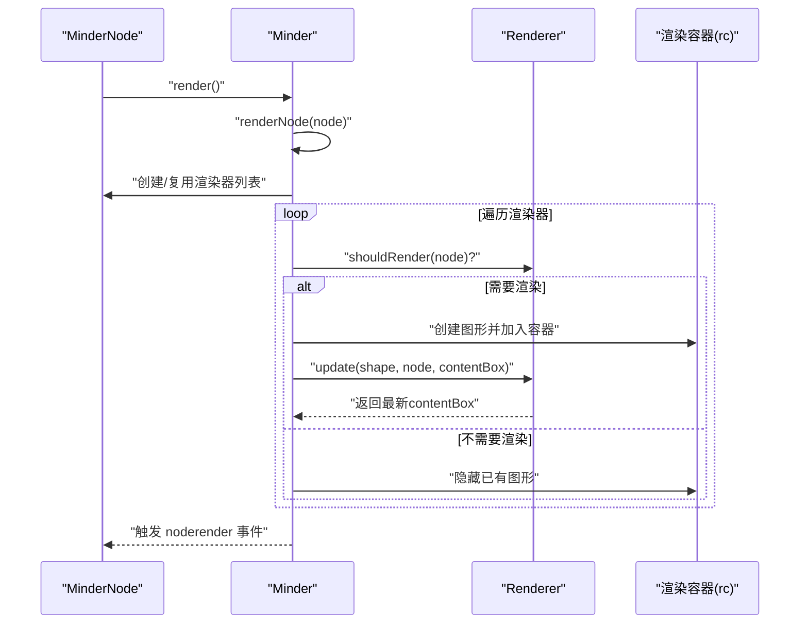
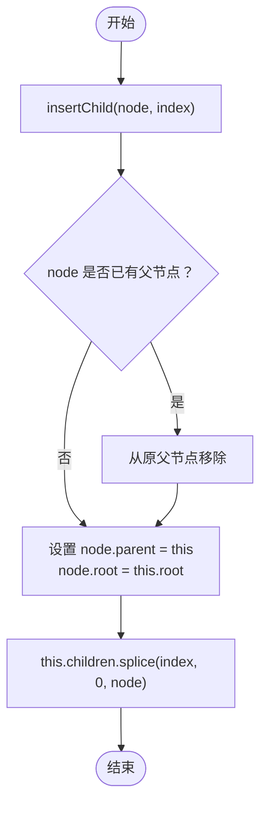
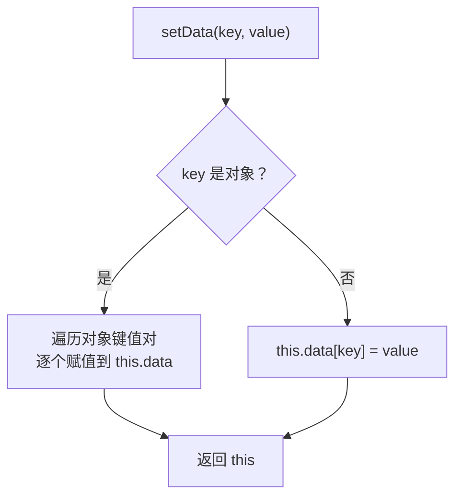
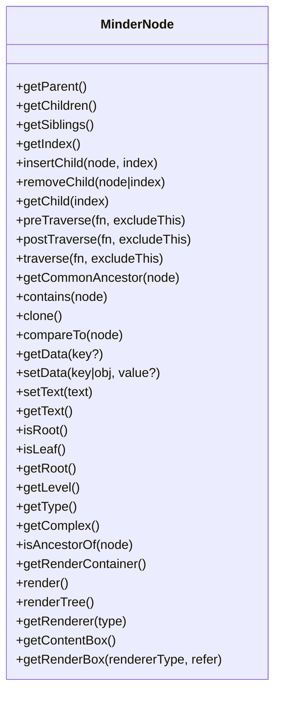
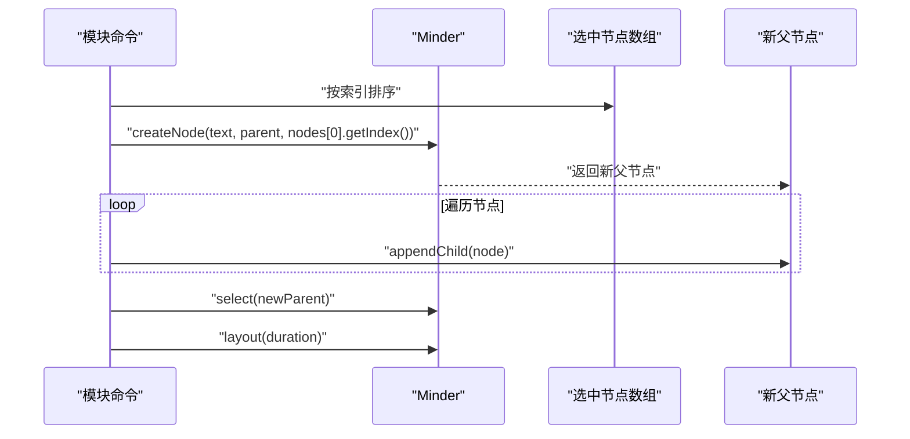
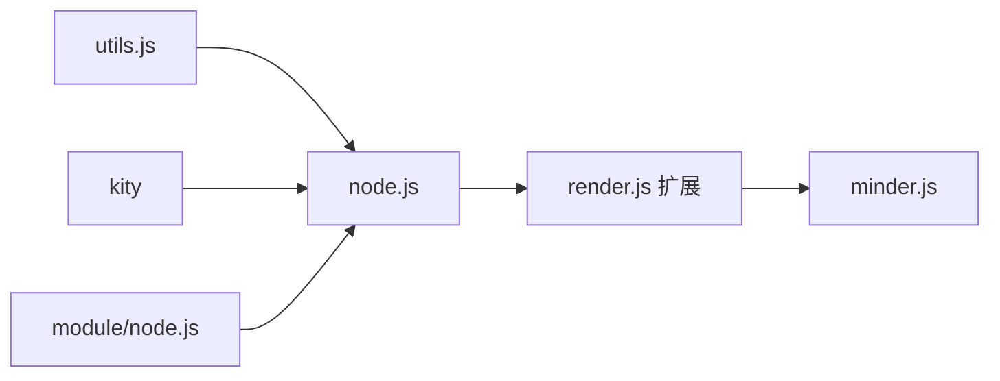

# 节点API

<cite>
**本文引用的文件**
- [src/core/node.js](file://src/core/node.js)
- [src/core/render.js](file://src/core/render.js)
- [src/core/utils.js](file://src/core/utils.js)
- [doc/Architecture.md](file://doc/Architecture.md)
- [src/module/node.js](file://src/module/node.js)
</cite>

## 目录
1. [简介](#简介)
2. [项目结构](#项目结构)
3. [核心组件](#核心组件)
4. [架构总览](#架构总览)
5. [详细组件分析](#详细组件分析)
6. [依赖分析](#依赖分析)
7. [性能考虑](#性能考虑)
8. [故障排查指南](#故障排查指南)
9. [结论](#结论)
10. [附录](#附录)

## 简介
本文件面向使用者与开发者，系统化梳理 MinderNode 类的 API，覆盖树遍历、数据存取、克隆、渲染与状态查询等能力，并结合实际代码路径给出使用建议与注意事项。重点包括：
- 树遍历：getParent、getChildren、getSiblings、getIndex、insertChild/removeChild/appendChild/prependChild/clearChildren/getChild
- 数据存取：getData、setData、setText、getText
- 结构修改：clone、contains、getCommonAncestor
- 渲染：render、renderTree、getRenderContainer、getRenderer、getContentBox、getRenderBox
- 状态查询：isRoot、isLeaf、getLevel、getType、getComplex、isAncestorOf
- 高级树操作：preTraverse/postTraverse/traverse

## 项目结构
围绕 MinderNode 的相关实现主要分布在 core 层与模块层：
- 核心节点类：src/core/node.js
- 渲染扩展：src/core/render.js（在 MinderNode 上扩展了渲染相关方法）
- 工具函数：src/core/utils.js（如 guid、clone、comparePlainObject）
- 架构文档：doc/Architecture.md（概述节点职责与公开字段）
- 节点操作模块：src/module/node.js（演示如何使用节点 API 进行批量操作）

图表来源
- [src/core/node.js](file://src/core/node.js#L1-L40)
- [src/core/render.js](file://src/core/render.js#L223-L259)
- [src/core/utils.js](file://src/core/utils.js#L1-L66)
- [doc/Architecture.md](file://doc/Architecture.md#L256-L306)
- [src/module/node.js](file://src/module/node.js#L108-L150)

章节来源
- [src/core/node.js](file://src/core/node.js#L1-L40)
- [src/core/render.js](file://src/core/render.js#L223-L259)
- [src/core/utils.js](file://src/core/utils.js#L1-L66)
- [doc/Architecture.md](file://doc/Architecture.md#L256-L306)
- [src/module/node.js](file://src/module/node.js#L108-L150)

## 核心组件
- MinderNode：树节点实体，维护父子关系、数据字典、渲染容器，提供树遍历与结构修改方法。
- Renderer：渲染器抽象，MinderNode 通过扩展获得渲染能力。
- Utils：通用工具，提供克隆、比较、类型判断等辅助能力。

章节来源
- [src/core/node.js](file://src/core/node.js#L1-L40)
- [src/core/render.js](file://src/core/render.js#L1-L58)
- [src/core/utils.js](file://src/core/utils.js#L1-L66)

## 架构总览
MinderNode 与渲染系统的协作流程如下：
- MinderNode 持有渲染容器 rc（Kity.Group），并通过扩展方法 render/renderTree 将节点及其子树交给 Minder 的渲染管线。
- 渲染管线根据注册的渲染器集合，逐个阶段绘制与定位节点图形元素，并维护 contentBox 与最终渲染盒。

图表来源
- [src/core/render.js](file://src/core/render.js#L165-L219)
- [src/core/render.js](file://src/core/render.js#L223-L259)

## 详细组件分析

### 树遍历与结构修改
- getParent：获取父节点指针
- getChildren：获取子节点数组
- getSiblings：获取兄弟节点数组（不含自身）
- getIndex：获取在父节点中的索引，无父节点时返回 -1
- insertChild/appendChild/prependChild：插入子节点，支持指定索引；若目标节点已有父节点，会先移除其原有父链
- removeChild：按节点或索引移除子节点，并重置被移除节点的 root 与 parent
- clearChildren：清空子节点
- getChild：按索引获取子节点
- preTraverse/postTraverse/traverse：先序/后序/后序遍历（traverse 默认后序）
- getCommonAncestor：求公共祖先（支持多节点）
- contains：判断是否为某节点的祖先或自身

图表来源
- [src/core/node.js](file://src/core/node.js#L199-L210)

章节来源
- [src/core/node.js](file://src/core/node.js#L69-L96)
- [src/core/node.js](file://src/core/node.js#L163-L189)
- [src/core/node.js](file://src/core/node.js#L191-L239)
- [src/core/node.js](file://src/core/node.js#L245-L251)

### 数据存取与文本坐标
- getData(key?)：读取单字段或整个 data 对象
- setData(key|obj, value?)：写入单字段或批量写入对象
- setText(text)：设置 data.text
- getText()：读取 data.text
- 公开字段建议：x、y、text 等（参见架构文档）

图表来源
- [src/core/node.js](file://src/core/node.js#L130-L145)

章节来源
- [src/core/node.js](file://src/core/node.js#L130-L161)
- [doc/Architecture.md](file://doc/Architecture.md#L282-L301)

### 节点状态查询
- isRoot：判断是否为根节点
- isLeaf：判断是否为叶子
- getRoot：获取根节点引用
- getLevel：计算深度（从父链向上计数）
- getType：根据层级映射为 root/main/sub
- getComplex：统计子树节点总数
- isAncestorOf：判断是否为另一个节点的祖先

章节来源
- [src/core/node.js](file://src/core/node.js#L47-L115)
- [src/core/node.js](file://src/core/node.js#L98-L115)

### 克隆与比较
- clone：深拷贝节点数据与子树（递归克隆子节点）
- compareTo：比较节点数据与子树结构（逐层对比）

章节来源
- [src/core/node.js](file://src/core/node.js#L253-L278)
- [src/core/utils.js](file://src/core/utils.js#L31-L37)

### 渲染与渲染容器
- getRenderContainer：获取 Kity.Group 渲染容器
- render：单节点渲染（需已附加到画布）
- renderTree：整棵子树批量渲染（遍历收集后交由渲染管线）
- getRenderer(type)：按类型查找已注册渲染器
- getContentBox：获取内容盒（collapsed 时返回空盒）
- getRenderBox(rendererType, refer)：计算相对参考坐标系的渲染盒

图表来源
- [src/core/node.js](file://src/core/node.js#L69-L283)
- [src/core/render.js](file://src/core/render.js#L223-L259)

章节来源
- [src/core/node.js](file://src/core/node.js#L241-L283)
- [src/core/render.js](file://src/core/render.js#L223-L259)

### 高级树操作与使用示例
- getCommonAncestor：支持两节点或多个节点的公共祖先计算
- preTraverse/postTraverse/traverse：遍历子树，可用于统计、筛选、批量修改
- 在模块中使用节点 API 的示例：将多个同级节点合并为一个父节点，同时保持布局变换一致

图表来源
- [src/module/node.js](file://src/module/node.js#L108-L150)

章节来源
- [src/core/node.js](file://src/core/node.js#L245-L251)
- [src/module/node.js](file://src/module/node.js#L108-L150)

## 依赖分析
- MinderNode 依赖 kity（图形库）、utils（工具）、Minder（根节点与全局上下文）
- 渲染扩展依赖 MinderNode 与 Renderer 抽象
- 模块层通过 MinderNode 的 API 实现批量节点操作

图表来源
- [src/core/node.js](file://src/core/node.js#L1-L10)
- [src/core/render.js](file://src/core/render.js#L1-L10)
- [src/module/node.js](file://src/module/node.js#L108-L150)

章节来源
- [src/core/node.js](file://src/core/node.js#L1-L10)
- [src/core/render.js](file://src/core/render.js#L1-L10)
- [src/module/node.js](file://src/module/node.js#L108-L150)

## 性能考虑
- 遍历与克隆：preTraverse/postTraverse/traverse/clone 会对子树进行递归访问，节点规模较大时应避免频繁触发
- 批量渲染：renderTree 会一次性遍历并渲染整棵子树，适合在结构稳定后再统一刷新
- 数据写入：setData 支持批量对象写入，建议合并多次写入以减少重复渲染
- 容器操作：getRenderContainer 返回的是 Kity.Group，直接加入/移除图形会影响 DOM 数量，应尽量减少不必要的图形重建

## 故障排查指南
- 父子关系异常
  - 症状：insertChild 后父链不一致或 removeChild 后 root 未重置
  - 处理：确保 insertChild 之前目标节点无父节点；removeChild 会重置 removed.parent 与 removed.root，请确认传入的是节点实例或有效索引
- 渲染未生效
  - 症状：调用 render/renderTree 后图形未出现
  - 处理：确认节点已被附加到画布（attached=true），且渲染容器 rc 已加入 Minder 的渲染容器
- 数据读取为空
  - 症状：getData('text') 或 getData('x'|'y') 返回空
  - 处理：确认已通过 setText 或 setData 设置对应字段；注意默认 data 中包含 id 与 created 字段

章节来源
- [src/core/node.js](file://src/core/node.js#L199-L231)
- [src/core/render.js](file://src/core/render.js#L223-L259)
- [src/core/node.js](file://src/core/node.js#L130-L161)

## 结论
MinderNode 提供了完备的树节点管理与渲染集成能力。通过树遍历、数据存取、结构修改与渲染扩展，开发者可以在不直接操作底层图形的情况下完成复杂的脑图编辑与展示任务。建议在大规模节点场景下合理使用批量渲染与遍历策略，以获得更好的性能体验。

## 附录
- 公开字段与典型用途（来自架构文档）
  - text：节点文本
  - x/y：节点坐标
  - id：节点唯一标识（自动生成）
  - created：创建时间戳（自动生成）

章节来源
- [doc/Architecture.md](file://doc/Architecture.md#L282-L301)