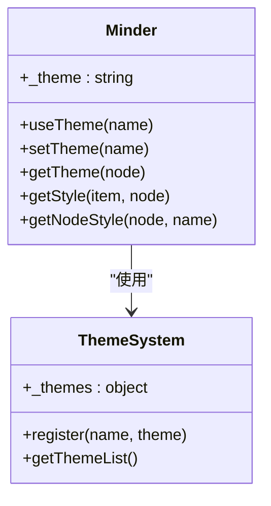
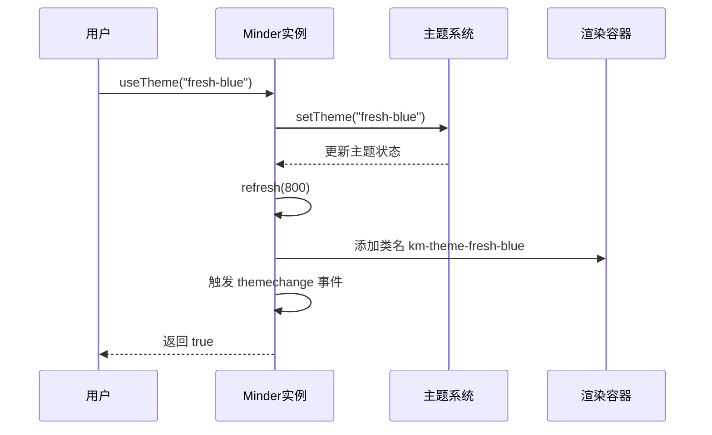
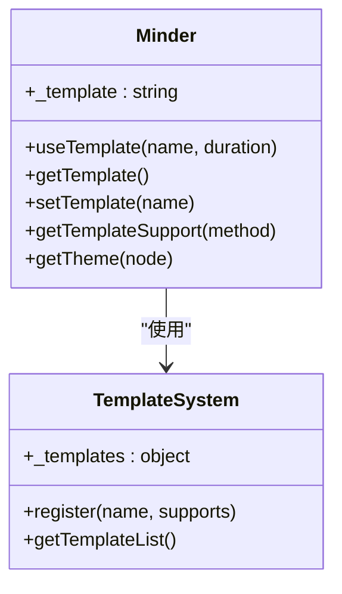
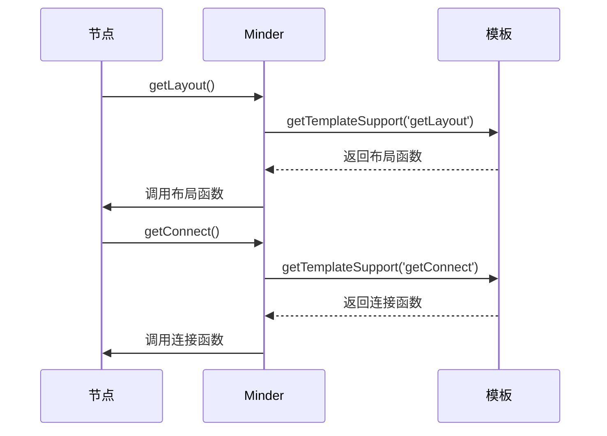

# 主题与模板

<cite>
**本文档中引用的文件**  
- [theme.js](file://src/core/theme.js)
- [template.js](file://src/core/template.js)
- [default.js](file://src/theme/default.js)
- [fresh.js](file://src/theme/fresh.js)
- [snow.js](file://src/theme/snow.js)
- [wire.js](file://src/theme/wire.js)
- [fish.js](file://src/theme/fish.js)
- [tianpan.js](file://src/theme/tianpan.js)
- [default.js](file://src/template/default.js)
- [filetree.js](file://src/template/filetree.js)
- [fish-bone.js](file://src/template/fish-bone.js)
- [tianpan.js](file://src/template/tianpan.js)
- [structure.js](file://src/template/structure.js)
- [right.js](file://src/template/right.js)
- [mind.js](file://src/layout/mind.js)
- [filetree.js](file://src/layout/filetree.js)
- [arc.js](file://src/connect/arc.js)
- [l.js](file://src/connect/l.js)
</cite>

## 目录
1. [简介](#简介)
2. [主题系统](#主题系统)
3. [内置主题详解](#内置主题详解)
4. [模板系统](#模板系统)
5. [内置模板详解](#内置模板详解)
6. [自定义主题与模板开发指南](#自定义主题与模板开发指南)
7. [结论](#结论)

## 简介

本项目是一个功能强大的思维导图核心库，提供了灵活的主题和模板系统，允许用户自定义视觉样式和结构布局。主题系统控制颜色、字体、边距、阴影等视觉属性，而模板系统则定义了节点的排列方式和连接线的样式。通过组合不同的主题和模板，用户可以创建出风格各异的思维导图，满足从专业演示到个人笔记的各种需求。

**Section sources**
- [theme.js](file://src/core/theme.js#L1-L175)
- [template.js](file://src/core/template.js#L1-L92)

## 主题系统

主题系统是控制思维导图外观的核心机制。它通过 `theme.js` 文件实现，提供了一套完整的 API 来注册、获取和切换主题。每个主题本质上是一个包含样式规则的 JSON 对象，这些规则定义了从根节点到子节点的所有视觉属性。

### 主题注册与管理

主题通过 `Minder.registerTheme()` 方法进行注册。该方法接受主题名称和一个包含样式项的配置对象作为参数。所有注册的主题都存储在一个全局的 `_themes` 对象中，可以通过 `Minder.getThemeList()` 方法查询。



**Diagram sources**
- [theme.js](file://src/core/theme.js#L26-L43)
- [theme.js](file://src/core/theme.js#L47-L49)

### 样式获取机制

`getStyle()` 方法是主题系统的核心，它负责根据样式名称从当前主题中获取对应的值。该方法支持两种形式的样式项：直接样式（如 `root-color`）和 CSS 类数组样式（如 `padding-left`）。对于后者，系统会尝试匹配主样式（如 `padding`），并根据方向（left, right, top, bottom）提取数组中的对应值。

例如，如果主题定义了 `'root-padding': [10, 20]`，那么调用 `getStyle('root-padding-left')` 将返回 `20`。

### 运行时主题切换

用户可以通过 `useTheme()` 方法在运行时动态切换主题。该方法会调用 `setTheme()` 来更新内部状态，并触发 `refresh()` 方法重新渲染整个思维导图。同时，它还会在渲染容器上添加或移除相应的 CSS 类名（如 `km-theme-fresh-blue`），以便应用主题相关的 CSS 样式。



**Diagram sources**
- [theme.js](file://src/core/theme.js#L58-L64)
- [theme.js](file://src/core/theme.js#L66-L81)

**Section sources**
- [theme.js](file://src/core/theme.js#L58-L81)

## 内置主题详解

本项目提供了多种内置主题，每种主题都有其独特的视觉风格和适用场景。

### 经典主题 (classic)

经典主题采用深色背景和高对比度的色彩搭配，根节点为醒目的黄色，主节点为绿色，营造出专业且稳重的视觉效果。适用于需要突出重点内容的演示文稿或正式文档。

**视觉特性**:
- 背景: 深灰色纹理
- 根节点: 黄色背景，深绿色文字
- 主节点: 青绿色背景，白色文字
- 子节点: 透明背景，白色文字
- 连接线: 白色圆弧

**适用场景**: 企业演示、学术报告、项目规划

### 清新主题 (fresh)

清新主题系列提供多种颜色变体（红、橙、绿、蓝、紫、粉），以浅色背景和柔和的 HSL 色彩为主，整体风格现代、清爽。`fresh-blue` 是默认主题，适合日常笔记和创意发散。

**视觉特性**:
- 背景: 纯白色
- 根节点: HSL 色彩背景，白色文字
- 主节点: 浅色背景，黑色文字
- 边框: 细线描边
- 选中状态: 加粗描边

**适用场景**: 日常笔记、头脑风暴、个人知识管理

### 雪白主题 (snow)

雪白主题与经典主题类似，但采用了更简洁的白色背景和更小的圆角，整体感觉更加干净、现代。子节点有白色背景，层次感更强。

**视觉特性**:
- 背景: 深灰色纹理
- 根节点: 黄色背景，深绿色文字
- 主节点: 青绿色背景，白色文字
- 子节点: 白色背景，黑色文字
- 连接线: 白色直线

**适用场景**: 简洁风格的演示、需要高可读性的文档

### 线框主题 (wire)

线框主题采用极简设计，黑色背景上只有灰色的文字和线条，几乎没有背景色填充，非常适合在低光环境下使用或创建技术架构图。

**视觉特性**:
- 背景: 纯黑色
- 所有节点: 灰色文字，无背景
- 连接线: 灰色直线
- 极简风格

**适用场景**: 技术文档、代码架构图、夜间模式

### 鱼骨主题 (fish)

鱼骨主题的根节点为超大圆形，具有强烈的视觉中心感，适合用于中心思想非常突出的思维导图。

**视觉特性**:
- 根节点: 超大圆形，黄色背景
- 连接线: 较粗的白色线条
- 强调中心节点

**适用场景**: 中心思想明确的创意发散、品牌策划

### 天盘主题 (tianpan)

天盘主题的所有节点均为圆形，布局呈放射状，连接线为圆弧，整体呈现出一种和谐、平衡的东方美学。

**视觉特性**:
- 所有节点: 圆形
- 布局: 放射状
- 连接线: 圆弧
- 和谐的色彩搭配

**适用场景**: 传统文化主题、哲学思考、平衡分析

**Section sources**
- [default.js](file://src/theme/default.js#L4-L65)
- [fresh.js](file://src/theme/fresh.js#L9-L76)
- [snow.js](file://src/theme/snow.js#L4-L61)
- [wire.js](file://src/theme/wire.js#L4-L33)
- [fish.js](file://src/theme/fish.js#L4-L56)
- [tianpan.js](file://src/theme/tianpan.js#L4-L68)

## 模板系统

模板系统负责定义思维导图的整体结构和布局规则。它通过 `template.js` 文件实现，允许开发者定义节点的排列方式（`getLayout`）和连接线的绘制方式（`getConnect`）。

### 模板注册与管理

模板通过 `template.register()` 方法进行注册。与主题类似，所有模板都存储在一个全局的 `_templates` 对象中，并可通过 `Minder.getTemplateList()` 查询。



**Diagram sources**
- [template.js](file://src/core/template.js#L11-L13)
- [template.js](file://src/core/template.js#L17-L19)

### 模板与主题的协同

一个关键的设计是模板可以覆盖主题的行为。例如，在 `getTheme()` 方法中，如果当前模板提供了 `getTheme` 支持函数，则会优先使用模板的函数，否则回退到默认的主题获取逻辑。这使得模板可以动态地根据节点状态选择不同的主题。

### 布局与连接机制

模板通过 `getLayout()` 和 `getConnect()` 两个核心方法来控制节点的布局和连接。`getLayout()` 决定节点使用哪种布局算法（如 `right`, `left`, `bottom`），而 `getConnect()` 决定使用哪种连接线样式（如 `arc`, `l`, `poly`）。



**Diagram sources**
- [template.js](file://src/core/template.js#L55-L63)
- [template.js](file://src/core/template.js#L38-L41)

**Section sources**
- [template.js](file://src/core/template.js#L22-L47)

## 内置模板详解

### 默认模板 (default)

默认模板采用经典的左右对称布局，根节点居中，一级子节点分布在左右两侧，形成树状结构。

**结构规则**:
- 根节点: 使用 `mind` 布局
- 一级节点: 根据位置自动选择 `left` 或 `right`
- 二级及以下: 继承父节点布局
- 连接线: 一级节点使用圆弧(`arc`)，其他使用下接(`under`)

**适用场景**: 通用思维导图、知识体系构建

### 文件树模板 (filetree)

文件树模板模仿操作系统的文件夹结构，所有节点垂直向下排列，非常适合表示层级关系。

**结构规则**:
- 根节点: 使用 `bottom` 布局
- 其他节点: 使用 `filetree-down` 布局
- 连接线: 一级节点使用多段线(`poly`)，其他使用"L"形线(`l`)

**适用场景**: 目录结构、组织架构、文件系统

### 鱼骨图模板 (fish-bone)

鱼骨图模板专为鱼骨图（因果分析图）设计，根节点水平延伸，一级节点作为主因分支，二级节点作为子因分支。

**结构规则**:
- 根节点: `fish-bone-master` 布局
- 一级节点: `fish-bone-slave` 布局
- 二级及以下: 根据位置选择 `filetree-up` 或 `filetree-down`
- 连接线: 分别使用 `fish-bone-master`, `line`, `l`

**适用场景**: 因果分析、问题诊断、质量管理

### 天盘模板 (tianpan)

天盘模板采用放射状圆形布局，所有节点围绕中心呈圆形排列，连接线为圆弧，极具视觉美感。

**结构规则**:
- 根节点: `tianpan` 布局
- 其他节点: 继承父节点布局
- 连接线: 统一使用 `arc_tp` (特殊圆弧)

**适用场景**: 中心主题发散、创意构思、传统文化主题

### 组织结构图模板 (structure)

组织结构图模板采用严格的自上而下布局，所有节点垂直排列，连接线为多段线，适合表示正式的层级关系。

**结构规则**:
- 所有节点: 使用 `bottom` 布局
- 连接线: 统一使用 `poly` (多段线)

**适用场景**: 公司组织架构、项目团队、行政体系

### 右向布局模板 (right)

右向布局模板强制所有节点向右排列，形成线性结构，适合表示流程或时间序列。

**结构规则**:
- 所有节点: 使用 `right` 布局
- 连接线: 一级节点使用圆弧，其他使用贝塞尔曲线(`bezier`)

**适用场景**: 工作流程、时间线、操作步骤

**Section sources**
- [default.js](file://src/template/default.js#L12-L37)
- [filetree.js](file://src/template/filetree.js#L12-L27)
- [fish-bone.js](file://src/template/fish-bone.js#L12-L40)
- [tianpan.js](file://src/template/tianpan.js#L12-L28)
- [structure.js](file://src/template/structure.js#L12-L21)
- [right.js](file://src/template/right.js#L12-L22)

## 自定义主题与模板开发指南

### 自定义主题开发

要创建自定义主题，需要调用 `Minder.registerTheme()` 方法并提供一个样式配置对象。配置项通常包括：

- **颜色**: `*-color`, `*-background`, `*-stroke`
- **字体**: `*-font-size`
- **间距**: `*-padding`, `*-margin`
- **形状**: `*-radius`, `*-shape`
- **阴影**: `*-shadow`
- **连接线**: `connect-*`

```javascript
Minder.registerTheme('my-theme', {
    'background': '#f0f0f0',
    'root-color': '#333',
    'root-background': '#ffeb3b',
    'root-font-size': 20,
    // ... 其他样式项
});
```

**最佳实践**:
- 保持样式项的命名一致性
- 提供完整的节点类型样式（root, main, sub）
- 考虑选中状态和拖拽提示的样式
- 使用相对单位（如数组形式的 padding）以提高适应性

### 自定义模板开发

要创建自定义模板，需要调用 `template.register()` 方法并提供一个包含 `getLayout` 和 `getConnect` 函数的对象。

```javascript
template.register('my-template', {
    getLayout: function(node) {
        if (node.isRoot()) return 'mind';
        return 'right'; // 强制所有子节点向右
    },
    getConnect: function(node) {
        return 'bezier'; // 使用贝塞尔曲线连接
    }
});
```

**最佳实践**:
- 在 `getLayout` 中检查 `node.getData('layout')` 以支持用户手动设置
- 使用 `node.getLevel()` 来区分不同层级的节点
- 考虑性能，避免在函数中进行复杂计算
- 提供清晰的文档说明模板的适用场景

**Section sources**
- [theme.js](file://src/core/theme.js#L41-L43)
- [template.js](file://src/core/template.js#L11-L13)

## 结论

本项目的主题和模板系统提供了高度的灵活性和可扩展性。主题系统通过丰富的样式配置项实现了多样化的视觉表现，而模板系统则通过可编程的布局和连接规则定义了思维导图的结构骨架。两者的有机结合使得用户能够轻松创建出既美观又实用的思维导图。通过理解这些系统的工作原理，开发者可以充分利用现有功能，或根据特定需求开发出个性化的主题和模板，极大地扩展了本库的应用场景。