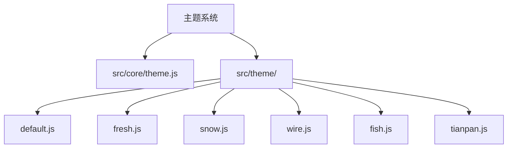
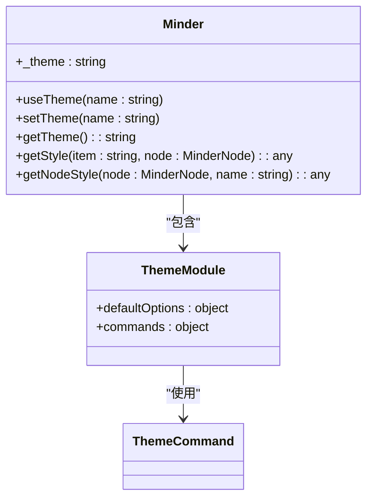
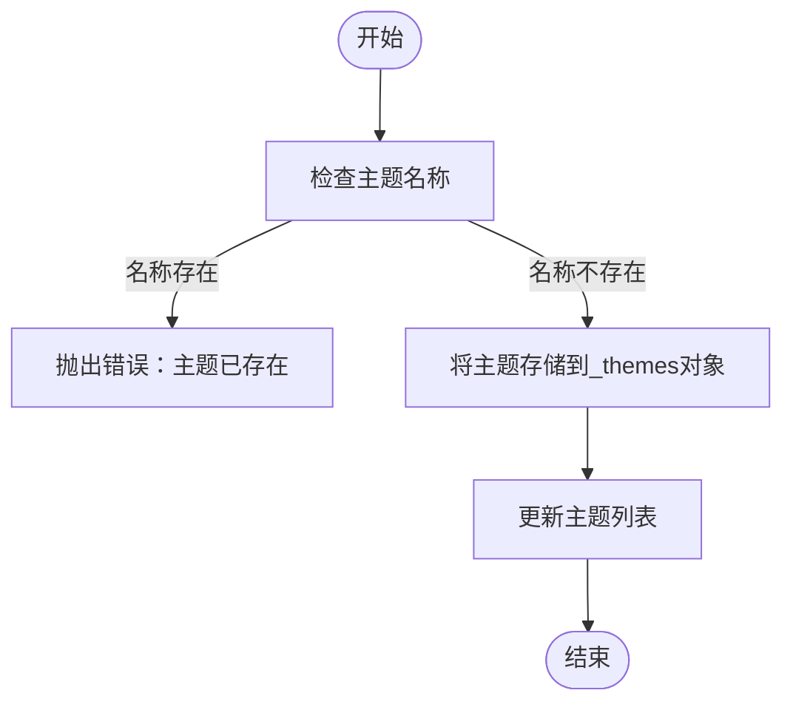
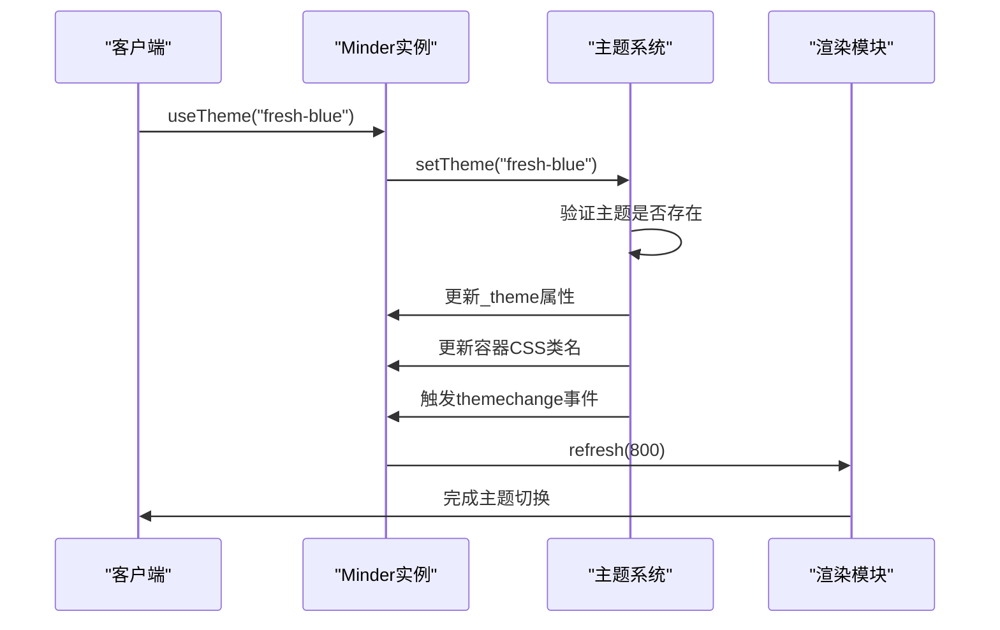
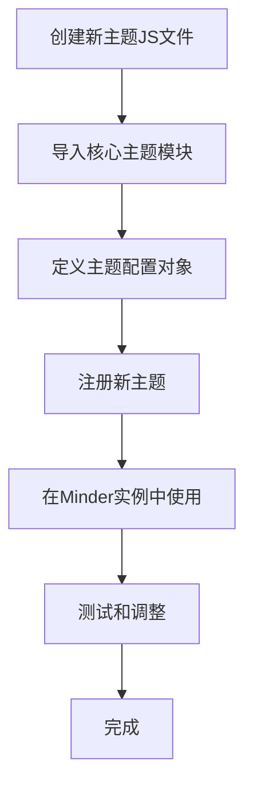
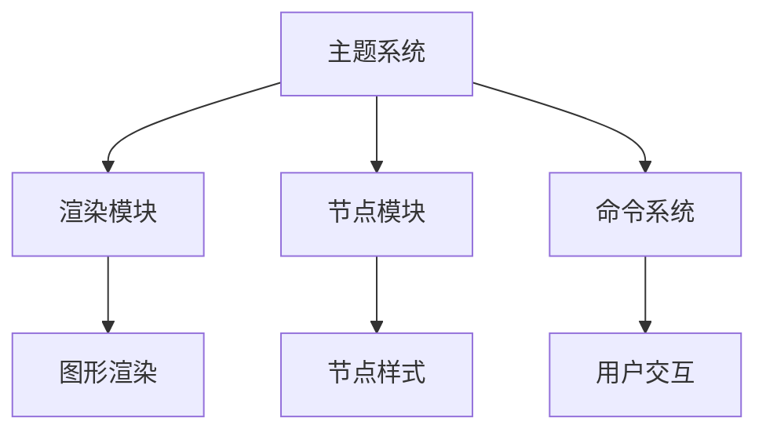

# 主题系统

<cite>
**本文档引用的文件**
- [theme.js](file://src/core/theme.js)
- [default.js](file://src/theme/default.js)
- [fresh.js](file://src/theme/fresh.js)
- [snow.js](file://src/theme/snow.js)
- [wire.js](file://src/theme/wire.js)
- [fish.js](file://src/theme/fish.js)
- [tianpan.js](file://src/theme/tianpan.js)
- [minder.js](file://src/core/minder.js)
- [render.js](file://src/core/render.js)
- [node.js](file://src/core/node.js)
- [style.js](file://src/module/style.js)
- [kityminder.css](file://src/kityminder.css)
</cite>

## 目录
1. [简介](#简介)
2. [项目结构](#项目结构)
3. [核心组件](#核心组件)
4. [架构概述](#架构概述)
5. [详细组件分析](#详细组件分析)
6. [依赖分析](#依赖分析)
7. [性能考虑](#性能考虑)
8. [故障排除指南](#故障排除指南)
9. [结论](#结论)

## 简介
主题系统是KityMinder脑图编辑器的核心视觉管理模块，负责定义和控制脑图的外观样式。该系统提供了灵活的主题注册、加载和动态切换机制，支持多种内置主题（如默认、清新、雪白、线框、鱼骨、天盘等），并允许开发者创建自定义主题。主题系统通过JavaScript对象定义视觉属性，包括颜色方案、字体样式、节点边框、连接线样式等，并与渲染模块紧密集成，确保在运行时能够高效地应用和切换主题。

## 项目结构
主题系统在KityMinder项目中具有清晰的目录结构，主要分为核心主题管理模块和具体主题实现两部分。核心管理逻辑位于`src/core/theme.js`，而各个具体主题的实现则分布在`src/theme/`目录下。



**Diagram sources**
- [theme.js](file://src/core/theme.js)
- [default.js](file://src/theme/default.js)
- [fresh.js](file://src/theme/fresh.js)
- [snow.js](file://src/theme/snow.js)
- [wire.js](file://src/theme/wire.js)
- [fish.js](file://src/theme/fish.js)
- [tianpan.js](file://src/theme/tianpan.js)

**Section sources**
- [theme.js](file://src/core/theme.js)
- [default.js](file://src/theme/default.js)
- [fresh.js](file://src/theme/fresh.js)
- [snow.js](file://src/theme/snow.js)
- [wire.js](file://src/theme/wire.js)
- [fish.js](file://src/theme/fish.js)
- [tianpan.js](file://src/theme/tianpan.js)

## 核心组件
主题系统的核心组件包括主题注册机制、主题切换流程、样式获取接口和默认主题配置。`theme.js`文件定义了主题管理的主要功能，通过`register`函数注册新主题，使用`setTheme`和`useTheme`方法进行主题切换，并通过`getStyle`和`getNodeStyle`方法获取节点样式。系统还集成了命令模式，通过`ThemeCommand`实现主题切换的命令操作。

**Section sources**
- [theme.js](file://src/core/theme.js#L26-L175)
- [minder.js](file://src/core/minder.js#L15-L41)

## 架构概述
主题系统的架构设计遵循模块化原则，将主题管理功能封装在独立的模块中。系统通过全局的`_themes`对象存储所有注册的主题，每个主题以名称为键，样式配置对象为值。当调用`useTheme`方法时，系统会更新脑图实例的当前主题，并触发重新渲染，同时通过CSS类名`km-theme-{themeName}`将主题应用到渲染容器上。



**Diagram sources**
- [theme.js](file://src/core/theme.js#L52-L175)
- [minder.js](file://src/core/minder.js#L15-L41)

## 详细组件分析

### 主题注册与管理分析
主题系统提供了完整的主题注册和管理功能，允许动态添加和查询主题。通过`Minder.registerTheme`方法可以注册新的主题，所有注册的主题都存储在全局的`_themes`对象中，可以通过`Minder.getThemeList()`方法查询。

#### 主题注册流程


**Diagram sources**
- [theme.js](file://src/core/theme.js#L41-L44)

### 主题切换机制分析
主题切换是主题系统的核心功能之一，通过`useTheme`方法实现。该方法不仅更新当前主题，还会触发脑图的重新渲染，确保视觉效果的即时更新。

#### 主题切换流程


**Diagram sources**
- [theme.js](file://src/core/theme.js#L58-L64)
- [render.js](file://src/core/render.js#L86-L163)

### 内置主题配置分析
KityMinder提供了多种内置主题，每种主题都有独特的视觉风格和适用场景。这些主题通过JavaScript对象定义其样式配置，包括颜色方案、字体样式、节点边框、连接线样式等视觉属性。

#### 主题配置结构
```mermaid
erDiagram
THEME ||--o{ STYLE : "包含"
STYLE ||--o{ PROPERTY : "包含"
THEME {
string name PK
object config
}
STYLE {
string nodeType
string styleType
}
PROPERTY {
string name PK
string value
string type
}
```

**Diagram sources**
- [default.js](file://src/theme/default.js)
- [fresh.js](file://src/theme/fresh.js)
- [snow.js](file://src/theme/snow.js)
- [wire.js](file://src/theme/wire.js)
- [fish.js](file://src/theme/fish.js)
- [tianpan.js](file://src/theme/tianpan.js)

### 自定义主题开发指南
开发者可以创建自定义主题来满足特定的视觉需求。自定义主题需要创建一个新的JS文件，继承基础样式并覆盖默认配置。可以通过CSS变量或JavaScript对象进行深度定制。

#### 自定义主题开发流程


**Diagram sources**
- [theme.js](file://src/core/theme.js#L41-L44)
- [fresh.js](file://src/theme/fresh.js#L9-L62)

## 依赖分析
主题系统与其他核心模块有着紧密的依赖关系，特别是与渲染模块和节点模块的集成。主题系统通过`getStyle`方法为渲染模块提供样式信息，而节点模块则通过`getNodeStyle`方法获取特定节点的样式。



**Diagram sources**
- [theme.js](file://src/core/theme.js)
- [render.js](file://src/core/render.js)
- [node.js](file://src/core/node.js)
- [style.js](file://src/module/style.js)

**Section sources**
- [theme.js](file://src/core/theme.js)
- [render.js](file://src/core/render.js)
- [node.js](file://src/core/node.js)
- [style.js](file://src/module/style.js)

## 性能考虑
主题系统在设计时充分考虑了性能因素。通过缓存机制和高效的样式查找算法，确保在大规模脑图中也能快速应用和切换主题。系统采用惰性渲染策略，只有在必要时才重新绘制节点，减少了不必要的性能开销。

## 故障排除指南
在使用主题系统时可能会遇到一些常见问题，如主题不生效、样式冲突等。这些问题通常可以通过检查主题名称拼写、确保主题已正确注册、验证CSS类名应用等方式解决。

**Section sources**
- [theme.js](file://src/core/theme.js#L67-L68)
- [kityminder.css](file://src/kityminder.css)

## 结论
KityMinder的主题系统是一个功能强大且灵活的视觉管理模块，通过清晰的架构设计和丰富的API接口，为开发者提供了完整的主题管理解决方案。系统不仅支持多种内置主题，还允许轻松创建和集成自定义主题，满足不同场景下的视觉需求。与渲染模块的紧密集成确保了高效的性能表现，使用户能够流畅地进行主题切换和样式调整。