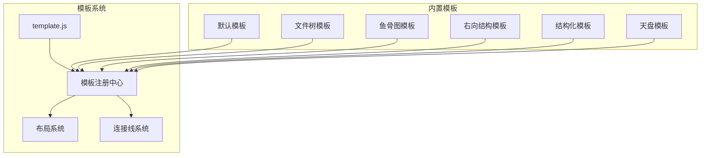
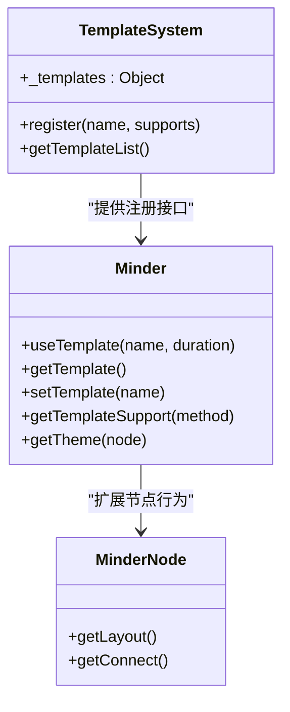
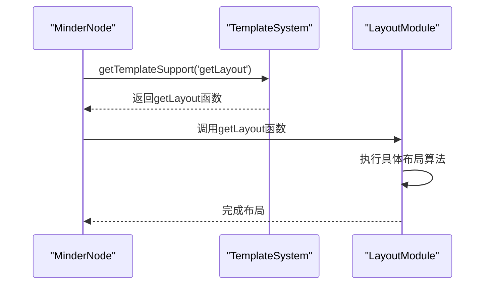
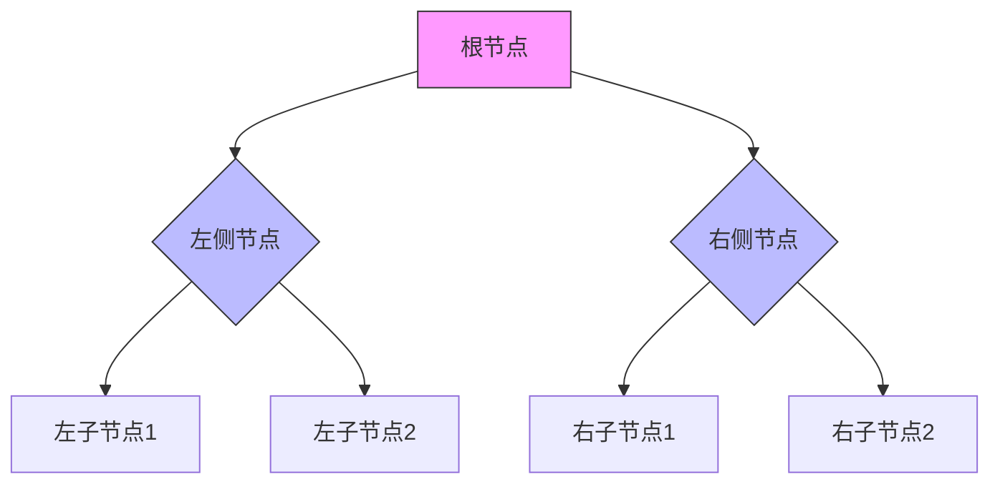
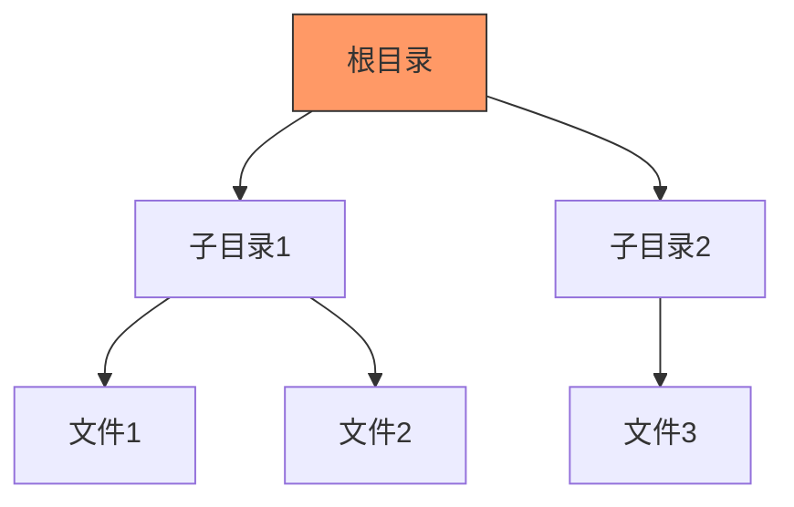
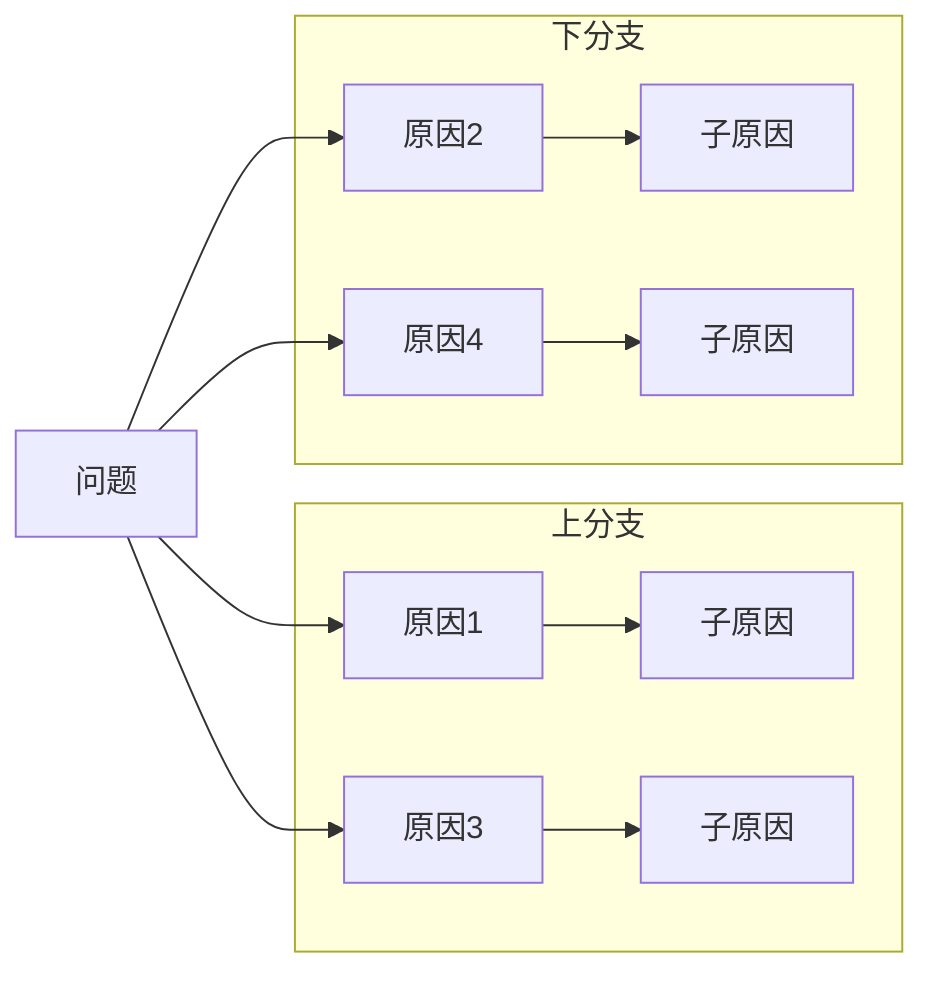
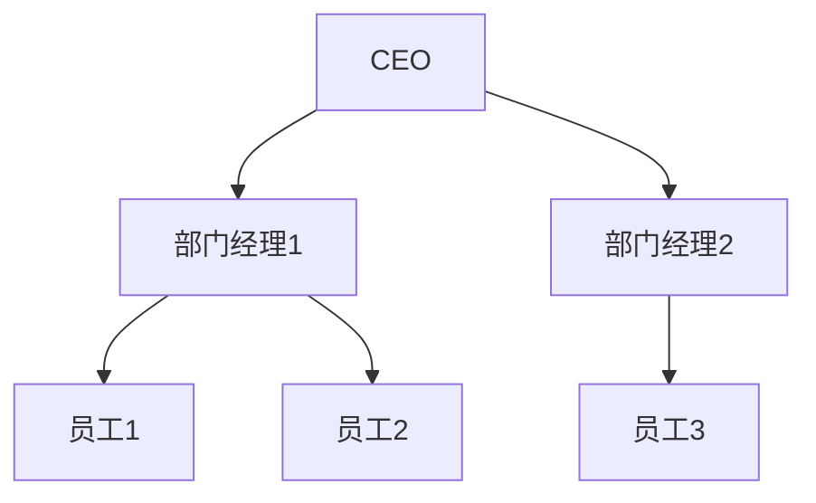
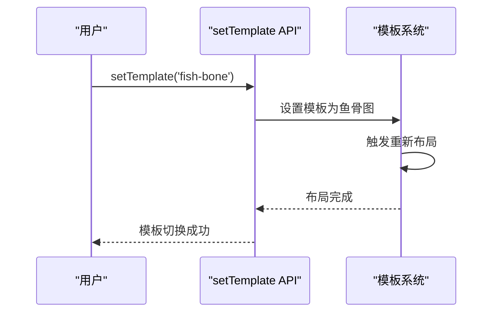
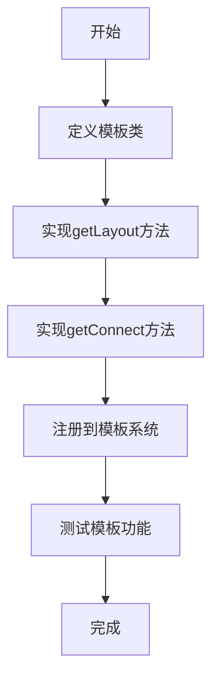
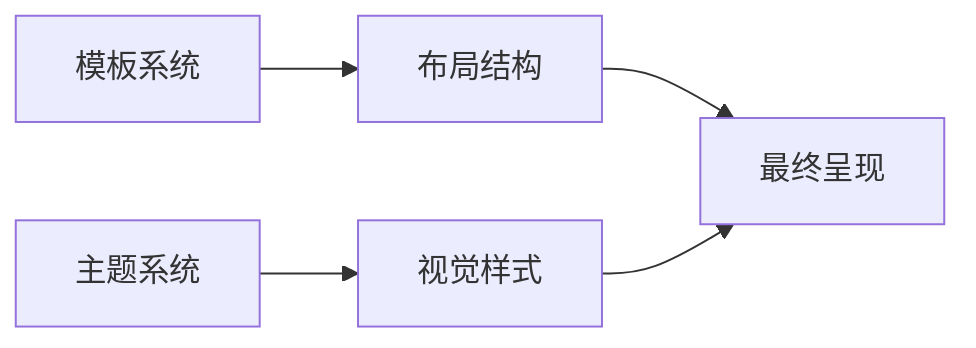

# 模板系统

<cite>
**本文档引用的文件**  
- [template.js](file://src/core/template.js)
- [default.js](file://src/template/default.js)
- [filetree.js](file://src/template/filetree.js)
- [fish-bone.js](file://src/template/fish-bone.js)
- [right.js](file://src/template/right.js)
- [structure.js](file://src/template/structure.js)
- [tianpan.js](file://src/template/tianpan.js)
- [mind.js](file://src/layout/mind.js)
- [btree.js](file://src/layout/btree.js)
- [filetree-layout.js](file://src/layout/filetree.js)
- [fish-bone-master.js](file://src/layout/fish-bone-master.js)
- [fish-bone-slave.js](file://src/layout/fish-bone-slave.js)
- [tianpan-layout.js](file://src/layout/tianpan.js)
- [arc.js](file://src/connect/arc.js)
- [arc_tp.js](file://src/connect/arc_tp.js)
- [bezier.js](file://src/connect/bezier.js)
- [l.js](file://src/connect/l.js)
- [poly.js](file://src/connect/poly.js)
- [fish-bone-master-connect.js](file://src/connect/fish-bone-master.js)
</cite>

## 目录
1. [简介](#简介)
2. [模板系统架构](#模板系统架构)
3. [核心组件分析](#核心组件分析)
4. [内置模板详解](#内置模板详解)
5. [模板使用方法](#模板使用方法)
6. [自定义模板开发](#自定义模板开发)
7. [模板与主题协同](#模板与主题协同)
8. [性能优化建议](#性能优化建议)
9. [结论](#结论)

## 简介
模板系统是kityminder-core的核心功能之一，负责控制思维导图的整体结构布局。该系统通过定义不同的布局规则和连接线样式，实现了多种可视化结构，满足不同场景下的信息组织需求。本文档深入解析模板系统的实现原理与使用方法。

## 模板系统架构



**图示来源**  
- [template.js](file://src/core/template.js#L1-L92)
- [layout](file://src/layout/)
- [connect](file://src/connect/)

**本节来源**  
- [template.js](file://src/core/template.js#L1-L92)

## 核心组件分析

### 模板注册机制
模板系统通过全局注册表 `_templates` 存储所有模板的布局和连接线支持。每个模板通过 `register` 方法注册，包含 `getLayout` 和 `getConnect` 两个核心方法。



**图示来源**  
- [template.js](file://src/core/template.js#L9-L48)
- [template.js](file://src/core/template.js#L51-L65)

**本节来源**  
- [template.js](file://src/core/template.js#L1-L92)

### 布局系统协同
模板系统与布局模块通过布局名称进行协同工作。当节点请求布局时，模板系统返回对应的布局策略，由布局模块执行具体的布局算法。



**图示来源**  
- [template.js](file://src/core/template.js#L55-L58)
- [mind.js](file://src/layout/mind.js#L6-L62)
- [btree.js](file://src/layout/btree.js#L7-L143)

**本节来源**  
- [template.js](file://src/core/template.js#L51-L65)
- [mind.js](file://src/layout/mind.js#L1-L62)

## 内置模板详解

### 默认模板
默认模板采用双向延展结构，根节点居中，一级子节点根据位置分布在左右两侧，形成对称的脑图结构。



**图示来源**  
- [default.js](file://src/template/default.js#L12-L37)
- [mind.js](file://src/layout/mind.js#L6-L62)

**本节来源**  
- [default.js](file://src/template/default.js#L1-L38)

### 文件树模板
文件树模板采用单侧垂直布局，所有子节点垂直向下排列，形成类似文件目录的树状结构。



**图示来源**  
- [filetree.js](file://src/template/filetree.js#L12-L27)
- [filetree-layout.js](file://src/layout/filetree.js#L7-L89)

**本节来源**  
- [filetree.js](file://src/template/filetree.js#L1-L28)

### 鱼骨图模板
鱼骨图模板采用多分支对称结构，主干向右延伸，子节点交替分布在上下两侧，形成鱼骨状结构。



**图示来源**  
- [fish-bone.js](file://src/template/fish-bone.js#L12-L40)
- [fish-bone-master.js](file://src/layout/fish-bone-master.js#L14-L68)
- [fish-bone-slave.js](file://src/layout/fish-bone-slave.js#L14-L72)

**本节来源**  
- [fish-bone.js](file://src/template/fish-bone.js#L1-L41)

### 右向结构模板
右向结构模板采用单向水平布局，所有节点向右延伸，形成线性结构。


**图示来源**  
- [right.js](file://src/template/right.js#L12-L22)

**本节来源**  
- [right.js](file://src/template/right.js#L1-L23)

### 结构化模板
结构化模板采用均衡分布布局，所有子节点垂直向下排列，形成组织结构图样式。



**图示来源**  
- [structure.js](file://src/template/structure.js#L12-L21)

**本节来源**  
- [structure.js](file://src/template/structure.js#L1-L22)

### 天盘模板
天盘模板采用环形放射布局，子节点沿螺旋线向外放射分布，形成独特的圆形结构。

```mermaid
graph TD
Center[中心] --> A["节点A"]
Center --> B["节点B"]
Center --> C["节点C"]
Center --> D["节点D"]
Center --> E["节点E"]
style A transform:rotate(30deg)
style B transform:rotate(90deg)
style C transform:rotate(150deg)
style D transform:rotate(210deg)
style E transform:rotate(270deg)
```

**图示来源**  
- [tianpan.js](file://src/template/tianpan.js#L12-L28)
- [tianpan-layout.js](file://src/layout/tianpan.js#L14-L76)

**本节来源**  
- [tianpan.js](file://src/template/tianpan.js#L1-L29)

## 模板使用方法

### 动态切换模板
通过 `setTemplate` 方法可以动态切换模板，并触发重新布局。



**图示来源**  
- [template.js](file://src/core/template.js#L25-L28)
- [template.js](file://src/core/template.js#L78-L84)

**本节来源**  
- [template.js](file://src/core/template.js#L25-L28)
- [template.js](file://src/core/template.js#L78-L84)

## 自定义模板开发

### 自定义模板开发流程
开发自定义模板需要定义新的模板类，注册到模板系统，并实现自定义布局算法。



**本节来源**  
- [template.js](file://src/core/template.js#L11-L13)
- [default.js](file://src/template/default.js#L12-L37)

## 模板与主题协同
模板系统与主题系统协同工作，模板控制结构布局，主题控制视觉样式，两者共同决定思维导图的最终呈现效果。



**本节来源**  
- [template.js](file://src/core/template.js#L43-L46)

## 性能优化建议
在复杂场景下，建议采取以下性能优化措施：

1. 避免频繁切换模板
2. 对大型思维导图采用分步加载
3. 优化布局算法的计算复杂度
4. 合理使用缓存机制

**本节来源**  
- [template.js](file://src/core/template.js#L27)
- [layout](file://src/layout/)

## 结论
模板系统通过灵活的架构设计，实现了多种思维导图布局方式。系统采用注册机制管理模板，通过与布局模块和连接线模块的协同工作，提供了丰富的可视化结构选择。开发者可以基于现有架构轻松扩展自定义模板，满足特定场景的需求。