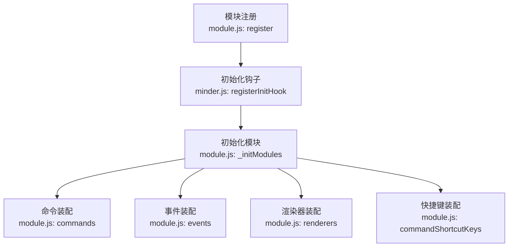
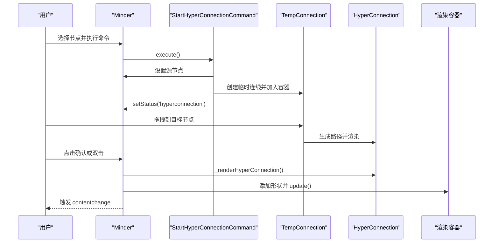
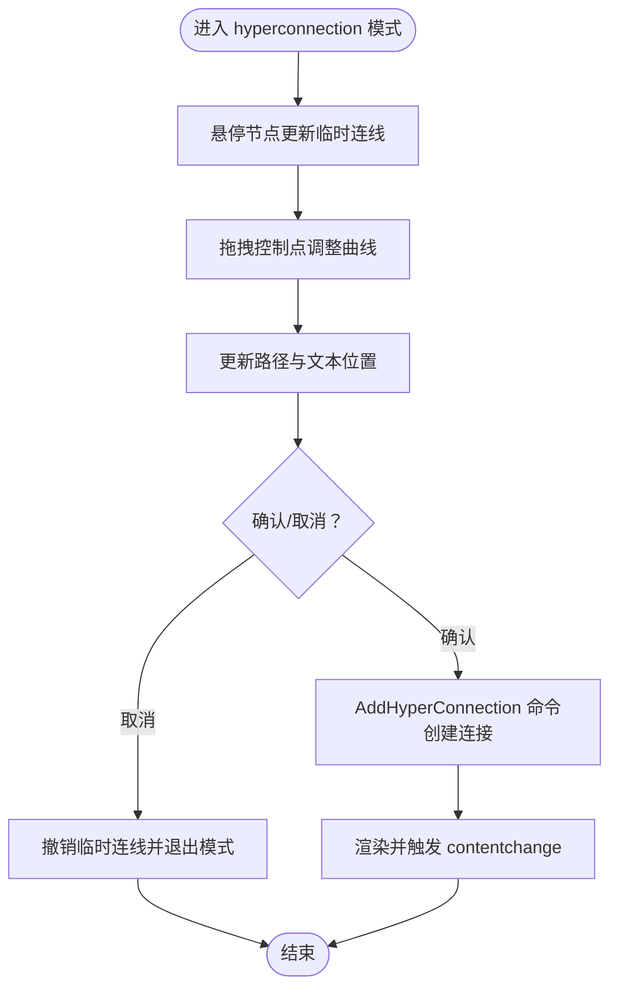
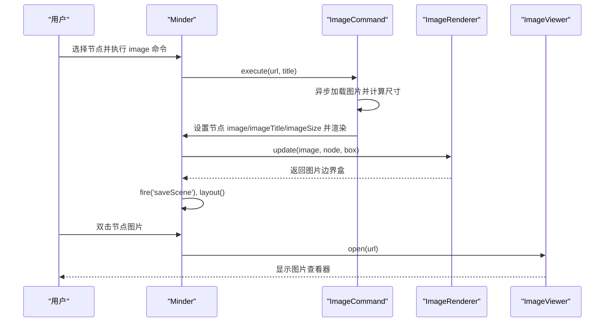
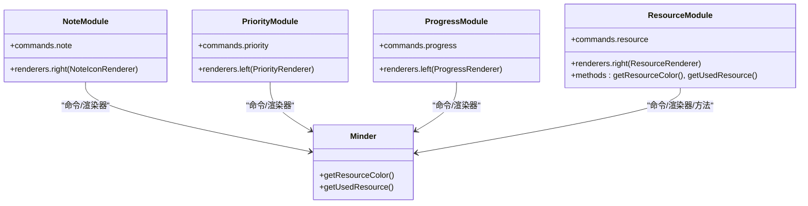
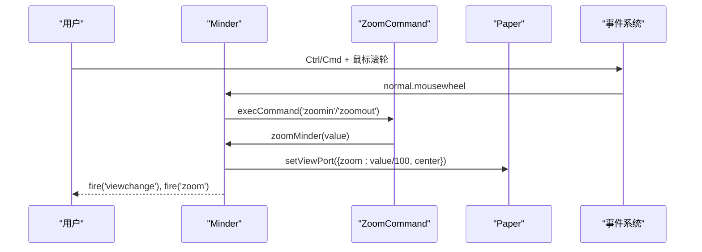
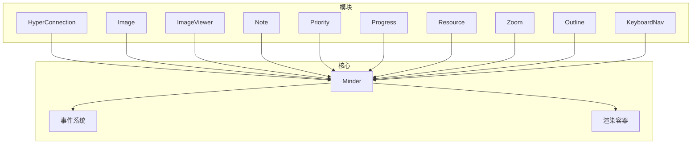

# 功能模块

<cite>
**本文引用的文件**
- [hyperconnection.js](file://src/module/hyperconnection.js)
- [image.js](file://src/module/image.js)
- [image-viewer.js](file://src/module/image-viewer.js)
- [note.js](file://src/module/note.js)
- [priority.js](file://src/module/priority.js)
- [progress.js](file://src/module/progress.js)
- [resource.js](file://src/module/resource.js)
- [zoom.js](file://src/module/zoom.js)
- [outline.js](file://src/module/outline.js)
- [keynav.js](file://src/module/keynav.js)
- [module.js](file://src/core/module.js)
- [minder.js](file://src/core/minder.js)
</cite>

## 目录
1. [简介](#简介)
2. [项目结构与模块系统](#项目结构与模块系统)
3. [核心组件总览](#核心组件总览)
4. [架构概览](#架构概览)
5. [详细组件分析](#详细组件分析)
   - [自由关联线模块（hyperconnection.js）](#自由关联线模块hyperconnectionjs)
   - [多媒体支持模块（image.js 与 image-viewer.js）](#多媒体支持模块imagejs-与-image-viewerjs)
   - [信息增强模块（note.js、priority.js、progress.js、resource.js）](#信息增强模块notejspriorityjsprogressjsresourcejs)
   - [交互增强模块（zoom.js、outline.js、keynav.js）](#交互增强模块zoomjs-outlinejs-keynavjs)
6. [依赖关系分析](#依赖关系分析)
7. [性能考量](#性能考量)
8. [故障排查指南](#故障排查指南)
9. [结论](#结论)

## 简介
本章节聚焦 TyMinder Core 的扩展能力，围绕以下主题展开：
- 自由关联线模块（hyperconnection.js）：突破树形结构限制，实现任意节点间自由关联，支持贝塞尔曲线、控制点拖拽、文本标注与事件交互。
- 多媒体支持模块：图片插入（image.js）与查看（image-viewer.js），支持图片尺寸适配、标题、点击放大等。
- 信息增强模块：备注（note.js）、优先级标记（priority.js）、进度显示（progress.js）、资源标记（resource.js）。
- 交互增强模块：缩放控制（zoom.js）、大纲模式（outline.js）、键盘导航（keynav.js）。
- 模块系统：各模块通过统一的模块注册机制接入核心，命令、渲染器、事件与快捷键均在生命周期内完成装配。

## 项目结构与模块系统
TyMinder 的模块系统采用“注册 + 初始化”的模式：
- 模块通过注册接口加入全局模块池。
- 核心在初始化钩子中遍历模块池，按模块导出对象装配命令、事件、渲染器与快捷键。
- 模块可声明默认选项，核心在初始化阶段合并到实例配置。

**图表来源**
- [module.js](file://src/core/module.js#L1-L151)
- [minder.js](file://src/core/minder.js#L1-L41)

**章节来源**
- [module.js](file://src/core/module.js#L1-L151)
- [minder.js](file://src/core/minder.js#L1-L41)

## 核心组件总览
- 自由关联线模块：提供任意节点间连接、贝塞尔曲线绘制、控制点拖拽、文本标注与事件分发。
- 多媒体模块：图片插入命令与渲染器、图片查看器弹窗与工具栏。
- 信息增强模块：备注图标、优先级图标、进度环形图标、资源标签覆盖层。
- 交互增强模块：缩放命令与滚轮事件、大纲渲染器、键盘方向导航。

**章节来源**
- [hyperconnection.js](file://src/module/hyperconnection.js#L1-L975)
- [image.js](file://src/module/image.js#L1-L147)
- [image-viewer.js](file://src/module/image-viewer.js#L1-L111)
- [note.js](file://src/module/note.js#L1-L116)
- [priority.js](file://src/module/priority.js#L1-L156)
- [progress.js](file://src/module/progress.js#L1-L160)
- [resource.js](file://src/module/resource.js#L1-L314)
- [zoom.js](file://src/module/zoom.js#L1-L195)
- [outline.js](file://src/module/outline.js#L1-L165)
- [keynav.js](file://src/module/keynav.js#L1-L171)

## 架构概览
模块系统在核心初始化时扫描模块池，将模块导出对象中的命令、事件、渲染器与快捷键注入到 Minder 实例。每个模块独立管理自己的状态、命令与渲染逻辑，彼此通过核心事件与数据共享协作。

```mermaid
classDiagram
class Minder {
+_initModules()
+execCommand(name, args)
+on(event, handler)
+fire(event, data)
+getPaper()
+getRoot()
+layout()
}
class ModuleSystem {
+register(name, factory)
+_initModules()
}
class HyperConnectionModule {
+commands : StartHyperConnection, AddHyperConnection, RemoveHyperConnection
+events : layoutallfinish, hyperconnection.*
+renderers : none
}
class ImageModule {
+commands : image
+renderers : top
+defaultOptions : maxImageWidth, maxImageHeight
}
class ImageViewerModule {
+init()
+events : normal.dblclick
}
class NoteModule {
+commands : note
+renderers : right
}
class PriorityModule {
+commands : priority
+renderers : left
}
class ProgressModule {
+commands : progress
+renderers : left
}
class ResourceModule {
+commands : resource
+renderers : right
+methods : getResourceColor(), getUsedResource()
}
class ZoomModule {
+commands : zoom, zoomin, zoomout
+events : normal.mousewheel, readonly.mousewheel
+defaultOptions : zoom
}
class OutlineModule {
+renderers : outline, outside
+events : ready, layoutallfinish
}
class KeyboardModule {
+events : layoutallfinish, normal.keydown, readonly.keydown
}
ModuleSystem --> Minder : "装配命令/事件/渲染器"
HyperConnectionModule --> Minder : "注册命令/事件"
ImageModule --> Minder : "注册命令/渲染器"
ImageViewerModule --> Minder : "注册事件"
NoteModule --> Minder : "注册命令/渲染器"
PriorityModule --> Minder : "注册命令/渲染器"
ProgressModule --> Minder : "注册命令/渲染器"
ResourceModule --> Minder : "注册命令/渲染器"
ZoomModule --> Minder : "注册命令/事件/默认选项"
OutlineModule --> Minder : "注册渲染器/事件"
KeyboardModule --> Minder : "注册事件"
```

**图表来源**
- [module.js](file://src/core/module.js#L1-L151)
- [hyperconnection.js](file://src/module/hyperconnection.js#L770-L975)
- [image.js](file://src/module/image.js#L1-L147)
- [image-viewer.js](file://src/module/image-viewer.js#L1-L111)
- [note.js](file://src/module/note.js#L1-L116)
- [priority.js](file://src/module/priority.js#L1-L156)
- [progress.js](file://src/module/progress.js#L1-L160)
- [resource.js](file://src/module/resource.js#L1-L314)
- [zoom.js](file://src/module/zoom.js#L1-L195)
- [outline.js](file://src/module/outline.js#L1-L165)
- [keynav.js](file://src/module/keynav.js#L1-L171)

## 详细组件分析

### 自由关联线模块（hyperconnection.js）
- 数据结构
  - 关联线对象字段：id、from、to、text、type、color、strokeWidth、controlPoint1、controlPoint2。
  - 支持箭头、直线、虚线三种类型；颜色与线宽可配置；控制点用于贝塞尔曲线形状微调。
- 渲染与交互
  - HyperConnection 渲染器：绘制三次贝塞尔曲线、透明热区、箭头标记、文本标签；支持控制点手柄拖拽；点击/双击事件透传至核心。
  - ControlHandle：控制点圆点与连接线，拖拽时更新控制点偏移并触发内容变更事件。
  - TempConnection：拖拽过程中的临时连线，基于起点与当前鼠标位置生成贝塞尔曲线。
- 命令体系
  - StartHyperConnectionCommand：进入 hyperconnection 模式，记录源节点并创建临时连线。
  - AddHyperConnectionCommand：校验重复后创建新连接，存储到数据并渲染；支持双向重复检测。
  - RemoveHyperConnectionCommand：根据 id 从数据与容器中移除连接。
- 核心集成
  - Minder 扩展：getHyperConnections/setHyperConnections/_renderHyperConnection/_renderAllHyperConnections/_removeHyperConnectionShape/_updateAllHyperConnections/_updateConnectionsForNode。
  - 模块注册：创建超连接容器，绑定布局完成后的更新事件，支持 ESC 退出模式。

**图表来源**
- [hyperconnection.js](file://src/module/hyperconnection.js#L570-L975)

**图表来源**
- [hyperconnection.js](file://src/module/hyperconnection.js#L1-L975)

**章节来源**
- [hyperconnection.js](file://src/module/hyperconnection.js#L1-L975)

### 多媒体支持模块（image.js 与 image-viewer.js）
- 图片插入（image.js）
  - 命令：image，支持设置/移除图片、标题与尺寸；异步加载图片以计算适配尺寸；触发保存场景与布局重绘。
  - 渲染器：在节点顶部区域渲染图片，居中放置并考虑顶部间距；支持 title 属性。
  - 默认选项：maxImageWidth、maxImageHeight。
- 图片查看（image-viewer.js）
  - 弹窗组件：工具栏按钮（关闭、查看源）、图片容器、工具栏显隐切换。
  - 事件：双击节点图片触发打开；ESC 关闭；点击图片切换放大模式；右键切换工具栏。
  - 与核心集成：在 normal.dblclick 事件中识别图片形状并打开查看器。

**图表来源**
- [image.js](file://src/module/image.js#L1-L147)
- [image-viewer.js](file://src/module/image-viewer.js#L1-L111)

**章节来源**
- [image.js](file://src/module/image.js#L1-L147)
- [image-viewer.js](file://src/module/image-viewer.js#L1-L111)

### 信息增强模块（note.js、priority.js、progress.js、resource.js）
- 备注（note.js）
  - 命令：note，设置/查询节点备注；渲染器在右侧显示便签图标，支持悬停显示与编辑请求事件。
- 优先级（priority.js）
  - 命令：priority，设置 0-9 的优先级；渲染器在左侧绘制彩色带数字的优先级图标，颜色按预设色板映射。
- 进度（progress.js）
  - 命令：progress，设置 0-9 的进度；渲染器在左侧绘制饼图进度与完成勾选，9 表示全部完成。
- 资源（resource.js）
  - 命令：resource，设置/查询资源数组；渲染器在右侧绘制资源覆盖层，按资源名分配颜色（内置色板或哈希色）。
  - 核心扩展：提供资源颜色映射与哈希函数，保证资源名到颜色的一致性与可扩展性。

**图表来源**
- [note.js](file://src/module/note.js#L1-L116)
- [priority.js](file://src/module/priority.js#L1-L156)
- [progress.js](file://src/module/progress.js#L1-L160)
- [resource.js](file://src/module/resource.js#L1-L314)
- [minder.js](file://src/core/minder.js#L1-L41)

**章节来源**
- [note.js](file://src/module/note.js#L1-L116)
- [priority.js](file://src/module/priority.js#L1-L156)
- [progress.js](file://src/module/progress.js#L1-L160)
- [resource.js](file://src/module/resource.js#L1-L314)

### 交互增强模块（zoom.js、outline.js、keynav.js）
- 缩放控制（zoom.js）
  - 命令：zoom（设置具体比例）、zoomin（下一等级）、zoomout（上一等级）；支持动画过渡与只读模式。
  - 事件：normal.mousewheel/readonly.mousewheel 通过 Ctrl/Cmd + 滚轮进行缩放；稀释滚轮事件。
  - 默认选项：zoom 比例栈；文本渲染策略随缩放级别切换。
- 大纲模式（outline.js）
  - 渲染器：OutlineRenderer 在节点外绘制轮廓矩形（支持圆形节点）；ShadowRenderer 绘制阴影；WireframeRenderer（可选）绘制坐标与向量。
  - 事件：ready 时注册 marker 资源；layoutallfinish 时刷新 WireframeRenderer。
- 键盘导航（keynav.js）
  - 事件：layoutallfinish 构建节点空间网络；normal.keydown/readonly.keydown 响应方向键，按系数加权计算最近邻节点并选中。

**图表来源**
- [zoom.js](file://src/module/zoom.js#L1-L195)

**章节来源**
- [zoom.js](file://src/module/zoom.js#L1-L195)
- [outline.js](file://src/module/outline.js#L1-L165)
- [keynav.js](file://src/module/keynav.js#L1-L171)

## 依赖关系分析
- 模块到核心
  - 各模块通过 Module.register 注册，核心在初始化时收集命令、事件、渲染器与快捷键。
  - 核心提供事件总线、命令执行、渲染容器访问等基础能力。
- 模块间耦合
  - 自由关联线与核心事件紧密耦合（状态机、布局完成、点击/双击）。
  - 多媒体模块与核心渲染器配合，图片渲染依赖节点盒模型与样式。
  - 信息增强模块均通过节点数据与样式驱动渲染，彼此独立。
  - 交互增强模块与核心事件/输入设备交互，互不影响。
- 外部依赖
  - 模块使用 kity 进行图形绘制，使用 utils 提供的工具方法。
  - 图片查看器依赖 DOM 事件与样式类名。

**图表来源**
- [module.js](file://src/core/module.js#L1-L151)
- [hyperconnection.js](file://src/module/hyperconnection.js#L770-L975)
- [image.js](file://src/module/image.js#L1-L147)
- [image-viewer.js](file://src/module/image-viewer.js#L1-L111)
- [note.js](file://src/module/note.js#L1-L116)
- [priority.js](file://src/module/priority.js#L1-L156)
- [progress.js](file://src/module/progress.js#L1-L160)
- [resource.js](file://src/module/resource.js#L1-L314)
- [zoom.js](file://src/module/zoom.js#L1-L195)
- [outline.js](file://src/module/outline.js#L1-L165)
- [keynav.js](file://src/module/keynav.js#L1-L171)

**章节来源**
- [module.js](file://src/core/module.js#L1-L151)

## 性能考量
- 自由关联线
  - 控制点拖拽使用文档级事件，避免频繁重绘；仅在拖拽结束时触发内容变更事件。
  - 贝塞尔曲线计算按节点布局盒与控制点偏移实时更新，建议在节点移动/布局完成后批量刷新。
- 多媒体
  - 图片插入异步加载尺寸，避免阻塞主线程；查看器支持放大/缩小切换，减少不必要的 DOM 操作。
- 信息增强
  - 优先级/进度/资源渲染器按需渲染，仅当节点存在对应数据时绘制；资源颜色缓存映射降低重复计算。
- 交互增强
  - 缩放动画在节点复杂度较高时禁用，直接设置视口；滚轮事件稀释，避免高频缩放导致卡顿。
  - 键盘导航构建一次位置网络，后续按键仅查找最近邻节点，避免重复遍历。

[本节为通用指导，无需列出具体文件来源]

## 故障排查指南
- 自由关联线
  - 无法创建：检查是否选中节点、是否重复连接；确认命令状态返回值。
  - 曲线异常：检查控制点偏移是否过大；确认节点布局盒是否有效。
  - 事件无效：确认核心事件监听是否生效，状态机是否处于 hyperconnection 模式。
- 多媒体
  - 图片不显示：检查 URL 是否有效、尺寸计算回调是否成功；确认节点样式与盒模型。
  - 查看器不弹出：检查双击事件是否命中图片形状；确认查看器容器是否正确挂载。
- 信息增强
  - 图标不显示：确认节点数据中对应字段是否存在；检查渲染器 shouldRender 条件。
  - 资源颜色异常：检查资源数组是否包含 null；确认颜色映射缓存是否正确。
- 交互增强
  - 缩放无效：检查 zoom 命令状态与比例栈；确认滚轮事件是否被拦截。
  - 键盘导航无响应：确认布局完成事件是否触发；检查方向键映射与最近邻节点缓存。

**章节来源**
- [hyperconnection.js](file://src/module/hyperconnection.js#L570-L975)
- [image.js](file://src/module/image.js#L1-L147)
- [image-viewer.js](file://src/module/image-viewer.js#L1-L111)
- [note.js](file://src/module/note.js#L1-L116)
- [priority.js](file://src/module/priority.js#L1-L156)
- [progress.js](file://src/module/progress.js#L1-L160)
- [resource.js](file://src/module/resource.js#L1-L314)
- [zoom.js](file://src/module/zoom.js#L1-L195)
- [keynav.js](file://src/module/keynav.js#L1-L171)

## 结论
TyMinder Core 通过模块化设计实现了强大的扩展能力。自由关联线模块突破树形结构限制，提供灵活的节点间连接与可视化；多媒体模块完善了信息表达与交互体验；信息增强模块以轻量图标与覆盖层提升可读性；交互增强模块则优化了操作效率与可用性。模块系统确保各功能独立演进、低耦合协作，为二次开发提供了清晰的扩展点与最佳实践参考。