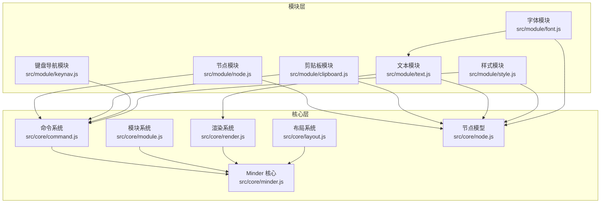
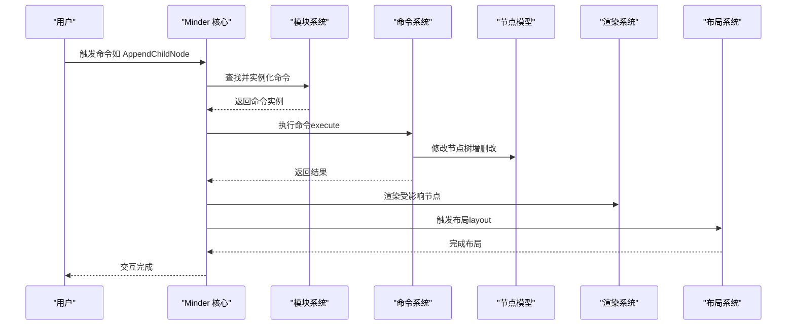
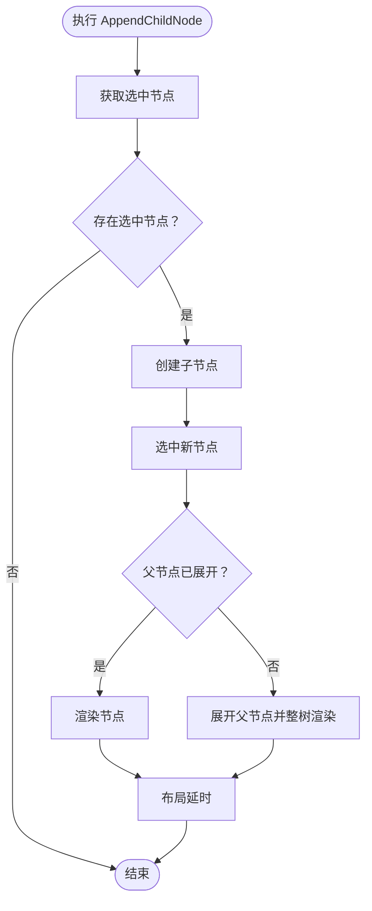
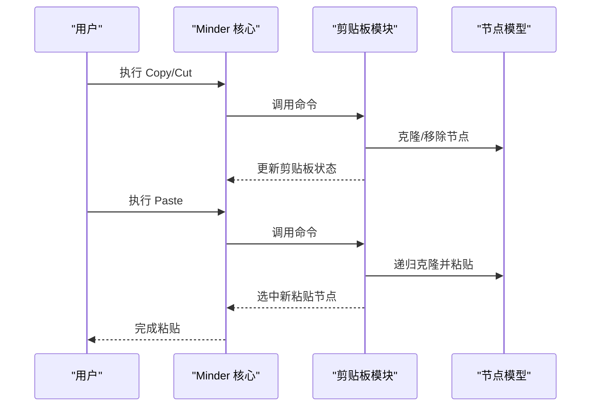
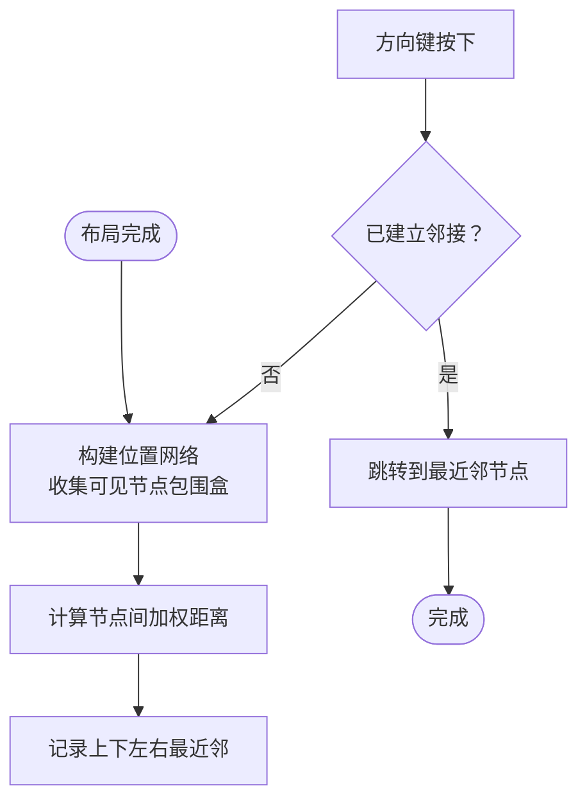
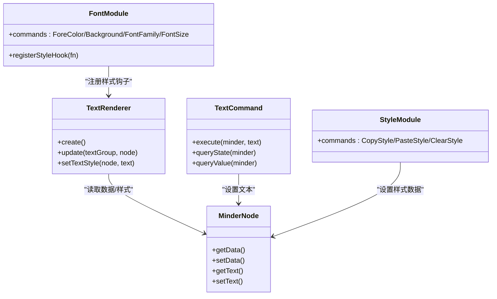
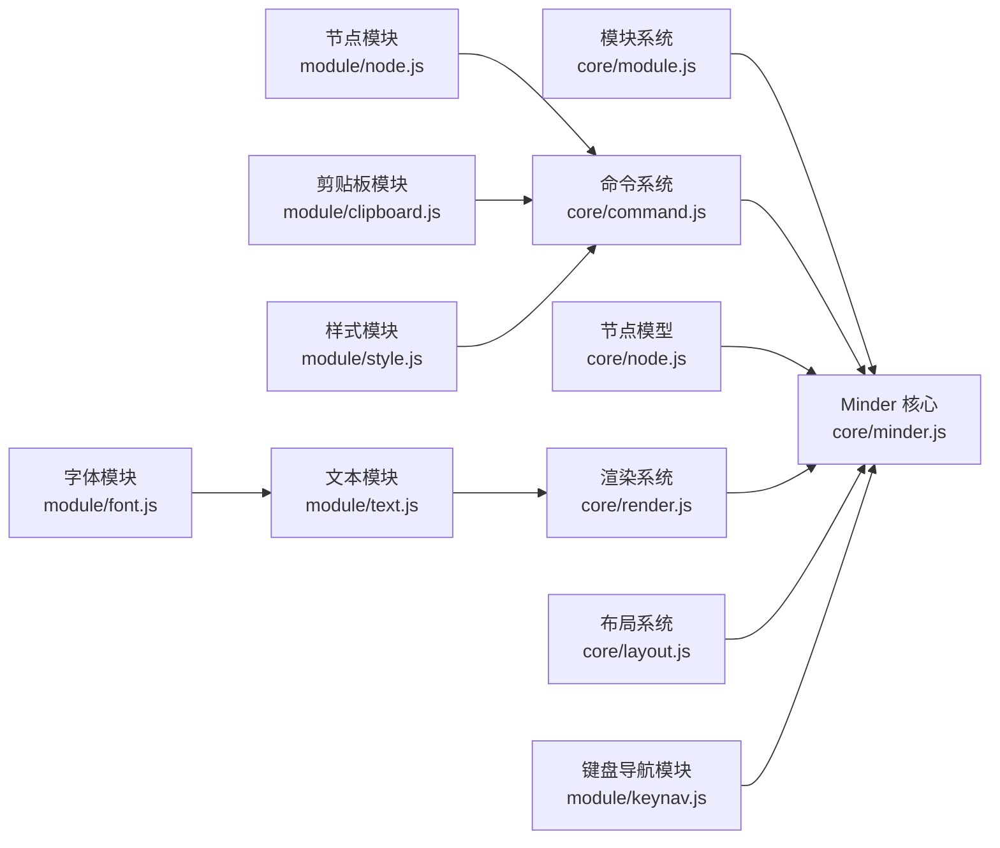

# 基础功能模块

<cite>
**本文引用的文件列表**
- [src/module/node.js](file://src/module/node.js)
- [src/module/clipboard.js](file://src/module/clipboard.js)
- [src/module/keynav.js](file://src/module/keynav.js)
- [src/module/text.js](file://src/module/text.js)
- [src/module/style.js](file://src/module/style.js)
- [src/module/font.js](file://src/module/font.js)
- [src/core/minder.js](file://src/core/minder.js)
- [src/core/node.js](file://src/core/node.js)
- [src/core/command.js](file://src/core/command.js)
- [src/core/module.js](file://src/core/module.js)
- [src/core/render.js](file://src/core/render.js)
- [src/core/layout.js](file://src/core/layout.js)
</cite>

## 目录
1. [引言](#引言)
2. [项目结构](#项目结构)
3. [核心组件](#核心组件)
4. [架构总览](#架构总览)
5. [详细组件分析](#详细组件分析)
6. [依赖关系分析](#依赖关系分析)
7. [性能考量](#性能考量)
8. [故障排查指南](#故障排查指南)
9. [结论](#结论)
10. [附录](#附录)

## 引言
本文件聚焦于基础功能模块，围绕思维导图的核心交互能力进行系统化梳理，重点覆盖以下方面：
- 节点操作模块（node.js）：节点的增删改查、父子关系维护与树形结构操作
- 剪贴板模块（clipboard.js）：复制、剪切、粘贴的数据处理流程与可选原生事件适配
- 键盘导航模块（keynav.js）：基于方向键的高效节点导航设计原理
- 文本编辑（text.js）、样式管理（style.js）与字体设置（font.js）：三者如何协同完成文本渲染与样式应用
- 模块注册与命令系统：基础模块如何通过 Minder 的模块系统注册，并与核心命令系统协同工作，确保操作的可撤销性与一致性

## 项目结构
基础功能模块位于 src/module 下，分别对应节点、剪贴板、键盘导航、文本、样式与字体等能力。它们通过 Minder 的模块系统统一注册，借助核心命令系统与渲染/布局系统协作，形成完整的交互闭环。

图表来源
- [src/module/node.js](file://src/module/node.js#L1-L150)
- [src/module/clipboard.js](file://src/module/clipboard.js#L1-L172)
- [src/module/keynav.js](file://src/module/keynav.js#L1-L171)
- [src/module/text.js](file://src/module/text.js#L1-L289)
- [src/module/style.js](file://src/module/style.js#L1-L114)
- [src/module/font.js](file://src/module/font.js#L1-L159)
- [src/core/minder.js](file://src/core/minder.js#L1-L41)
- [src/core/command.js](file://src/core/command.js#L1-L169)
- [src/core/module.js](file://src/core/module.js#L1-L151)
- [src/core/render.js](file://src/core/render.js#L1-L200)
- [src/core/layout.js](file://src/core/layout.js#L1-L200)
- [src/core/node.js](file://src/core/node.js#L1-L200)

章节来源
- [src/module/node.js](file://src/module/node.js#L1-L150)
- [src/module/clipboard.js](file://src/module/clipboard.js#L1-L172)
- [src/module/keynav.js](file://src/module/keynav.js#L1-L171)
- [src/module/text.js](file://src/module/text.js#L1-L289)
- [src/module/style.js](file://src/module/style.js#L1-L114)
- [src/module/font.js](file://src/module/font.js#L1-L159)
- [src/core/minder.js](file://src/core/minder.js#L1-L41)
- [src/core/command.js](file://src/core/command.js#L1-L169)
- [src/core/module.js](file://src/core/module.js#L1-L151)
- [src/core/render.js](file://src/core/render.js#L1-L200)
- [src/core/layout.js](file://src/core/layout.js#L1-L200)
- [src/core/node.js](file://src/core/node.js#L1-L200)

## 核心组件
- 节点操作模块（node.js）
  - 提供“添加子节点”“添加兄弟节点”“移除节点”“添加父节点”等命令，封装对 MinderNode 的增删改查与父子关系维护，并触发布局更新
- 剪贴板模块（clipboard.js）
  - 实现复制、剪切、粘贴命令，支持克隆节点树并递归粘贴；在支持原生剪贴板事件时可桥接原生事件
- 键盘导航模块（keynav.js）
  - 构建节点位置网络，按方向键在可视节点间跳转，提升键盘效率
- 文本模块（text.js）
  - 文本渲染器与文本命令，负责文本换行、行高、跨浏览器字体微调与渲染盒计算
- 样式模块（style.js）
  - 提供复制/粘贴/清除样式命令，维护样式数据与渲染刷新
- 字体模块（font.js）
  - 注册样式钩子，将节点数据与样式映射到文本渲染器，实现字体族、字号、前景色等应用

章节来源
- [src/module/node.js](file://src/module/node.js#L1-L150)
- [src/module/clipboard.js](file://src/module/clipboard.js#L1-L172)
- [src/module/keynav.js](file://src/module/keynav.js#L1-L171)
- [src/module/text.js](file://src/module/text.js#L1-L289)
- [src/module/style.js](file://src/module/style.js#L1-L114)
- [src/module/font.js](file://src/module/font.js#L1-L159)

## 架构总览
基础模块通过模块系统注册，向 Minder 注入命令、事件与渲染器，再由命令系统驱动节点模型变更、渲染系统更新图形、布局系统重新排布，最终形成一致的用户交互体验。

图表来源
- [src/core/minder.js](file://src/core/minder.js#L1-L41)
- [src/core/module.js](file://src/core/module.js#L1-L151)
- [src/core/command.js](file://src/core/command.js#L1-L169)
- [src/core/node.js](file://src/core/node.js#L350-L407)
- [src/core/render.js](file://src/core/render.js#L85-L200)
- [src/core/layout.js](file://src/core/layout.js#L170-L200)

## 详细组件分析

### 节点操作模块（node.js）
- 命令职责
  - AppendChildNode：在选中节点下添加子节点，必要时展开父节点并触发布局
  - AppendSiblingNode：在选中节点旁添加兄弟节点，保持布局变换一致
  - RemoveNode：移除选中节点集合，自动选择回退节点，避免无选中状态
  - AppendParentNode：为多个相邻节点创建共同父节点，合并布局变换
- 关键实现要点
  - 使用 MinderNode.getCommonAncestor 计算多节点公共祖先，决定回退选择
  - 在节点创建后调用 render 与 layout，保证视图与布局同步
  - 通过 queryState 控制命令可用性（如根节点不可删除）
- 快捷键绑定
  - 通过 commandShortcutKeys 将 Enter/Insert/Tab/Shift+Tab/Del/Backspace 映射到相应命令

图表来源
- [src/module/node.js](file://src/module/node.js#L1-L150)
- [src/core/node.js](file://src/core/node.js#L350-L407)

章节来源
- [src/module/node.js](file://src/module/node.js#L1-L150)
- [src/core/node.js](file://src/core/node.js#L350-L407)

### 剪贴板模块（clipboard.js）
- 命令职责
  - Copy：将选中节点的“祖先链”克隆到剪贴板，支持批量复制
  - Cut：复制到剪贴板后，移除原节点，保持选择稳定
  - Paste：将剪贴板中的节点树粘贴到每个选中节点下，递归克隆并清空原父节点子树以修复粘贴递归问题
- 数据流与边界处理
  - 递归粘贴时，先克隆再清空原父节点子树，避免重复复制导致的嵌套问题
  - 支持原生剪贴板事件（在特定浏览器条件满足时），否则使用内部命令快捷键
- 可用性控制
  - queryState 仅在存在选中节点时允许粘贴

图表来源
- [src/module/clipboard.js](file://src/module/clipboard.js#L1-L172)
- [src/core/node.js](file://src/core/node.js#L253-L263)

章节来源
- [src/module/clipboard.js](file://src/module/clipboard.js#L1-L172)
- [src/core/node.js](file://src/core/node.js#L253-L263)

### 键盘导航模块（keynav.js）
- 设计原理
  - 构建可视节点的“位置网络”，计算节点包围盒间的“加权距离”，区分兄弟、父子等关系权重
  - 在布局完成后建立可达邻接关系，方向键触发导航至最近节点
- 事件与状态
  - 监听布局完成事件，重建位置网络
  - 监听键盘事件，识别方向键并阻止默认行为
- 性能策略
  - 通过“稀释帧”逻辑避免频繁重建网络，仅在必要时计算最近邻

图表来源
- [src/module/keynav.js](file://src/module/keynav.js#L1-L171)

章节来源
- [src/module/keynav.js](file://src/module/keynav.js#L1-L171)

### 文本编辑（text.js）、样式管理（style.js）与字体设置（font.js）集成
- 文本模块（text.js）
  - TextRenderer：根据节点数据与样式计算文本组的渲染盒，处理跨浏览器字体微调与换行
  - TextCommand：设置节点文本并触发渲染与布局
- 样式模块（style.js）
  - 提供复制/粘贴/清除样式的命令，维护样式数据并在渲染批次中更新
- 字体模块（font.js）
  - 注册样式钩子，将节点数据与样式映射到文本渲染器，实现字体族、字号、前景色等应用
- 集成路径
  - text.js 注册 TextRenderer 作为中心渲染器
  - font.js 通过注册样式钩子影响 TextRenderer 的绘制
  - style.js 与 font.js 均作用于节点数据，最终由渲染系统统一刷新

图表来源
- [src/module/text.js](file://src/module/text.js#L1-L289)
- [src/module/style.js](file://src/module/style.js#L1-L114)
- [src/module/font.js](file://src/module/font.js#L1-L159)
- [src/core/node.js](file://src/core/node.js#L130-L161)

章节来源
- [src/module/text.js](file://src/module/text.js#L1-L289)
- [src/module/style.js](file://src/module/style.js#L1-L114)
- [src/module/font.js](file://src/module/font.js#L1-L159)
- [src/core/node.js](file://src/core/node.js#L130-L161)

## 依赖关系分析
- 模块注册与加载
  - 模块通过 Module.register 注册，Minder 初始化时遍历模块池，实例化模块并注入命令、事件与渲染器
- 命令系统与交互
  - Command 定义命令基类，Minder.execCommand 统一调度，触发 before/pre/exec/contentchange 等事件，确保可撤销性与一致性
- 节点模型与渲染/布局
  - MinderNode 提供节点树操作与数据访问；渲染系统按渲染器类别批量渲染；布局系统提供对齐、堆栈、移动等工具方法

图表来源
- [src/core/module.js](file://src/core/module.js#L1-L151)
- [src/core/minder.js](file://src/core/minder.js#L1-L41)
- [src/core/command.js](file://src/core/command.js#L1-L169)
- [src/core/node.js](file://src/core/node.js#L1-L200)
- [src/core/render.js](file://src/core/render.js#L1-L200)
- [src/core/layout.js](file://src/core/layout.js#L1-L200)
- [src/module/node.js](file://src/module/node.js#L1-L150)
- [src/module/clipboard.js](file://src/module/clipboard.js#L1-L172)
- [src/module/keynav.js](file://src/module/keynav.js#L1-L171)
- [src/module/text.js](file://src/module/text.js#L1-L289)
- [src/module/style.js](file://src/module/style.js#L1-L114)
- [src/module/font.js](file://src/module/font.js#L1-L159)

章节来源
- [src/core/module.js](file://src/core/module.js#L1-L151)
- [src/core/command.js](file://src/core/command.js#L1-L169)
- [src/core/node.js](file://src/core/node.js#L1-L200)
- [src/core/render.js](file://src/core/render.js#L1-L200)
- [src/core/layout.js](file://src/core/layout.js#L1-L200)
- [src/module/node.js](file://src/module/node.js#L1-L150)
- [src/module/clipboard.js](file://src/module/clipboard.js#L1-L172)
- [src/module/keynav.js](file://src/module/keynav.js#L1-L171)
- [src/module/text.js](file://src/module/text.js#L1-L289)
- [src/module/style.js](file://src/module/style.js#L1-L114)
- [src/module/font.js](file://src/module/font.js#L1-L159)

## 性能考量
- 节点导航网络
  - 仅在布局完成后重建位置网络，减少重复计算；通过“稀释帧”降低频繁导航带来的开销
- 文本渲染
  - 文本渲染器缓存文本哈希与渲染盒，避免不必要的重绘；跨浏览器字体微调减少重排
- 批量渲染与布局
  - 渲染系统按渲染器类别批量处理，合并盒子计算；布局系统提供对齐与堆栈工具，减少逐节点计算成本
- 剪贴板粘贴
  - 递归克隆时先清空原父节点子树，避免深层复制导致的性能与一致性问题

[本节为通用性能讨论，无需列出具体文件来源]

## 故障排查指南
- 命令不可用
  - 检查命令的 queryState 返回值，确认当前选中状态与节点层级是否满足要求
- 粘贴异常
  - 确认剪贴板中是否有节点数据；检查粘贴时是否正确清空原父节点子树
- 导航无效
  - 确认布局已完成并触发了位置网络重建；检查方向键事件是否被拦截
- 文本渲染错位
  - 检查字体家族与字号配置；确认跨浏览器微调是否生效

章节来源
- [src/core/command.js](file://src/core/command.js#L1-L169)
- [src/module/clipboard.js](file://src/module/clipboard.js#L1-L172)
- [src/module/keynav.js](file://src/module/keynav.js#L1-L171)
- [src/module/text.js](file://src/module/text.js#L1-L289)

## 结论
基础功能模块通过清晰的职责划分与模块化设计，将节点操作、剪贴板、键盘导航与文本/样式/字体管理有机整合。它们依托 Minder 的模块系统与命令系统，配合渲染与布局系统，实现了高效、一致且可扩展的思维导图交互体验。开发者可通过命令扩展与样式钩子机制进一步定制功能，同时遵循现有事件与布局流程，确保操作的可撤销性与一致性。

[本节为总结性内容，无需列出具体文件来源]

## 附录
- 使用与扩展建议
  - 新增命令：在模块中定义命令类并注册到 commands，必要时提供 queryState/queryValue 与快捷键映射
  - 自定义渲染：在模块中注册 renderers，按需实现 Renderer.create/update/draw/place
  - 扩展样式：通过样式钩子或命令修改节点数据，由渲染系统统一刷新
- 示例参考路径
  - 节点命令示例：[src/module/node.js](file://src/module/node.js#L1-L150)
  - 剪贴板命令示例：[src/module/clipboard.js](file://src/module/clipboard.js#L1-L172)
  - 键盘导航事件示例：[src/module/keynav.js](file://src/module/keynav.js#L1-L171)
  - 文本渲染器示例：[src/module/text.js](file://src/module/text.js#L1-L289)
  - 样式命令示例：[src/module/style.js](file://src/module/style.js#L1-L114)
  - 字体样式钩子示例：[src/module/font.js](file://src/module/font.js#L1-L159)

[本节为补充信息，无需列出具体文件来源]