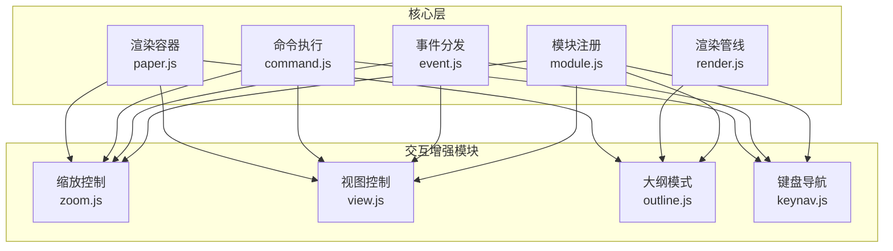
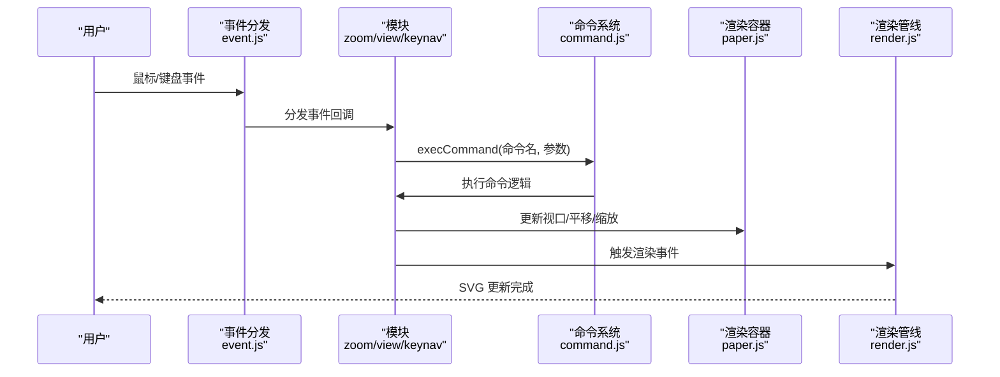
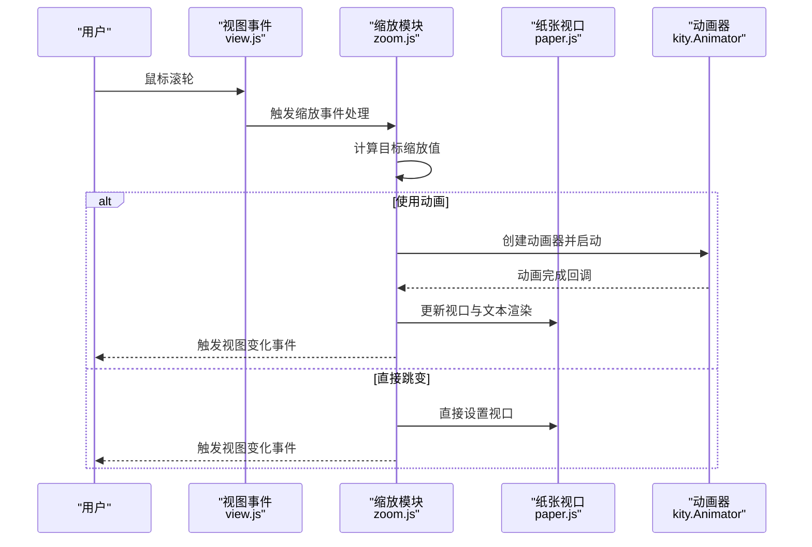
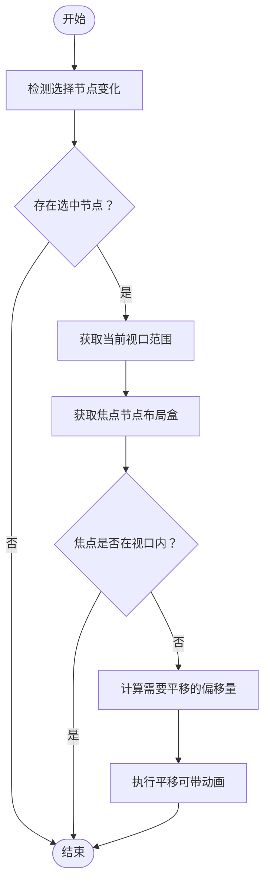
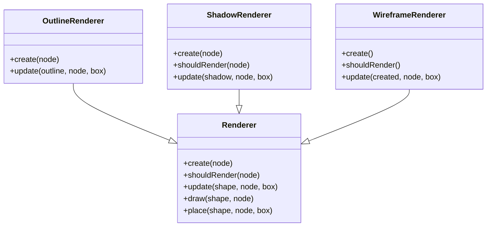
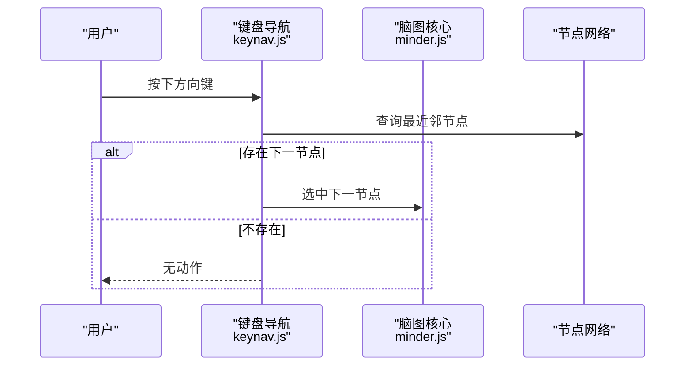
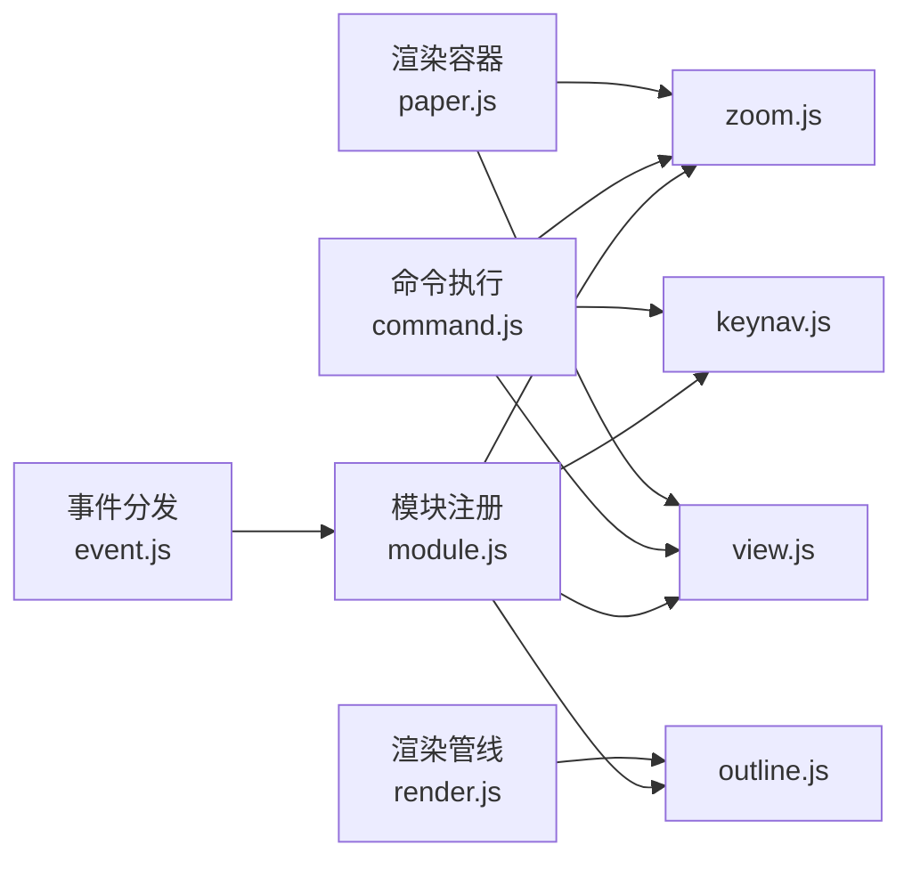

# 交互增强模块

<cite>
**本文引用的文件**
- [zoom.js](file://src/module/zoom.js)
- [view.js](file://src/module/view.js)
- [outline.js](file://src/module/outline.js)
- [keynav.js](file://src/module/keynav.js)
- [module.js](file://src/core/module.js)
- [event.js](file://src/core/event.js)
- [command.js](file://src/core/command.js)
- [paper.js](file://src/core/paper.js)
- [render.js](file://src/core/render.js)
</cite>

## 目录
1. [引言](#引言)
2. [项目结构](#项目结构)
3. [核心组件](#核心组件)
4. [架构总览](#架构总览)
5. [详细组件分析](#详细组件分析)
6. [依赖关系分析](#依赖关系分析)
7. [性能考虑](#性能考虑)
8. [故障排查指南](#故障排查指南)
9. [结论](#结论)

## 引言
本文件系统性阐述交互增强类扩展功能的设计与实现，聚焦以下模块：
- 缩放控制模块（zoom.js）：缩放比例管理、视口变换算法、与鼠标滚轮事件的集成
- 视图控制模块（view.js）：画布平移、居中定位、边界检测与滚动联动
- 大纲模式模块（outline.js）：结构化视图生成、节点轮廓渲染与联动
- 键盘导航模块（keynav.js）：焦点管理、快捷键绑定、无障碍访问支持

文档通过架构图、序列图、流程图展示各模块如何协同提升用户体验，并给出大规模节点下的渲染优化建议。

## 项目结构
交互增强模块位于 src/module 下，分别实现独立的功能域并通过核心模块系统进行注册与事件绑定。核心层包括模块注册、事件分发、命令执行、渲染管线等基础能力。

图表来源
- [module.js](file://src/core/module.js#L1-L151)
- [event.js](file://src/core/event.js#L1-L200)
- [command.js](file://src/core/command.js#L124-L169)
- [render.js](file://src/core/render.js#L1-L200)
- [paper.js](file://src/core/paper.js#L1-L76)
- [zoom.js](file://src/module/zoom.js#L1-L195)
- [view.js](file://src/module/view.js#L1-L397)
- [outline.js](file://src/module/outline.js#L1-L165)
- [keynav.js](file://src/module/keynav.js#L1-L171)

章节来源
- [module.js](file://src/core/module.js#L1-L151)
- [event.js](file://src/core/event.js#L1-L200)
- [command.js](file://src/core/command.js#L124-L169)
- [render.js](file://src/core/render.js#L1-L200)
- [paper.js](file://src/core/paper.js#L1-L76)

## 核心组件
- 模块注册与生命周期：模块通过统一注册接口挂载命令、事件与渲染器，初始化时批量注入默认选项与快捷键。
- 事件分发：将原生 DOM 事件转换为可传播的 MinderEvent，按 before/pre/execute/after 阶段分发，支持短暂停止与默认行为阻止。
- 命令执行：命令对象封装业务语义，执行前后触发钩子，支持内容变更与交互变更通知。
- 渲染管线：节点渲染器按顺序创建/更新图形元素，支持延迟盒数据合并与批量渲染。
- 渲染容器：Paper 提供 SVG 容器与视口矩阵，支持平移、缩放、居中等变换。

章节来源
- [module.js](file://src/core/module.js#L1-L151)
- [event.js](file://src/core/event.js#L1-L200)
- [command.js](file://src/core/command.js#L124-L169)
- [render.js](file://src/core/render.js#L1-L200)
- [paper.js](file://src/core/paper.js#L1-L76)

## 架构总览
交互增强模块围绕“命令-事件-渲染”闭环协作：
- 用户输入（鼠标/键盘/滚轮）触发事件，经事件分发进入模块处理
- 模块根据状态与配置执行命令，更新模型或视图状态
- 视图变化通过 fire 事件通知，渲染管线响应并更新 SVG 图形
- 大纲模式作为渲染器插件参与节点轮廓绘制

图表来源
- [event.js](file://src/core/event.js#L1-L200)
- [command.js](file://src/core/command.js#L124-L169)
- [paper.js](file://src/core/paper.js#L1-L76)
- [render.js](file://src/core/render.js#L1-L200)
- [zoom.js](file://src/module/zoom.js#L1-L195)
- [view.js](file://src/module/view.js#L1-L397)
- [keynav.js](file://src/module/keynav.js#L1-L171)

## 详细组件分析

### 缩放控制模块（zoom.js）
- 缩放比例管理
  - 内部维护当前缩放值，提供查询与设置接口，基于纸张视口进行缩放应用
  - 文本渲染质量随缩放动态切换，保证在特定比例下优化速度
  - 在缩放至基准比例时修正 CTM，避免像素对齐问题
- 视口变换算法
  - 通过 Paper 的视口对象设置缩放与中心点，配合矩阵变换实现平滑过渡
  - 复杂度阈值与动画时长决定是否启用动画，避免大规模节点时的卡顿
- 与鼠标滚轮事件集成
  - 仅在组合键激活时响应滚轮，稀释高频事件，避免抖动
  - 根据滚轮方向调用放大/缩小命令，统一通过命令系统执行

图表来源
- [zoom.js](file://src/module/zoom.js#L1-L195)
- [view.js](file://src/module/view.js#L280-L318)
- [paper.js](file://src/core/paper.js#L1-L76)

章节来源
- [zoom.js](file://src/module/zoom.js#L1-L195)

### 视图控制模块（view.js）
- 画布平移
  - 通过拖拽器在拖拽过程中累积位移，支持动画平滑移动
  - 支持临时拖拽模式：点击根节点或特定按键时开启，松开即关闭
- 居中定位
  - 提供相机命令，将指定节点中心与视口中心对齐，支持动画时长
  - 初始化与窗口大小变化时自动居中，确保首次加载与响应式布局稳定
- 边界检测与滚动联动
  - 选择节点变化时检测可视区域与焦点节点的相对位置，必要时自动平移
  - 滚轮事件在非组合键下触发平移，避免与缩放冲突
- 抓手状态
  - 切换抓手状态时改变光标样式，拖拽时强制进入抓手模式

图表来源
- [view.js](file://src/module/view.js#L371-L394)

章节来源
- [view.js](file://src/module/view.js#L1-L397)

### 大纲模式模块（outline.js）
- 结构化视图生成
  - 为每个节点生成轮廓渲染器，依据节点样式与布局盒计算外轮廓矩形或圆
  - 支持阴影渲染器与线框渲染器（可选），用于辅助调试与可视化
- 节点折叠状态同步
  - 轮廓渲染器根据节点选中状态与焦点状态选择不同填充与描边
  - 通过渲染器注册机制参与节点渲染流程，确保与主视图一致
- 与主视图联动
  - 在布局完成后触发轮廓更新，保持与节点实际位置与尺寸同步

图表来源
- [outline.js](file://src/module/outline.js#L1-L165)
- [render.js](file://src/core/render.js#L1-L200)

章节来源
- [outline.js](file://src/module/outline.js#L1-L165)
- [render.js](file://src/core/render.js#L1-L200)

### 键盘导航模块（keynav.js）
- 焦点管理
  - 在布局完成后构建节点位置网络，记录每个节点的最近邻节点（上下左右）
  - 导航时优先选择同级/父子关系节点，提升语义连贯性
- 快捷键绑定
  - 将方向键映射到导航动作，按下时阻止默认行为，避免页面滚动
- 无障碍访问支持
  - 通过最小化节点集合与系数调整，减少不可见或折叠节点的干扰
  - 首次导航时自动构建网络，保证后续流畅体验

图表来源
- [keynav.js](file://src/module/keynav.js#L1-L171)

章节来源
- [keynav.js](file://src/module/keynav.js#L1-L171)

## 依赖关系分析
- 模块注册与事件绑定
  - 模块通过统一注册接口注入命令、事件与渲染器，初始化时合并默认选项与快捷键
- 事件分发链路
  - 原生事件经事件分发转换为 MinderEvent，按阶段传播，模块可在任意阶段拦截
- 命令执行链路
  - 命令对象封装执行逻辑，支持状态查询与内容变更标记，驱动后续渲染与交互
- 渲染管线
  - 渲染器按顺序创建/更新图形，支持批量渲染与延迟盒合并，降低重排成本

图表来源
- [module.js](file://src/core/module.js#L1-L151)
- [event.js](file://src/core/event.js#L1-L200)
- [command.js](file://src/core/command.js#L124-L169)
- [render.js](file://src/core/render.js#L1-L200)
- [paper.js](file://src/core/paper.js#L1-L76)
- [zoom.js](file://src/module/zoom.js#L1-L195)
- [view.js](file://src/module/view.js#L1-L397)
- [outline.js](file://src/module/outline.js#L1-L165)
- [keynav.js](file://src/module/keynav.js#L1-L171)

章节来源
- [module.js](file://src/core/module.js#L1-L151)
- [event.js](file://src/core/event.js#L1-L200)
- [command.js](file://src/core/command.js#L124-L169)
- [render.js](file://src/core/render.js#L1-L200)
- [paper.js](file://src/core/paper.js#L1-L76)

## 性能考虑
- 大规模节点下的渲染优化策略
  - 缩放动画阈值：当节点复杂度超过阈值或禁用动画时，直接跳变以避免卡顿
  - 文本渲染质量切换：在较高缩放时切换为速度优先，降低矢量抗锯齿带来的开销
  - 批量渲染：渲染管线按渲染器顺序批量处理，减少重复遍历与盒计算
  - 拖拽与滚动节流：对高频事件进行稀释与定时器去抖，避免频繁重绘
  - 选择变化检测：仅在必要时进行边界检测与平移，避免每次布局都触发
  - 轮廓渲染条件：阴影与线框渲染器按需启用，减少额外绘制
- 事件与命令的短暂停止
  - 事件分发支持短暂停止，避免不必要的冒泡与重复处理
- 交互变更批处理
  - 交互变更通过延时批处理，减少频繁触发导致的抖动

章节来源
- [zoom.js](file://src/module/zoom.js#L45-L78)
- [view.js](file://src/module/view.js#L338-L394)
- [render.js](file://src/core/render.js#L85-L200)

## 故障排查指南
- 缩放无效或闪烁
  - 检查是否正确设置了组合键触发条件，确认缩放命令已注册且可用
  - 确认视口更新路径与文本渲染切换逻辑是否生效
- 平移异常
  - 检查抓手状态切换与光标样式是否正确，确认临时拖拽模式的触发条件
  - 核对边界检测逻辑与动画时序，避免动画未完成导致的位置计算错误
- 键盘导航无响应
  - 确认布局完成后已构建节点网络，检查方向键映射与事件拦截
  - 排查折叠节点导致的空盒问题，确保网络构建时过滤不可见节点
- 大纲轮廓不显示
  - 检查渲染器注册与渲染时机，确认布局完成后触发轮廓更新
  - 若启用线框渲染器，确认资源与条件渲染逻辑

章节来源
- [zoom.js](file://src/module/zoom.js#L162-L193)
- [view.js](file://src/module/view.js#L115-L176)
- [keynav.js](file://src/module/keynav.js#L155-L169)
- [outline.js](file://src/module/outline.js#L147-L165)

## 结论
交互增强模块通过命令-事件-渲染的清晰分层，实现了缩放、平移、导航与大纲视图的协同工作。模块间低耦合、高内聚，借助核心层的统一注册与事件分发机制，既保证了功能的可扩展性，也兼顾了大规模节点场景下的性能与稳定性。建议在复杂场景中结合阈值与节流策略，持续优化渲染与交互体验。