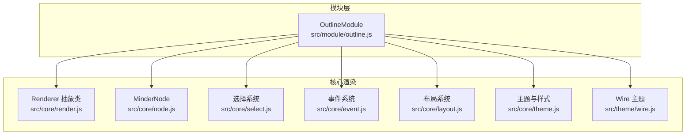
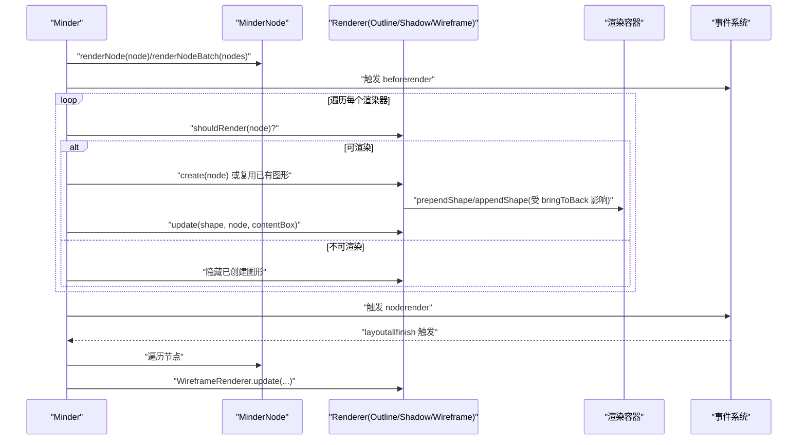
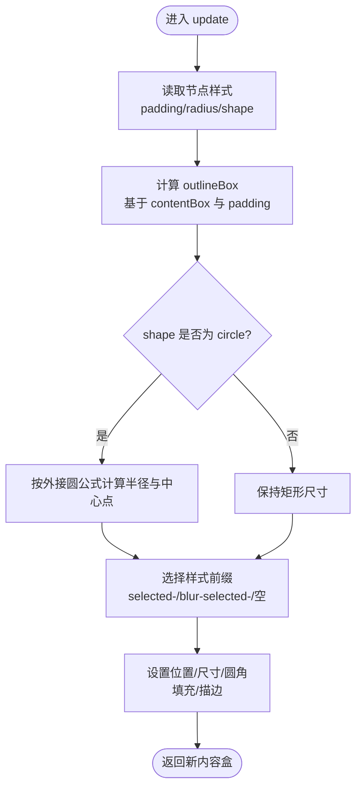
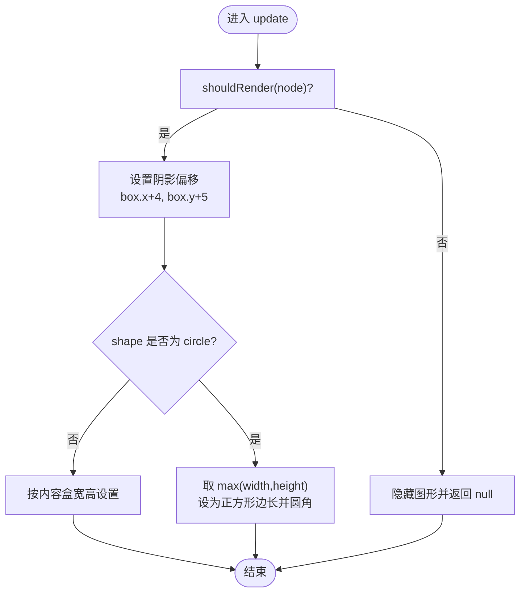
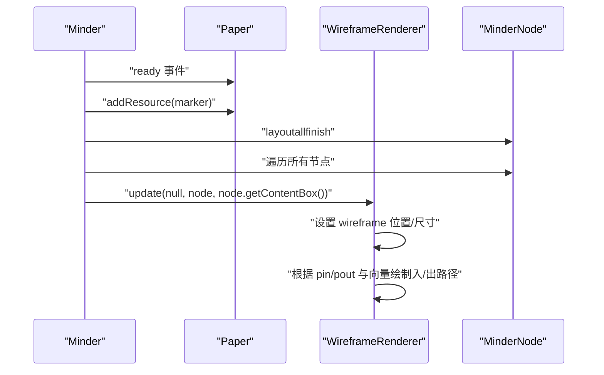
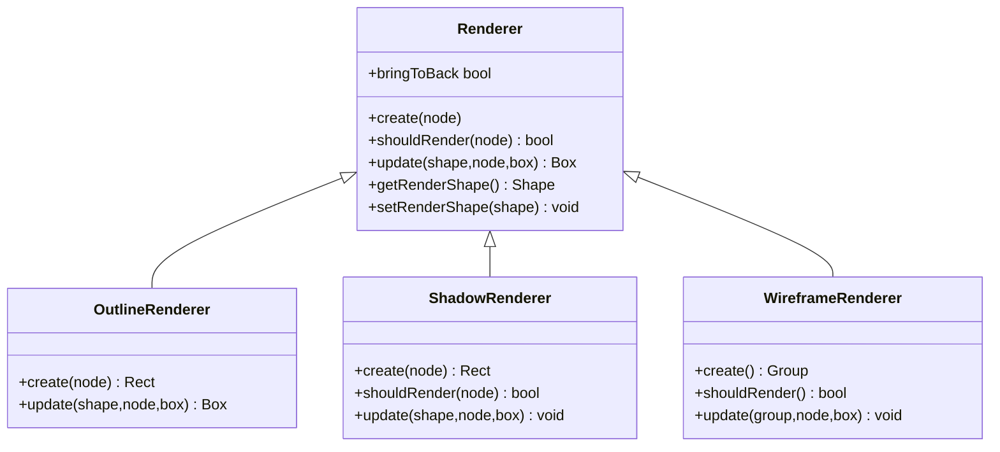
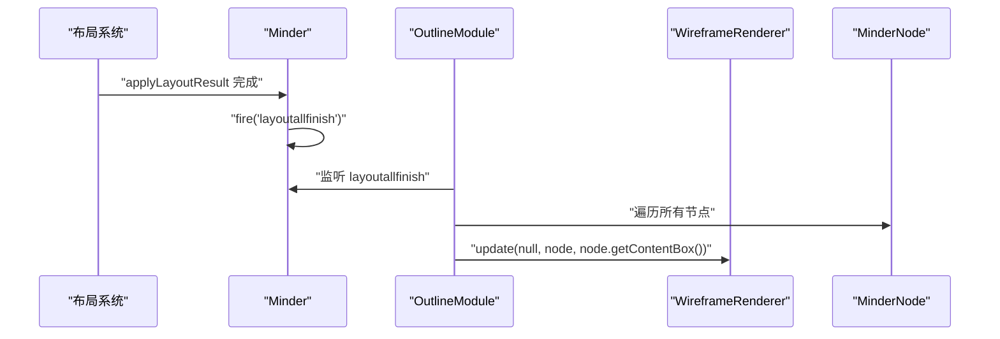
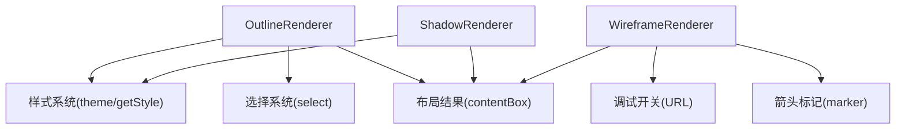

# 大纲模式

<cite>
**本文引用的文件列表**
- [outline.js](file://src/module/outline.js)
- [render.js](file://src/core/render.js)
- [node.js](file://src/core/node.js)
- [select.js](file://src/core/select.js)
- [event.js](file://src/core/event.js)
- [layout.js](file://src/core/layout.js)
- [theme.js](file://src/core/theme.js)
- [wire.js](file://src/theme/wire.js)
</cite>

## 目录
1. [引言](#引言)
2. [项目结构](#项目结构)
3. [核心组件](#核心组件)
4. [架构总览](#架构总览)
5. [详细组件分析](#详细组件分析)
6. [依赖关系分析](#依赖关系分析)
7. [性能考量](#性能考量)
8. [故障排查指南](#故障排查指南)
9. [结论](#结论)
10. [附录：自定义轮廓样式扩展方法](#附录自定义轮廓样式扩展方法)

## 引言
本文件系统性说明“大纲模式”及相关渲染器的实现机制，重点围绕以下目标展开：
- OutlineRenderer 如何根据节点样式生成外围轮廓，包括矩形与圆形节点的轮廓计算差异；
- ShadowRenderer 的阴影效果实现原理与其条件渲染机制；
- WireframeRenderer 在调试模式下的线框显示功能，包括坐标轴、布局向量与连接点的可视化；
- 渲染器注册机制及 bringToBack 属性的作用；
- 大纲轮廓与节点选择状态的联动逻辑（选中态样式的动态应用）；
- 渲染时机控制，特别是 layoutallfinish 事件触发后的批量更新策略；
- 自定义轮廓样式的扩展方法。

## 项目结构
大纲模式位于模块目录下，核心渲染器与通用渲染框架位于 core 目录。主题系统与样式查询位于 core 子模块中。事件系统负责布局完成等关键时机的触发。

图表来源
- [outline.js](file://src/module/outline.js#L1-L165)
- [render.js](file://src/core/render.js#L1-L261)
- [node.js](file://src/core/node.js#L1-L407)
- [select.js](file://src/core/select.js#L1-L146)
- [event.js](file://src/core/event.js#L1-L270)
- [layout.js](file://src/core/layout.js#L413-L457)
- [theme.js](file://src/core/theme.js#L1-L175)
- [wire.js](file://src/theme/wire.js#L1-L34)

章节来源
- [outline.js](file://src/module/outline.js#L1-L165)
- [render.js](file://src/core/render.js#L1-L261)

## 核心组件
- OutlineRenderer：负责绘制节点外轮廓，支持矩形与圆形两种形状；根据节点选择状态与焦点状态动态切换样式前缀，实现选中态与失焦态的差异化外观。
- ShadowRenderer：按节点样式条件渲染阴影，支持矩形与圆形两种尺寸计算方式。
- WireframeRenderer：调试模式下的线框渲染器，绘制坐标轴、内容盒、入/出布局向量与箭头标记。
- 渲染器注册与调度：通过模块注册 renderers 字段声明渲染器，Minder 在渲染流程中按顺序创建/更新各渲染器图形，并通过 bringToBack 控制层级。
- 选择联动：OutlineRenderer 使用节点选择状态与焦点状态决定样式前缀，实现选中态样式动态应用。
- 渲染时机：布局完成后由 layoutallfinish 事件触发批量刷新 WireframeRenderer。

章节来源
- [outline.js](file://src/module/outline.js#L1-L165)
- [render.js](file://src/core/render.js#L1-L261)
- [select.js](file://src/core/select.js#L1-L146)

## 架构总览
大纲模式的渲染器注册与调度遵循统一的渲染框架。模块通过 Module.register 注册 renderers，Minder 在渲染过程中按顺序遍历渲染器，调用其 shouldRender、create、update 等方法，并根据 bringToBack 决定图形插入顺序。

图表来源
- [render.js](file://src/core/render.js#L86-L219)
- [outline.js](file://src/module/outline.js#L147-L165)
- [event.js](file://src/core/event.js#L162-L231)
- [layout.js](file://src/core/layout.js#L413-L457)

## 详细组件分析

### OutlineRenderer：轮廓生成与选择态联动
- 轮廓创建：在 create 中创建矩形图形并设置唯一 ID，bringToBack 设为真，确保轮廓位于底层。
- 轮廓更新：
  - 从节点样式读取 padding-left/right/top/bottom 与 radius；
  - 计算 outlineBox：基于内容盒 box 并加上内边距；
  - 若节点形状为 circle，则按外接圆公式计算半径与中心点，使轮廓为正方形内切圆；
  - 根据节点选择状态与焦点状态选择样式前缀：
    - 选中且获得焦点：selected- 前缀；
    - 选中但未获得焦点：blur-selected- 前缀；
    - 未选中：无前缀；
  - 应用填充与描边样式，设置位置、大小与圆角半径。
- 选择态联动：isSelected() 与 isFocused() 共同决定样式前缀，实现选中态样式动态应用。

图表来源
- [outline.js](file://src/module/outline.js#L24-L65)
- [select.js](file://src/core/select.js#L139-L146)

章节来源
- [outline.js](file://src/module/outline.js#L11-L65)
- [select.js](file://src/core/select.js#L139-L146)

### ShadowRenderer：阴影效果与条件渲染
- 条件渲染：shouldRender(node) 仅当节点样式包含 shadow 时才渲染。
- 阴影创建：在 create 中创建矩形阴影图形，bringToBack 设为真。
- 阴影更新：
  - 位移：阴影相对内容盒偏移固定像素；
  - 尺寸：若节点非圆形，直接按内容盒宽高设置；若为圆形，取宽高的较大值作为正方形边长；
  - 圆角：圆形节点按半径设置圆角。

图表来源
- [outline.js](file://src/module/outline.js#L68-L95)

章节来源
- [outline.js](file://src/module/outline.js#L68-L95)

### WireframeRenderer：调试线框显示
- 调试开关：通过 URL 参数检测是否启用 wireframe 模式，仅在启用时渲染。
- 资源注册：在 ready 事件中向画纸添加箭头标记资源。
- 线框创建：创建 Group 容器，内部包含坐标轴（x/y 轴）、内容盒矩形、入/出布局向量路径，并在末端设置箭头标记。
- 线框更新：设置内容盒矩形的位置与尺寸；根据节点的入/出连接点与归一化后的布局向量绘制入/出向量路径。

图表来源
- [outline.js](file://src/module/outline.js#L97-L165)
- [event.js](file://src/core/event.js#L162-L231)
- [layout.js](file://src/core/layout.js#L413-L457)

章节来源
- [outline.js](file://src/module/outline.js#L97-L165)

### 渲染器注册机制与层级控制
- 模块注册：OutlineModule 通过 renderers 字段注册 outline 与 outside（ShadowRenderer、WireframeRenderer）两类渲染器。
- 渲染器装配：Minder 在渲染前为每个节点装配渲染器数组，按顺序遍历执行。
- bringToBack：若渲染器设置 bringToBack 为真，则在 create 时将图形插入到渲染容器的最前（prepend），否则 append，从而控制层级。
- 条件渲染：每个渲染器可重写 shouldRender 以决定是否渲染；未满足条件则隐藏已创建图形。

图表来源
- [render.js](file://src/core/render.js#L1-L58)
- [outline.js](file://src/module/outline.js#L11-L165)

章节来源
- [render.js](file://src/core/render.js#L60-L219)
- [outline.js](file://src/module/outline.js#L147-L165)

### 渲染时机控制与批量更新策略
- 布局完成事件：布局完成后，Minder 在动画消费完毕后触发 layoutallfinish 事件。
- WireframeRenderer 批量更新：模块在 layoutallfinish 事件回调中遍历根节点，对每个节点调用 WireframeRenderer.update，传入节点内容盒，实现统一刷新。
- 选择变化驱动：选择状态变化会触发渲染变更，进而重新计算并更新 OutlineRenderer 的样式前缀。

图表来源
- [layout.js](file://src/core/layout.js#L413-L457)
- [outline.js](file://src/module/outline.js#L147-L165)

章节来源
- [layout.js](file://src/core/layout.js#L413-L457)
- [outline.js](file://src/module/outline.js#L147-L165)

## 依赖关系分析
- OutlineRenderer 依赖：
  - 节点样式系统（主题与样式查询）；
  - 节点选择状态；
  - 布局结果（contentBox）。
- ShadowRenderer 依赖：
  - 节点样式 shadow；
  - 节点形状 shape；
  - 布局结果（contentBox）。
- WireframeRenderer 依赖：
  - URL 调试开关；
  - 箭头标记资源；
  - 节点入/出连接点与布局向量。

图表来源
- [outline.js](file://src/module/outline.js#L1-L165)
- [theme.js](file://src/core/theme.js#L97-L141)
- [select.js](file://src/core/select.js#L139-L146)
- [wire.js](file://src/theme/wire.js#L1-L34)

章节来源
- [outline.js](file://src/module/outline.js#L1-L165)
- [theme.js](file://src/core/theme.js#L97-L141)
- [select.js](file://src/core/select.js#L139-L146)
- [wire.js](file://src/theme/wire.js#L1-L34)

## 性能考量
- 批量渲染：Minder 提供 renderNodeBatch，按渲染器顺序批量更新，减少重复创建与 DOM 操作。
- 条件渲染：shouldRender 与 setVisible 控制图形可见性，避免无效绘制。
- 延迟盒子合并：contentBox 合并有助于后续渲染器定位与裁剪优化。
- 调试渲染：WireframeRenderer 仅在调试模式开启，避免生产环境开销。

[本节为通用性能建议，无需特定文件引用]

## 故障排查指南
- 轮廓未显示：
  - 检查节点样式中是否存在 shape、padding、radius 等必要属性；
  - 确认 bringToBack 是否导致被其他图形遮挡。
- 选中态样式未生效：
  - 确认节点 isSelected() 与 isFocused() 状态；
  - 检查主题中 selected-* 前缀样式是否配置。
- 阴影不出现：
  - 确认节点样式中存在 shadow；
  - 检查 shouldRender 返回值。
- 线框不显示：
  - 确认 URL 中包含 wire 关键字；
  - 检查 ready 事件是否触发资源注册。
- 布局完成后线框未刷新：
  - 确认 layoutallfinish 事件是否触发；
  - 检查模块事件绑定与遍历逻辑。

章节来源
- [outline.js](file://src/module/outline.js#L147-L165)
- [render.js](file://src/core/render.js#L130-L156)
- [event.js](file://src/core/event.js#L162-L231)
- [layout.js](file://src/core/layout.js#L413-L457)

## 结论
大纲模式通过统一的渲染器框架实现了对节点轮廓、阴影与调试线框的灵活控制。OutlineRenderer 依据节点样式与选择状态动态生成轮廓，ShadowRenderer 提供条件渲染的阴影效果，WireframeRenderer 在调试模式下提供丰富的可视化信息。渲染器注册与 bringToBack 属性保证了层级与性能的平衡；layoutallfinish 事件驱动的批量更新策略提升了渲染效率与一致性。

[本节为总结性内容，无需特定文件引用]

## 附录：自定义轮廓样式扩展方法
- 新增样式键值：
  - 在主题中新增 outline 相关样式键（如 outline-background、outline-stroke、outline-stroke-width、outline-radius 等），或在节点数据中设置对应键值。
- 修改 OutlineRenderer：
  - 在 update 中读取新增样式键，并将其应用于轮廓图形；
  - 若需支持新的形状，可在 shape 分支中扩展计算逻辑。
- 动态样式前缀：
  - 可在 update 中根据节点状态组合更多前缀（如 hover-selected-），以实现更丰富的交互反馈。
- 与选择系统联动：
  - 通过 isSelected() 与 isFocused() 的组合，实现多级选中态样式切换。
- 渲染时机：
  - 在选择变化或样式变更时，调用节点的 render() 或 minder 的 renderNodeBatch()，确保轮廓样式即时更新。

章节来源
- [outline.js](file://src/module/outline.js#L24-L65)
- [theme.js](file://src/core/theme.js#L97-L141)
- [select.js](file://src/core/select.js#L139-L146)
- [render.js](file://src/core/render.js#L165-L219)