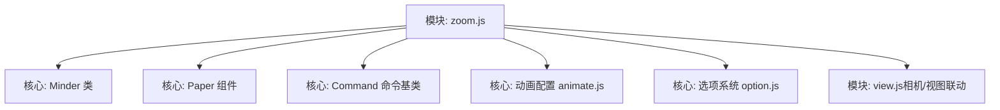
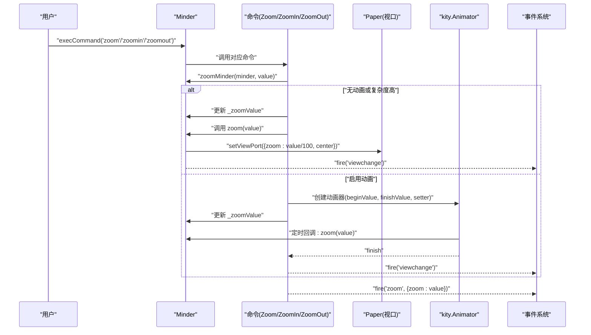
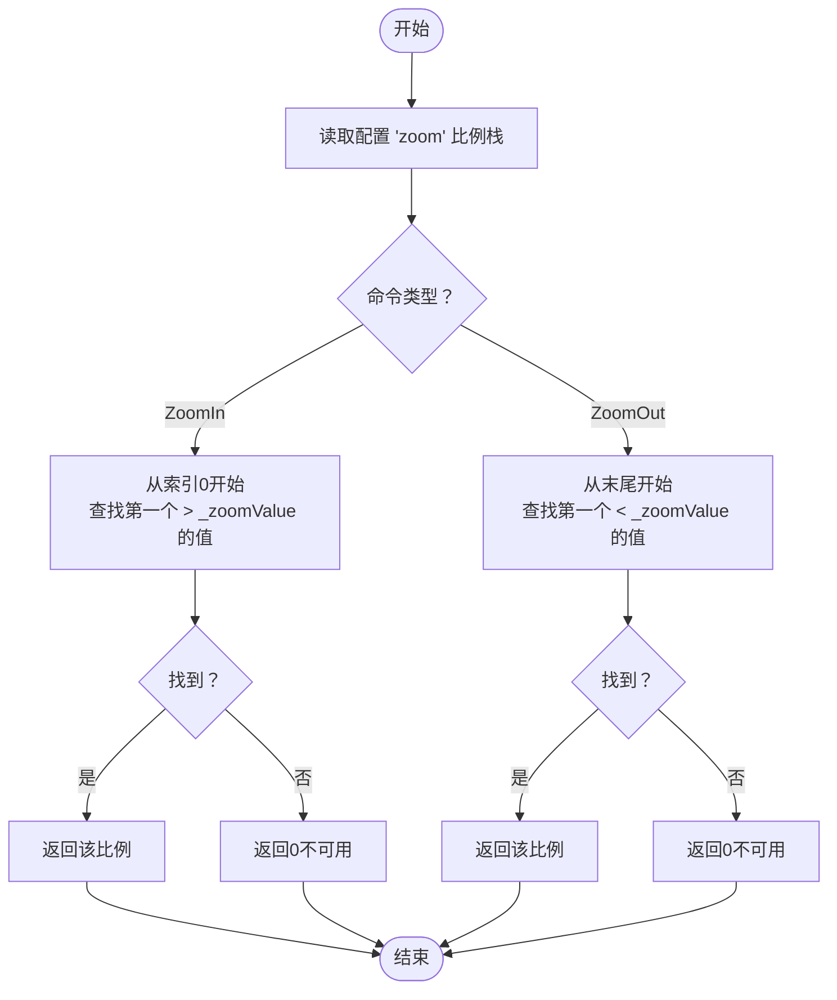
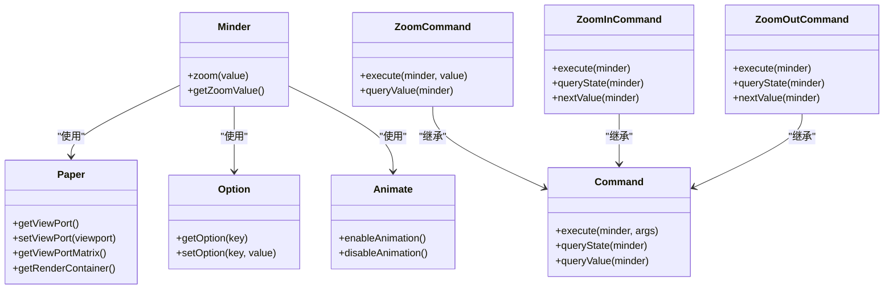

# 缩放控制

<cite>
**本文引用的文件**
- [src/module/zoom.js](file://src/module/zoom.js)
- [src/core/minder.js](file://src/core/minder.js)
- [src/core/paper.js](file://src/core/paper.js)
- [src/core/command.js](file://src/core/command.js)
- [src/core/animate.js](file://src/core/animate.js)
- [src/core/option.js](file://src/core/option.js)
- [src/module/view.js](file://src/module/view.js)
</cite>

## 目录
1. [简介](#简介)
2. [项目结构](#项目结构)
3. [核心组件](#核心组件)
4. [架构总览](#架构总览)
5. [详细组件分析](#详细组件分析)
6. [依赖关系分析](#依赖关系分析)
7. [性能考量](#性能考量)
8. [故障排查指南](#故障排查指南)
9. [结论](#结论)
10. [附录：使用示例与配置](#附录使用示例与配置)

## 简介
本章节聚焦于缩放控制模块（zoom.js）的设计与实现，围绕以下目标展开：
- 解析 Minder 类的 zoom 方法如何驱动视口缩放，并说明内部状态 _zoomValue 的管理机制
- 分析 ZoomInCommand 与 ZoomOutCommand 的执行逻辑，解释基于配置选项 'zoom' 的比例栈遍历算法
- 描述鼠标滚轮事件监听与处理机制，包括 Ctrl/Cmd 键修饰符检测与滚轮事件稀释策略
- 说明缩放动画的实现原理，涵盖 kity.Animator 使用、时间线管理与性能优化（大规模节点时禁用动画）
- 解释文本渲染模式的动态切换逻辑（geometricPrecision 与 optimize-speed）
- 提供通过 execCommand 进行程序化缩放的实际使用示例与自定义缩放比例栈的配置方法

## 项目结构
缩放控制模块位于模块目录下，与核心类 Minder、Paper、Command、动画与选项系统协同工作。其职责是：
- 为 Minder 扩展 zoom 与 getZoomValue 方法
- 注册缩放相关命令（Zoom、ZoomIn、ZoomOut）
- 处理鼠标滚轮事件，结合快捷键触发缩放命令
- 在缩放过程中维护 _zoomValue 状态并触发视图变更事件

图表来源
- [src/module/zoom.js](file://src/module/zoom.js#L1-L195)
- [src/core/minder.js](file://src/core/minder.js#L1-L41)
- [src/core/paper.js](file://src/core/paper.js#L1-L76)
- [src/core/command.js](file://src/core/command.js#L1-L169)
- [src/core/animate.js](file://src/core/animate.js#L1-L43)
- [src/core/option.js](file://src/core/option.js#L1-L34)
- [src/module/view.js](file://src/module/view.js#L209-L239)

章节来源
- [src/module/zoom.js](file://src/module/zoom.js#L1-L195)
- [src/core/minder.js](file://src/core/minder.js#L1-L41)
- [src/core/paper.js](file://src/core/paper.js#L1-L76)
- [src/core/command.js](file://src/core/command.js#L1-L169)
- [src/core/animate.js](file://src/core/animate.js#L1-L43)
- [src/core/option.js](file://src/core/option.js#L1-L34)
- [src/module/view.js](file://src/module/view.js#L209-L239)

## 核心组件
- Minder 类扩展
  - zoom(value): 通过 Paper 的视口接口设置缩放比例与中心点，必要时修正 CTM，使 100% 缩放时像素对齐更清晰
  - getZoomValue(): 返回当前内部状态 _zoomValue
- 命令体系
  - ZoomCommand: 将当前视图缩放到指定百分比
  - ZoomInCommand: 基于配置的缩放比例栈，寻找下一个更大的比例
  - ZoomOutCommand: 基于配置的缩放比例栈，寻找上一个更小的比例
- 事件与快捷键
  - 鼠标滚轮事件监听，仅当 Ctrl 或 Cmd 键按下时响应；通过超时稀释滚轮事件，避免高频滚动导致的频繁缩放
  - 快捷键映射：ctrl+= 触发放大，ctrl+- 触发缩小
- 文本渲染模式
  - 当 _zoomValue >= 100 时，设置文本渲染为 optimize-speed；否则为 geometricPrecision，平衡清晰度与性能

章节来源
- [src/module/zoom.js](file://src/module/zoom.js#L28-L78)
- [src/module/zoom.js](file://src/module/zoom.js#L80-L147)
- [src/module/zoom.js](file://src/module/zoom.js#L162-L193)
- [src/module/zoom.js](file://src/module/zoom.js#L16-L19)

## 架构总览
缩放控制模块通过 Minder 的扩展方法与命令系统，将用户操作（键盘、鼠标滚轮）转化为对 Paper 视口的调整，并在必要时启用动画过渡。同时，模块根据节点复杂度与全局动画配置决定是否启用缩放动画，确保在大规模场景下的流畅性。

图表来源
- [src/module/zoom.js](file://src/module/zoom.js#L45-L78)
- [src/core/command.js](file://src/core/command.js#L118-L165)
- [src/core/paper.js](file://src/core/paper.js#L18-L36)
- [src/core/animate.js](file://src/core/animate.js#L12-L17)

## 详细组件分析

### Minder 类的 zoom 方法与 _zoomValue 状态管理
- 设计要点
  - 通过 Paper 的视口接口设置 zoom 与 center，保持缩放中心稳定
  - 在缩放至 100% 时，修正 Paper 的 CTM，确保像素对齐，提升显示清晰度
  - 维护内部状态 _zoomValue，用于命令查询与动画起始值
- 数据流
  - 输入: value（百分比）
  - 中间: 计算 viewport.zoom = value / 100，保持 viewport.center
  - 输出: Paper 视口更新，必要时修正 CTM
- 事件与状态
  - 执行后触发 viewchange 事件，通知视图已更新
  - fire('zoom', {zoom: value}) 用于外部监听缩放事件

章节来源
- [src/module/zoom.js](file://src/module/zoom.js#L28-L43)
- [src/module/zoom.js](file://src/module/zoom.js#L21-L26)
- [src/module/zoom.js](file://src/module/zoom.js#L53-L78)

### 缩放动画与 kity.Animator 使用
- 动画条件
  - 当节点复杂度超过阈值或未启用动画时，直接应用缩放，不使用动画
  - 否则使用 kity.Animator，从 _zoomValue 到目标值进行插值
- 时间线管理
  - 若存在旧的时间线，先暂停再启动新的时间线
  - 动画完成时统一触发 viewchange 事件
- 性能优化
  - 复杂度阈值与动画时长由全局选项控制，复杂度高时禁用动画，保证交互流畅

章节来源
- [src/module/zoom.js](file://src/module/zoom.js#L53-L78)
- [src/core/animate.js](file://src/core/animate.js#L12-L17)

### ZoomInCommand 与 ZoomOutCommand 的比例栈遍历算法
- 算法思路
  - 读取配置选项 minder.getOption('zoom')，得到比例栈
  - ZoomIn: 从最小到最大遍历，返回第一个大于当前 _zoomValue 的比例
  - ZoomOut: 从最大到最小遍历，返回第一个小于当前 _zoomValue 的比例
  - 若无可用比例，返回 0，命令状态为不可用
- 状态查询
  - queryState 返回 0 或 -1，用于 UI 控件的可用性判断
- 只读模式
  - 两个命令均允许在只读模式下执行，便于演示与阅读场景

图表来源
- [src/module/zoom.js](file://src/module/zoom.js#L111-L118)
- [src/module/zoom.js](file://src/module/zoom.js#L138-L145)

章节来源
- [src/module/zoom.js](file://src/module/zoom.js#L80-L147)

### 鼠标滚轮事件监听与处理机制
- 修饰键检测
  - 仅当 Ctrl 或 Cmd 键按下时才响应滚轮事件
- 滚轮事件稀释策略
  - 通过比较 wheelDelta 的绝对值与阈值，对高频滚轮事件进行超时去抖
  - 仅在满足阈值时触发一次缩放，避免连续滚动造成过度缩放
- 事件传播
  - 阻止默认行为，防止页面滚动干扰
  - 根据 delta 正负分别触发 zoomin 或 zoomout

章节来源
- [src/module/zoom.js](file://src/module/zoom.js#L162-L193)

### 文本渲染模式的动态切换逻辑
- 切换规则
  - 当 _zoomValue >= 100 时，设置文本渲染为 optimize-speed，提升渲染性能
  - 当 _zoomValue < 100 时，设置文本渲染为 geometricPrecision，提高文字清晰度
- 应用范围
  - 作用于渲染容器的 text-rendering 属性，影响 SVG 文本绘制质量

章节来源
- [src/module/zoom.js](file://src/module/zoom.js#L16-L19)

### 与 Kity Paper 组件的交互方式
- 视口接口
  - 通过 Paper 的 getViewPort 与 setViewPort 设置缩放与中心点
  - 通过 getViewPortMatrix 获取视口矩阵，用于计算可视区域等
- 渲染容器
  - 通过 getRenderContainer 获取根组，设置 text-rendering 属性
- CTM 修正
  - 在 100% 缩放时修正 Paper.shapeNode 的 CTM，确保像素对齐

章节来源
- [src/module/zoom.js](file://src/module/zoom.js#L28-L39)
- [src/module/zoom.js](file://src/module/zoom.js#L21-L26)
- [src/core/paper.js](file://src/core/paper.js#L18-L36)
- [src/module/view.js](file://src/module/view.js#L78-L86)

## 依赖关系分析
- 模块内依赖
  - 依赖 kity、utils、minder、node、command、module、render
  - 通过 Module.register 注册模块，返回 init、commands、events、commandShortcutKeys
- 与核心类的关系
  - Minder 扩展 zoom 与 getZoomValue
  - Command 提供命令基类与执行流程
  - Paper 提供视口与渲染容器访问
  - animate.js 提供全局动画选项与开关
  - option.js 提供 getOption/setOption 接口
- 与其他模块的协作
  - view.js 的相机命令与视图移动可与缩放配合使用

图表来源
- [src/module/zoom.js](file://src/module/zoom.js#L80-L147)
- [src/core/command.js](file://src/core/command.js#L1-L169)
- [src/core/paper.js](file://src/core/paper.js#L18-L36)
- [src/core/animate.js](file://src/core/animate.js#L12-L42)
- [src/core/option.js](file://src/core/option.js#L18-L33)

章节来源
- [src/module/zoom.js](file://src/module/zoom.js#L1-L195)
- [src/core/command.js](file://src/core/command.js#L1-L169)
- [src/core/paper.js](file://src/core/paper.js#L1-L76)
- [src/core/animate.js](file://src/core/animate.js#L1-L43)
- [src/core/option.js](file://src/core/option.js#L1-L34)

## 性能考量
- 动画禁用策略
  - 当节点复杂度超过阈值或全局动画被禁用时，跳过动画，直接应用缩放
- 文本渲染优化
  - 在高倍率下采用 optimize-speed，降低渲染开销
- 滚轮事件稀释
  - 通过超时与阈值过滤高频滚轮事件，减少不必要的命令触发
- CTM 修正
  - 100% 缩放时修正 CTM，改善像素对齐，减少模糊感

章节来源
- [src/module/zoom.js](file://src/module/zoom.js#L53-L78)
- [src/module/zoom.js](file://src/module/zoom.js#L16-L19)
- [src/module/zoom.js](file://src/module/zoom.js#L162-L193)
- [src/core/animate.js](file://src/core/animate.js#L12-L42)

## 故障排查指南
- 缩放无效
  - 检查是否正确传入百分比值；确认命令状态是否可用（queryCommandState）
  - 确认配置选项 'zoom' 是否包含目标比例
- 动画异常
  - 检查全局动画选项是否被禁用或复杂度阈值是否过高
  - 确认动画时间线是否被中断或覆盖
- 文本渲染模糊
  - 当缩放低于 100 时应使用 geometricPrecision；高于等于 100 时使用 optimize-speed
- 滚轮无响应
  - 确认 Ctrl/Cmd 键是否按下；检查滚轮事件是否被稀释过滤
- 视图未更新
  - 确认是否触发了 viewchange 事件；检查 Paper 的视口设置是否成功

章节来源
- [src/module/zoom.js](file://src/module/zoom.js#L80-L147)
- [src/core/command.js](file://src/core/command.js#L87-L165)
- [src/core/animate.js](file://src/core/animate.js#L12-L42)

## 结论
缩放控制模块通过简洁的命令与状态管理，实现了对 Kity Paper 视口的可控缩放，并在性能与体验之间取得平衡。其关键特性包括：
- 基于配置的比例栈驱动的缩放命令
- 基于节点复杂度与全局选项的动画策略
- 针对高倍率的文本渲染优化
- 面向用户的滚轮与快捷键交互

这些设计使得缩放在大规模节点场景下仍能保持流畅，同时为用户提供直观的缩放控制能力。

## 附录：使用示例与配置

### 通过 execCommand 进行程序化缩放
- 缩放到指定百分比
  - 使用命令名 'zoom' 并传入百分比数值
- 放大/缩小到下一个/上一个比例等级
  - 使用命令名 'zoomin' 或 'zoomout'

章节来源
- [src/core/command.js](file://src/core/command.js#L118-L165)
- [src/module/zoom.js](file://src/module/zoom.js#L80-L147)

### 配置自定义缩放比例栈
- 默认比例栈
  - 模块初始化时设置默认比例栈
- 自定义比例栈
  - 通过设置选项 'zoom' 为数组，例如 [10, 20, 50, 100, 200]
- 动画时长
  - 通过选项 'zoomAnimationDuration' 控制缩放动画时长；设为 0 可禁用动画

章节来源
- [src/module/zoom.js](file://src/module/zoom.js#L149-L156)
- [src/core/option.js](file://src/core/option.js#L18-L33)
- [src/core/animate.js](file://src/core/animate.js#L12-L17)