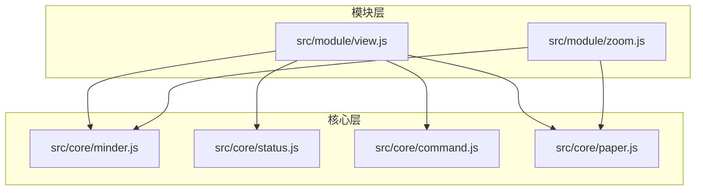
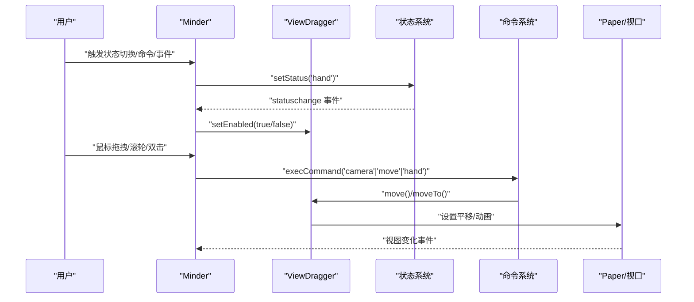
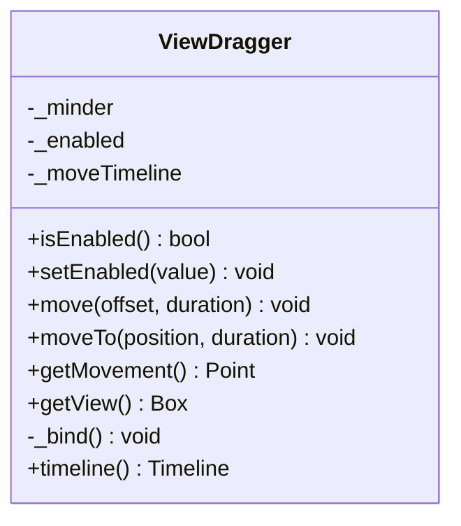
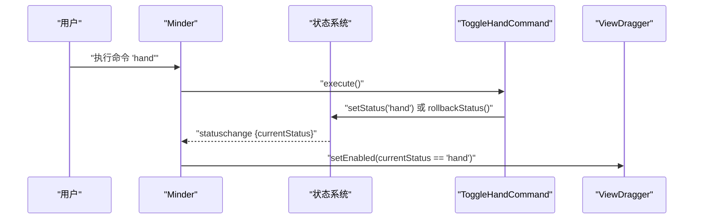
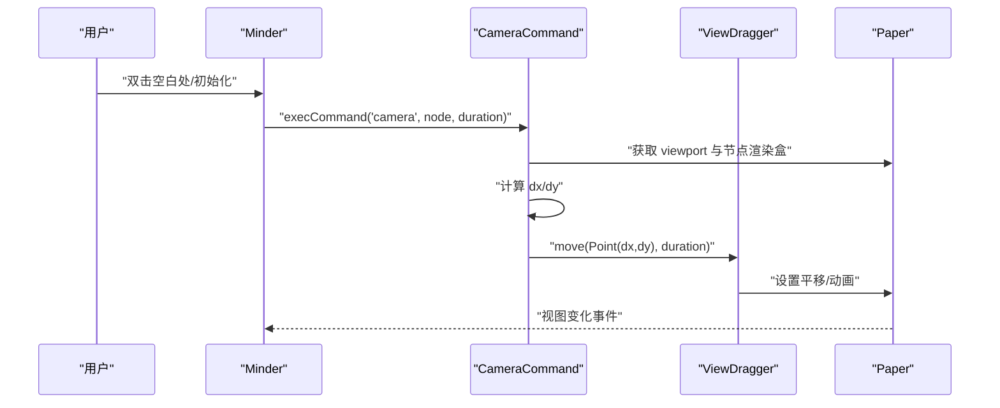
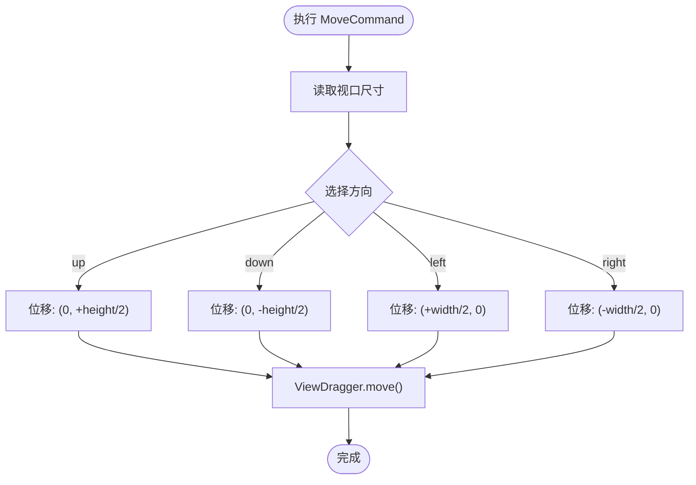
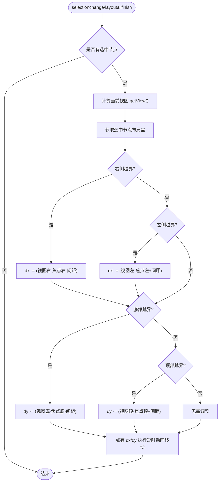
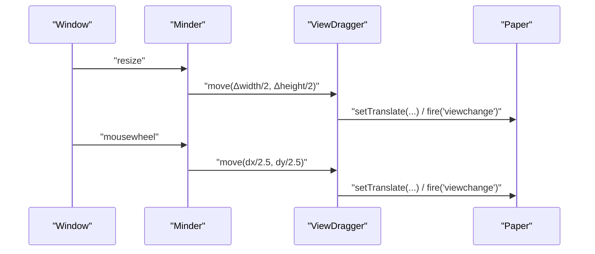
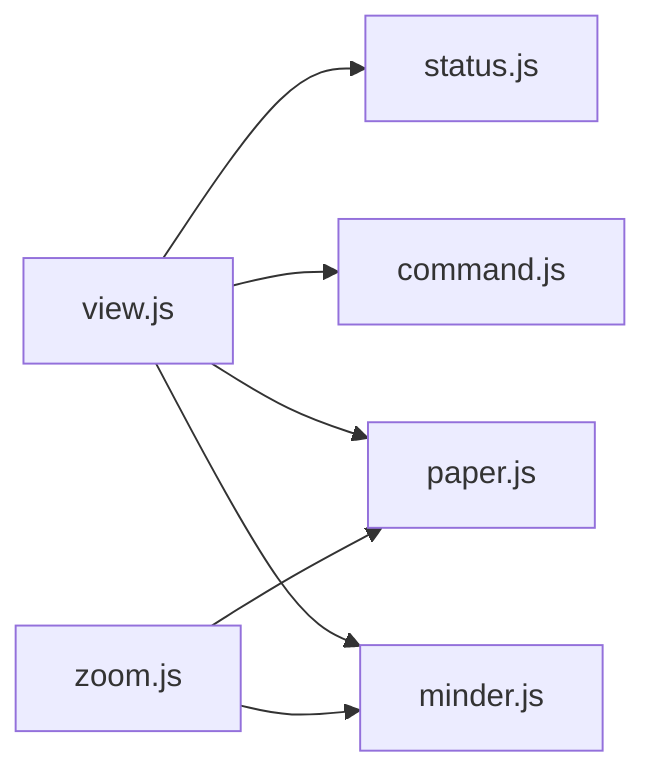

# 视图控制

<cite>
**本文引用的文件**
- [src/module/view.js](file://src/module/view.js)
- [src/core/status.js](file://src/core/status.js)
- [src/core/command.js](file://src/core/command.js)
- [src/core/paper.js](file://src/core/paper.js)
- [src/core/minder.js](file://src/core/minder.js)
- [src/module/zoom.js](file://src/module/zoom.js)
</cite>

## 目录
1. [简介](#简介)
2. [项目结构](#项目结构)
3. [核心组件](#核心组件)
4. [架构总览](#架构总览)
5. [详细组件分析](#详细组件分析)
6. [依赖关系分析](#依赖关系分析)
7. [性能考量](#性能考量)
8. [故障排查指南](#故障排查指南)
9. [结论](#结论)

## 简介
本文件深入解析视图控制模块（view.js）的架构与实现，重点覆盖：
- ViewDragger 类的设计：状态管理（enabled）、鼠标拖拽事件绑定机制、视图移动的动画实现
- 抓手模式（Hand）的切换逻辑及其与状态系统（status）的集成
- CameraCommand 如何实现节点定位居中：视口坐标计算、偏移量确定、动画过渡
- MoveCommand 的方向移动功能实现原理
- 视图边界检测与自动调整机制：节点选择与布局完成后自动定位策略
- 视图变换矩阵的计算方法与响应式设计支持（resize 事件处理）
- 性能优化建议：动画时间线管理、事件节流策略

## 项目结构
视图控制模块位于模块目录中，围绕核心类与命令系统协作，通过状态机驱动交互行为，并与渲染容器、纸张视口矩阵协同工作。

图表来源
- [src/module/view.js](file://src/module/view.js#L1-L397)
- [src/core/status.js](file://src/core/status.js#L1-L60)
- [src/core/command.js](file://src/core/command.js#L1-L169)
- [src/core/paper.js](file://src/core/paper.js#L1-L76)
- [src/core/minder.js](file://src/core/minder.js#L1-L41)
- [src/module/zoom.js](file://src/module/zoom.js#L1-L195)

章节来源
- [src/module/view.js](file://src/module/view.js#L1-L397)

## 核心组件
- ViewDragger：负责视图拖拽与平移，封装动画与事件绑定，提供移动与定位能力
- ToggleHandCommand：切换抓手状态（hand），与状态系统联动
- CameraCommand：将视野中心对齐到指定节点，计算偏移并执行动画
- MoveCommand：按方向移动视野，基于视口尺寸进行步进
- 状态系统（status）：维护当前状态与回滚状态，驱动视图拖拽启用/禁用
- 命令系统（command）：统一命令接口，提供执行、查询状态与内容变更标记
- Paper 与 RenderContainer：提供视口矩阵、渲染容器与视图变换

章节来源
- [src/module/view.js](file://src/module/view.js#L1-L397)
- [src/core/status.js](file://src/core/status.js#L1-L60)
- [src/core/command.js](file://src/core/command.js#L1-L169)
- [src/core/paper.js](file://src/core/paper.js#L1-L76)

## 架构总览
视图控制模块通过模块注册的方式挂载到 Minder 实例，内部创建 ViewDragger 并注册三个命令：hand、camera、move。事件系统监听状态变化、鼠标滚轮、双击、初始化完成、窗口 resize 以及选择变化与布局完成，结合状态机与命令系统共同完成视图交互。

图表来源
- [src/module/view.js](file://src/module/view.js#L1-L397)
- [src/core/status.js](file://src/core/status.js#L1-L60)
- [src/core/command.js](file://src/core/command.js#L1-L169)
- [src/core/paper.js](file://src/core/paper.js#L1-L76)

## 详细组件分析

### ViewDragger 类设计与实现
- 状态管理（enabled）
  - 提供 isEnabled/setEnabled 接口，根据状态切换光标样式与启用标志位
  - 与状态系统联动：statuschange 事件驱动启用/禁用
- 鼠标拖拽事件绑定机制
  - 绑定多种事件类型：普通态与只读态下的 mousedown/touchstart、mousemove/touchmove、mouseup/touchend
  - 支持临时拖拽：点击未选中根节点或中键/Alt 时临时开启拖拽，松开后恢复状态
  - 手势拖拽：当已处于 hand 状态且启用时，记录最后位置并持续计算偏移进行平移
  - 阻止默认行为：触摸移动阻止浏览器后退，右键拖拽阻止默认菜单
- 视图移动与动画
  - move(offset, duration)：累计偏移并调用 moveTo
  - moveTo(position, duration)：若提供时长，使用 kity.Animator 创建动画时间线；否则直接设置平移并触发视图变化事件
  - 动画完成回调清理时间线引用，避免悬挂
- 视图边界与视口坐标
  - getView()：基于当前客户端尺寸、移动量与视口矩阵反变换，计算当前可视区域盒

图表来源
- [src/module/view.js](file://src/module/view.js#L11-L176)

章节来源
- [src/module/view.js](file://src/module/view.js#L11-L176)

### 抓手模式（Hand）切换逻辑与状态系统集成
- ToggleHandCommand
  - 切换 minder 的状态为 'hand' 或回滚至上一个状态
  - queryState 返回当前是否处于 hand 状态
- 状态系统（status）
  - setStatus/rollbackStatus 维护当前状态与回滚状态，触发 statuschange 事件
- 集成方式
  - 视图模块监听 statuschange，根据当前状态调用 ViewDragger.setEnabled
  - ViewDragger 在启用时改变光标样式，进入拖拽流程

图表来源
- [src/module/view.js](file://src/module/view.js#L183-L205)
- [src/core/status.js](file://src/core/status.js#L1-L60)
- [src/core/command.js](file://src/core/command.js#L1-L169)

章节来源
- [src/module/view.js](file://src/module/view.js#L183-L205)
- [src/core/status.js](file://src/core/status.js#L1-L60)

### CameraCommand：节点定位居中
- 功能目标：将视野中心对齐到指定节点
- 关键步骤
  - 获取视口中心 viewport.center
  - 计算目标节点渲染盒在视图坐标系中的位置 offset（getRenderBox('view')）
  - 计算偏移 dx/dy：使节点中心与视口中心对齐
  - 读取动画时长配置，调用 ViewDragger.move 执行动画
- 事件触发
  - 双击空白处触发：在 paper 上双击时执行 camera 到根节点
  - 初始化完成：finishInitHook 中执行 camera，确保首次渲染时居中

图表来源
- [src/module/view.js](file://src/module/view.js#L209-L231)
- [src/core/paper.js](file://src/core/paper.js#L1-L76)

章节来源
- [src/module/view.js](file://src/module/view.js#L209-L231)

### MoveCommand：方向移动
- 功能目标：按方向移动视野，步进为视口高度/宽度的一半
- 实现原理
  - 读取 lastClientSize，根据方向构造位移向量
  - 读取动画时长配置，调用 ViewDragger.move 执行
- 适用场景：键盘导航、快捷键或工具条按钮触发

图表来源
- [src/module/view.js](file://src/module/view.js#L233-L269)

章节来源
- [src/module/view.js](file://src/module/view.js#L233-L269)

### 视图边界检测与自动调整
- 自动定位策略
  - selectionchange/layoutallfinish 事件中：若存在选中节点，计算其布局盒与当前视图的相对位置
  - 若节点超出视图边界，则计算需要的 dx/dy，使节点回到可视范围内并留出安全间距
  - 若存在正在进行的动画，等待动画结束后再执行，避免位置计算错误
- 边界检测逻辑
  - 分别检查左右与上下边界，累加偏移量
  - 仅在 dx/dy 非零时执行短时动画移动

图表来源
- [src/module/view.js](file://src/module/view.js#L338-L394)

章节来源
- [src/module/view.js](file://src/module/view.js#L338-L394)

### 视图变换矩阵与响应式设计
- 视图变换矩阵
  - getView() 基于 lastClientSize、当前移动量与 paper 的视口矩阵 inverse，计算当前可视区域盒
  - 通过 setTranslate 对渲染容器进行平移，配合 fire('viewchange') 通知视图变化
- 响应式设计支持
  - resize 事件：计算新旧尺寸差值，将差值的一半作为平移量，补偿因容器尺寸变化导致的视觉偏移
  - mousewheel 事件：在无 Ctrl/Shift 时，将滚轮增量转换为平移量并触发视图变化

图表来源
- [src/module/view.js](file://src/module/view.js#L328-L337)
- [src/module/view.js](file://src/module/view.js#L284-L312)
- [src/module/view.js](file://src/module/view.js#L71-L86)

章节来源
- [src/module/view.js](file://src/module/view.js#L71-L86)
- [src/module/view.js](file://src/module/view.js#L284-L337)

## 依赖关系分析
- 模块内依赖
  - view.js 依赖 core/status、core/command、core/paper、core/minder
  - 与 zoom 模块共享视图变化事件与视口概念
- 外部依赖
  - kity：提供图形与动画能力（Animator、Matrix、Point、Box）
- 耦合与内聚
  - ViewDragger 与 Minder 强耦合（持有 minder 引用），但通过命令系统与事件系统降低跨模块耦合
  - 命令系统提供统一接口，便于扩展新命令

图表来源
- [src/module/view.js](file://src/module/view.js#L1-L397)
- [src/core/status.js](file://src/core/status.js#L1-L60)
- [src/core/command.js](file://src/core/command.js#L1-L169)
- [src/core/paper.js](file://src/core/paper.js#L1-L76)
- [src/core/minder.js](file://src/core/minder.js#L1-L41)
- [src/module/zoom.js](file://src/module/zoom.js#L1-L195)

章节来源
- [src/module/view.js](file://src/module/view.js#L1-L397)

## 性能考量
- 动画时间线管理
  - moveTo 中若已有动画时间线，先停止再启动新的动画，避免时间线堆积
  - 动画完成回调及时清理引用，防止内存泄漏
- 事件节流与去抖
  - mousewheel 事件使用定时器合并多次滚动，减少频繁触发视图变化
  - selectionchange 与布局完成事件中，若存在动画正在执行，等待动画结束后再执行自动定位，避免重复计算与抖动
- 渲染与视口
  - 缩放模块在复杂度较高时直接应用缩放，避免不必要的动画
  - 视图模块在初始化与 resize 时采用短距离平移补偿，减少重排成本

章节来源
- [src/module/view.js](file://src/module/view.js#L45-L69)
- [src/module/view.js](file://src/module/view.js#L284-L312)
- [src/module/view.js](file://src/module/view.js#L352-L394)
- [src/module/zoom.js](file://src/module/zoom.js#L45-L73)

## 故障排查指南
- 拖拽无效
  - 检查状态是否为 hand，statuschange 是否正确触发 ViewDragger.setEnabled
  - 确认临时拖拽条件（点击根节点、中键、Alt）是否满足
- 视图不居中
  - 双击空白处是否触发 camera 命令
  - 初始化完成后是否执行了 camera（finishInitHook）
- 边界检测不生效
  - selectionchange 与 layoutallfinish 事件是否触发
  - 是否存在正在进行的动画导致延迟执行
- 响应式异常
  - resize 事件是否正确计算 Δwidth/Δheight 并补偿平移
  - mousewheel 是否被 Ctrl/Shift 阻断

章节来源
- [src/module/view.js](file://src/module/view.js#L115-L175)
- [src/module/view.js](file://src/module/view.js#L183-L205)
- [src/module/view.js](file://src/module/view.js#L313-L327)
- [src/module/view.js](file://src/module/view.js#L338-L394)
- [src/module/view.js](file://src/module/view.js#L328-L337)
- [src/module/view.js](file://src/module/view.js#L284-L312)

## 结论
视图控制模块通过 ViewDragger 将事件、状态与命令有机结合，实现了灵活的视图交互体验。ViewDragger 的动画与事件绑定保证了流畅的拖拽与平移；CameraCommand 与 MoveCommand 提供了精准的定位与导航能力；边界检测与自动调整机制提升了用户体验；响应式设计与事件节流策略兼顾了性能与稳定性。整体架构清晰、职责明确，易于扩展与维护。