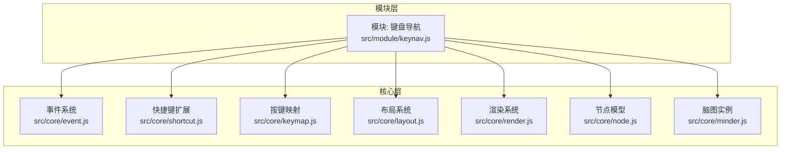
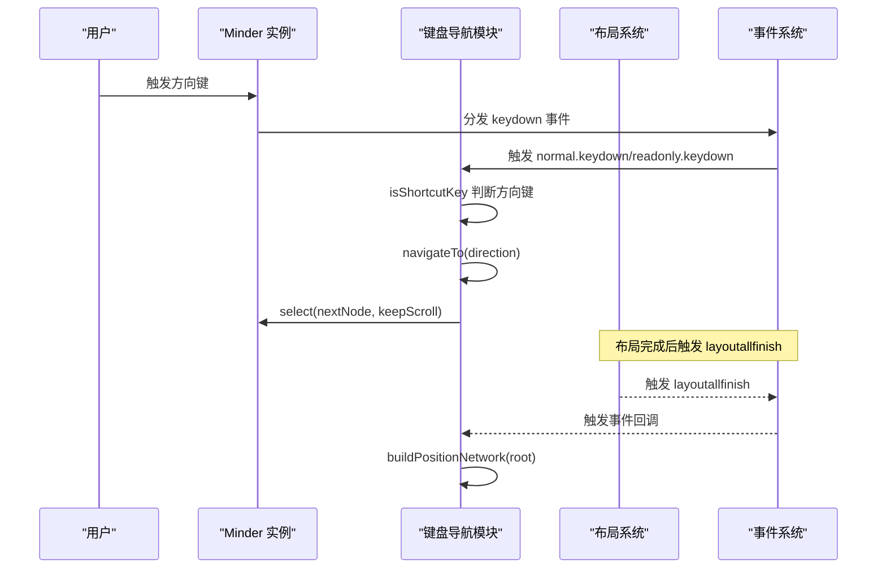
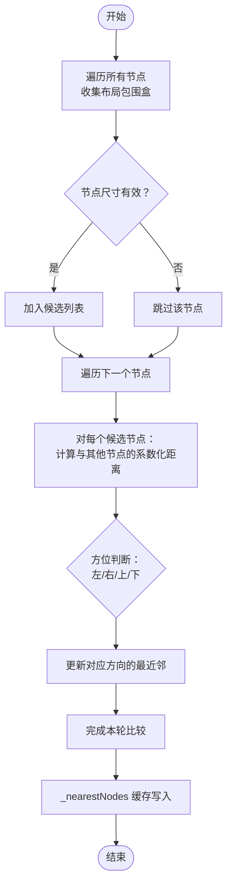
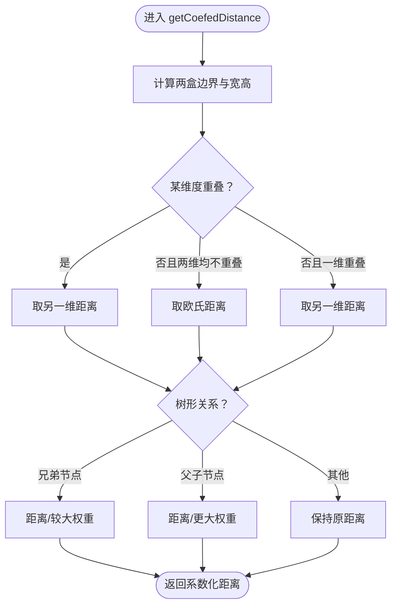
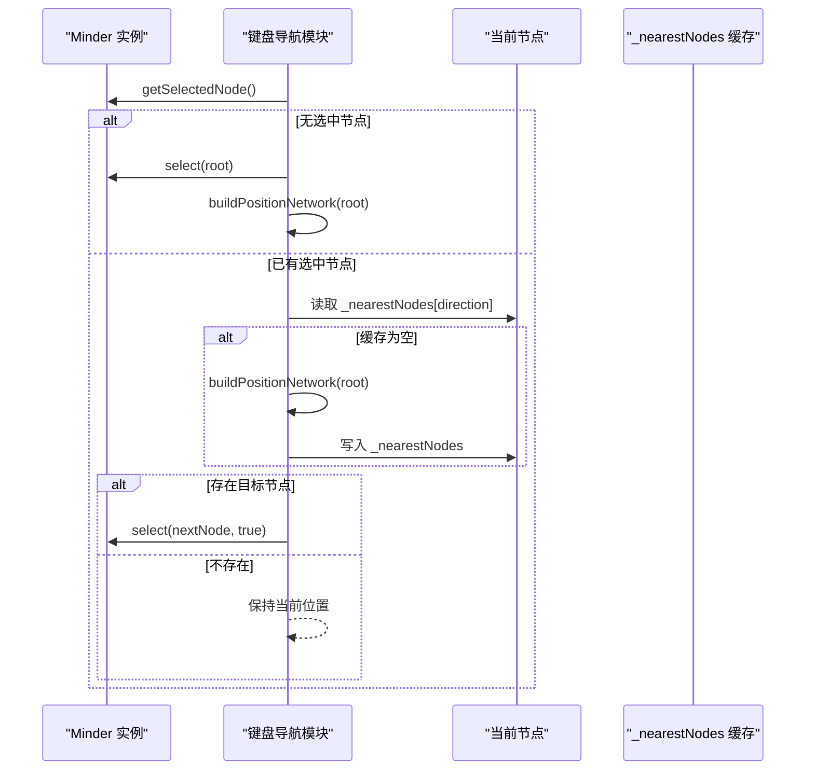
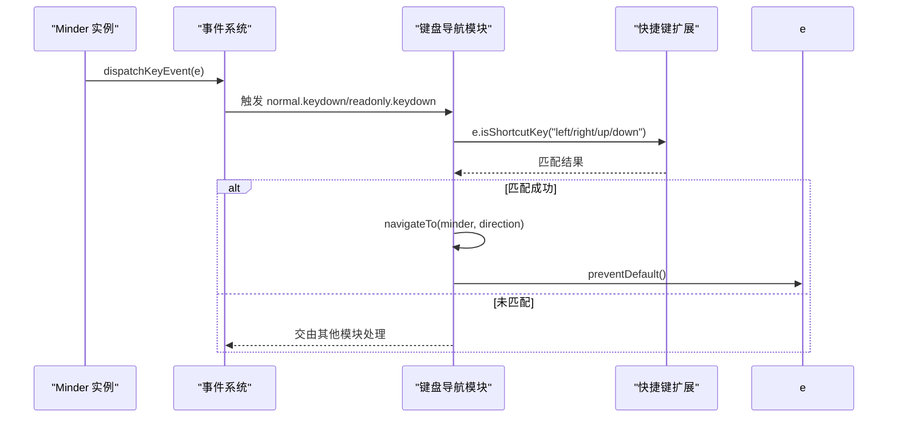
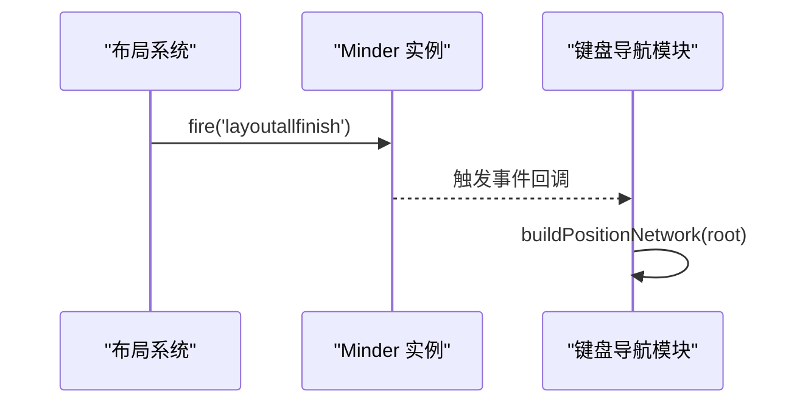
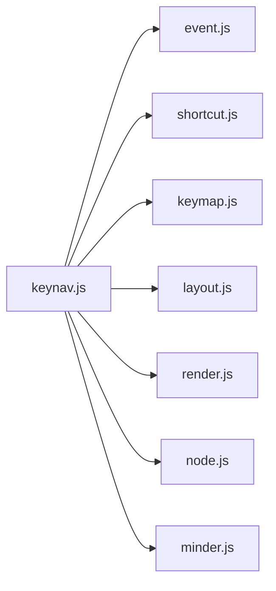

# 键盘导航

<cite>
**本文引用的文件**
- [src/module/keynav.js](file://src/module/keynav.js)
- [src/core/keymap.js](file://src/core/keymap.js)
- [src/core/shortcut.js](file://src/core/shortcut.js)
- [src/core/event.js](file://src/core/event.js)
- [src/core/layout.js](file://src/core/layout.js)
- [src/core/render.js](file://src/core/render.js)
- [src/core/node.js](file://src/core/node.js)
- [src/core/minder.js](file://src/core/minder.js)
</cite>

## 目录
1. [简介](#简介)
2. [项目结构](#项目结构)
3. [核心组件](#核心组件)
4. [架构总览](#架构总览)
5. [详细组件分析](#详细组件分析)
6. [依赖关系分析](#依赖关系分析)
7. [性能考量](#性能考量)
8. [故障排查指南](#故障排查指南)
9. [结论](#结论)
10. [附录](#附录)

## 简介
本文件围绕键盘导航模块（keynav.js）进行系统化技术文档梳理，重点阐释以下内容：
- 基于布局坐标的导航网络构建算法：节点遍历、有效节点筛选、空间索引建立。
- getCoefedDistance 距离计算函数：如何综合几何距离与树形结构关系（兄弟节点、父子节点权重调整）。
- 方向导航（上下左右）的最近邻节点查找逻辑与缓存机制。
- keydown 事件监听与处理流程：快捷键识别、默认行为阻止。
- 布局变化后导航网络的自动重建机制（layoutallfinish 事件响应）。
- 无障碍访问支持最佳实践与大规模思维导图的性能优化建议。

## 项目结构
键盘导航模块位于模块目录下，依赖核心事件、快捷键、布局与节点等能力；同时与 minder 实例的事件分发体系紧密耦合。

图表来源
- [src/module/keynav.js](file://src/module/keynav.js#L1-L171)
- [src/core/event.js](file://src/core/event.js#L1-L270)
- [src/core/shortcut.js](file://src/core/shortcut.js#L1-L154)
- [src/core/keymap.js](file://src/core/keymap.js#L1-L128)
- [src/core/layout.js](file://src/core/layout.js#L330-L524)
- [src/core/render.js](file://src/core/render.js#L245-L261)
- [src/core/node.js](file://src/core/node.js#L1-L407)
- [src/core/minder.js](file://src/core/minder.js#L1-L41)

章节来源
- [src/module/keynav.js](file://src/module/keynav.js#L1-L171)

## 核心组件
- 导航网络构建器：遍历整棵树，收集可见节点的布局包围盒，建立“最近邻”映射。
- 距离计算器：综合几何距离与树形权重，返回带权重的“系数化距离”。
- 方向导航器：根据当前选中节点的最近邻映射，选择目标节点并触发选中。
- 事件处理器：监听 keydown 与布局完成事件，分别执行导航与重建。
- 快捷键识别：通过 isShortcutKey 判断方向键组合是否命中。

章节来源
- [src/module/keynav.js](file://src/module/keynav.js#L19-L171)
- [src/core/shortcut.js](file://src/core/shortcut.js#L62-L69)
- [src/core/keymap.js](file://src/core/keymap.js#L1-L128)

## 架构总览
键盘导航模块通过模块注册的方式挂载到 Minder 实例，订阅两类事件：
- 布局完成事件：当布局动画结束时重建导航网络。
- 键盘事件：捕获方向键，识别快捷键组合，阻止默认行为并执行导航。

图表来源
- [src/module/keynav.js](file://src/module/keynav.js#L154-L171)
- [src/core/shortcut.js](file://src/core/shortcut.js#L62-L69)
- [src/core/event.js](file://src/core/event.js#L153-L182)
- [src/core/layout.js](file://src/core/layout.js#L423-L436)

## 详细组件分析

### 导航网络构建算法
- 节点遍历与有效节点筛选
  - 使用树遍历方法遍历所有节点，获取每个节点的布局包围盒。
  - 仅保留宽度与高度均存在的节点，避免折叠/隐藏节点参与导航。
- 空间索引与最近邻查找
  - 对每个节点，计算与其他节点的“系数化距离”，按方位（左、右、上、下）维护最近邻候选。
  - 最终将最近邻映射写入节点的内部缓存，供导航使用。

图表来源
- [src/module/keynav.js](file://src/module/keynav.js#L19-L133)

章节来源
- [src/module/keynav.js](file://src/module/keynav.js#L19-L133)

### 距离计算函数 getCoefedDistance
- 几何距离
  - 通过两个包围盒的边界差值计算二维距离：若两盒在某一维度重叠，则该维距离为 0；否则为非负距离。
- 树形权重调整
  - 兄弟节点：同父节点时距离除以较大权重，优先选择横向相邻节点。
  - 父节点：当前节点为父节点的子节点时距离除以更大权重，优先选择纵向层级移动。
- 返回值
  - 返回加权后的“系数化距离”，用于最近邻选择。

图表来源
- [src/module/keynav.js](file://src/module/keynav.js#L45-L72)

章节来源
- [src/module/keynav.js](file://src/module/keynav.js#L45-L72)

### 方向导航与缓存机制
- 导航入口
  - 若无选中节点，先选中根节点并重建网络。
  - 若当前节点未建立最近邻映射，先重建网络。
- 导航执行
  - 根据方向键映射（上→top）从缓存读取最近邻节点。
  - 若存在目标节点，调用实例选中接口并保持滚动定位。
- 缓存结构
  - 每个节点保存 _nearestNodes 映射，键为方向字符串，值为目标节点或空。

图表来源
- [src/module/keynav.js](file://src/module/keynav.js#L135-L149)

章节来源
- [src/module/keynav.js](file://src/module/keynav.js#L135-L149)

### 键盘事件监听与处理
- 事件绑定
  - 订阅 normal.keydown 与 readonly.keydown 两类事件，确保只在可编辑或只读状态下处理方向键。
- 快捷键识别
  - 使用 isShortcutKey 方法判断方向键组合是否匹配，支持 Ctrl/Cmd/Alt/Shift 等修饰键组合。
- 默认行为阻止
  - 一旦命中方向键，立即阻止默认滚动行为，保证键盘导航体验一致。
- 事件传播
  - 事件系统支持在模块内阻止传播，避免重复处理。

图表来源
- [src/module/keynav.js](file://src/module/keynav.js#L159-L167)
- [src/core/shortcut.js](file://src/core/shortcut.js#L62-L69)
- [src/core/event.js](file://src/core/event.js#L153-L182)

章节来源
- [src/module/keynav.js](file://src/module/keynav.js#L159-L167)
- [src/core/shortcut.js](file://src/core/shortcut.js#L62-L69)
- [src/core/event.js](file://src/core/event.js#L153-L182)

### 布局变化后的自动重建
- 触发时机
  - 布局动画结束后，实例会异步触发 layoutallfinish 事件。
- 重建流程
  - 模块监听该事件，重新扫描整棵树并更新最近邻映射，确保导航与视觉布局一致。

图表来源
- [src/core/layout.js](file://src/core/layout.js#L423-L436)
- [src/module/keynav.js](file://src/module/keynav.js#L155-L158)

章节来源
- [src/core/layout.js](file://src/core/layout.js#L423-L436)
- [src/module/keynav.js](file://src/module/keynav.js#L155-L158)

## 依赖关系分析
- 模块依赖
  - 键盘导航模块依赖事件系统、快捷键扩展、按键映射、布局系统、渲染系统与节点模型。
- 关键接口
  - getLayoutBox：获取节点在全局布局下的包围盒，作为导航网络的几何基础。
  - isShortcutKey：统一的方向键识别入口。
  - traverse：树遍历，用于收集节点与构建网络。
  - fire：事件分发，触发布局完成与键盘事件。

图表来源
- [src/module/keynav.js](file://src/module/keynav.js#L1-L171)
- [src/core/event.js](file://src/core/event.js#L1-L270)
- [src/core/shortcut.js](file://src/core/shortcut.js#L1-L154)
- [src/core/keymap.js](file://src/core/keymap.js#L1-L128)
- [src/core/layout.js](file://src/core/layout.js#L330-L524)
- [src/core/render.js](file://src/core/render.js#L245-L261)
- [src/core/node.js](file://src/core/node.js#L1-L407)
- [src/core/minder.js](file://src/core/minder.js#L1-L41)

章节来源
- [src/module/keynav.js](file://src/module/keynav.js#L1-L171)
- [src/core/layout.js](file://src/core/layout.js#L330-L524)
- [src/core/shortcut.js](file://src/core/shortcut.js#L62-L69)

## 性能考量
- 复杂度与规模
  - 导航网络构建为 O(N^2)（双重循环比较），在节点数量较多时需谨慎。
  - 布局系统在节点复杂度超过阈值时会关闭动画，减少主线程压力。
- 缓存与增量
  - 通过 _nearestNodes 缓存避免每次导航都重建网络，显著降低开销。
  - 仅在布局完成或首次导航时重建，避免频繁扫描。
- 大规模优化建议
  - 限制导航节点集合：仅对可视区域内的节点建立网络，或按层级分段构建。
  - 空间索引：引入四叉树/区间树等结构，将最近邻查找降为近似 O(log N)。
  - 批处理与节流：在高频布局更新场景下，合并多次重建请求。
  - 渐进式重建：延迟到空闲时间再重建，避免阻塞交互。

章节来源
- [src/module/keynav.js](file://src/module/keynav.js#L19-L133)
- [src/core/layout.js](file://src/core/layout.js#L458-L519)

## 故障排查指南
- 导航无效
  - 检查是否已选中节点；若无选中节点，模块会自动选中根节点并重建网络。
  - 确认方向键是否被 isShortcutKey 正确识别（含修饰键组合）。
- 导航错乱
  - 确认布局已完成（layoutallfinish 事件已触发），否则网络尚未更新。
  - 检查节点是否处于折叠状态（尺寸为 0 的节点不会被纳入导航网络）。
- 默认行为未阻止
  - 确认事件回调中调用了 preventDefault，并检查事件是否正确分发至模块。

章节来源
- [src/module/keynav.js](file://src/module/keynav.js#L135-L167)
- [src/core/shortcut.js](file://src/core/shortcut.js#L62-L69)
- [src/core/event.js](file://src/core/event.js#L153-L182)

## 结论
键盘导航模块通过“布局包围盒 + 系数化距离 + 树形权重”的组合策略，实现了直观、稳定的方向导航体验。其关键优势在于：
- 基于真实布局坐标，导航与视觉一致。
- 通过缓存与事件驱动的重建，兼顾性能与一致性。
- 与快捷键系统无缝集成，支持多修饰键组合。

在大规模思维导图场景下，建议结合空间索引与渐进式重建等手段进一步优化性能。

## 附录
- 无障碍访问最佳实践
  - 确保键盘焦点清晰，每次导航后将焦点移动到目标节点。
  - 提供可访问的标签与描述，便于屏幕阅读器识别节点语义。
  - 保持导航顺序符合认知习惯（层级优先、同级次序稳定）。
  - 在布局动态变化时，及时更新可访问信息并发出提示。