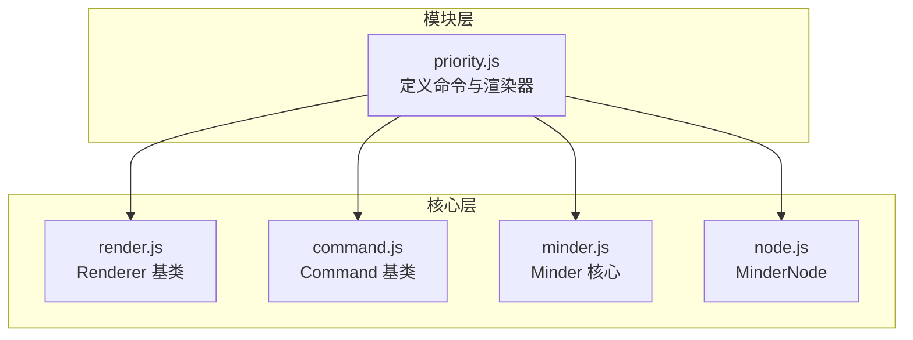
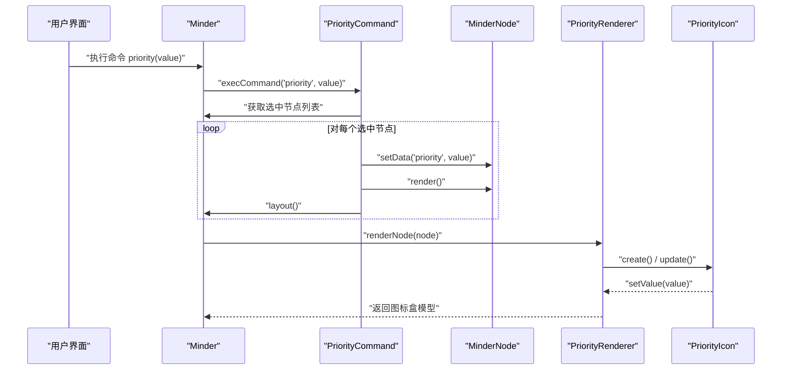
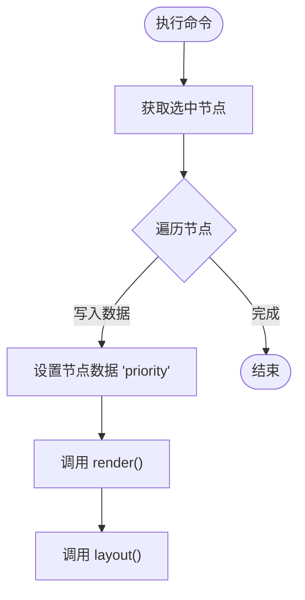
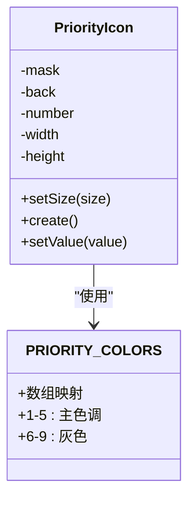
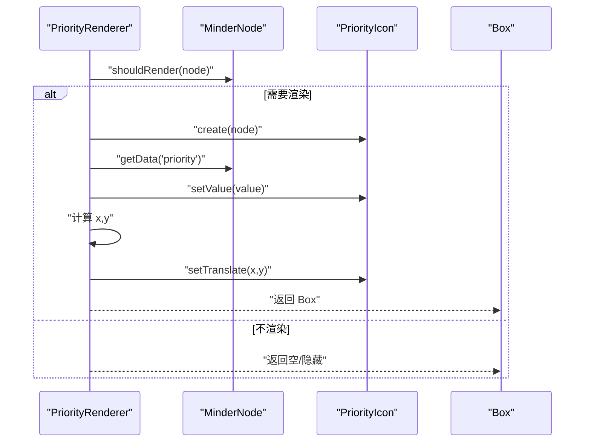
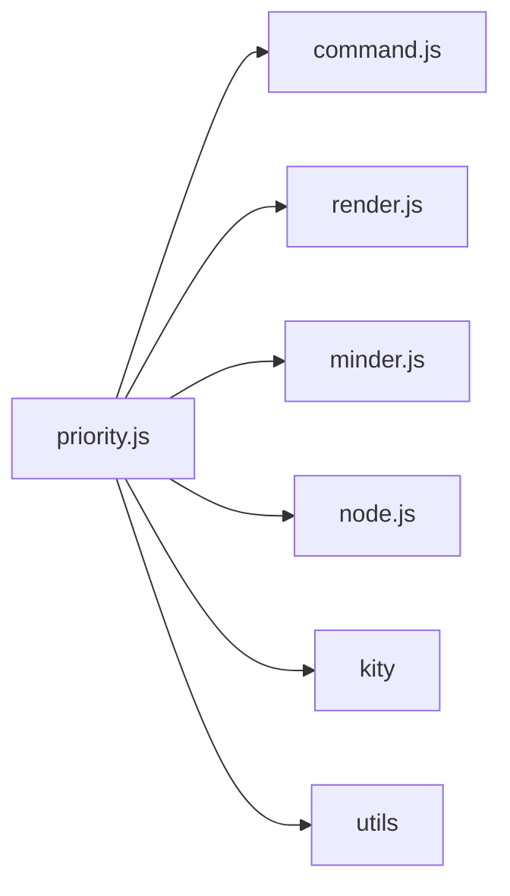

# 优先级标记模块

<cite>
**本文引用的文件**
- [src/module/priority.js](file://src/module/priority.js)
- [src/core/render.js](file://src/core/render.js)
- [src/core/command.js](file://src/core/command.js)
- [src/core/minder.js](file://src/core/minder.js)
- [src/core/node.js](file://src/core/node.js)
- [dev.html](file://dev.html)
- [example.html](file://example.html)
</cite>

## 目录
1. [简介](#简介)
2. [项目结构](#项目结构)
3. [核心组件](#核心组件)
4. [架构总览](#架构总览)
5. [详细组件分析](#详细组件分析)
6. [依赖关系分析](#依赖关系分析)
7. [性能考量](#性能考量)
8. [故障排查指南](#故障排查指南)
9. [结论](#结论)
10. [附录](#附录)

## 简介
本文件深入解析优先级标记模块（priority.js）的实现机制，涵盖：
- PriorityCommand 命令类如何处理节点优先级的设置（1-9级）与清除（0级）
- PriorityIcon 图形类如何使用 SVG 路径（MASK_PATH、BACK_PATH）构建彩色优先级图标，并通过 setValue 方法动态更新颜色与数字
- 渲染器（PriorityRenderer）如何在节点左侧渲染图标，依据节点数据中的 'priority' 字段决定是否显示，并在 update 阶段正确计算图标位置
- PRIORITY_COLORS 颜色映射表的设计逻辑
- 模块如何通过事件系统与核心 Minder 实例协同工作
- 实际使用场景（任务管理中的紧急程度标识）与常见配置错误的解决方案

## 项目结构
优先级模块位于模块目录下，采用 SeaJS 模块化组织，依赖核心渲染与命令框架，通过注册机制向 Minder 注入命令与渲染器。

图表来源
- [src/module/priority.js](file://src/module/priority.js#L1-L156)
- [src/core/render.js](file://src/core/render.js#L1-L248)
- [src/core/command.js](file://src/core/command.js#L87-L127)
- [src/core/minder.js](file://src/core/minder.js#L1-L40)
- [src/core/node.js](file://src/core/node.js#L273-L319)

章节来源
- [src/module/priority.js](file://src/module/priority.js#L1-L156)

## 核心组件
- 命令类：PriorityCommand
  - 负责设置/清除节点优先级数据，触发重布局
  - 提供 queryValue 与 queryState 以支持 UI 状态联动
- 图形类：PriorityIcon
  - 使用两层 SVG 路径（背景与遮罩）叠加数字文本，形成彩色徽标
  - setValue 根据优先级值选择颜色并更新数字
- 渲染器：PriorityRenderer(left)
  - 在节点左侧创建并定位优先级图标
  - 仅当节点存在 'priority' 数据时渲染

章节来源
- [src/module/priority.js](file://src/module/priority.js#L14-L155)

## 架构总览
优先级模块通过模块注册向 Minder 注入命令与渲染器，渲染流程由核心渲染器驱动，命令通过 Minder 的命令系统分发。

图表来源
- [src/core/command.js](file://src/core/command.js#L87-L127)
- [src/core/render.js](file://src/core/render.js#L85-L219)
- [src/module/priority.js](file://src/module/priority.js#L95-L155)

## 详细组件分析

### PriorityCommand 命令类
- 执行流程
  - 读取当前选中节点集合
  - 将 'priority' 数据写入节点（0 表示清除）
  - 触发节点渲染与整体布局
- 查询接口
  - queryValue：返回首个选中节点的优先级值（若无则 null）
  - queryState：根据是否有选中节点返回状态码（0 或 -1）

图表来源
- [src/module/priority.js](file://src/module/priority.js#L95-L103)

章节来源
- [src/module/priority.js](file://src/module/priority.js#L95-L117)
- [src/core/command.js](file://src/core/command.js#L87-L127)

### PriorityIcon 图形类
- 结构组成
  - 背景路径（BACK_PATH）用于底色
  - 遮罩路径（MASK_PATH）叠加半透明色彩
  - 数字文本（白色粗体斜体）居中显示
- 颜色映射
  - PRIORITY_COLORS[value] 返回 [遮罩色, 背景色]
  - 1-5 使用高饱和度主色调；6-9 共用灰色系
- setValue 流程
  - 若存在对应颜色，分别填充遮罩与背景
  - 更新数字内容为当前优先级值

图表来源
- [src/module/priority.js](file://src/module/priority.js#L14-L83)

章节来源
- [src/module/priority.js](file://src/module/priority.js#L14-L83)

### PriorityRenderer 渲染器
- 生命周期
  - create：为节点创建 PriorityIcon 实例
  - shouldRender：当节点存在 'priority' 数据时才渲染
  - update：计算图标位置并设置其值
- 位置计算
  - x = 内容盒左边界 - 图标宽度 - 节点左侧间距
  - y = -图标高度的一半（垂直居中）
- 返回盒模型
  - 返回图标占用的空间，供后续渲染合并

图表来源
- [src/module/priority.js](file://src/module/priority.js#L122-L155)
- [src/core/render.js](file://src/core/render.js#L85-L219)

章节来源
- [src/module/priority.js](file://src/module/priority.js#L122-L155)
- [src/core/render.js](file://src/core/render.js#L85-L219)

### 颜色映射表设计逻辑（PRIORITY_COLORS）
- 设计要点
  - 1-5：区分度高的主色调，便于快速识别紧急程度
  - 6-9：统一灰色系，避免过度强调低优先级
  - 每个值返回 [遮罩色, 背景色]，保证视觉层次清晰
- 使用约束
  - 仅支持 0-9；0 表示清除，>9 不渲染
  - 通过 setValue 自动应用颜色

章节来源
- [src/module/priority.js](file://src/module/priority.js#L14-L25)
- [src/module/priority.js](file://src/module/priority.js#L69-L83)

### 与核心 Minder 的事件与命令系统协同
- 命令系统
  - Minder 提供 execCommand/queryCommandState/queryCommandValue
  - PriorityCommand 通过 Command 基类继承，遵循统一接口
- 渲染系统
  - MinderNode.render() 触发渲染管线
  - 核心渲染器按顺序调用各渲染器的 create/update
- 事件系统
  - Minder 提供事件钩子与 fire 机制，模块可通过初始化钩子扩展能力
  - 优先级模块本身不直接监听事件，但通过命令与渲染参与核心生命周期

章节来源
- [src/core/command.js](file://src/core/command.js#L87-L127)
- [src/core/render.js](file://src/core/render.js#L85-L219)
- [src/core/minder.js](file://src/core/minder.js#L1-L40)
- [src/core/node.js](file://src/core/node.js#L273-L319)

## 依赖关系分析
- 模块注册
  - Module.register('PriorityModule', ...) 将命令与渲染器注入 Minder
- 组件耦合
  - PriorityCommand 依赖 Minder、MinderNode、Command
  - PriorityRenderer 依赖 Renderer、PriorityIcon
  - PriorityIcon 依赖 kity.Path、kity.Text、utils.uuid
- 外部依赖
  - kity（SVG 图形库）
  - utils（通用工具）
  - SeaJS（模块加载）

图表来源
- [src/module/priority.js](file://src/module/priority.js#L1-L156)
- [src/core/command.js](file://src/core/command.js#L87-L127)
- [src/core/render.js](file://src/core/render.js#L1-L248)
- [src/core/minder.js](file://src/core/minder.js#L1-L40)
- [src/core/node.js](file://src/core/node.js#L273-L319)

章节来源
- [src/module/priority.js](file://src/module/priority.js#L1-L156)

## 性能考量
- 渲染优化
  - 仅在节点存在 'priority' 数据时创建与更新图标，避免不必要的 DOM/SVG 节点
  - 通过返回 Box 合并渲染区域，减少重绘范围
- 命令执行
  - 一次命令批量更新多个选中节点，减少多次布局调用
- 颜色访问
  - O(1) 数组索引访问颜色，开销极低

[本节为一般性建议，无需特定文件引用]

## 故障排查指南
- 优先级值超出范围
  - 现象：>9 不渲染，0 表示清除
  - 排查：确认传入值在 0-9 范围内
- 颜色未正确渲染
  - 现象：图标无色或颜色异常
  - 排查：检查 PRIORITY_COLORS 下标是否越界；确认 setValue 被调用
- 图标未显示
  - 现象：节点左侧无图标
  - 排查：确认节点数据中存在 'priority'；确认 shouldRender 返回真；检查节点样式 space-left 是否过大导致图标被挤出可视区
- 布局未更新
  - 现象：设置优先级后布局不变
  - 排查：确认 PriorityCommand 执行后调用了 layout()

章节来源
- [src/module/priority.js](file://src/module/priority.js#L95-L117)
- [src/module/priority.js](file://src/module/priority.js#L122-L155)

## 结论
优先级标记模块通过简洁的命令与渲染器设计，实现了对节点优先级的可视化标注。其颜色映射与 SVG 图层组合确保了良好的可读性与一致性；渲染器仅在必要时创建与更新，兼顾性能与可用性。模块与核心 Minder 的命令与渲染系统无缝集成，适合在任务管理等场景中直观表达紧急程度。

[本节为总结性内容，无需特定文件引用]

## 附录

### 实际使用场景
- 任务管理系统
  - 使用 1-9 表示紧急程度，1 最紧急，9 最低
  - 在节点数据中设置 priority 字段，即可在左侧显示彩色徽标
- 示例数据
  - 示例页面中已包含带 priority 字段的数据片段，可直接运行查看效果

章节来源
- [dev.html](file://dev.html#L84-L142)
- [example.html](file://example.html#L30-L51)