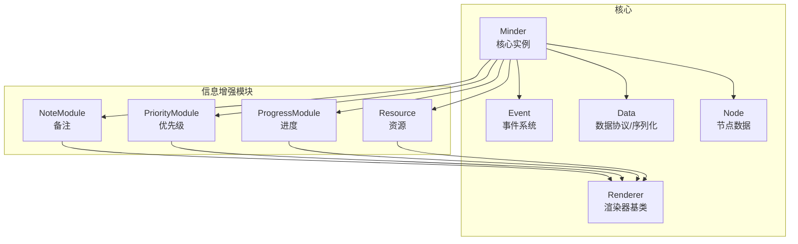
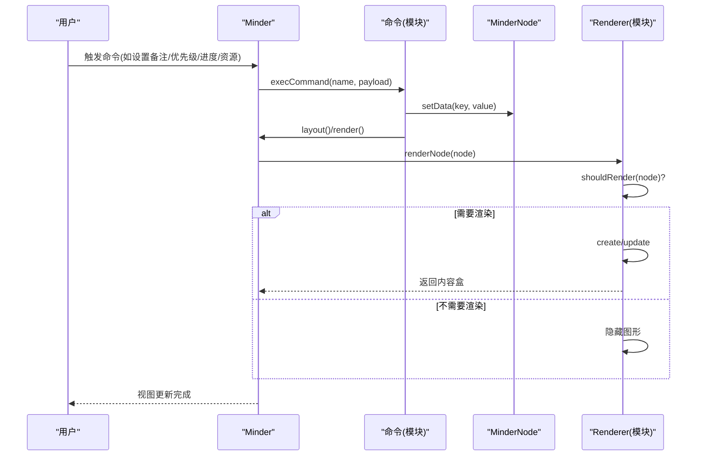
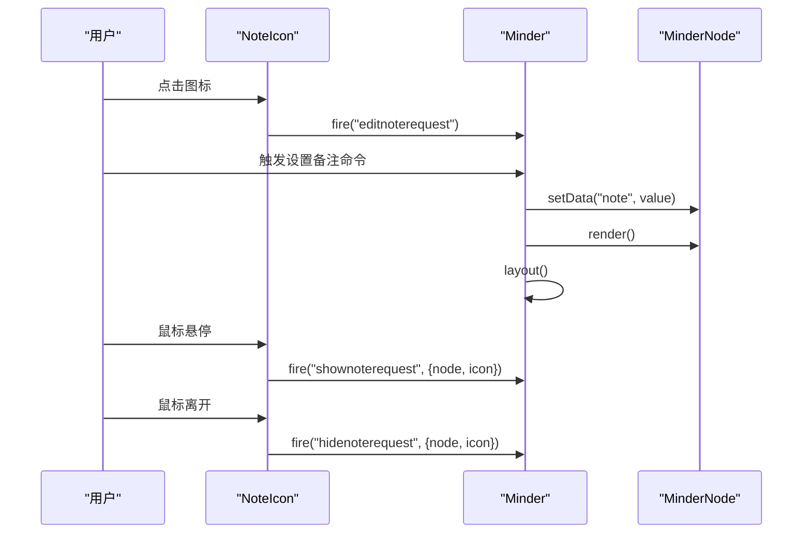
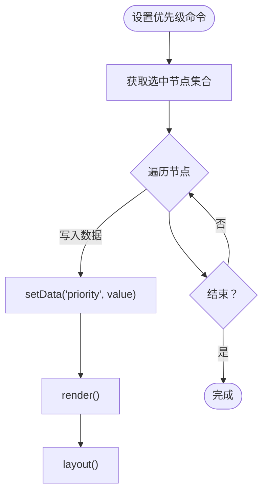
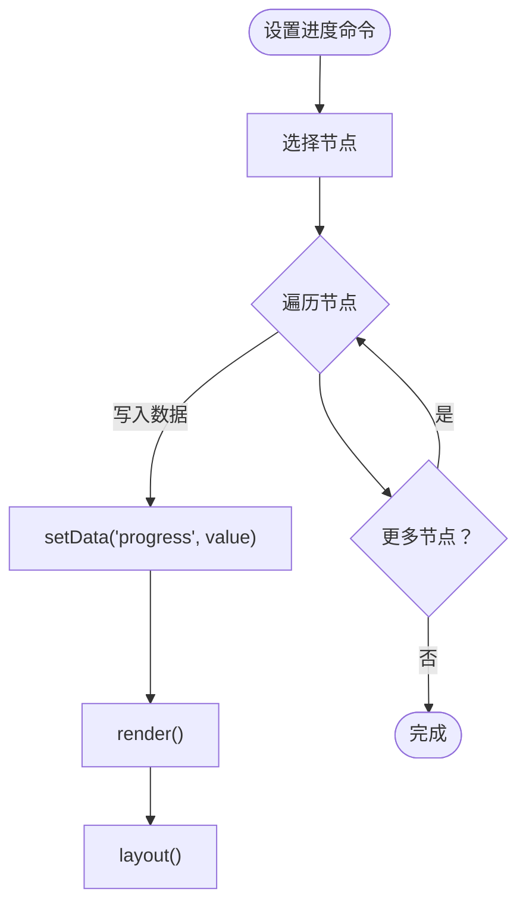
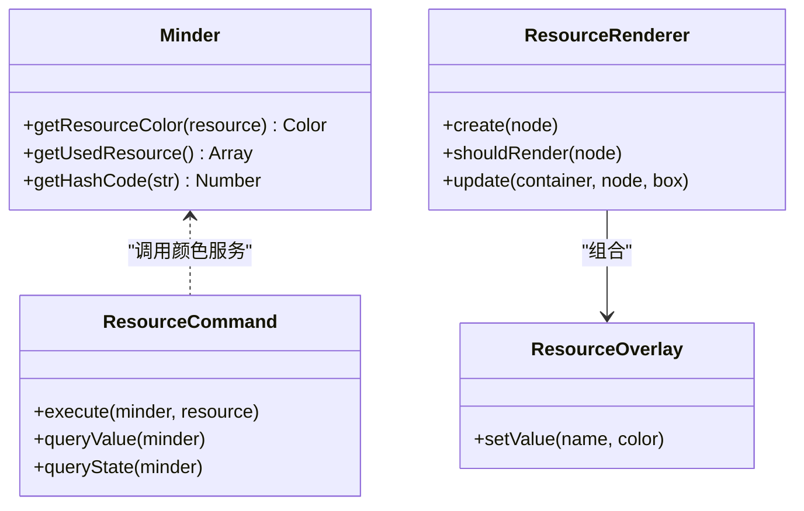
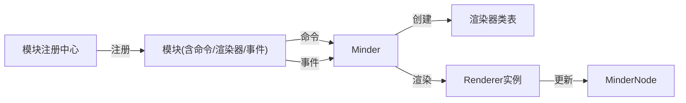

# 信息增强模块

<cite>
**本文引用的文件**
- [note.js](file://src/module/note.js)
- [priority.js](file://src/module/priority.js)
- [progress.js](file://src/module/progress.js)
- [resource.js](file://src/module/resource.js)
- [module.js](file://src/core/module.js)
- [event.js](file://src/core/event.js)
- [render.js](file://src/core/render.js)
- [data.js](file://src/core/data.js)
- [node.js](file://src/core/node.js)
- [minder.js](file://src/core/minder.js)
- [utils.js](file://src/core/utils.js)
</cite>

## 目录
1. [简介](#简介)
2. [项目结构](#项目结构)
3. [核心组件](#核心组件)
4. [架构总览](#架构总览)
5. [详细组件分析](#详细组件分析)
6. [依赖关系分析](#依赖关系分析)
7. [性能考量](#性能考量)
8. [故障排查指南](#故障排查指南)
9. [结论](#结论)
10. [附录](#附录)

## 简介
本文件聚焦“信息增强类扩展功能”，系统解析以下四个模块：
- 备注模块（note.js）：为节点附加额外文本信息，并支持富文本编辑；通过图标触发编辑请求，渲染器负责定位与样式更新。
- 优先级标记模块（priority.js）：以带数字的彩色徽章表示优先级，支持 0-9 的数值范围；通过命令设置数据并在左侧渲染。
- 进度显示模块（progress.js）：以环形进度条与勾选标记表示任务进度，支持 1-9 的分档（9 表示完成）；通过命令设置数据并在左侧渲染。
- 资源标记模块（resource.js）：为节点打上资源标签，自动分配颜色并缓存映射；右侧渲染多个覆盖层叠加显示。

文档将从架构、数据流、事件通信、渲染机制、序列化处理等方面深入剖析，并给出使用场景与常见问题排查建议。

## 项目结构
信息增强模块位于模块目录，每个模块均采用统一的注册模式：定义命令、渲染器与事件绑定，再通过模块注册中心挂载到核心实例。

图表来源
- [module.js](file://src/core/module.js#L1-L151)
- [note.js](file://src/module/note.js#L1-L116)
- [priority.js](file://src/module/priority.js#L1-L156)
- [progress.js](file://src/module/progress.js#L1-L160)
- [resource.js](file://src/module/resource.js#L1-L314)

章节来源
- [module.js](file://src/core/module.js#L1-L151)

## 核心组件
- 模块注册与生命周期：模块通过注册中心注入命令、事件与渲染器，核心实例在初始化阶段加载模块。
- 事件系统：核心实例封装事件派发，支持 before/pre/execute/after 生命周期与状态态事件。
- 渲染管线：渲染器按节点的渲染容器顺序创建/更新图形，合并内容盒并触发渲染完成事件。
- 数据模型：节点数据通过键值对存储，命令写入数据后触发节点渲染与布局重算。

章节来源
- [module.js](file://src/core/module.js#L1-L151)
- [event.js](file://src/core/event.js#L1-L270)
- [render.js](file://src/core/render.js#L1-L261)
- [node.js](file://src/core/node.js#L1-L407)
- [data.js](file://src/core/data.js#L1-L416)

## 架构总览
信息增强模块围绕“命令-数据-渲染器”的闭环工作：
- 命令层：接收用户操作，写入节点数据，触发渲染与布局。
- 渲染层：根据节点数据决定是否渲染，计算位置并绘制图形。
- 事件层：模块通过 fire/on 与核心实例交互，实现编辑请求、悬停提示等交互。

图表来源
- [note.js](file://src/module/note.js#L1-L116)
- [priority.js](file://src/module/priority.js#L1-L156)
- [progress.js](file://src/module/progress.js#L1-L160)
- [resource.js](file://src/module/resource.js#L1-L314)
- [module.js](file://src/core/module.js#L1-L151)
- [render.js](file://src/core/render.js#L1-L261)

## 详细组件分析

### 备注模块（note.js）
- 数据绑定与命令
  - 命令将用户输入写入节点数据键值，随后触发节点渲染与布局重算。
  - 查询命令可返回当前选中节点的备注值，用于界面状态同步。
- 图标与渲染
  - 渲染器在节点右侧绘制一个路径图标，鼠标悬停高亮背景矩形，点击触发编辑请求事件。
  - update 时根据节点盒模型与样式参数计算图标位置，保证与文本对齐。
- 事件通信
  - 图标在交互时通过核心实例 fire 编辑/显示/隐藏备注的事件，供上层 UI 响应。

图表来源
- [note.js](file://src/module/note.js#L1-L116)
- [event.js](file://src/core/event.js#L1-L270)

章节来源
- [note.js](file://src/module/note.js#L1-L116)

### 优先级标记模块（priority.js）
- 数据绑定与命令
  - 命令将优先级数值写入节点数据键，支持 0（清除）、1-9（渲染）。
  - 查询命令返回选中节点的优先级值，用于工具栏状态同步。
- 图标系统与渲染
  - 优先级图标由三层图形组成：底色、遮罩与数字文本，颜色来自预设色板。
  - 渲染器在节点左侧绘制，根据节点盒模型与样式参数计算偏移，确保与文本对齐。
- 图标更新
  - setValue 根据数值选择颜色并设置数字内容，实现不同优先级的视觉区分。

图表来源
- [priority.js](file://src/module/priority.js#L1-L156)

章节来源
- [priority.js](file://src/module/priority.js#L1-L156)

### 进度显示模块（progress.js）
- 数据绑定与命令
  - 命令将进度值写入节点数据键，支持 0（清除）、1（未开始）、2-8（分档）、9（完成）。
  - 查询命令返回选中节点的进度值，用于工具栏状态同步。
- 环形进度条渲染
  - 图标包含背景圆、扇形进度、阴影、边框与勾选标记。
  - setValue 根据进度值计算扇形角度，9 时显示勾选标记，其他值显示对应进度。
- 位置更新
  - 渲染器在节点左侧绘制，根据盒模型与样式参数计算偏移，保证与文本对齐。

图表来源
- [progress.js](file://src/module/progress.js#L1-L160)

章节来源
- [progress.js](file://src/module/progress.js#L1-L160)

### 资源标记模块（resource.js）
- 数据绑定与命令
  - 命令接收字符串或数组，统一转为数组写入节点数据键，支持清空。
  - 查询命令聚合多个节点的资源去重结果，用于工具栏状态同步。
- 颜色体系
  - 核心实例扩展：为资源名分配颜色，优先使用预设色序列，超出数量时使用哈希色。
  - 提供获取已用资源列表与下一个可用颜色索引的辅助方法。
- 覆盖层渲染
  - 渲染器在节点右侧绘制多个覆盖层，每个资源名对应一个矩形背景与文本，颜色来自资源色表。
  - update 时逐个计算宽度并累加横向偏移，最后将容器整体平移到节点右侧。

图表来源
- [resource.js](file://src/module/resource.js#L1-L314)
- [minder.js](file://src/core/minder.js#L1-L41)

章节来源
- [resource.js](file://src/module/resource.js#L1-L314)

## 依赖关系分析
- 模块注册与装载
  - 模块注册中心在核心实例初始化钩子中加载模块，收集命令、事件与渲染器类，构建渲染器注册表。
- 渲染器装配
  - 核心实例按节点创建渲染器实例，按顺序执行 shouldRender/create/update，最终合并内容盒并触发渲染完成事件。
- 事件绑定
  - 模块可在注册时声明事件映射，核心实例在初始化阶段绑定到实例上，便于模块间通过 fire/on 通信。

图表来源
- [module.js](file://src/core/module.js#L1-L151)
- [render.js](file://src/core/render.js#L1-L261)
- [event.js](file://src/core/event.js#L1-L270)

章节来源
- [module.js](file://src/core/module.js#L1-L151)
- [render.js](file://src/core/render.js#L1-L261)
- [event.js](file://src/core/event.js#L1-L270)

## 性能考量
- 渲染器复用与隐藏：当节点不需要某渲染器时，会隐藏已有图形而非销毁，减少频繁创建/销毁开销。
- 内容盒合并：渲染器返回的内容盒参与节点内容盒合并，有助于布局优化与重绘范围控制。
- 批量渲染：核心实例支持批量渲染节点，减少多次遍历与布局调用次数。
- 事件传播短路：事件系统支持立即停止传播，避免不必要的回调链执行。

章节来源
- [render.js](file://src/core/render.js#L1-L261)

## 故障排查指南
- 备注图标不显示
  - 检查节点数据键值是否存在；渲染器 shouldRender 仅在存在数据时绘制。
  - 确认节点已渲染且布局完成，必要时手动触发布局。
- 优先级/进度图标不更新
  - 确认命令执行成功并写入了正确的数据键；检查查询命令返回值是否符合预期。
  - 检查渲染器 update 中的位置计算是否受样式参数影响。
- 资源颜色异常
  - 若资源数量超过预设色序列，将回退到哈希色；可通过获取已用资源列表核对映射。
  - 注意资源数组中可能包含空值，渲染器内部已过滤空元素，但外部命令传参需避免无效值。
- 事件未响应
  - 模块通过 fire/on 与核心实例通信，确认事件名拼写正确且已在模块注册阶段绑定。
  - 使用事件系统提供的状态态事件名（如 status.event）进行调试。

章节来源
- [note.js](file://src/module/note.js#L1-L116)
- [priority.js](file://src/module/priority.js#L1-L156)
- [progress.js](file://src/module/progress.js#L1-L160)
- [resource.js](file://src/module/resource.js#L1-L314)
- [event.js](file://src/core/event.js#L1-L270)

## 结论
信息增强模块通过统一的命令-数据-渲染器架构，为节点提供了丰富的语义化增强能力：
- 备注模块提供富文本编辑入口与交互提示；
- 优先级与进度模块以直观图标表达任务状态；
- 资源模块以标签化方式组织多维信息并保持一致的视觉风格。

它们与核心实例的事件系统紧密协作，在数据序列化时天然保留节点数据，无需额外处理即可跨会话持久化。

## 附录

### 数据序列化与持久化
- 导出 JSON：核心实例将整棵树的节点数据导出为标准 JSON，包含版本、模板、主题与可选的自由关联线。
- 导入 JSON：导入时进行 ID 唯一性校验与修复，恢复模板/主题与关联线，完成后触发一系列内容变更事件。
- 模块数据：由于模块通过节点数据键存储信息（如 note、priority、progress、resource），这些键值随节点数据一同参与导出/导入，无需额外序列化逻辑。

章节来源
- [data.js](file://src/core/data.js#L1-L416)

### 实际使用场景示例
- 项目管理中的任务进度跟踪
  - 使用进度模块为任务节点设置进度档位，9 表示完成；结合优先级模块标识关键路径；资源模块标注负责人或工种。
- 知识图谱中的资源标注
  - 使用资源模块为知识点节点打上“领域/难度/类型”等标签，自动配色便于快速识别；备注模块补充说明链接或摘要。

### 常见配置错误与调试方法
- 错误：命令名大小写不一致导致无法执行
  - 方法：命令注册时统一转为小写，调用时也使用小写名称。
- 错误：渲染器未生效
  - 方法：确认模块注册返回的 renderers 字段已正确挂载到 left/right 等位置；检查 shouldRender 条件与节点数据键。
- 错误：事件未触发
  - 方法：确认模块注册阶段已绑定事件；在核心实例上使用 on/off 进行监听与断点调试。