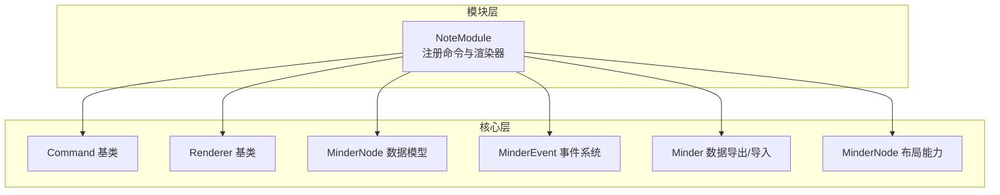
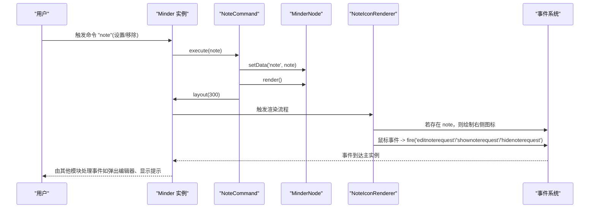
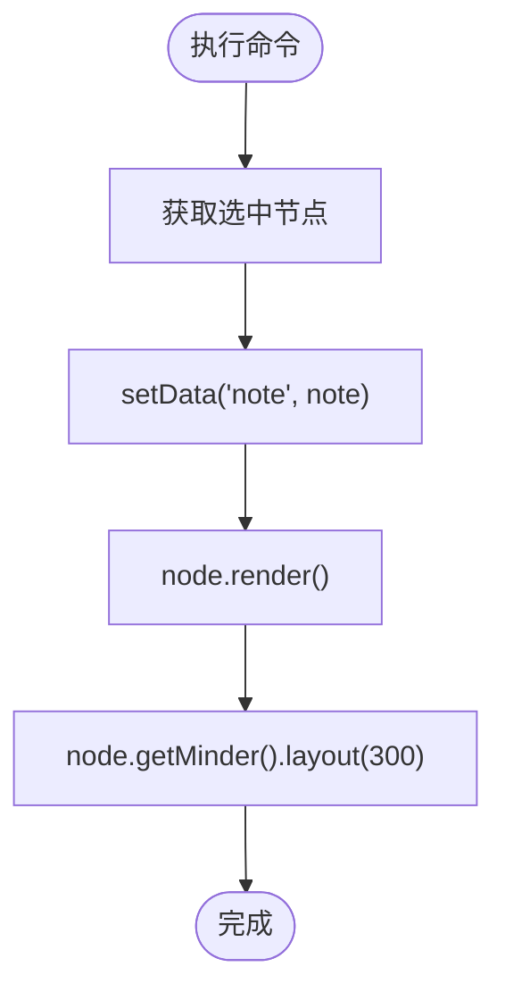
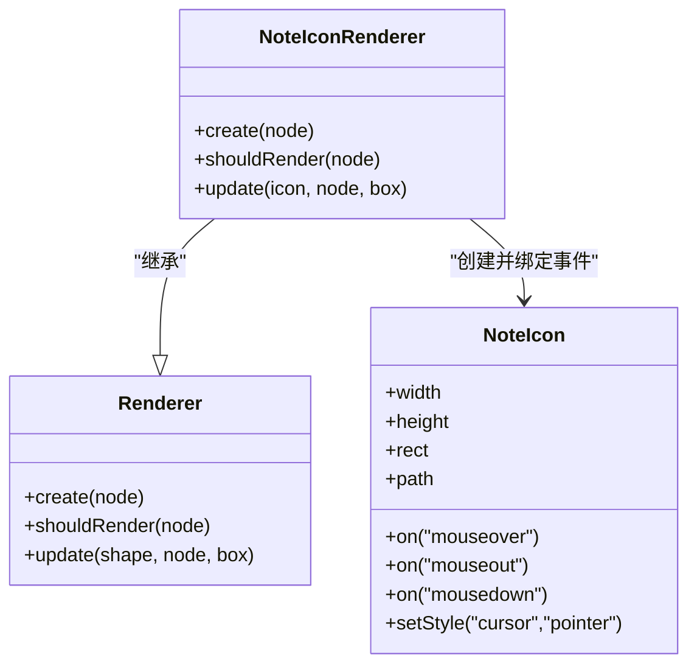
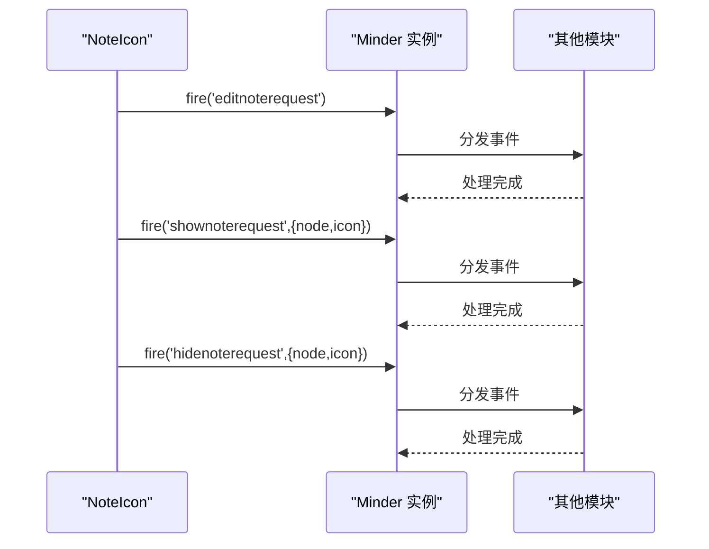
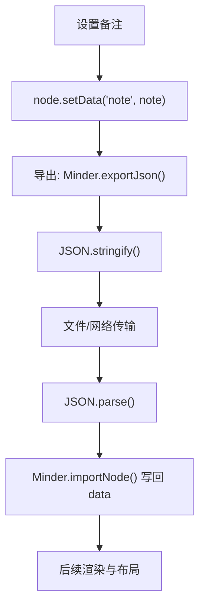
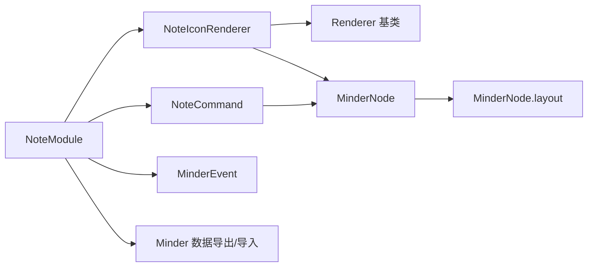

# 备注模块

<cite>
**本文引用的文件列表**
- [note.js](file://src/module/note.js)
- [node.js](file://src/core/node.js)
- [render.js](file://src/core/render.js)
- [layout.js](file://src/core/layout.js)
- [event.js](file://src/core/event.js)
- [data.js](file://src/core/data.js)
- [json.js](file://src/protocol/json.js)
- [markdown.js](file://src/protocol/markdown.js)
</cite>

## 目录
1. [简介](#简介)
2. [项目结构](#项目结构)
3. [核心组件](#核心组件)
4. [架构总览](#架构总览)
5. [详细组件分析](#详细组件分析)
6. [依赖关系分析](#依赖关系分析)
7. [性能考量](#性能考量)
8. [故障排查指南](#故障排查指南)
9. [结论](#结论)
10. [附录](#附录)

## 简介
本文件深入讲解备注模块（note.js）的实现机制，围绕以下目标展开：
- 通过 NoteCommand 命令类实现节点备注信息的设置与移除
- 解析 NoteIconRenderer 渲染器如何在节点右侧渲染备注图标并处理鼠标交互事件（mouseover、mouseout、mousedown）
- 说明备注数据如何通过 node.setData('note', note) 存储在节点数据模型中，并在渲染时触发布局更新
- 结合事件系统（如 editnoterequest、shownoterequest）与其他模块通信
- 说明备注信息在 JSON 数据序列化时的持久化方式
- 提供实际使用场景示例与常见问题的调试方法

## 项目结构
备注模块位于模块目录下，采用标准的模块注册模式，向外暴露命令与渲染器两类能力：
- 命令：note
- 渲染器：right 侧边图标渲染

图表来源
- [note.js](file://src/module/note.js#L1-L116)
- [node.js](file://src/core/node.js#L130-L145)
- [render.js](file://src/core/render.js#L1-L60)
- [event.js](file://src/core/event.js#L232-L266)
- [data.js](file://src/core/data.js#L56-L90)
- [layout.js](file://src/core/layout.js#L222-L227)

章节来源
- [note.js](file://src/module/note.js#L1-L116)

## 核心组件
- NoteCommand：负责设置/移除节点备注，并触发渲染与布局更新
- NoteIconRenderer：负责在节点右侧渲染备注图标，并在鼠标交互时发出事件
- NoteIcon：具体的图标图形元素，包含矩形背景与路径图标，支持 hover 效果
- 事件系统：通过 fire 发出 editnoterequest、shownoterequest、hidenoterequest
- 数据持久化：通过 node.setData('note', ...) 存储备注；导出时随节点数据一起序列化

章节来源
- [note.js](file://src/module/note.js#L24-L115)
- [node.js](file://src/core/node.js#L130-L145)
- [event.js](file://src/core/event.js#L232-L266)
- [data.js](file://src/core/data.js#L56-L90)

## 架构总览
备注模块的运行流程如下：
- 用户通过命令设置备注（或移除）
- 命令写入节点数据并触发渲染
- 渲染器根据节点数据决定是否绘制图标
- 图标响应鼠标事件并向主脑图实例发送自定义事件
- 主脑图根据事件与主题样式更新图标颜色等外观
- 导出时，节点数据包含 note 字段，JSON 协议将其序列化为字符串

图表来源
- [note.js](file://src/module/note.js#L32-L115)
- [render.js](file://src/core/render.js#L85-L163)
- [event.js](file://src/core/event.js#L232-L266)
- [layout.js](file://src/core/layout.js#L222-L227)

## 详细组件分析

### NoteCommand 命令类
- 功能
  - 设置备注：调用 node.setData('note', note)，随后 node.render() 触发渲染，最后 node.getMinder().layout(300) 触发布局更新
  - 查询状态：仅当选中单个节点时可用
  - 查询值：返回当前选中节点的备注值
- 关键点
  - 通过 node.setData 写入数据模型
  - 通过 node.render 触发渲染器更新
  - 通过 node.getMinder().layout 触发布局重算

图表来源
- [note.js](file://src/module/note.js#L32-L50)
- [node.js](file://src/core/node.js#L130-L145)
- [layout.js](file://src/core/layout.js#L222-L227)

章节来源
- [note.js](file://src/module/note.js#L32-L50)

### NoteIconRenderer 渲染器
- 功能
  - create：创建 NoteIcon 并绑定鼠标事件，mousedown 发出 editnoterequest，mouseover 发出 shownoterequest，mouseout 发出 hidenoterequest
  - shouldRender：当节点存在 note 数据时才渲染图标
  - update：根据节点盒模型计算图标位置（右侧），并设置图标颜色与平移
- 关键点
  - 图标颜色使用节点样式 color
  - 位置基于 box.right + space-left 计算
  - 通过 node.getMinder().fire(...) 与主实例通信

图表来源
- [note.js](file://src/module/note.js#L73-L115)

章节来源
- [note.js](file://src/module/note.js#L73-L115)

### NoteIcon 图标元素
- 功能
  - 包含透明矩形背景与路径图标，支持 hover 时改变矩形填充色
  - 设置指针样式为可点击
- 关键点
  - 图标路径常量定义于模块内
  - 通过 setTranslate 定位，fill 使用节点样式 color

章节来源
- [note.js](file://src/module/note.js#L52-L72)

### 事件系统与交互
- 发出事件
  - editnoterequest：当用户点击图标时触发，通常用于打开备注编辑界面
  - shownoterequest：鼠标悬停图标时触发，可用于显示预览或提示
  - hidenoterequest：鼠标离开图标时触发，用于隐藏提示
- 接收与处理
  - 主实例通过 on 注册监听，按需处理事件（如弹窗、高亮、提示）

图表来源
- [note.js](file://src/module/note.js#L76-L87)
- [event.js](file://src/core/event.js#L232-L266)

章节来源
- [note.js](file://src/module/note.js#L76-L87)
- [event.js](file://src/core/event.js#L232-L266)

### 数据持久化与序列化
- 存储位置
  - 备注数据通过 node.setData('note', note) 写入节点数据模型
- 导出流程
  - Minder.exportJson 递归导出节点数据，包含 data 字段
  - JSON 协议使用 JSON.stringify 将对象序列化为字符串
- 导入流程
  - JSON 协议 decode 解析字符串为对象
  - Minder.importNode 将 data 字段逐项写回节点
- Markdown 协议
  - markdown 解析器在解析过程中会提取 note 字段并写入节点 data.note

图表来源
- [note.js](file://src/module/note.js#L32-L50)
- [data.js](file://src/core/data.js#L56-L90)
- [json.js](file://src/protocol/json.js#L1-L18)
- [markdown.js](file://src/protocol/markdown.js#L85-L136)

章节来源
- [note.js](file://src/module/note.js#L32-L50)
- [data.js](file://src/core/data.js#L56-L90)
- [json.js](file://src/protocol/json.js#L1-L18)
- [markdown.js](file://src/protocol/markdown.js#L85-L136)

## 依赖关系分析
- 模块注册
  - Module.register('NoteModule', ...) 将命令与渲染器注册到模块系统
- 渲染链路
  - Renderer 基类提供统一的 create/shouldRender/update 生命周期
  - Minder.renderNodeBatch/RenderNode 驱动渲染器执行
- 布局链路
  - MinderNode.layout 调用布局算法并应用矩阵变换
- 事件链路
  - MinderEvent 提供事件封装与分发，Minder.fire/_fire 实现事件监听与回调执行

图表来源
- [note.js](file://src/module/note.js#L1-L116)
- [render.js](file://src/core/render.js#L1-L60)
- [layout.js](file://src/core/layout.js#L222-L227)
- [event.js](file://src/core/event.js#L232-L266)
- [data.js](file://src/core/data.js#L56-L90)

章节来源
- [note.js](file://src/module/note.js#L1-L116)
- [render.js](file://src/core/render.js#L1-L60)
- [layout.js](file://src/core/layout.js#L222-L227)
- [event.js](file://src/core/event.js#L232-L266)
- [data.js](file://src/core/data.js#L56-L90)

## 性能考量
- 渲染与布局
  - 命令执行后立即触发 node.render() 与 node.getMinder().layout(300)，建议在批量操作时合并多次备注变更，减少重复布局
- 事件频率
  - mouseover/mouseout 事件可能高频触发，避免在事件处理器中执行重型逻辑
- 复杂度阈值
  - 布局系统对复杂度超过阈值的节点会自动禁用动画，确保交互流畅性

章节来源
- [note.js](file://src/module/note.js#L32-L50)
- [layout.js](file://src/core/layout.js#L458-L501)

## 故障排查指南
- 备注图标不显示
  - 检查节点是否设置了 note 数据（shouldRender 依赖 node.getData('note')）
  - 确认渲染器已注册到 right 侧
  - 检查节点样式 color 是否有效
- 事件绑定失败
  - 确认图标元素已正确创建并绑定事件
  - 检查主实例是否监听了对应事件类型
- 备注未持久化
  - 确认导出时使用了正确的协议（JSON）
  - 确认导入流程正确写回 data.note 字段
- 布局异常
  - 检查 node.render() 是否被调用
  - 检查 node.getMinder().layout(300) 是否被执行

章节来源
- [note.js](file://src/module/note.js#L73-L115)
- [node.js](file://src/core/node.js#L130-L145)
- [data.js](file://src/core/data.js#L56-L90)
- [json.js](file://src/protocol/json.js#L1-L18)

## 结论
备注模块通过简洁的命令与渲染器设计，实现了“设置/移除备注 -> 渲染图标 -> 事件通信 -> 数据持久化”的完整闭环。其关键优势在于：
- 命令与渲染解耦，便于扩展其他渲染位置或交互行为
- 事件驱动的交互模型，使 UI 与业务逻辑分离
- 数据模型与导出协议天然支持备注字段的持久化

## 附录

### 实际使用场景示例
- 知识管理：在知识点节点添加详细说明，通过 editnoterequest 打开编辑器，完成后保存 note
- 项目任务：在任务节点附加执行指南，通过 shownoterequest/hidenoterequest 显示/隐藏提示
- 团队协作：通过事件系统联动外部编辑器或文档系统，实现跨模块协作

### 代码片段路径参考
- 命令执行与布局更新：[note.js](file://src/module/note.js#L32-L50)
- 图标创建与事件绑定：[note.js](file://src/module/note.js#L76-L87)
- 图标位置与颜色更新：[note.js](file://src/module/note.js#L95-L103)
- 节点数据存取：[node.js](file://src/core/node.js#L130-L145)
- 渲染器生命周期：[render.js](file://src/core/render.js#L85-L163)
- 布局更新入口：[layout.js](file://src/core/layout.js#L222-L227)
- 事件监听与分发：[event.js](file://src/core/event.js#L232-L266)
- JSON 导出/导入：[data.js](file://src/core/data.js#L56-L90), [json.js](file://src/protocol/json.js#L1-L18)
- Markdown 协议中的 note 字段处理：[markdown.js](file://src/protocol/markdown.js#L85-L136)