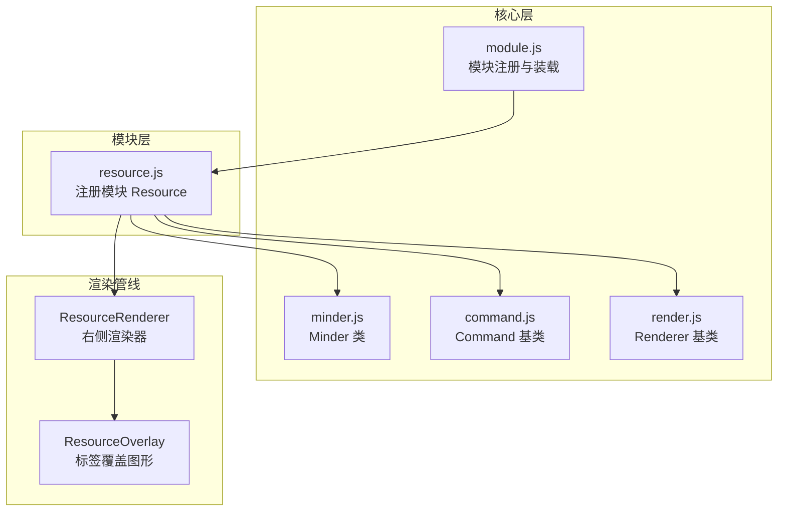
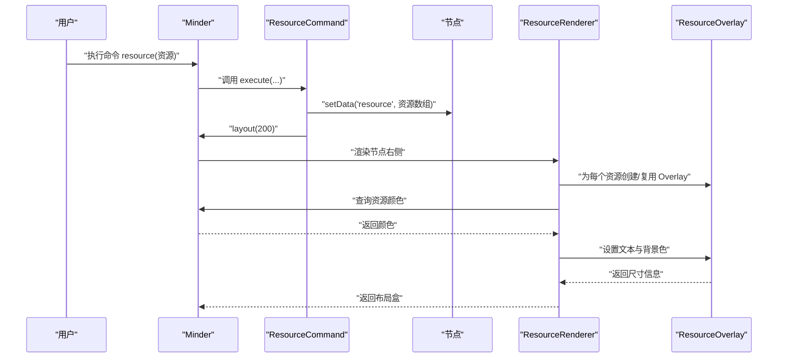
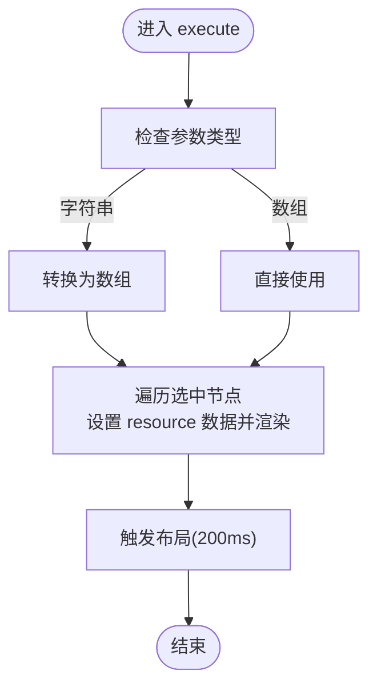
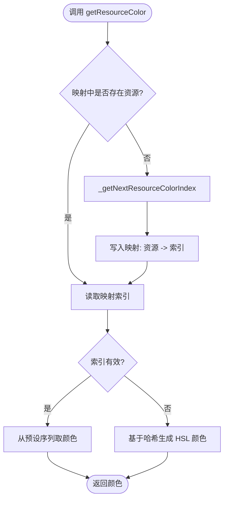
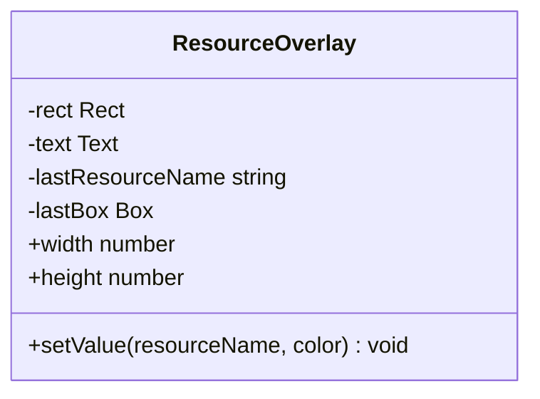
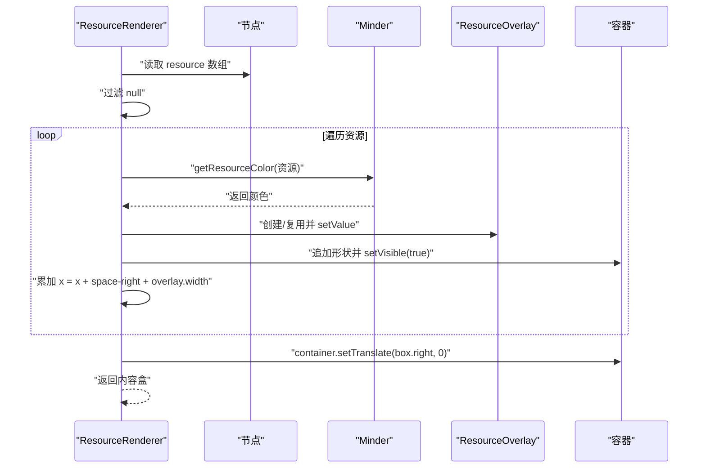
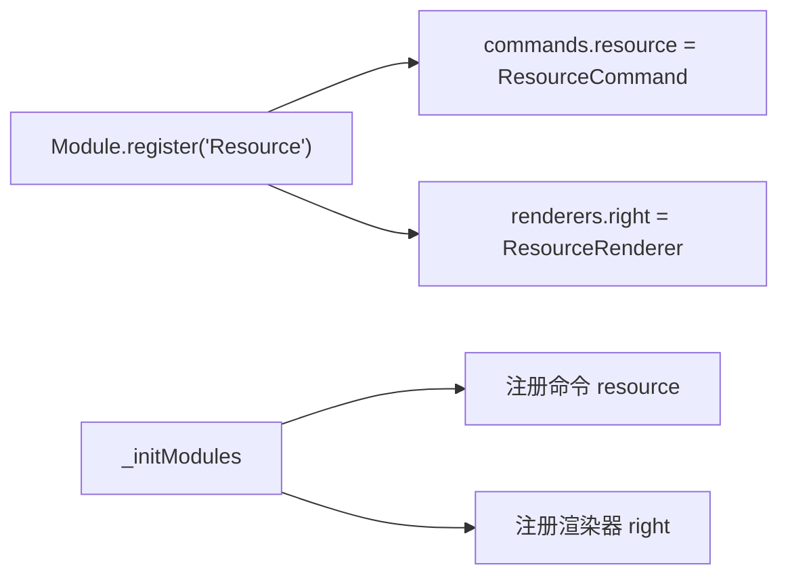
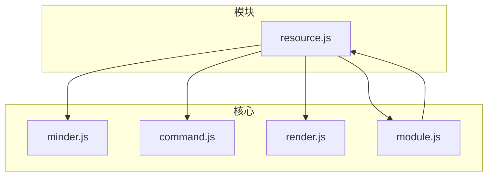

# 资源标记模块

<cite>
**本文引用的文件**
- [src/module/resource.js](file://src/module/resource.js)
- [src/core/module.js](file://src/core/module.js)
- [src/core/render.js](file://src/core/render.js)
- [src/core/command.js](file://src/core/command.js)
- [src/core/minder.js](file://src/core/minder.js)
</cite>

## 目录
1. [简介](#简介)
2. [项目结构](#项目结构)
3. [核心组件](#核心组件)
4. [架构总览](#架构总览)
5. [详细组件分析](#详细组件分析)
6. [依赖关系分析](#依赖关系分析)
7. [性能考量](#性能考量)
8. [故障排查指南](#故障排查指南)
9. [结论](#结论)
10. [附录](#附录)

## 简介
本文件系统性解析资源标记模块（resource.js），围绕以下目标展开：
- 标签体系：资源作为节点元数据存储，支持单个或多个资源名集合。
- 可视化机制：通过右侧渲染器动态布局多个资源标签，每个标签以圆角矩形背景与文本组成。
- 颜色分配：Minder 扩展的 getResourceColor 方法基于资源名的哈希（blake32 + 自定义哈希）从预设颜色序列中分配唯一颜色，确保跨节点一致。
- 命令处理：ResourceCommand 支持设置、查询、清除资源；在数据变更后自动触发布局与渲染。
- 映射维护：_getResourceColorIndexMapping 维护资源到颜色索引的映射，在资源数量超过颜色序列时回退到哈希色。
- 使用场景：团队协作中标注负责人、知识图谱中的分类标注等。
- 常见问题与解决：资源颜色重复、标签重叠等。

## 项目结构
资源标记模块位于模块目录中，采用“模块注册 + 命令 + 渲染器”的标准组织方式：
- 模块注册：通过 Module.register 注册名为 Resource 的模块。
- 命令：ResourceCommand 实现资源的设置、查询与状态判断。
- 渲染器：ResourceRenderer 在节点右侧动态布局资源标签；ResourceOverlay 提供单个标签的图形元素（圆角矩形背景 + 文本）。
- 颜色分配：在 Minder 上扩展颜色分配接口，使用哈希算法保证稳定与唯一。

图表来源
- [src/module/resource.js](file://src/module/resource.js#L1-L123)
- [src/core/module.js](file://src/core/module.js#L1-L120)
- [src/core/render.js](file://src/core/render.js#L1-L120)
- [src/core/command.js](file://src/core/command.js#L1-L80)
- [src/core/minder.js](file://src/core/minder.js#L1-L41)

章节来源
- [src/module/resource.js](file://src/module/resource.js#L1-L123)
- [src/core/module.js](file://src/core/module.js#L1-L120)

## 核心组件
- ResourceCommand：负责资源的设置、查询与状态判断。支持传入字符串或数组，统一转换为数组；对选中节点批量设置资源并触发布局。
- ResourceOverlay：封装单个资源标签的图形元素，包含圆角矩形背景与文本，支持缓存边界盒以减少重复计算。
- ResourceRenderer：在节点右侧动态布局多个资源标签，按节点样式 space-right 间距逐个排列，容器整体平移至节点右侧边界。
- Minder 扩展方法：
  - getHashCode：先用 blake32 对字符串进行哈希，再做二次哈希，输出无符号整数。
  - getResourceColor：根据资源名分配颜色，优先从映射表取索引；若索引不足则回退到哈希色；提供 _getNextResourceColorIndex 与 _getResourceColorIndexMapping 辅助管理。
  - getUsedResource：返回当前已使用的资源列表。

章节来源
- [src/module/resource.js](file://src/module/resource.js#L127-L314)
- [src/core/command.js](file://src/core/command.js#L1-L169)
- [src/core/render.js](file://src/core/render.js#L1-L120)

## 架构总览
资源标记模块的运行流程如下：
- 用户通过命令设置资源（字符串或数组），ResourceCommand 将资源写入节点数据并触发布局。
- 渲染阶段，ResourceRenderer 根据节点右侧空间与样式参数，逐个创建 ResourceOverlay 并设置颜色与文本。
- 颜色分配由 Minder 的 getResourceColor 完成，确保相同资源名在不同节点获得一致颜色。

图表来源
- [src/module/resource.js](file://src/module/resource.js#L143-L183)
- [src/module/resource.js](file://src/module/resource.js#L240-L302)
- [src/core/command.js](file://src/core/command.js#L118-L166)
- [src/core/render.js](file://src/core/render.js#L165-L219)

## 详细组件分析

### ResourceCommand：资源命令类
职责与行为：
- 接收参数：字符串或数组；若为字符串则转为数组。
- 对选中节点批量设置资源数据，并调用节点渲染。
- 触发布局，使右侧标签区重新计算与排布。
- 查询当前选中节点集合的资源去重集合。
- 查询状态：当存在选中节点时返回可用状态。

图表来源
- [src/module/resource.js](file://src/module/resource.js#L143-L183)
- [src/core/command.js](file://src/core/command.js#L118-L166)

章节来源
- [src/module/resource.js](file://src/module/resource.js#L143-L183)
- [src/core/command.js](file://src/core/command.js#L1-L169)

### Minder 扩展：颜色分配与映射
关键点：
- getHashCode：先用 blake32 哈希字符串，再做二次哈希，得到无符号整数。
- getResourceColor：若资源未分配索引，查找下一个可用索引并写入映射；若索引耗尽，回退到基于哈希的 HSL 颜色。
- _getNextResourceColorIndex：枚举预设颜色序列，返回第一个未被占用的索引；若全部占用返回 -1。
- _getResourceColorIndexMapping：惰性初始化资源到颜色索引的映射表。
- getUsedResource：遍历映射表返回已使用资源列表。

图表来源
- [src/module/resource.js](file://src/module/resource.js#L27-L123)

章节来源
- [src/module/resource.js](file://src/module/resource.js#L27-L123)

### ResourceOverlay：标签图形元素
职责与行为：
- 构造函数创建圆角矩形背景与文本形状，并加入组。
- setValue：设置资源名与颜色；缓存上次资源名与边界盒，避免重复测量；计算文本边界盒后设置矩形尺寸与位置；文本左偏移填充，背景矩形围绕文本绘制。
- 通过 width/height 记录自身尺寸，供上层布局使用。

图表来源
- [src/module/resource.js](file://src/module/resource.js#L190-L238)

章节来源
- [src/module/resource.js](file://src/module/resource.js#L190-L238)

### ResourceRenderer：右侧动态布局
职责与行为：
- create：初始化空的 overlay 缓存数组，返回容器组。
- shouldRender：仅当节点存在且资源数组非空时渲染。
- update：
  - 过滤掉资源数组中的 null 元素，避免异常。
  - 逐个获取资源名对应颜色，创建或复用 ResourceOverlay，设置可见性与位移。
  - 累加 space-right 与 overlay.width 形成水平布局，容器整体平移至节点右侧边界 box.right。
  - 返回新的内容盒，用于后续渲染盒合并与布局计算。

图表来源
- [src/module/resource.js](file://src/module/resource.js#L240-L302)
- [src/core/render.js](file://src/core/render.js#L165-L219)

章节来源
- [src/module/resource.js](file://src/module/resource.js#L240-L302)
- [src/core/render.js](file://src/core/render.js#L1-L120)

### 模块注册与装载
- 模块通过 Module.register('Resource', ...) 注册，返回 commands 与 renderers。
- 模块初始化时，核心模块系统会：
  - 创建命令实例并注册到 Minder 的命令池。
  - 将渲染器按类型（此处为 right）注册到 Minder 的渲染器类池。
- 渲染阶段，Minder 为每个节点创建渲染器实例并按顺序执行渲染流程。

图表来源
- [src/module/resource.js](file://src/module/resource.js#L304-L314)
- [src/core/module.js](file://src/core/module.js#L1-L120)

章节来源
- [src/module/resource.js](file://src/module/resource.js#L304-L314)
- [src/core/module.js](file://src/core/module.js#L1-L120)

## 依赖关系分析
- 模块依赖：
  - resource.js 依赖 core 层的 Minder、MinderNode、Command、Module、Renderer。
  - 通过 Module.register 注册模块，命令与渲染器分别注入到 Minder 的命令池与渲染器类池。
- 渲染依赖：
  - ResourceRenderer 继承自 Renderer，遵循统一的渲染生命周期（create/shouldRender/update/place/draw）。
  - 渲染器在节点渲染时被创建并执行，最终将内容盒合并到节点内容盒中。
- 命令依赖：
  - ResourceCommand 继承自 Command，遵循统一的命令生命周期与事件钩子。
  - 执行后触发 contentchange 事件，驱动后续渲染与布局。

图表来源
- [src/module/resource.js](file://src/module/resource.js#L1-L123)
- [src/core/module.js](file://src/core/module.js#L1-L120)
- [src/core/render.js](file://src/core/render.js#L1-L120)
- [src/core/command.js](file://src/core/command.js#L1-L80)
- [src/core/minder.js](file://src/core/minder.js#L1-L41)

章节来源
- [src/module/resource.js](file://src/module/resource.js#L1-L123)
- [src/core/module.js](file://src/core/module.js#L1-L120)
- [src/core/render.js](file://src/core/render.js#L1-L120)
- [src/core/command.js](file://src/core/command.js#L1-L80)
- [src/core/minder.js](file://src/core/minder.js#L1-L41)

## 性能考量
- 哈希与颜色分配：
  - blake32 + 自定义二次哈希，时间复杂度近似 O(n)，n 为资源名长度。
  - 颜色索引映射为对象访问，平均 O(1)；当索引耗尽时回退到哈希色，避免线性扫描。
- 标签渲染：
  - ResourceOverlay 缓存 lastResourceName 与 lastBox，避免重复测量文本边界盒。
  - ResourceRenderer 仅在资源数组非空时渲染，减少无效绘制。
  - 布局时累加 space-right 与 overlay.width，避免频繁 DOM 查询。
- 布局触发：
  - ResourceCommand 在设置资源后触发布局，建议在批量设置时合并多次调用，减少多次布局开销。

[本节为通用性能讨论，无需特定文件来源]

## 故障排查指南
- 资源颜色重复或不一致：
  - 现象：同一资源名在不同节点颜色不一致。
  - 排查：确认是否调用了 Minder 的 getResourceColor；检查映射表是否被意外清空。
  - 解决：确保映射表持久化于 Minder 实例；避免在业务逻辑中重置映射。
- 标签重叠：
  - 现象：多个标签横向拥挤。
  - 排查：检查节点样式 space-right 是否过小；确认 overlay.width 是否正确更新。
  - 解决：增大 space-right 或调整字体大小；确保每次 update 都正确累加宽度。
- 资源数组包含 null：
  - 现象：渲染异常或空白标签。
  - 排查：查看 ResourceRenderer 的过滤逻辑。
  - 解决：在设置资源前清理数组，避免 null 元素进入。
- 命令未生效：
  - 现象：设置资源后未触发渲染或布局。
  - 排查：确认 ResourceCommand 的 queryState 返回可用状态；检查节点是否被选中。
  - 解决：确保节点处于选中状态；必要时手动触发节点渲染。

章节来源
- [src/module/resource.js](file://src/module/resource.js#L240-L302)
- [src/core/command.js](file://src/core/command.js#L118-L166)

## 结论
资源标记模块通过“命令 + 渲染器 + 颜色分配”的组合，实现了稳定、可扩展的资源标签体系：
- 命令层提供统一的资源设置入口，简化多节点批量操作。
- 渲染层在节点右侧动态布局多个标签，具备良好的可读性与可维护性。
- 颜色分配策略兼顾一致性与可扩展性，既保证跨节点稳定性，又能在资源数量超限情况下自动降级。
- 通过模块化注册与核心渲染管线集成，模块与框架耦合度低，易于扩展与替换。

[本节为总结性内容，无需特定文件来源]

## 附录

### 使用场景示例
- 团队协作：为任务节点标注负责人（资源名即负责人姓名），便于快速识别与追踪。
- 知识图谱：为概念节点打上分类标签（如“技术”、“产品”、“运营”），辅助检索与导航。
- 项目管理：为里程碑节点添加“风险”“阻塞”等标签，提升可视化表达力。

[本节为概念性说明，无需特定文件来源]