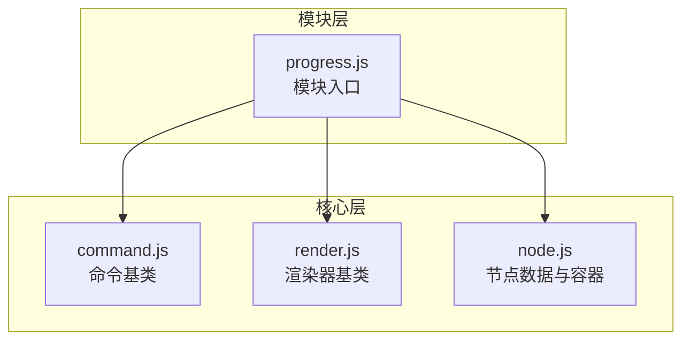
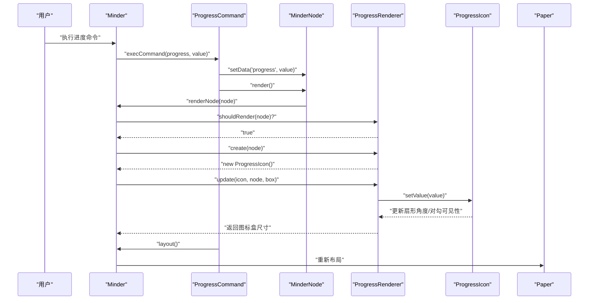
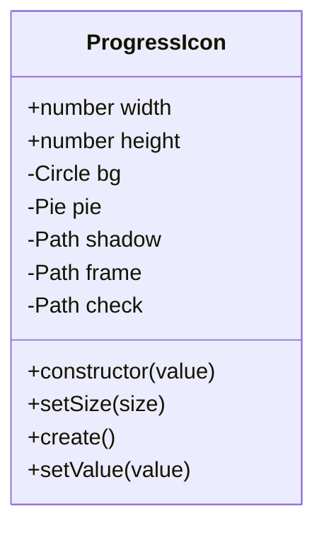
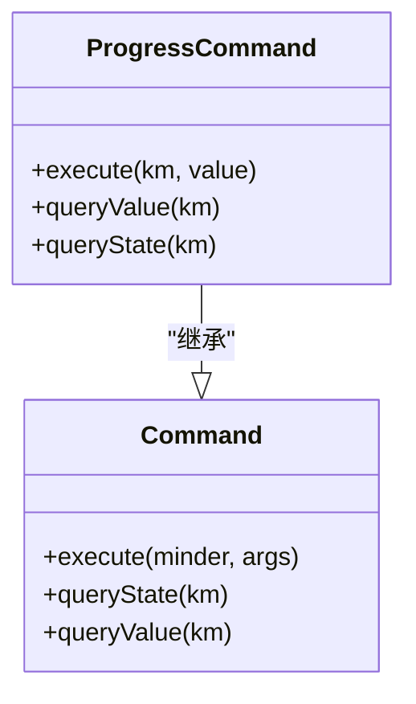
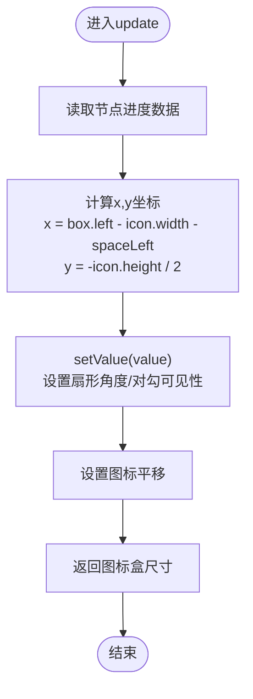
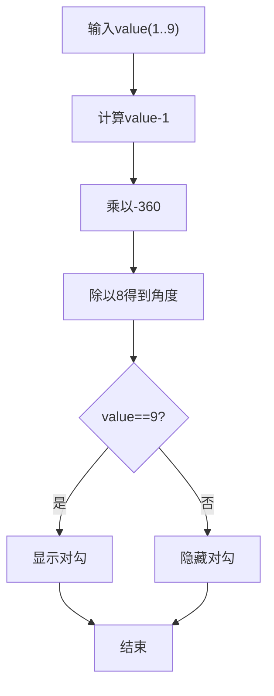
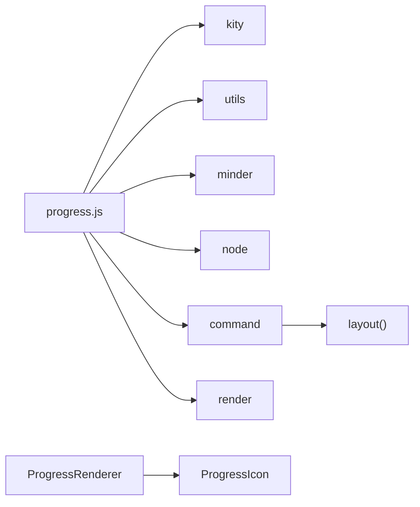

# 进度显示模块

<cite>
**本文引用的文件**
- [src/module/progress.js](file://src/module/progress.js)
- [src/core/command.js](file://src/core/command.js)
- [src/core/render.js](file://src/core/render.js)
- [src/core/node.js](file://src/core/node.js)
</cite>

## 目录
1. [简介](#简介)
2. [项目结构](#项目结构)
3. [核心组件](#核心组件)
4. [架构总览](#架构总览)
5. [详细组件分析](#详细组件分析)
6. [依赖关系分析](#依赖关系分析)
7. [性能考量](#性能考量)
8. [故障排查指南](#故障排查指南)
9. [结论](#结论)
10. [附录](#附录)

## 简介
本文件深入解析进度显示模块（progress.js）的环形进度条实现机制，围绕以下目标展开：
- 解释ProgressCommand命令类如何设置节点进度值（0-9级，对应未开始到完成）
- 分析ProgressIcon类如何组合圆形背景（bg）、扇形进度（pie）、外框（frame）、阴影（shadow）和完成对勾（check）等SVG元素构建可视化图标
- 重点解析setValue方法如何根据进度值计算扇形角度（-360*(value-1)/8）并控制对勾的可见性
- 阐述ProgressRenderer如何在节点左侧渲染图标，并在update阶段同步数据与视图
- 结合代码示例说明该模块如何利用kity.LinearGradient实现金属质感外框，并通过事件系统触发布局重排
- 提供实际使用场景如项目里程碑进度跟踪，并指出常见问题如进度条不更新或布局错位的调试方法

## 项目结构
进度模块位于模块目录下，采用标准模块注册模式：在模块内部定义命令、渲染器与图标类，并通过模块注册接口暴露给核心框架。

图表来源
- [src/module/progress.js](file://src/module/progress.js#L1-L160)
- [src/core/command.js](file://src/core/command.js#L1-L169)
- [src/core/render.js](file://src/core/render.js#L1-L261)
- [src/core/node.js](file://src/core/node.js#L1-L407)

章节来源
- [src/module/progress.js](file://src/module/progress.js#L1-L160)

## 核心组件
- ProgressIcon：封装环形进度图标的所有图形元素，负责根据进度值动态调整扇形角度与对勾可见性
- ProgressCommand：命令类，用于设置/清除节点进度值，并触发布局重排
- ProgressRenderer：左侧渲染器，负责在节点左侧创建并定位图标，同时在update阶段同步数据与位置

章节来源
- [src/module/progress.js](file://src/module/progress.js#L36-L159)
- [src/core/command.js](file://src/core/command.js#L1-L169)
- [src/core/render.js](file://src/core/render.js#L1-L261)

## 架构总览
进度模块的运行流程如下：
- 用户通过命令设置节点进度值
- 节点数据变更后调用渲染接口
- 渲染器在节点左侧创建ProgressIcon实例
- update阶段读取节点数据，计算图标位置并同步扇形角度与对勾状态
- 命令执行完成后触发布局重排，确保节点内容盒尺寸正确

图表来源
- [src/module/progress.js](file://src/module/progress.js#L103-L159)
- [src/core/command.js](file://src/core/command.js#L118-L166)
- [src/core/render.js](file://src/core/render.js#L165-L219)
- [src/core/node.js](file://src/core/node.js#L226-L239)

## 详细组件分析

### ProgressIcon：环形进度图标构建与更新
- 图形组成
  - 圆形背景（bg）：填充背景色
  - 扇形进度（pie）：填充进度色，角度随进度变化
  - 外框（frame）：使用线性渐变填充，模拟金属质感
  - 阴影（shadow）：路径形状，偏移至中心外侧，形成立体感
  - 完成对勾（check）：路径形状，仅在进度达到最大值时可见
- 尺寸与定位
  - 默认尺寸为固定像素，图标整体平移以保证像素对齐
- 角度计算与对勾控制
  - setValue方法根据进度值计算扇形角度：-360*(value-1)/8
  - 当value为9时显示对勾，否则隐藏

图表来源
- [src/module/progress.js](file://src/module/progress.js#L36-L87)

章节来源
- [src/module/progress.js](file://src/module/progress.js#L36-L87)

### ProgressCommand：进度命令与布局联动
- 功能职责
  - 设置/清除节点进度数据
  - 在执行后触发布局重排，确保节点内容盒尺寸正确
- 状态与值查询
  - queryState：基于是否有选中节点判断命令可用性
  - queryValue：返回当前选中节点的进度值

图表来源
- [src/module/progress.js](file://src/module/progress.js#L103-L125)
- [src/core/command.js](file://src/core/command.js#L1-L169)

章节来源
- [src/module/progress.js](file://src/module/progress.js#L103-L125)
- [src/core/command.js](file://src/core/command.js#L1-L169)

### ProgressRenderer：左侧渲染与数据同步
- 渲染时机
  - shouldRender：当节点存在进度数据时才渲染
  - create：创建ProgressIcon实例
- 位置计算与同步
  - update：读取节点进度值，计算图标位置（基于节点左边界、图标宽度与左侧间距）
  - 返回图标盒尺寸，供上层合并内容盒

图表来源
- [src/module/progress.js](file://src/module/progress.js#L132-L156)
- [src/core/render.js](file://src/core/render.js#L165-L219)

章节来源
- [src/module/progress.js](file://src/module/progress.js#L132-L156)
- [src/core/render.js](file://src/core/render.js#L165-L219)

### 金属质感外框与渐变效果
- 外框使用kity.LinearGradient，设置起点与终点，添加两个停止点，形成从上到下的金属质感
- 渐变资源通过Paper添加到渲染容器，供frame路径填充使用

章节来源
- [src/module/progress.js](file://src/module/progress.js#L25-L34)

### 角度计算公式解析
- setValue方法中，扇形角度按公式-360*(value-1)/8计算
- 该公式确保：
  - value=1时，角度为0°，无进度显示
  - value=9时，角度为-360°，完整显示进度
  - 中间值按8等分均匀分布，覆盖0到100%进度范围

图表来源
- [src/module/progress.js](file://src/module/progress.js#L83-L86)

## 依赖关系分析
- 模块依赖
  - progress.js依赖core层的kity、utils、minder、node、command、render
- 渲染管线
  - 渲染器在shouldRender为真时创建并更新图标
  - 节点render触发渲染器更新，最终影响布局盒尺寸
- 命令链路
  - 命令执行后调用layout，驱动整体布局重排

图表来源
- [src/module/progress.js](file://src/module/progress.js#L1-L160)
- [src/core/render.js](file://src/core/render.js#L165-L219)

章节来源
- [src/module/progress.js](file://src/module/progress.js#L1-L160)
- [src/core/render.js](file://src/core/render.js#L165-L219)

## 性能考量
- 图标复用：同一节点的渲染器会复用已创建的图标对象，避免重复创建
- 位置计算：update阶段仅进行数值计算与平移设置，开销较小
- 渐变资源：线性渐变作为资源一次性添加，减少重复构造
- 布局重排：命令执行后触发layout，建议批量操作后再统一布局，降低频繁重排成本

## 故障排查指南
- 进度条不更新
  - 检查节点数据是否正确写入与读取
  - 确认渲染器shouldRender返回true且create/update被调用
  - 验证setValue是否被调用，以及value是否在1-9范围内
- 对勾不显示
  - 确认value是否为9
  - 检查check元素的可见性设置逻辑
- 布局错位
  - 检查节点样式space-left是否合理
  - 确认update返回的图标盒尺寸正确合并到节点内容盒
  - 触发layout后观察节点内容盒变化
- 事件与交互
  - 命令执行后应触发contentchange与noderender事件，确认事件链路正常

章节来源
- [src/module/progress.js](file://src/module/progress.js#L132-L156)
- [src/core/render.js](file://src/core/render.js#L165-L219)
- [src/core/command.js](file://src/core/command.js#L118-L166)

## 结论
进度显示模块通过简洁的命令-渲染-图标三元组合，实现了直观的环形进度可视化。其关键特性包括：
- 使用线性渐变实现金属质感外框
- 通过简单公式计算扇形角度，覆盖0-100%进度
- 在节点左侧渲染图标并同步数据与位置
- 通过命令执行触发布局重排，保证整体布局一致性

## 附录
- 实际使用场景
  - 项目里程碑进度跟踪：为每个里程碑节点设置进度值，实时反映完成情况
  - 任务分解与追踪：将大任务拆分为多个子节点，分别标注进度，便于团队协作与汇报
- 最佳实践
  - 保持进度值在1-9之间，0表示移除进度
  - 批量更新节点进度后统一触发布局，避免频繁重排
  - 使用space-left控制图标与文本的间距，确保视觉平衡