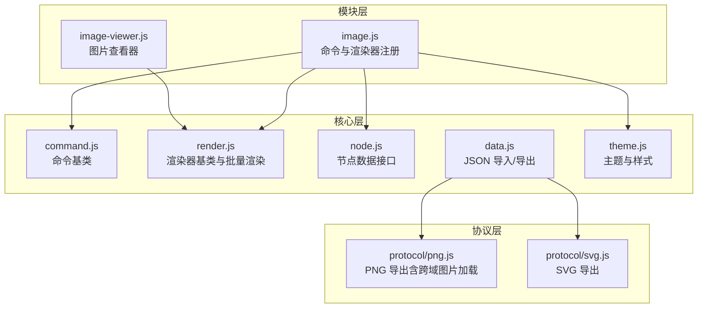
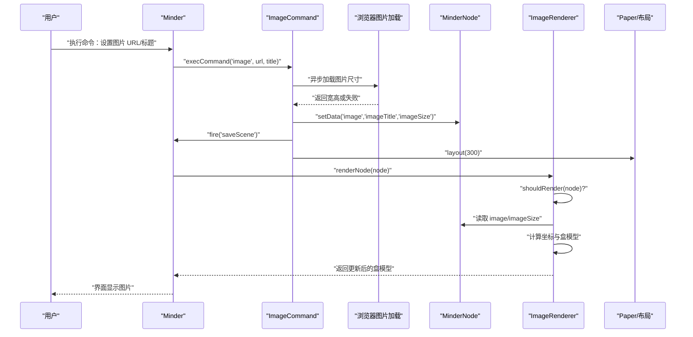
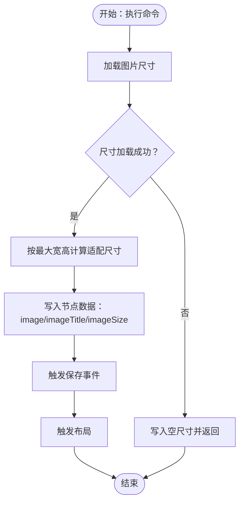
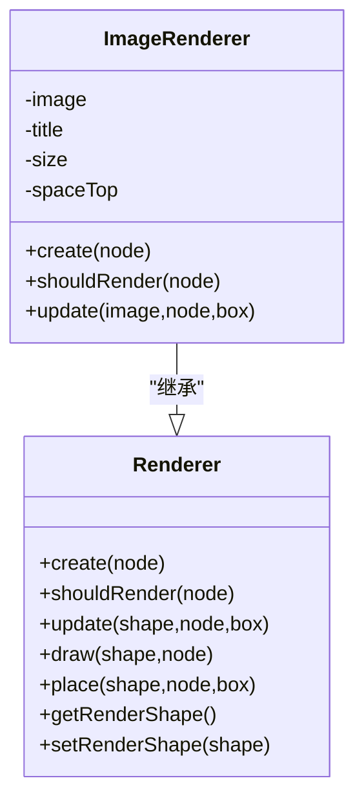
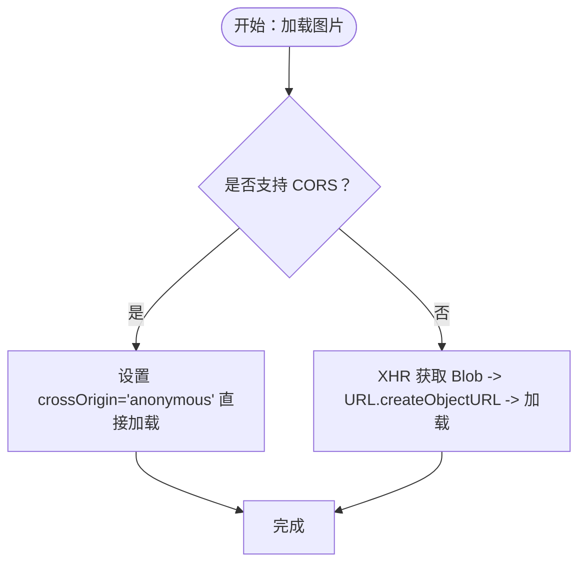
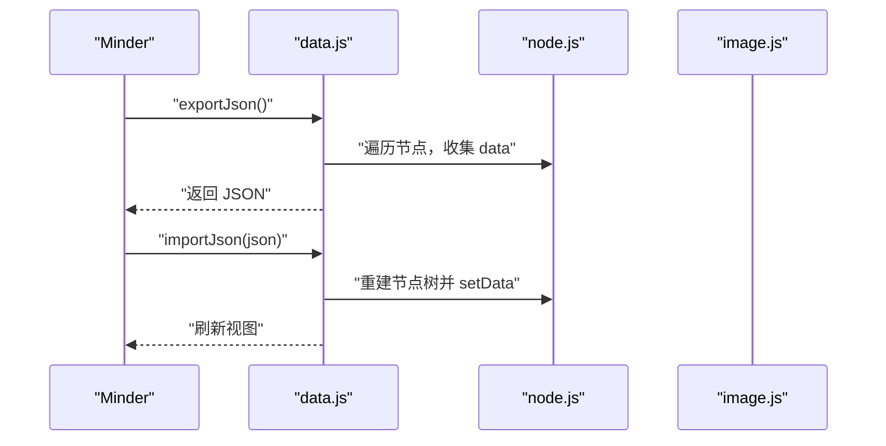
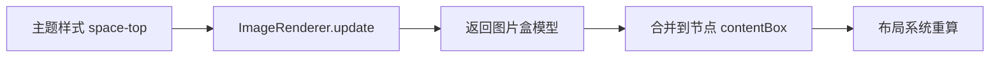
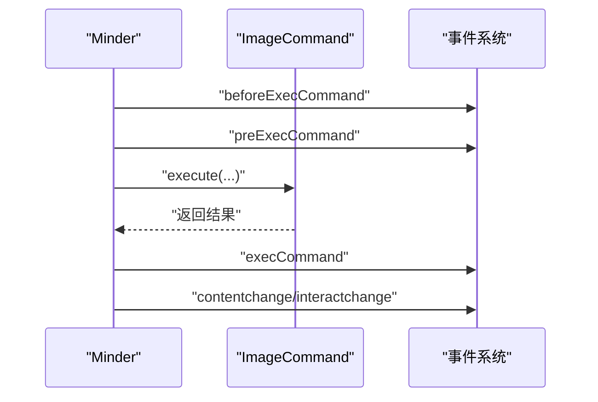
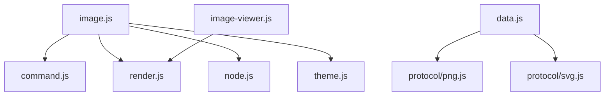

# 图片插入模块

<cite>
**本文引用的文件列表**
- [src/module/image.js](file://src/module/image.js)
- [src/module/image-viewer.js](file://src/module/image-viewer.js)
- [src/core/command.js](file://src/core/command.js)
- [src/core/render.js](file://src/core/render.js)
- [src/core/node.js](file://src/core/node.js)
- [src/core/data.js](file://src/core/data.js)
- [src/core/theme.js](file://src/core/theme.js)
- [src/protocol/png.js](file://src/protocol/png.js)
- [src/protocol/svg.js](file://src/protocol/svg.js)
</cite>

## 目录
1. [简介](#简介)
2. [项目结构](#项目结构)
3. [核心组件](#核心组件)
4. [架构总览](#架构总览)
5. [详细组件分析](#详细组件分析)
6. [依赖关系分析](#依赖关系分析)
7. [性能考量](#性能考量)
8. [故障排查指南](#故障排查指南)
9. [结论](#结论)
10. [附录](#附录)

## 简介
本文件围绕图片插入模块（image.js）进行深入技术解析，涵盖从图片上传、尺寸自适应、到 SVG 渲染的完整流程；阐述图片数据在思维导图 JSON 模型中的存储结构与序列化机制；解释图片尺寸自适应策略如何与布局系统协同工作；给出跨域加载的安全策略建议（含 CORS 处理与降级方案）；并通过实际代码路径示例展示如何集成第三方图床服务；最后分析该模块与核心数据系统、渲染系统的集成方式，以及在撤销/重做操作中的状态管理。

## 项目结构
图片插入功能由“命令-渲染器”两部分组成：
- 命令：负责接收用户输入（URL、标题），计算图片尺寸，写入节点数据，触发布局与保存事件。
- 渲染器：负责在节点顶部绘制图片，根据节点盒模型定位图片位置，适配主题样式。

图表来源
- [src/module/image.js](file://src/module/image.js#L1-L147)
- [src/module/image-viewer.js](file://src/module/image-viewer.js#L1-L111)
- [src/core/command.js](file://src/core/command.js#L1-L169)
- [src/core/render.js](file://src/core/render.js#L1-L261)
- [src/core/node.js](file://src/core/node.js#L1-L407)
- [src/core/data.js](file://src/core/data.js#L1-L416)
- [src/core/theme.js](file://src/core/theme.js#L1-L175)
- [src/protocol/png.js](file://src/protocol/png.js#L1-L288)
- [src/protocol/svg.js](file://src/protocol/svg.js#L187-L243)

章节来源
- [src/module/image.js](file://src/module/image.js#L1-L147)
- [src/module/image-viewer.js](file://src/module/image-viewer.js#L1-L111)

## 核心组件
- 图片命令（ImageCommand）
  - 接收 URL 与标题，异步加载图片尺寸，按配置的最大宽高计算适配尺寸，写入节点数据（image、imageTitle、imageSize），触发保存与布局。
- 图片渲染器（ImageRenderer）
  - 在节点顶部创建 kity.Image，读取节点数据决定是否渲染，基于节点盒模型与主题样式 space-top 计算图片坐标，设置宽高与标题属性。
- 命令基类（Command）
  - 提供命令状态查询、执行、撤销标记等通用能力，统一事件钩子与交互变更通知。
- 渲染器基类（Renderer）
  - 定义 create/shouldRender/update/place/draw 等生命周期方法，支持批量渲染与盒模型合并。
- 节点数据接口（MinderNode）
  - 提供 getData/setData 等数据存取方法，节点渲染入口 render/renderTree。
- JSON 导入/导出（Minder）
  - 导出为 JSON（含模板、主题、连接线），导入 JSON 并刷新视图。
- 主题与样式（Minder/MinderNode）
  - 提供 getStyle/getNodeStyle，读取主题样式（如 space-top）参与定位。
- 协议导出（PNG/SVG）
  - PNG 导出时对图片进行跨域加载与合成；SVG 导出时保留图片节点信息以便后续处理。

章节来源
- [src/module/image.js](file://src/module/image.js#L42-L145)
- [src/core/command.js](file://src/core/command.js#L1-L169)
- [src/core/render.js](file://src/core/render.js#L1-L261)
- [src/core/node.js](file://src/core/node.js#L130-L145)
- [src/core/data.js](file://src/core/data.js#L56-L90)
- [src/core/theme.js](file://src/core/theme.js#L98-L141)
- [src/protocol/png.js](file://src/protocol/png.js#L1-L288)
- [src/protocol/svg.js](file://src/protocol/svg.js#L187-L243)

## 架构总览
图片插入的端到端流程如下：

图表来源
- [src/module/image.js](file://src/module/image.js#L52-L106)
- [src/core/command.js](file://src/core/command.js#L118-L166)
- [src/core/render.js](file://src/core/render.js#L165-L219)
- [src/core/node.js](file://src/core/node.js#L226-L239)

## 详细组件分析

### 图片命令（ImageCommand）
- 输入输出
  - 输入：URL、标题
  - 输出：节点数据 image、imageTitle、imageSize；触发 saveScene 与布局
- 关键逻辑
  - 异步加载图片尺寸：onload/onerror 回调统一返回 null 或宽高
  - 适配尺寸：根据原图宽高与最大宽高计算新尺寸，保证比例一致
  - 写入节点数据：image、imageTitle、imageSize
  - 触发保存与布局：fire('saveScene')、layout(300)
  - 命令状态：无选中节点返回禁用态，否则可用
  - 命令值：返回当前选中节点的 {url,title}

图表来源
- [src/module/image.js](file://src/module/image.js#L12-L21)
- [src/module/image.js](file://src/module/image.js#L23-L40)
- [src/module/image.js](file://src/module/image.js#L52-L71)

章节来源
- [src/module/image.js](file://src/module/image.js#L52-L95)

### 图片渲染器（ImageRenderer）
- 渲染时机：当节点存在 image 数据时才渲染
- 创建图形：基于节点 image 数据创建 kity.Image
- 定位策略：基于节点盒模型中心与高度，结合主题样式 space-top 计算图片左上角坐标
- 尺寸应用：设置 width/height
- 标题支持：若存在 imageTitle，设置 xlink:title 属性
- 返回盒模型：返回图片占用的矩形盒，供布局合并

图表来源
- [src/module/image.js](file://src/module/image.js#L97-L132)
- [src/core/render.js](file://src/core/render.js#L1-L58)

章节来源
- [src/module/image.js](file://src/module/image.js#L97-L132)
- [src/core/render.js](file://src/core/render.js#L165-L219)

### 跨域加载与安全策略
- 浏览器图片加载
  - 使用原生 img 标签加载图片，onerror 回调用于失败处理
- PNG 导出中的跨域处理
  - 对于支持 CORS 的图片，直接设置 image.crossOrigin='anonymous' 并加载
  - 对于不支持 CORS 的图片，使用 XHR 获取 Blob，再通过 URL.createObjectURL 生成临时地址加载，避免跨域污染
  - 对 data: URL 的图片，直接创建 img 并加载
- 降级方案
  - 若图片加载失败，命令层回调返回 null，渲染器在无尺寸时跳过绘制
  - 可在业务层捕获错误并替换为占位图（需自行扩展）

图表来源
- [src/module/image.js](file://src/module/image.js#L12-L21)
- [src/protocol/png.js](file://src/protocol/png.js#L1-L67)
- [src/protocol/png.js](file://src/protocol/png.js#L34-L103)

章节来源
- [src/module/image.js](file://src/module/image.js#L12-L21)
- [src/protocol/png.js](file://src/protocol/png.js#L1-L103)

### 与核心数据系统的集成与序列化
- 存储结构
  - 节点数据包含：image（图片 URL）、imageTitle（标题）、imageSize（{width,height}）
- 导入/导出
  - 导出 JSON：exportJson 会遍历整棵树，将每个节点的 data 字段序列化为 JSON
  - 导入 JSON：importJson 重建节点树，恢复 image/imageTitle/imageSize 等数据
- 事件与状态
  - 命令执行后 fire('saveScene')，随后 layout(300) 触发布局重算
  - 命令执行会触发 contentchange 与交互变更事件，便于撤销/重做系统记录

图表来源
- [src/core/data.js](file://src/core/data.js#L56-L90)
- [src/core/data.js](file://src/core/data.js#L204-L223)
- [src/core/node.js](file://src/core/node.js#L130-L145)
- [src/module/image.js](file://src/module/image.js#L60-L71)

章节来源
- [src/core/data.js](file://src/core/data.js#L56-L90)
- [src/core/data.js](file://src/core/data.js#L204-L223)
- [src/core/node.js](file://src/core/node.js#L130-L145)
- [src/module/image.js](file://src/module/image.js#L60-L71)

### 与渲染系统的集成与布局协同
- 渲染顺序
  - 渲染器按“before/section/after”顺序组合，ImageRenderer 注册在 top 分区
  - 批量渲染时，先创建图形，再 update，最后合并盒模型
- 布局协同
  - ImageRenderer.update 返回图片盒模型，渲染器将该盒模型合并到节点 contentBox，影响后续布局
  - 主题样式 space-top 影响图片垂直偏移，确保在不同主题下显示一致性
- 缩放与主题
  - 主题通过 getStyle/getNodeStyle 提供样式，渲染器读取 space-top 等样式参与定位
  - 布局阶段会考虑节点整体盒模型变化，从而在缩放与主题切换时保持相对位置稳定

图表来源
- [src/core/render.js](file://src/core/render.js#L165-L219)
- [src/core/theme.js](file://src/core/theme.js#L98-L141)
- [src/module/image.js](file://src/module/image.js#L108-L131)

章节来源
- [src/core/render.js](file://src/core/render.js#L165-L219)
- [src/core/theme.js](file://src/core/theme.js#L98-L141)
- [src/module/image.js](file://src/module/image.js#L108-L131)

### 第三方图床集成与错误处理
- 集成思路
  - 将第三方图床上传接口返回的 URL 作为 image 命令的输入
  - 若图床支持 CORS，可直接使用；若不支持，可在业务层预处理为可跨域访问的 URL（例如通过代理服务或服务端下载后返回）
- 错误处理与占位符
  - 命令层在图片加载失败时回调返回 null，渲染器在无尺寸时不绘制
  - 可在业务层监听 saveScene 或布局完成后检查节点 image 是否为空，替换为本地占位图

章节来源
- [src/module/image.js](file://src/module/image.js#L12-L21)
- [src/module/image.js](file://src/module/image.js#L108-L131)

### 撤销/重做与状态管理
- 命令执行流程
  - execCommand 统一触发 beforeExecCommand/preExecCommand/execCommand 事件
  - 若命令标记为内容变更（默认），将触发 contentchange 与交互变更
- 状态持久化
  - saveScene 事件可用于持久化当前场景
  - JSON 导入/导出可完整恢复节点数据（含 image/imageTitle/imageSize）

图表来源
- [src/core/command.js](file://src/core/command.js#L118-L166)
- [src/module/image.js](file://src/module/image.js#L60-L71)

章节来源
- [src/core/command.js](file://src/core/command.js#L118-L166)
- [src/module/image.js](file://src/module/image.js#L60-L71)

## 依赖关系分析
- 模块内依赖
  - image.js 依赖 command、render、node、minder、kity、utils
  - image-viewer.js 依赖 dom 工具与 keymap
- 与协议层交互
  - PNG/SVG 导出协议在渲染图片时会涉及跨域图片加载与合成，间接影响图片显示一致性
- 与主题系统交互
  - 渲染器读取主题样式 space-top，影响图片垂直定位

图表来源
- [src/module/image.js](file://src/module/image.js#L1-L147)
- [src/module/image-viewer.js](file://src/module/image-viewer.js#L1-L111)
- [src/core/command.js](file://src/core/command.js#L1-L169)
- [src/core/render.js](file://src/core/render.js#L1-L261)
- [src/core/node.js](file://src/core/node.js#L1-L407)
- [src/core/theme.js](file://src/core/theme.js#L1-L175)
- [src/core/data.js](file://src/core/data.js#L1-L416)
- [src/protocol/png.js](file://src/protocol/png.js#L1-L288)
- [src/protocol/svg.js](file://src/protocol/svg.js#L187-L243)

章节来源
- [src/module/image.js](file://src/module/image.js#L1-L147)
- [src/module/image-viewer.js](file://src/module/image-viewer.js#L1-L111)
- [src/core/command.js](file://src/core/command.js#L1-L169)
- [src/core/render.js](file://src/core/render.js#L1-L261)
- [src/core/node.js](file://src/core/node.js#L1-L407)
- [src/core/theme.js](file://src/core/theme.js#L1-L175)
- [src/core/data.js](file://src/core/data.js#L1-L416)
- [src/protocol/png.js](file://src/protocol/png.js#L1-L288)
- [src/protocol/svg.js](file://src/protocol/svg.js#L187-L243)

## 性能考量
- 图片尺寸计算
  - fitImageSize 仅进行一次比例计算，时间复杂度 O(1)，空间复杂度 O(1)
- 异步加载
  - 使用原生 img.onload/onerror，避免阻塞主线程
- 渲染批处理
  - renderNodeBatch 一次性遍历渲染器，减少 DOM 操作次数
- 导出优化
  - PNG 导出采用 XHR + Blob 方案，避免跨域污染，同时可并行加载多张图片

章节来源
- [src/module/image.js](file://src/module/image.js#L23-L40)
- [src/core/render.js](file://src/core/render.js#L85-L163)
- [src/protocol/png.js](file://src/protocol/png.js#L34-L103)

## 故障排查指南
- 图片不显示
  - 检查节点数据中 image 是否存在，imageSize 是否计算成功
  - 确认渲染器 shouldRender 返回 true
- 跨域问题
  - 若图片加载失败，确认目标站点是否允许匿名跨域；否则使用 XHR 下载或代理
- 尺寸异常
  - 检查主题样式 space-top 是否过大导致图片被挤出可视区域
- 导出 PNG 时图片缺失
  - 确认 PNG 导出协议已正确加载图片并合成

章节来源
- [src/module/image.js](file://src/module/image.js#L104-L131)
- [src/protocol/png.js](file://src/protocol/png.js#L1-L67)
- [src/protocol/png.js](file://src/protocol/png.js#L34-L103)

## 结论
图片插入模块通过命令-渲染器模式实现了从数据写入到视觉呈现的完整闭环。其关键特性包括：
- 基于节点数据的轻量存储（image、imageTitle、imageSize）
- 基于主题样式的尺寸自适应与定位
- 与布局系统的盒模型协作，确保在不同主题与缩放下的稳定性
- 面向跨域场景的加载策略与降级方案
- 与 JSON 导入/导出、撤销/重做的良好集成

这些设计使得图片功能既易于扩展（如接入第三方图床），又具备良好的性能与可靠性。

## 附录
- 常用代码路径参考
  - 命令定义与执行：[src/module/image.js](file://src/module/image.js#L52-L95)
  - 渲染器实现：[src/module/image.js](file://src/module/image.js#L97-L132)
  - 跨域加载策略：[src/protocol/png.js](file://src/protocol/png.js#L1-L103)
  - JSON 导入/导出：[src/core/data.js](file://src/core/data.js#L56-L90), [src/core/data.js](file://src/core/data.js#L204-L223)
  - 主题样式读取：[src/core/theme.js](file://src/core/theme.js#L98-L141)
  - 命令执行事件流：[src/core/command.js](file://src/core/command.js#L118-L166)