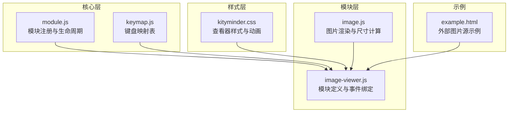
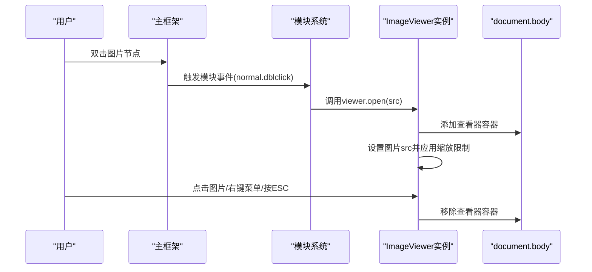
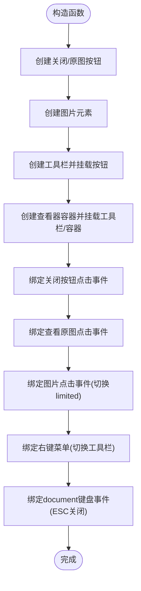
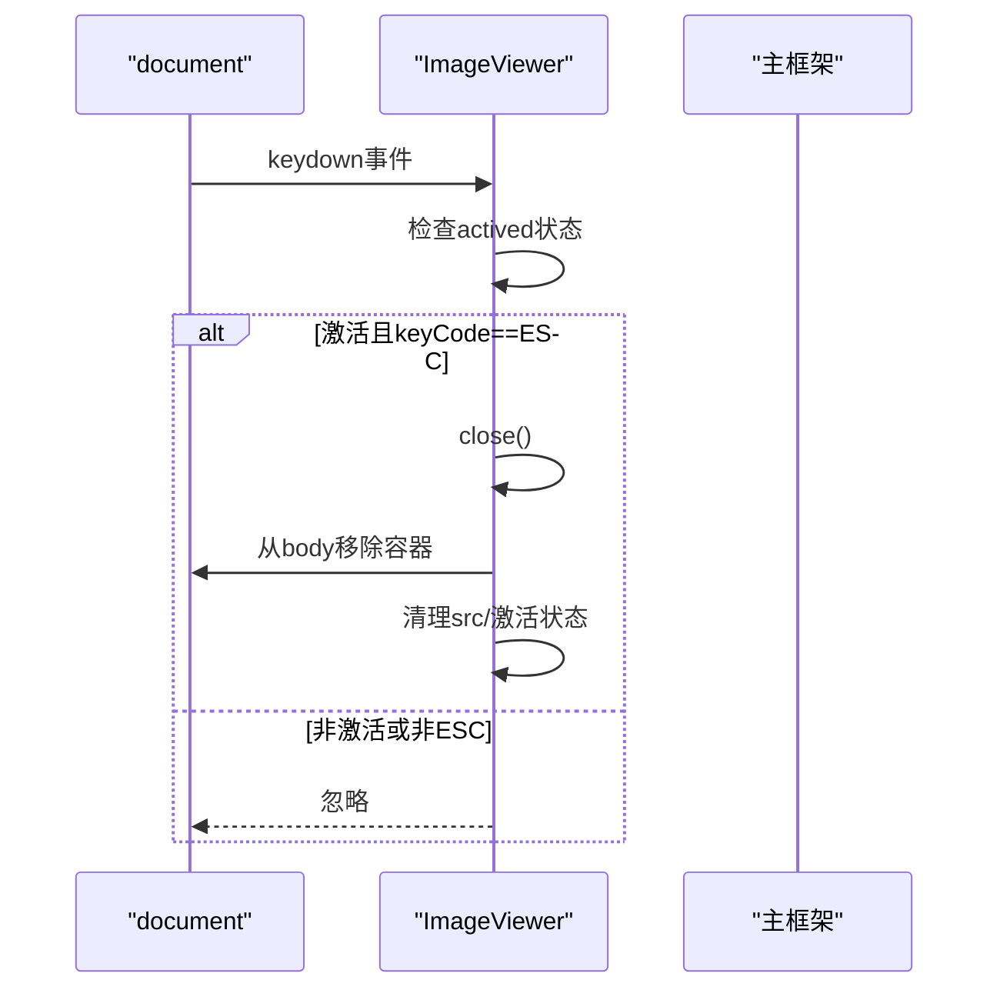
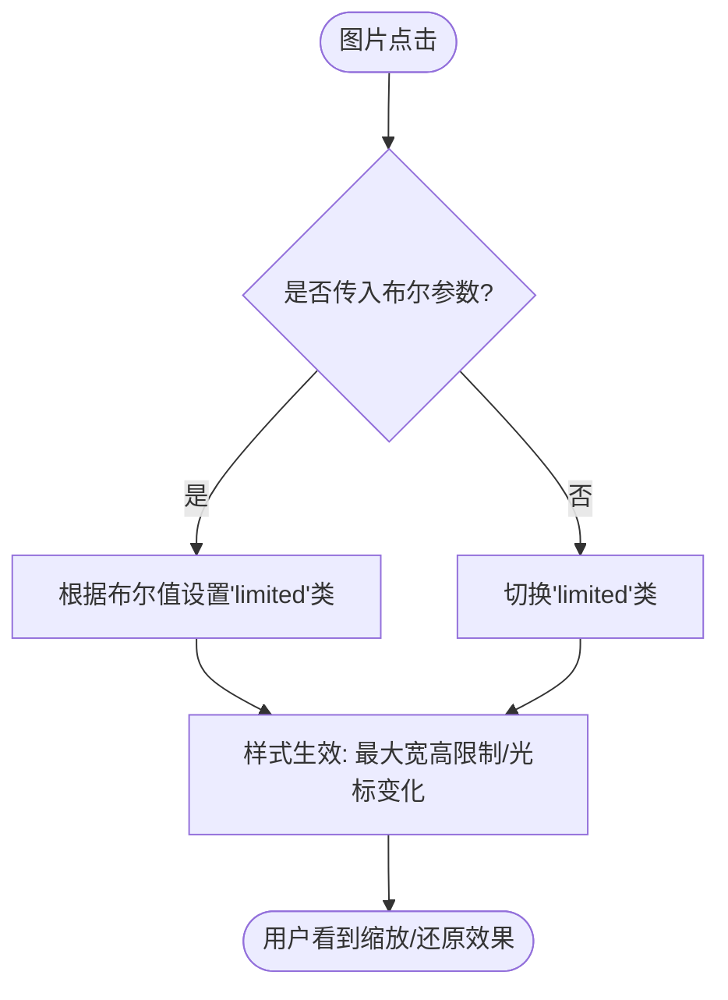
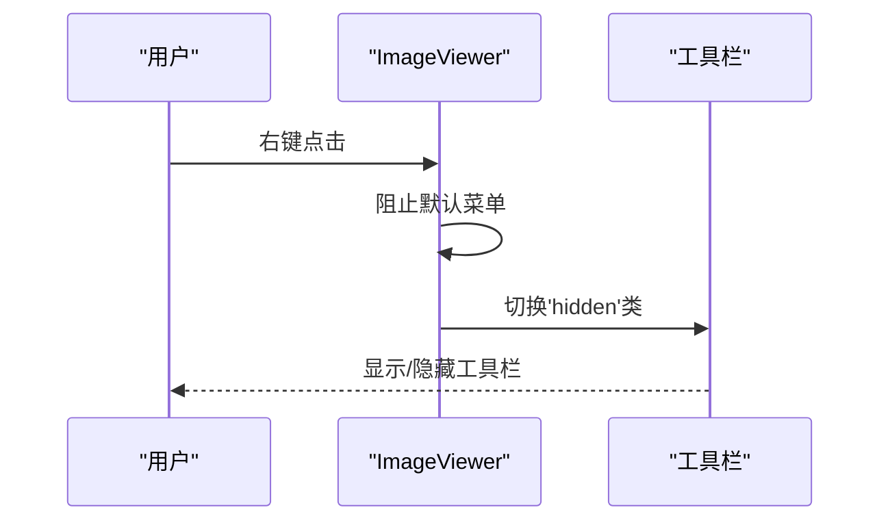
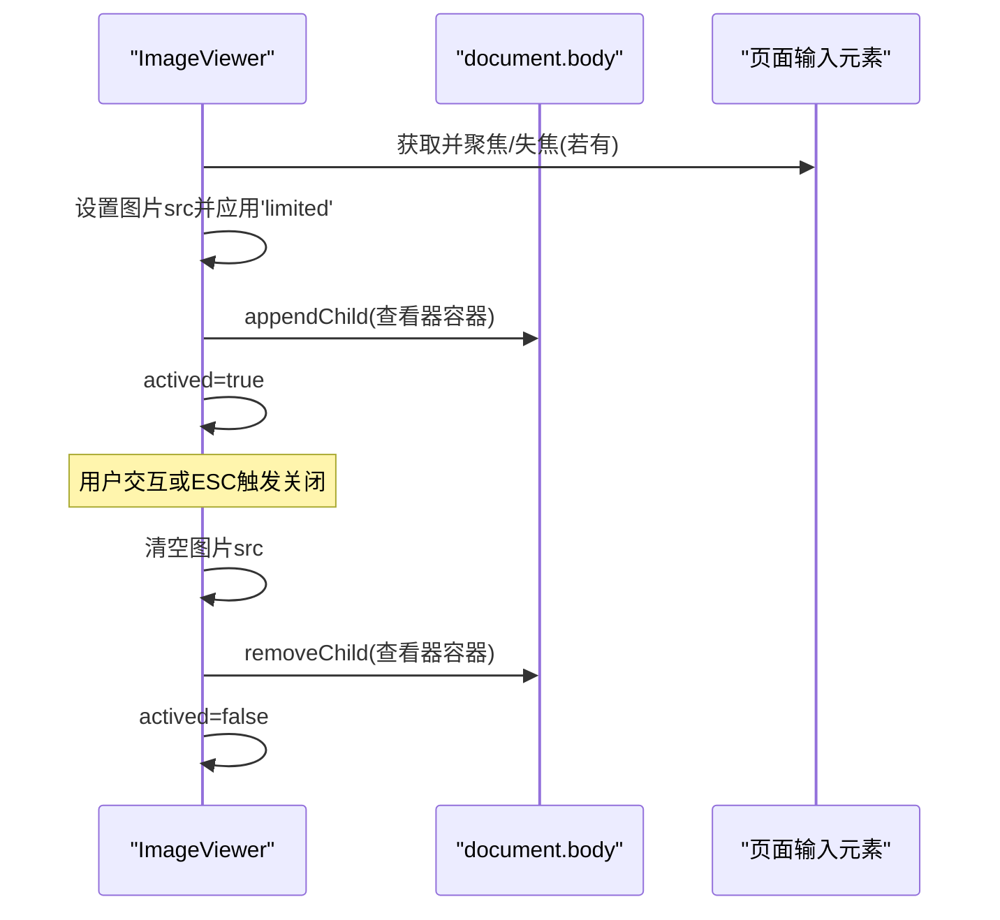
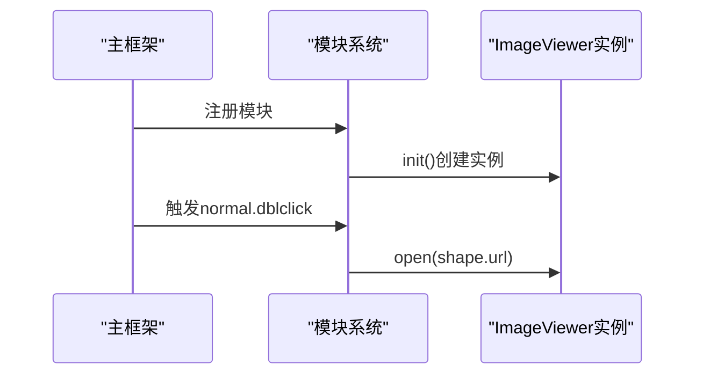
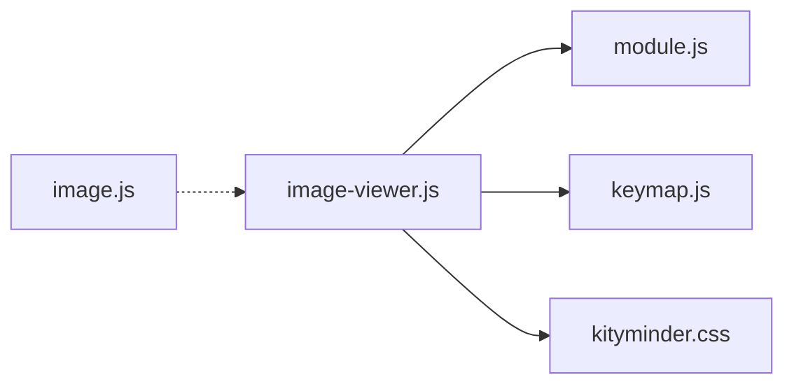

# 图片查看器模块

<cite>
**本文引用的文件列表**
- [src/module/image-viewer.js](file://src/module/image-viewer.js)
- [src/kityminder.css](file://src/kityminder.css)
- [src/core/keymap.js](file://src/core/keymap.js)
- [src/core/module.js](file://src/core/module.js)
- [src/module/image.js](file://src/module/image.js)
- [example.html](file://example.html)
</cite>

## 目录
1. [简介](#简介)
2. [项目结构](#项目结构)
3. [核心组件](#核心组件)
4. [架构总览](#架构总览)
5. [详细组件分析](#详细组件分析)
6. [依赖关系分析](#依赖关系分析)
7. [性能考虑](#性能考虑)
8. [故障排查指南](#故障排查指南)
9. [结论](#结论)
10. [附录](#附录)

## 简介
本文件面向“图片查看器模块（image-viewer.js）”的实现机制进行全面解析，重点覆盖：
- 模态窗口的DOM结构创建与事件绑定策略（关闭按钮、查看原图、右键菜单）
- 图片缩放功能的实现原理（'limited'类切换控制的响应式缩放）
- ESC键快捷关闭的热键处理机制及其生命周期管理
- 在document.body中的动态添加与移除策略及焦点管理
- 移动端手势支持的扩展建议与性能优化方案
- 外部图片源的安全处理与XSS防护思路

## 项目结构
图片查看器模块位于模块目录下，采用AMD风格定义，并通过模块注册机制集成到主框架中；样式定义集中在全局CSS中，配合类名控制显示与交互状态。

图表来源
- [src/module/image-viewer.js](file://src/module/image-viewer.js#L1-L111)
- [src/core/module.js](file://src/core/module.js#L1-L151)
- [src/core/keymap.js](file://src/core/keymap.js#L1-L128)
- [src/kityminder.css](file://src/kityminder.css#L1-L93)
- [src/module/image.js](file://src/module/image.js#L1-L147)
- [example.html](file://example.html#L1-L66)

章节来源
- [src/module/image-viewer.js](file://src/module/image-viewer.js#L1-L111)
- [src/core/module.js](file://src/core/module.js#L1-L151)
- [src/kityminder.css](file://src/kityminder.css#L1-L93)

## 核心组件
- ImageViewer类：负责构建模态容器、按钮、图片元素，绑定点击、右键菜单、键盘事件，控制打开/关闭流程。
- 样式系统：通过类名控制背景遮罩、容器布局、工具栏显隐、图片缩放限制与光标状态。
- 键盘映射：ESC键映射到keyCode 27，用于快捷关闭。
- 模块注册：通过模块注册机制挂载到主框架，接收双击事件触发打开。

章节来源
- [src/module/image-viewer.js](file://src/module/image-viewer.js#L36-L111)
- [src/kityminder.css](file://src/kityminder.css#L22-L93)
- [src/core/keymap.js](file://src/core/keymap.js#L1-L128)
- [src/core/module.js](file://src/core/module.js#L1-L151)

## 架构总览
图片查看器作为独立模块被注册到主框架，通过事件钩子接收用户操作（如双击图片），随后实例化查看器并动态插入DOM，最终在用户交互或键盘事件下移除。

图表来源
- [src/module/image-viewer.js](file://src/module/image-viewer.js#L97-L111)
- [src/core/module.js](file://src/core/module.js#L83-L118)

## 详细组件分析

### 模态窗口DOM结构与事件绑定
- DOM结构创建
  - 工具栏包含两个按钮：关闭按钮与“查看原图”按钮；图片元素位于容器内；最外层为查看器容器。
  - 通过辅助函数创建元素并批量添加类名，再以父子关系组装。
- 事件绑定策略
  - 关闭按钮：点击事件绑定到关闭方法。
  - 查看原图：点击事件绑定到打开新窗口访问当前图片src。
  - 图片点击：切换'limited'类，实现缩放/还原。
  - 右键菜单：阻止默认菜单后切换工具栏显隐。
  - 全局键盘：监听keydown，当查看器激活且按键为ESC时关闭。

图表来源
- [src/module/image-viewer.js](file://src/module/image-viewer.js#L11-L49)

章节来源
- [src/module/image-viewer.js](file://src/module/image-viewer.js#L11-L49)

### ESC键快捷关闭与生命周期管理
- 快捷键处理
  - 使用键盘映射表将'Esc'映射为keyCode 27。
  - 在keydown事件中判断查看器是否处于激活状态，若命中则调用关闭方法。
- 生命周期管理
  - 初始化时绑定热键处理器；销毁时移除事件监听，避免内存泄漏。
  - 关闭时清理图片src，从body移除容器，重置激活状态。

图表来源
- [src/module/image-viewer.js](file://src/module/image-viewer.js#L55-L62)
- [src/module/image-viewer.js](file://src/module/image-viewer.js#L90-L94)
- [src/core/keymap.js](file://src/core/keymap.js#L1-L128)

章节来源
- [src/module/image-viewer.js](file://src/module/image-viewer.js#L55-L62)
- [src/module/image-viewer.js](file://src/module/image-viewer.js#L90-L94)
- [src/core/keymap.js](file://src/core/keymap.js#L1-L128)

### 图片缩放与'limited'类切换
- 缩放控制逻辑
  - 点击图片时切换'limited'类；传入布尔值可强制设置；未传参时toggle。
  - 'limited'类由样式控制，使图片在容器内保持最大宽度/高度限制，同时改变光标状态提示可缩放/已限制。
- 响应式缩放行为
  - 通过CSS选择器限制图片最大宽高，配合垂直居中与容器自适应滚动，实现不同屏幕下的合理展示。

图表来源
- [src/module/image-viewer.js](file://src/module/image-viewer.js#L67-L75)
- [src/kityminder.css](file://src/kityminder.css#L52-L61)

章节来源
- [src/module/image-viewer.js](file://src/module/image-viewer.js#L67-L75)
- [src/kityminder.css](file://src/kityminder.css#L52-L61)

### 右键菜单与工具栏交互
- 右键菜单
  - 阻止默认右键菜单，切换工具栏的隐藏类，实现快速显隐。
- 工具栏按钮
  - 关闭按钮：触发关闭流程。
  - 查看原图：在新窗口打开当前图片src，便于下载或另存。

图表来源
- [src/module/image-viewer.js](file://src/module/image-viewer.js#L63-L66)
- [src/module/image-viewer.js](file://src/module/image-viewer.js#L45-L47)
- [src/kityminder.css](file://src/kityminder.css#L63-L73)

章节来源
- [src/module/image-viewer.js](file://src/module/image-viewer.js#L45-L47)
- [src/module/image-viewer.js](file://src/module/image-viewer.js#L63-L66)
- [src/kityminder.css](file://src/kityminder.css#L63-L73)

### 在document.body中的动态添加与移除策略
- 动态添加
  - 打开时将查看器容器追加到document.body，设置图片src并强制应用'limited'类以保证初始缩放。
- 动态移除
  - 关闭时清空图片src，从document.body移除容器，重置激活状态。
- 焦点管理
  - 打开时尝试聚焦并立即失焦输入元素，避免影响查看器交互焦点。

图表来源
- [src/module/image-viewer.js](file://src/module/image-viewer.js#L79-L94)

章节来源
- [src/module/image-viewer.js](file://src/module/image-viewer.js#L79-L94)

### 事件触发与模块集成
- 模块注册
  - 通过模块注册机制将图片查看器模块挂载到主框架，初始化时创建实例。
- 事件钩子
  - 接收normal.dblclick事件，当目标为图片节点且存在URL时，调用viewer.open(src)打开查看器。

图表来源
- [src/core/module.js](file://src/core/module.js#L1-L151)
- [src/module/image-viewer.js](file://src/module/image-viewer.js#L97-L111)

章节来源
- [src/core/module.js](file://src/core/module.js#L1-L151)
- [src/module/image-viewer.js](file://src/module/image-viewer.js#L97-L111)

### 外部图片源与XSS防护建议
- 现状说明
  - 查看器直接使用传入的src赋给img.src，未见对URL来源进行白名单校验或协议限制。
- 安全建议
  - URL白名单：仅允许特定域名或协议（如https）。
  - 内容安全策略：通过CSP限制img-src，避免加载不受信任资源。
  - 同源策略：跨域图片需确保CORS可用，避免跨域读取失败。
  - 输入清洗：对用户输入的URL进行基本合法性检查与编码处理。
  - 仅在确认安全后再赋值给img.src，必要时先预检图片尺寸与类型。

章节来源
- [src/module/image-viewer.js](file://src/module/image-viewer.js#L79-L86)

## 依赖关系分析
- 模块依赖
  - image-viewer依赖核心模块（kity、keymap）、模块注册（module）、命令（command）。
- 样式依赖
  - 查看器容器、工具栏、按钮、图片的样式均来自全局CSS，通过类名控制显示与交互状态。
- 事件耦合
  - 查看器与主框架通过事件钩子耦合，模块系统负责事件分发与生命周期管理。

图表来源
- [src/module/image-viewer.js](file://src/module/image-viewer.js#L1-L111)
- [src/core/module.js](file://src/core/module.js#L1-L151)
- [src/core/keymap.js](file://src/core/keymap.js#L1-L128)
- [src/kityminder.css](file://src/kityminder.css#L1-L93)
- [src/module/image.js](file://src/module/image.js#L1-L147)

章节来源
- [src/module/image-viewer.js](file://src/module/image-viewer.js#L1-L111)
- [src/core/module.js](file://src/core/module.js#L1-L151)
- [src/core/keymap.js](file://src/core/keymap.js#L1-L128)
- [src/kityminder.css](file://src/kityminder.css#L1-L93)
- [src/module/image.js](file://src/module/image.js#L1-L147)

## 性能考虑
- 图片加载与缩放
  - 初始强制应用'limited'类，避免大图首次渲染导致的布局抖动。
  - 建议在打开前预估图片尺寸，减少重排与重绘。
- 事件监听
  - ESC键监听绑定在document上，注意在销毁时移除，避免重复监听造成性能损耗。
- 移动端体验
  - 增加触摸手势（双指缩放、拖拽）提升移动端交互体验。
  - 适当降低CSS过渡动画时长，提高滚动与切换的流畅度。
- 资源管理
  - 关闭时清空图片src，释放内存占用；避免残留引用导致的内存泄漏。

## 故障排查指南
- ESC键无效
  - 检查actived状态是否为true；确认键盘映射表中'Esc'对应keyCode 27。
- 右键菜单不显示
  - 确认contextmenu事件是否被正确阻止默认行为并切换工具栏类。
- 点击图片无反应
  - 检查zoomImage方法是否被调用；确认'limited'类切换逻辑。
- 查看原图无法打开
  - 确认当前图片src有效且可访问；检查浏览器是否拦截新窗口。
- 页面卡顿
  - 检查是否存在重复的keydown监听；确认关闭时是否移除了容器。

章节来源
- [src/module/image-viewer.js](file://src/module/image-viewer.js#L55-L62)
- [src/module/image-viewer.js](file://src/module/image-viewer.js#L63-L66)
- [src/module/image-viewer.js](file://src/module/image-viewer.js#L67-L75)
- [src/module/image-viewer.js](file://src/module/image-viewer.js#L76-L78)
- [src/module/image-viewer.js](file://src/module/image-viewer.js#L90-L94)
- [src/core/keymap.js](file://src/core/keymap.js#L1-L128)

## 结论
图片查看器模块通过简洁的DOM结构与事件绑定实现了基础的图片浏览能力：ESC快捷键、右键菜单、点击缩放、查看原图等。样式系统以类名驱动响应式缩放与工具栏显隐。模块注册机制使其与主框架无缝集成。为进一步提升安全性与移动端体验，建议增加URL白名单、CSP策略与触摸手势支持，并在大图场景下优化加载与渲染性能。

## 附录
- 示例中使用了外部图片源，验证了查看器对远程图片的支持。
- 图片渲染模块提供了图片尺寸计算与布局更新，有助于在打开前预估显示效果。

章节来源
- [example.html](file://example.html#L30-L52)
- [src/module/image.js](file://src/module/image.js#L1-L147)