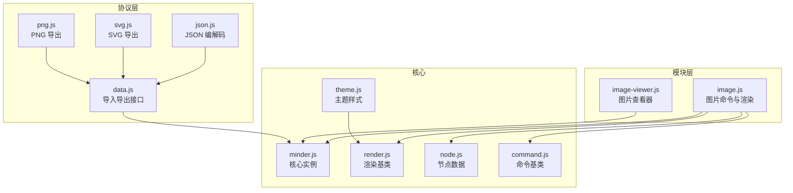
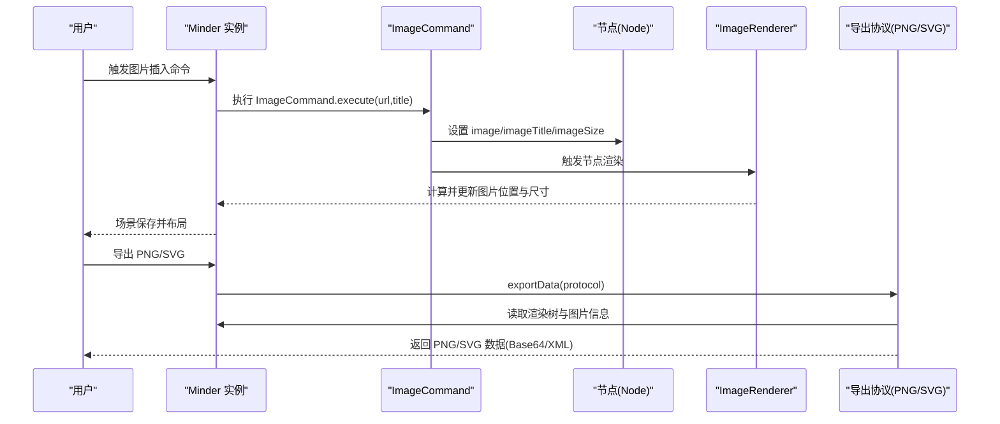
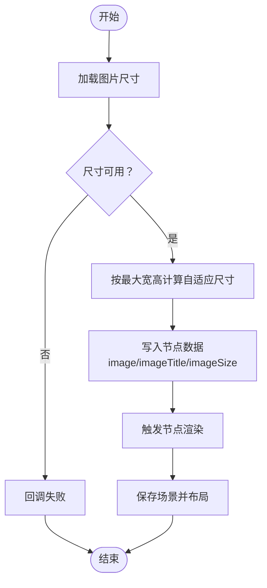
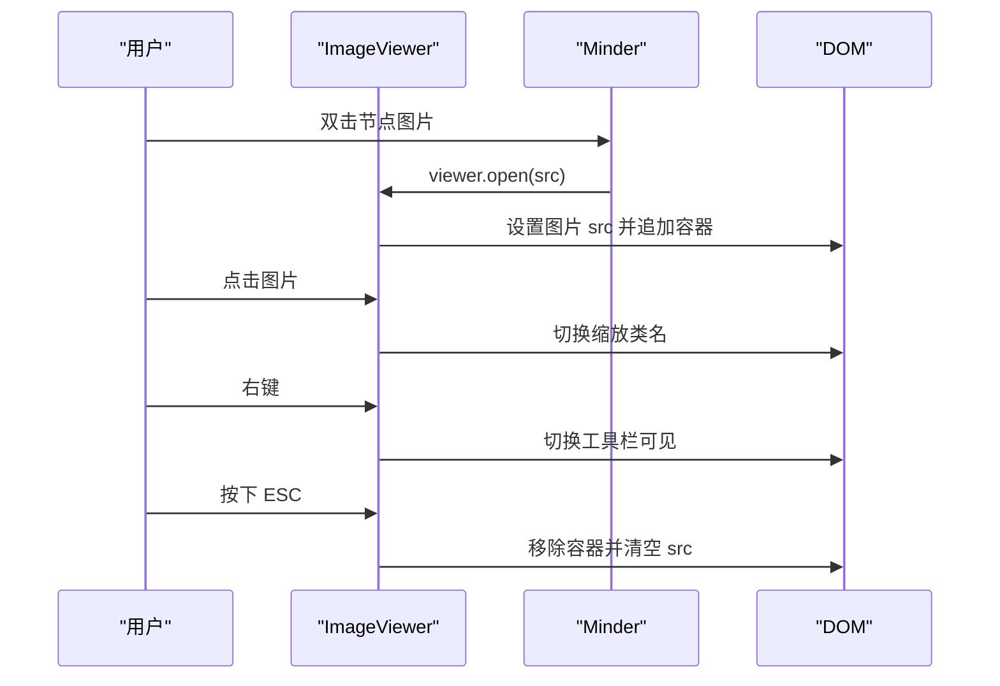
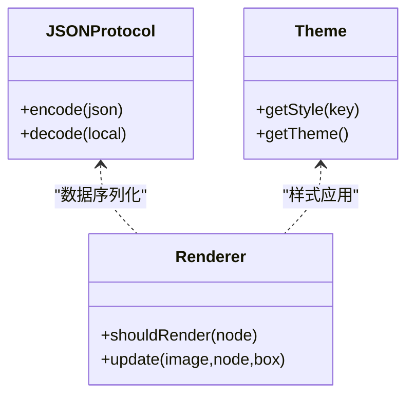
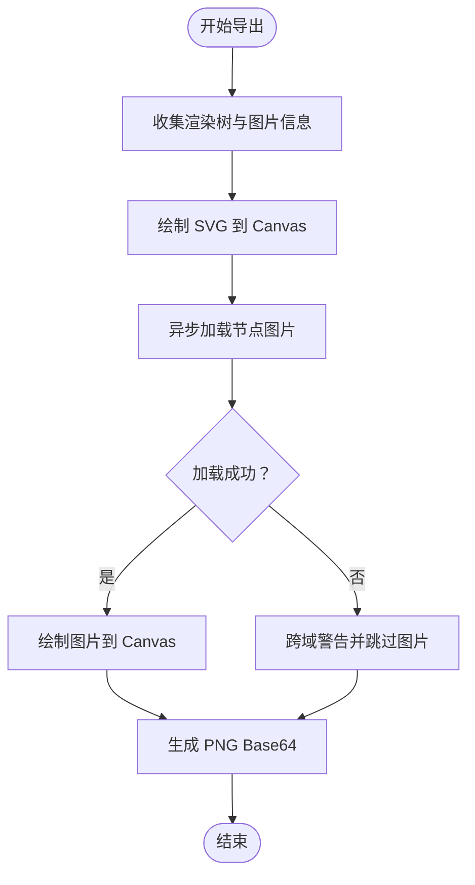
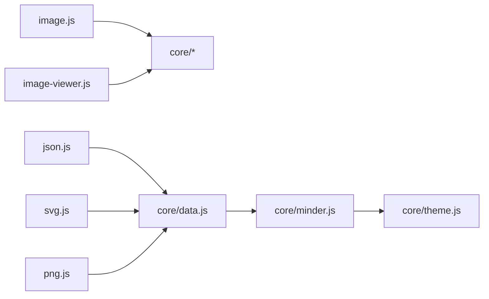

# 多媒体支持模块

<cite>
**本文引用的文件列表**
- [src/module/image.js](file://src/module/image.js)
- [src/module/image-viewer.js](file://src/module/image-viewer.js)
- [src/protocol/json.js](file://src/protocol/json.js)
- [src/protocol/svg.js](file://src/protocol/svg.js)
- [src/protocol/png.js](file://src/protocol/png.js)
- [src/core/data.js](file://src/core/data.js)
- [src/core/minder.js](file://src/core/minder.js)
- [src/core/render.js](file://src/core/render.js)
- [src/core/node.js](file://src/core/node.js)
- [src/core/command.js](file://src/core/command.js)
- [src/core/theme.js](file://src/core/theme.js)
</cite>

## 目录
1. [简介](#简介)
2. [项目结构](#项目结构)
3. [核心组件](#核心组件)
4. [架构总览](#架构总览)
5. [组件详解](#组件详解)
6. [依赖关系分析](#依赖关系分析)
7. [性能与优化](#性能与优化)
8. [故障排查指南](#故障排查指南)
9. [结论](#结论)
10. [附录](#附录)

## 简介
本文件系统化梳理多媒体支持功能的技术实现，重点覆盖：
- 图片插入模块（image.js）：图片上传、尺寸自适应、渲染与样式兼容
- 图片查看器模块（image-viewer.js）：模态窗口管理、缩放与工具栏交互
- JSON 协议与主题样式兼容：节点数据结构与主题样式对齐
- 跨域图片加载安全策略：CORS 与 XHR 方案
- 大图导出性能优化：PNG 导出流程与降级处理
- 移动端适配技巧：触摸与手势支持
- 第三方图片服务集成与错误降级：加载失败的兜底策略

## 项目结构
多媒体支持由“模块层”和“协议层”协同完成：
- 模块层：负责节点数据与渲染逻辑（image.js）、查看器交互（image-viewer.js）
- 协议层：负责数据序列化与导出（json.js、svg.js、png.js），以及通用导入导出接口（data.js）

图表来源
- [src/module/image.js](file://src/module/image.js#L1-L147)
- [src/module/image-viewer.js](file://src/module/image-viewer.js#L1-L111)
- [src/protocol/json.js](file://src/protocol/json.js#L1-L18)
- [src/protocol/svg.js](file://src/protocol/svg.js#L1-L244)
- [src/protocol/png.js](file://src/protocol/png.js#L1-L289)
- [src/core/data.js](file://src/core/data.js#L1-L416)
- [src/core/minder.js](file://src/core/minder.js)
- [src/core/render.js](file://src/core/render.js)
- [src/core/node.js](file://src/core/node.js)
- [src/core/command.js](file://src/core/command.js)
- [src/core/theme.js](file://src/core/theme.js)

章节来源
- [src/module/image.js](file://src/module/image.js#L1-L147)
- [src/module/image-viewer.js](file://src/module/image-viewer.js#L1-L111)
- [src/protocol/json.js](file://src/protocol/json.js#L1-L18)
- [src/protocol/svg.js](file://src/protocol/svg.js#L1-L244)
- [src/protocol/png.js](file://src/protocol/png.js#L1-L289)
- [src/core/data.js](file://src/core/data.js#L1-L416)

## 核心组件
- 图片插入模块（image.js）
  - 命令：ImageCommand，负责为选中节点设置图片 URL、标题与尺寸
  - 渲染：ImageRenderer，基于节点数据绘制 kity.Image，并按最大宽高限制进行自适应
  - 默认选项：maxImageWidth/maxImageHeight 控制图片最大尺寸
- 图片查看器模块（image-viewer.js）
  - 构造：创建容器、工具栏、关闭按钮、源图按钮与图片元素
  - 交互：双击节点图片触发打开；点击图片切换缩放；右键切换工具栏；ESC 关闭
  - 生命周期：open/close 打开/关闭查看器，dispose 注销事件
- JSON 协议（json.js）
  - 提供 encode/decode，将脑图数据序列化为文本或反序列化
- PNG/SVG 导出（png.js/svg.js）
  - PNG：从 minder 渲染树收集图片信息，使用 XHR 加载图片，绘制到 Canvas 并导出 Base64 PNG
  - SVG：清理 SVG 元素 transform，导出可嵌入的矢量图 XML

章节来源
- [src/module/image.js](file://src/module/image.js#L1-L147)
- [src/module/image-viewer.js](file://src/module/image-viewer.js#L1-L111)
- [src/protocol/json.js](file://src/protocol/json.js#L1-L18)
- [src/protocol/svg.js](file://src/protocol/svg.js#L1-L244)
- [src/protocol/png.js](file://src/protocol/png.js#L1-L289)

## 架构总览
多媒体支持贯穿“命令-渲染-导出”的完整链路，节点数据通过命令写入，渲染器根据数据绘制，导出协议读取渲染结果并生成目标格式。

图表来源
- [src/module/image.js](file://src/module/image.js#L52-L145)
- [src/core/render.js](file://src/core/render.js)
- [src/protocol/png.js](file://src/protocol/png.js#L184-L288)
- [src/protocol/svg.js](file://src/protocol/svg.js#L213-L244)
- [src/core/data.js](file://src/core/data.js#L310-L341)

## 组件详解

### 图片插入模块（image.js）
- 命令执行流程
  - 读取图片真实尺寸，计算自适应后的宽高，写入节点数据 image、imageTitle、imageSize
  - 调用渲染器更新节点，触发保存场景与布局
- 渲染策略
  - 仅当节点存在 image 数据时渲染
  - 根据节点 box 与样式 space-top 计算图片绘制坐标，设置宽高
- 尺寸自适应算法
  - 依据节点最大宽高限制与原图宽高比，优先按最大宽度适配，再按比例调整高度
  - 结果四舍五入为整数，确保像素对齐

图表来源
- [src/module/image.js](file://src/module/image.js#L12-L71)
- [src/module/image.js](file://src/module/image.js#L100-L132)

章节来源
- [src/module/image.js](file://src/module/image.js#L12-L71)
- [src/module/image.js](file://src/module/image.js#L100-L132)

### 图片查看器模块（image-viewer.js）
- 模态窗口管理
  - 构造函数创建容器、工具栏、按钮与图片元素，绑定事件监听
  - open：设置图片 src，强制缩放到容器内，追加到 body，标记激活
  - close：清空 src，移除容器，取消激活
  - dispose：注销键盘事件
- 交互机制
  - 双击节点图片触发打开
  - 点击图片切换缩放（limited 类名控制）
  - 右键弹出工具栏（toggleToolbar）
  - ESC 键关闭
- 事件绑定
  - normal.dblclick 事件在节点 Image 形状上触发打开
  - document 键盘事件处理 ESC

图表来源
- [src/module/image-viewer.js](file://src/module/image-viewer.js#L36-L110)

章节来源
- [src/module/image-viewer.js](file://src/module/image-viewer.js#L1-L111)

### JSON 协议与主题样式兼容
- JSON 协议
  - encode：将对象转为 JSON 字符串
  - decode：将字符串解析为对象
- 主题样式兼容
  - 渲染器读取节点样式 space-top，影响图片垂直定位
  - 主题样式通过 minder.getTheme()/getStyle() 应用到导出与渲染

图表来源
- [src/protocol/json.js](file://src/protocol/json.js#L1-L18)
- [src/core/theme.js](file://src/core/theme.js)
- [src/core/render.js](file://src/core/render.js)

章节来源
- [src/protocol/json.js](file://src/protocol/json.js#L1-L18)
- [src/core/theme.js](file://src/core/theme.js)
- [src/core/render.js](file://src/core/render.js)

### PNG 导出与跨域图片加载
- 导出流程
  - 收集 minder 渲染树，生成 SVG XML 与图片信息数组
  - 使用 Canvas 绘制背景与 SVG，随后异步加载节点图片并绘制
  - 生成 PNG Base64 数据
- 跨域处理
  - 对于同源图片：设置 image.crossOrigin='anonymous'，onload 成功
  - 对于跨域图片：通过 XHR 以 blob 形式下载，再用 URL.createObjectURL 创建可绘制的图片
  - 导出失败时（跨域 reject）仍输出 PNG，但节点图片不显示，并提示用户替换跨域图片

图表来源
- [src/protocol/png.js](file://src/protocol/png.js#L184-L288)

章节来源
- [src/protocol/png.js](file://src/protocol/png.js#L1-L289)

### SVG 嵌入与尺寸自适应
- SVG 导出
  - 清理 transform，修正路径与文本属性，保证导出 XML 可用
  - 设置 viewBox、宽高与背景，输出可嵌入的 SVG 文本
- 图片嵌入
  - PNG 导出时遍历节点，获取节点渲染框与图片尺寸，将图片绘制到对应位置

章节来源
- [src/protocol/svg.js](file://src/protocol/svg.js#L1-L244)
- [src/protocol/png.js](file://src/protocol/png.js#L138-L181)

## 依赖关系分析
- 模块依赖
  - image.js 依赖 core 的 Minder、Node、Command、Module、Renderer
  - image-viewer.js 依赖 core 的 Module、Command 与 keymap
- 协议依赖
  - data.js 提供统一的导入导出接口，注册 json/svg/png 协议
  - png.js/svg.js 依赖 minder 的渲染容器与节点渲染盒
- 样式与主题
  - 渲染器读取节点样式 space-top，主题样式通过 minder.applyTheme 应用

图表来源
- [src/module/image.js](file://src/module/image.js#L1-L147)
- [src/module/image-viewer.js](file://src/module/image-viewer.js#L1-L111)
- [src/protocol/json.js](file://src/protocol/json.js#L1-L18)
- [src/protocol/svg.js](file://src/protocol/svg.js#L1-L244)
- [src/protocol/png.js](file://src/protocol/png.js#L1-L289)
- [src/core/data.js](file://src/core/data.js#L1-L416)
- [src/core/minder.js](file://src/core/minder.js)
- [src/core/theme.js](file://src/core/theme.js)

章节来源
- [src/module/image.js](file://src/module/image.js#L1-L147)
- [src/module/image-viewer.js](file://src/module/image-viewer.js#L1-L111)
- [src/protocol/json.js](file://src/protocol/json.js#L1-L18)
- [src/protocol/svg.js](file://src/protocol/svg.js#L1-L244)
- [src/protocol/png.js](file://src/protocol/png.js#L1-L289)
- [src/core/data.js](file://src/core/data.js#L1-L416)

## 性能与优化
- 图片尺寸自适应
  - 在插入阶段即计算并缓存 imageSize，避免渲染后重复测量
  - 通过最大宽高限制减少超大图片对布局的影响
- PNG 导出
  - 使用 Promise.all 并行加载多张图片，提升导出效率
  - 对于跨域图片采用 XHR + Blob，避免跨域导致的绘制失败
- Canvas 绘制
  - 先绘制背景，再叠加 SVG 与图片，减少重绘次数
  - 使用 padding 与偏移量统一坐标系，避免溢出与裁剪
- 动画与布局
  - 插入图片后执行布局（约 300ms），平衡视觉效果与性能
  - 可通过禁用动画选项降低复杂场景下的开销

章节来源
- [src/module/image.js](file://src/module/image.js#L52-L71)
- [src/protocol/png.js](file://src/protocol/png.js#L231-L238)
- [src/core/animate.js](file://src/core/animate.js#L1-L43)

## 故障排查指南
- 图片加载失败（跨域）
  - 现象：PNG 导出时节点图片不显示
  - 处理：png.js 在 XHR 加载失败时捕获异常，仍导出 PNG，同时提示用户替换跨域图片
  - 建议：为图片服务器配置 CORS 头或使用代理
- 图片尺寸异常
  - 现象：图片过大或拉伸变形
  - 处理：检查 maxImageWidth/maxImageHeight 选项；确认节点样式 space-top 是否影响定位
- 查看器无法打开
  - 现象：双击无反应
  - 处理：确认事件绑定是否生效；检查 shape.__KityClassName 是否为 Image 且 url 存在
- 导出数据为空
  - 现象：导出 PNG/SVG 无内容
  - 处理：确认 minder 是否已渲染节点；检查导出协议是否正确注册

章节来源
- [src/protocol/png.js](file://src/protocol/png.js#L257-L267)
- [src/module/image.js](file://src/module/image.js#L134-L146)
- [src/module/image-viewer.js](file://src/module/image-viewer.js#L100-L110)
- [src/core/data.js](file://src/core/data.js#L310-L341)

## 结论
多媒体支持模块通过命令-渲染-导出的清晰分层，实现了从图片插入、尺寸自适应、查看器交互到跨域安全与导出优化的完整闭环。JSON 协议与主题样式兼容保障了数据一致性与视觉表现。针对跨域与大图场景，提供了稳健的降级与性能优化策略，满足桌面与移动端的多样化需求。

## 附录

### 图片数据在 JSON 协议中的存储格式
- 节点数据字段
  - image：图片 URL
  - imageTitle：图片标题（可选）
  - imageSize：{width,height} 自适应后的尺寸
- 导入导出
  - exportJson/exportNode/importJson/importNode 保证数据结构与 ID 一致性
  - 导入时进行 ID 冲突修复与连接线校验

章节来源
- [src/module/image.js](file://src/module/image.js#L52-L95)
- [src/core/data.js](file://src/core/data.js#L56-L90)
- [src/core/data.js](file://src/core/data.js#L180-L223)
- [src/core/data.js](file://src/core/data.js#L224-L308)

### 跨域图片加载的安全策略建议
- 配置 CORS 头：允许预检与携带凭据
- 使用代理：将外部图片代理到同源地址
- 本地化：优先使用本地或受信任 CDN
- 降级处理：如 PNG 导出遇到跨域图片，保留非图片版 PNG 并提示用户替换

章节来源
- [src/protocol/png.js](file://src/protocol/png.js#L24-L26)
- [src/protocol/png.js](file://src/protocol/png.js#L34-L77)
- [src/protocol/png.js](file://src/protocol/png.js#L257-L267)

### 大图性能优化方案
- 插入阶段自适应：避免超大图片进入渲染
- PNG 导出并行加载：Promise.all 加速
- Canvas 分层绘制：先背景后内容，减少重绘
- 动画时长可控：通过动画选项降低复杂场景开销

章节来源
- [src/module/image.js](file://src/module/image.js#L23-L40)
- [src/protocol/png.js](file://src/protocol/png.js#L231-L238)
- [src/core/animate.js](file://src/core/animate.js#L1-L43)

### 移动端适配技巧
- 触摸手势：查看器支持 touchmove 阻止默认行为，避免页面回退
- 手型拖拽：启用手型视图拖拽，提升大图浏览体验
- 缩放策略：查看器通过类名切换实现图片自适应容器

章节来源
- [src/module/image-viewer.js](file://src/module/image-viewer.js#L115-L140)
- [src/module/view.js](file://src/module/view.js#L1-L171)

### 集成第三方图片服务与错误降级
- 集成步骤
  - 将图片上传至第三方服务，获取可访问的 URL
  - 通过图片命令写入节点数据（image、imageTitle、imageSize）
  - 导出时由 PNG/SVG 协议读取并绘制
- 错误降级
  - 跨域图片：导出时忽略该图片，保留非图片版 PNG 并提示用户
  - 加载失败：插入阶段尺寸不可用时，渲染器跳过绘制

章节来源
- [src/module/image.js](file://src/module/image.js#L52-L71)
- [src/protocol/png.js](file://src/protocol/png.js#L257-L267)