# 扩展功能模块

<cite>
**本文引用的文件**
- [hyperconnection.js](file://src/module/hyperconnection.js)
- [hyperlink.js](file://src/module/hyperlink.js)
- [image.js](file://src/module/image.js)
- [image-viewer.js](file://src/module/image-viewer.js)
- [note.js](file://src/module/note.js)
- [priority.js](file://src/module/priority.js)
- [progress.js](file://src/module/progress.js)
- [resource.js](file://src/module/resource.js)
- [zoom.js](file://src/module/zoom.js)
- [outline.js](file://src/module/outline.js)
- [view.js](file://src/module/view.js)
- [arrange.js](file://src/module/arrange.js)
- [module.js](file://src/core/module.js)
- [README.md](file://README.md)
</cite>

## 目录
1. [简介](#简介)
2. [项目结构](#项目结构)
3. [核心组件](#核心组件)
4. [架构总览](#架构总览)
5. [详细组件分析](#详细组件分析)
6. [依赖关系分析](#依赖关系分析)
7. [性能考量](#性能考量)
8. [故障排查指南](#故障排查指南)
9. [结论](#结论)
10. [附录](#附录)

## 简介
本文件聚焦于扩展功能模块，系统性讲解以下能力：
- 思维导图的高级特性与增强：自由关联线、超链接、多媒体支持、信息增强、交互增强
- 各模块的数据结构、API 接口与工作流程
- 模块系统如何与核心解耦，便于二次开发与定制

## 项目结构
扩展功能模块位于 src/module 下，每个文件是一个独立模块，遵循统一的模块注册与生命周期管理机制。核心模块系统负责加载、初始化、注册命令与渲染器，并绑定事件钩子。

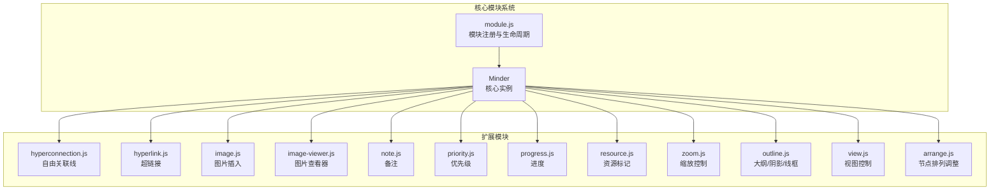

图表来源
- [module.js](file://src/core/module.js#L1-L151)
- [hyperconnection.js](file://src/module/hyperconnection.js#L772-L800)
- [hyperlink.js](file://src/module/hyperlink.js#L1-L127)
- [image.js](file://src/module/image.js#L1-L147)
- [image-viewer.js](file://src/module/image-viewer.js#L1-L111)
- [note.js](file://src/module/note.js#L1-L116)
- [priority.js](file://src/module/priority.js#L1-L156)
- [progress.js](file://src/module/progress.js#L1-L160)
- [resource.js](file://src/module/resource.js#L1-L314)
- [zoom.js](file://src/module/zoom.js#L1-L195)
- [outline.js](file://src/module/outline.js#L1-L165)
- [view.js](file://src/module/view.js#L1-L397)
- [arrange.js](file://src/module/arrange.js#L1-L156)

章节来源
- [module.js](file://src/core/module.js#L1-L151)
- [README.md](file://README.md#L69-L81)

## 核心组件
- 模块注册与生命周期：模块通过 Module.register 注册，核心在初始化阶段收集命令、渲染器与事件，注入到 Minder 实例。
- 命令系统：各模块提供 Command 类型的命令，支持 queryState/queryValue，配合键盘快捷键与上下文菜单。
- 渲染器系统：按位置（left/right/top/bottom/outside/outline 等）注册渲染器，按需绘制节点周边元素。
- 事件驱动：模块通过 events 钩子订阅核心事件（如 selectionchange、layoutallfinish、mousewheel 等）。

章节来源
- [module.js](file://src/core/module.js#L1-L151)

## 架构总览
扩展模块围绕 Minder 核心进行松耦合扩展，通过命令、渲染器与事件三大机制实现功能叠加。

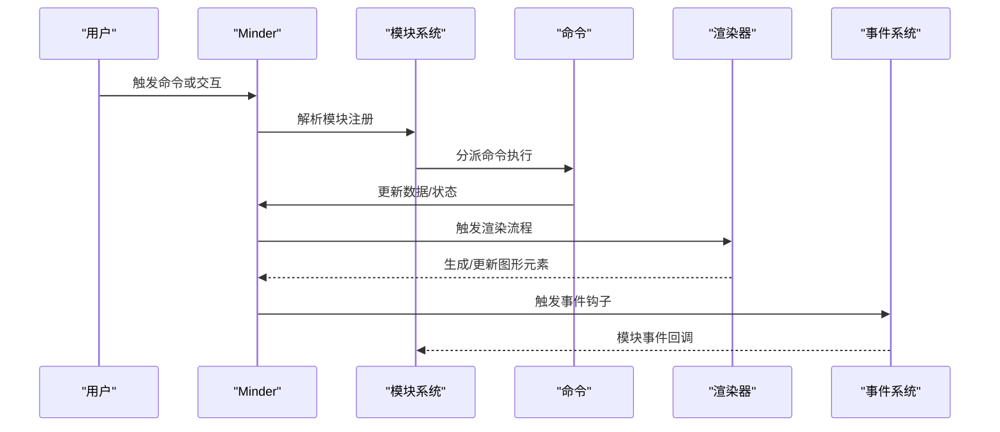

图表来源
- [module.js](file://src/core/module.js#L18-L118)
- [hyperconnection.js](file://src/module/hyperconnection.js#L772-L800)
- [view.js](file://src/module/view.js#L178-L397)

## 详细组件分析

### 自由关联线模块（hyperconnection.js）
- 目标：突破树形结构限制，支持任意节点间建立关联线，提供贝塞尔曲线、控制点拖拽、箭头与文本标注。
- 数据结构
  - 关联线数据：包含起止节点 ID、类型（箭头/直线/虚线）、颜色、线宽、文本、控制点偏移等字段。
- 核心类与职责
  - ControlHandle：控制点手柄，支持拖拽调整曲线形状。
  - TempConnection：拖拽过程中的临时连线，提升交互体验。
  - HyperConnection：渲染器，负责路径绘制、箭头、文本、控制点手柄、事件绑定与更新。
  - 命令：StartHyperConnection、AddHyperConnection、RemoveHyperConnection。
- 关键流程
  - 进入 hyperconnection 模式，记录源节点并创建临时连线。
  - 拖拽悬停目标节点时更新临时连线；松开时创建正式连接并渲染。
  - 支持双击编辑文本、拖拽控制点微调曲线、点击连线选中。
- 与核心集成
  - 在 Minder 上扩展 get/set 渲染容器、批量更新、按节点更新等方法。
  - 通过 Module.register 注册命令与事件，布局完成后统一更新。

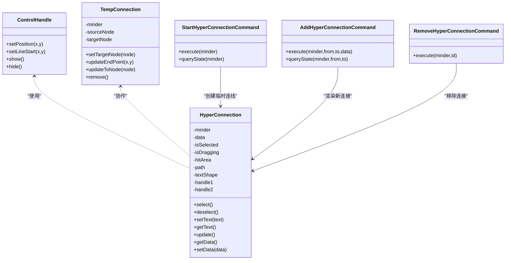

图表来源
- [hyperconnection.js](file://src/module/hyperconnection.js#L32-L210)
- [hyperconnection.js](file://src/module/hyperconnection.js#L212-L567)
- [hyperconnection.js](file://src/module/hyperconnection.js#L570-L767)
- [hyperconnection.js](file://src/module/hyperconnection.js#L769-L800)

章节来源
- [hyperconnection.js](file://src/module/hyperconnection.js#L1-L975)

### 超链接模块（hyperlink.js）
- 目标：为节点添加超链接，支持外部链接跳转与标题提示。
- 数据结构：节点数据中存储 hyperlink/url 与 hyperlinkTitle。
- 渲染器：在节点右侧绘制可点击的链接图标，鼠标悬浮高亮，支持 title 属性。
- 命令：hyperlink，支持设置/查询 URL 与标题，状态根据选中节点数量判定。

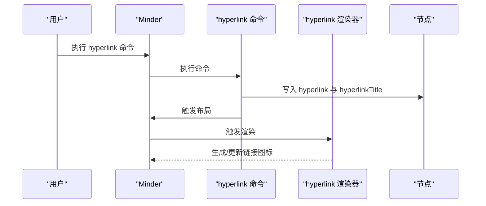

图表来源
- [hyperlink.js](file://src/module/hyperlink.js#L1-L127)

章节来源
- [hyperlink.js](file://src/module/hyperlink.js#L1-L127)

### 多媒体支持模块
#### 图片插入（image.js）
- 目标：在节点顶部插入图片，支持标题与尺寸适配。
- 数据结构：节点数据中存储 image/url、imageTitle、imageSize。
- 渲染器：按节点内容盒居中放置图片，支持 title 属性。
- 命令：image，异步加载图片尺寸，按配置的最大宽高进行适配，触发保存与布局。

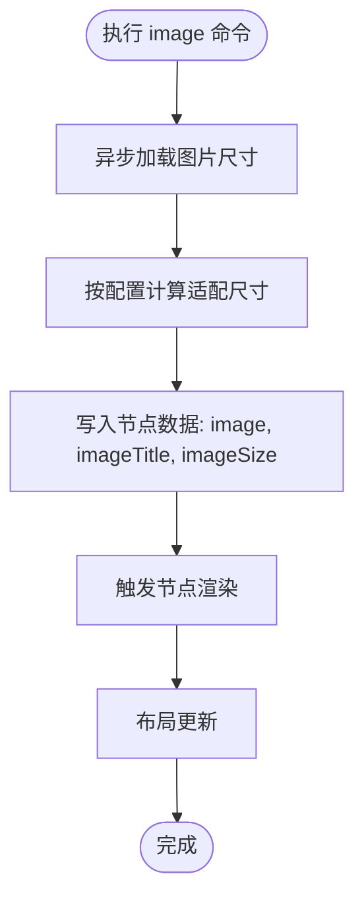

图表来源
- [image.js](file://src/module/image.js#L1-L147)

章节来源
- [image.js](file://src/module/image.js#L1-L147)

#### 图片查看（image-viewer.js）
- 目标：双击节点图片弹出查看器，支持工具栏、缩放、查看源图、ESC 关闭。
- 交互：在 normal.dblclick 事件中检测目标是否为图片形状，若是则打开查看器。
- 视图控制：查看器内部维护状态与 DOM，支持键盘与鼠标交互。

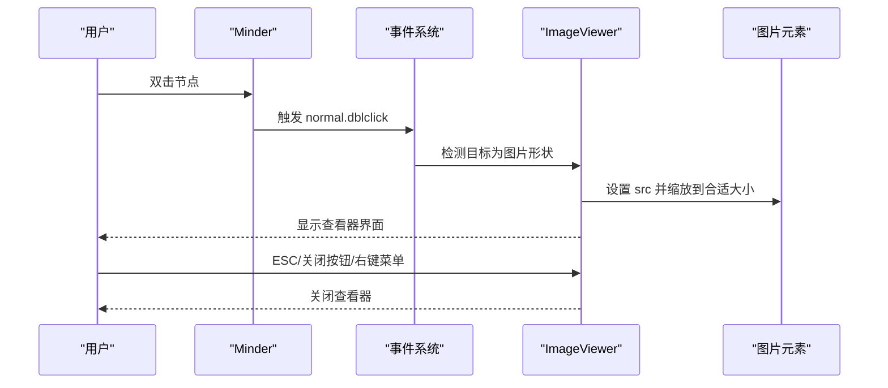

图表来源
- [image-viewer.js](file://src/module/image-viewer.js#L1-L111)

章节来源
- [image-viewer.js](file://src/module/image-viewer.js#L1-L111)

### 信息增强模块
#### 备注（note.js）
- 目标：为节点添加备注图标，支持编辑请求与显示/隐藏请求事件。
- 渲染器：右侧显示注图标，鼠标悬浮高亮，点击触发编辑请求。

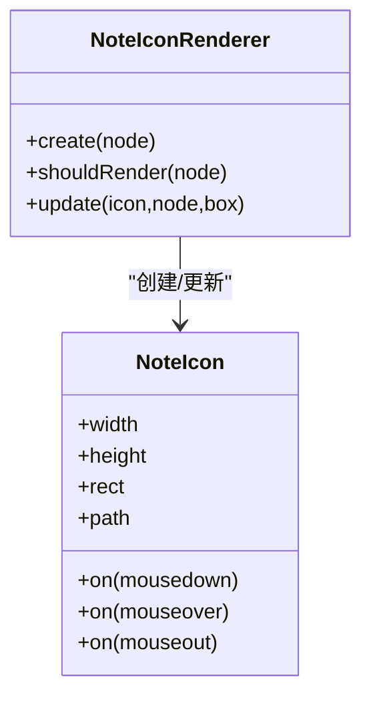

图表来源
- [note.js](file://src/module/note.js#L52-L115)

章节来源
- [note.js](file://src/module/note.js#L1-L116)

#### 优先级（priority.js）
- 目标：为节点左侧添加带数字的彩色优先级徽章，支持 1-9。
- 渲染器：按节点样式与空间计算位置，设置颜色与数值。

章节来源
- [priority.js](file://src/module/priority.js#L1-L156)

#### 进度（progress.js）
- 目标：为节点左侧添加圆形进度徽章，支持 1-9 等分与完成态。
- 渲染器：根据进度值绘制扇形与完成标记。

章节来源
- [progress.js](file://src/module/progress.js#L1-L160)

#### 资源标记（resource.js）
- 目标：为节点右侧添加资源覆盖标签，支持多资源聚合去重。
- 颜色策略：内置颜色序列，资源过多时回退到哈希生成颜色；提供获取已用资源列表。
- 渲染器：按节点右侧空间依次排列覆盖标签，支持 title 提示。

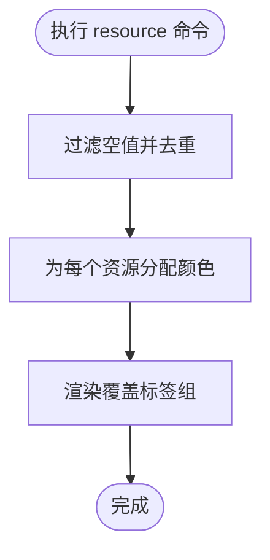

图表来源
- [resource.js](file://src/module/resource.js#L1-L314)

章节来源
- [resource.js](file://src/module/resource.js#L1-L314)

### 交互增强模块
#### 缩放控制（zoom.js）
- 目标：提供缩放命令与滚轮缩放，支持动画与比例等级栈。
- 命令：zoom、zoomin、zoomout；支持只读模式启用。
- 事件：监听 mousewheel，按 Ctrl/Cmd 键切换；支持快捷键。

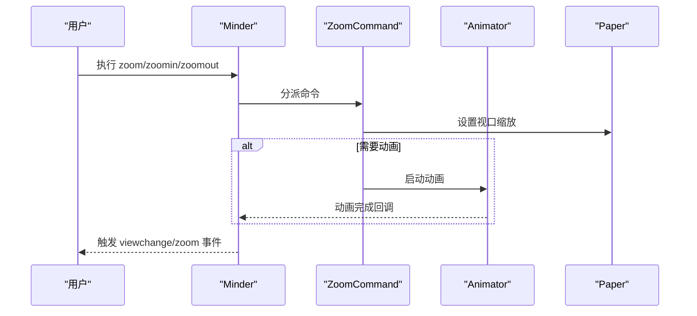

图表来源
- [zoom.js](file://src/module/zoom.js#L1-L195)

章节来源
- [zoom.js](file://src/module/zoom.js#L1-L195)

#### 大纲模式（outline.js）
- 目标：为节点绘制外轮廓与阴影，支持圆形节点的半径计算；可选线框渲染辅助调试。
- 渲染器：OutlineRenderer、ShadowRenderer、WireframeRenderer（条件启用）。

章节来源
- [outline.js](file://src/module/outline.js#L1-L165)

#### 视图控制（view.js）
- 目标：抓手拖拽视图、相机定位到节点、方向移动视图。
- 核心：ViewDragger 管理拖拽状态与位移，支持动画与边界约束；命令：hand、camera、move。
- 事件：statuschange、mousewheel、dblclick、resize、selectionchange、layoutallfinish。

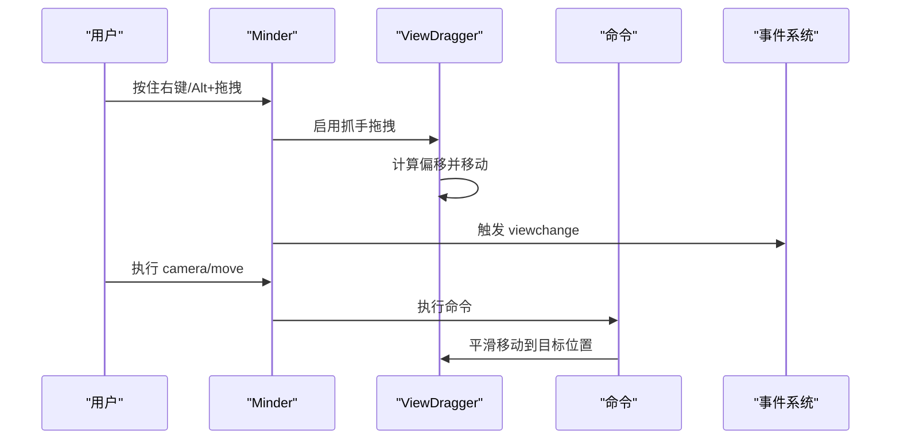

图表来源
- [view.js](file://src/module/view.js#L1-L397)

章节来源
- [view.js](file://src/module/view.js#L1-L397)

#### 节点排列调整（arrange.js）
- 目标：在同一父节点内调整子节点顺序，支持向上、向下与直接定位。
- 命令：arrangeup、arrangedown、arrange；支持 Alt+方向键快捷键与上下文菜单。

章节来源
- [arrange.js](file://src/module/arrange.js#L1-L156)

## 依赖关系分析
- 模块系统与核心耦合点
  - 模块通过 Module.register 注册，核心在初始化阶段收集命令、渲染器与事件，注入到 Minder。
  - Minder 扩展方法（如 get/set 渲染容器、批量更新）用于模块内部协作。
- 模块间依赖
  - 多数模块仅依赖核心工具与渲染框架，彼此低耦合，通过事件与命令间接协作。
  - image-viewer 依赖 view 事件（dblclick）触发打开。
  - hyperconnection 依赖 minder 的节点查找与渲染容器。
- 外部依赖
  - 图形引擎：Kity（SVG）
  - 模块加载：SeaJS（通过 define/require）

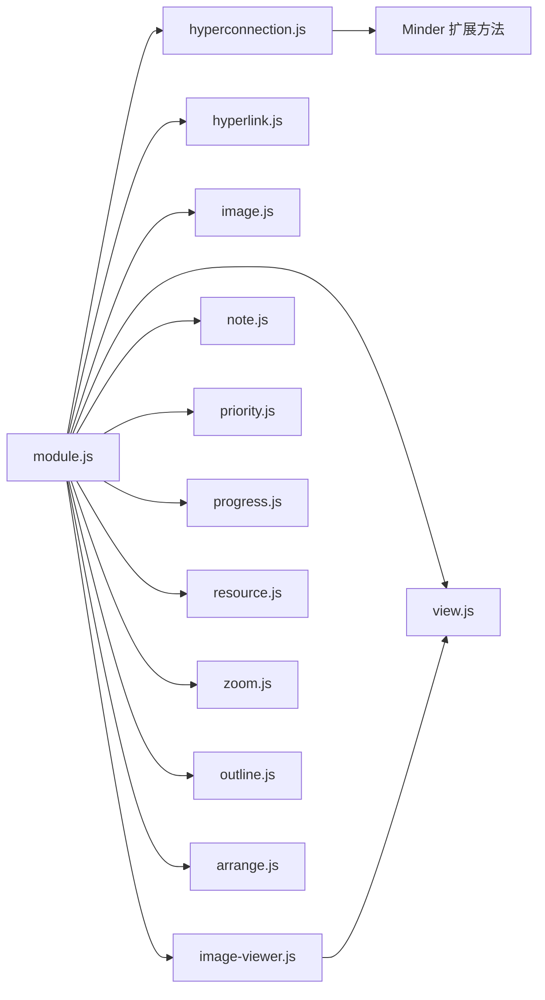

图表来源
- [module.js](file://src/core/module.js#L18-L118)
- [hyperconnection.js](file://src/module/hyperconnection.js#L769-L787)
- [image-viewer.js](file://src/module/image-viewer.js#L97-L111)
- [view.js](file://src/module/view.js#L178-L397)

章节来源
- [module.js](file://src/core/module.js#L1-L151)

## 性能考量
- 渲染优化
  - 控制点拖拽与临时连线采用轻量路径更新，避免频繁重排。
  - 图片插入采用异步加载与尺寸适配，减少阻塞。
  - 缩放动画在节点复杂度较高时禁用，降低重绘压力。
- 事件节流
  - 滚轮缩放使用定时器稀释事件频率，避免频繁触发。
- 布局联动
  - 关联线与节点更新通过统一的批量更新方法，减少重复计算。

[本节为通用建议，无需特定文件来源]

## 故障排查指南
- 自由关联线无法创建
  - 检查是否处于 hyperconnection 模式或已选中源节点。
  - 确认目标节点与源节点不同，且未重复创建相同连接。
- 图片不显示
  - 确认 URL 可访问且未被跨域限制；检查 maxImageWidth/Height 配置。
- 超链接无效
  - 确认 URL 协议合法（http/https/ftp/mailto 等）；检查节点是否选中。
- 缩放无响应
  - 检查是否按住 Ctrl/Cmd；确认 zoom 配置比例栈是否正确。
- 视图拖拽无效
  - 确认状态为 hand；检查右键拖拽是否被浏览器拦截。
- 资源颜色异常
  - 资源过多时会回退到哈希颜色；可通过清理资源或增加颜色序列解决。

章节来源
- [hyperconnection.js](file://src/module/hyperconnection.js#L570-L767)
- [image.js](file://src/module/image.js#L52-L95)
- [hyperlink.js](file://src/module/hyperlink.js#L27-L61)
- [zoom.js](file://src/module/zoom.js#L149-L194)
- [view.js](file://src/module/view.js#L178-L397)
- [resource.js](file://src/module/resource.js#L1-L314)

## 结论
扩展功能模块通过统一的模块系统与命令/渲染器/事件机制，实现了对思维导图的高级增强。它们与核心保持低耦合，既保证了功能的可插拔性，也为二次开发与定制提供了清晰的扩展点。开发者可基于现有模块快速构建符合业务需求的增强能力。

[本节为总结，无需特定文件来源]

## 附录
- 模块注册与生命周期关键点
  - 模块通过 Module.register 注册，核心在初始化阶段收集命令、渲染器与事件。
  - 模块可提供 defaultOptions、init、events、renderers、commands、commandShortcutKeys 等入口。
- 常用命令状态
  - queryState 返回 0 表示可用，-1 表示不可用；queryValue 返回当前值。
- 渲染器位置
  - left/right/top/bottom/outside/outline 等位置用于控制周边元素布局。

章节来源
- [module.js](file://src/core/module.js#L18-L118)
- [hyperlink.js](file://src/module/hyperlink.js#L27-L61)
- [priority.js](file://src/module/priority.js#L95-L156)
- [progress.js](file://src/module/progress.js#L90-L160)
- [resource.js](file://src/module/resource.js#L143-L314)
- [note.js](file://src/module/note.js#L24-L51)
- [outline.js](file://src/module/outline.js#L147-L165)
- [view.js](file://src/module/view.js#L178-L397)
- [arrange.js](file://src/module/arrange.js#L34-L156)