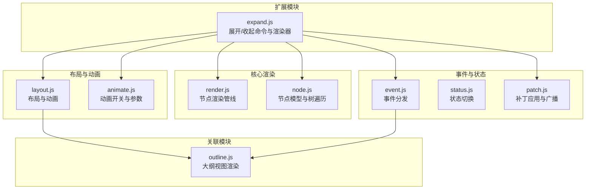
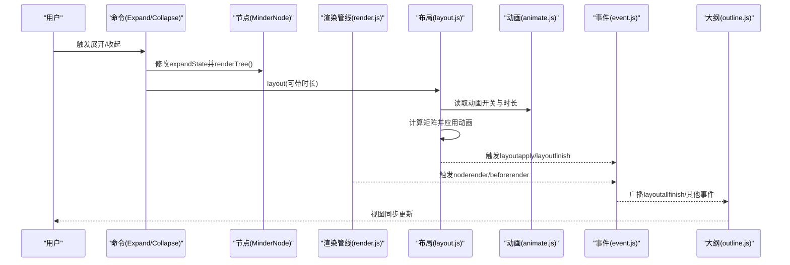
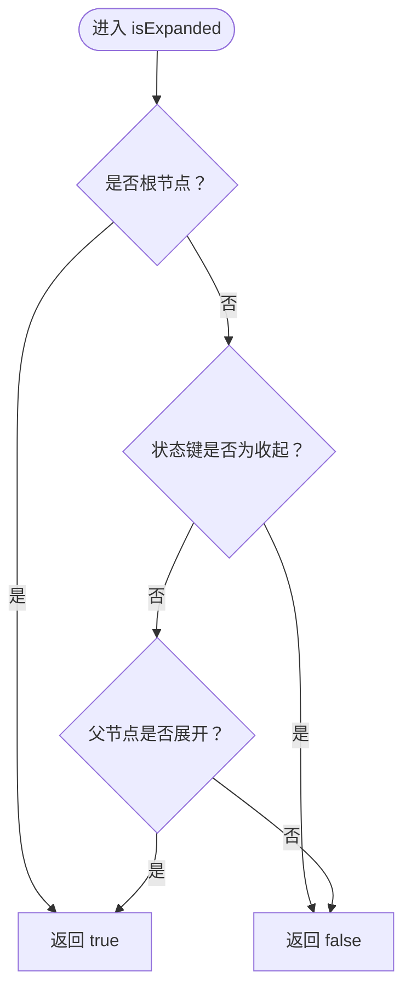
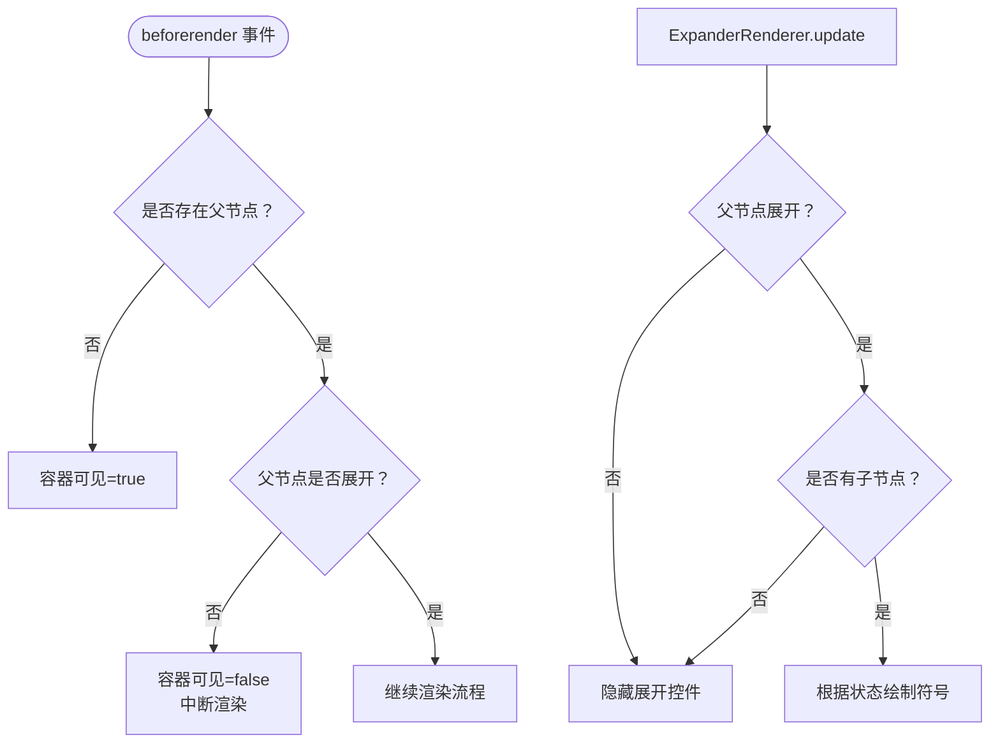
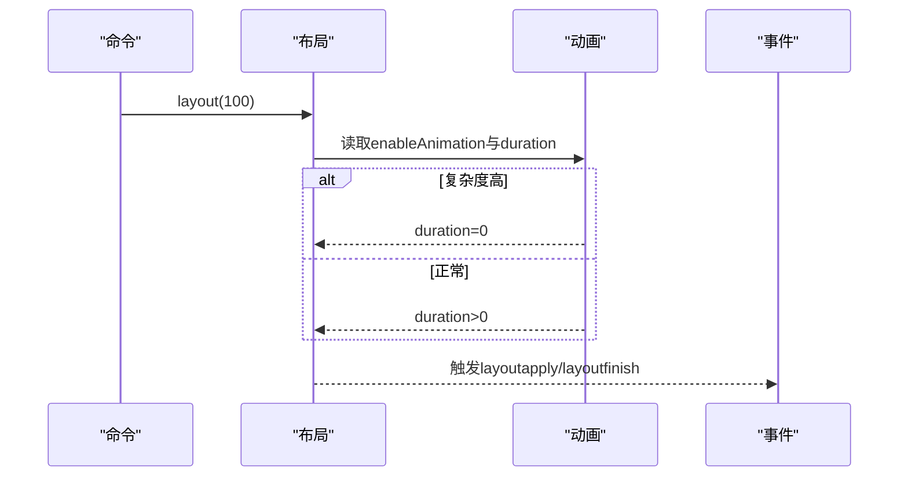
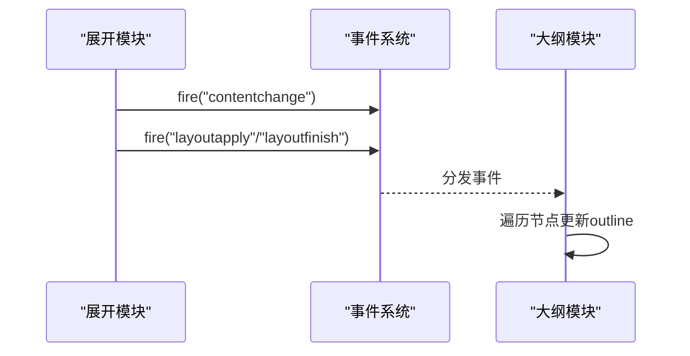
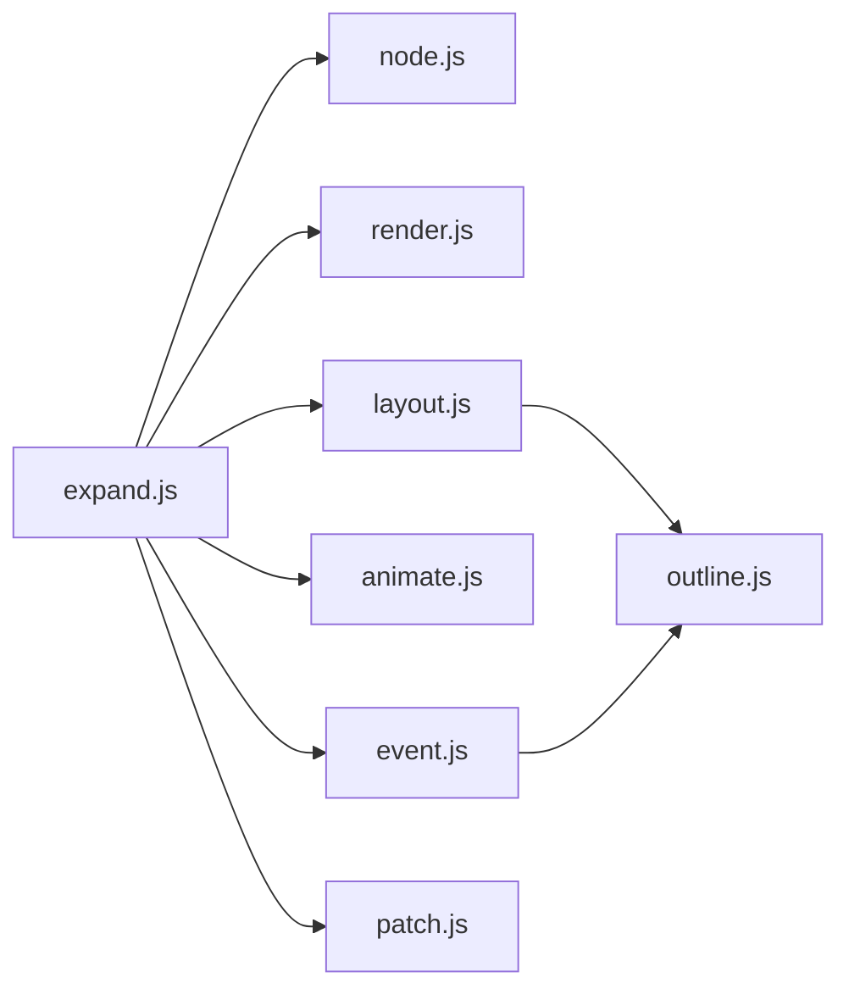

# 展开收起控制

<cite>
**本文引用的文件**
- [src/module/expand.js](file://src/module/expand.js)
- [src/core/render.js](file://src/core/render.js)
- [src/core/node.js](file://src/core/node.js)
- [src/core/layout.js](file://src/core/layout.js)
- [src/core/animate.js](file://src/core/animate.js)
- [src/core/patch.js](file://src/core/patch.js)
- [src/core/event.js](file://src/core/event.js)
- [src/core/status.js](file://src/core/status.js)
- [src/module/outline.js](file://src/module/outline.js)
</cite>

## 目录
1. [简介](#简介)
2. [项目结构](#项目结构)
3. [核心组件](#核心组件)
4. [架构总览](#架构总览)
5. [详细组件分析](#详细组件分析)
6. [依赖关系分析](#依赖关系分析)
7. [性能考量](#性能考量)
8. [故障排查指南](#故障排查指南)
9. [结论](#结论)
10. [附录](#附录)

## 简介
本篇文档围绕“节点展开/收起”功能进行深入剖析，重点说明以下方面：
- 展开状态（isExpanded）在节点数据层的管理方式
- 状态变更时对子节点显隐的控制逻辑
- 与动画系统（animate.js）的集成，包括布局动画时长、视图动画时长等参数
- 状态广播机制如何驱动关联模块（如大纲视图）同步更新
- 大规模子树展开时的性能优化策略（复杂度阈值、动画禁用）
- 通过命令 API 批量展开/收起节点的方法与默认展开层级初始化配置
- 常见状态不同步或动画卡顿问题及调试方法

## 项目结构
展开/收起功能由扩展模块（expand.js）主导，配合渲染管线（render.js）、节点模型（node.js）、布局系统（layout.js）、动画开关（animate.js）以及事件系统（event.js）共同完成。大纲视图（outline.js）作为关联模块之一，响应布局完成事件进行同步更新。

图表来源
- [src/module/expand.js](file://src/module/expand.js#L1-L294)
- [src/core/render.js](file://src/core/render.js#L1-L261)
- [src/core/node.js](file://src/core/node.js#L1-L407)
- [src/core/layout.js](file://src/core/layout.js#L450-L524)
- [src/core/animate.js](file://src/core/animate.js#L1-L43)
- [src/core/patch.js](file://src/core/patch.js#L43-L110)
- [src/core/event.js](file://src/core/event.js#L209-L249)
- [src/core/status.js](file://src/core/status.js#L1-L45)
- [src/module/outline.js](file://src/module/outline.js#L1-L165)

章节来源
- [src/module/expand.js](file://src/module/expand.js#L1-L294)
- [src/core/render.js](file://src/core/render.js#L1-L261)
- [src/core/node.js](file://src/core/node.js#L1-L407)
- [src/core/layout.js](file://src/core/layout.js#L450-L524)
- [src/core/animate.js](file://src/core/animate.js#L1-L43)
- [src/core/patch.js](file://src/core/patch.js#L43-L110)
- [src/core/event.js](file://src/core/event.js#L209-L249)
- [src/core/status.js](file://src/core/status.js#L1-L45)
- [src/module/outline.js](file://src/module/outline.js#L1-L165)

## 核心组件
- 节点状态管理：通过节点数据存储展开状态键值，提供展开/收起与状态查询方法。
- 展开命令：支持展开到当前选中节点、仅展开父链、按层级展开等。
- 展开渲染器：在节点外部绘制展开/收起控件，并根据父节点展开状态决定可见性。
- 渲染管线：统一调度节点渲染，按渲染器顺序执行创建/更新/定位。
- 布局系统：负责节点位置与矩阵变换，支持动画过渡与复杂度阈值降级。
- 动画系统：提供全局动画开关与默认时长配置。
- 事件广播：通过 contentchange、layoutapply 等事件通知关联模块同步更新。

章节来源
- [src/module/expand.js](file://src/module/expand.js#L1-L294)
- [src/core/render.js](file://src/core/render.js#L1-L261)
- [src/core/layout.js](file://src/core/layout.js#L450-L524)
- [src/core/animate.js](file://src/core/animate.js#L1-L43)

## 架构总览
展开/收起流程的关键路径如下：
- 用户交互或快捷键触发命令，命令修改节点状态并调用渲染树与布局。
- 渲染管线根据节点状态决定是否显示节点容器与渲染器。
- 布局系统在动画时长内逐节点应用矩阵变换，并在完成时发出事件。
- 动画系统提供全局开关与默认时长，布局系统据此选择是否启用动画。
- 事件系统广播 contentchange、layoutapply 等事件，关联模块（如大纲视图）监听并更新。

图表来源
- [src/module/expand.js](file://src/module/expand.js#L62-L127)
- [src/core/render.js](file://src/core/render.js#L165-L219)
- [src/core/layout.js](file://src/core/layout.js#L450-L524)
- [src/core/animate.js](file://src/core/animate.js#L1-L43)
- [src/core/patch.js](file://src/core/patch.js#L43-L110)
- [src/module/outline.js](file://src/module/outline.js#L147-L165)

## 详细组件分析

### 节点展开状态管理（isExpanded）
- 状态键值：使用节点数据存储展开状态键，区分展开与收起两种状态。
- 状态判定规则：
  - 若节点未设置为收起，则视为展开；
  - 根节点始终视为展开；
  - 子节点必须父节点也处于展开状态才可视。
- 关键方法：
  - 展开/收起：写入状态键值；
  - isExpanded/isCollapsed：基于状态键与父链展开状态综合判断。

图表来源
- [src/module/expand.js](file://src/module/expand.js#L17-L50)
- [src/core/node.js](file://src/core/node.js#L48-L59)

章节来源
- [src/module/expand.js](file://src/module/expand.js#L17-L50)
- [src/core/node.js](file://src/core/node.js#L48-L59)

### 子节点显隐控制逻辑
- 渲染前事件（beforerender）：
  - 根据父节点展开状态决定当前节点容器可见性；
  - 不可见时中断后续渲染流程，避免无效绘制。
- 展开渲染器（ExpanderRenderer）：
  - 仅非根节点显示；
  - 可见性取决于父节点展开状态与自身是否有子节点；
  - 根据节点展开状态绘制加号/减号符号。

图表来源
- [src/module/expand.js](file://src/module/expand.js#L219-L244)
- [src/module/expand.js](file://src/module/expand.js#L176-L204)

章节来源
- [src/module/expand.js](file://src/module/expand.js#L176-L204)
- [src/module/expand.js](file://src/module/expand.js#L219-L244)

### 与动画系统的集成
- 动画开关与默认参数：
  - 默认开启动画，提供布局动画时长、视图动画时长、缩放动画时长等参数；
  - 可通过全局开关禁用/启用动画。
- 布局动画：
  - 布局系统在应用矩阵时根据复杂度阈值自动降级为无动画；
  - 使用时间轴动画在指定时长内插值过渡，并在完成后触发 finish 事件。
- 视图联动：
  - 展开/收起命令在渲染后调用布局，传入动画时长；
  - contentchange 事件用于通知关联模块刷新。

图表来源
- [src/core/animate.js](file://src/core/animate.js#L1-L43)
- [src/core/layout.js](file://src/core/layout.js#L450-L524)
- [src/module/expand.js](file://src/module/expand.js#L62-L127)

章节来源
- [src/core/animate.js](file://src/core/animate.js#L1-L43)
- [src/core/layout.js](file://src/core/layout.js#L450-L524)
- [src/module/expand.js](file://src/module/expand.js#L62-L127)

### 状态广播与关联模块同步
- contentchange 事件：
  - 展开/收起命令与补丁应用均会触发 contentchange，通知视图层刷新。
- layoutapply/layoutfinish 事件：
  - 布局系统在应用矩阵前后触发，供渲染器与关联模块更新。
- 大纲视图（outline.js）：
  - 监听布局完成事件，遍历根节点树更新 outline 渲染器。

图表来源
- [src/module/expand.js](file://src/module/expand.js#L145-L155)
- [src/core/patch.js](file://src/core/patch.js#L43-L110)
- [src/core/event.js](file://src/core/event.js#L209-L249)
- [src/module/outline.js](file://src/module/outline.js#L147-L165)

章节来源
- [src/module/expand.js](file://src/module/expand.js#L145-L155)
- [src/core/patch.js](file://src/core/patch.js#L43-L110)
- [src/core/event.js](file://src/core/event.js#L209-L249)
- [src/module/outline.js](file://src/module/outline.js#L147-L165)

### 批量展开/收起与默认展开层级
- 批量展开/收起：
  - 快捷键触发：对当前选中节点集合逐一展开/收起并渲染整棵树；
  - 命令：支持仅展开到父链或展开到指定层级。
- 默认展开层级：
  - 提供“展开到层级”的命令，可在初始化或导入数据后设置默认展开层级；
  - 通过快捷键 Alt+数字快速切换层级。

章节来源
- [src/module/expand.js](file://src/module/expand.js#L227-L251)
- [src/module/expand.js](file://src/module/expand.js#L85-L102)

## 依赖关系分析
- 模块耦合：
  - expand.js 依赖 node.js 的数据访问与树遍历能力；
  - 依赖 render.js 的渲染树与批量渲染；
  - 依赖 layout.js 的布局与动画；
  - 依赖 animate.js 的全局动画参数；
  - 依赖 event.js 的事件分发；
  - 依赖 patch.js 的补丁应用与广播。
- 关联模块：
  - outline.js 通过布局事件驱动同步更新。

图表来源
- [src/module/expand.js](file://src/module/expand.js#L1-L294)
- [src/core/render.js](file://src/core/render.js#L1-L261)
- [src/core/layout.js](file://src/core/layout.js#L450-L524)
- [src/core/animate.js](file://src/core/animate.js#L1-L43)
- [src/core/patch.js](file://src/core/patch.js#L43-L110)
- [src/module/outline.js](file://src/module/outline.js#L147-L165)

## 性能考量
- 复杂度阈值降级：
  - 当节点复杂度超过阈值时，布局系统自动禁用动画，避免卡顿。
- 批量渲染：
  - renderTree 采用批量渲染，减少重复创建与更新成本。
- 延迟渲染与可见性短路：
  - beforerender 中根据父节点展开状态提前隐藏不可见容器，避免无效绘制。
- 动画时长配置：
  - 通过动画模块统一配置布局/视图/缩放动画时长，必要时可整体禁用动画。

章节来源
- [src/core/layout.js](file://src/core/layout.js#L450-L524)
- [src/core/render.js](file://src/core/render.js#L165-L219)
- [src/core/animate.js](file://src/core/animate.js#L1-L43)

## 故障排查指南
- 症状：展开/收起后子节点不显示
  - 排查：确认父节点 isExpanded 返回值；检查 beforerender 是否被中断；检查 ExpanderRenderer 的可见性条件。
  - 参考路径：[beforerender 事件](file://src/module/expand.js#L219-L244)，[渲染器可见性](file://src/module/expand.js#L176-L204)
- 症状：动画卡顿或无动画
  - 排查：检查全局动画开关与各动画时长；查看布局复杂度是否超过阈值导致禁用动画。
  - 参考路径：[动画开关](file://src/core/animate.js#L1-L43)，[复杂度降级](file://src/core/layout.js#L450-L524)
- 症状：大纲视图未同步更新
  - 排查：确认布局完成事件是否触发；检查 outline 模块是否监听 layoutfinish 或 layoutallfinish。
  - 参考路径：[事件分发](file://src/core/event.js#L209-L249)，[大纲监听](file://src/module/outline.js#L147-L165)
- 症状：contentchange 未触发
  - 排查：确认命令执行链中是否调用 fire('contentchange')；补丁应用是否触发。
  - 参考路径：[命令触发](file://src/module/expand.js#L145-L155)，[补丁广播](file://src/core/patch.js#L43-L110)

章节来源
- [src/module/expand.js](file://src/module/expand.js#L145-L155)
- [src/core/patch.js](file://src/core/patch.js#L43-L110)
- [src/core/event.js](file://src/core/event.js#L209-L249)
- [src/module/outline.js](file://src/module/outline.js#L147-L165)
- [src/core/animate.js](file://src/core/animate.js#L1-L43)
- [src/core/layout.js](file://src/core/layout.js#L450-L524)

## 结论
展开/收起功能通过“状态键 + 父链可见性 + 渲染短路 + 布局动画 + 事件广播”的组合实现，既保证了交互体验，又兼顾了大规模树的性能。动画系统提供全局可控的时长与开关，布局系统在复杂度高时自动降级，确保流畅性。关联模块（如大纲视图）通过事件驱动保持同步更新。

## 附录
- API 一览（命令）
  - 展开当前选中节点：expand
  - 收起当前节点子树：collapse
  - 展开到指定层级：expandtolevel(level)
  - 快捷键：斜杠键切换当前选中节点集合的展开/收起；Alt+` 展开到最深层；Alt+1~5 展开到对应层级
- 初始化与默认展开层级
  - 可通过命令在初始化后设置默认展开层级，或在导入数据后批量设置
- 动画参数参考
  - enableAnimation、layoutAnimationDuration、viewAnimationDuration、zoomAnimationDuration

章节来源
- [src/module/expand.js](file://src/module/expand.js#L52-L102)
- [src/module/expand.js](file://src/module/expand.js#L227-L251)
- [src/core/animate.js](file://src/core/animate.js#L1-L43)