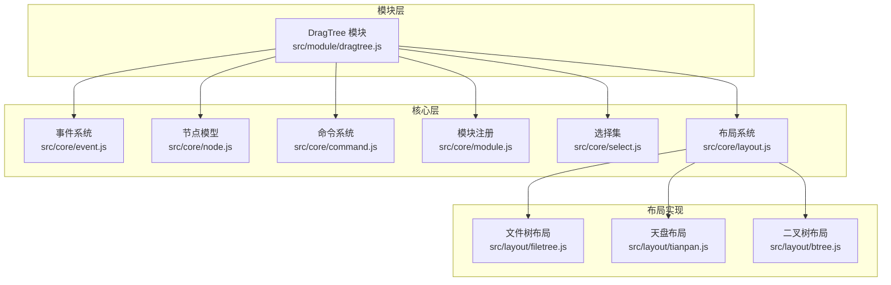
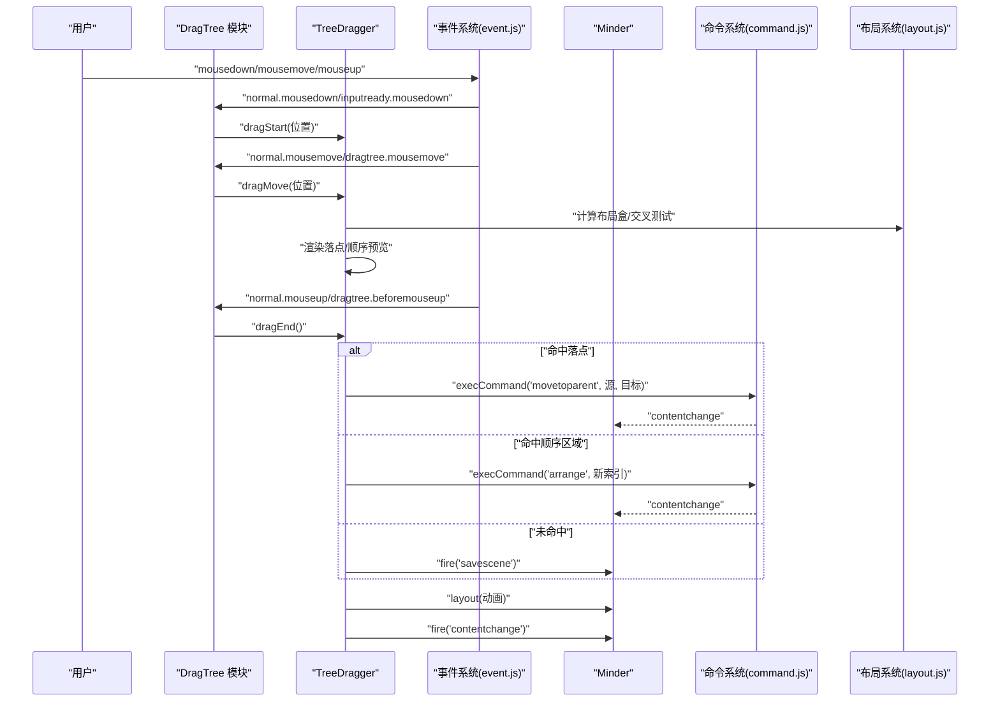
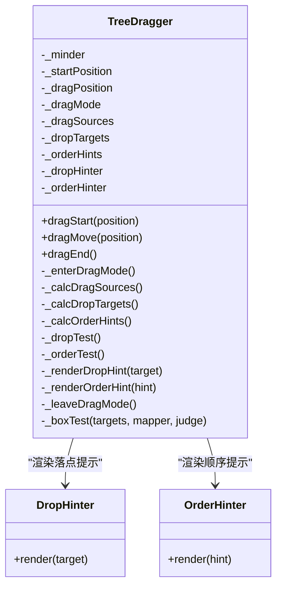
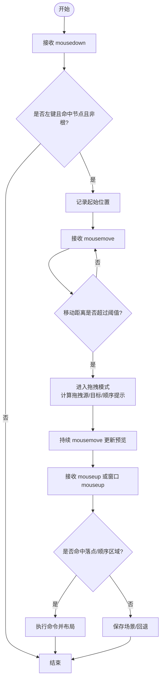
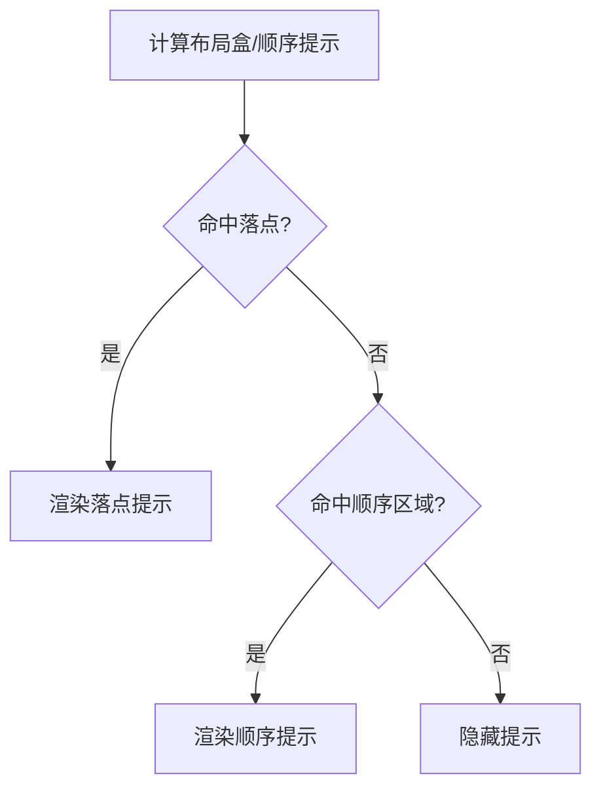
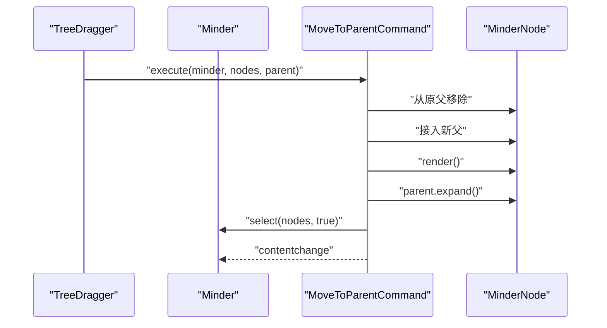
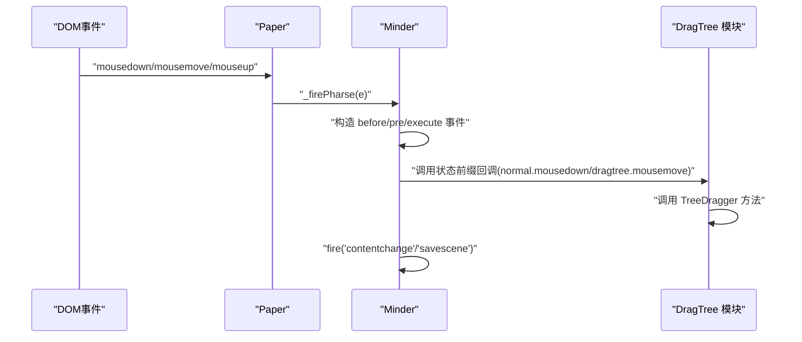
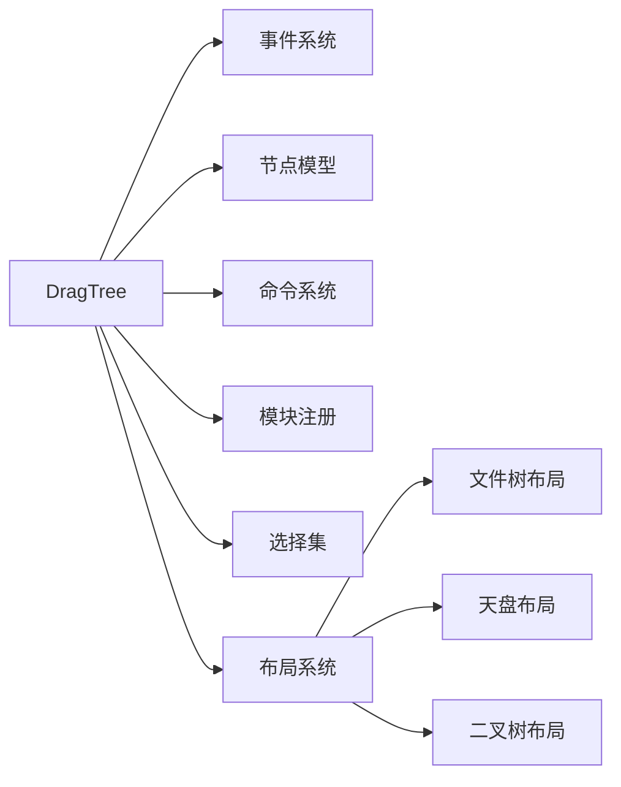

# 拖拽排序

<cite>
**本文引用的文件**
- [dragtree.js](file://src/module/dragtree.js)
- [event.js](file://src/core/event.js)
- [node.js](file://src/core/node.js)
- [command.js](file://src/core/command.js)
- [module.js](file://src/core/module.js)
- [select.js](file://src/core/select.js)
- [layout.js](file://src/core/layout.js)
- [filetree.js](file://src/layout/filetree.js)
- [tianpan.js](file://src/layout/tianpan.js)
- [btree.js](file://src/layout/btree.js)
</cite>

## 目录
1. [简介](#简介)
2. [项目结构](#项目结构)
3. [核心组件](#核心组件)
4. [架构总览](#架构总览)
5. [详细组件分析](#详细组件分析)
6. [依赖分析](#依赖分析)
7. [性能考量](#性能考量)
8. [故障排查指南](#故障排查指南)
9. [结论](#结论)
10. [附录](#附录)

## 简介
本文件系统性解析拖拽排序模块的工作原理，重点覆盖：
- 鼠标/触摸手势的监听与识别机制
- 拖拽过程中的插入位置实时预览效果
- 父子关系变更时的树结构重组逻辑（节点脱离原父节点、插入新位置、数据模型更新的原子操作）
- 拖拽事件与核心事件系统（event.js）的通信流程
- 拖拽过程中的DOM类名控制与样式切换
- 自定义拖拽约束条件的扩展接口（如限制只能同级拖拽或禁止跨层级移动）
- 拖拽失败的常见原因与解决方案（事件冲突、Z-index遮挡等）

## 项目结构
拖拽排序功能位于模块目录下，核心文件如下：
- 模块入口与拖拽逻辑：src/module/dragtree.js
- 事件系统：src/core/event.js
- 节点模型与树操作：src/core/node.js
- 命令系统与执行：src/core/command.js
- 模块注册与生命周期：src/core/module.js
- 选择集与祖先节点计算：src/core/select.js
- 布局系统与预览盒：src/core/layout.js
- 布局实现（文件树、天盘、二叉树）：src/layout/filetree.js、src/layout/tianpan.js、src/layout/btree.js

图表来源
- [dragtree.js](file://src/module/dragtree.js#L1-L405)
- [event.js](file://src/core/event.js#L1-L270)
- [node.js](file://src/core/node.js#L1-L407)
- [command.js](file://src/core/command.js#L1-L169)
- [module.js](file://src/core/module.js#L1-L151)
- [select.js](file://src/core/select.js#L43-L146)
- [layout.js](file://src/core/layout.js#L156-L523)
- [filetree.js](file://src/layout/filetree.js#L35-L71)
- [tianpan.js](file://src/layout/tianpan.js#L39-L76)
- [btree.js](file://src/layout/btree.js#L1-L143)

章节来源
- [dragtree.js](file://src/module/dragtree.js#L1-L405)
- [module.js](file://src/core/module.js#L1-L151)

## 核心组件
- TreeDragger：拖拽控制器，负责手势识别、拖拽模式切换、拖拽源与目标计算、预览渲染、父子关系变更与命令执行。
- MoveToParentCommand：将节点移动到新父节点的命令，原子地完成脱离原父、接入新父、渲染与展开。
- DropHinter/OrderHinter：拖拽落点与同级顺序预览的视觉提示。
- 事件系统：统一派发与拦截原生事件，支持状态前缀事件与传播控制。
- 选择集：计算“选中节点的祖先集合”，用于确定拖拽源。
- 布局系统：提供节点布局盒、布局偏移、布局应用与顺序提示区域。

章节来源
- [dragtree.js](file://src/module/dragtree.js#L1-L405)
- [event.js](file://src/core/event.js#L1-L270)
- [select.js](file://src/core/select.js#L43-L146)
- [layout.js](file://src/core/layout.js#L156-L523)

## 架构总览
拖拽排序的整体流程：
- 模块初始化：注册事件监听（mousedown/mousemove/mouseup），绑定窗口级mouseup收尾
- 手势识别：记录起始点，达到阈值后进入拖拽模式
- 拖拽源与目标：基于选择集祖先集合计算拖拽源；基于布局盒与交叉面积计算可放置目标
- 预览渲染：根据命中结果渲染落点矩形或上下插入区域
- 结束阶段：若命中落点则执行“移动到父”命令；若命中同级顺序区域则执行“排列”命令；否则回退

图表来源
- [dragtree.js](file://src/module/dragtree.js#L368-L405)
- [event.js](file://src/core/event.js#L144-L182)
- [command.js](file://src/core/command.js#L109-L166)
- [layout.js](file://src/core/layout.js#L458-L520)

## 详细组件分析

### TreeDragger：拖拽控制器
职责与关键方法：
- 初始化：在渲染容器中挂载落点与顺序提示图形
- 拖拽模式：记录起始位置；达到阈值后进入拖拽模式，计算拖拽源、可放置目标、同级顺序提示
- 实时预览：通过布局盒相交测试决定落点或顺序区域，并渲染相应提示
- 结束处理：根据命中结果执行命令或回退；清理状态与提示

图表来源
- [dragtree.js](file://src/module/dragtree.js#L73-L171)
- [dragtree.js](file://src/module/dragtree.js#L26-L71)

章节来源
- [dragtree.js](file://src/module/dragtree.js#L73-L171)
- [dragtree.js](file://src/module/dragtree.js#L173-L276)
- [dragtree.js](file://src/module/dragtree.js#L278-L366)

### 手势监听与识别机制
- 模块事件绑定：在 normal 与 dragtree 状态下分别监听 mousedown/mousemove/mouseup
- 起始判定：仅当命中节点且非根节点时才开始拖拽；记录起始位置
- 拖拽阈值：移动距离小于阈值不进入拖拽模式
- 窗口级收尾：在窗口级别监听 mouseup，确保拖拽结束

图表来源
- [dragtree.js](file://src/module/dragtree.js#L368-L405)
- [dragtree.js](file://src/module/dragtree.js#L91-L122)

章节来源
- [dragtree.js](file://src/module/dragtree.js#L368-L405)

### 插入位置的实时预览
- 落点预览（DropHinter）：基于目标节点布局盒绘制矩形描边，颜色与宽度来自节点样式
- 顺序预览（OrderHinter）：基于布局实现提供的顺序提示区域绘制填充矩形与路径线段
- 交叉测试：采用面积阈值与边重合条件综合判断是否命中

图表来源
- [dragtree.js](file://src/module/dragtree.js#L26-L71)
- [dragtree.js](file://src/module/dragtree.js#L321-L366)
- [layout.js](file://src/core/layout.js#L156-L168)
- [filetree.js](file://src/layout/filetree.js#L35-L71)
- [tianpan.js](file://src/layout/tianpan.js#L39-L76)
- [btree.js](file://src/layout/btree.js#L1-L143)

章节来源
- [dragtree.js](file://src/module/dragtree.js#L26-L71)
- [dragtree.js](file://src/module/dragtree.js#L321-L366)
- [layout.js](file://src/core/layout.js#L156-L168)

### 父子关系变更与树结构重组
- 命令 MoveToParentCommand：逐个节点从原父移除、接入新父、渲染、展开父节点，并保持选中状态
- 节点模型 MinderNode：提供插入/删除子节点、设置父节点、重置根节点等能力
- 布局偏移：拖拽过程中通过布局偏移临时改变节点位置，结束后统一清空并重新布局

图表来源
- [dragtree.js](file://src/module/dragtree.js#L9-L24)
- [node.js](file://src/core/node.js#L199-L231)
- [command.js](file://src/core/command.js#L109-L166)

章节来源
- [dragtree.js](file://src/module/dragtree.js#L9-L24)
- [node.js](file://src/core/node.js#L199-L231)

### 拖拽事件与核心事件系统的通信
- 事件分发：Minder 统一绑定画布与窗口事件，派发 before/pre/execute/after 阶段事件
- 状态前缀：模块事件名支持“状态.事件名”，如 dragtree.mousemove
- 传播控制：MinderEvent 支持 stopPropagation/stopPropagationImmediately 与 preventDefault
- 模块注册：模块在 init 中注册事件回调，命令在 commands 中注册

图表来源
- [event.js](file://src/core/event.js#L144-L182)
- [event.js](file://src/core/event.js#L194-L231)
- [dragtree.js](file://src/module/dragtree.js#L368-L405)

章节来源
- [event.js](file://src/core/event.js#L1-L270)
- [module.js](file://src/core/module.js#L83-L117)

### 拖拽过程中的DOM类名控制与样式切换
- 透明度与分离：拖拽时降低拖拽源透明度并从渲染容器中分离，避免与目标节点重叠造成视觉干扰
- 提示样式：落点提示与顺序提示的颜色、宽度、透明度均来自节点样式属性
- 状态切换：进入/退出拖拽模式时切换状态，影响事件绑定与UI反馈

章节来源
- [dragtree.js](file://src/module/dragtree.js#L173-L214)
- [dragtree.js](file://src/module/dragtree.js#L356-L366)
- [node.js](file://src/core/node.js#L377-L398)

### 自定义拖拽约束条件的扩展接口
- 限制只能同级拖拽：在计算顺序提示时，仅保留与拖拽源同一父节点的兄弟节点提示区域
- 禁止跨层级移动：在计算可放置目标时，过滤掉非同层级的目标节点
- 自定义交叉判定：通过覆写 _boxTest 的 judge 参数，调整面积阈值或边重合策略
- 自定义提示样式：通过节点样式属性控制提示颜色与宽度

章节来源
- [dragtree.js](file://src/module/dragtree.js#L190-L214)
- [dragtree.js](file://src/module/dragtree.js#L217-L245)
- [dragtree.js](file://src/module/dragtree.js#L292-L320)

## 依赖分析
- 模块依赖：DragTree 依赖事件系统、节点模型、命令系统、模块注册、选择集、布局系统
- 事件耦合：模块通过状态前缀事件与核心事件系统耦合，保证松耦合与可扩展
- 布局耦合：预览与命中测试依赖布局盒与顺序提示，不同布局实现提供不同的提示区域

图表来源
- [dragtree.js](file://src/module/dragtree.js#L1-L405)
- [module.js](file://src/core/module.js#L1-L151)
- [layout.js](file://src/core/layout.js#L156-L523)

章节来源
- [module.js](file://src/core/module.js#L1-L151)

## 性能考量
- 动画与布局：布局应用时对复杂树进行动画，超过阈值时关闭动画以保证流畅性
- 事件频率：mousemove 事件频繁触发，应避免在回调中进行昂贵操作
- 提示渲染：仅在命中变化时更新提示，减少不必要的DOM操作
- 选择集计算：祖先节点计算按拓扑排序，避免重复判断

章节来源
- [layout.js](file://src/core/layout.js#L458-L520)
- [select.js](file://src/core/select.js#L104-L136)

## 故障排查指南
- 事件冲突
  - 现象：拖拽无法触发或提前结束
  - 排查：确认模块事件绑定是否正确；检查状态前缀事件是否被其他模块拦截
  - 解决：确保模块事件回调中不阻止传播，必要时使用 preventDefault 控制默认行为
- Z-index 遮挡
  - 现象：预览提示被其他元素遮挡
  - 排查：检查渲染容器层级与提示图形的 bringTop 调用
  - 解决：确保提示图形在渲染容器顶层显示
- 跨层级移动异常
  - 现象：拖拽到子树内部或错误父节点
  - 排查：检查 _calcDropTargets 的目标过滤逻辑
  - 解决：确保目标节点不在拖拽源子树内
- 同级顺序错位
  - 现象：插入位置与预期不符
  - 排查：检查 getOrderHint 区域与 _orderTest 的交叉判定
  - 解决：根据布局实现调整区域尺寸与偏移

章节来源
- [dragtree.js](file://src/module/dragtree.js#L217-L245)
- [dragtree.js](file://src/module/dragtree.js#L321-L366)
- [layout.js](file://src/core/layout.js#L156-L168)

## 结论
拖拽排序模块通过 TreeDragger 将手势识别、预览渲染、父子关系变更与命令执行有机结合，借助事件系统与布局系统实现稳定高效的拖拽体验。模块化设计使得扩展约束条件与自定义提示成为可能，同时通过动画与状态管理保障用户体验。

## 附录
- 关键API路径参考
  - TreeDragger 初始化与事件绑定：[dragtree.js](file://src/module/dragtree.js#L368-L405)
  - 拖拽模式切换与预览渲染：[dragtree.js](file://src/module/dragtree.js#L173-L214)
  - 落点与顺序提示渲染：[dragtree.js](file://src/module/dragtree.js#L26-L71)
  - 交叉测试与命中判定：[dragtree.js](file://src/module/dragtree.js#L292-L366)
  - MoveToParentCommand 命令执行：[dragtree.js](file://src/module/dragtree.js#L9-L24)
  - 事件系统派发与状态前缀：[event.js](file://src/core/event.js#L144-L182)
  - 选择集祖先节点计算：[select.js](file://src/core/select.js#L104-L136)
  - 节点插入/删除与父子关系：[node.js](file://src/core/node.js#L199-L231)
  - 布局盒与顺序提示：[layout.js](file://src/core/layout.js#L156-L168)
  - 布局实现的顺序提示区域：[filetree.js](file://src/layout/filetree.js#L35-L71)、[tianpan.js](file://src/layout/tianpan.js#L39-L76)、[btree.js](file://src/layout/btree.js#L1-L143)