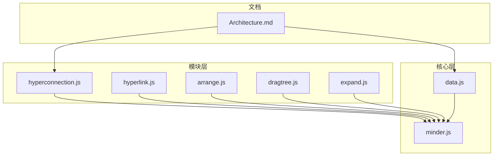
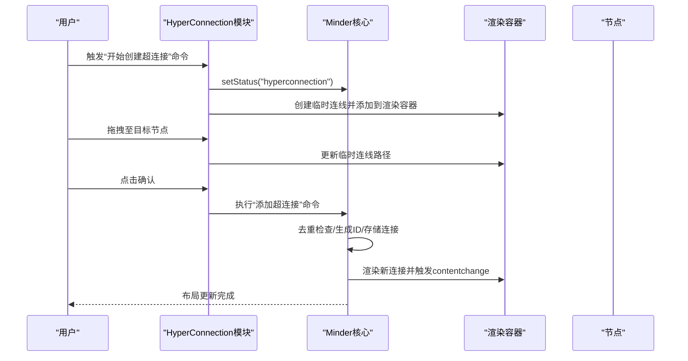
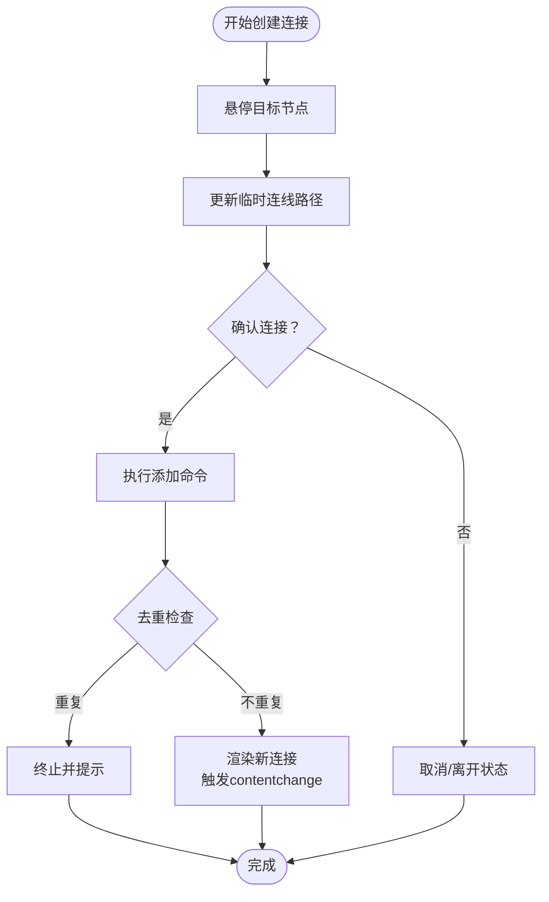
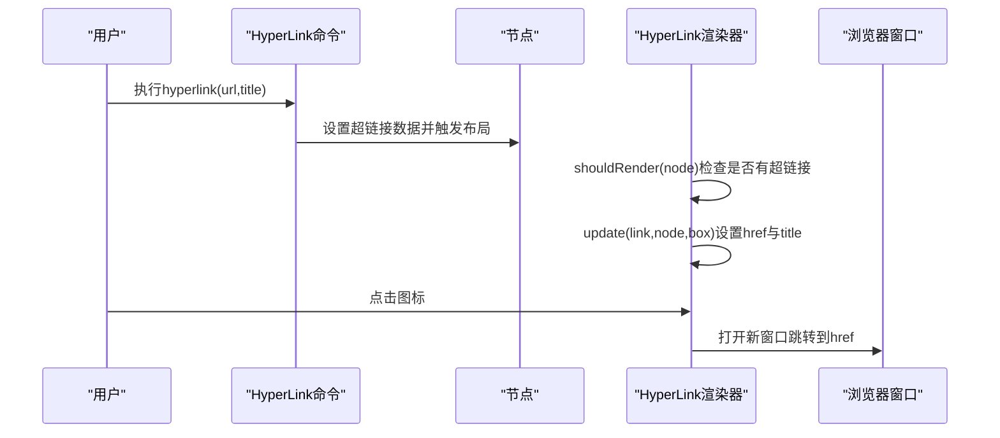
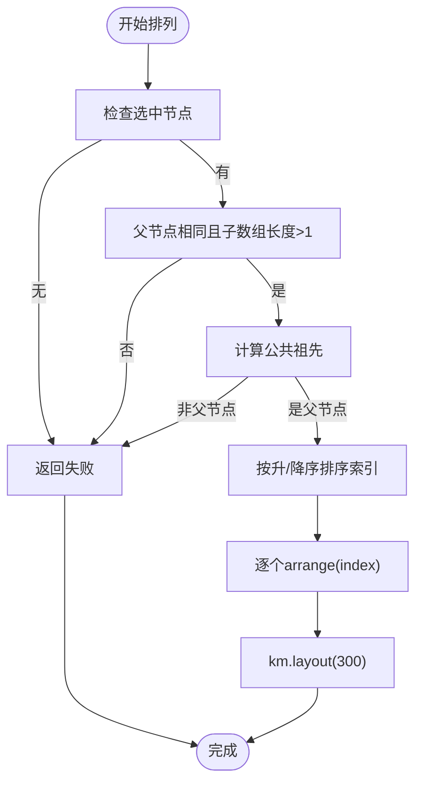
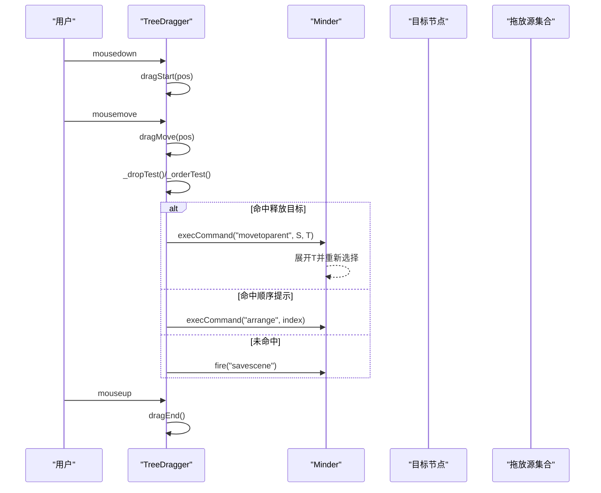
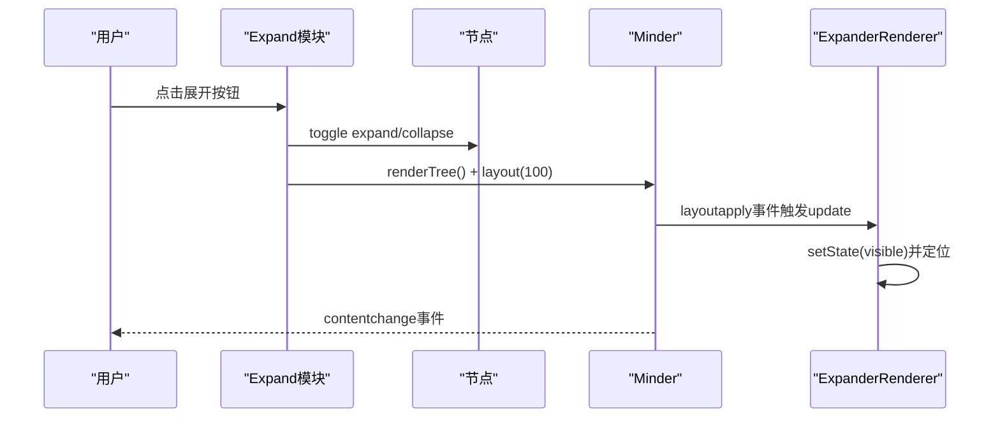
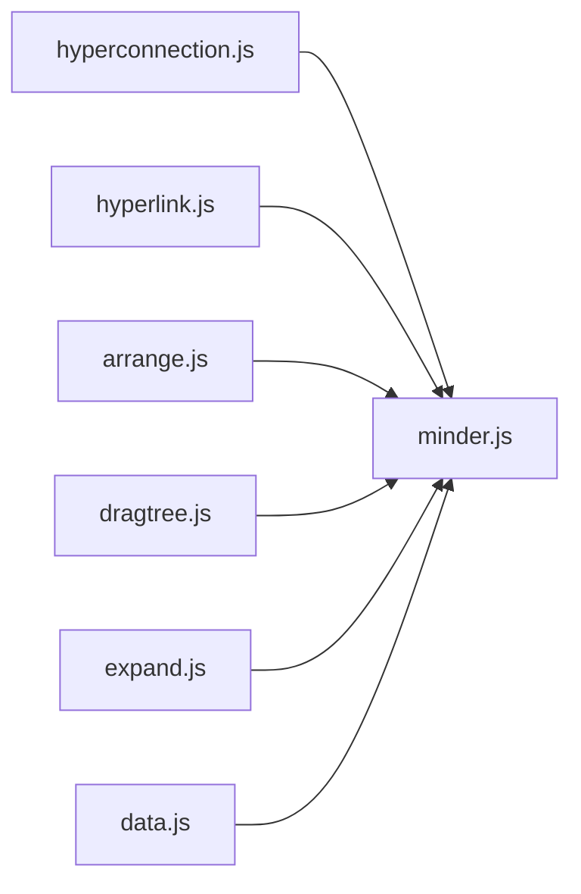

# 结构增强模块

<cite>
**本文引用的文件**
- [hyperconnection.js](file://src/module/hyperconnection.js)
- [hyperlink.js](file://src/module/hyperlink.js)
- [arrange.js](file://src/module/arrange.js)
- [dragtree.js](file://src/module/dragtree.js)
- [expand.js](file://src/module/expand.js)
- [data.js](file://src/core/data.js)
- [minder.js](file://src/core/minder.js)
- [Architecture.md](file://doc/Architecture.md)
</cite>

## 目录
1. [简介](#简介)
2. [项目结构](#项目结构)
3. [核心组件](#核心组件)
4. [架构总览](#架构总览)
5. [详细组件分析](#详细组件分析)
6. [依赖关系分析](#依赖关系分析)
7. [性能考量](#性能考量)
8. [故障排查指南](#故障排查指南)
9. [结论](#结论)
10. [附录](#附录)

## 简介
本文件系统性剖析“结构增强类扩展功能”的架构设计，围绕以下五个模块进行深入解读：
- 自由关联线模块（hyperconnection.js）：支持任意节点间建立非树形连接，提供贝塞尔曲线绘制、控制点锚定与拖拽调整、临时连线预览、去重与事件广播。
- 超链接模块（hyperlink.js）：为节点添加超链接，包含URL白名单校验、外部链接跳转、标题提示与渲染器集成。
- 节点排列调整模块（arrange.js）：支持同级节点顺序调整、批量位置重排、公共祖先约束与冲突规避。
- 拖拽排序模块（dragtree.js）：实现树形节点拖拽、插入位置预览、父子关系变更、顺序变更与冲突检测。
- 展开收起模块（expand.js）：提供节点展开/收起状态管理、渲染器联动、键盘快捷键与动画过渡事件广播。

通过复杂思维导图案例说明这些功能如何协同工作，支撑非线性知识表达与灵活的结构组织。

## 项目结构
结构增强模块位于 src/module 下，分别独立注册为模块，通过命令、渲染器、事件与核心 Minder 类扩展进行集成。数据层面，自由关联线通过核心数据导出/导入扩展，支持 connections 字段持久化。

图表来源
- [hyperconnection.js](file://src/module/hyperconnection.js#L772-L856)
- [hyperlink.js](file://src/module/hyperlink.js#L1-L127)
- [arrange.js](file://src/module/arrange.js#L1-L156)
- [dragtree.js](file://src/module/dragtree.js#L368-L405)
- [expand.js](file://src/module/expand.js#L1-L294)
- [data.js](file://src/core/data.js#L56-L90)
- [minder.js](file://src/core/minder.js#L1-L41)
- [Architecture.md](file://doc/Architecture.md#L598-L644)

章节来源
- [hyperconnection.js](file://src/module/hyperconnection.js#L1-L120)
- [data.js](file://src/core/data.js#L56-L90)
- [Architecture.md](file://doc/Architecture.md#L598-L644)

## 核心组件
- 自由关联线（HyperConnection）：负责连接数据结构、贝塞尔曲线绘制、控制点拖拽、临时连线预览、选择与事件广播。
- 超链接（HyperLink）：命令负责设置/查询节点超链接，渲染器负责图标绘制与URL白名单校验。
- 节点排列（Arrange）：命令封装节点顺序调整，基于公共祖先与索引排序，触发布局重绘。
- 拖拽排序（DragTree）：TreeDragger 实现拖拽手势识别、插入预览、父子关系变更与顺序变更。
- 展开收起（Expand）：节点状态扩展与渲染器联动，键盘快捷键与事件广播。

章节来源
- [hyperconnection.js](file://src/module/hyperconnection.js#L166-L210)
- [hyperlink.js](file://src/module/hyperlink.js#L1-L127)
- [arrange.js](file://src/module/arrange.js#L1-L156)
- [dragtree.js](file://src/module/dragtree.js#L73-L122)
- [expand.js](file://src/module/expand.js#L1-L204)

## 架构总览
结构增强模块通过模块注册机制挂载到 Minder，利用命令驱动状态变更，渲染器负责视觉呈现，事件系统贯穿生命周期。

图表来源
- [hyperconnection.js](file://src/module/hyperconnection.js#L570-L671)
- [hyperconnection.js](file://src/module/hyperconnection.js#L701-L767)
- [hyperconnection.js](file://src/module/hyperconnection.js#L772-L856)

## 详细组件分析

### 自由关联线模块（hyperconnection.js）
- 数据模型与非树形结构
  - 连接数据包含起止节点ID、类型、颜色、线宽、文字说明与贝塞尔控制点偏移，支持任意节点对之间的连接，突破树形结构限制。
  - 导入导出通过核心数据模块扩展，导出时写入 connections 字段，导入时重建渲染。
- 贝塞尔曲线绘制算法
  - 起终点采用节点布局盒的边缘点计算，避免连线与节点重叠。
  - 默认控制点按连线方向（水平/垂直）设定为连线长度的固定比例，随后叠加用户偏移，形成可调的三次贝塞尔曲线。
  - 文字标签位于曲线中点附近，确保可读性。
- 连接点锚定机制
  - 通过节点布局盒边缘点计算，依据方向向量与宽高比判断命中哪条边，保证连线从节点外侧进入。
- 临时连线与拖拽创建
  - 进入 hyperconnection 状态后，创建临时连线，跟随鼠标实时更新路径；悬停目标节点时更新至目标节点的边缘点。
  - 控制点手柄支持拖拽，实时更新控制点偏移并触发更新与 contentchange 事件。
- 去重与事件广播
  - 添加连接前检查双向重复，避免冗余；节点删除、布局完成、导入完成等事件触发重绘或更新。
  - 提供删除命令与容器管理，统一维护连接渲染与数据一致性。

图表来源
- [hyperconnection.js](file://src/module/hyperconnection.js#L570-L671)
- [hyperconnection.js](file://src/module/hyperconnection.js#L701-L767)
- [hyperconnection.js](file://src/module/hyperconnection.js#L772-L856)

章节来源
- [hyperconnection.js](file://src/module/hyperconnection.js#L166-L210)
- [hyperconnection.js](file://src/module/hyperconnection.js#L291-L347)
- [hyperconnection.js](file://src/module/hyperconnection.js#L405-L567)
- [hyperconnection.js](file://src/module/hyperconnection.js#L570-L671)
- [hyperconnection.js](file://src/module/hyperconnection.js#L701-L767)
- [hyperconnection.js](file://src/module/hyperconnection.js#L772-L856)
- [data.js](file://src/core/data.js#L56-L90)
- [Architecture.md](file://doc/Architecture.md#L598-L644)

### 超链接模块（hyperlink.js）
- URL验证与外部跳转
  - 渲染器在 update 中对 URL 进行白名单匹配（http/https/ftp/mailto），仅当匹配成功时设置为实际链接，否则保持占位。
  - 图标设置目标窗口为新标签页，便于外部跳转。
- 内部节点跳转
  - 该模块未实现内部节点跳转逻辑；内部导航通常由应用层在点击事件中处理，此处提供图标与提示信息。
- 命令与渲染器
  - 命令负责设置/查询节点超链接数据，渲染器根据节点是否存在超链接决定是否绘制图标并定位。

图表来源
- [hyperlink.js](file://src/module/hyperlink.js#L1-L127)

章节来源
- [hyperlink.js](file://src/module/hyperlink.js#L1-L127)

### 节点排列调整模块（arrange.js）
- 手动布局保存与位置重置
  - 通过节点实例方法在父节点子数组中移动索引，实现位置重置与批量调整。
- 冲突检测与公共祖先约束
  - 仅当所选节点拥有同一父节点且父节点子数组长度大于1时允许调整。
  - 多选场景下，先计算公共祖先，要求公共祖先必须为父节点，否则拒绝调整。
  - 排序采用升序/降序策略，避免相邻索引冲突导致的重复移动。
- 触发布局与反馈
  - 调整完成后触发布局重绘，保证视觉一致性。

图表来源
- [arrange.js](file://src/module/arrange.js#L28-L136)

章节来源
- [arrange.js](file://src/module/arrange.js#L1-L156)

### 拖拽排序模块（dragtree.js）
- 拖拽手势识别
  - 鼠标按下记录起始位置，移动超过阈值后进入拖拽模式；拖拽期间对拖放源节点集合进行淡出与分离，提升视觉反馈。
- 插入位置预览
  - 计算可释放目标（不允许拖放到子树内），通过交叉面积与边重合条件判定命中目标；命中后渲染黄色描边矩形提示。
  - 若未命中释放区域，则计算同级顺序提示区域，渲染绿色区域与路径，指示插入上下边界。
- 父子关系变更处理
  - 命中释放目标时，执行移动到父节点命令，将拖放源从原父节点移除并附加到目标节点，随后展开目标节点并重新选择。
  - 命中顺序提示时，计算插入索引并对齐拖放源的原始索引范围，执行 arrange 命令。
- 冲突检测与回退
  - 拖拽结束若无命中，触发场景保存事件并恢复状态；避免误操作造成数据丢失。

图表来源
- [dragtree.js](file://src/module/dragtree.js#L73-L122)
- [dragtree.js](file://src/module/dragtree.js#L173-L276)
- [dragtree.js](file://src/module/dragtree.js#L321-L366)
- [dragtree.js](file://src/module/dragtree.js#L368-L405)

章节来源
- [dragtree.js](file://src/module/dragtree.js#L73-L122)
- [dragtree.js](file://src/module/dragtree.js#L173-L276)
- [dragtree.js](file://src/module/dragtree.js#L321-L366)
- [dragtree.js](file://src/module/dragtree.js#L368-L405)

### 展开收起模块（expand.js）
- 状态管理
  - 节点扩展状态通过数据字段维护，isExpanded/isCollapsed 基于父节点状态与自身状态组合判断。
- 动画过渡与事件广播
  - 展开/收起命令逐级展开或折叠，随后渲染整棵树并触发布局动画；渲染器在布局应用后更新展开按钮位置与可见性。
  - 键盘快捷键支持快速展开到指定层级，或切换当前节点展开状态。
- 交互与上下文菜单
  - 展开按钮渲染在节点外侧，点击切换状态并广播内容变更事件，保证后续布局与渲染同步。

图表来源
- [expand.js](file://src/module/expand.js#L1-L204)
- [expand.js](file://src/module/expand.js#L200-L294)

章节来源
- [expand.js](file://src/module/expand.js#L1-L204)
- [expand.js](file://src/module/expand.js#L200-L294)

## 依赖关系分析
- 模块到核心类的依赖
  - 各模块均依赖 Minder、MinderNode、Command、Renderer、Module 等核心能力，通过命令驱动状态变更，渲染器负责可视化。
- 数据依赖
  - 自由关联线依赖核心数据模块的导出/导入扩展，确保 connections 字段持久化。
- 事件耦合
  - 模块广泛使用 minder.fire 与事件监听，如 contentchange、layoutallfinish、import、noderemove、statuschange 等，形成松耦合的生命周期协作。

图表来源
- [hyperconnection.js](file://src/module/hyperconnection.js#L1-L120)
- [hyperlink.js](file://src/module/hyperlink.js#L1-L127)
- [arrange.js](file://src/module/arrange.js#L1-L156)
- [dragtree.js](file://src/module/dragtree.js#L368-L405)
- [expand.js](file://src/module/expand.js#L1-L204)
- [data.js](file://src/core/data.js#L56-L90)
- [minder.js](file://src/core/minder.js#L1-L41)

章节来源
- [hyperconnection.js](file://src/module/hyperconnection.js#L772-L856)
- [hyperlink.js](file://src/module/hyperlink.js#L1-L127)
- [arrange.js](file://src/module/arrange.js#L1-L156)
- [dragtree.js](file://src/module/dragtree.js#L368-L405)
- [expand.js](file://src/module/expand.js#L1-L204)
- [data.js](file://src/core/data.js#L56-L90)
- [minder.js](file://src/core/minder.js#L1-L41)

## 性能考量
- 节点更新节流
  - 自由关联线模块对节点更新使用节流器，避免频繁重绘带来的性能损耗。
- 布局动画参数
  - 多处命令在布局时传入动画时间参数，平衡流畅度与响应速度。
- 交叉检测优化
  - 拖拽排序模块在释放目标判定中引入面积阈值与边重合判断，减少误判与无效重绘。

章节来源
- [hyperconnection.js](file://src/module/hyperconnection.js#L819-L826)
- [arrange.js](file://src/module/arrange.js#L46-L54)
- [dragtree.js](file://src/module/dragtree.js#L321-L366)

## 故障排查指南
- 自由关联线无法创建或重复
  - 检查是否处于 hyperconnection 状态，确认源节点已选中；添加前会进行双向重复检查。
  - 若出现连线不更新，确认节点布局盒是否有效，以及 contentchange 事件是否被正确触发。
- 超链接不生效
  - 确认 URL 符合白名单（http/https/ftp/mailto），否则渲染器不会设置实际链接。
  - 检查节点是否设置了超链接数据，渲染器 shouldRender 依赖该数据。
- 节点排列无效
  - 确认所选节点是否在同一父节点下且父节点子数组长度大于1；多选时需满足公共祖先为父节点。
  - 检查排序策略与索引边界，避免越界或重复移动。
- 拖拽排序未命中
  - 检查拖拽阈值与释放目标判定逻辑，确认未拖放到子树内；顺序提示区域需满足交叉面积或边重合条件。
- 展开收起异常
  - 确认节点状态数据字段正常，父节点展开状态会影响子节点可见性；键盘快捷键在文本编辑状态下会被忽略。

章节来源
- [hyperconnection.js](file://src/module/hyperconnection.js#L570-L671)
- [hyperconnection.js](file://src/module/hyperconnection.js#L701-L767)
- [hyperlink.js](file://src/module/hyperlink.js#L86-L124)
- [arrange.js](file://src/module/arrange.js#L28-L136)
- [dragtree.js](file://src/module/dragtree.js#L321-L366)
- [expand.js](file://src/module/expand.js#L212-L251)

## 结论
结构增强模块通过命令-渲染器-事件的解耦设计，实现了非树形连接、超链接、节点顺序调整、拖拽排序与展开收起等能力。自由关联线提供跨分支的非线性表达，超链接增强信息检索，排列与拖拽保障结构灵活性，展开收起提升大体量导图的可浏览性。这些模块协同工作，为复杂思维导图提供了强大的结构增强能力，支持非线性知识表达与高效组织。

## 附录
- 复杂思维导图案例建议
  - 使用自由关联线表达跨主题引用、依赖关系与参考文献，避免强制树形结构导致的信息割裂。
  - 通过超链接快速跳转到外部资源或内部节点，配合展开收起模块聚焦当前关注的主题。
  - 利用拖拽排序与排列命令重构层次结构，结合布局动画获得清晰的视觉反馈。
  - 在大量节点场景下，优先使用展开收起与层级展开命令，减少一次性渲染压力。