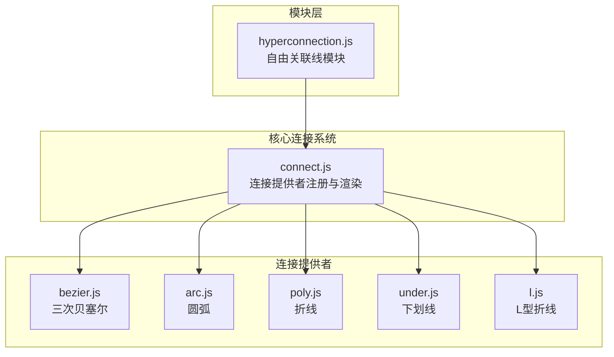
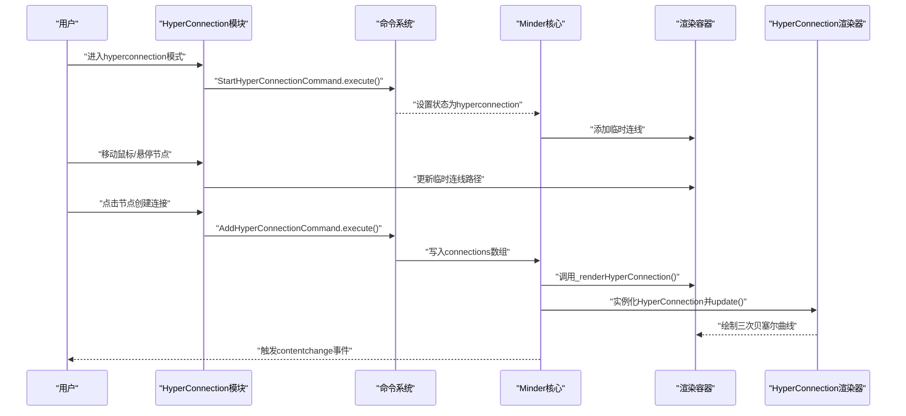
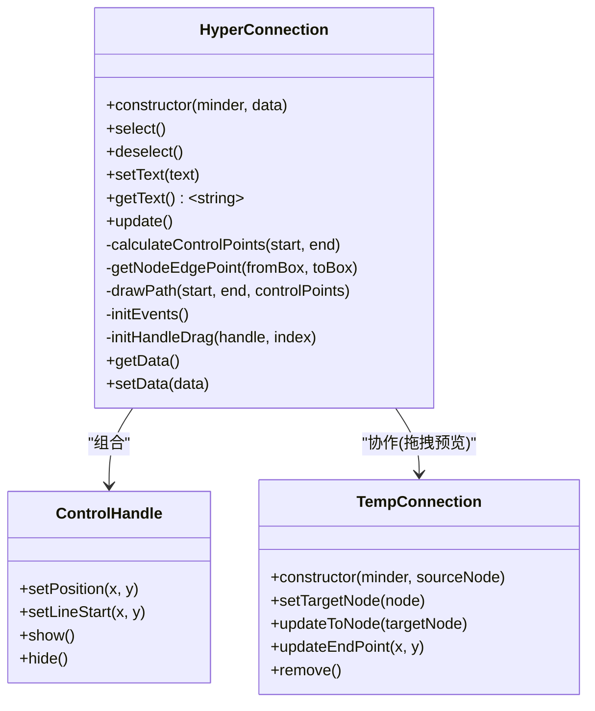
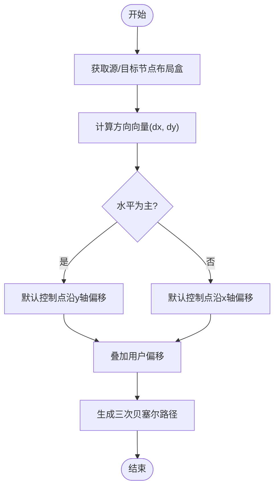
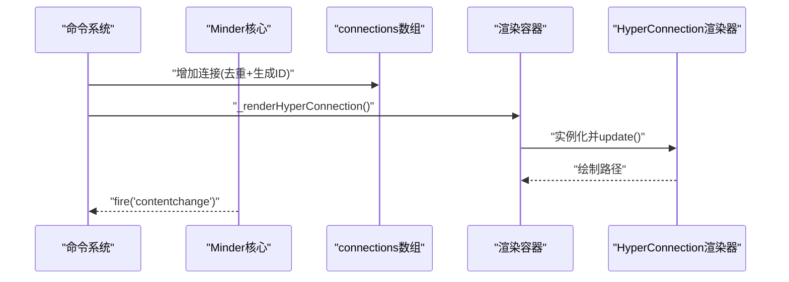
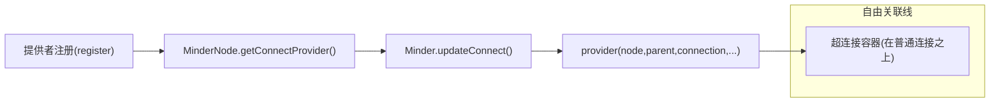
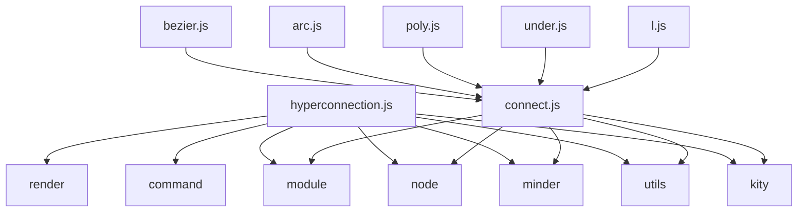

# 自由关联线

<cite>
**本文引用的文件列表**
- [hyperconnection.js](file://src/module/hyperconnection.js)
- [bezier.js](file://src/connect/bezier.js)
- [arc.js](file://src/connect/arc.js)
- [connect.js](file://src/core/connect.js)
- [poly.js](file://src/connect/poly.js)
- [under.js](file://src/connect/under.js)
- [l.js](file://src/connect/l.js)
- [Architecture.md](file://doc/Architecture.md)
</cite>

## 目录
1. [简介](#简介)
2. [项目结构](#项目结构)
3. [核心组件](#核心组件)
4. [架构总览](#架构总览)
5. [详细组件分析](#详细组件分析)
6. [依赖关系分析](#依赖关系分析)
7. [性能考量](#性能考量)
8. [故障排查指南](#故障排查指南)
9. [结论](#结论)
10. [附录](#附录)

## 简介
本文件深入解析自由关联线模块的实现机制，重点说明以下方面：
- hyperconnection.js 如何利用三次贝塞尔曲线算法绘制平滑连接线；
- 连接点锚定策略在不同节点位置下的动态计算逻辑；
- 非树形结构数据模型中 connections 数组的存储结构与增删改查操作；
- 结合 bezier.js 与 arc.js 说明不同曲线类型的渲染差异；
- 与核心连接系统（connect.js）的集成方式；
- 创建、编辑和删除自由关联线的完整流程（事件绑定、路径重绘、数据同步）；
- 常见问题（连线重叠、锚点偏移）的解决方案与性能优化建议（大规模场景下的渲染降级策略）。

## 项目结构
自由关联线模块位于模块目录中，核心实现集中在 hyperconnection.js；同时，核心连接系统在 connect.js 中提供通用注册与渲染框架，其他曲线类型（如 bezier、arc、poly、under、l）作为连接提供者注册到系统中，供树形布局的父子节点连接使用。

图表来源
- [hyperconnection.js](file://src/module/hyperconnection.js#L1-L120)
- [connect.js](file://src/core/connect.js#L1-L126)
- [bezier.js](file://src/connect/bezier.js#L1-L42)
- [arc.js](file://src/connect/arc.js#L1-L49)
- [poly.js](file://src/connect/poly.js#L1-L63)
- [under.js](file://src/connect/under.js#L1-L50)
- [l.js](file://src/connect/l.js#L1-L34)

章节来源
- [hyperconnection.js](file://src/module/hyperconnection.js#L1-L120)
- [connect.js](file://src/core/connect.js#L1-L126)

## 核心组件
- 自由关联线渲染器（HyperConnection）：负责绘制三次贝塞尔曲线、控制点手柄、箭头标记、文字标签、事件绑定与交互。
- 临时连线（TempConnection）：拖拽创建阶段的预览连线。
- 控制点手柄（ControlHandle）：可视化调整贝塞尔控制点的拖拽控件。
- 命令系统（StartHyperConnectionCommand、AddHyperConnectionCommand、RemoveHyperConnectionCommand）：封装创建、编辑、删除的业务逻辑。
- Minder 扩展方法：管理 connections 数组、渲染与更新超连接。
- 连接提供者（bezier、arc、poly、under、l）：核心连接系统中的标准曲线类型，用于父子节点连接。

章节来源
- [hyperconnection.js](file://src/module/hyperconnection.js#L166-L567)
- [hyperconnection.js](file://src/module/hyperconnection.js#L570-L767)
- [connect.js](file://src/core/connect.js#L1-L126)

## 架构总览
自由关联线模块通过模块化的方式扩展 Minder 的能力，在渲染容器中创建独立的超连接分组，优先于普通连接渲染，确保自由关联线不会被树形连接覆盖。模块内部维护 connections 数组，通过命令系统进行增删改查，并在布局变化、节点删除、导入数据等事件中触发重绘或同步。

图表来源
- [hyperconnection.js](file://src/module/hyperconnection.js#L570-L974)
- [hyperconnection.js](file://src/module/hyperconnection.js#L701-L767)
- [connect.js](file://src/core/connect.js#L58-L104)

章节来源
- [hyperconnection.js](file://src/module/hyperconnection.js#L570-L974)
- [hyperconnection.js](file://src/module/hyperconnection.js#L701-L767)

## 详细组件分析

### 1) 自由关联线渲染器（HyperConnection）
- 路径绘制：采用三次贝塞尔曲线（C），起点与终点分别为两个节点的边缘点，控制点由默认位置与用户偏移共同决定。
- 锚定策略：根据起止节点中心连线的方向（水平或垂直）计算默认控制点位置，再叠加用户偏移，保证曲线平滑且可调。
- 文字与箭头：支持在曲线上居中显示文字标签；当类型为箭头时在末端添加标记。
- 控制点手柄：提供两个可拖拽的手柄，分别对应起点与终点的控制点，拖拽时仅更新对应偏移并重绘。
- 事件绑定：在透明热区上监听点击、双击、拖拽；点击连线选中，拖拽更新数据并触发内容变更事件；画布点击或节点选择变化时取消选中。

图表来源
- [hyperconnection.js](file://src/module/hyperconnection.js#L166-L567)

章节来源
- [hyperconnection.js](file://src/module/hyperconnection.js#L166-L567)

### 2) 临时连线（TempConnection）
- 在进入 hyperconnection 模式后创建，用于拖拽过程中的视觉反馈。
- 若悬停在目标节点上，使用两次贝塞尔（二次曲线 Q）连接源节点中心与目标节点中心；否则跟随鼠标绘制二次贝塞尔曲线。

章节来源
- [hyperconnection.js](file://src/module/hyperconnection.js#L82-L164)

### 3) 锚定策略与贝塞尔控制点计算
- 起点/终点边缘点：根据源节点与目标节点中心连线的方向，判断应取左右或上下边缘的中心点作为锚点，避免连线穿过节点主体。
- 默认控制点：以连线长度的固定比例（例如四分之一）沿垂直方向偏移，形成自然的弧形；若水平或垂直方向占优，分别沿相应方向偏移。
- 用户偏移：用户拖拽控制点手柄时，仅更新对应控制点的偏移量，随后整体重绘，保证交互即时性与一致性。

图表来源
- [hyperconnection.js](file://src/module/hyperconnection.js#L461-L557)

章节来源
- [hyperconnection.js](file://src/module/hyperconnection.js#L461-L557)

### 4) 数据模型与增删改查
- 数据结构：connections 数组中的每条记录包含起止节点 ID、可选文字、类型（箭头/直线/虚线）、颜色、线宽以及两个控制点的偏移量。
- 增加：命令执行时校验重复连接（包括双向），生成唯一 ID 并写入数组，随后渲染新连线并触发内容变更。
- 删除：按 ID 查找并移除数组项，同时从渲染容器中移除对应图形。
- 修改：通过渲染器的 setData 方法更新数据并重绘；也可直接修改 connections 数组后触发批量重绘。
- 导入/导出：模块扩展了读取/设置 connections 的方法，并在导入事件后重新渲染全部超连接。

图表来源
- [hyperconnection.js](file://src/module/hyperconnection.js#L600-L696)
- [hyperconnection.js](file://src/module/hyperconnection.js#L701-L767)

章节来源
- [hyperconnection.js](file://src/module/hyperconnection.js#L600-L696)
- [hyperconnection.js](file://src/module/hyperconnection.js#L701-L767)
- [Architecture.md](file://doc/Architecture.md#L598-L644)

### 5) 与核心连接系统（connect.js）的集成
- 连接提供者注册：connect.js 维护提供者字典，支持通过名称选择不同的连接类型（如 default、bezier、arc、poly、under、l）。
- 渲染管线：MinderNode 通过 getConnectProvider 获取当前连接类型对应的提供者函数，然后在 updateConnect 中调用该函数绘制路径。
- 自由关联线的定位：HyperConnection 模块创建独立的超连接容器，放置在普通连接容器之上，确保自由关联线始终可见且不被树形连接覆盖。

图表来源
- [connect.js](file://src/core/connect.js#L1-L126)
- [hyperconnection.js](file://src/module/hyperconnection.js#L772-L787)

章节来源
- [connect.js](file://src/core/connect.js#L1-L126)
- [hyperconnection.js](file://src/module/hyperconnection.js#L772-L787)

### 6) 曲线类型差异（bezier.js 与 arc.js）
- bezier：根据父节点到子节点的方向，沿中点处进行水平或垂直转向，形成“S”形曲线，适合树形父子连接。
- arc：使用椭圆弧段连接两侧节点，常用于强调横向跨越的连接，带有圆形标记。
- 其他类型（poly、under、l）：折线、下划线、L型折线，均通过 register 注册到 connect 系统，供树形连接使用。

章节来源
- [bezier.js](file://src/connect/bezier.js#L1-L42)
- [arc.js](file://src/connect/arc.js#L1-L49)
- [poly.js](file://src/connect/poly.js#L1-L63)
- [under.js](file://src/connect/under.js#L1-L50)
- [l.js](file://src/connect/l.js#L1-L34)

### 7) 事件绑定、路径重绘与数据同步
- 事件绑定：HyperConnection 在透明热区上绑定点击、双击、拖拽事件；模块在 hyperconnection 状态下监听鼠标移动、按下、键盘等事件，驱动临时连线与最终提交。
- 路径重绘：渲染器 update 时重新计算锚点、控制点并生成路径；文字标签位置基于曲线中点（t=0.5）计算。
- 数据同步：命令执行后触发 contentchange，模块在布局变化、导入、节点删除等事件中同步更新或重建渲染。

章节来源
- [hyperconnection.js](file://src/module/hyperconnection.js#L252-L347)
- [hyperconnection.js](file://src/module/hyperconnection.js#L852-L974)
- [hyperconnection.js](file://src/module/hyperconnection.js#L747-L766)

## 依赖关系分析
- hyperconnection.js 依赖：
  - core 层：kity、utils、minder、node、command、module、render；
  - connect 提供者：用于理解核心连接系统的工作方式；
- connect.js 依赖：
  - core 层：kity、utils、module、minder、node；
  - connect 提供者：bezier、arc、poly、under、l；
- 数据模型：
  - connections 数组存储在 Minder 实例中，模块提供 get/set/_renderAll/_updateAll 等方法管理。

图表来源
- [hyperconnection.js](file://src/module/hyperconnection.js#L8-L16)
- [connect.js](file://src/core/connect.js#L1-L126)
- [bezier.js](file://src/connect/bezier.js#L1-L13)
- [arc.js](file://src/connect/arc.js#L1-L13)
- [poly.js](file://src/connect/poly.js#L1-L13)
- [under.js](file://src/connect/under.js#L1-L13)
- [l.js](file://src/connect/l.js#L1-L13)

章节来源
- [hyperconnection.js](file://src/module/hyperconnection.js#L8-L16)
- [connect.js](file://src/core/connect.js#L1-L126)

## 性能考量
- 节点更新节流：在 layoutapply 事件中使用 requestAnimationFrame 或定时器对同一节点的更新进行节流，避免频繁重绘导致卡顿。
- 透明热区：通过透明路径扩大点击区域，减少误操作，同时不影响渲染层级。
- 大规模场景建议：
  - 降低重绘频率：合并多次 update 为一次；
  - 分批渲染：对超出阈值的连接采用简化路径或禁用交互；
  - 缓存计算结果：对锚点与控制点的计算结果进行缓存，仅在节点位置变化时刷新；
  - 降级策略：在大量连接时隐藏文字标签与箭头标记，仅保留基础路径。

章节来源
- [hyperconnection.js](file://src/module/hyperconnection.js#L800-L850)

## 故障排查指南
- 连线重叠或遮挡：
  - 检查超连接容器是否位于普通连接容器之上；
  - 确认临时连线在拖拽过程中不响应鼠标事件，避免遮挡节点交互。
- 锚点偏移异常：
  - 确保控制点手柄拖拽时仅更新对应偏移；
  - 检查 getNodeEdgePoint 的方向判断逻辑是否正确。
- 重复连接：
  - 增加连接前检查双向重复，避免重复创建。
- 导入后连线丢失：
  - 确认导入事件后调用了 _renderAllHyperConnections。

章节来源
- [hyperconnection.js](file://src/module/hyperconnection.js#L772-L787)
- [hyperconnection.js](file://src/module/hyperconnection.js#L827-L831)
- [hyperconnection.js](file://src/module/hyperconnection.js#L616-L626)

## 结论
自由关联线模块通过独立的渲染容器与命令系统，实现了对任意节点间连接的灵活绘制与交互。其基于三次贝塞尔曲线的锚定与控制点策略，既保证了视觉平滑，又提供了直观的编辑体验。与核心连接系统的解耦设计使得模块既能独立工作，又能与树形连接共存。针对大规模场景，建议采用节流、降级与缓存等策略提升性能。

## 附录
- 数据模型（connections 数组）字段说明：
  - id：连接唯一标识；
  - from/to：起止节点 ID；
  - text：连线文字（可选）；
  - type：类型（arrow/line/dashed）；
  - color/strokeWidth：颜色与线宽（可选）；
  - controlPoint1/controlPoint2：起点/终点控制点偏移（相对默认位置）。

章节来源
- [Architecture.md](file://doc/Architecture.md#L598-L644)