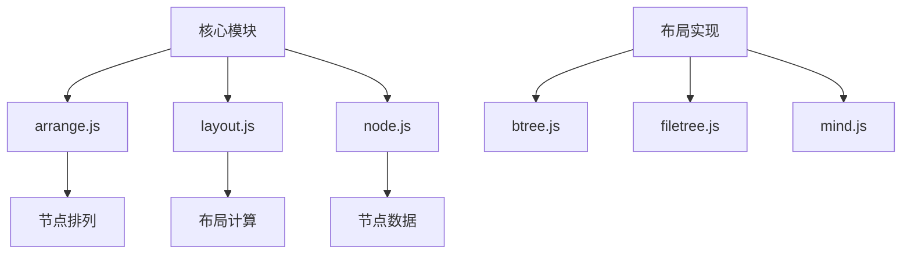
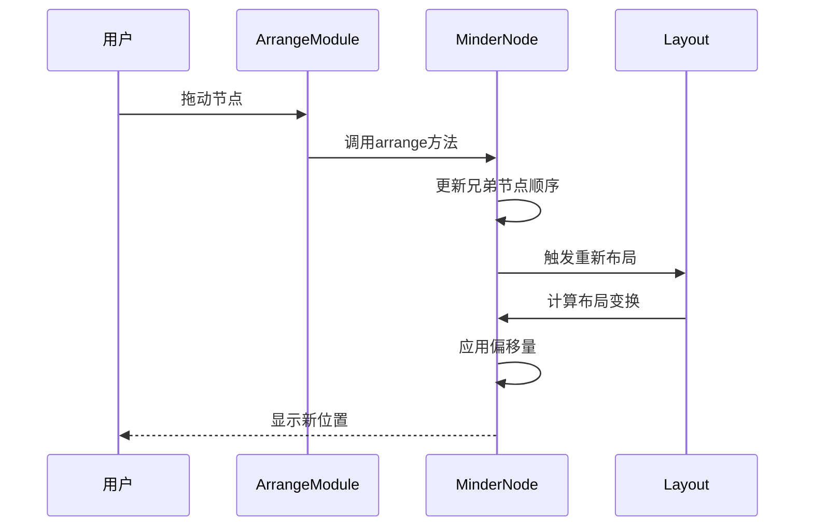
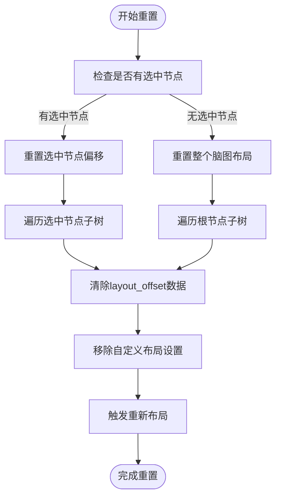
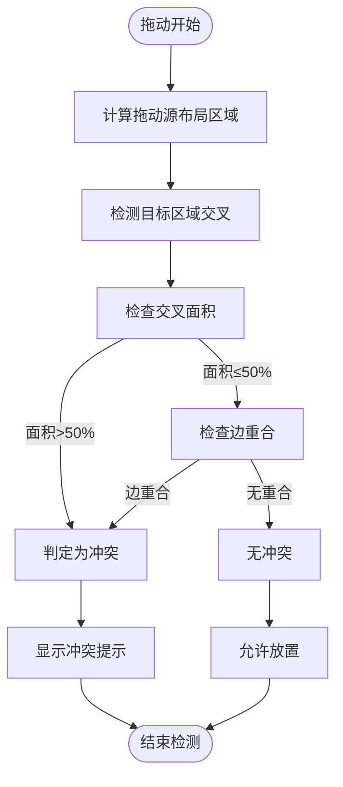
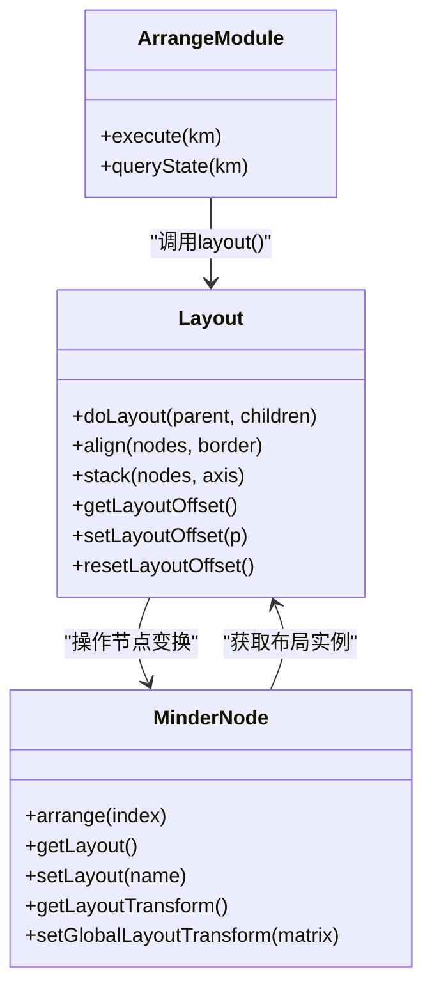
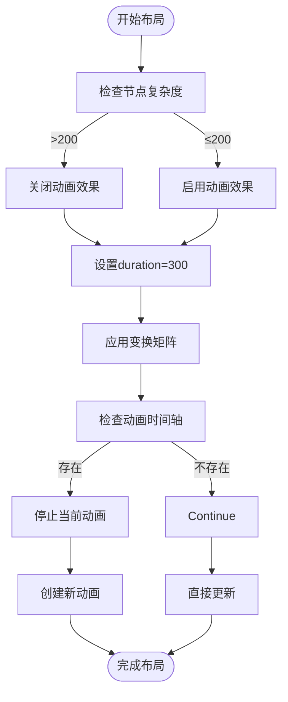

# 节点排列调整

<cite>
**本文档引用的文件**
- [arrange.js](file://src/module/arrange.js)
- [layout.js](file://src/core/layout.js)
- [dragtree.js](file://src/module/dragtree.js)
- [node.js](file://src/core/node.js)
- [btree.js](file://src/layout/btree.js)
- [filetree.js](file://src/layout/filetree.js)
- [mind.js](file://src/layout/mind.js)
</cite>

## 目录
1. [项目结构](#项目结构)
2. [核心组件](#核心组件)
3. [坐标保存机制](#坐标保存机制)
4. [位置重置功能](#位置重置功能)
5. [冲突检测逻辑](#冲突检测逻辑)
6. [与核心布局系统的协作](#与核心布局系统的协作)
7. [配置方法与API使用](#配置方法与api使用)
8. [缩放视图下的注意事项](#缩放视图下的注意事项)

## 项目结构

项目采用模块化架构，核心功能分布在不同目录中。节点手动排列功能主要由`src/module/arrange.js`实现，核心布局系统由`src/core/layout.js`管理，节点数据结构定义在`src/core/node.js`中。布局算法实现在`src/layout/`目录下，包括btree、filetree等具体布局类型。



**Diagram sources**
- [arrange.js](file://src/module/arrange.js)
- [layout.js](file://src/core/layout.js)
- [node.js](file://src/core/node.js)
- [btree.js](file://src/layout/btree.js)
- [filetree.js](file://src/layout/filetree.js)
- [mind.js](file://src/layout/mind.js)

**Section sources**
- [arrange.js](file://src/module/arrange.js)
- [layout.js](file://src/core/layout.js)
- [node.js](file://src/core/node.js)

## 核心组件

节点手动排列功能的核心组件包括`ArrangeModule`、`Layout`基类和`MinderNode`节点类。`ArrangeModule`提供节点位置调整命令，`Layout`基类定义布局计算接口，`MinderNode`管理节点的布局变换和偏移数据。

**Section sources**
- [arrange.js](file://src/module/arrange.js)
- [layout.js](file://src/core/layout.js)
- [node.js](file://src/core/node.js)

## 坐标保存机制

用户拖动节点后，系统通过`setLayoutOffset`方法保存自定义位置数据。该机制在默认布局算法之外维护节点的偏移量，具体实现如下：

1. 节点位置偏移数据以`layout_[布局名称]_offset`格式存储在节点数据中
2. 偏移量计算基于当前布局类型，确保在布局切换时能正确处理
3. 偏移数据与布局变换矩阵结合，最终确定节点显示位置



**Diagram sources**
- [arrange.js](file://src/module/arrange.js#L9-L18)
- [layout.js](file://src/core/layout.js#L344-L364)
- [node.js](file://src/core/node.js)

**Section sources**
- [arrange.js](file://src/module/arrange.js#L9-L18)
- [layout.js](file://src/core/layout.js#L344-L364)

## 位置重置功能

位置重置功能通过`resetLayoutOffset`方法恢复由布局算法计算的原始坐标。该功能清除用户自定义的偏移数据，使节点回归到布局算法计算的标准位置。



**Diagram sources**
- [layout.js](file://src/core/layout.js#L370-L372)
- [layout.js](file://src/module/layout.js#L54-L74)

**Section sources**
- [layout.js](file://src/core/layout.js#L370-L372)
- [layout.js](file://src/module/layout.js#L54-L74)

## 冲突检测逻辑

系统通过布局区域交叉检测防止节点重叠。在拖动节点时，系统计算拖动源和目标区域的交叉情况，当交叉面积超过阈值或边完全重合时判定为冲突。



**Diagram sources**
- [dragtree.js](file://src/module/dragtree.js#L321-L343)
- [layout.js](file://src/core/layout.js#L141-L163)

**Section sources**
- [dragtree.js](file://src/module/dragtree.js#L321-L343)

## 与核心布局系统的协作

手动排列模块与核心布局系统通过事件和方法调用紧密协作。布局切换时，系统会根据新布局类型重新计算偏移数据，确保自定义位置的兼容性。



**Diagram sources**
- [arrange.js](file://src/module/arrange.js)
- [layout.js](file://src/core/layout.js)
- [node.js](file://src/core/node.js)

**Section sources**
- [arrange.js](file://src/module/arrange.js)
- [layout.js](file://src/core/layout.js)
- [node.js](file://src/core/node.js)

## 配置方法与API使用

系统提供多种方式启用/禁用手动排列功能，并支持通过API批量调整节点坐标。

### 启用/禁用配置

通过注册模块的方式控制功能启用：
```javascript
Module.register('ArrangeModule', {
    commands: {
        'arrangeup': ArrangeUpCommand,
        'arrangedown': ArrangeDownCommand,
        'arrange': ArrangeCommand
    },
    contextmenu: [{
        command: 'arrangeup'
    }, {
        command: 'arrangedown'
    }],
    commandShortcutKeys: {
        'arrangeup': 'normal::alt+Up',
        'arrangedown': 'normal::alt+Down'
    }
});
```

### API批量调整坐标

通过执行命令批量调整节点位置：
```javascript
// 批量向上调整选中节点
km.execCommand('arrangeup');

// 批量向下调整选中节点  
km.execCommand('arrangedown');

// 调整到指定位置
km.execCommand('arrange', index);
```

**Section sources**
- [arrange.js](file://src/module/arrange.js#L138-L155)
- [layout.js](file://src/core/layout.js#L431-L435)

## 缩放视图下的注意事项

在缩放视图下进行坐标计算时需要注意以下性能瓶颈和规避方法：

1. **性能瓶颈**：大量节点时重新布局计算耗时较长
2. **规避方法**：节点复杂度大于200时自动关闭动画效果
3. **坐标精度**：布局变换矩阵的坐标值会进行四舍五入处理
4. **动画优化**：使用时间轴动画平滑过渡，避免卡顿



**Diagram sources**
- [layout.js](file://src/core/layout.js#L458-L518)
- [dragtree.js](file://src/module/dragtree.js#L113-L115)

**Section sources**
- [layout.js](file://src/core/layout.js#L458-L518)