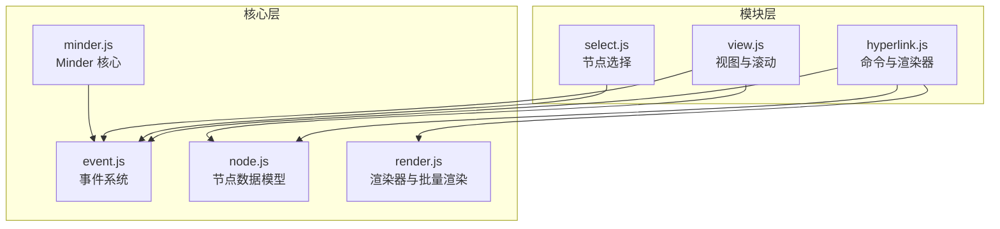
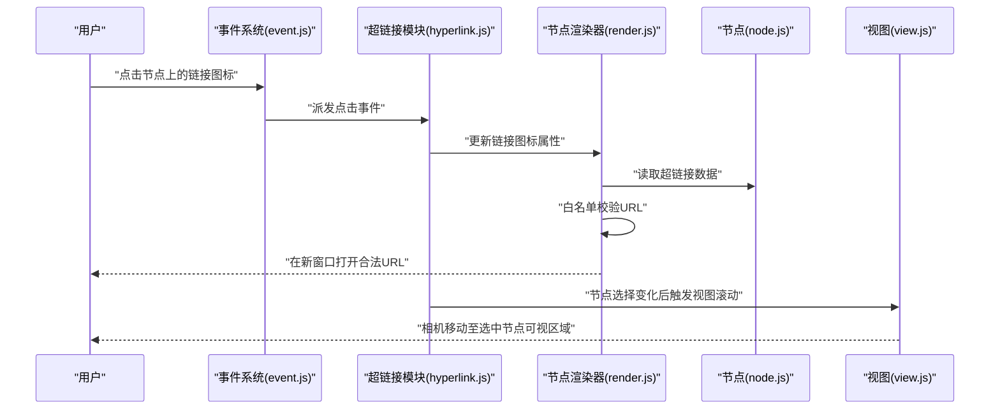
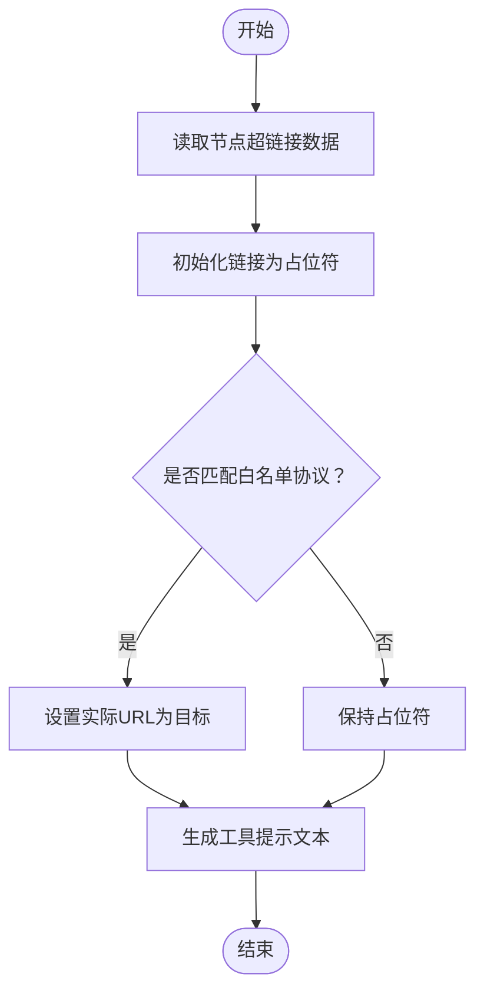
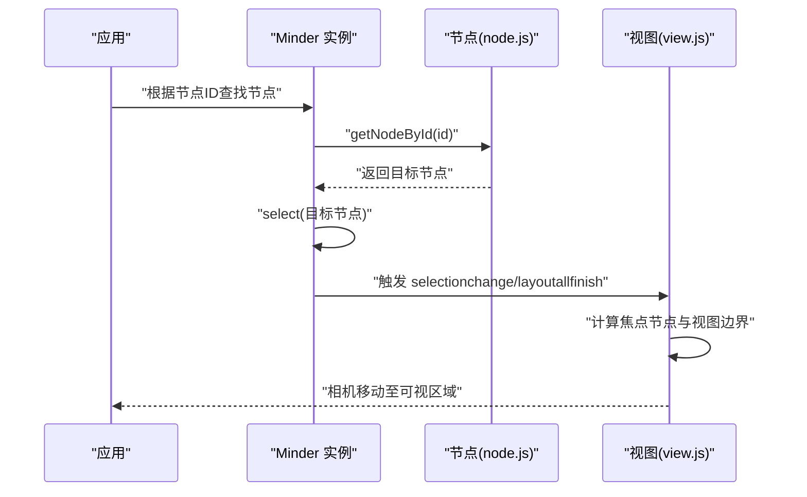
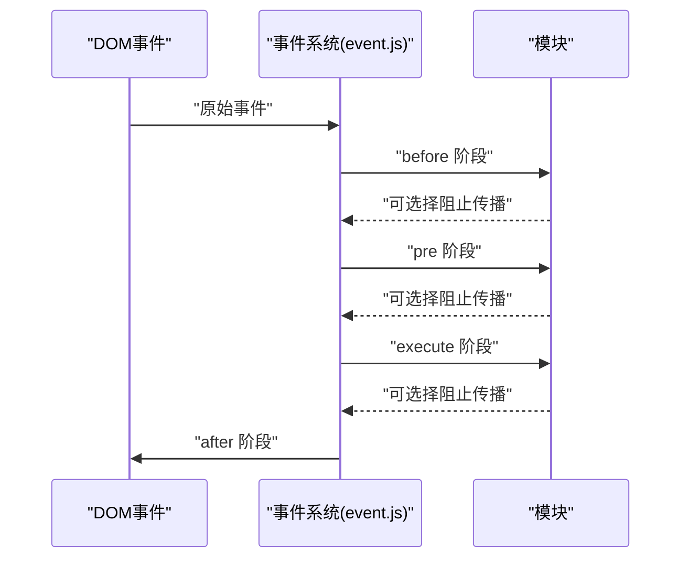
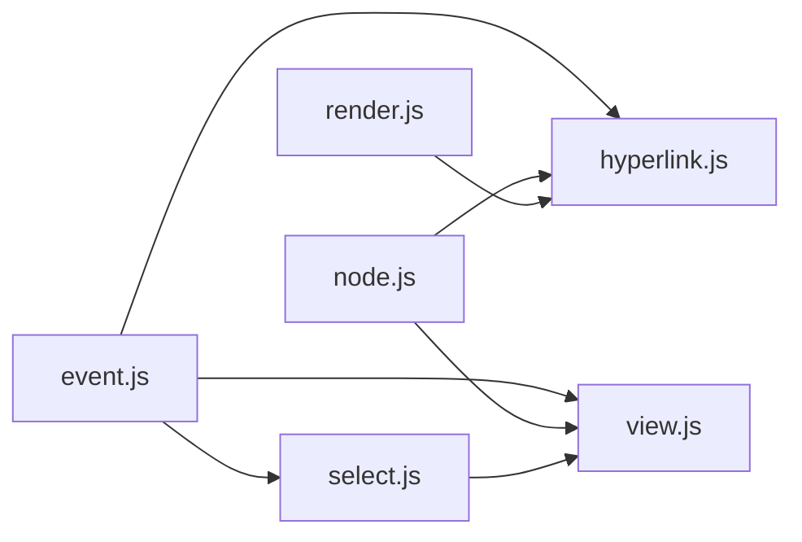

# 超链接

<cite>
**本文引用的文件**
- [hyperlink.js](file://src/module/hyperlink.js)
- [event.js](file://src/core/event.js)
- [node.js](file://src/core/node.js)
- [render.js](file://src/core/render.js)
- [view.js](file://src/module/view.js)
- [select.js](file://src/module/select.js)
- [minder.js](file://src/core/minder.js)
</cite>

## 目录
1. [简介](#简介)
2. [项目结构](#项目结构)
3. [核心组件](#核心组件)
4. [架构总览](#架构总览)
5. [详细组件分析](#详细组件分析)
6. [依赖关系分析](#依赖关系分析)
7. [性能考量](#性能考量)
8. [故障排查指南](#故障排查指南)
9. [结论](#结论)
10. [附录](#附录)

## 简介
本章节面向“超链接”模块的功能实现进行系统化讲解，重点覆盖以下方面：
- URL 格式验证与安全过滤机制
- 外部链接在新窗口打开的实现方式
- 防止 XSS 攻击的处理策略
- 内部节点跳转（通过节点 ID 定位并触发视图滚动到指定位置）
- 与事件系统（event.js）的交互流程
- 在节点上添加、编辑、移除超链接的 API 调用示例
- 数据持久化结构与序列化行为
- 点击事件冒泡拦截处理、链接文本显示样式控制
- 移动端兼容性适配方案
- 调试超链接失效问题的排查步骤

## 项目结构
超链接模块位于模块目录下，核心文件包括：
- hyperlink.js：注册命令、渲染器，负责超链接的添加、编辑、移除与可视化呈现
- event.js：事件系统封装，提供事件派发、传播控制、目标节点解析等能力
- node.js：节点数据模型，提供数据读写接口（setData/getData）
- render.js：渲染器基类与批量渲染流程，驱动节点的绘制与布局
- view.js：视图模块，提供相机视角、滚动、居中等视图控制
- select.js：节点选择模块，提供选择、框选、键盘导航等交互
- minder.js：Minder 核心类定义（版本、初始化钩子）

图表来源
- [hyperlink.js](file://src/module/hyperlink.js#L1-L127)
- [event.js](file://src/core/event.js#L1-L270)
- [node.js](file://src/core/node.js#L1-L407)
- [render.js](file://src/core/render.js#L1-L261)
- [view.js](file://src/module/view.js#L1-L397)
- [select.js](file://src/module/select.js#L1-L184)
- [minder.js](file://src/core/minder.js#L1-L41)

章节来源
- [hyperlink.js](file://src/module/hyperlink.js#L1-L127)
- [event.js](file://src/core/event.js#L1-L270)
- [node.js](file://src/core/node.js#L1-L407)
- [render.js](file://src/core/render.js#L1-L261)
- [view.js](file://src/module/view.js#L1-L397)
- [select.js](file://src/module/select.js#L1-L184)
- [minder.js](file://src/core/minder.js#L1-L41)

## 核心组件
- 命令：hyperlink 命令用于为选中节点设置/移除超链接数据，并触发重新布局与渲染
- 渲染器：右侧渲染器在节点右侧绘制可点击的链接图标，仅当节点存在超链接数据时显示
- 事件系统：统一派发 DOM 与触摸事件，支持传播控制与目标节点解析
- 视图模块：提供相机视角与滚动，使选中节点在视图中可见
- 节点模型：提供通用的数据存取接口，超链接使用节点数据存储

章节来源
- [hyperlink.js](file://src/module/hyperlink.js#L14-L127)
- [event.js](file://src/core/event.js#L133-L266)
- [node.js](file://src/core/node.js#L130-L145)
- [render.js](file://src/core/render.js#L1-L261)
- [view.js](file://src/module/view.js#L338-L397)

## 架构总览
超链接模块通过命令修改节点数据，渲染器根据数据决定是否绘制链接图标；点击链接图标时，渲染器设置链接目标为新窗口，同时对 URL 进行白名单校验；事件系统负责捕获点击事件并传递给模块；视图模块在节点选择变化时自动调整相机位置，确保节点可见。

图表来源
- [hyperlink.js](file://src/module/hyperlink.js#L62-L127)
- [event.js](file://src/core/event.js#L144-L171)
- [render.js](file://src/core/render.js#L165-L219)
- [node.js](file://src/core/node.js#L130-L145)
- [view.js](file://src/module/view.js#L338-L397)

## 详细组件分析

### URL 格式验证与安全过滤机制
- 白名单校验：渲染器在更新链接时，对 URL 进行白名单匹配，仅允许特定协议（例如 http、https、ftp、mailto）生效，其他协议将被忽略，从而避免危险协议注入
- 新窗口打开：渲染器在创建链接时设置目标为新窗口，配合白名单可有效降低跨站风险
- 标题提示：渲染器会将标题与 URL 组合显示为工具提示，便于用户确认目标地址

图表来源
- [hyperlink.js](file://src/module/hyperlink.js#L93-L112)

章节来源
- [hyperlink.js](file://src/module/hyperlink.js#L93-L112)

### 外部链接在新窗口打开的实现方式
- 渲染器创建链接元素并设置目标为新窗口，确保点击后在新标签页打开
- 通过白名单校验，仅对合法协议生效，避免恶意协议导致的安全问题

章节来源
- [hyperlink.js](file://src/module/hyperlink.js#L66-L84)
- [hyperlink.js](file://src/module/hyperlink.js#L93-L103)

### 防止 XSS 攻击的处理策略
- 输入限制：通过白名单协议限制 URL 类型，避免 javascript: 等危险协议
- 输出控制：工具提示文本由标题与 URL 组合生成，避免直接拼接不可信输入
- 事件传播：事件系统提供传播控制方法，可在必要时阻止事件进一步传播

章节来源
- [hyperlink.js](file://src/module/hyperlink.js#L96-L112)
- [event.js](file://src/core/event.js#L86-L112)

### 内部节点跳转：基于节点 ID 的定位与滚动
- 节点 ID：节点数据包含唯一标识，可通过 ID 快速定位目标节点
- 查找与选择：通过节点 ID 查询节点并选中，触发视图模块的滚动逻辑，将选中节点移动到可视区域内
- 视图滚动：视图模块在选择变化或布局完成后，计算焦点节点与视图边界的关系，必要时平滑移动相机

图表来源
- [node.js](file://src/core/node.js#L335-L348)
- [view.js](file://src/module/view.js#L338-L397)

章节来源
- [node.js](file://src/core/node.js#L335-L348)
- [view.js](file://src/module/view.js#L338-L397)

### 与事件系统的交互流程
- 事件绑定：Minder 将画布事件统一绑定到内部事件分发器，支持多种鼠标与触摸事件
- 事件派发：事件分为 before、pre、execute 三个阶段，模块可在不同阶段响应
- 目标节点解析：事件系统提供解析目标节点的方法，便于模块判断点击位置是否命中节点
- 传播控制：事件系统提供阻止传播与立即阻止的方法，避免事件继续冒泡

图表来源
- [event.js](file://src/core/event.js#L144-L182)
- [event.js](file://src/core/event.js#L184-L231)

章节来源
- [event.js](file://src/core/event.js#L144-L182)
- [event.js](file://src/core/event.js#L184-L231)

### 在节点上添加、编辑与移除超链接的 API 调用示例
- 添加/编辑超链接
  - 参数：URL、标题（可选）
  - 行为：为选中节点设置超链接数据，触发重新渲染与布局
  - 返回：首个选中节点的超链接信息（包含 URL 与标题）
- 移除超链接
  - 参数：将 URL 设为 null 或空值
  - 行为：清除节点的超链接数据，隐藏右侧链接图标

章节来源
- [hyperlink.js](file://src/module/hyperlink.js#L17-L61)
- [hyperlink.js](file://src/module/hyperlink.js#L30-L59)

### 数据持久化结构与序列化行为
- 节点数据存储：超链接信息存储在节点数据对象中，使用节点数据接口进行读写
- 结构要点：包含 URL 与标题字段，标题为空时回退为 URL 显示
- 序列化：节点数据随节点树一起序列化，超链接信息作为节点元数据保存

章节来源
- [node.js](file://src/core/node.js#L130-L145)
- [hyperlink.js](file://src/module/hyperlink.js#L33-L35)
- [hyperlink.js](file://src/module/hyperlink.js#L104-L112)

### 点击事件冒泡拦截与链接文本样式控制
- 冒泡拦截：事件系统提供传播控制方法，模块可在必要时阻止事件继续冒泡
- 样式控制：渲染器通过设置光标样式、轮廓填充与位置变换，控制链接图标的外观与交互反馈

章节来源
- [event.js](file://src/core/event.js#L86-L112)
- [hyperlink.js](file://src/module/hyperlink.js#L66-L84)
- [hyperlink.js](file://src/module/hyperlink.js#L114-L123)

### 移动端兼容性适配方案
- 触摸事件：事件系统绑定触摸事件，支持移动端手势
- 滚动冲突：视图模块在触摸移动时阻止默认滚动，避免浏览器后退等行为
- 选择与交互：选择模块支持触摸起始与移动，保证移动端节点选择体验

章节来源
- [event.js](file://src/core/event.js#L144-L149)
- [view.js](file://src/module/view.js#L129-L167)
- [select.js](file://src/module/select.js#L120-L167)

## 依赖关系分析
- hyperlink.js 依赖 node.js 的数据接口与 render.js 的渲染框架
- 事件系统为所有模块提供统一的事件派发与传播控制
- 视图模块依赖事件系统与节点布局信息，实现相机移动与居中
- 选择模块依赖事件系统解析目标节点，为超链接交互提供上下文

图表来源
- [hyperlink.js](file://src/module/hyperlink.js#L1-L127)
- [event.js](file://src/core/event.js#L144-L171)
- [node.js](file://src/core/node.js#L130-L145)
- [render.js](file://src/core/render.js#L165-L219)
- [select.js](file://src/module/select.js#L120-L167)
- [view.js](file://src/module/view.js#L338-L397)

章节来源
- [hyperlink.js](file://src/module/hyperlink.js#L1-L127)
- [event.js](file://src/core/event.js#L144-L171)
- [node.js](file://src/core/node.js#L130-L145)
- [render.js](file://src/core/render.js#L165-L219)
- [select.js](file://src/module/select.js#L120-L167)
- [view.js](file://src/module/view.js#L338-L397)

## 性能考量
- 渲染优化：批量渲染节点，减少重复绘制与布局计算
- 事件节流：视图模块在滚动后延时触发视图变更事件，避免频繁重排
- 条件渲染：渲染器仅在节点存在超链接数据时创建与显示图标，降低无效绘制

章节来源
- [render.js](file://src/core/render.js#L85-L163)
- [view.js](file://src/module/view.js#L300-L312)

## 故障排查指南
- 超链接未显示
  - 检查节点是否存在超链接数据
  - 确认渲染器 shouldRender 条件是否满足
- 点击无反应
  - 检查事件是否被模块或上层阻止传播
  - 确认链接 URL 是否通过白名单校验
- 新窗口未打开
  - 检查渲染器是否设置了新窗口目标
  - 确认 URL 协议是否在白名单内
- 节点跳转后不可见
  - 检查选择模块是否正确选中目标节点
  - 确认视图模块是否在选择变化后执行滚动逻辑

章节来源
- [hyperlink.js](file://src/module/hyperlink.js#L87-L123)
- [event.js](file://src/core/event.js#L86-L112)
- [view.js](file://src/module/view.js#L338-L397)

## 结论
超链接模块通过命令与渲染器的协作，实现了对节点超链接的添加、编辑与移除，并在渲染阶段完成安全过滤与可视化呈现。事件系统提供了统一的事件派发与传播控制，视图模块保障了节点选择后的可视性。整体设计在安全性、可用性与性能之间取得平衡，适合在桌面与移动端场景下稳定运行。

## 附录
- 关键路径参考
  - 命令执行与查询：[hyperlink.js](file://src/module/hyperlink.js#L30-L59)
  - 渲染器创建与更新：[hyperlink.js](file://src/module/hyperlink.js#L62-L123)
  - 事件绑定与派发：[event.js](file://src/core/event.js#L144-L182)
  - 节点数据接口：[node.js](file://src/core/node.js#L130-L145)
  - 视图滚动逻辑：[view.js](file://src/module/view.js#L338-L397)
  - 选择模块交互：[select.js](file://src/module/select.js#L120-L167)