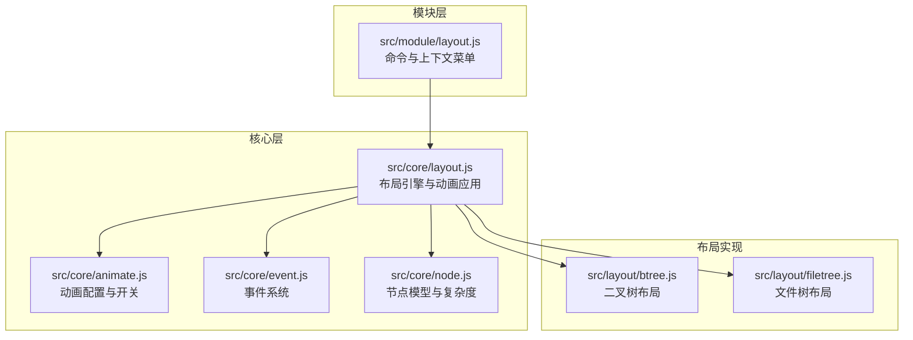
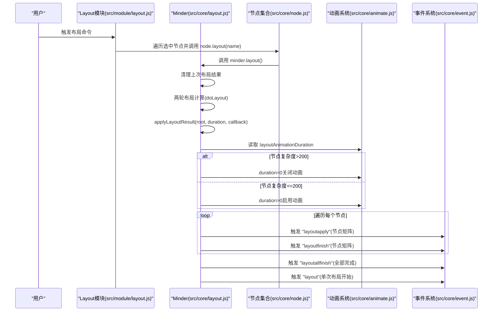
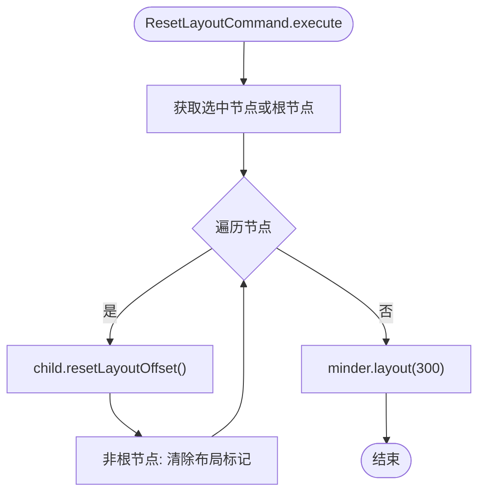
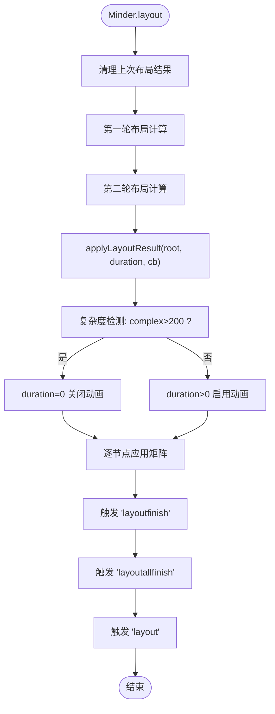
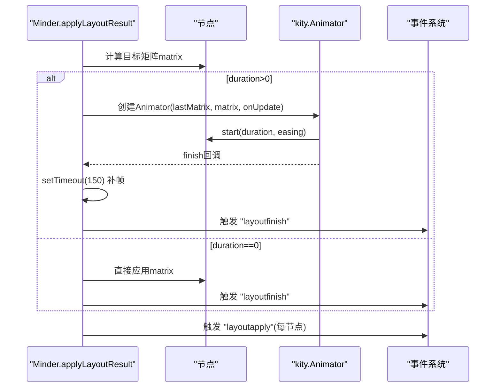
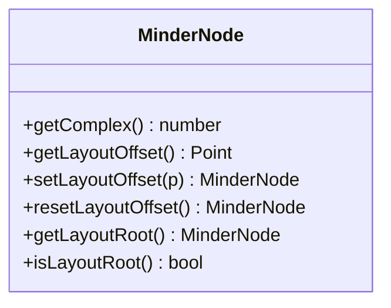
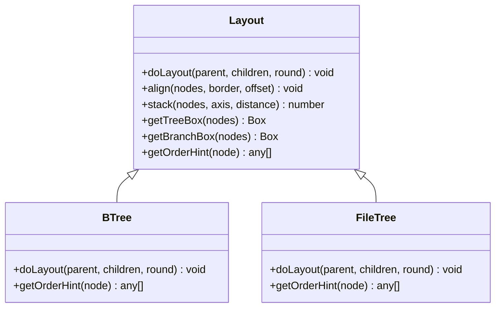
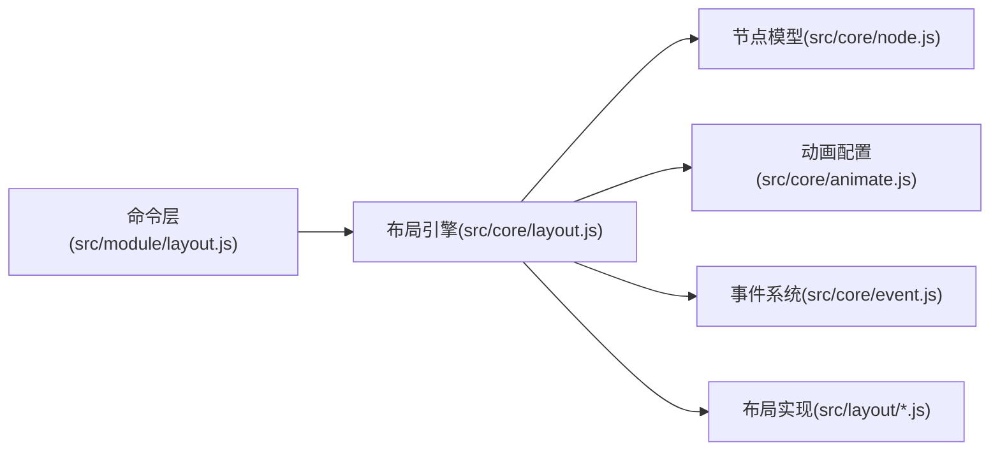

# 布局切换与动画

<cite>
**本文引用的文件**
- [src/module/layout.js](file://src/module/layout.js)
- [src/core/layout.js](file://src/core/layout.js)
- [src/core/animate.js](file://src/core/animate.js)
- [src/core/command.js](file://src/core/command.js)
- [src/core/event.js](file://src/core/event.js)
- [src/core/node.js](file://src/core/node.js)
- [src/layout/btree.js](file://src/layout/btree.js)
- [src/layout/filetree.js](file://src/layout/filetree.js)
</cite>

## 目录
1. [引言](#引言)
2. [项目结构](#项目结构)
3. [核心组件](#核心组件)
4. [架构总览](#架构总览)
5. [详细组件分析](#详细组件分析)
6. [依赖关系分析](#依赖关系分析)
7. [性能考量](#性能考量)
8. [故障排查指南](#故障排查指南)
9. [结论](#结论)
10. [附录](#附录)

## 引言
本文件围绕“布局切换机制与动画系统”的实现进行系统化说明，重点覆盖：
- 通过 LayoutCommand 命令实现布局切换的执行路径，特别是 node.layout(name) 的调用链路；
- ResetLayoutCommand 的重置逻辑及其在清除布局偏移中的作用；
- 核心布局引擎在 src/core/layout.js 中的 layout() 与 applyLayoutResult() 方法，解释布局计算与结果应用的分离设计；
- 动画性能优化策略：当节点数超过阈值时自动关闭动画，避免页面卡顿；
- apply() 函数中 kity.Animator 的使用方式，包括动画创建、启动与完成回调处理，以及在低性能设备上的补帧容错；
- 结合 Minder 事件系统，说明 'layoutapply'、'layoutfinish'、'layoutallfinish' 等事件的触发时机与监听方法；
- 自定义动画时长的配置方式（layoutAnimationDuration 选项）与大规模数据场景的最佳实践。

## 项目结构
本项目采用模块化组织，布局相关的核心代码集中在以下位置：
- 模块层：命令与菜单入口位于 src/module/layout.js，负责将用户操作映射为具体的布局命令；
- 核心层：布局引擎与动画控制位于 src/core/layout.js 与 src/core/animate.js，提供布局计算、结果应用与动画配置；
- 节点模型：src/core/node.js 提供节点复杂度统计、布局偏移存储与矩阵变换等能力；
- 布局实现：src/layout/*.js 定义多种具体布局算法（如二叉树、文件树等）；
- 事件系统：src/core/event.js 提供统一的事件注册、分发与监听机制。

图表来源
- [src/module/layout.js](file://src/module/layout.js#L1-L92)
- [src/core/layout.js](file://src/core/layout.js#L1-L524)
- [src/core/animate.js](file://src/core/animate.js#L1-L43)
- [src/core/event.js](file://src/core/event.js#L1-L270)
- [src/core/node.js](file://src/core/node.js#L1-L407)
- [src/layout/btree.js](file://src/layout/btree.js#L1-L143)
- [src/layout/filetree.js](file://src/layout/filetree.js#L1-L89)

章节来源
- [src/module/layout.js](file://src/module/layout.js#L1-L92)
- [src/core/layout.js](file://src/core/layout.js#L1-L524)
- [src/core/animate.js](file://src/core/animate.js#L1-L43)
- [src/core/event.js](file://src/core/event.js#L1-L270)
- [src/core/node.js](file://src/core/node.js#L1-L407)
- [src/layout/btree.js](file://src/layout/btree.js#L1-L143)
- [src/layout/filetree.js](file://src/layout/filetree.js#L1-L89)

## 核心组件
- 命令层（LayoutCommand/ResetLayoutCommand）
  - LayoutCommand：将选中节点的布局设置为指定名称，并触发布局计算；
  - ResetLayoutCommand：重置选中节点或根节点的布局偏移与布局标记，随后触发一次布局动画。
- 布局引擎（Minder.layout/applyLayoutResult）
  - layout()：两轮布局计算，清空上次结果，调用 applyLayoutResult() 应用结果并触发事件；
  - applyLayoutResult()：根据节点复杂度动态决定是否启用动画，逐节点应用矩阵变换并触发事件。
- 动画配置（animate.js）
  - 默认动画时长与开关控制，支持运行期启用/禁用动画。
- 节点模型（node.js）
  - 提供 getComplex() 统计节点数量，用于复杂度检测；
  - 提供布局偏移的读写与重置接口，支撑布局重置逻辑。
- 布局实现（layout/*.js）
  - 多种具体布局算法，如二叉树、文件树等，均通过 Layout.register 注册。

章节来源
- [src/module/layout.js](file://src/module/layout.js#L1-L92)
- [src/core/layout.js](file://src/core/layout.js#L1-L524)
- [src/core/animate.js](file://src/core/animate.js#L1-L43)
- [src/core/node.js](file://src/core/node.js#L1-L407)
- [src/layout/btree.js](file://src/layout/btree.js#L1-L143)
- [src/layout/filetree.js](file://src/layout/filetree.js#L1-L89)

## 架构总览
下图展示了从用户触发到布局动画完成的端到端流程，包括命令执行、布局计算、结果应用与事件触发。

图表来源
- [src/module/layout.js](file://src/module/layout.js#L1-L92)
- [src/core/layout.js](file://src/core/layout.js#L1-L524)
- [src/core/animate.js](file://src/core/animate.js#L1-L43)
- [src/core/event.js](file://src/core/event.js#L1-L270)
- [src/core/node.js](file://src/core/node.js#L1-L407)

## 详细组件分析

### 命令层：LayoutCommand 与 ResetLayoutCommand
- LayoutCommand.execute
  - 获取当前选中节点列表，逐个调用 node.layout(name)，从而进入布局计算流程。
- ResetLayoutCommand.execute
  - 若无选中节点，则使用根节点作为目标；
  - 遍历目标节点子树，调用 child.resetLayoutOffset() 清除布局偏移；
  - 对非根节点清除布局标记（setData('layout', null)）；
  - 最后调用 minder.layout(300) 触发一次带动画的布局刷新。

图表来源
- [src/module/layout.js](file://src/module/layout.js#L1-L92)

章节来源
- [src/module/layout.js](file://src/module/layout.js#L1-L92)

### 核心布局引擎：Minder.layout 与 applyLayoutResult
- Minder.layout
  - 清理上次布局结果（重置节点布局变换）；
  - 两轮布局计算：先计算子节点，再计算父节点，确保父子关系正确；
  - 调用 applyLayoutResult(root, duration, callback) 应用结果，并在全部完成后触发 'layoutallfinish'；
  - 最终触发 'layout' 事件表示本次布局开始。
- applyLayoutResult(root, duration, callback)
  - 通过 root.getComplex() 获取节点复杂度；
  - 当复杂度大于阈值时，将 duration 设为 0 关闭动画；
  - 对每个节点：
    - 计算全局矩阵：合并父矩阵、子节点布局变换与布局偏移；
    - 若存在动画，创建 kity.Animator 并启动，完成回调中补帧并触发 'layoutfinish'；
    - 若无动画，直接应用矩阵并触发 'layoutfinish'；
  - 递归应用到所有子节点；
  - 在回调中触发 'layoutallfinish'，保证外部监听能收到最终完成信号。

图表来源
- [src/core/layout.js](file://src/core/layout.js#L1-L524)

章节来源
- [src/core/layout.js](file://src/core/layout.js#L1-L524)

### 动画系统：kity.Animator 使用与容错机制
- 动画创建与启动
  - 当 duration > 0 时，为每个节点创建 kity.Animator(lastMatrix, targetMatrix, onUpdate)；
  - 通过 .start(node, duration, easing) 启动动画；
  - 在 finish 回调中，使用 setTimeout(150ms) 进行补帧，确保在低性能设备上也能稳定完成动画。
- 容错与同步
  - 在复杂度高且无动画的情况下，applyLayoutResult 内部通过 setTimeout(0) 将 'layoutallfinish' 放入消息队列，避免事件未被提前录入导致的监听缺失问题。

图表来源
- [src/core/layout.js](file://src/core/layout.js#L1-L524)

章节来源
- [src/core/layout.js](file://src/core/layout.js#L1-L524)

### 节点模型：复杂度与布局偏移
- getComplex()
  - 通过遍历统计子树节点总数，用于复杂度检测；
- 布局偏移
  - setLayoutOffset()/resetLayoutOffset()：保存/清除相对于父节点的布局偏移；
  - getLayoutOffset()：读取对应布局的偏移；
  - getLayoutRoot()/isLayoutRoot()：判断布局根节点，支撑布局层级控制。

图表来源
- [src/core/node.js](file://src/core/node.js#L1-L407)

章节来源
- [src/core/node.js](file://src/core/node.js#L1-L407)

### 布局实现：二叉树与文件树
- 二叉树布局（btree）
  - 支持四个方向（left/right/top/bottom），通过 align/stack 计算子节点排列与对齐；
  - 通过 setVertexIn/setVertexOut 与 setLayoutVectorIn/setLayoutVectorOut 描述连接点与方向。
- 文件树布局（filetree）
  - 支持向上/向下两种方向，按层级缩进与堆叠计算位置；
  - 提供 getOrderHint 用于排序提示区域。

图表来源
- [src/core/layout.js](file://src/core/layout.js#L1-L524)
- [src/layout/btree.js](file://src/layout/btree.js#L1-L143)
- [src/layout/filetree.js](file://src/layout/filetree.js#L1-L89)

章节来源
- [src/layout/btree.js](file://src/layout/btree.js#L1-L143)
- [src/layout/filetree.js](file://src/layout/filetree.js#L1-L89)

## 依赖关系分析
- 命令层依赖核心布局引擎与节点模型，通过 node.layout(name) 触发布局计算；
- 核心布局引擎依赖动画配置与事件系统，用于控制动画时长与事件分发；
- 布局实现依赖布局基类，通过 register 注册到全局布局表；
- 节点模型提供复杂度统计与布局偏移存取，支撑重置与计算。

图表来源
- [src/module/layout.js](file://src/module/layout.js#L1-L92)
- [src/core/layout.js](file://src/core/layout.js#L1-L524)
- [src/core/animate.js](file://src/core/animate.js#L1-L43)
- [src/core/event.js](file://src/core/event.js#L1-L270)
- [src/core/node.js](file://src/core/node.js#L1-L407)
- [src/layout/btree.js](file://src/layout/btree.js#L1-L143)
- [src/layout/filetree.js](file://src/layout/filetree.js#L1-L89)

章节来源
- [src/module/layout.js](file://src/module/layout.js#L1-L92)
- [src/core/layout.js](file://src/core/layout.js#L1-L524)
- [src/core/animate.js](file://src/core/animate.js#L1-L43)
- [src/core/event.js](file://src/core/event.js#L1-L270)
- [src/core/node.js](file://src/core/node.js#L1-L407)
- [src/layout/btree.js](file://src/layout/btree.js#L1-L143)
- [src/layout/filetree.js](file://src/layout/filetree.js#L1-L89)

## 性能考量
- 自动降级策略
  - 当节点复杂度超过阈值（>200）时，applyLayoutResult 将 duration 设为 0，直接应用矩阵，避免动画带来的卡顿；
- 动画容错
  - 在动画 finish 回调中使用 setTimeout(150ms) 补帧，确保低性能设备上动画完成；
  - 在无动画场景下，通过 setTimeout(0ms) 将 'layoutallfinish' 放入消息队列，保证事件监听可被提前录入。
- 动画时长配置
  - 通过 layoutAnimationDuration 控制布局动画时长，默认值由 animate.js 初始化；
  - 可在运行期通过 disableAnimation/enableAnimation 切换全局动画状态。

章节来源
- [src/core/layout.js](file://src/core/layout.js#L1-L524)
- [src/core/animate.js](file://src/core/animate.js#L1-L43)

## 故障排查指南
- 事件未触发或监听不到
  - 在复杂度高且无动画时，'layoutallfinish' 通过 setTimeout(0) 触发，若监听注册较晚，需确认监听顺序；
  - 确认已监听 'layoutapply'/'layoutfinish'/'layoutallfinish' 三个事件。
- 动画卡顿或不流畅
  - 检查节点复杂度是否超过阈值，必要时降低布局复杂度或关闭动画；
  - 调整 layoutAnimationDuration 以适配设备性能。
- 布局偏移异常
  - 使用 ResetLayoutCommand 重置布局偏移，确保后续布局不受历史偏移影响；
  - 确认节点布局标记（layout）与父节点布局一致。

章节来源
- [src/core/layout.js](file://src/core/layout.js#L1-L524)
- [src/module/layout.js](file://src/module/layout.js#L1-L92)
- [src/core/event.js](file://src/core/event.js#L1-L270)

## 结论
本系统通过命令层、布局引擎与动画配置的协同，实现了灵活而高效的布局切换与动画体验。其关键特性包括：
- 命令驱动的布局切换，简洁直观；
- 布局计算与结果应用分离，便于扩展与维护；
- 基于节点复杂度的自动降级策略，保障大规模数据场景下的流畅性；
- 事件系统贯穿布局生命周期，便于外部集成与监控；
- 动画容错与补帧机制，提升跨设备兼容性。

## 附录
- 自定义动画时长
  - 通过设置 layoutAnimationDuration 选项控制布局动画时长；
  - 运行期可通过 disableAnimation/enableAnimation 切换全局动画状态。
- 最佳实践（大规模数据）
  - 优先选择简单布局（如 filetree），减少节点复杂度；
  - 在大数据场景下建议关闭动画或增大阈值，避免卡顿；
  - 使用 ResetLayoutCommand 清理历史偏移，确保布局一致性。

章节来源
- [src/core/animate.js](file://src/core/animate.js#L1-L43)
- [src/core/layout.js](file://src/core/layout.js#L1-L524)
- [src/module/layout.js](file://src/module/layout.js#L1-L92)