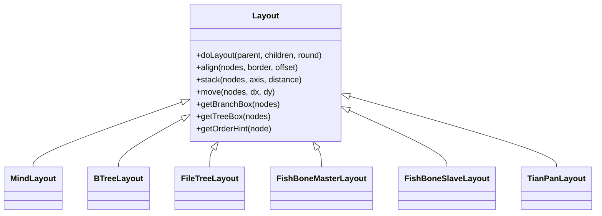
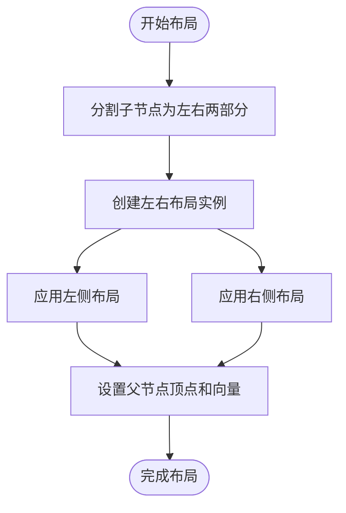
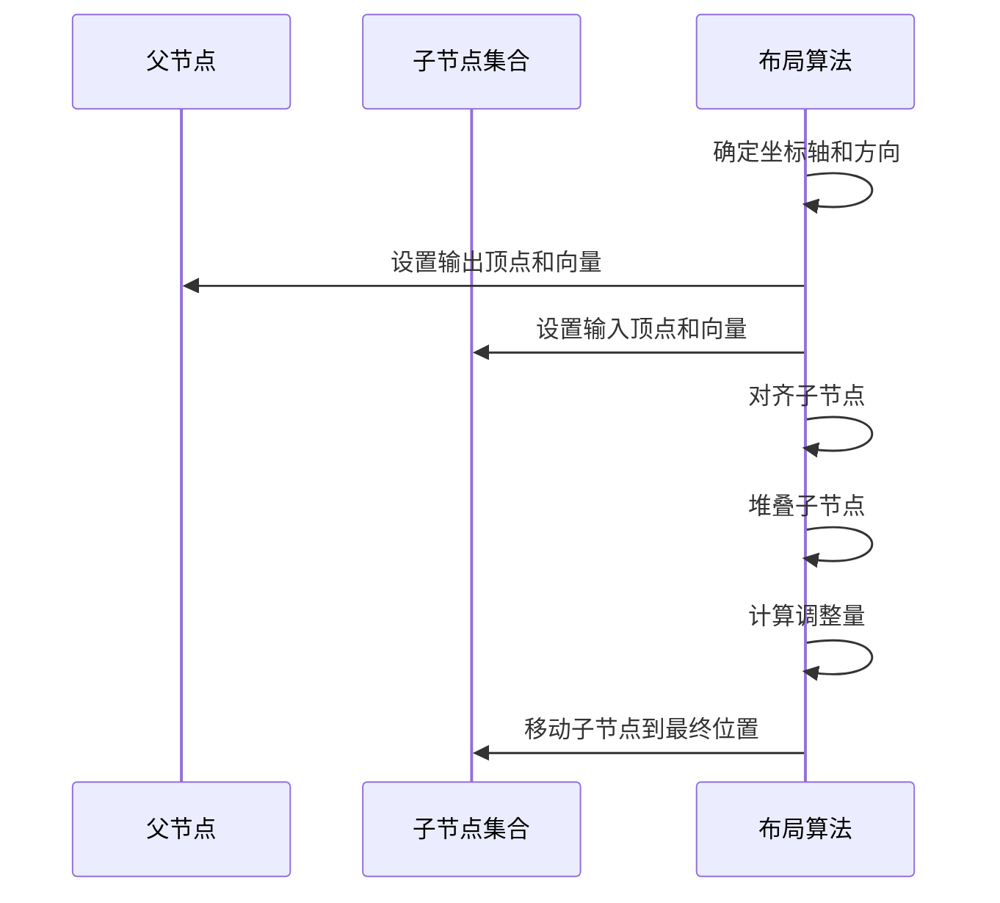
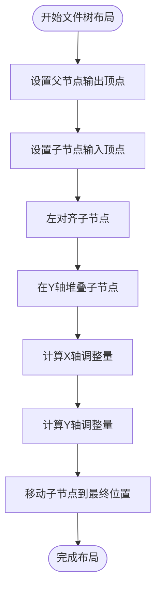
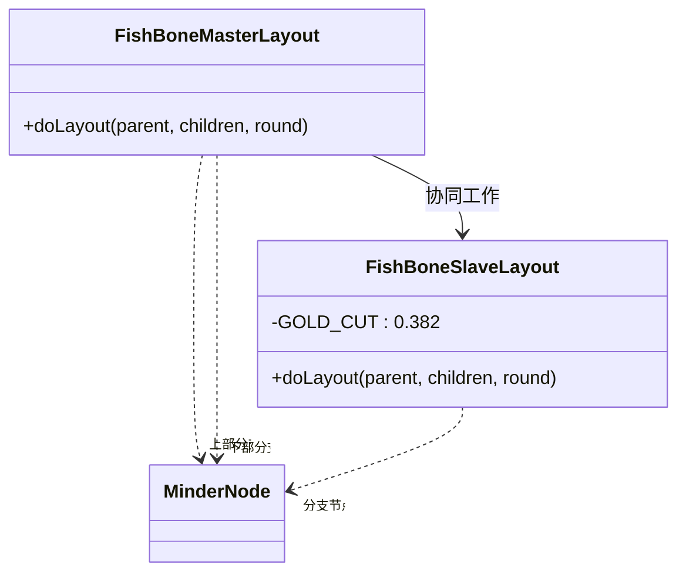
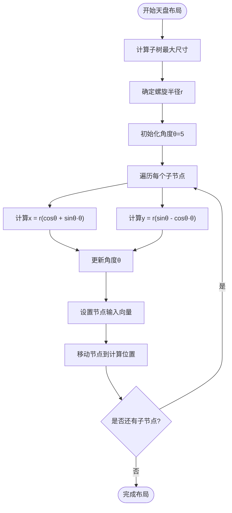

# 布局算法

<cite>
**本文档中引用的文件**   
- [mind.js](file://src/layout/mind.js)
- [btree.js](file://src/layout/btree.js)
- [filetree.js](file://src/layout/filetree.js)
- [fish-bone-master.js](file://src/layout/fish-bone-master.js)
- [fish-bone-slave.js](file://src/layout/fish-bone-slave.js)
- [tianpan.js](file://src/layout/tianpan.js)
- [layout.js](file://src/core/layout.js)
- [fish-bone-master.js](file://src/connect/fish-bone-master.js)
- [tianpan.js](file://src/template/tianpan.js)
- [tianpan.js](file://src/theme/tianpan.js)
- [fish.js](file://src/theme/fish.js)
</cite>

## 目录
1. [引言](#引言)
2. [布局基类设计](#布局基类设计)
3. [思维导图布局](#思维导图布局)
4. [二叉树布局](#二叉树布局)
5. [文件树布局](#文件树布局)
6. [鱼骨图布局](#鱼骨图布局)
7. [天盘布局](#天盘布局)
8. [布局算法对比与应用场景](#布局算法对比与应用场景)
9. [常见问题与性能优化](#常见问题与性能优化)
10. [结论](#结论)

## 引言
本文深入解析kityminder-core中各种布局算法的实现原理与技术细节。我们将详细阐述思维导图、二叉树、文件树、鱼骨图和天盘等布局算法的核心机制，包括它们的递归计算策略、节点定位方法和视觉呈现特点。通过分析源码实现，揭示每种布局算法如何协调节点位置、控制间距并实现特定的视觉效果。

## 布局基类设计

kityminder-core中的布局系统基于一个统一的基类设计，所有具体布局算法都继承自`Layout`基类。该基类定义了布局计算的核心接口和通用工具方法。

**Diagram sources**
- [layout.js](file://src/core/layout.js#L20-L168)

**Section sources**
- [layout.js](file://src/core/layout.js#L1-L524)

## 思维导图布局

思维导图布局（mind.js）采用左右子树平衡策略实现对称排布。该算法通过将节点的子节点分为左右两部分，分别应用不同的布局实例来实现平衡。

算法首先计算子节点数量的一半作为分界点，然后将索引小于该值的子节点分配给右侧，其余分配给左侧。接着创建左右两个布局实例（'left'和'right'），分别对左右子树执行布局计算。

在位置计算方面，算法通过`getContentBox()`获取节点内容区域，并设置输出顶点（vertexOut）和布局向量（layoutVectorOut）来定义连接点。这种设计确保了父节点与子节点之间的连接线能够正确绘制。

**Diagram sources**
- [mind.js](file://src/layout/mind.js#L6-L29)

**Section sources**
- [mind.js](file://src/layout/mind.js#L1-L62)

## 二叉树布局

二叉树布局（btree.js）实现了四种方向的布局：左、右、上、下。该算法采用递归节点定位策略，通过`registerLayoutForDirection`函数为每个方向注册相应的布局实例。

布局计算过程中，首先根据布局方向确定坐标轴（x或y轴）和方向因子。然后设置父节点的输出顶点和布局向量，定义连接线的起点。对于子节点，算法设置输入顶点和输入向量，确定连接线的终点。

关键的布局协调通过`align`和`stack`方法实现。`align`方法用于对齐节点，`stack`方法用于沿指定轴堆叠节点。最后通过`move`方法将所有子节点移动到计算好的位置，考虑了父节点和子节点的外边距设置。

**Diagram sources**
- [btree.js](file://src/layout/btree.js#L78-L138)

**Section sources**
- [btree.js](file://src/layout/btree.js#L1-L143)

## 文件树布局

文件树布局（filetree.js）采用垂直堆叠方式实现树形结构的对齐策略。该布局支持向上和向下两种方向，通过`registerLayoutForDir`函数注册。

算法首先设置父节点的输出顶点位置，通常在左侧加上缩进值，然后根据方向因子确定在顶部还是底部。子节点的输入顶点设置在左侧中心位置，确保连接线从左侧进入。

布局协调方面，使用`align`方法将所有子节点左对齐，`stack`方法在y轴上堆叠。位置调整时考虑了父节点的右边距和子节点的左边距，确保适当的间距。对于向上布局，还需要特殊处理y轴的调整量，以正确计算堆叠位置。

**Diagram sources**
- [filetree.js](file://src/layout/filetree.js#L10-L51)

**Section sources**
- [filetree.js](file://src/layout/filetree.js#L1-L89)

## 鱼骨图布局

鱼骨图布局由主干布局（fish-bone-master.js）和分支布局（fish-bone-slave.js）两部分组成，实现主干与分支的协调机制。

主干布局将子节点按奇偶索引分为上下两部分，奇数索引的节点放在下部，偶数索引的节点放在上部。每个部分的节点设置不同的输入向量：上部节点向量为(1,-1)，下部节点向量为(1,1)，形成对角线连接效果。

分支布局采用黄金分割比例确定连接点位置，通过`GOLD_CUT`常量（1-0.618）计算x坐标。根据输入向量的y分量正负决定连接点在顶部还是底部。第二轮布局时还会进行额外的位置微调，确保分支节点与主干的对齐。

**Diagram sources**
- [fish-bone-master.js](file://src/layout/fish-bone-master.js#L14-L65)
- [fish-bone-slave.js](file://src/layout/fish-bone-slave.js#L14-L71)

**Section sources**
- [fish-bone-master.js](file://src/layout/fish-bone-master.js#L1-L68)
- [fish-bone-slave.js](file://src/layout/fish-bone-slave.js#L1-L72)
- [fish-bone-master.js](file://src/connect/fish-bone-master.js#L1-L33)

## 天盘布局

天盘布局（tianpan.js）采用环形排列算法，通过极坐标转换实现独特的视觉效果。算法首先计算所有子树的最大尺寸，以此为基础确定螺旋半径。

核心算法使用阿基米德螺旋线公式：x = r(cosθ + sinθ·θ)，y = r(sinθ - cosθ·θ)。角度θ从5开始，每次迭代增加递减的增量（0.9 - index×0.02），形成逐渐展开的螺旋效果。

半径计算考虑了节点内容框的尺寸，取最大宽度或高度作为基础值，然后除以1.5π得到合适的螺旋半径。每个子节点设置相同的输入顶点（父节点中心），但通过不同的平移量实现环形分布。

**Diagram sources**
- [tianpan.js](file://src/layout/tianpan.js#L14-L41)

**Section sources**
- [tianpan.js](file://src/layout/tianpan.js#L1-L76)
- [tianpan.js](file://src/template/tianpan.js#L1-L29)
- [tianpan.js](file://src/theme/tianpan.js#L1-L75)

## 布局算法对比与应用场景

不同布局算法适用于不同的思维组织方式和视觉需求：

| 布局类型 | 视觉效果 | 适用场景 | 特点 |
|---------|--------|--------|------|
| **思维导图布局** | 左右对称平衡 | 通用思维导图 | 层次清晰，平衡美观 |
| **二叉树布局** | 单向延伸 | 组织结构图 | 方向明确，简洁高效 |
| **文件树布局** | 垂直堆叠 | 文件目录结构 | 类似资源管理器，直观易懂 |
| **鱼骨图布局** | 主干分支结构 | 因果分析、问题分解 | 突出主次关系，逻辑清晰 |
| **天盘布局** | 环形螺旋 | 创意发散、中心主题 | 视觉冲击力强，创意表达 |

每种布局都有其独特的视觉语言和适用场景。思维导图布局适合大多数常规用途，二叉树布局适合线性组织结构，文件树布局适合表示层级文件系统，鱼骨图布局适合分析因果关系，天盘布局则适合创意发散和中心主题的表达。

## 常见问题与性能优化

在实际使用中，可能会遇到节点重叠、布局错位等常见问题。这些问题通常由以下原因引起：

1. **样式设置不当**：节点的内外边距、填充等样式设置不合理
2. **内容尺寸变化**：节点内容动态变化导致布局计算不准确
3. **多轮布局协调**：第二轮布局的微调未能正确执行

性能优化建议：
- 对于大型思维导图（节点数>200），系统会自动关闭动画以提升性能
- 合理使用`getTreeBox`和`getBranchBox`等工具方法，避免重复计算
- 在布局计算中尽量减少DOM操作，批量应用变换矩阵
- 利用`getGlobalLayoutTransformPreview`进行预览计算，减少重绘

通过合理配置主题样式（如`fish.js`和`tianpan.js`中的设置），可以进一步优化视觉效果和布局性能。

## 结论
kityminder-core的布局系统采用模块化设计，通过基类提供通用功能，各具体布局实现特定算法。从思维导图的对称平衡到天盘布局的环形螺旋，每种算法都体现了精心的设计考量。理解这些布局算法的实现原理，不仅有助于更好地使用kityminder-core，也为开发自定义布局提供了参考范例。通过合理选择和配置布局算法，可以创建出既美观又实用的思维导图应用。