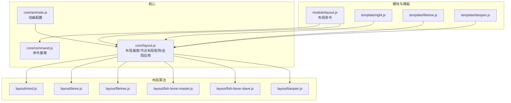
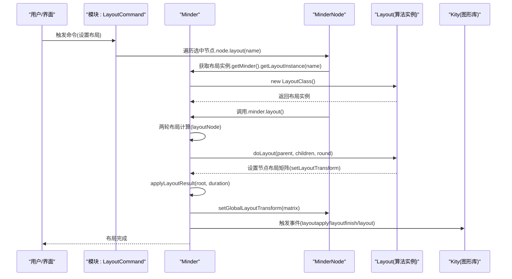
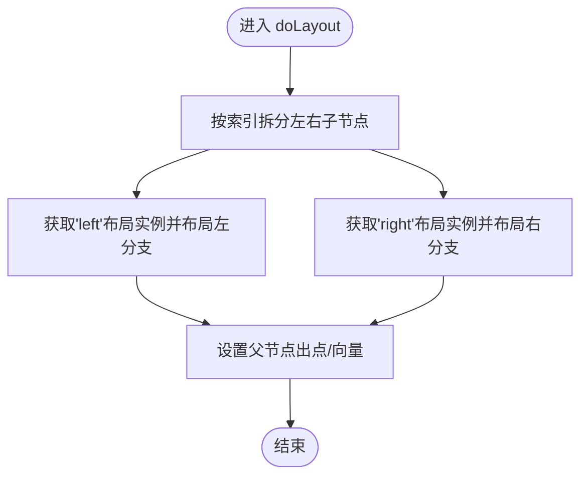
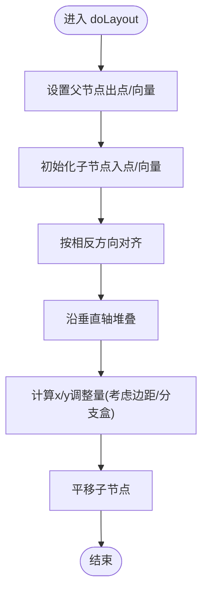
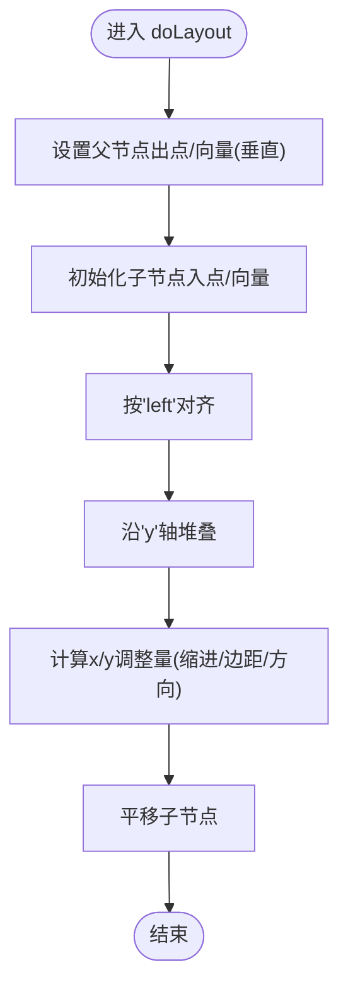
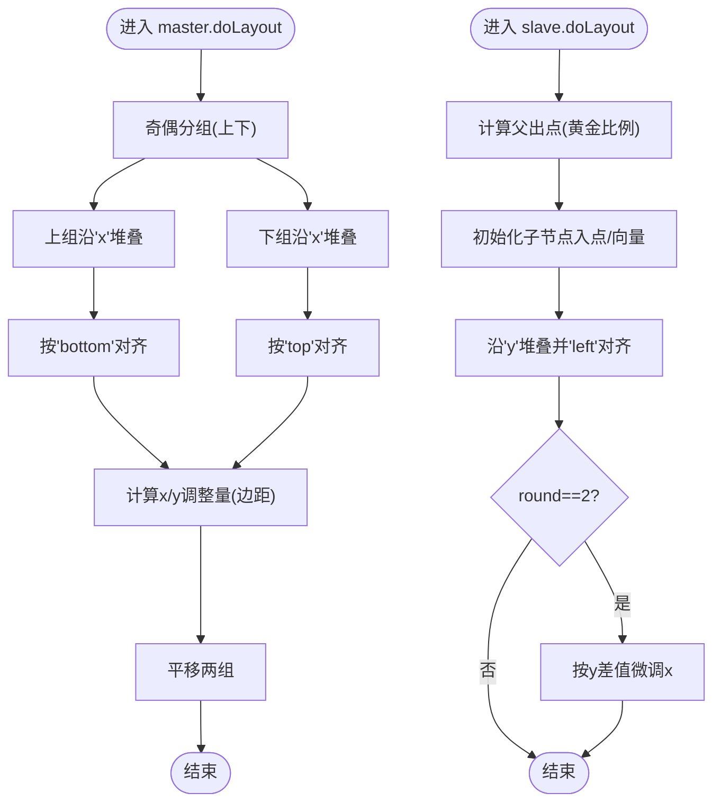
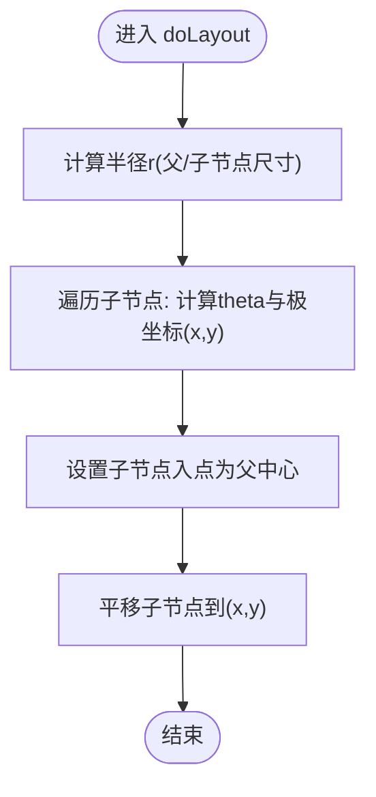
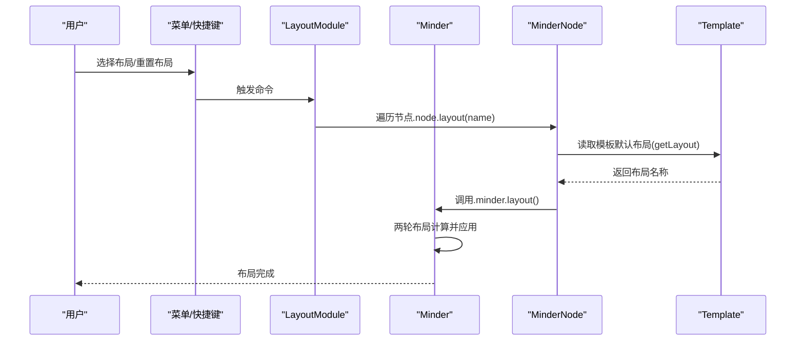
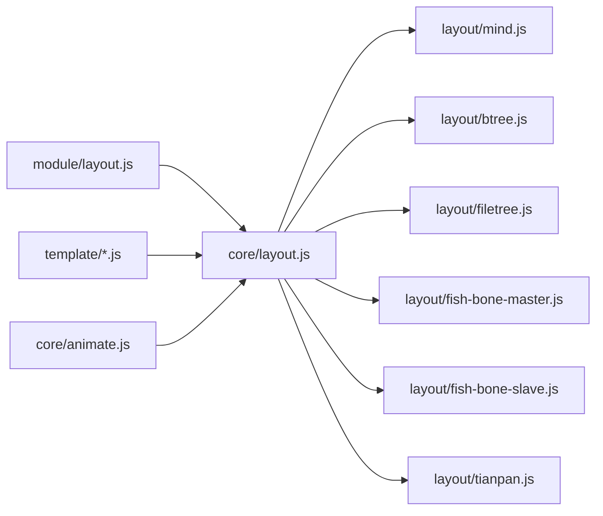

# 布局系统

<cite>
**本文引用的文件**
- [src/core/layout.js](file://src/core/layout.js)
- [src/layout/mind.js](file://src/layout/mind.js)
- [src/layout/btree.js](file://src/layout/btree.js)
- [src/layout/filetree.js](file://src/layout/filetree.js)
- [src/layout/fish-bone-master.js](file://src/layout/fish-bone-master.js)
- [src/layout/fish-bone-slave.js](file://src/layout/fish-bone-slave.js)
- [src/layout/tianpan.js](file://src/layout/tianpan.js)
- [src/module/layout.js](file://src/module/layout.js)
- [src/core/command.js](file://src/core/command.js)
- [src/core/animate.js](file://src/core/animate.js)
- [src/template/right.js](file://src/template/right.js)
- [src/template/filetree.js](file://src/template/filetree.js)
- [src/template/tianpan.js](file://src/template/tianpan.js)
- [doc/Architecture.md](file://doc/Architecture.md)
</cite>

## 目录
1. [简介](#简介)
2. [项目结构](#项目结构)
3. [核心组件](#核心组件)
4. [架构总览](#架构总览)
5. [详细组件分析](#详细组件分析)
6. [依赖分析](#依赖分析)
7. [性能考量](#性能考量)
8. [故障排查指南](#故障排查指南)
9. [结论](#结论)
10. [附录](#附录)

## 简介
本文件系统性介绍 KityMinder 的布局系统，围绕 Layout 基类的设计原理、布局算法注册机制、各布局算法的工作流程与坐标影响、通过命令系统实现布局切换、布局动画的性能优化策略，以及自定义布局开发指南。同时结合 Architecture.md 中的布局实现情况，说明不同布局对节点坐标（x,y）的影响，并提供常见问题的解决方案。

## 项目结构
布局系统主要分布在以下模块：
- 核心布局基类与节点/全局布局矩阵管理：src/core/layout.js
- 具体布局算法实现：src/layout/*.js
- 布局命令与模块：src/module/layout.js
- 命令基类：src/core/command.js
- 动画配置与开关：src/core/animate.js
- 模板与布局绑定：src/template/*.js
- 架构说明文档：doc/Architecture.md

图表来源
- [src/core/layout.js](file://src/core/layout.js#L1-L120)
- [src/layout/mind.js](file://src/layout/mind.js#L1-L62)
- [src/layout/btree.js](file://src/layout/btree.js#L1-L143)
- [src/layout/filetree.js](file://src/layout/filetree.js#L1-L89)
- [src/layout/fish-bone-master.js](file://src/layout/fish-bone-master.js#L1-L68)
- [src/layout/fish-bone-slave.js](file://src/layout/fish-bone-slave.js#L1-L72)
- [src/layout/tianpan.js](file://src/layout/tianpan.js#L1-L76)
- [src/module/layout.js](file://src/module/layout.js#L1-L92)
- [src/core/command.js](file://src/core/command.js#L1-L169)
- [src/core/animate.js](file://src/core/animate.js#L1-L43)
- [src/template/right.js](file://src/template/right.js#L1-L23)
- [src/template/filetree.js](file://src/template/filetree.js#L1-L28)
- [src/template/tianpan.js](file://src/template/tianpan.js#L1-L29)

章节来源
- [doc/Architecture.md](file://doc/Architecture.md#L434-L470)

## 核心组件
- 布局基类 Layout
  - 定义抽象 doLayout(parent, children, round) 接口，子类需实现具体算法。
  - 提供对齐 align、堆叠 stack、平移 move、树盒 getTreeBox、分支盒 getBranchBox 等工具方法。
  - 提供 getOrderHint 用于排序提示区域。
- 节点布局矩阵
  - MinderNode 提供 get/setLayoutTransform、get/setGlobalLayoutTransform、get/setLayoutOffset 等方法，维护节点的局部与全局布局矩阵。
  - 节点坐标（x,y）由全局布局矩阵决定，最终通过 setGlobalLayoutTransform 应用到渲染容器。
- 布局调度与应用
  - Minder.layout() 两轮布局计算，随后调用 applyLayoutResult() 将矩阵应用到节点并触发动画或同步更新。
  - applyLayoutResult() 根据节点复杂度（>200）自动关闭动画，保证性能。

章节来源
- [src/core/layout.js](file://src/core/layout.js#L17-L168)
- [src/core/layout.js](file://src/core/layout.js#L196-L384)
- [src/core/layout.js](file://src/core/layout.js#L391-L520)

## 架构总览
布局系统采用“基类 + 多算法 + 命令 + 模板”的分层设计：
- 基类负责统一接口、工具方法与全局应用流程。
- 算法通过 Layout.register(name, Class) 注册，按名称在节点上动态选择。
- 命令模块提供布局切换与重置能力。
- 模板根据节点层级与数据决定默认布局与连线类型。

图表来源
- [src/module/layout.js](file://src/module/layout.js#L25-L45)
- [src/core/layout.js](file://src/core/layout.js#L391-L520)
- [src/core/layout.js](file://src/core/layout.js#L170-L191)

章节来源
- [src/module/layout.js](file://src/module/layout.js#L1-L92)
- [src/core/layout.js](file://src/core/layout.js#L391-L520)

## 详细组件分析

### 布局基类与注册机制
- 注册机制
  - Layout.register(name, LayoutClass) 将布局类登记到全局表，并记录默认布局名称。
  - Minder.getLayoutInstance(name) 创建布局实例；Minder.getLayoutList() 返回已注册布局列表。
- 布局算法接口
  - doLayout(parent, children, round)：子类实现，计算子节点的相对父节点的布局变换矩阵。
  - getOrderHint(node)：返回排序提示区域，用于插入/移动时的视觉反馈。
- 节点布局矩阵
  - get/setLayoutTransform：节点相对父节点的布局矩阵。
  - get/setGlobalLayoutTransform：节点全局布局矩阵，最终应用到渲染容器。
  - get/setLayoutOffset：针对特定父布局的额外偏移，用于微调连接点或对齐。
- 工具方法
  - align(nodes, border, offset)：按边对齐。
  - stack(nodes, axis, distance)：沿 x 或 y 轴堆叠，考虑边距累加。
  - move(nodes, dx, dy)：平移节点。
  - getTreeBox/getBranchBox：计算子树/分支的包围盒，用于对齐与堆叠。

章节来源
- [src/core/layout.js](file://src/core/layout.js#L12-L168)
- [src/core/layout.js](file://src/core/layout.js#L170-L191)
- [src/core/layout.js](file://src/core/layout.js#L196-L384)
- [src/core/layout.js](file://src/core/layout.js#L391-L520)

### 思维导图布局（mind.js）
- 策略概述
  - 将子节点按索引拆分为左右两组，分别委托给 left/right 布局实例计算，实现左右分支的平衡与对称。
  - 设置父节点的出点与向量，用于连接线起点与方向。
- 关键步骤
  - 拆分 children 为 left/right 两组。
  - 获取 left/right 布局实例并分别调用 doLayout。
  - 设置父节点顶点与向量，便于连接。
- 坐标影响
  - 通过左右布局的 stack/align 计算相对位置，最终由 applyLayoutResult 合并到全局矩阵，影响节点 x/y 坐标。

图表来源
- [src/layout/mind.js](file://src/layout/mind.js#L9-L29)

章节来源
- [src/layout/mind.js](file://src/layout/mind.js#L1-L62)

### 二叉树布局（btree.js）
- 方向支持
  - 为 left/right/top/bottom 四个方向注册布局，分别对应水平/垂直的二叉树分支。
- 算法要点
  - 父节点设置出点与向量，指向子节点方向。
  - 子节点设置入点与向量，确保连接线方向一致。
  - 使用 align 对齐到相反方向，使用 stack 沿垂直轴堆叠。
  - 计算 x/y 调整量，综合父/子节点边距与分支盒尺寸，最终平移。
- 坐标影响
  - 通过 stack/align 与 move 计算相对坐标，最终合并到全局矩阵，影响节点 x/y。

图表来源
- [src/layout/btree.js](file://src/layout/btree.js#L82-L138)

章节来源
- [src/layout/btree.js](file://src/layout/btree.js#L1-L143)

### 文件树布局（filetree.js）
- 方向支持
  - 注册 filetree-up 与 filetree-down 两种方向。
- 算法要点
  - 父节点设置出点与向量，指向垂直方向（上/下）。
  - 子节点设置入点与向量，保持水平对齐。
  - 使用 align('left') 与 stack('y') 垂直堆叠。
  - 计算 x/y 调整量，考虑缩进、父/子边距与方向。
- 坐标影响
  - 垂直堆叠与边距累加决定 y 坐标；x 坐标受缩进与对齐影响。

图表来源
- [src/layout/filetree.js](file://src/layout/filetree.js#L13-L51)

章节来源
- [src/layout/filetree.js](file://src/layout/filetree.js#L1-L89)

### 鱼骨图布局（fish-bone-master.js / fish-bone-slave.js）
- 主干布局（master）
  - 将子节点按奇偶分到上下两组，分别沿 x 轴堆叠。
  - 对上/下两组分别对齐到父节点的顶部/底部，形成主干与分支协调。
  - 计算 x/y 调整量，考虑父/子边距。
- 分支布局（slave）
  - 使用黄金比例切分点确定父节点出点，向量沿父节点入向量方向延伸。
  - 子节点沿 y 轴堆叠，按 left 对齐。
  - 在第二轮（round==2）时，根据父出点与子入点的 y 差值进行横向微调，使连接更顺滑。
- 坐标影响
  - master 通过堆叠与对齐影响 x/y；slave 通过堆叠与微调影响 x/y。

图表来源
- [src/layout/fish-bone-master.js](file://src/layout/fish-bone-master.js#L17-L65)
- [src/layout/fish-bone-slave.js](file://src/layout/fish-bone-slave.js#L17-L70)

章节来源
- [src/layout/fish-bone-master.js](file://src/layout/fish-bone-master.js#L1-L68)
- [src/layout/fish-bone-slave.js](file://src/layout/fish-bone-slave.js#L1-L72)

### 天盘布局（tianpan.js）
- 算法要点
  - 计算半径 r，综合父节点尺寸与子节点树盒尺寸，避免重叠。
  - 使用螺旋参数 theta 与极坐标公式计算每个子节点的 x/y 偏移，按顺序递增 theta。
  - 设置子节点入点为父节点中心，向量为朝向父节点中心的方向，便于连接。
- 坐标影响
  - 螺旋式分布决定节点 x/y 坐标，整体呈环形/螺旋排列。

图表来源
- [src/layout/tianpan.js](file://src/layout/tianpan.js#L17-L42)

章节来源
- [src/layout/tianpan.js](file://src/layout/tianpan.js#L1-L76)

### 布局切换命令与模板绑定
- 布局命令
  - LayoutCommand：设置选中节点的布局名称，内部调用 node.layout(name)，最终触发 minder.layout()。
  - ResetLayoutCommand：重置选中节点或整棵树的布局与偏移，然后执行布局。
- 模板绑定
  - 模板根据节点层级与数据决定默认布局与连线类型，从而影响节点的 getLayout() 返回值。
  - 例如：filetree 模板在根节点使用 bottom，在子节点使用 filetree-down；tianpan 模板在根节点使用 tianpan，其余继承父布局。

图表来源
- [src/module/layout.js](file://src/module/layout.js#L25-L45)
- [src/module/layout.js](file://src/module/layout.js#L54-L74)
- [src/template/filetree.js](file://src/template/filetree.js#L12-L27)
- [src/template/tianpan.js](file://src/template/tianpan.js#L12-L28)
- [src/template/right.js](file://src/template/right.js#L12-L22)

章节来源
- [src/module/layout.js](file://src/module/layout.js#L1-L92)
- [src/template/filetree.js](file://src/template/filetree.js#L1-L28)
- [src/template/tianpan.js](file://src/template/tianpan.js#L1-L29)
- [src/template/right.js](file://src/template/right.js#L1-L23)

## 依赖分析
- 组件耦合
  - Layout 基类与各算法：强内聚，算法仅依赖基类接口与工具方法。
  - Minder 与 Layout：Minder 负责调度与应用，Layout 专注算法实现。
  - 命令模块与 Minder：命令通过 Minder 接口执行布局。
  - 模板与 MinderNode：模板影响节点默认布局名称。
- 外部依赖
  - Kity 图形库：矩阵运算、动画、事件。
  - 动画配置：通过 core/animate.js 控制布局动画时长与开关。

图表来源
- [src/module/layout.js](file://src/module/layout.js#L1-L92)
- [src/core/layout.js](file://src/core/layout.js#L391-L520)
- [src/layout/*.js](file://src/layout/mind.js#L1-L62)

章节来源
- [src/core/layout.js](file://src/core/layout.js#L391-L520)
- [src/module/layout.js](file://src/module/layout.js#L1-L92)
- [src/core/animate.js](file://src/core/animate.js#L1-L43)

## 性能考量
- 动画优化
  - applyLayoutResult() 中根据节点复杂度（>200）自动关闭动画，避免大规模树布局时的卡顿。
  - 动画时长可通过配置项控制，也可通过 core/animate.js 的 enable/disableAnimation 进行全局开关。
- 两轮布局
  - Minder.layout() 采用两轮布局计算，先完成初步定位，再进行微调（如鱼骨图第二轮微调），提升稳定性与视觉一致性。
- 事件与帧率
  - 动画结束后延迟一小段时间再触发 finish 事件，减少丢帧风险，保证最终渲染的一致性。

章节来源
- [src/core/layout.js](file://src/core/layout.js#L444-L520)
- [src/core/animate.js](file://src/core/animate.js#L1-L43)
- [doc/Architecture.md](file://doc/Architecture.md#L564-L568)

## 故障排查指南
- 布局计算卡顿
  - 现象：节点较多时布局缓慢。
  - 处理：系统已自动关闭动画（>200 节点），若仍卡顿，检查是否存在大量自定义连接或复杂模板；必要时降低节点数量或简化样式。
- 节点重叠
  - 现象：相邻节点相互覆盖。
  - 处理：调整节点边距（margin）或使用模板提供的默认边距；对于天盘布局，确保父/子节点尺寸足够大以容纳子树盒。
- 连接线异常
  - 现象：连接线方向或起点不正确。
  - 处理：确认父节点的 vertex/vector 设置是否正确；检查布局算法中是否设置了正确的入/出点与向量。
- 布局切换无效
  - 现象：执行命令后布局未改变。
  - 处理：确认命令状态（queryCommandState）是否可用；检查模板是否覆盖了节点的默认布局；确认节点是否被选中。

章节来源
- [src/core/layout.js](file://src/core/layout.js#L391-L520)
- [src/module/layout.js](file://src/module/layout.js#L25-L45)

## 结论
KityMinder 的布局系统通过统一的基类接口与灵活的注册机制，实现了多种布局算法的可插拔扩展。命令模块与模板系统进一步提升了布局切换与默认行为的可控性。在性能方面，系统内置了针对大规模树的动画优化策略。开发者可基于 Layout 基类快速实现自定义布局算法，并通过模板与命令模块无缝集成到产品工作流中。

## 附录

### 自定义布局开发指南
- 继承 Layout 基类
  - 使用 Layout.register(name, Class) 注册新布局。
  - 实现 doLayout(parent, children, round)：计算子节点的相对父节点的布局变换矩阵，设置节点的 vertex/vector 与入/出点。
  - 如需排序提示，实现 getOrderHint(node)。
- 坐标影响说明
  - 通过 setLayoutTransform 设置相对父节点的矩阵；最终由 applyLayoutResult 合并到全局矩阵，影响节点 x/y。
  - 使用 align/stack/move 等工具方法进行对齐与堆叠，合理设置边距与偏移。
- 与命令/模板集成
  - 通过命令模块设置节点布局名称，或在模板中为不同层级节点指定默认布局。
  - 注意模板可能覆盖节点的布局名称，必要时在 doLayout 中尊重节点的布局设置。

章节来源
- [src/core/layout.js](file://src/core/layout.js#L12-L168)
- [src/core/layout.js](file://src/core/layout.js#L170-L191)
- [src/module/layout.js](file://src/module/layout.js#L25-L45)
- [src/template/right.js](file://src/template/right.js#L12-L22)