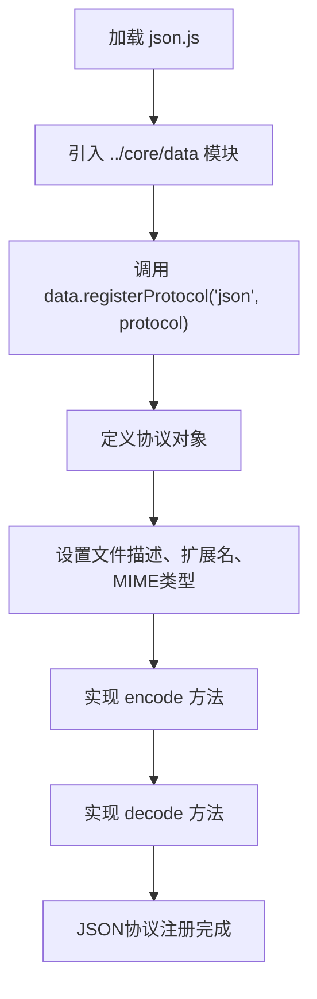
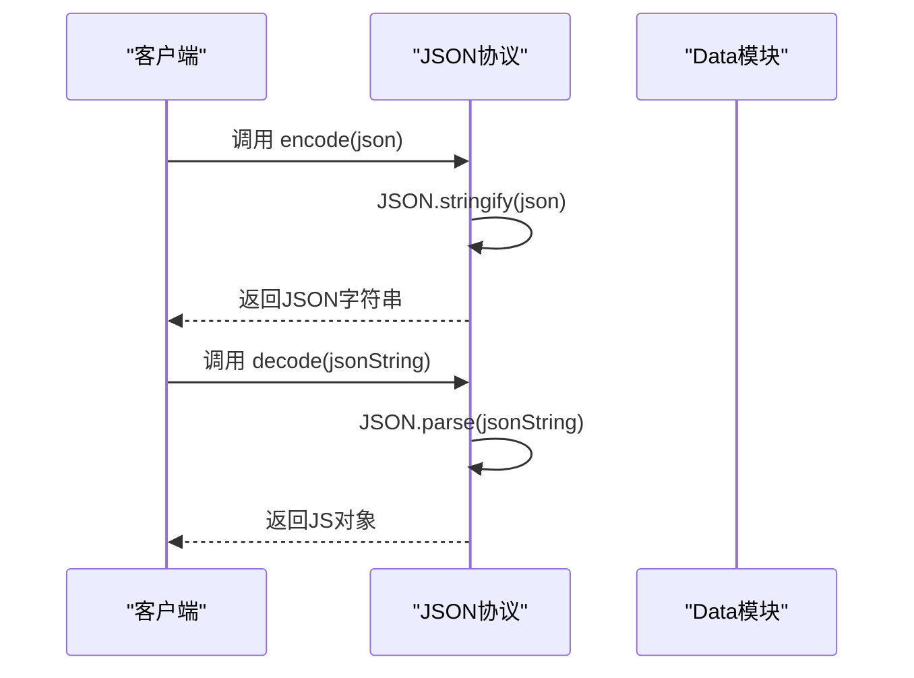
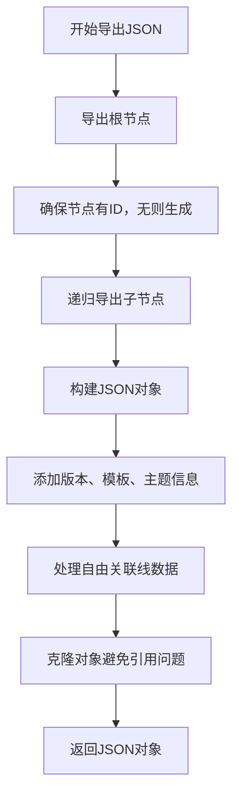
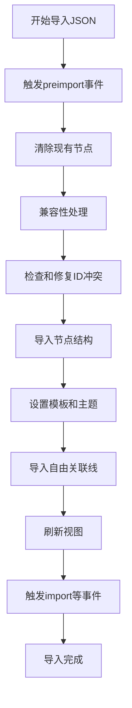
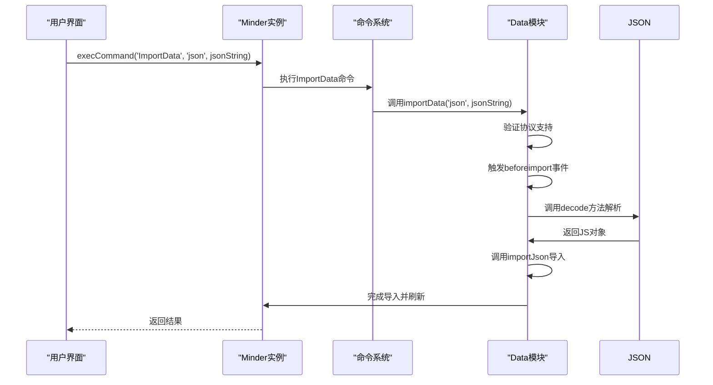
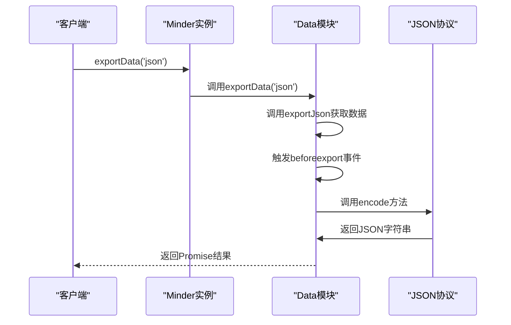
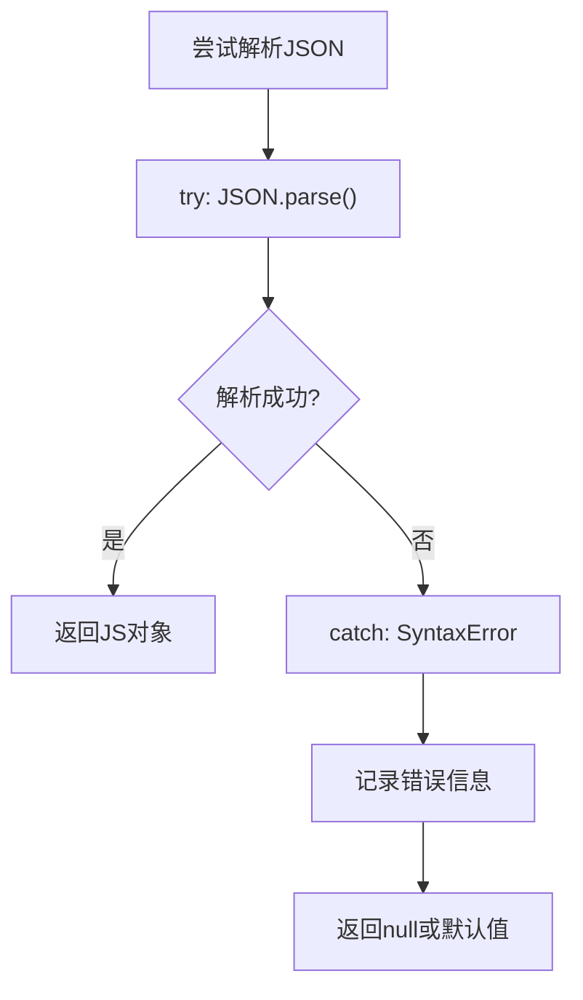

# JSON协议

<cite>
**本文档中引用的文件**  
- [json.js](file://src/protocol/json.js)
- [data.js](file://src/core/data.js)
- [kityminder.js](file://src/kityminder.js)
- [dev.html](file://dev.html)
- [example.html](file://example.html)
- [command.js](file://src/core/command.js)
</cite>

## 目录
1. [简介](#简介)
2. [JSON协议注册机制](#json协议注册机制)
3. [序列化与反序列化实现](#序列化与反序列化实现)
4. [核心数据模型转换](#核心数据模型转换)
5. [导入导出操作示例](#导入导出操作示例)
6. [常见问题处理](#常见问题处理)
7. [协议元数据](#协议元数据)

## 简介
JSON协议是kityminder-core中用于思维导图数据交换的核心格式。该协议通过`json.js`文件实现，作为所有其他数据格式转换的基础。它定义了思维导图数据的标准JSON表示形式，支持完整的节点结构、样式属性、模板和主题信息的序列化与反序列化。

**Section sources**
- [json.js](file://src/protocol/json.js#L1-L18)
- [data.js](file://src/core/data.js#L1-L416)

## JSON协议注册机制
JSON协议通过调用`data.registerProtocol`方法注册为'mind'数据交换的核心格式。在`json.js`文件中，通过模块依赖引入`data`模块，并调用其`registerProtocol`方法将JSON协议注册到全局协议集合中。



**Diagram sources**
- [json.js](file://src/protocol/json.js#L1-L18)
- [data.js](file://src/core/data.js#L12-L28)

**Section sources**
- [json.js](file://src/protocol/json.js#L1-L18)
- [data.js](file://src/core/data.js#L12-L28)

## 序列化与反序列化实现
### 编码机制
JSON协议的`encode`方法将思维导图数据结构序列化为标准JSON字符串。该方法直接调用原生`JSON.stringify()`函数，将JavaScript对象转换为JSON格式字符串。

```javascript
encode: function(json) {
    return JSON.stringify(json);
}
```

### 解码机制
`decode`方法负责安全地解析JSON字符串并返回JavaScript对象。该方法使用原生`JSON.parse()`函数，将JSON字符串解析为JavaScript对象结构。

```javascript
decode: function(local) {
    return JSON.parse(local);
}
```



**Diagram sources**
- [json.js](file://src/protocol/json.js#L10-L16)

**Section sources**
- [json.js](file://src/protocol/json.js#L10-L16)

## 核心数据模型转换
### 基础数据模型
JSON协议作为其他协议的基础数据模型，通过`data.js`中的`exportJson`和`importJson`方法实现核心数据转换。

#### 导出流程
`exportJson`方法将思维导图实例转换为标准JSON对象，包含根节点、版本信息、模板、主题和自由关联线数据。



#### 导入流程
`importJson`方法将JSON对象导入为思维导图实例，包括预处理事件、节点清理、ID冲突检测与修复、节点导入和状态更新。



**Diagram sources**
- [data.js](file://src/core/data.js#L56-L308)

**Section sources**
- [data.js](file://src/core/data.js#L56-L308)

## 导入导出操作示例
### 导入JSON数据
使用`execCommand('ImportData', 'json', jsonString)`命令导入JSON数据：



### 导出结构化数据
使用`exportData('json')`方法导出结构化数据：



**Diagram sources**
- [data.js](file://src/core/data.js#L319-L379)
- [command.js](file://src/core/command.js#L118-L165)

**Section sources**
- [data.js](file://src/core/data.js#L319-L379)
- [command.js](file://src/core/command.js#L118-L165)

## 常见问题处理
### JSON解析语法错误
当JSON字符串格式不正确时，`JSON.parse()`会抛出语法错误。建议在调用前进行预验证：



### 特殊字符处理
JSON协议自动处理特殊字符的转义，包括引号、反斜杠、控制字符等。在序列化时，`JSON.stringify()`会自动进行适当的转义处理。

### ID冲突检测与修复
在导入JSON数据时，系统会自动检测并修复ID冲突：

1. 遍历所有节点数据
2. 为无ID的节点生成新ID
3. 检查ID是否已存在，若存在则重新生成
4. 使用映射表跟踪已使用的ID

```javascript
function ensureUniqueId(nodeData) {
    if (!nodeData.data.id) {
        nodeData.data.id = utils.guid();
    }
    if (idMap[nodeData.data.id]) {
        nodeData.data.id = utils.guid();
    }
    idMap[nodeData.data.id] = true;
    // 递归处理子节点
}
```

**Section sources**
- [data.js](file://src/core/data.js#L252-L269)

## 协议元数据
JSON协议的元数据定义了其文件扩展名和MIME类型：

- **文件描述**: KityMinder 格式
- **文件扩展名**: .km
- **数据类型**: text
- **MIME类型**: application/json

这些元数据在`json.js`文件中定义，用于文件保存和内容类型识别。

```javascript
fileDescription: 'KityMinder 格式',
fileExtension: '.km',
dataType: 'text',
mineType: 'application/json'
```

**Section sources**
- [json.js](file://src/protocol/json.js#L5-L8)