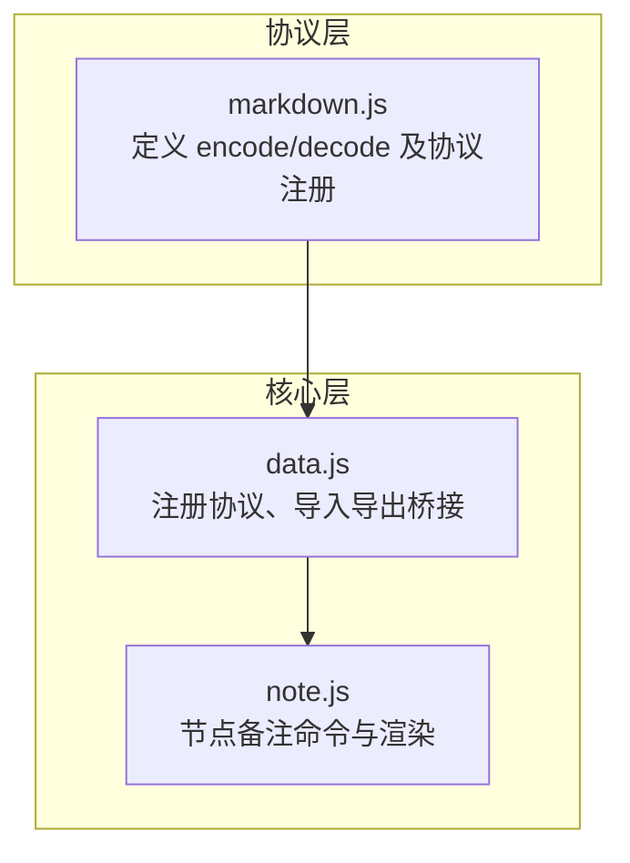
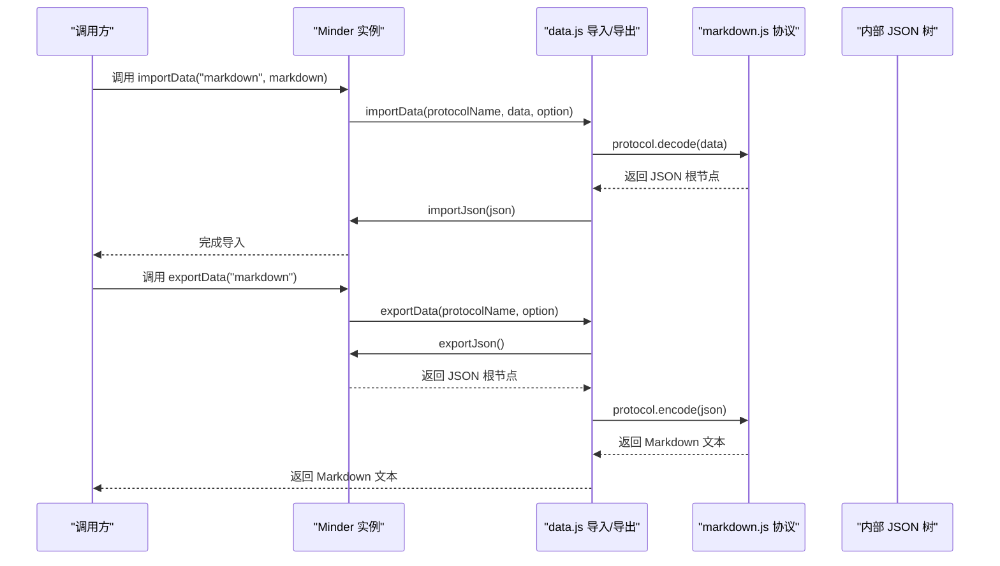
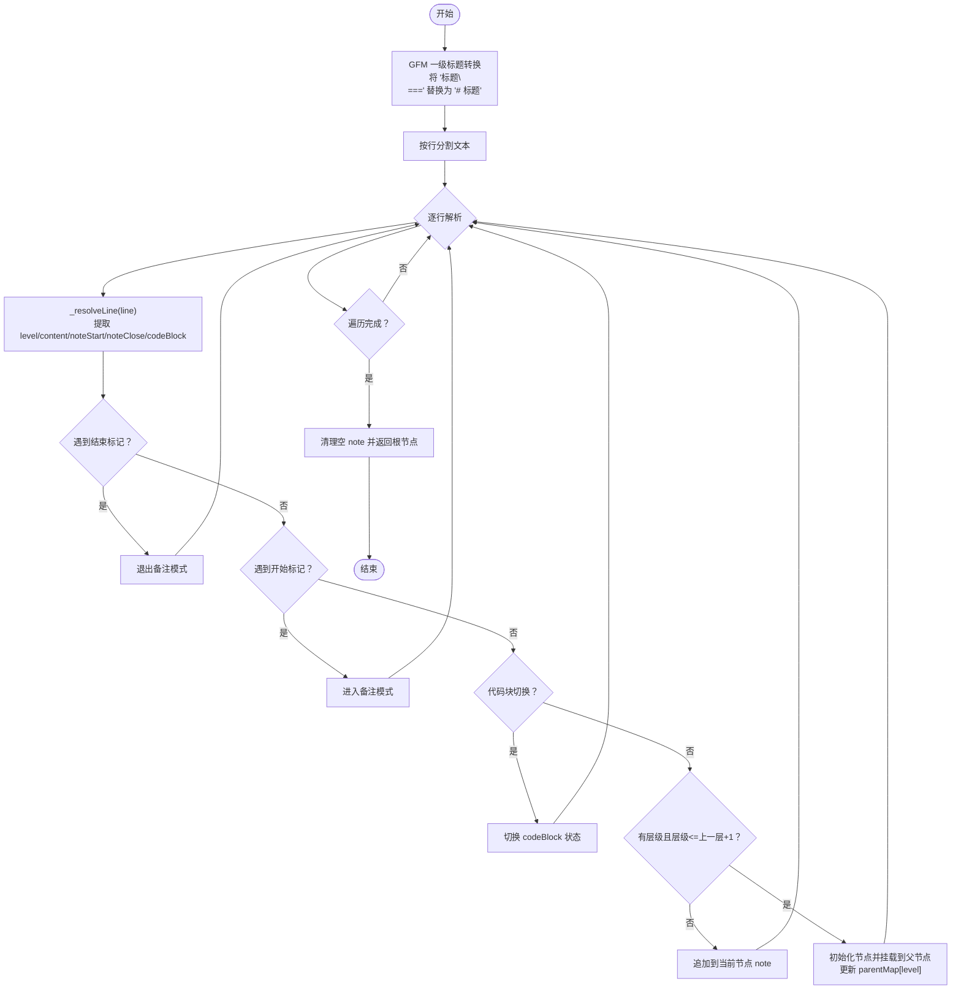
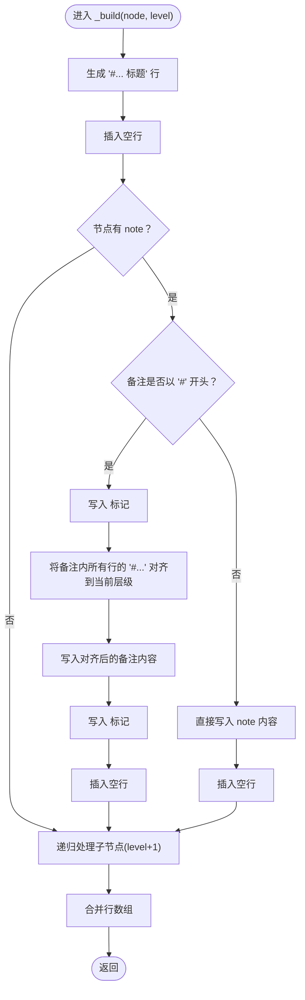
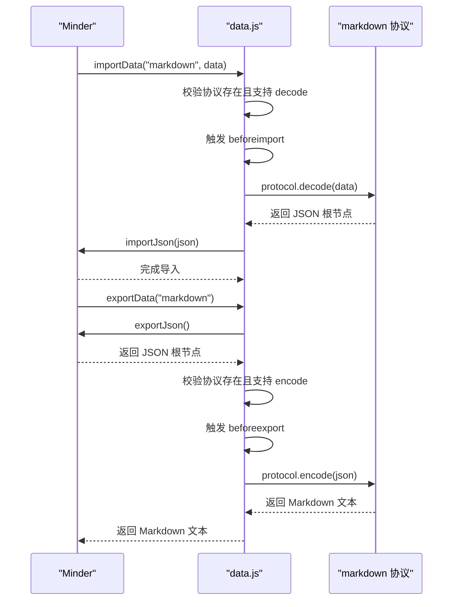
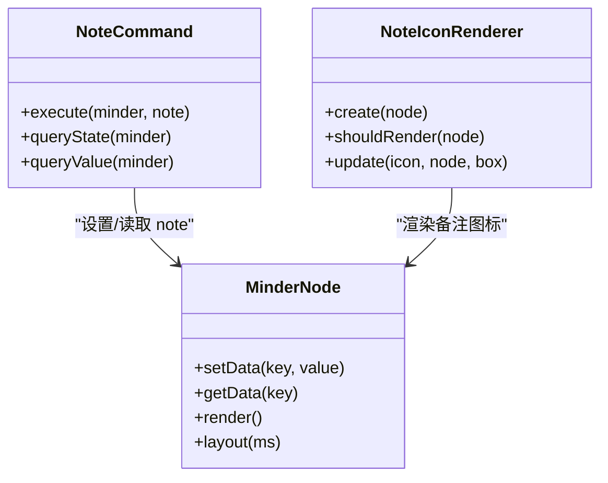
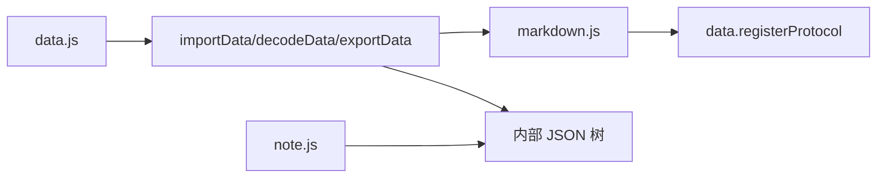

# Markdown协议

<cite>
**本文引用的文件列表**
- [src/protocol/markdown.js](file://src/protocol/markdown.js)
- [src/core/data.js](file://src/core/data.js)
- [src/module/note.js](file://src/module/note.js)
</cite>

## 目录
1. [简介](#简介)
2. [项目结构](#项目结构)
3. [核心组件](#核心组件)
4. [架构总览](#架构总览)
5. [详细组件分析](#详细组件分析)
6. [依赖关系分析](#依赖关系分析)
7. [性能考量](#性能考量)
8. [故障排查指南](#故障排查指南)
9. [结论](#结论)
10. [附录](#附录)

## 简介
本文件系统性解析 Markdown 协议在本项目中的双向转换机制，重点围绕以下目标展开：
- 解释 markdown.js 中 decode 函数如何将 Markdown 文本解析为思维导图树结构，包括通过正则表达式识别“#”标题符号确定节点层级；处理一级标题的特殊转换（GFM 下划线语法）；在解析过程中通过 parentMap 维护父子关系。
- 阐述 encode 函数如何递归遍历节点树，生成带层级标题的 Markdown 文本，并正确处理节点备注（Note）的特殊标记“<!--Note-->”和代码块“```”的边界情况。
- 结合 data.js 的 importData/exportData 调用流程，展示如何实现 Markdown 与内部 JSON 模型之间的互转。
- 提供示例说明如何导入包含多级标题和备注的 Markdown 文档。
- 解决常见问题：标题层级跳跃导致的解析失败、备注内容中的“#”符号干扰、空行处理等。

## 项目结构
Markdown 协议位于协议层，负责将内部 JSON 模型与外部 Markdown 文本互相转换；导入导出逻辑位于核心层，负责注册协议、触发事件、组织数据流。



图表来源
- [src/protocol/markdown.js](file://src/protocol/markdown.js#L1-L158)
- [src/core/data.js](file://src/core/data.js#L1-L416)
- [src/module/note.js](file://src/module/note.js#L1-L116)

章节来源
- [src/protocol/markdown.js](file://src/protocol/markdown.js#L1-L158)
- [src/core/data.js](file://src/core/data.js#L1-L416)
- [src/module/note.js](file://src/module/note.js#L1-L116)

## 核心组件
- 协议注册与桥接：data.js 注册并暴露 importData/decodeData/exportData，作为外部调用入口；markdown.js 通过 data.registerProtocol 将自身注册为“markdown”协议。
- 编码器（encode）：递归遍历节点树，按层级生成“#”标题行，并在需要时包裹“<!--Note-->”备注块，同时处理备注内“#”与层级的对齐。
- 解码器（decode）：逐行解析 Markdown 文本，识别标题层级、备注块、代码块，维护 parentMap 构建父子关系，并在最后清理空备注。

章节来源
- [src/protocol/markdown.js](file://src/protocol/markdown.js#L1-L158)
- [src/core/data.js](file://src/core/data.js#L310-L415)

## 架构总览
下面的序列图展示了从“外部 Markdown 文本”到“内部 JSON 树”的导入流程，以及从“内部 JSON 树”到“外部 Markdown 文本”的导出流程。



图表来源
- [src/core/data.js](file://src/core/data.js#L310-L415)
- [src/protocol/markdown.js](file://src/protocol/markdown.js#L144-L158)

## 详细组件分析

### 解码器（decode）：从 Markdown 文本到 JSON 树
- 一级标题的 GFM 特殊语法处理：将形如“标题\n===”的模式替换为“# 标题”，确保后续解析统一按“#”层级识别。
- 行级解析：
  - 使用正则识别“#”数量确定层级；若无“#”或层级大于当前层级+1，则判定为备注或代码块内容，追加到当前节点的 note 字段。
  - 备注块标记：遇到“<!--Note-->”开始标记时进入备注模式；遇到“<!--/Note-->”结束标记时退出备注模式。
  - 代码块处理：以“```”开头/结尾切换 codeBlock 状态，处于代码块内的行不参与层级判断，直接追加到当前节点备注。
- 父子关系维护：使用 parentMap[level] 快速定位父节点，当解析到新层级时，将当前节点挂载到父节点下，并更新 parentMap[level] 指针。
- 最终清理：对每个节点的 note 做空白行裁剪，若为空则删除 note 字段，避免冗余。



图表来源
- [src/protocol/markdown.js](file://src/protocol/markdown.js#L51-L158)

章节来源
- [src/protocol/markdown.js](file://src/protocol/markdown.js#L51-L158)

### 编码器（encode/_build）：从 JSON 树到 Markdown 文本
- 层级生成：根据当前节点层级生成对应长度的“#”字符串作为标题前缀。
- 备注处理：
  - 若备注以“#”开头，编码器会自动在外围包裹“<!--Note-->”和“<!--/Note-->”标记，同时将备注内的“#”前缀按当前层级对齐，保证导出后的 Markdown 语义正确。
- 子节点递归：对每个子节点按 level+1 递归生成标题与备注，最终拼接为完整的 Markdown 文本。



图表来源
- [src/protocol/markdown.js](file://src/protocol/markdown.js#L8-L43)

章节来源
- [src/protocol/markdown.js](file://src/protocol/markdown.js#L8-L43)

### 协议注册与导入导出桥接（data.js）
- 协议注册：markdown.js 通过 data.registerProtocol 注册名为“markdown”的协议，提供 encode/decode 方法及元信息。
- 导入流程（importData）：
  - 校验协议是否存在 decode 方法；
  - 触发 beforeimport 事件；
  - 调用协议 decode 得到 JSON 根节点；
  - 调用 importJson 将 JSON 树注入到当前脑图实例。
- 导出流程（exportData）：
  - 调用 exportJson 获取内部 JSON 树；
  - 校验协议是否存在 encode 方法；
  - 触发 beforeexport 事件；
  - 调用协议 encode 将 JSON 树转换为外部格式文本。



图表来源
- [src/core/data.js](file://src/core/data.js#L310-L415)
- [src/protocol/markdown.js](file://src/protocol/markdown.js#L144-L158)

章节来源
- [src/core/data.js](file://src/core/data.js#L310-L415)
- [src/protocol/markdown.js](file://src/protocol/markdown.js#L144-L158)

### 备注模块（note.js）与 Markdown 协议的协同
- 备注数据结构：节点数据对象包含 note 字段，用于存放富文本备注。
- 备注命令：提供设置/查询节点备注的命令，便于在 UI 中编辑节点备注。
- 渲染器：当节点存在备注时，在节点右侧渲染一个图标，支持交互显示/隐藏备注。



图表来源
- [src/module/note.js](file://src/module/note.js#L1-L116)

章节来源
- [src/module/note.js](file://src/module/note.js#L1-L116)

## 依赖关系分析
- markdown.js 依赖 data.js 的协议注册能力，从而被 Minder 实例通过 importData/exportData 调用。
- data.js 在导入/导出过程中，负责：
  - 校验协议可用性；
  - 触发 beforeimport/beforeexport 事件；
  - 调用协议 encode/decode；
  - 将 JSON 树注入到 Minder 或从 Minder 导出。
- note.js 与 markdown.js 通过节点数据对象的 note 字段间接耦合：markdown.js 在编码/解码时处理 note 字段，note.js 负责 UI 层面的备注编辑与渲染。



图表来源
- [src/protocol/markdown.js](file://src/protocol/markdown.js#L144-L158)
- [src/core/data.js](file://src/core/data.js#L310-L415)
- [src/module/note.js](file://src/module/note.js#L1-L116)

章节来源
- [src/protocol/markdown.js](file://src/protocol/markdown.js#L144-L158)
- [src/core/data.js](file://src/core/data.js#L310-L415)
- [src/module/note.js](file://src/module/note.js#L1-L116)

## 性能考量
- 时间复杂度：解析与编码均为线性扫描，时间复杂度 O(N)，N 为 Markdown 文本行数或节点总数。
- 空间复杂度：parentMap 仅保存每层最后一个节点指针，空间复杂度 O(L)，L 为最大层级数；整体输出为字符串数组，空间复杂度 O(N)。
- 优化建议：
  - 大文档建议分块处理或延迟渲染；
  - 备注内容中大量“#”时，编码器会进行全局替换，注意避免在备注中滥用层级符号；
  - 保持良好的缩进与空行规范，有助于减少解析歧义。

## 故障排查指南
- 标题层级跳跃导致解析失败
  - 现象：当某行标题层级超过上一行层级+1 时，该行被视为备注或被忽略。
  - 排查：检查标题层级是否连续；必要时补充中间层级标题。
  - 参考实现位置：[src/protocol/markdown.js](file://src/protocol/markdown.js#L82-L86)
- 备注内容中的“#”符号干扰
  - 现象：备注以“#”开头时，编码器会自动包裹“<!--Note-->”标记，并将备注内的“#”对齐到当前层级，避免与标题混淆。
  - 排查：确认备注是否以“#”开头；若以“#”开头，请确保其层级与所在节点一致。
  - 参考实现位置：[src/protocol/markdown.js](file://src/protocol/markdown.js#L22-L35)
- 代码块边界处理
  - 现象：处于“```”代码块内的行会被视为备注内容，不参与层级解析。
  - 排查：确保“```”成对出现；避免嵌套或误用。
  - 参考实现位置：[src/protocol/markdown.js](file://src/protocol/markdown.js#L79-L81)
- 空行处理
  - 现象：编码器会在标题与备注之间插入空行；清理阶段会去除备注首尾空白行。
  - 排查：确认空行是否符合预期；若备注为空，将被删除。
  - 参考实现位置：[src/protocol/markdown.js](file://src/protocol/markdown.js#L18-L21), [src/protocol/markdown.js](file://src/protocol/markdown.js#L131-L142)
- GFM 一级标题语法
  - 现象：形如“标题\n===”会被转换为“# 标题”，确保与“#”层级统一。
  - 排查：若未生效，检查是否为标准的下划线语法。
  - 参考实现位置：[src/protocol/markdown.js](file://src/protocol/markdown.js#L57-L60)

章节来源
- [src/protocol/markdown.js](file://src/protocol/markdown.js#L57-L60)
- [src/protocol/markdown.js](file://src/protocol/markdown.js#L79-L86)
- [src/protocol/markdown.js](file://src/protocol/markdown.js#L131-L142)

## 结论
本项目通过“协议层 + 核心层”的清晰分工，实现了 Markdown 与内部 JSON 模型的稳定双向转换：
- 解码器（decode）以行级状态机为核心，结合 parentMap 与备注/代码块处理，稳健地还原树结构。
- 编码器（encode）在生成层级标题的同时，妥善处理备注与“#”符号对齐，保证导出 Markdown 的可读性与一致性。
- data.js 的导入导出桥接为协议调用提供了标准化接口，并通过事件钩子扩展了可插拔性。
- note.js 的存在使得备注在 UI 与协议层之间形成闭环，提升用户体验与数据完整性。

## 附录
- 示例：导入包含多级标题与备注的 Markdown 文档
  - 步骤：
    1) 准备包含多级标题与备注的 Markdown 文档（备注可使用“<!--Note-->”包裹）。
    2) 调用 Minder.importData("markdown", 文档内容)。
    3) 导入完成后，内部 JSON 树即与 Markdown 结构一一对应；可通过 exportData("markdown") 导出验证。
  - 参考调用路径：
    - [src/core/data.js](file://src/core/data.js#L343-L379)
    - [src/protocol/markdown.js](file://src/protocol/markdown.js#L144-L158)