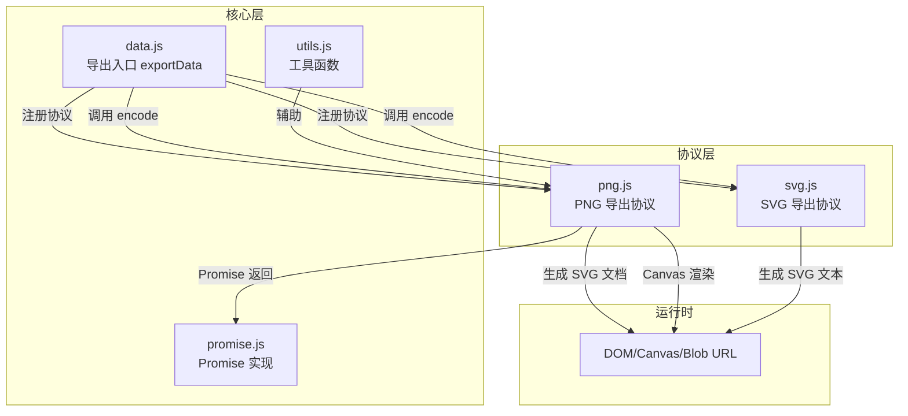
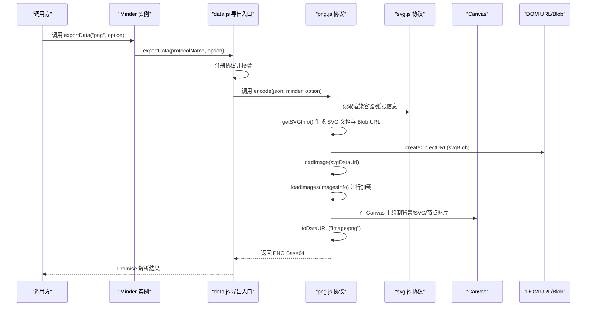
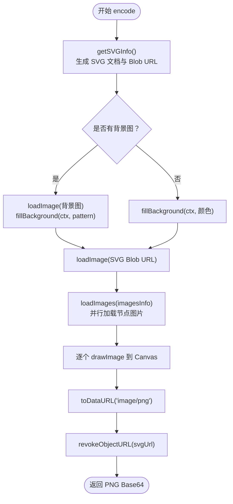
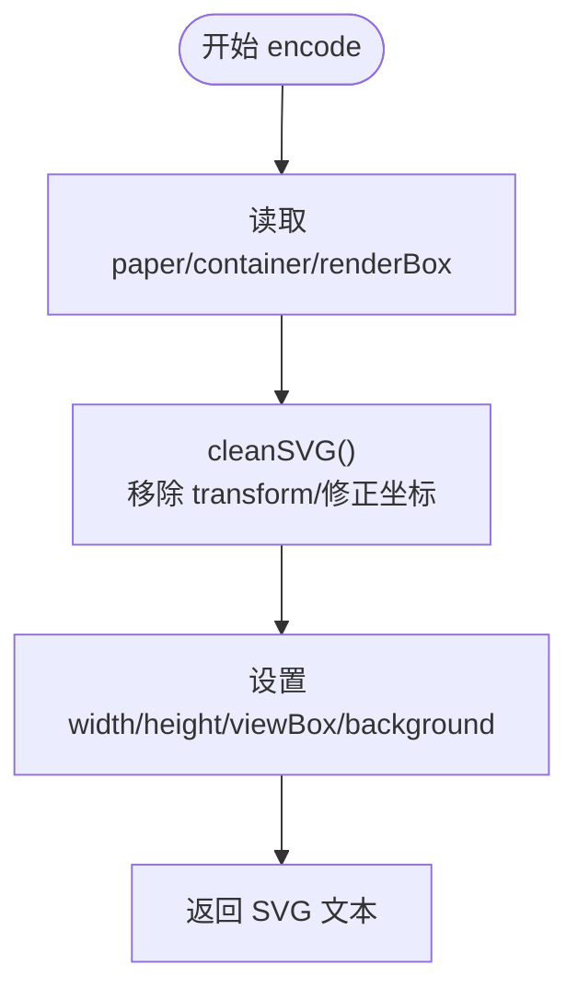
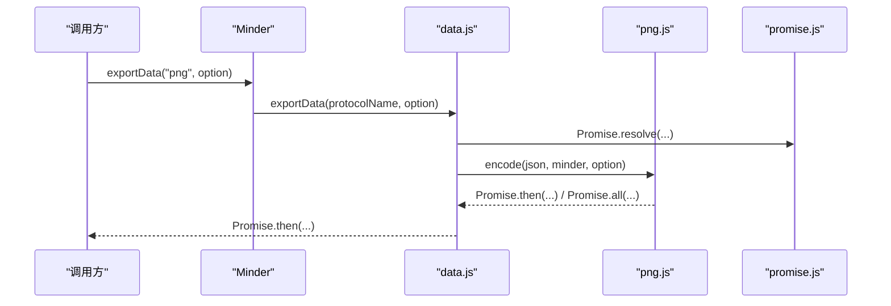
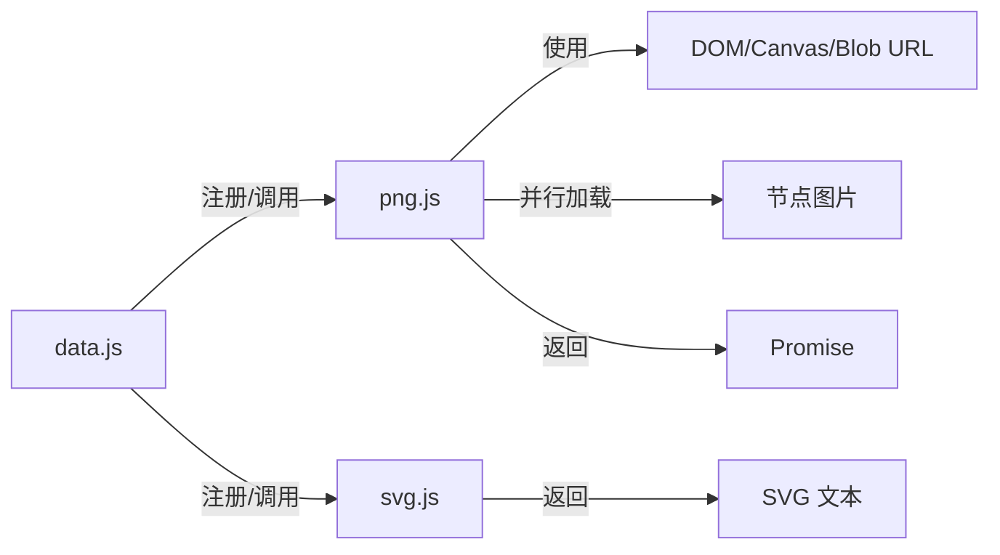

# PNG导出

<cite>
**本文引用的文件**
- [src/protocol/png.js](file://src/protocol/png.js)
- [src/protocol/svg.js](file://src/protocol/svg.js)
- [src/core/data.js](file://src/core/data.js)
- [src/core/promise.js](file://src/core/promise.js)
- [src/core/utils.js](file://src/core/utils.js)
- [dev.html](file://dev.html)
- [example.html](file://example.html)
</cite>

## 目录
1. [简介](#简介)
2. [项目结构](#项目结构)
3. [核心组件](#核心组件)
4. [架构总览](#架构总览)
5. [详细组件分析](#详细组件分析)
6. [依赖关系分析](#依赖关系分析)
7. [性能考量](#性能考量)
8. [故障排查指南](#故障排查指南)
9. [结论](#结论)
10. [附录](#附录)

## 简介
本篇文档深入解析 PNG 导出的实现机制，阐明其与 SVG 导出的依赖关系。PNG 导出并非直接从矢量渲染生成位图，而是基于 SVG 导出能力：先生成完整的 SVG 文档，再通过 HTML5 Canvas 将 SVG 渲染为位图图像，最终通过 toDataURL 或 toBlob 生成 PNG 数据。文档还解释了如何处理图像分辨率与缩放、跨域资源导致的 Canvas 污染、大型导图内存溢出、图像模糊（分辨率不足）、透明背景等性能与兼容性问题，并结合 data.js 的 exportData 异步流程说明 PNG 导出的 Promise 返回机制。

## 项目结构
PNG 导出位于协议层，与 SVG 导出共享“导出为文本”的通用注册机制；导出数据流由核心模块统一调度。

图表来源
- [src/protocol/png.js](file://src/protocol/png.js#L1-L289)
- [src/protocol/svg.js](file://src/protocol/svg.js#L1-L244)
- [src/core/data.js](file://src/core/data.js#L1-L416)
- [src/core/promise.js](file://src/core/promise.js#L1-L214)
- [src/core/utils.js](file://src/core/utils.js#L1-L66)

章节来源
- [src/protocol/png.js](file://src/protocol/png.js#L1-L289)
- [src/protocol/svg.js](file://src/protocol/svg.js#L1-L244)
- [src/core/data.js](file://src/core/data.js#L310-L341)
- [src/core/promise.js](file://src/core/promise.js#L1-L214)
- [src/core/utils.js](file://src/core/utils.js#L1-L66)

## 核心组件
- PNG 导出协议（png.js）
  - 负责生成 SVG 文档、加载外部图片、在 Canvas 上合成、输出 PNG 数据。
  - 关键流程：getSVGInfo -> encode -> drawSVG -> toDataURL。
- SVG 导出协议（svg.js）
  - 提供干净的 SVG 文本，清理 transform、处理透明、修正 viewBox 等。
- 导出入口（data.js）
  - 通过 exportData 注册并分发协议，返回 Promise。
- Promise 实现（promise.js）
  - 提供 then/all/reject/resolve 等能力，支撑异步链式调用。
- 工具函数（utils.js）
  - 提供 guid 等工具，保障节点 ID 唯一性（间接影响导出稳定性）。

章节来源
- [src/protocol/png.js](file://src/protocol/png.js#L1-L289)
- [src/protocol/svg.js](file://src/protocol/svg.js#L1-L244)
- [src/core/data.js](file://src/core/data.js#L310-L341)
- [src/core/promise.js](file://src/core/promise.js#L1-L214)
- [src/core/utils.js](file://src/core/utils.js#L1-L66)

## 架构总览
PNG 导出的完整调用链如下：

图表来源
- [src/core/data.js](file://src/core/data.js#L310-L341)
- [src/protocol/png.js](file://src/protocol/png.js#L184-L288)
- [src/protocol/svg.js](file://src/protocol/svg.js#L213-L244)

## 详细组件分析

### PNG 导出协议（png.js）
- SVG 文档生成与清洗
  - 通过 minder 的渲染容器与纸张信息，计算合适的宽高与偏移，生成 SVG 内容。
  - 清洗命名空间、控制字符、特殊标签等，确保可安全转 Blob 与 URL。
  - 生成 Blob 并通过 DOM URL 创建 SVG Blob URL，供 Image 加载。
- 外部图片加载策略
  - 对于同源图片：直接创建 img 并设置 crossOrigin，onload 后返回 Promise。
  - 对于跨域或 BOS 图片：通过 XHR 以 blob 形式下载，再通过 DOM URL 生成临时 URL，onload 后返回 Promise。
  - 所有临时 URL 在使用后及时 revokeObjectURL，避免内存泄漏。
- Canvas 合成与输出
  - 计算画布尺寸（考虑 padding、可选的 width/height 与 offset），设置背景（颜色或平铺的背景图）。
  - 先绘制 SVG，再叠加节点图片（并行加载），最后生成 PNG Base64。
  - 错误处理：当 SVG 加载失败（通常为跨域）时，仍继续导出但不包含节点图片，并给出提示。
- Promise 返回机制
  - 整个流程以 Promise 链串联，最终 resolve 返回 PNG Base64，供上层消费。

图表来源
- [src/protocol/png.js](file://src/protocol/png.js#L184-L288)

章节来源
- [src/protocol/png.js](file://src/protocol/png.js#L1-L289)

### SVG 导出协议（svg.js）
- 清理 transform 与路径坐标
  - 递归遍历 SVG DOM，移除 transform，将相对坐标转换为绝对坐标，保证导出 SVG 的几何正确性。
  - 特殊处理 path 的 d 属性，按命令类型修正坐标。
- 背景与透明处理
  - 设置 viewBox、width/height、背景样式，处理透明填充为 none。
- 输出文本
  - 返回可直接保存的 SVG 文本，供其他协议复用或浏览器直接打开。

图表来源
- [src/protocol/svg.js](file://src/protocol/svg.js#L213-L244)

章节来源
- [src/protocol/svg.js](file://src/protocol/svg.js#L1-L244)

### 导出入口与 Promise 链（data.js + promise.js）
- 导出入口
  - exportData 接收协议名与选项，校验协议存在性，触发 beforeexport 事件，随后调用对应协议的 encode(json, minder, option)，返回 Promise。
- Promise 行为
  - 协议内部使用自定义 Promise 实现，支持 then/all/reject/resolve，确保链式调用与并发加载（如节点图片）的正确执行。
  - 最终由协议 resolve 返回 PNG Base64，上层通过 then/catch 处理结果。

图表来源
- [src/core/data.js](file://src/core/data.js#L310-L341)
- [src/core/promise.js](file://src/core/promise.js#L1-L214)
- [src/protocol/png.js](file://src/protocol/png.js#L184-L288)

章节来源
- [src/core/data.js](file://src/core/data.js#L310-L341)
- [src/core/promise.js](file://src/core/promise.js#L1-L214)

## 依赖关系分析
- 协议注册与调用
  - data.js 统一注册并暴露协议，png.js 与 svg.js 通过 registerProtocol 注册自身 encode 方法。
- 数据流向
  - exportData 生成 JSON，传入协议 encode，png.js 依赖 svg.js 的渲染容器信息与 SVG 文本生成能力。
- 并发与异步
  - loadImages 使用 Promise.all 并行加载节点图片，提升导出效率。
- 资源与 URL
  - 通过 DOM URL/Blob 生成临时 URL，避免跨域限制带来的渲染问题；使用后及时 revoke，防止内存泄漏。

图表来源
- [src/core/data.js](file://src/core/data.js#L10-L29)
- [src/protocol/png.js](file://src/protocol/png.js#L1-L289)
- [src/protocol/svg.js](file://src/protocol/svg.js#L1-L244)

章节来源
- [src/core/data.js](file://src/core/data.js#L10-L29)
- [src/protocol/png.js](file://src/protocol/png.js#L1-L289)
- [src/protocol/svg.js](file://src/protocol/svg.js#L1-L244)

## 性能考量
- 分辨率与缩放
  - 通过在 encode 中传入 width/height 与 offset，可以扩大画布尺寸并在 Canvas 上居中放置内容，从而提高导出分辨率。
  - 建议在导出高分辨率 PNG 时，将 option.width/height 设为期望像素值，并根据需要设置 padding。
- 并发加载图片
  - 使用 Promise.all 并行加载节点图片，显著缩短等待时间；注意网络拥塞时的重试与降级策略。
- 内存管理
  - 及时 revokeObjectURL，避免 Blob URL 泄漏；在大图导出时尽量减少一次性加载的图片数量。
- 背景与透明
  - 若需透明背景，建议在导出前将背景设为透明或使用 PNG-24；否则背景填充会占用额外像素与带宽。
- 大型导图优化
  - 对超大规模导图，优先导出可见区域或分块导出；必要时降低节点图片质量或禁用部分图片以减少内存峰值。

[本节为通用性能建议，无需特定文件来源]

## 故障排查指南
- 跨域资源导致的 Canvas 污染
  - 现象：导出 PNG 后出现“跨域图片不显示”提示，Canvas 可能被污染。
  - 处理：png.js 在 SVG 加载失败时会继续导出，但不包含节点图片；建议替换为同源或允许跨域的图片资源。
  - 参考路径：[src/protocol/png.js](file://src/protocol/png.js#L238-L288)
- 大型导图导出内存溢出
  - 现象：导出过程中页面卡顿或崩溃。
  - 处理：减小导出分辨率（width/height），减少节点图片数量，或分块导出；及时释放临时 URL。
  - 参考路径：[src/protocol/png.js](file://src/protocol/png.js#L238-L288)
- 图像模糊（分辨率不足）
  - 现象：导出 PNG 较小或细节不清。
  - 处理：增大 option.width/height，适当增加 padding；确保节点图片本身分辨率足够。
  - 参考路径：[src/protocol/png.js](file://src/protocol/png.js#L184-L211)
- 透明背景处理
  - 现象：导出背景为白色而非透明。
  - 处理：确保 minder 的背景声明为透明或使用 PNG-24；必要时在导出前调整背景样式。
  - 参考路径：[src/protocol/png.js](file://src/protocol/png.js#L192-L203)
- SVG 文本异常
  - 现象：SVG 包含非法实体或控制字符导致解析失败。
  - 处理：png.js 在生成 SVG 文本时已做清洗；若仍异常，请检查节点文本或图片链接。
  - 参考路径：[src/protocol/png.js](file://src/protocol/png.js#L119-L133)

章节来源
- [src/protocol/png.js](file://src/protocol/png.js#L184-L288)

## 结论
PNG 导出通过“先 SVG、后 Canvas”的两阶段策略，既复用了 SVG 导出的高质量矢量基础，又借助 Canvas 的位图输出能力满足分享与打印场景。其 Promise 链式调用与并行图片加载提升了用户体验；同时通过 DOM URL 与 revokeObjectURL 的配合，兼顾了跨域资源与内存管理。针对高分辨率、透明背景、跨域污染与内存溢出等问题，可通过合理设置导出参数与资源策略有效规避。

[本节为总结性内容，无需特定文件来源]

## 附录

### 使用示例：导出高分辨率 PNG
- 在页面中初始化 KityMinder 实例后，调用 exportData("png", { width, height, ... })，即可获得 PNG Base64。
- 示例页面展示了如何在按钮点击后导出 JSON，可类比扩展为导出 PNG：
  - [dev.html](file://dev.html#L196-L201)
  - [example.html](file://example.html#L55-L64)

章节来源
- [dev.html](file://dev.html#L196-L201)
- [example.html](file://example.html#L55-L64)