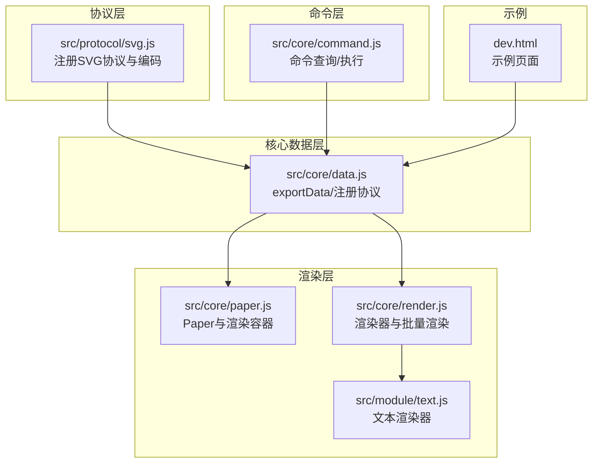
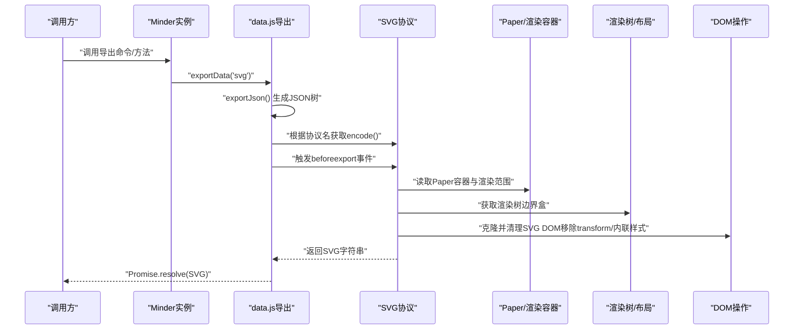
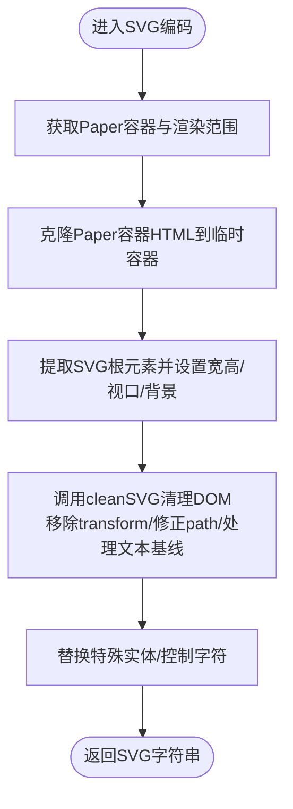
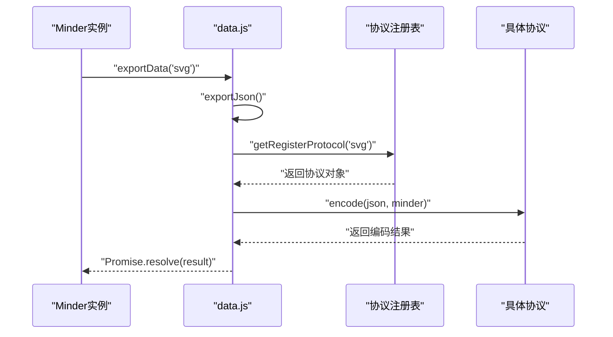
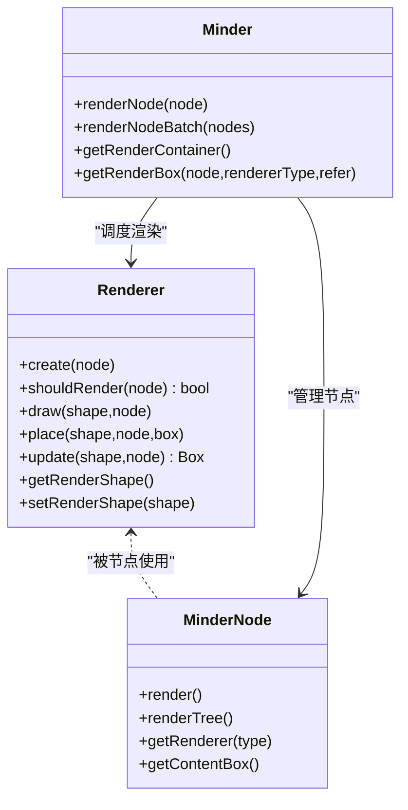
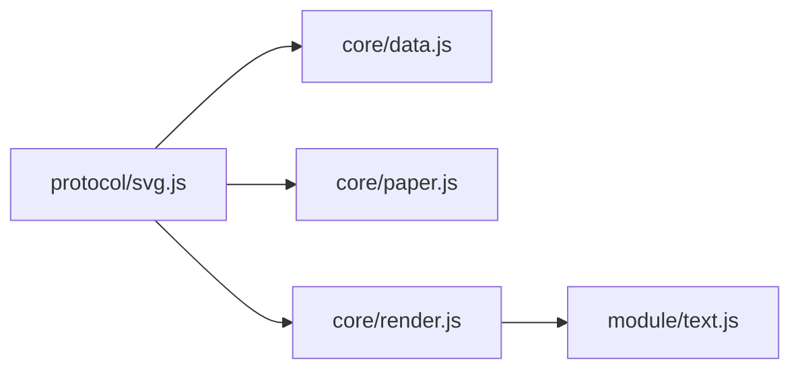

# SVG导出

<cite>
**本文引用的文件列表**
- [src/protocol/svg.js](file://src/protocol/svg.js)
- [src/core/data.js](file://src/core/data.js)
- [src/core/paper.js](file://src/core/paper.js)
- [src/core/render.js](file://src/core/render.js)
- [src/core/command.js](file://src/core/command.js)
- [src/module/text.js](file://src/module/text.js)
- [README.md](file://README.md)
- [dev.html](file://dev.html)
</cite>

## 目录
1. [简介](#简介)
2. [项目结构](#项目结构)
3. [核心组件](#核心组件)
4. [架构总览](#架构总览)
5. [详细组件分析](#详细组件分析)
6. [依赖关系分析](#依赖关系分析)
7. [性能考量](#性能考量)
8. [故障排查指南](#故障排查指南)
9. [结论](#结论)
10. [附录](#附录)

## 简介
本章节面向希望理解“SVG导出”功能的开发者与使用者，系统阐述从思维导图渲染树到完整SVG文档字符串的序列化流程。重点包括：
- 如何利用kityminder-core的渲染能力，将节点、连线、文本等图形元素统一输出为SVG；
- 如何通过遍历渲染树，提取并内联样式，确保导出的SVG在外部环境中正确显示；
- 结合data.js中的exportData调用机制，说明如何触发SVG编码过程；
- 提供调用示例：execCommand('ExportData', 'svg')获取SVG数据并实现下载；
- 解决常见问题：样式丢失（未正确内联）、大型导图性能瓶颈、SVG文件尺寸过大、特殊字符编码等；
- 明确该协议的MIME类型为image/svg+xml，文件扩展名为.svg。

## 项目结构
围绕SVG导出的关键文件与职责如下：
- 协议层：src/protocol/svg.js 定义了SVG协议的注册、元信息与编码逻辑；
- 数据协议注册与导出：src/core/data.js 提供exportData方法，负责将当前思维导图导出为指定协议的数据；
- 渲染容器与画布：src/core/paper.js 提供Paper对象与渲染容器，承载所有图形元素；
- 渲染树与布局：src/core/render.js 定义渲染器接口与批量渲染流程，驱动节点图形更新；
- 文本渲染与样式：src/module/text.js 提供文本渲染器，影响文本位置与样式；
- 命令体系：src/core/command.js 提供命令查询与执行框架，便于上层调用；
- 示例页面：dev.html 展示了基本的思维导图初始化与导出JSON的使用方式。

图表来源
- [src/protocol/svg.js](file://src/protocol/svg.js#L213-L243)
- [src/core/data.js](file://src/core/data.js#L310-L341)
- [src/core/paper.js](file://src/core/paper.js#L18-L75)
- [src/core/render.js](file://src/core/render.js#L1-L261)
- [src/module/text.js](file://src/module/text.js#L1-L289)
- [src/core/command.js](file://src/core/command.js#L58-L166)
- [dev.html](file://dev.html#L146-L247)

章节来源
- [README.md](file://README.md#L34-L48)
- [src/protocol/svg.js](file://src/protocol/svg.js#L213-L243)
- [src/core/data.js](file://src/core/data.js#L310-L341)
- [src/core/paper.js](file://src/core/paper.js#L18-L75)
- [src/core/render.js](file://src/core/render.js#L1-L261)
- [src/module/text.js](file://src/module/text.js#L1-L289)
- [src/core/command.js](file://src/core/command.js#L58-L166)
- [dev.html](file://dev.html#L146-L247)

## 核心组件
- SVG协议注册与编码
  - 在协议层通过registerProtocol注册“svg”协议，定义文件描述、扩展名、MIME类型与数据类型，并实现encode函数，将当前思维导图渲染为SVG字符串。
- 导出数据流
  - data.js中的exportData方法负责：
    - 先导出当前思维导图的JSON树；
    - 根据传入的协议名查找对应协议对象；
    - 触发beforeexport事件；
    - 调用协议的encode(json, minder)完成编码。
- 渲染容器与画布
  - paper.js提供Paper对象与渲染容器_group，承载所有图形元素；getPaper()与getRenderContainer()用于获取底层DOM与渲染范围。
- 渲染树与布局
  - render.js定义Renderer抽象类与批量渲染流程，驱动节点图形创建、更新与定位；getRenderBox()计算节点在Paper坐标系下的边界盒，为SVG viewBox与尺寸提供依据。
- 文本渲染与样式
  - text.js的TextRenderer负责文本分段、行高、基线与样式设置，影响最终SVG中文本的位置与呈现。
- 命令体系
  - command.js提供execCommand框架，便于上层以命令方式触发导出流程（例如调用ExportData）。

章节来源
- [src/protocol/svg.js](file://src/protocol/svg.js#L213-L243)
- [src/core/data.js](file://src/core/data.js#L310-L341)
- [src/core/paper.js](file://src/core/paper.js#L64-L75)
- [src/core/render.js](file://src/core/render.js#L240-L258)
- [src/module/text.js](file://src/module/text.js#L129-L236)
- [src/core/command.js](file://src/core/command.js#L108-L166)

## 架构总览
下面的序列图展示了从调用到导出SVG的完整流程，包括数据导出、协议编码与DOM清理等关键步骤。

图表来源
- [src/core/data.js](file://src/core/data.js#L310-L341)
- [src/protocol/svg.js](file://src/protocol/svg.js#L218-L240)
- [src/core/paper.js](file://src/core/paper.js#L64-L75)
- [src/core/render.js](file://src/core/render.js#L240-L258)

## 详细组件分析

### SVG协议编码实现
SVG协议的核心职责是将当前思维导图渲染为完整的SVG文档字符串。其关键步骤如下：
- 获取Paper容器与渲染范围
  - 通过getPaper()与getRenderContainer()获取底层DOM与渲染边界盒，用于确定SVG的viewBox与尺寸。
- 克隆并清理SVG DOM
  - 将Paper容器的innerHTML克隆到临时容器，提取其中的SVG根元素；
  - 对SVG根元素设置width、height、viewBox与背景色；
  - 调用cleanSVG对DOM进行清理：移除transform、修正path路径、处理文本基线、移除marker-end等，确保导出的SVG在外部环境可正确渲染。
- 特殊字符处理
  - 替换非标准实体（如空格实体），避免后续解析错误。
- 返回SVG字符串
  - 最终返回完整的SVG字符串，供上层下载或保存。

图表来源
- [src/protocol/svg.js](file://src/protocol/svg.js#L218-L240)

章节来源
- [src/protocol/svg.js](file://src/protocol/svg.js#L213-L243)

### 导出数据流与协议机制
- exportData流程
  - 先exportJson()生成当前思维导图的JSON树；
  - 根据协议名查找已注册协议对象；
  - 触发beforeexport事件；
  - 调用协议的encode(json, minder)完成编码。
- 协议注册
  - 协议通过registerProtocol(name, protocol)注册，data.js内部维护协议表，供exportData使用。

图表来源
- [src/core/data.js](file://src/core/data.js#L310-L341)
- [src/core/data.js](file://src/core/data.js#L10-L29)

章节来源
- [src/core/data.js](file://src/core/data.js#L10-L29)
- [src/core/data.js](file://src/core/data.js#L310-L341)

### 渲染树与布局对SVG导出的影响
- 渲染器接口
  - render.js定义Renderer抽象类，提供create/update/place等生命周期钩子，驱动节点图形创建与定位。
- 批量渲染
  - renderNodeBatch与renderNode负责将节点图形批量绘制到渲染容器_group中，确保导出时DOM结构完整。
- 边界盒计算
  - getRenderBox()基于渲染容器的CTM计算节点在Paper坐标系下的边界盒，为SVG的viewBox与padding提供依据。

图表来源
- [src/core/render.js](file://src/core/render.js#L1-L261)
- [src/core/render.js](file://src/core/render.js#L223-L261)

章节来源
- [src/core/render.js](file://src/core/render.js#L1-L261)

### 文本渲染与样式对SVG导出的影响
- 文本渲染器
  - text.js的TextRenderer负责文本分段、行高、基线与样式设置，影响最终SVG中文本的位置与呈现。
- 兼容性处理
  - 针对不同浏览器与字体的基线差异，通过调整偏移保证文本垂直对齐的一致性。

章节来源
- [src/module/text.js](file://src/module/text.js#L129-L236)

### 命令体系与调用入口
- 命令执行
  - command.js提供execCommand框架，便于上层以命令方式触发导出流程（例如调用ExportData）。
- 导出JSON示例
  - dev.html展示了如何调用exportJson()导出JSON，便于理解导出数据流。

章节来源
- [src/core/command.js](file://src/core/command.js#L108-L166)
- [dev.html](file://dev.html#L196-L201)

## 依赖关系分析
- 协议依赖
  - SVG协议依赖data.js提供的协议注册与导出机制；
  - 依赖paper.js提供的Paper容器与渲染范围；
  - 依赖render.js的渲染树与边界盒计算。
- 组件耦合
  - data.js与protocol/svg.js松耦合，通过协议名解耦；
  - render.js与text.js共同影响最终SVG中文本与图形的呈现。

图表来源
- [src/protocol/svg.js](file://src/protocol/svg.js#L213-L243)
- [src/core/data.js](file://src/core/data.js#L310-L341)
- [src/core/paper.js](file://src/core/paper.js#L64-L75)
- [src/core/render.js](file://src/core/render.js#L1-L261)
- [src/module/text.js](file://src/module/text.js#L1-L289)

章节来源
- [src/protocol/svg.js](file://src/protocol/svg.js#L213-L243)
- [src/core/data.js](file://src/core/data.js#L310-L341)
- [src/core/paper.js](file://src/core/paper.js#L64-L75)
- [src/core/render.js](file://src/core/render.js#L1-L261)
- [src/module/text.js](file://src/module/text.js#L1-L289)

## 性能考量
- 大型导图导出性能瓶颈
  - 渲染树规模大时，克隆与清理DOM可能成为瓶颈。建议：
    - 在导出前尽量减少不必要的节点与连线；
    - 控制渲染范围（缩小viewBox与padding）；
    - 避免在导出时进行复杂动画或频繁布局。
- SVG文件尺寸过大
  - 清理transform与内联样式会降低冗余，但仍需注意：
    - 移除不必要的渐变、滤镜与位图资源；
    - 合理控制字体与字号，避免过多文本节点；
    - 对超大导图考虑分页或裁剪导出。
- 特殊字符编码
  - 协议层已对空格实体进行替换，避免后续解析错误；若仍出现异常，可在上层对导出结果进行二次转义处理。

[本节为通用性能建议，无需特定文件来源]

## 故障排查指南
- 导出后样式丢失（未正确内联）
  - 症状：导出的SVG在外部环境无法正确显示颜色、字体或位置。
  - 排查要点：
    - 确认SVG协议的cleanSVG是否正确移除了transform并内联样式；
    - 检查文本基线属性是否被移除并替换为dy；
    - 确认Paper容器的背景色已写入SVG根元素。
- 大型导图导出性能瓶颈
  - 症状：导出过程卡顿或耗时较长。
  - 排查要点：
    - 导出前减少节点数量或隐藏非必要元素；
    - 控制渲染范围，避免导出全量DOM；
    - 避免在导出过程中触发布局或动画。
- SVG文件尺寸过大
  - 症状：导出的SVG体积异常大。
  - 排查要点：
    - 检查是否包含大量位图或滤镜；
    - 确认是否保留了不必要的渐变或defs；
    - 调整padding与viewBox，避免导出空白区域。
- 特殊字符编码问题
  - 症状：导出后出现实体未定义或控制字符导致解析失败。
  - 排查要点：
    - 确认已替换空格实体；
    - 若仍报错，检查上层对导出结果的二次转义处理。

章节来源
- [src/protocol/svg.js](file://src/protocol/svg.js#L218-L240)

## 结论
SVG导出通过“协议注册 + 数据导出 + DOM清理 + 内联样式”的链路，将思维导图的渲染树完整序列化为可独立显示的SVG文档字符串。其关键在于：
- 正确获取渲染范围与Paper容器；
- 清理transform并内联样式，确保外部环境可正确渲染；
- 处理特殊字符与实体，提升兼容性；
- 通过exportData与协议机制，实现灵活扩展与复用。

[本节为总结性内容，无需特定文件来源]

## 附录

### 如何调用导出SVG并实现下载
- 触发导出
  - 使用导出数据流：exportData('svg')返回Promise，解析后得到SVG字符串。
- 下载实现思路
  - 将SVG字符串写入Blob并创建下载链接；
  - 设置MIME类型为image/svg+xml，扩展名为.svg；
  - 触发下载行为。
- MIME类型与扩展名
  - MIME类型：image/svg+xml
  - 文件扩展名：.svg

章节来源
- [src/protocol/svg.js](file://src/protocol/svg.js#L213-L217)
- [src/core/data.js](file://src/core/data.js#L310-L341)