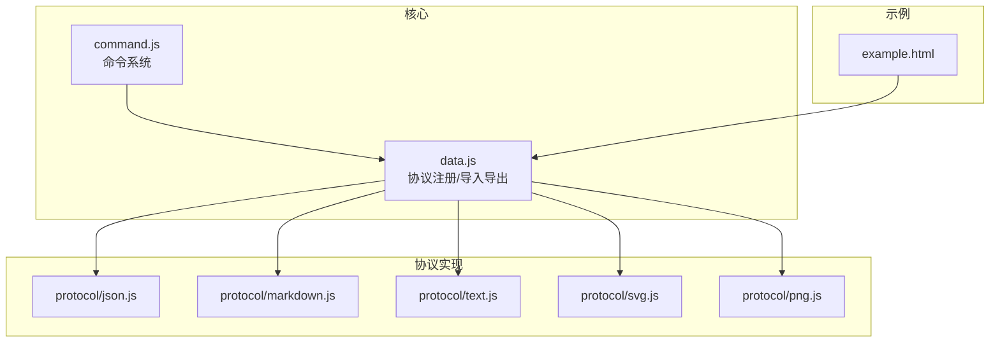
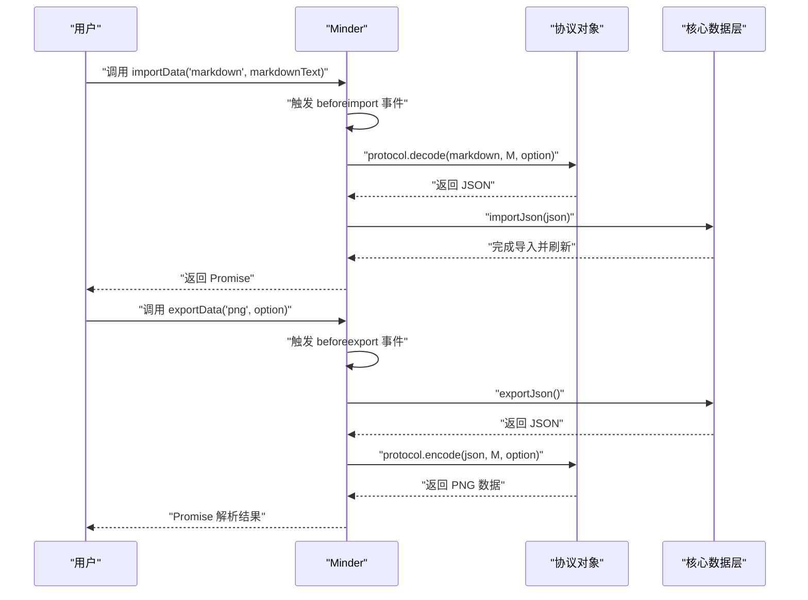
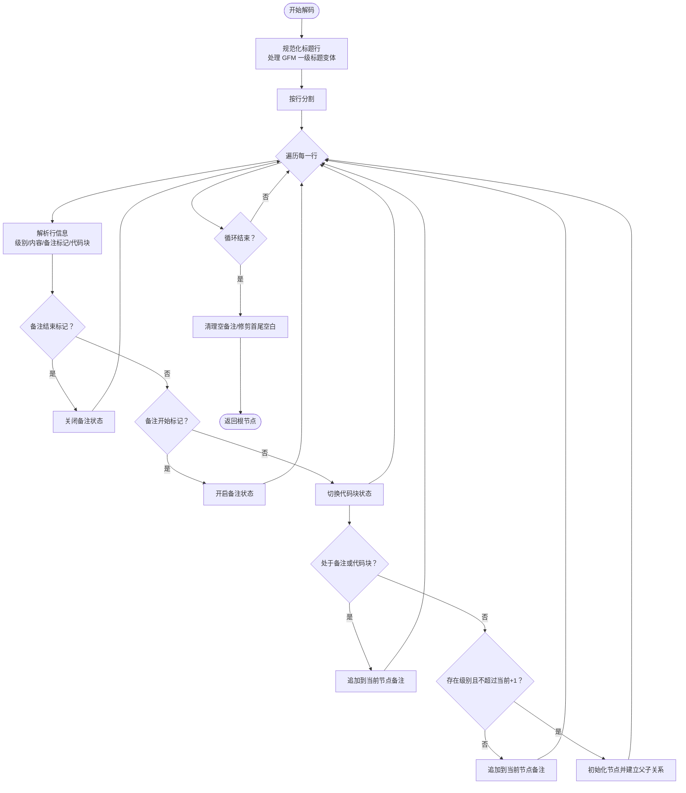
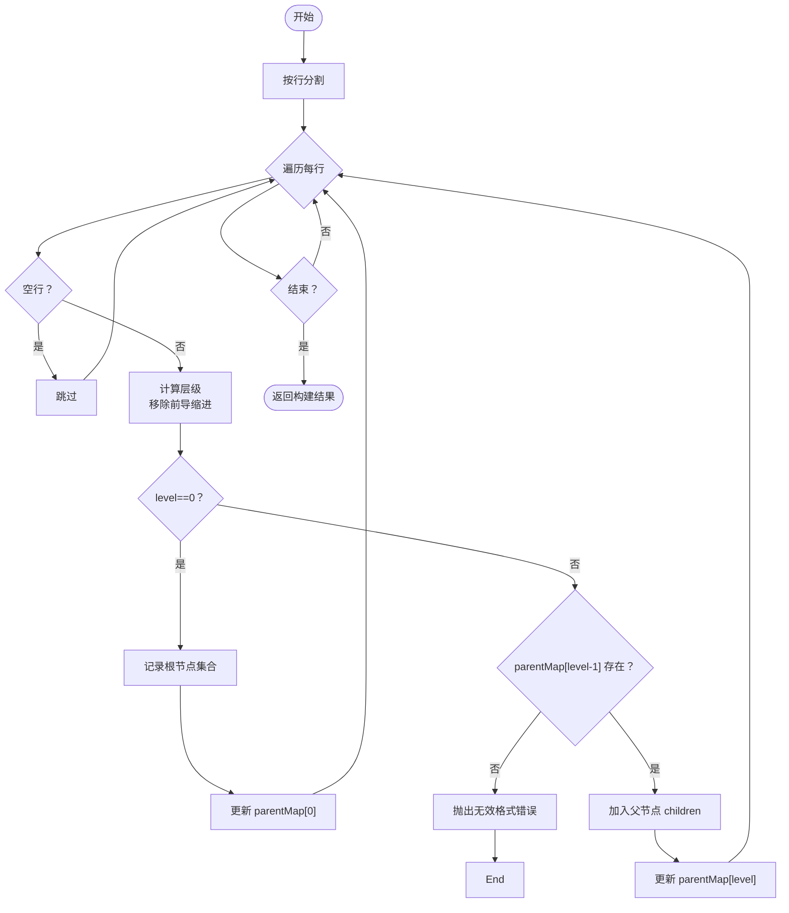
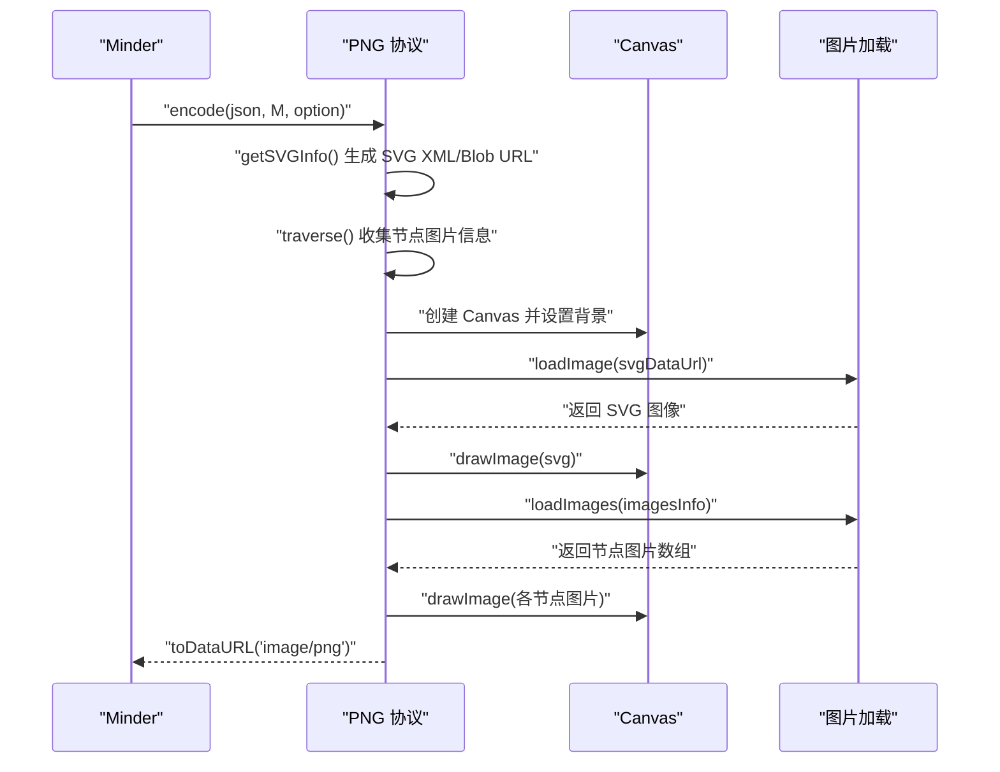
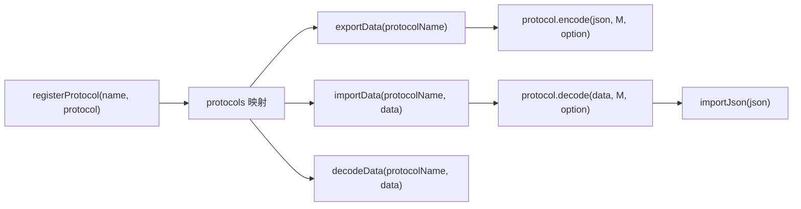

# 导入导出协议

<cite>
**本文引用的文件**
- [src/core/data.js](file://src/core/data.js)
- [src/protocol/json.js](file://src/protocol/json.js)
- [src/protocol/markdown.js](file://src/protocol/markdown.js)
- [src/protocol/text.js](file://src/protocol/text.js)
- [src/protocol/svg.js](file://src/protocol/svg.js)
- [src/protocol/png.js](file://src/protocol/png.js)
- [src/core/command.js](file://src/core/command.js)
- [example.html](file://example.html)
- [README.md](file://README.md)
</cite>

## 目录
1. [简介](#简介)
2. [项目结构](#项目结构)
3. [核心组件](#核心组件)
4. [架构总览](#架构总览)
5. [详细组件分析](#详细组件分析)
6. [依赖分析](#依赖分析)
7. [性能考虑](#性能考虑)
8. [故障排查指南](#故障排查指南)
9. [结论](#结论)
10. [附录](#附录)

## 简介
本文件系统性阐述 kityminder-core 支持的五种数据协议（JSON、Markdown、纯文本、SVG、PNG）的具体实现与交互流程，重点说明：
- JSON 协议作为核心数据交换格式的角色，以及 encode/decode 与 exportJson/importJson 的无缝集成；
- Markdown 协议将 Markdown 文本转换为思维导图树结构的算法，包括层级识别（基于缩进或标题符号）与文本到节点的映射；
- 纯文本协议（text.js）通过 Text2Children 方法解析制表符/空格缩进的层级关系；
- SVG 协议将整个思维导图渲染为 SVG 文档，包括样式内联与图形元素序列化；
- PNG 协议基于 SVG 导出与 Canvas 渲染的转换流程，以及图像分辨率与模糊问题的处理；
- 结合 data.js 中 exportData/importData/decodeData 与协议注册机制（registerProtocol）的调用流程；
- 提供实际示例：如何使用 execCommand('ImportData', 'markdown', markdownText) 进行 Markdown 导入，以及如何调用 exportData('png') 获取图片数据；
- 解决常见问题：Markdown 语法解析错误、大型思维导图 PNG 导出性能瓶颈、SVG 导出样式丢失等。

## 项目结构
围绕“协议”与“导入导出”的核心文件组织如下：
- 协议注册与调用：src/core/data.js
- 协议实现：src/protocol/json.js、src/protocol/markdown.js、src/protocol/text.js、src/protocol/svg.js、src/protocol/png.js
- 命令系统：src/core/command.js（用于 execCommand）
- 示例页面：example.html（演示自动导入 JSON）

图表来源
- [src/core/data.js](file://src/core/data.js#L1-L416)
- [src/protocol/json.js](file://src/protocol/json.js#L1-L18)
- [src/protocol/markdown.js](file://src/protocol/markdown.js#L1-L158)
- [src/protocol/text.js](file://src/protocol/text.js#L1-L238)
- [src/protocol/svg.js](file://src/protocol/svg.js#L1-L244)
- [src/protocol/png.js](file://src/protocol/png.js#L1-L289)
- [src/core/command.js](file://src/core/command.js#L1-L169)
- [example.html](file://example.html#L1-L66)

章节来源
- [src/core/data.js](file://src/core/data.js#L1-L416)
- [README.md](file://README.md#L69-L81)

## 核心组件
- 协议注册与调用
  - 协议注册：registerProtocol(name, protocol) 将协议对象挂载到全局 protocols 映射上，并为每个协议设置 name 属性。
  - 导入导出 API：
    - exportData(protocolName, option)：先 exportJson 生成标准 JSON，再调用对应协议的 encode。
    - importData(protocolName, data, option)：先调用协议 decode 得到 JSON，再调用 importJson 覆盖当前脑图。
    - decodeData(protocolName, data, option)：仅解析为 JSON，不覆盖当前脑图。
- 核心数据结构
  - exportJson/exportNode/importNode/importJson：负责将 Minder/MinderNode 树结构与 JSON 互转，确保节点 ID 唯一性与模板/主题/自由关联线的保留。
- 文本协议扩展
  - Text2Children：将纯文本批量转换为子节点，支持多浏览器下的缩进匹配与换行转义处理。

章节来源
- [src/core/data.js](file://src/core/data.js#L1-L416)

## 架构总览
导入导出的整体调用链如下：

图表来源
- [src/core/data.js](file://src/core/data.js#L310-L415)
- [src/protocol/json.js](file://src/protocol/json.js#L1-L18)
- [src/protocol/markdown.js](file://src/protocol/markdown.js#L144-L158)
- [src/protocol/text.js](file://src/protocol/text.js#L219-L238)
- [src/protocol/svg.js](file://src/protocol/svg.js#L213-L243)
- [src/protocol/png.js](file://src/protocol/png.js#L281-L289)

## 详细组件分析

### JSON 协议（json.js）
- 角色定位
  - 作为核心数据交换格式，JSON 协议提供 encode/decode 的最简实现，与 exportJson/importJson 形成无缝衔接。
- 实现要点
  - encode：将 JSON 对象字符串化，便于持久化或传输。
  - decode：将字符串解析为 JSON 对象，交由 importJson 完成后续处理。
- 与核心 API 的集成
  - exportData('json') 直接返回 exportJson 的字符串化结果。
  - importData('json') 先 decode 再 importJson，保证 ID 唯一性、模板/主题/自由关联线恢复。

章节来源
- [src/protocol/json.js](file://src/protocol/json.js#L1-L18)
- [src/core/data.js](file://src/core/data.js#L310-L341)
- [src/core/data.js](file://src/core/data.js#L343-L379)

### Markdown 协议（markdown.js）
- 目标与输出
  - 将思维导图树结构编码为 Markdown 文本；同时支持从 Markdown 文本解码为树结构。
- 编码算法（encode）
  - 采用递归构建，按层级生成对应数量的“#”作为标题级别，节点文本写入标题后，若有备注则包裹在特定注释标记之间。
- 解码算法（decode）
  - 行级解析：正则提取标题级别与内容，支持“一级标题下跟等号”的 GFM 变体。
  - 备注处理：通过特定注释标记界定备注区域，期间的内容作为节点备注累积。
  - 代码块处理：识别代码块起止，避免误判为标题或备注。
  - 层级判定：当行标题级别超过当前层级+1时，视为越级，归入当前节点备注。
  - 树构建：使用 parentMap 维护各级别最后一个节点，逐行构建父子关系。
  - 清理：去除空备注，修剪首尾空白。
- 复杂度与边界
  - 时间复杂度 O(N)，N 为行数；空间复杂度 O(N)（临时数组与 parentMap）。
  - 对越级标题、备注与代码块的处理确保解析稳健性。

图表来源
- [src/protocol/markdown.js](file://src/protocol/markdown.js#L51-L158)

章节来源
- [src/protocol/markdown.js](file://src/protocol/markdown.js#L1-L158)
- [src/core/data.js](file://src/core/data.js#L343-L379)

### 纯文本协议（text.js）
- 目标与用途
  - 将树结构编码为纯文本，或通过 Text2Children 将文本批量导入为子节点。
- Text2Children 算法
  - 行级处理：按换行符切分，过滤空行。
  - 缩进识别：针对不同浏览器（Gecko/IE/Edge/其他）采用不同的缩进匹配策略（制表符或空格），确保跨浏览器一致性。
  - 层级计算：循环移除前导缩进，统计层级 level。
  - 树构建：使用 parentMap[level-1] 作为父节点，逐级建立父子关系；level=0 作为根节点集合的起点。
  - 错误处理：若出现非法缩进（如 level>0 但父级缺失），抛出格式错误。
  - 文本转义：对换行符进行转义与还原，保证文本完整性。
- 编码/解码
  - encode：递归输出带制表符缩进的文本。
  - decode：与 Text2Children 类似，但不涉及批量插入，而是构建单棵子树。
- 复杂度与边界
  - 时间复杂度 O(N)，空间复杂度 O(N)。

图表来源
- [src/protocol/text.js](file://src/protocol/text.js#L100-L194)

章节来源
- [src/protocol/text.js](file://src/protocol/text.js#L1-L238)
- [src/core/data.js](file://src/core/data.js#L92-L179)

### SVG 协议（svg.js）
- 目标与输出
  - 将当前渲染容器内的思维导图渲染为 SVG 文本（XML 字符串），用于离线保存或嵌入网页。
- 实现要点
  - 渲染准备：临时调整纸张与容器变换，确保导出的 SVG 坐标与尺寸准确。
  - DOM 复制与清洗：复制 SVG DOM，移除 transform，将路径坐标相对化，修正文本基线属性，清理无关属性。
  - 尺寸与视窗：设置 width/height 与 viewBox，添加背景色样式。
  - 特殊字符处理：将 &nbsp; 替换为合法实体，避免解析错误。
- 复杂度与边界
  - 时间复杂度近似 O(N)，N 为 SVG DOM 节点数量；空间复杂度 O(N)（DOM 复制与字符串拼接）。

章节来源
- [src/protocol/svg.js](file://src/protocol/svg.js#L1-L244)
- [src/core/data.js](file://src/core/data.js#L310-L341)

### PNG 协议（png.js）
- 目标与输出
  - 将思维导图导出为 PNG 图片（base64 数据 URL），支持背景填充与节点图片叠加。
- 实现流程
  - SVG 生成：获取当前渲染容器的 SVG XML，清洗并生成 Blob URL。
  - 图片收集：遍历节点，收集节点图片信息（URL、尺寸、相对坐标）。
  - Canvas 渲染：
    - 背景：优先使用背景图片平铺，否则使用背景颜色填充。
    - 先绘制 SVG（作为底图），再按顺序绘制节点图片。
    - 跨域图片：通过 XHR 加载 Blob 并绘制，若失败则提示但继续导出（无图片）。
  - 输出：将 Canvas 转为 PNG base64。
- 性能与质量
  - 分辨率：可通过 option.width/height 控制画布尺寸，offsetX/offsetY 实现居中。
  - 模糊问题：建议增大导出尺寸并在 option 中传入更大宽高，以提升清晰度。
  - 大型导出：节点图片较多时，XHR 加载可能成为瓶颈；可预加载或减少节点图片数量。

图表来源
- [src/protocol/png.js](file://src/protocol/png.js#L184-L281)
- [src/core/data.js](file://src/core/data.js#L310-L341)

章节来源
- [src/protocol/png.js](file://src/protocol/png.js#L1-L289)
- [src/core/data.js](file://src/core/data.js#L310-L341)

## 依赖分析
- 协议注册机制
  - data.js 中的 registerProtocol 将协议对象挂载至全局映射，协议对象需包含 encode/decode（或 Node2Text 等扩展方法）。
  - getRegisterProtocol 提供协议查询能力。
- 导入导出调用链
  - exportData/importData/decodeData 在 data.js 中统一调度，先触发 beforeexport/beforeimport 事件，再调用协议 encode/decode，最终由 importJson 完成树结构重建。
- 命令系统
  - command.js 提供 execCommand 接口，用于执行命令（如 ImportData）。虽然本仓库未直接暴露 ImportData 命令实现，但 execCommand 机制可用于扩展自定义命令。

图表来源
- [src/core/data.js](file://src/core/data.js#L1-L41)
- [src/core/data.js](file://src/core/data.js#L310-L415)

章节来源
- [src/core/data.js](file://src/core/data.js#L1-L41)
- [src/core/data.js](file://src/core/data.js#L310-L415)
- [src/core/command.js](file://src/core/command.js#L118-L166)

## 性能考虑
- Markdown 解码
  - 行级解析与正则匹配为 O(N)；注意避免超大文本一次性处理，必要时分段或限制行数。
- 纯文本解析
  - Text2Children 与 parentMap 维护为 O(N)；缩进匹配在不同浏览器下略有差异，但总体仍为线性。
- SVG 导出
  - DOM 复制与清洗为 O(N)；尽量减少复杂滤镜与大量动态元素，以降低清洗成本。
- PNG 导出
  - 节点图片较多时，XHR 加载与 drawImage 成为主要耗时；建议：
    - 预加载节点图片；
    - 适当提高 option.width/height；
    - 仅在需要时导出图片，避免频繁导出。

[本节为通用性能建议，不直接分析具体文件]

## 故障排查指南
- Markdown 语法解析错误
  - 现象：导入时报错或层级异常。
  - 排查：
    - 确认标题级别连续，避免越级标题；
    - 备注区域使用正确的注释标记；
    - 代码块内不要夹杂标题。
  - 参考实现位置
    - [src/protocol/markdown.js](file://src/protocol/markdown.js#L51-L158)
- 大型思维导图 PNG 导出性能瓶颈
  - 现象：导出缓慢或内存占用高。
  - 排查：
    - 减少节点图片数量或预加载；
    - 提升导出尺寸（option.width/height）以改善清晰度；
    - 分批导出或延迟导出。
  - 参考实现位置
    - [src/protocol/png.js](file://src/protocol/png.js#L184-L281)
- SVG 导出样式丢失
  - 现象：导出 SVG 缺少背景或文本样式。
  - 排查：
    - 确认 cleanSVG 已移除 transform 并修正文本基线；
    - 设置 viewBox 与 width/height；
    - 替换特殊字符（如 &nbsp;）。
  - 参考实现位置
    - [src/protocol/svg.js](file://src/protocol/svg.js#L1-L244)
- 跨域图片导致 PNG 导出图片缺失
  - 现象：导出 PNG 中节点图片不显示。
  - 排查：
    - 确认图片可跨域访问（CORS）；
    - 若不可跨域，替换为同源图片或预加载为 Base64。
  - 参考实现位置
    - [src/protocol/png.js](file://src/protocol/png.js#L29-L77)
    - [src/protocol/png.js](file://src/protocol/png.js#L231-L281)

章节来源
- [src/protocol/markdown.js](file://src/protocol/markdown.js#L51-L158)
- [src/protocol/svg.js](file://src/protocol/svg.js#L1-L244)
- [src/protocol/png.js](file://src/protocol/png.js#L29-L77)
- [src/protocol/png.js](file://src/protocol/png.js#L184-L281)

## 结论
kityminder-core 的五种协议围绕统一的协议注册与导入导出 API 构建，形成清晰的扩展点与调用链：
- JSON 协议作为核心数据交换格式，与 exportJson/importJson 紧密耦合；
- Markdown 协议提供自然语言到树结构的双向转换，具备稳健的层级识别与备注处理；
- 纯文本协议支持批量导入与跨浏览器缩进适配；
- SVG 协议提供高质量矢量导出，PNG 协议在 SVG 基础上完成栅格化与图片叠加；
- 通过 data.js 的协议注册与事件钩子，可灵活扩展新协议与命令。

[本节为总结性内容，不直接分析具体文件]

## 附录

### 使用示例与最佳实践
- Markdown 导入
  - 使用 importData('markdown', markdownText) 将 Markdown 文本导入为当前脑图。
  - 参考实现位置
    - [src/core/data.js](file://src/core/data.js#L343-L379)
    - [src/protocol/markdown.js](file://src/protocol/markdown.js#L144-L158)
- PNG 导出
  - 使用 exportData('png', option) 获取 PNG 数据（可传入 width/height 控制分辨率）。
  - 参考实现位置
    - [src/core/data.js](file://src/core/data.js#L310-L341)
    - [src/protocol/png.js](file://src/protocol/png.js#L184-L281)
- 自动导入 JSON
  - 在 HTML 中通过 minder-data-type="json" 与内联 JSON 文本，调用 setup 即可自动导入。
  - 参考实现位置
    - [example.html](file://example.html#L30-L66)
    - [src/core/data.js](file://src/core/data.js#L34-L47)

章节来源
- [src/core/data.js](file://src/core/data.js#L34-L47)
- [src/core/data.js](file://src/core/data.js#L310-L379)
- [src/protocol/png.js](file://src/protocol/png.js#L184-L281)
- [example.html](file://example.html#L30-L66)