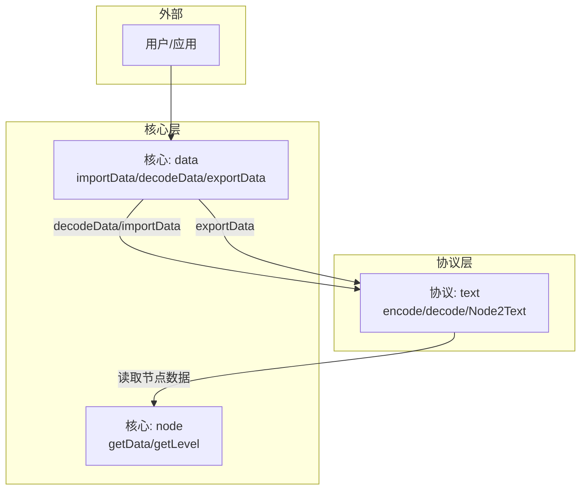
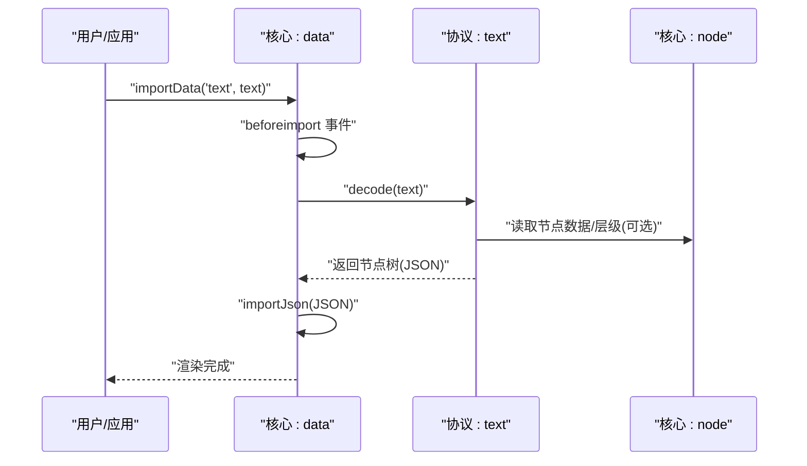
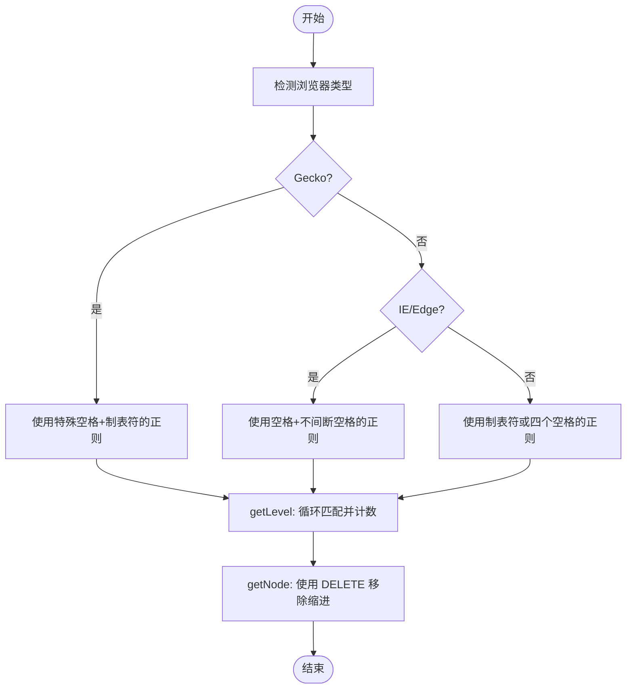
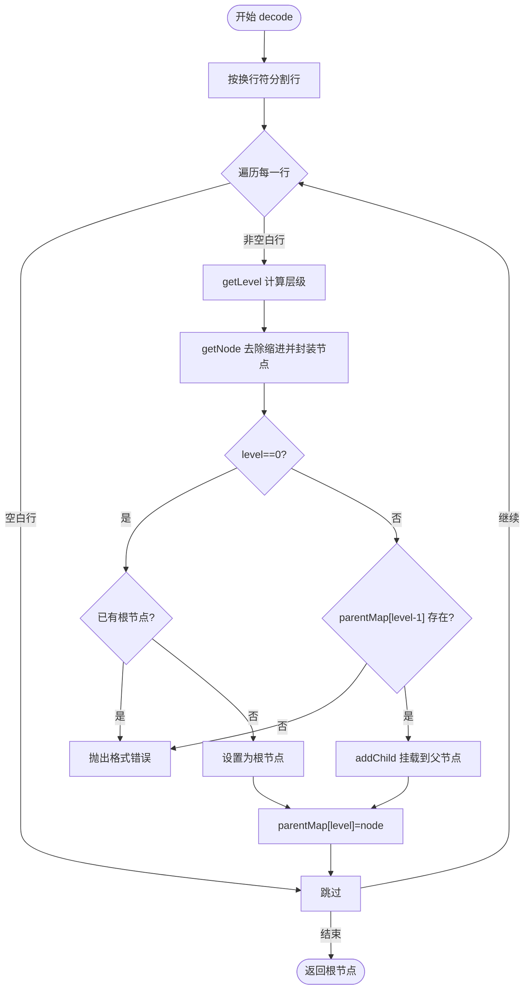
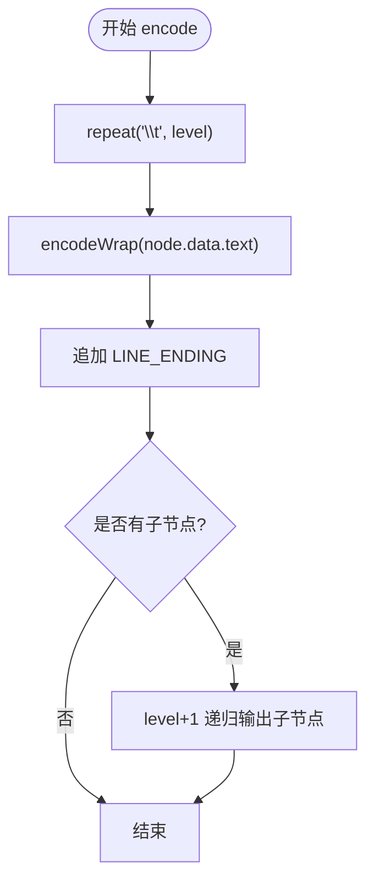
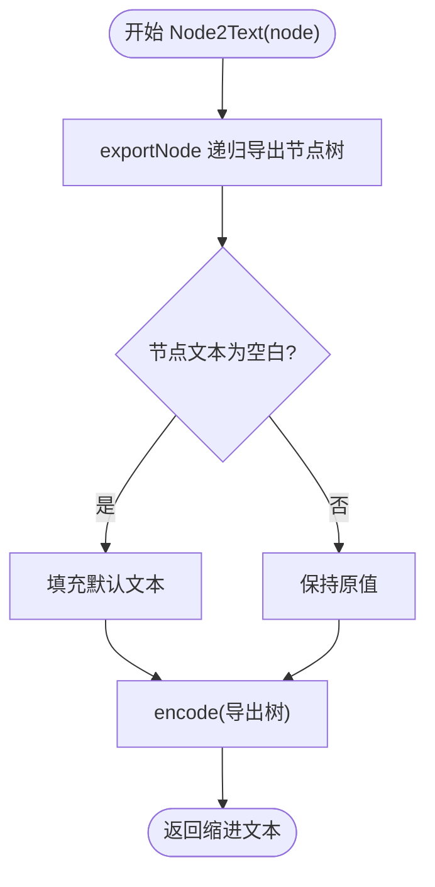
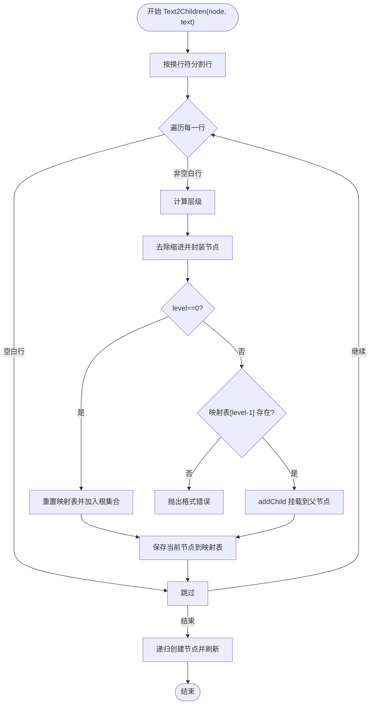
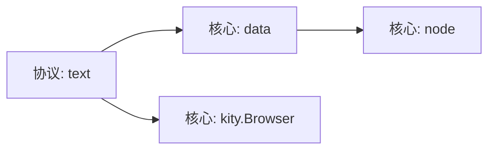

# 纯文本协议

<cite>
**本文引用的文件**
- [src/protocol/text.js](file://src/protocol/text.js)
- [src/core/data.js](file://src/core/data.js)
- [src/core/node.js](file://src/core/node.js)
- [README.md](file://README.md)
</cite>

## 目录
1. [简介](#简介)
2. [项目结构](#项目结构)
3. [核心组件](#核心组件)
4. [架构总览](#架构总览)
5. [详细组件分析](#详细组件分析)
6. [依赖关系分析](#依赖关系分析)
7. [性能考量](#性能考量)
8. [故障排查指南](#故障排查指南)
9. [结论](#结论)
10. [附录](#附录)

## 简介
本章节面向“纯文本协议”的实现原理与浏览器兼容性处理，重点围绕以下目标展开：
- 解析 text.js 中如何通过 TAB_CHAR 正则表达式适配不同浏览器（Gecko、IE/Edge、其他）对制表符与空格的差异性解析，确保在各种环境下都能正确识别缩进层级。
- 阐述 decode 函数如何通过 getLevel 与 getNode 方法将缩进文本转换为节点树结构，利用 parentMap 维护层级关系，并在格式非法时抛出异常。
- 说明 encode 函数如何将节点树按层级缩进生成文本；Node2Text 扩展方法如何将选中节点导出为缩进文本。
- 描述 encodeWrap 与 decodeWrap 函数对换行符 \n 的转义处理机制，防止文本内容中的换行破坏结构。
- 提供示例，展示如何批量导入用 TAB 缩进的大纲文本。
- 解决常见问题：混合使用空格和制表符导致的解析失败、文本中包含制表符内容的误判、跨平台换行符差异等。

## 项目结构
纯文本协议位于协议层，负责将脑图节点树与纯文本之间相互转换。其核心入口与调用链如下：
- 协议注册：在协议层注册名为 text 的协议，暴露 encode、decode、Node2Text 三个接口。
- 核心调用：核心模块通过 importData/decodeData 与 exportData 与协议交互，完成导入/导出流程。
- 节点模型：节点对象提供数据访问与层级信息，供协议层读取与构建树结构。

图表来源
- [src/protocol/text.js](file://src/protocol/text.js#L219-L237)
- [src/core/data.js](file://src/core/data.js#L310-L415)
- [src/core/node.js](file://src/core/node.js#L85-L115)

章节来源
- [src/protocol/text.js](file://src/protocol/text.js#L1-L237)
- [src/core/data.js](file://src/core/data.js#L310-L415)
- [src/core/node.js](file://src/core/node.js#L85-L115)

## 核心组件
- 文本协议（src/protocol/text.js）
  - TAB_CHAR：根据浏览器类型动态生成匹配缩进的正则，适配 Gecko、IE/Edge 与其它浏览器对制表符与空格的不同行为。
  - encode/encodeWrap：将节点树按层级缩进输出为文本，对换行符进行转义处理。
  - decode/decodeWrap/getLevel/getNode：将缩进文本解析为节点树，维护 parentMap 以保证层级关系合法。
  - Node2Text：将当前选中节点导出为缩进文本。
- 核心数据（src/core/data.js）
  - importData/decodeData/exportData：协议与核心之间的桥接，负责事件触发、协议校验与数据流转。
- 节点模型（src/core/node.js）
  - getData/getLevel：为协议层提供节点数据与层级信息。

章节来源
- [src/protocol/text.js](file://src/protocol/text.js#L1-L237)
- [src/core/data.js](file://src/core/data.js#L310-L415)
- [src/core/node.js](file://src/core/node.js#L85-L115)

## 架构总览
下面的序列图展示了从导入到渲染的完整流程，以及协议层与核心层的交互。

图表来源
- [src/core/data.js](file://src/core/data.js#L343-L415)
- [src/protocol/text.js](file://src/protocol/text.js#L219-L237)

## 详细组件分析

### 浏览器兼容性与缩进解析（TAB_CHAR）
- 目标：在不同浏览器中正确识别缩进层级，避免因制表符与空格的差异导致解析失败。
- 实现要点：
  - Gecko（Firefox）：使用包含特殊空格字符的组合，确保在 Gecko 下能匹配到正确的缩进。
  - IE/Edge：将制表符在 div 中转义为空格，因此使用空格与不间断空格作为匹配依据。
  - 其他浏览器：使用标准制表符或四个连续空格作为缩进单位。
- 影响范围：
  - getLevel：通过循环匹配 TAB_CHAR.REGEXP 来计算层级数。
  - getNode：使用 TAB_CHAR.DELETE 从行首移除缩进，保留纯文本内容。
  - parentMap：在 decode 中维护层级映射，确保父子关系合法。

图表来源
- [src/protocol/text.js](file://src/protocol/text.js#L10-L30)
- [src/protocol/text.js](file://src/protocol/text.js#L144-L160)

章节来源
- [src/protocol/text.js](file://src/protocol/text.js#L10-L30)
- [src/protocol/text.js](file://src/protocol/text.js#L144-L160)

### 解码流程（decode）与层级关系
- 输入：纯文本（含缩进层级与换行）。
- 关键步骤：
  - 分割行：使用 LINE_ENDING_SPLITER 按跨平台换行符分割。
  - 过滤空白行：isEmpty 判空。
  - 计算层级：getLevel 通过 TAB_CHAR.REGEXP 计算缩进层级。
  - 构建节点：getNode 去除缩进后封装为节点对象。
  - 维护父子关系：parentMap[level] 指向上一层父节点；addChild 将子节点挂载到父节点 children。
  - 错误处理：当 level 为 0 且已有根节点，或 level > 0 但缺少父节点时，抛出“无效格式”异常。
- 输出：根节点树结构（JSON）。

图表来源
- [src/protocol/text.js](file://src/protocol/text.js#L162-L194)
- [src/protocol/text.js](file://src/protocol/text.js#L140-L160)

章节来源
- [src/protocol/text.js](file://src/protocol/text.js#L162-L194)
- [src/protocol/text.js](file://src/protocol/text.js#L140-L160)

### 编码流程（encode）与换行转义（encodeWrap/decodeWrap）
- encode：
  - 递归输出：按层级重复制表符，输出 encodeWrap 后的内容，末尾追加 LINE_ENDING。
  - 子节点：对每个子节点 level+1 递归输出。
- 换行转义：
  - encodeWrap：将文本中的换行符与反斜杠+“n”序列进行转义，避免与结构换行混淆。
  - decodeWrap：将转义后的序列还原为真实换行符或反斜杠+“n”，确保内容显示正确。
- LINE_ENDING：
  - 统一使用回车作为行尾标记，decode 时按跨平台换行符分割，保证跨平台一致性。

图表来源
- [src/protocol/text.js](file://src/protocol/text.js#L127-L138)
- [src/protocol/text.js](file://src/protocol/text.js#L44-L76)
- [src/protocol/text.js](file://src/protocol/text.js#L84-L125)

章节来源
- [src/protocol/text.js](file://src/protocol/text.js#L127-L138)
- [src/protocol/text.js](file://src/protocol/text.js#L44-L76)
- [src/protocol/text.js](file://src/protocol/text.js#L84-L125)

### Node2Text 扩展方法
- 功能：将当前选中节点导出为缩进文本。
- 实现要点：
  - 递归导出节点树：exportNode 深拷贝节点数据与子节点。
  - 默认文本处理：若节点文本为空白，则填充默认占位文本，避免空节点影响导出。
  - 调用 encode：以导出的节点树为输入，生成缩进文本。

图表来源
- [src/protocol/text.js](file://src/protocol/text.js#L201-L217)
- [src/protocol/text.js](file://src/protocol/text.js#L127-L138)

章节来源
- [src/protocol/text.js](file://src/protocol/text.js#L201-L217)
- [src/protocol/text.js](file://src/protocol/text.js#L127-L138)

### 批量导入示例（Text2Children）
- 作用：将一段缩进文本批量插入到某个节点下，不改变该父节点本身。
- 关键点：
  - 行分割与缩进解析：使用与纯文本协议一致的缩进规则与行分割策略。
  - 层级映射：通过临时映射表记录每层最后一个节点，保证父子关系正确。
  - 错误处理：当某层级找不到父节点时抛出“无效格式”。

图表来源
- [src/core/data.js](file://src/core/data.js#L92-L179)

章节来源
- [src/core/data.js](file://src/core/data.js#L92-L179)

## 依赖关系分析
- 协议层依赖：
  - 核心数据：通过 data.registerProtocol 注册协议，并在 importData/decodeData/exportData 中调用协议的 encode/decode。
  - 节点模型：在 Node2Text 中读取节点数据与子节点，构建导出树。
- 核心层依赖：
  - 事件系统：导入/导出前后触发事件，便于上层监听。
  - Promise：异步处理导入/导出结果。
- 浏览器兼容性：
  - 通过 Browser 检测决定 TAB_CHAR 的正则配置，从而适配不同浏览器对制表符与空格的解析差异。

图表来源
- [src/protocol/text.js](file://src/protocol/text.js#L1-L30)
- [src/core/data.js](file://src/core/data.js#L310-L415)
- [src/core/node.js](file://src/core/node.js#L85-L115)

章节来源
- [src/protocol/text.js](file://src/protocol/text.js#L1-L30)
- [src/core/data.js](file://src/core/data.js#L310-L415)
- [src/core/node.js](file://src/core/node.js#L85-L115)

## 性能考量
- 时间复杂度：
  - decode/encode 均为 O(N)，其中 N 为节点总数；行分割与逐行处理为线性。
- 空间复杂度：
  - 递归 encode/Node2Text 构建导出树，空间与节点数量线性相关。
- 优化建议：
  - 在大规模导入时，优先使用批量导入接口（如 Text2Children），减少逐节点创建的开销。
  - 对超长文本，尽量避免在 UI 中一次性渲染，采用分页或懒加载策略。

## 故障排查指南
- 混合使用空格与制表符导致解析失败
  - 现象：解析到 level 异常或抛出“无效格式”。
  - 原因：不同浏览器对缩进的匹配规则不同，混用会导致 TAB_CHAR 无法正确识别缩进。
  - 解决：统一使用制表符或四个空格作为缩进单位，避免混用。
  - 参考
    - [src/protocol/text.js](file://src/protocol/text.js#L10-L30)
    - [src/protocol/text.js](file://src/protocol/text.js#L144-L160)
- 文本中包含制表符内容被误判为缩进
  - 现象：节点文本中出现制表符，解析时被当作缩进导致层级错误。
  - 原因：getNode 使用 DELETE 从行首移除缩进，未区分“内容中的制表符”与“缩进”。
  - 解决：在内容中避免使用制表符，或在导出前对内容进行转义（当前协议已通过换行转义保障结构安全，内容中的制表符需手动规避）。
  - 参考
    - [src/protocol/text.js](file://src/protocol/text.js#L144-L160)
- 跨平台换行符差异
  - 现象：Windows/Linux/Mac 平台换行符不同，导致解析异常。
  - 原因：不同平台换行符不同，未统一处理。
  - 解决：decode 使用跨平台换行符分割；统一使用 LINE_ENDING 作为输出行尾。
  - 参考
    - [src/protocol/text.js](file://src/protocol/text.js#L10-L12)
    - [src/protocol/text.js](file://src/protocol/text.js#L127-L138)
- 导入后节点文本为空白
  - 现象：导出或批量导入后节点文本为空白。
  - 原因：Node2Text 对空白文本进行默认填充。
  - 解决：在业务侧检查节点文本，必要时提示用户输入有效内容。
  - 参考
    - [src/protocol/text.js](file://src/protocol/text.js#L212-L217)

章节来源
- [src/protocol/text.js](file://src/protocol/text.js#L10-L30)
- [src/protocol/text.js](file://src/protocol/text.js#L144-L160)
- [src/protocol/text.js](file://src/protocol/text.js#L127-L138)
- [src/protocol/text.js](file://src/protocol/text.js#L212-L217)

## 结论
- 纯文本协议通过动态生成的 TAB_CHAR 正则，有效适配不同浏览器对制表符与空格的差异，确保缩进层级识别稳定。
- decode 通过 parentMap 维护层级关系，严格校验格式合法性，避免错误树结构。
- encode/Node2Text 将节点树转换为缩进文本，encodeWrap/decodeWrap 保障换行符转义与还原的正确性。
- 批量导入接口（Text2Children）提供更灵活的节点插入方式，适合大体量大纲文本的快速导入。
- 针对常见问题，建议统一缩进单位、避免内容中使用制表符、注意跨平台换行符差异。

## 附录
- 浏览器兼容性说明
  - 项目 README 明确支持 Chrome、Firefox、Safari、Edge、IE 10+，纯文本协议通过 Browser 检测适配各浏览器差异。
  - 参考
    - [README.md](file://README.md#L39-L48)