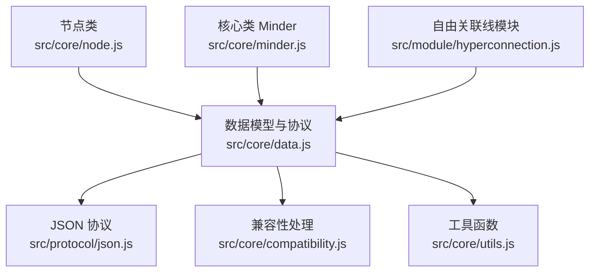
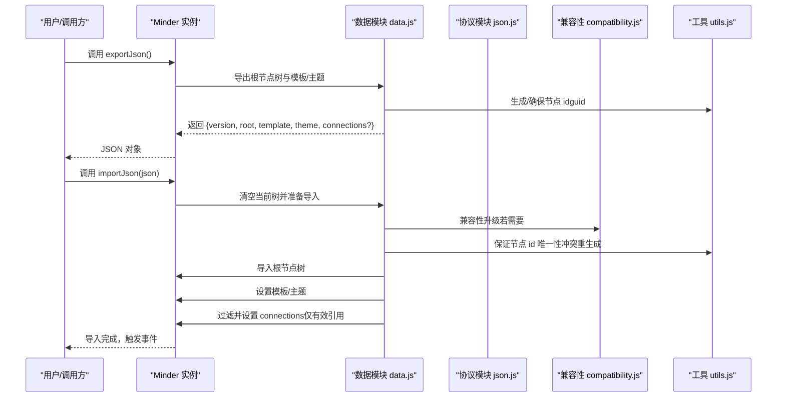
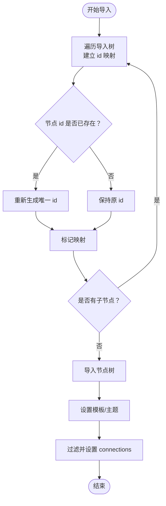
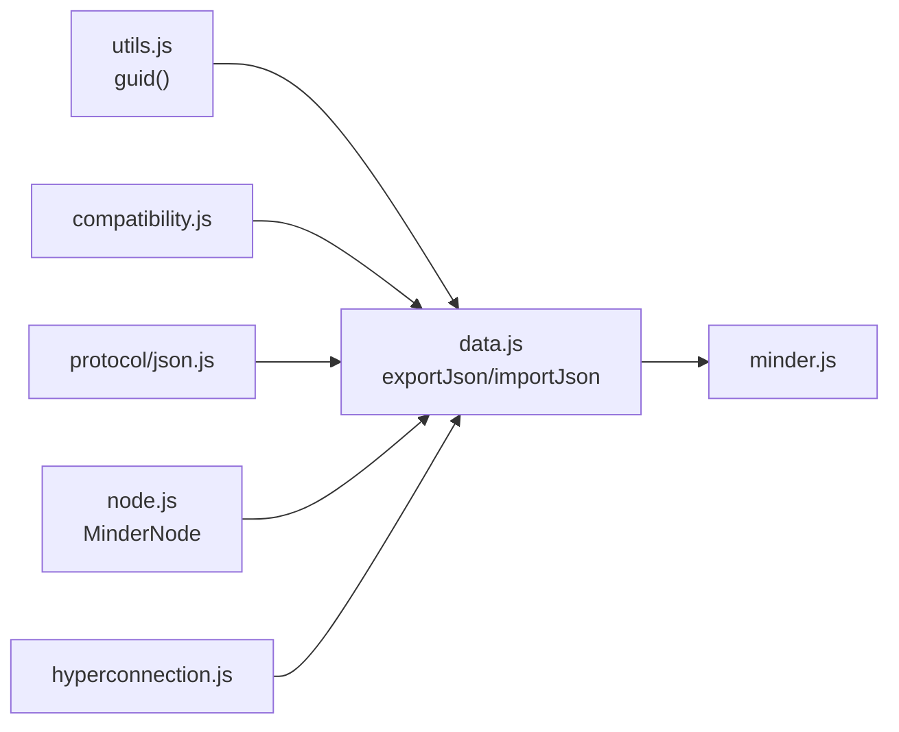

# 数据模型

<cite>
**本文引用的文件**
- [Architecture.md](file://doc/Architecture.md)
- [data.js](file://src/core/data.js)
- [utils.js](file://src/core/utils.js)
- [compatibility.js](file://src/core/compatibility.js)
- [json.js](file://src/protocol/json.js)
- [hyperconnection.js](file://src/module/hyperconnection.js)
- [node.js](file://src/core/node.js)
- [minder.js](file://src/core/minder.js)
</cite>

## 目录
1. [简介](#简介)
2. [项目结构](#项目结构)
3. [核心组件](#核心组件)
4. [架构总览](#架构总览)
5. [详细组件分析](#详细组件分析)
6. [依赖分析](#依赖分析)
7. [性能考虑](#性能考虑)
8. [故障排查指南](#故障排查指南)
9. [结论](#结论)

## 简介
本文件系统性阐述 kityminder-core v2 数据模型结构，围绕顶层数据对象的版本字段、根节点树形结构、模板与主题配置、以及自由关联线 connections 数组进行深入解析。重点说明节点数据结构中 id 字段的自动生成机制与冲突解决策略，并结合架构文档中的数据结构示例，逐项解释 connections 中每条关联线对象的字段语义（id、from、to、text、type、color、strokeWidth、controlPoint1、controlPoint2）。同时给出 v1 到 v2 的兼容性处理流程，包括无 version 字段旧数据的自动升级、缺失 id 节点的唯一标识生成，以及通过 exportJson()/importJson() 的正确使用方式。最后提供常见问题的定位与解决方案，如 ID 冲突导致的导入失败、无效节点引用的处理等。

## 项目结构
围绕数据模型的关键文件分布如下：
- 文档与架构说明：doc/Architecture.md
- 数据导入导出与协议：src/core/data.js、src/protocol/json.js
- 工具与兼容性：src/core/utils.js、src/core/compatibility.js
- 节点与核心类：src/core/node.js、src/core/minder.js
- 自由关联线模块：src/module/hyperconnection.js

图表来源
- [data.js](file://src/core/data.js#L1-L120)
- [json.js](file://src/protocol/json.js#L1-L18)
- [compatibility.js](file://src/core/compatibility.js#L1-L92)
- [utils.js](file://src/core/utils.js#L1-L66)
- [node.js](file://src/core/node.js#L1-L60)
- [minder.js](file://src/core/minder.js#L1-L41)
- [hyperconnection.js](file://src/module/hyperconnection.js#L1-L120)

章节来源
- [data.js](file://src/core/data.js#L1-L120)
- [Architecture.md](file://doc/Architecture.md#L598-L682)

## 核心组件
- 顶层数据对象
  - version：版本号，v2 为 "2"
  - root：树形根节点，包含 data 与 children
  - template：模板名称（默认值在导入时设置）
  - theme：主题名称（可空）
  - connections：自由关联线数组（可空）
- 节点数据对象
  - data：节点数据，包含 id、text 等字段
  - children：子节点数组
- 关联线对象
  - id：连线唯一标识
  - from/to：起止节点 id
  - text：连线说明文字（可选）
  - type：连线类型（arrow/line/dashed）
  - color/strokeWidth：颜色与线宽（可选）
  - controlPoint1/controlPoint2：贝塞尔控制点偏移（相对默认位置）

章节来源
- [Architecture.md](file://doc/Architecture.md#L598-L682)
- [data.js](file://src/core/data.js#L56-L90)
- [hyperconnection.js](file://src/module/hyperconnection.js#L18-L30)

## 架构总览
v2 数据模型的生成与导入流程如下：

图表来源
- [data.js](file://src/core/data.js#L56-L120)
- [data.js](file://src/core/data.js#L234-L308)
- [json.js](file://src/protocol/json.js#L1-L18)
- [compatibility.js](file://src/core/compatibility.js#L1-L92)
- [utils.js](file://src/core/utils.js#L1-L66)

## 详细组件分析

### 顶层数据对象与版本字段
- version
  - 导出时固定为 "2"
  - 用于区分 v1 与 v2 数据格式
- root
  - 包含 data 与 children
  - data 中应包含 id（v2 要求）
- template/theme
  - 导出时写入当前模板与主题
  - 导入时设置模板（默认 "default"），主题可空
- connections
  - 可选数组，保存自由关联线
  - 导入时仅保留 from/to 引用均存在的有效连线

章节来源
- [data.js](file://src/core/data.js#L56-L90)
- [data.js](file://src/core/data.js#L274-L290)
- [Architecture.md](file://doc/Architecture.md#L645-L662)

### 节点数据结构与 id 自动生成
- 节点构造时自动分配 id
  - 节点类在构造函数中初始化 data.id 为 guid
- 导出时确保节点 id
  - exportJson() 会为缺失 id 的节点生成并回填
- 导入时保证 id 唯一
  - importJson() 遍历整棵导入树，先建立 id 映射表
  - 若发现重复 id，重新生成新的唯一 id
- 冲突解决策略
  - 一旦发现重复 id，立即重新生成并标记映射，确保全局唯一

图表来源
- [data.js](file://src/core/data.js#L234-L308)
- [node.js](file://src/core/node.js#L21-L40)
- [utils.js](file://src/core/utils.js#L13-L16)

章节来源
- [node.js](file://src/core/node.js#L21-L40)
- [data.js](file://src/core/data.js#L56-L90)
- [data.js](file://src/core/data.js#L234-L308)

### 关联线 connections 字段详解
- 字段含义
  - id：连线唯一标识（模块内命令生成）
  - from/to：起止节点 id
  - text：连线说明文字（可选）
  - type：连线类型（arrow/line/dashed）
  - color/strokeWidth：颜色与线宽（可选）
  - controlPoint1/controlPoint2：贝塞尔控制点偏移（相对默认位置）
- 渲染与交互
  - 模块负责渲染、事件绑定、控制点拖拽、文字编辑等
  - 贝塞尔曲线根据默认控制点与用户偏移动态计算
- 导入时的校验
  - 仅保留 from/to 均存在于 idMap 中的有效连线
  - 无效连线自动过滤，避免引用不存在节点

章节来源
- [Architecture.md](file://doc/Architecture.md#L598-L644)
- [hyperconnection.js](file://src/module/hyperconnection.js#L18-L30)
- [hyperconnection.js](file://src/module/hyperconnection.js#L405-L567)
- [data.js](file://src/core/data.js#L277-L290)

### v1 到 v2 的兼容性处理
- 自动识别版本
  - 无 version 字段时，兼容性模块推断旧版本并进行升级
- 升级步骤
  - 将旧版顶层 data/children 包装为新版 root.data/root.children
  - 迁移历史字段与样式映射
- 导入时的 v1 补齐
  - 导入时为缺失 id 的节点生成唯一 id
  - 为所有节点建立 id 映射，保证后续 connections 校验可用

章节来源
- [compatibility.js](file://src/core/compatibility.js#L1-L92)
- [data.js](file://src/core/data.js#L234-L308)

### 导出与导入 API 使用
- 导出
  - exportJson()：返回完整 v2 数据对象（包含 version、root、template、theme、connections）
  - 导出时会确保每个节点都有 id
- 导入
  - importJson(json)：清空当前树，执行兼容性升级，保证 id 唯一，设置模板/主题，过滤并设置 connections
  - importData(protocolName, data)：先解码为 JSON，再调用 importJson
  - decodeData(protocolName, data)：仅解码为 JSON，不覆盖当前实例

章节来源
- [data.js](file://src/core/data.js#L56-L120)
- [data.js](file://src/core/data.js#L234-L308)
- [json.js](file://src/protocol/json.js#L1-L18)

## 依赖分析
- 数据模块依赖
  - utils.guid()：生成唯一 id
  - compatibility：旧版数据升级
  - protocol/json：JSON 协议编解码
- 节点类依赖 utils.guid()：节点构造时自动分配 id
- 关联线模块依赖
  - Minder.get/setHyperConnections
  - 渲染器与事件系统：用于控制点拖拽、选中、布局变化更新

图表来源
- [utils.js](file://src/core/utils.js#L13-L16)
- [data.js](file://src/core/data.js#L1-L120)
- [compatibility.js](file://src/core/compatibility.js#L1-L92)
- [json.js](file://src/protocol/json.js#L1-L18)
- [node.js](file://src/core/node.js#L21-L40)
- [hyperconnection.js](file://src/module/hyperconnection.js#L1-L120)
- [minder.js](file://src/core/minder.js#L1-L41)

章节来源
- [data.js](file://src/core/data.js#L1-L120)
- [node.js](file://src/core/node.js#L21-L40)
- [hyperconnection.js](file://src/module/hyperconnection.js#L1-L120)

## 性能考虑
- 导出阶段
  - 递归遍历整棵树导出节点数据，时间复杂度 O(N)，N 为节点总数
  - 仅在缺失 id 时生成 guid，避免不必要的重复生成
- 导入阶段
  - 遍历整棵导入树建立 id 映射与去重，时间复杂度 O(N)
  - connections 过滤采用线性扫描，时间复杂度 O(C)，C 为关联线数量
- 渲染阶段
  - 关联线渲染使用贝塞尔曲线，控制点拖拽更新时仅更新受影响的连线
  - 布局完成后统一更新所有关联线，减少频繁重绘

[本节为通用性能讨论，无需列出具体文件来源]

## 故障排查指南
- ID 冲突导致的导入失败
  - 现象：导入后某些节点 id 丢失或重复
  - 原因：导入树中存在重复 id
  - 解决：导入流程会自动检测并重新生成唯一 id，确保全局唯一
  - 参考路径：[data.js](file://src/core/data.js#L251-L270)
- 无效节点引用（from/to 不存在）
  - 现象：导入后部分关联线消失
  - 原因：from/to 指向的节点 id 不存在
  - 解决：导入时仅保留 from/to 均存在于 idMap 中的连线
  - 参考路径：[data.js](file://src/core/data.js#L277-L290)
- v1 数据导入异常
  - 现象：缺少 version 字段或节点无 id
  - 原因：旧版数据格式
  - 解决：兼容性模块自动升级并补齐 id
  - 参考路径：[compatibility.js](file://src/core/compatibility.js#L1-L92)
- 导出后缺少 connections
  - 现象：导出数据中 connections 为空数组
  - 原因：当前无自由关联线或模块未启用
  - 解决：模块启用后，导出时保留 connections 字段
  - 参考路径：[data.js](file://src/core/data.js#L84-L88)
- 导入后布局错乱
  - 现象：导入后连线位置异常
  - 原因：布局尚未完成或节点删除导致
  - 解决：等待布局完成事件后，模块会自动更新所有关联线
  - 参考路径：[hyperconnection.js](file://src/module/hyperconnection.js#L789-L800)

章节来源
- [data.js](file://src/core/data.js#L251-L308)
- [compatibility.js](file://src/core/compatibility.js#L1-L92)
- [hyperconnection.js](file://src/module/hyperconnection.js#L789-L800)

## 结论
kityminder-core v2 数据模型以清晰的版本字段、严格的节点 id 唯一性、完善的模板与主题配置，以及可选的自由关联线 connections，构建了稳定且可扩展的数据层。通过工具函数与兼容性模块的配合，实现了从 v1 到 v2 的平滑过渡与导入时的健壮性保障。开发者可通过 exportJson()/importJson() 便捷地导出与导入完整数据模型，并利用模块提供的 API 管理自由关联线。遇到 ID 冲突、无效引用等问题时，可依据本文提供的排查路径快速定位并解决。