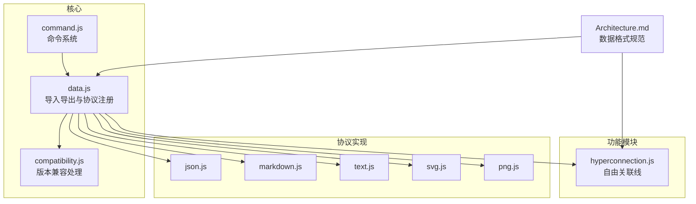
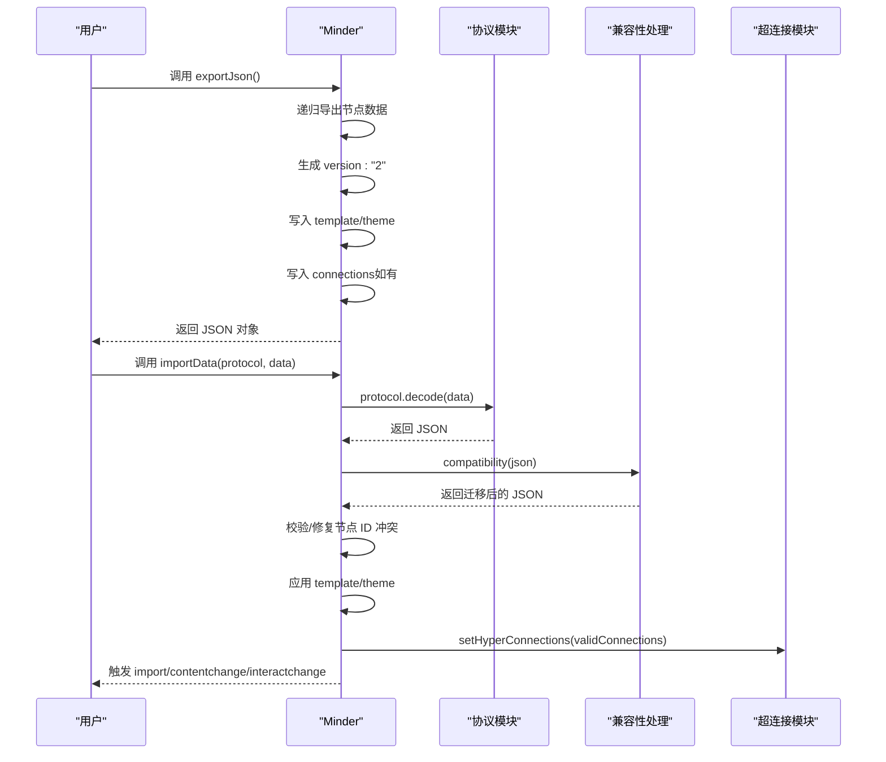
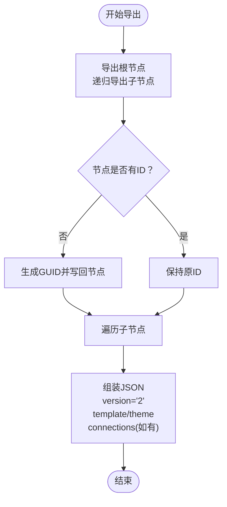
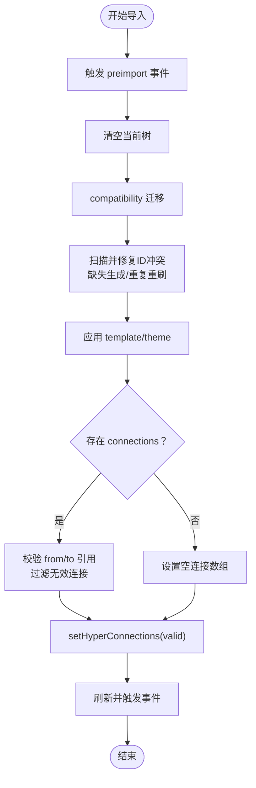
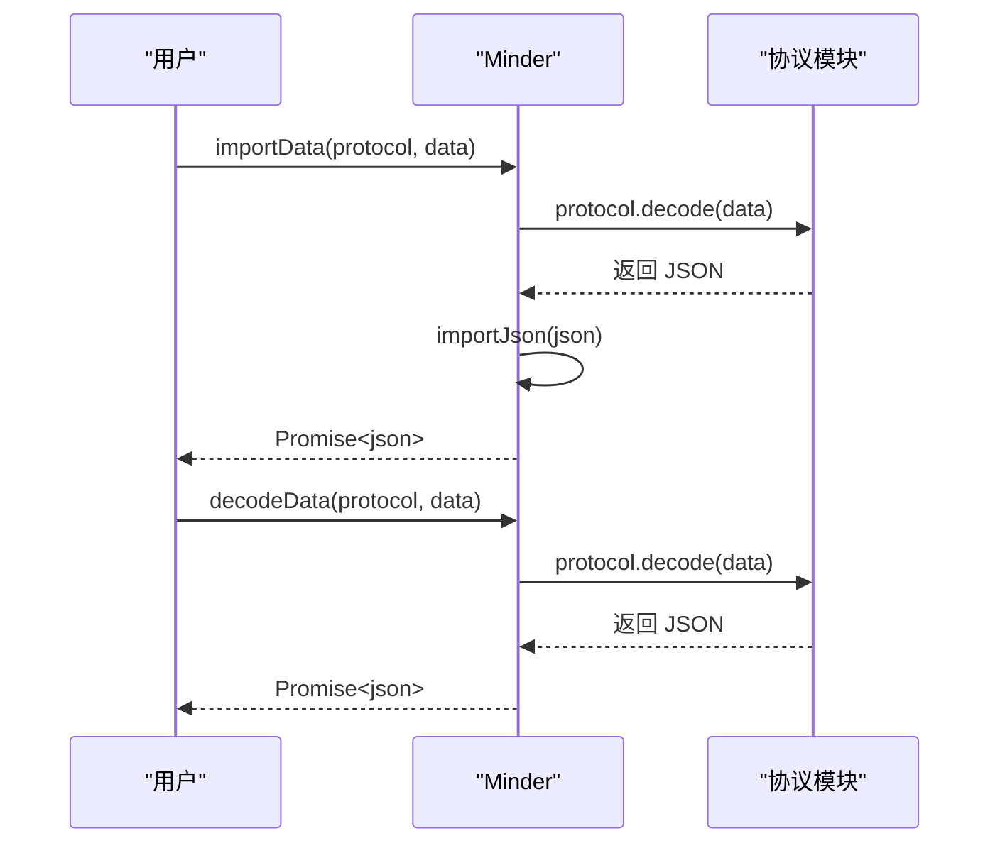
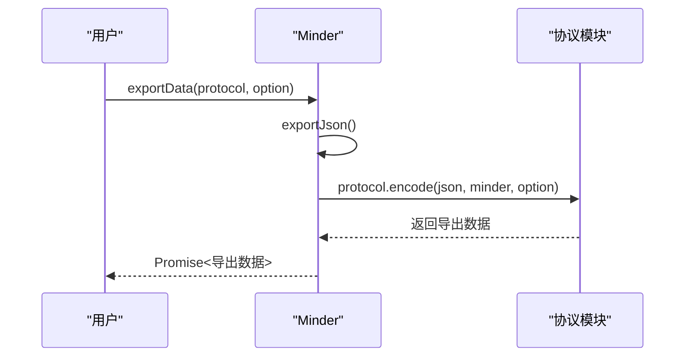
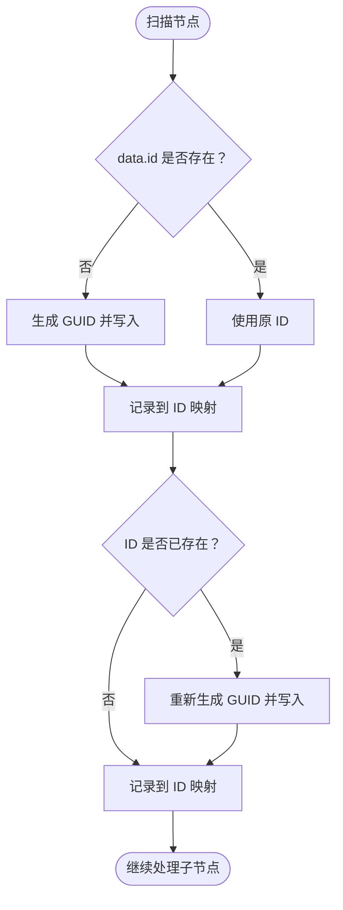
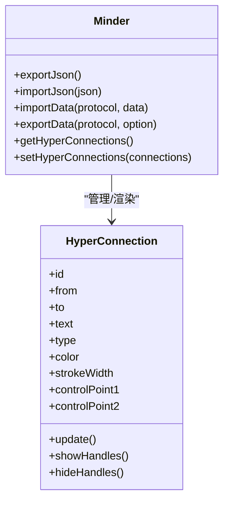
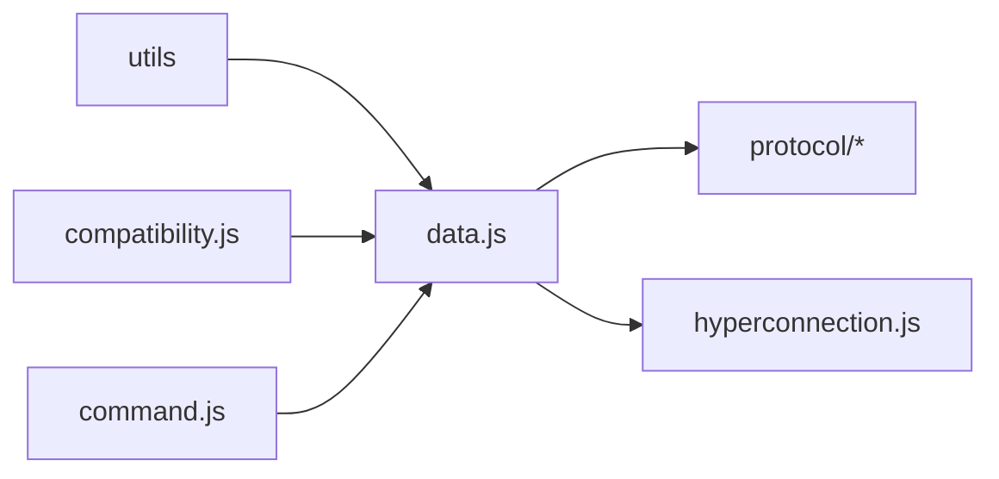

# 数据管理

<cite>
**本文引用的文件**
- [doc/Architecture.md](file://doc/Architecture.md)
- [src/core/data.js](file://src/core/data.js)
- [src/core/compatibility.js](file://src/core/compatibility.js)
- [src/core/command.js](file://src/core/command.js)
- [src/protocol/json.js](file://src/protocol/json.js)
- [src/protocol/markdown.js](file://src/protocol/markdown.js)
- [src/protocol/text.js](file://src/protocol/text.js)
- [src/protocol/svg.js](file://src/protocol/svg.js)
- [src/protocol/png.js](file://src/protocol/png.js)
- [src/module/hyperconnection.js](file://src/module/hyperconnection.js)
</cite>

## 目录
1. [简介](#简介)
2. [项目结构](#项目结构)
3. [核心组件](#核心组件)
4. [架构总览](#架构总览)
5. [详细组件分析](#详细组件分析)
6. [依赖分析](#依赖分析)
7. [性能考虑](#性能考虑)
8. [故障排查指南](#故障排查指南)
9. [结论](#结论)
10. [附录](#附录)

## 简介
本章节系统性地描述数据管理功能，重点解析 version 2 数据模型结构及其与旧版的兼容性处理。围绕 src/core/data.js 中的 exportJson、importJson、importData、exportData 等方法，阐述节点 ID 的自动生成与冲突解决、自由关联线（connections）的序列化与反序列化。同时，结合 Architecture.md 中的数据格式规范，解释 version 字段的作用与 v1 到 v2 的迁移策略，并给出通过 execCommand('ImportData') 与 exportJson() 的实际操作示例，最后提供针对 Markdown 导入格式错误、PNG 导出模糊、大型数据导入性能瓶颈等常见问题的解决方案。

## 项目结构
数据管理相关的核心文件分布如下：
- 核心数据协议与导入导出：src/core/data.js
- 兼容性处理：src/core/compatibility.js
- 协议实现：src/protocol/json.js、src/protocol/markdown.js、src/protocol/text.js、src/protocol/svg.js、src/protocol/png.js
- 命令系统：src/core/command.js
- 自由关联线模块：src/module/hyperconnection.js
- 数据格式规范与版本说明：doc/Architecture.md

图表来源
- [src/core/data.js](file://src/core/data.js#L1-L416)
- [src/core/compatibility.js](file://src/core/compatibility.js#L1-L92)
- [src/core/command.js](file://src/core/command.js#L1-L169)
- [src/protocol/json.js](file://src/protocol/json.js#L1-L18)
- [src/protocol/markdown.js](file://src/protocol/markdown.js#L1-L158)
- [src/protocol/text.js](file://src/protocol/text.js#L1-L238)
- [src/protocol/svg.js](file://src/protocol/svg.js#L1-L244)
- [src/protocol/png.js](file://src/protocol/png.js#L1-L289)
- [src/module/hyperconnection.js](file://src/module/hyperconnection.js#L600-L760)
- [doc/Architecture.md](file://doc/Architecture.md#L594-L722)

章节来源
- [src/core/data.js](file://src/core/data.js#L1-L416)
- [doc/Architecture.md](file://doc/Architecture.md#L594-L722)

## 核心组件
- 数据导入导出与协议注册：在 Minder 类上扩展 exportJson、importJson、importData、exportData、decodeData 等方法，统一管理协议注册与调用。
- 兼容性处理：根据 version 字段对旧版数据进行迁移，确保 v1 到 v2 的平滑过渡。
- 协议实现：JSON、Markdown、纯文本、SVG、PNG 等协议的 encode/decode。
- 自由关联线：connections 字段的序列化与反序列化，以及与节点 ID 的一致性校验。
- 命令系统：通过 execCommand 触发导入等操作，保证事件与撤销机制的一致性。

章节来源
- [src/core/data.js](file://src/core/data.js#L50-L120)
- [src/core/data.js](file://src/core/data.js#L226-L308)
- [src/core/data.js](file://src/core/data.js#L310-L415)
- [src/core/compatibility.js](file://src/core/compatibility.js#L1-L92)
- [doc/Architecture.md](file://doc/Architecture.md#L594-L722)

## 架构总览
数据管理的整体流程如下：
- 导出：exportJson 生成 v2 结构，包含 root、version、template、theme、connections。
- 导入：importData 解析协议，decodeData 仅解析不覆盖，importJson 负责清洗与应用。
- 兼容性：compatibility 根据 version 进行迁移，确保 v1 到 v2 的兼容。
- 关联线：connections 字段在导入时进行节点引用校验与冲突处理，导出时保留空数组以便后续添加。

图表来源
- [src/core/data.js](file://src/core/data.js#L50-L120)
- [src/core/data.js](file://src/core/data.js#L226-L308)
- [src/core/data.js](file://src/core/data.js#L310-L415)
- [src/core/compatibility.js](file://src/core/compatibility.js#L1-L92)
- [src/protocol/json.js](file://src/protocol/json.js#L1-L18)
- [src/protocol/markdown.js](file://src/protocol/markdown.js#L1-L158)
- [src/protocol/text.js](file://src/protocol/text.js#L1-L238)
- [src/protocol/svg.js](file://src/protocol/svg.js#L1-L244)
- [src/protocol/png.js](file://src/protocol/png.js#L1-L289)
- [src/module/hyperconnection.js](file://src/module/hyperconnection.js#L700-L760)

## 详细组件分析

### 数据模型与版本字段
- v2 数据模型包含：
  - version: "2"
  - root: 树根节点，包含 data 与 children
  - template: 模板名称
  - theme: 主题名称
  - connections: 自由关联线数组（可为空）
- v1 到 v2 的迁移策略：
  - 自动识别旧版数据并迁移至 v2 结构
  - 旧版无 version 字段时，导入时自动补全并生成新 ID
  - 旧版 connections 字段在 v2 中保留，但旧版软件会忽略

章节来源
- [doc/Architecture.md](file://doc/Architecture.md#L594-L722)
- [src/core/compatibility.js](file://src/core/compatibility.js#L1-L92)
- [src/core/data.js](file://src/core/data.js#L50-L120)
- [src/core/data.js](file://src/core/data.js#L226-L308)

### exportJson 导出流程
- 递归导出节点数据，确保每个节点都有唯一 ID（缺失则生成）
- 写入 version: "2"、template、theme
- 写入 connections（若存在）

图表来源
- [src/core/data.js](file://src/core/data.js#L50-L120)

章节来源
- [src/core/data.js](file://src/core/data.js#L50-L120)

### importJson 导入流程
- 触发 preimport 事件
- 清空当前树
- compatibility 进行版本迁移
- 递归扫描并修复节点 ID 冲突（缺失则生成，重复则重刷）
- 应用 template/theme
- 校验并设置 connections（from/to 必须存在于 ID 映射中）
- 刷新并触发 import/contentchange/interactchange

图表来源
- [src/core/data.js](file://src/core/data.js#L226-L308)
- [src/core/compatibility.js](file://src/core/compatibility.js#L1-L92)
- [src/module/hyperconnection.js](file://src/module/hyperconnection.js#L700-L760)

章节来源
- [src/core/data.js](file://src/core/data.js#L226-L308)
- [src/core/compatibility.js](file://src/core/compatibility.js#L1-L92)
- [src/module/hyperconnection.js](file://src/module/hyperconnection.js#L700-L760)

### importData/decodeData 协议导入流程
- importData：解析协议 -> 调用 importJson -> 覆盖当前实例
- decodeData：解析协议 -> 返回 JSON（不覆盖）
- 两者均触发 beforeimport 事件

图表来源
- [src/core/data.js](file://src/core/data.js#L310-L415)
- [src/protocol/json.js](file://src/protocol/json.js#L1-L18)
- [src/protocol/markdown.js](file://src/protocol/markdown.js#L1-L158)
- [src/protocol/text.js](file://src/protocol/text.js#L1-L238)

章节来源
- [src/core/data.js](file://src/core/data.js#L310-L415)

### exportData 协议导出流程
- exportJson 生成 JSON
- 根据协议名查找已注册协议
- 触发 beforeexport 事件
- 调用协议 encode 返回导出数据

图表来源
- [src/core/data.js](file://src/core/data.js#L310-L341)
- [src/protocol/svg.js](file://src/protocol/svg.js#L1-L244)
- [src/protocol/png.js](file://src/protocol/png.js#L1-L289)

章节来源
- [src/core/data.js](file://src/core/data.js#L310-L341)

### 节点 ID 自动生成与冲突解决
- 导出时：若节点无 ID，生成并写回
- 导入时：递归扫描，构建 ID 映射；若缺失则生成，若重复则重刷；确保 from/to 引用有效

图表来源
- [src/core/data.js](file://src/core/data.js#L251-L271)

章节来源
- [src/core/data.js](file://src/core/data.js#L251-L271)

### 自由关联线（connections）序列化与反序列化
- 导出：若存在 _hyperConnections，写入 connections 字段
- 导入：校验 from/to 是否存在于 ID 映射中，过滤无效连接，setHyperConnections
- 超连接模块负责渲染、拖拽控制点、节点删除时清理等

图表来源
- [src/core/data.js](file://src/core/data.js#L50-L120)
- [src/core/data.js](file://src/core/data.js#L226-L308)
- [src/module/hyperconnection.js](file://src/module/hyperconnection.js#L600-L760)

章节来源
- [src/core/data.js](file://src/core/data.js#L50-L120)
- [src/core/data.js](file://src/core/data.js#L226-L308)
- [src/module/hyperconnection.js](file://src/module/hyperconnection.js#L600-L760)

### 协议实现与数据交换

#### JSON 协议（json.js）
- encode：JSON.stringify
- decode：JSON.parse
- 适用于 .km 文件

章节来源
- [src/protocol/json.js](file://src/protocol/json.js#L1-L18)

#### Markdown 协议（markdown.js）
- encode：将树结构转换为 Markdown 标题层级
- decode：解析 Markdown 标题层级为树结构，支持备注块 <!--Note--> 与代码块标记
- 注意：标题层级越位或备注标签内非标题会被视为备注内容

章节来源
- [src/protocol/markdown.js](file://src/protocol/markdown.js#L1-L158)

#### 纯文本协议（text.js）
- encode：使用制表符缩进表示层级，换行符转义
- decode：按层级解析，支持多浏览器下的制表符与空格差异
- Node2Text：将选中节点导出为纯文本

章节来源
- [src/protocol/text.js](file://src/protocol/text.js#L1-L238)

#### SVG 协议（svg.js）
- 通过获取渲染容器边界与 SVG DOM，构造独立的 SVG 文档
- 清洗 transform、marker-end 等属性，替换 &nbsp; 为 &#xa0;
- 输出文本格式的 SVG 字符串

章节来源
- [src/protocol/svg.js](file://src/protocol/svg.js#L1-L244)

#### PNG 协议（png.js）
- 先导出 SVG（Blob + data URL），再加载 SVG 与节点图片（支持跨域图片通过 XHR）
- 在 Canvas 上绘制背景、SVG、节点图片，最终生成 PNG Base64
- 跨域图片失败时仍导出，但节点图片不显示

章节来源
- [src/protocol/png.js](file://src/protocol/png.js#L1-L289)

### 与命令系统的集成
- execCommand 用于触发命令（如添加/删除超连接），importData 本身通过协议解码后调用 importJson
- 命令系统提供事件钩子（beforeExecCommand/preExecCommand/execCommand）与撤销能力

章节来源
- [src/core/command.js](file://src/core/command.js#L1-L169)
- [src/core/data.js](file://src/core/data.js#L310-L415)

## 依赖分析
- data.js 依赖 utils（GUID）、compatibility（版本迁移）、协议模块（json/markdown/text/svg/png）
- 协议模块通过 data.registerProtocol 注册，统一由 data.js 管理
- hyperconnection.js 依赖 Minder 的 connections 管理与渲染容器

图表来源
- [src/core/data.js](file://src/core/data.js#L1-L416)
- [src/core/compatibility.js](file://src/core/compatibility.js#L1-L92)
- [src/module/hyperconnection.js](file://src/module/hyperconnection.js#L700-L760)
- [src/core/command.js](file://src/core/command.js#L1-L169)

章节来源
- [src/core/data.js](file://src/core/data.js#L1-L416)
- [src/core/compatibility.js](file://src/core/compatibility.js#L1-L92)
- [src/module/hyperconnection.js](file://src/module/hyperconnection.js#L700-L760)
- [src/core/command.js](file://src/core/command.js#L1-L169)

## 性能考虑
- 大型数据导入：建议分批导入或在业务层拆分树结构，减少一次性渲染压力
- 超连接渲染：节点数量较多时，避免频繁更新超连接，可采用节流/去抖策略
- PNG 导出：跨域图片加载失败会降级导出，尽量避免跨域图片或替换为同源资源
- SVG 导出：导出前清洗 transform 与 marker-end，避免冗余属性影响渲染

[本节为通用指导，无需特定文件引用]

## 故障排查指南
- Markdown 导入格式错误
  - 症状：标题层级越位或备注标签内非标题被误判为备注
  - 处理：确保标题层级连续，备注块使用 <!--Note--> 与 <!--/Note--> 包裹，避免在备注块中混入标题
  - 参考路径：[src/protocol/markdown.js](file://src/protocol/markdown.js#L51-L158)

- PNG 导出模糊或图片不显示
  - 症状：跨域图片导致导出图片缺失或模糊
  - 处理：替换为同源图片；或在服务端配置 CORS；导出时会提示跨域问题但仍可导出
  - 参考路径：[src/protocol/png.js](file://src/protocol/png.js#L232-L289)

- 大型数据导入性能瓶颈
  - 症状：导入大文件卡顿
  - 处理：拆分导入、延迟渲染、禁用动画、减少超连接更新频率
  - 参考路径：[src/core/data.js](file://src/core/data.js#L226-L308)

- 节点 ID 冲突或丢失
  - 症状：导入后出现重复 ID 或超连接引用失效
  - 处理：确保导出时每个节点都有唯一 ID；导入时会自动修复冲突；校验 from/to 引用
  - 参考路径：[src/core/data.js](file://src/core/data.js#L251-L271)

- 导入后超连接不显示
  - 症状：from/to 指向的节点不存在
  - 处理：检查节点 ID 是否一致；导入时会过滤无效连接
  - 参考路径：[src/core/data.js](file://src/core/data.js#L277-L290)

章节来源
- [src/protocol/markdown.js](file://src/protocol/markdown.js#L51-L158)
- [src/protocol/png.js](file://src/protocol/png.js#L232-L289)
- [src/core/data.js](file://src/core/data.js#L226-L308)
- [src/core/data.js](file://src/core/data.js#L251-L271)
- [src/core/data.js](file://src/core/data.js#L277-L290)

## 结论
本系统通过 v2 数据模型与协议化导入导出，实现了对自由关联线与节点 ID 的强一致管理，并通过兼容性处理保障了从 v1 到 v2 的平滑迁移。配合协议模块（JSON/Markdown/Text/SVG/PNG）与命令系统，用户可以灵活地在不同格式间切换，满足多样化的数据交换与输出需求。针对常见问题，建议在导入前规范数据格式、在导出前准备同源资源，并在大数据场景下采取分批与节流策略。

[本节为总结，无需特定文件引用]

## 附录

### 实际操作示例（路径指引）
- 通过 execCommand('ImportData') 导入数据（需先注册协议）
  - 参考路径：[src/core/data.js](file://src/core/data.js#L344-L379)
- 通过 exportJson() 导出当前脑图数据
  - 参考路径：[src/core/data.js](file://src/core/data.js#L50-L120)

### 数据格式规范要点（来自 Architecture.md）
- version 字段：v2 必须包含 version: "2"，v1 无 version 字段
- connections 字段：v2 支持，旧版软件忽略
- 导出策略：导出时保留 connections（即使为空），便于后续添加
- 导入策略：自动补全缺失 ID、过滤无效连接、兼容 v1 旧数据

章节来源
- [doc/Architecture.md](file://doc/Architecture.md#L594-L722)