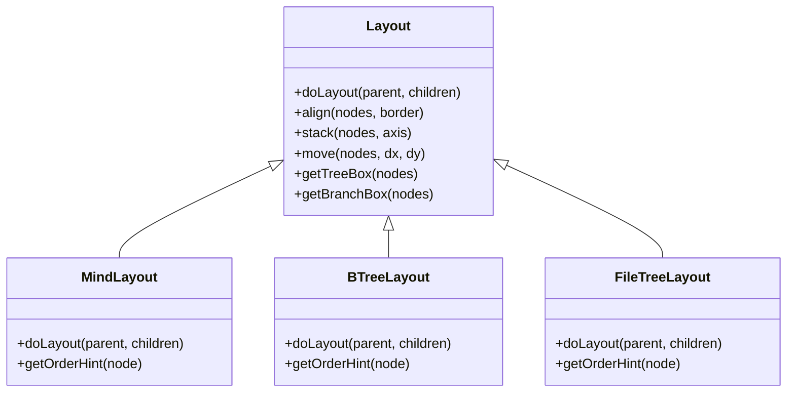
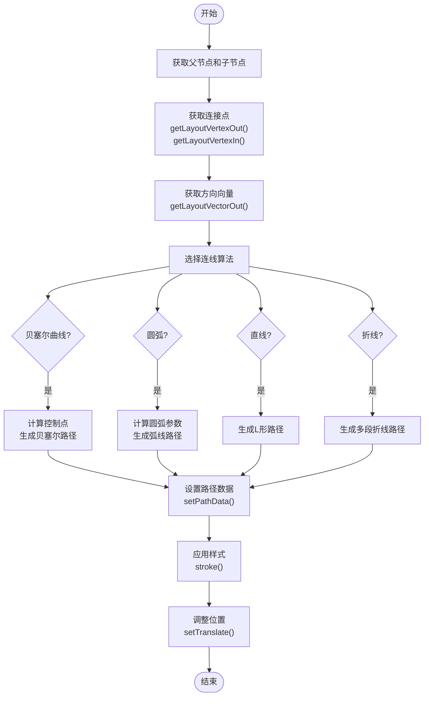
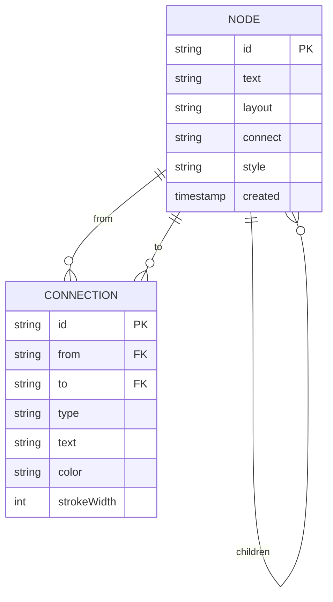

# 核心功能

<cite>
**本文档引用的文件**  
- [node.js](file://src/core/node.js)
- [layout.js](file://src/core/layout.js)
- [mind.js](file://src/layout/mind.js)
- [btree.js](file://src/layout/btree.js)
- [filetree.js](file://src/layout/filetree.js)
- [bezier.js](file://src/connect/bezier.js)
- [arc.js](file://src/connect/arc.js)
- [l.js](file://src/connect/l.js)
- [poly.js](file://src/connect/poly.js)
- [data.js](file://src/core/data.js)
- [Architecture.md](file://doc/Architecture.md)
</cite>

## 目录
1. [节点管理](#节点管理)
2. [布局系统](#布局系统)
3. [连线系统](#连线系统)
4. [数据管理](#数据管理)

## 节点管理

思维导图的核心是节点（Node）的管理。系统通过 `MinderNode` 类实现节点的创建、删除、编辑和选择机制，为用户提供完整的节点操作体验。

节点管理功能主要通过 `src/core/node.js` 文件实现。每个 `MinderNode` 实例代表一个思维导图节点，包含节点的指针关系（父节点、子节点）、数据存储和渲染容器。节点的创建通过构造函数完成，支持传入文本或数据对象作为初始内容。系统为节点提供了丰富的操作方法，包括获取节点层级、判断节点类型、遍历子树等。

在节点关系管理方面，系统提供了 `insertChild()`、`appendChild()`、`prependChild()` 和 `removeChild()` 等方法，用于构建和修改节点的树形结构。这些方法确保了节点关系的正确维护，包括更新父节点引用、根节点引用和子节点列表。同时，系统还提供了 `getSiblings()` 方法获取兄弟节点，`getCommonAncestor()` 方法获取共同祖先节点等高级功能。

节点选择机制通过 `src/core/select.js` 文件实现。系统维护一个选中节点列表，支持单选、多选、切换选择状态等操作。`select()` 方法用于选择节点，`removeSelectedNodes()` 方法用于取消选择，`toggleSelect()` 方法用于切换选择状态。此外，系统还提供了 `getSelectedAncestors()` 方法，用于获取选中节点中的祖先节点，避免重复操作。

**Section sources**
- [node.js](file://src/core/node.js#L1-L407)
- [select.js](file://src/core/select.js#L1-L146)

## 布局系统

布局系统是思维导图可视化的核心，负责将节点树结构转换为可视化的图形布局。系统通过布局基类设计和多种布局算法，实现了灵活的布局管理。

### 布局基类设计

布局基类 `Layout` 定义在 `src/core/layout.js` 文件中，作为所有具体布局算法的抽象基类。该基类定义了布局算法的核心接口 `doLayout()`，要求子类实现具体的布局逻辑。基类还提供了 `align()`、`stack()` 和 `move()` 等工具方法，用于节点对齐、堆叠和移动操作。`getTreeBox()` 和 `getBranchBox()` 方法用于计算节点及其子树的布局区域，为布局计算提供几何信息。

布局系统采用注册机制管理不同的布局算法。通过 `Layout.register()` 方法，可以将新的布局算法注册到系统中。每个布局实例通过 `getLayoutTransform()` 和 `setGlobalLayoutTransform()` 方法管理节点的变换矩阵，实现节点的精确定位。

### 布局算法

系统实现了多种布局算法，满足不同场景的需求：

**思维导图布局**：定义在 `src/layout/mind.js` 文件中，将节点分为左右两部分，分别应用左侧布局和右侧布局算法。这种布局方式符合传统思维导图的视觉习惯，左侧通常表示次要分支，右侧表示主要分支。

**二叉树布局**：定义在 `src/layout/btree.js` 文件中，支持上下左右四个方向的布局。该算法通过 `registerLayoutForDirection()` 函数为每个方向生成相应的布局实现，实现了高度的代码复用。布局时，子节点沿指定方向堆叠排列，形成清晰的树形结构。

**文件树布局**：定义在 `src/layout/filetree.js` 文件中，模拟文件系统的树形结构。该布局算法支持向上和向下两种方向，通过 `registerLayoutForDir()` 函数生成相应的布局实现。子节点在父节点下方或上方以缩进形式排列，形成典型的文件树视觉效果。

### 布局切换

布局切换通过命令系统实现。`src/module/layout.js` 文件定义了 `LayoutCommand` 和 `ResetLayoutCommand` 两个命令类。用户可以通过 `execCommand('layout', name)` 命令切换布局，其中 `name` 参数指定布局名称。系统还提供了快捷键 `Ctrl+Shift+L` 用于重置布局，恢复到默认状态。

布局切换时，系统会触发完整的布局计算流程：首先清除上一次的布局结果，然后执行两轮布局计算（第一轮计算相对位置，第二轮进行全局调整），最后应用布局结果并触发相应的事件。对于复杂度超过200个节点的大型思维导图，系统会自动关闭动画效果以提升性能。

**Diagram sources**
- [layout.js](file://src/core/layout.js#L1-L524)
- [mind.js](file://src/layout/mind.js#L1-L62)
- [btree.js](file://src/layout/btree.js#L1-L143)
- [filetree.js](file://src/layout/filetree.js#L1-L89)

**Section sources**
- [layout.js](file://src/core/layout.js#L1-L524)
- [mind.js](file://src/layout/mind.js#L1-L62)
- [btree.js](file://src/layout/btree.js#L1-L143)
- [filetree.js](file://src/layout/filetree.js#L1-L89)
- [layout.js](file://src/module/layout.js#L1-L92)

## 连线系统

连线系统负责在节点之间绘制连接线，直观地展示节点间的父子关系。系统实现了多种连线算法，每种算法都有其独特的视觉特性和适用场景。

### 连线算法

系统通过 `src/connect/` 目录下的多个文件实现了不同的连线算法：

**贝塞尔曲线**：定义在 `src/connect/bezier.js` 文件中，使用三次贝塞尔曲线连接节点。算法根据父节点的输出方向判断是水平连接还是垂直连接，然后计算控制点位置。水平连接时，控制点位于起点和终点x坐标的中点；垂直连接时，控制点位于起点和终点y坐标的中点。贝塞尔曲线连线流畅自然，适用于需要美观视觉效果的场景。

**圆弧连线**：定义在 `src/connect/arc.js` 文件中，使用圆弧连接节点。算法根据子节点相对于父节点的位置（左或右）确定弧线的方向。连线起点为父节点中心，终点为子节点边缘。圆弧连线具有独特的视觉风格，适用于需要突出连接关系的场景。

**直线连接**：定义在 `src/connect/l.js` 文件中，使用"L"形折线连接节点。算法根据父节点的输出方向选择水平或垂直连接方式。当父节点向左或右输出时，先水平连接再垂直连接到子节点；当父节点向上或下输出时，先垂直连接再水平连接到子节点。直线连接简洁明了，适用于需要清晰展示连接路径的场景。

**折线连接**：定义在 `src/connect/poly.js` 文件中，使用多段折线连接节点。算法根据父节点的输出方向和位置关系，生成包含多个线段的路径。折线连接可以精确控制连接路径，避免与其他节点重叠，适用于复杂布局场景。

### 连线管理

连线管理由 `src/core/connect.js` 文件实现。系统通过注册机制管理不同的连线提供者（Provider），每个提供者对应一种连线算法。节点通过 `getConnect()` 方法获取其连线类型，通过 `getConnectProvider()` 方法获取相应的连线提供者。

当节点被附加到思维导图时，系统会自动创建连线对象并添加到连接容器中。布局变化、节点渲染等事件会触发 `updateConnect()` 方法，重新计算和绘制连线。对于折叠的父节点，系统会隐藏其子节点的连线，保持界面整洁。

**Diagram sources**
- [bezier.js](file://src/connect/bezier.js#L1-L42)
- [arc.js](file://src/connect/arc.js#L1-L49)
- [l.js](file://src/connect/l.js#L1-L34)
- [poly.js](file://src/connect/poly.js#L1-L63)
- [connect.js](file://src/core/connect.js#L1-L126)

**Section sources**
- [bezier.js](file://src/connect/bezier.js#L1-L42)
- [arc.js](file://src/connect/arc.js#L1-L49)
- [l.js](file://src/connect/l.js#L1-L34)
- [poly.js](file://src/connect/poly.js#L1-L63)
- [connect.js](file://src/core/connect.js#L1-L126)

## 数据管理

数据管理功能负责思维导图的数据模型定义、导入导出流程和版本兼容性处理，确保数据的完整性和可移植性。

### JSON数据模型

系统采用JSON格式作为数据交换的标准。数据模型以根节点为核心，包含节点树结构和元数据。每个节点包含 `data` 字段存储节点属性（如文本、ID、样式等）和 `children` 字段存储子节点列表。根节点还包含 `template` 和 `theme` 字段，用于保存思维导图的模板和主题设置。

在 `version 2` 格式中，数据模型增加了对自由关联线的支持。通过 `connections` 字段存储任意两个节点之间的关联关系，每个关联线包含 `from` 和 `to` 字段指定起始节点和目标节点的ID，以及 `type`、`color`、`text` 等可选属性。这种设计突破了传统树形结构的限制，允许用户表达节点间的复杂关系。

### 导入导出流程

导入导出功能在 `src/core/data.js` 文件中实现。导出流程通过 `exportJson()` 方法递归遍历节点树，将每个节点的数据和子节点结构转换为JSON对象。系统确保每个节点都有唯一的ID，如果没有则自动生成。导出时还会包含模板、主题和自由关联线等元数据。

导入流程通过 `importJson()` 方法实现，包含多个关键步骤：首先触发 `preimport` 事件，然后清除现有节点，接着进行兼容性处理和ID冲突检查，最后递归构建节点树。系统会验证每个节点ID的唯一性，如果发现冲突则重新生成ID。对于自由关联线，系统会验证其引用的节点ID是否存在，过滤无效的关联线。

### 数据版本兼容性

系统实现了完善的数据版本兼容性处理。`version 1` 格式不包含版本字段，节点ID可选；`version 2` 格式明确包含 `version: "2"` 字段，要求所有节点必须有ID，并支持 `connections` 字段。系统在导入时能自动识别和处理不同版本的数据：对于 `version 1` 数据，会自动补全缺失的节点ID；对于 `version 2` 数据，会完整保留自由关联线信息。

为了确保向后兼容，`version 2` 格式的数据在旧版本软件中打开时，自由关联线会被忽略，但节点树结构能正常显示。这种设计保证了数据的可移植性，用户可以在不同版本的软件间自由交换文件。

**Diagram sources**
- [data.js](file://src/core/data.js#L1-L416)
- [Architecture.md](file://doc/Architecture.md#L591-L642)

**Section sources**
- [data.js](file://src/core/data.js#L1-L416)
- [Architecture.md](file://doc/Architecture.md#L591-L642)