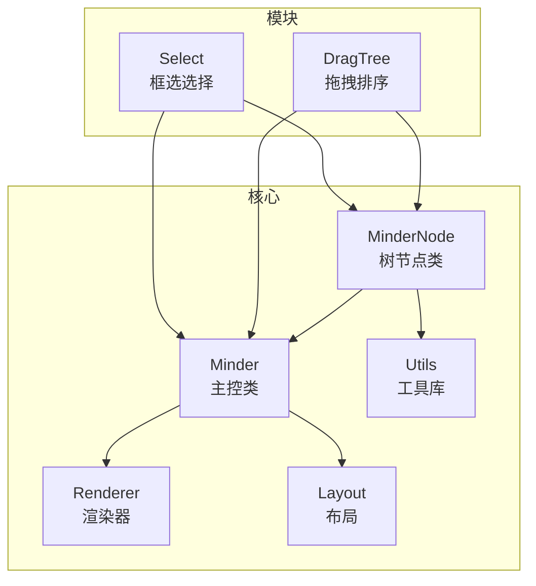
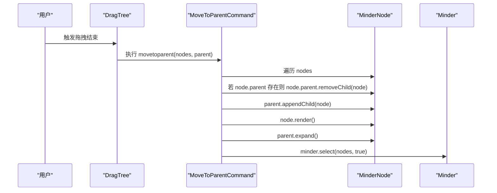
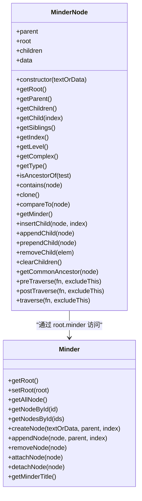
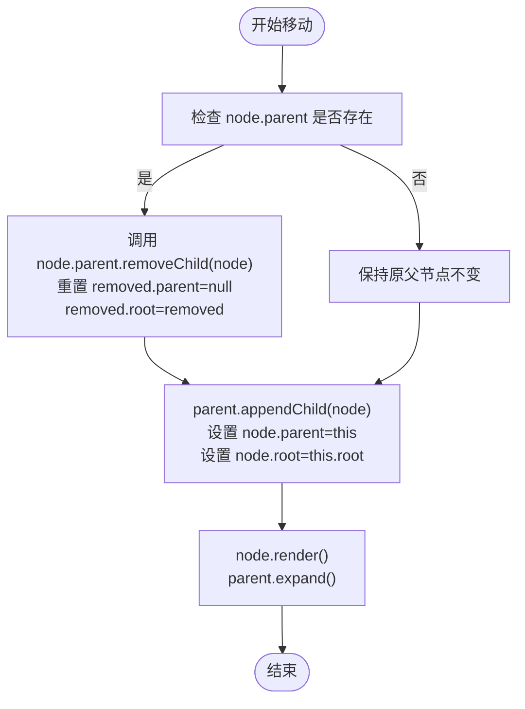
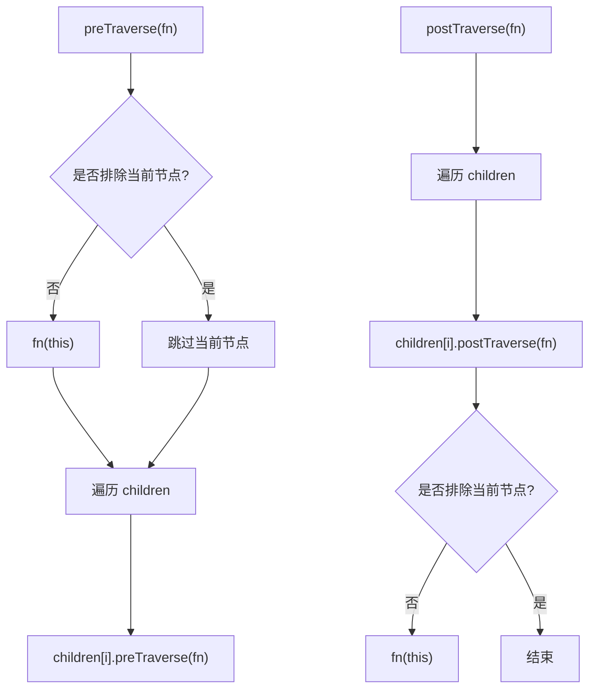
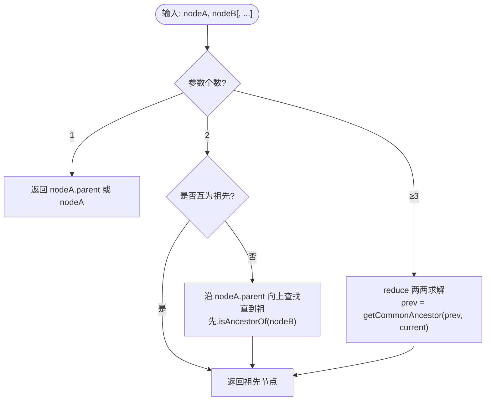
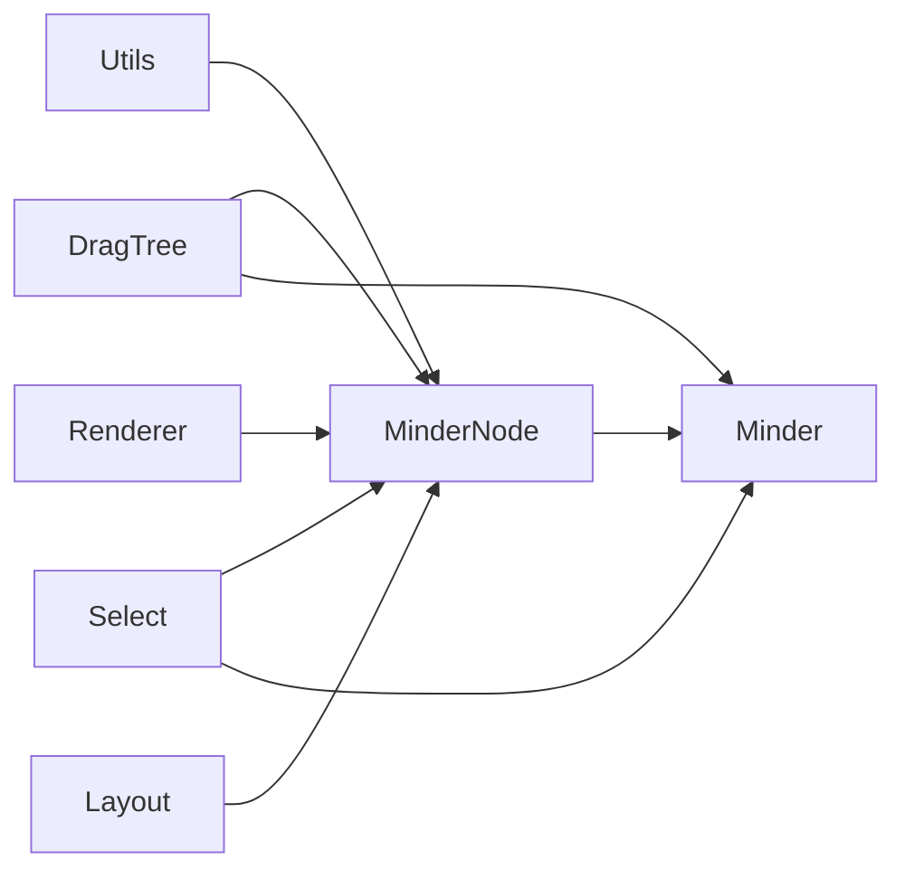

# 节点关系管理

<cite>
**本文引用的文件**
- [src/core/node.js](file://src/core/node.js)
- [src/core/minder.js](file://src/core/minder.js)
- [src/module/dragtree.js](file://src/module/dragtree.js)
- [src/module/select.js](file://src/module/select.js)
- [src/core/render.js](file://src/core/render.js)
- [src/core/layout.js](file://src/core/layout.js)
- [src/core/utils.js](file://src/core/utils.js)
- [doc/Architecture.md](file://doc/Architecture.md)
</cite>

## 目录
1. [简介](#简介)
2. [项目结构](#项目结构)
3. [核心组件](#核心组件)
4. [架构总览](#架构总览)
5. [详细组件分析](#详细组件分析)
6. [依赖分析](#依赖分析)
7. [性能考虑](#性能考虑)
8. [故障排查指南](#故障排查指南)
9. [结论](#结论)
10. [附录](#附录)

## 简介
本文件围绕 MinderNode 类的树形结构维护机制展开，系统性解析父子节点指针与根节点指针的同步更新、节点移动时自动脱离原父节点的机制、跨子树移动时根节点引用的正确传递；并深入说明先序/后序/层序遍历的使用场景与递归实现原理，结合 getSiblings、getIndex、getLevel 等辅助方法，给出节点重排序、兄弟节点操作与层级判断的实际应用路径。最后提供常见问题的解决方案与最佳实践，包括循环引用检测、深度优先遍历性能优化、大规模节点操作的批量处理等。

## 项目结构
本项目采用模块化组织，核心树节点与脑图主控分别位于 core 层，交互拖拽与选择模块位于 module 层，渲染与布局位于 core 层。与节点关系管理直接相关的关键文件如下：
- src/core/node.js：MinderNode 类定义与树操作方法
- src/core/minder.js：Minder 主控类，负责根节点挂载与节点附加/分离
- src/module/dragtree.js：拖拽排序与移动命令，演示节点移动与根节点传递
- src/module/select.js：框选与节点选择，配合遍历进行批量操作
- src/core/render.js：节点渲染与批量渲染，支持大规模节点更新
- src/core/layout.js：布局刷新与复杂度统计，支撑性能优化
- src/core/utils.js：通用工具，包含克隆与比较等基础能力

图表来源
- [src/core/node.js](file://src/core/node.js#L1-L283)
- [src/core/minder.js](file://src/core/minder.js#L1-L41)
- [src/module/dragtree.js](file://src/module/dragtree.js#L1-L120)
- [src/module/select.js](file://src/module/select.js#L1-L120)
- [src/core/render.js](file://src/core/render.js#L1-L120)
- [src/core/layout.js](file://src/core/layout.js#L413-L457)
- [src/core/utils.js](file://src/core/utils.js#L1-L66)

章节来源
- [src/core/node.js](file://src/core/node.js#L1-L283)
- [src/core/minder.js](file://src/core/minder.js#L1-L41)
- [src/module/dragtree.js](file://src/module/dragtree.js#L1-L120)
- [src/module/select.js](file://src/module/select.js#L1-L120)
- [src/core/render.js](file://src/core/render.js#L1-L120)
- [src/core/layout.js](file://src/core/layout.js#L413-L457)
- [src/core/utils.js](file://src/core/utils.js#L1-L66)

## 核心组件
- MinderNode：树节点实体，维护父子指针、根节点指针、子节点数组，提供插入、删除、遍历、查询等方法。
- Minder：脑图主控，负责根节点设置、节点附加/分离、全局遍历与事件分发。
- DragTree：拖拽模块，封装节点移动命令，演示 removeChild 前置调用与根节点传递。
- Select：选择模块，基于遍历进行框选与全选。
- Renderer/Layout：渲染与布局，支持批量渲染与复杂度统计，为性能优化提供基础。

章节来源
- [src/core/node.js](file://src/core/node.js#L1-L283)
- [src/core/minder.js](file://src/core/minder.js#L1-L41)
- [src/module/dragtree.js](file://src/module/dragtree.js#L1-L120)
- [src/module/select.js](file://src/module/select.js#L1-L120)
- [src/core/render.js](file://src/core/render.js#L1-L120)
- [src/core/layout.js](file://src/core/layout.js#L413-L457)

## 架构总览
MinderNode 作为树节点，通过 insertChild/appendChild/prependChild/removeChild 维护父子关系；Minder 作为树的持有者，负责根节点引用与节点附加/分离；DragTree 通过命令执行节点移动，确保节点从原父节点脱离并正确更新根节点引用；Select 通过遍历实现框选与全选；Renderer/Layout 提供批量渲染与复杂度统计，支撑大规模节点操作。

图表来源
- [src/module/dragtree.js](file://src/module/dragtree.js#L1-L40)
- [src/core/node.js](file://src/core/node.js#L199-L231)
- [src/core/minder.js](file://src/core/minder.js#L316-L404)

章节来源
- [src/module/dragtree.js](file://src/module/dragtree.js#L1-L120)
- [src/core/node.js](file://src/core/node.js#L199-L231)
- [src/core/minder.js](file://src/core/minder.js#L316-L404)

## 详细组件分析

### MinderNode 树形结构维护机制
- 父子指针与根节点指针
  - 父指针 parent：指向直接父节点，未设置时为 null。
  - 根指针 root：指向当前子树的根节点，初始等于自身。
  - 子节点数组 children：存储直接子节点集合。
- 关键方法
  - insertChild(node, index)：在指定索引插入子节点。若 node.parent 存在，先调用 removeChild 脱离原父节点，再更新 node.parent 与 node.root，并在 children 中插入。
  - appendChild(node)：在末尾追加子节点，等价于 insertChild(node)。
  - prependChild(node)：在开头插入子节点，等价于 insertChild(node, 0)。
  - removeChild(elem)：根据传入参数 elem 可为节点或索引，若存在则从 children 中移除，重置 removed.parent 为 null，removed.root 重置为 removed 自身。
  - clearChildren()：清空子节点数组。
  - getChild(index)：按索引获取子节点。
- 辅助方法
  - getSiblings()：返回除自身外的兄弟节点数组。
  - getIndex()：返回在父节点 children 中的索引，无父节点时返回 -1。
  - getLevel()：自顶向下累加层级，用于层级判断与样式分类。
  - getComplex()：通过遍历统计子树节点数量，用于性能评估与批量操作。
  - getType()：根据层级映射为 root/main/sub。
  - isAncestorOf(test)：判断当前节点是否为 test 的祖先。
  - getCommonAncestor(node)：委托静态方法计算公共祖先。
  - contains(node)：判断当前节点或其祖先是否包含 node。
  - clone()：深拷贝子树，逐个克隆子节点并递归添加。
  - compareTo(node)：比较节点数据与子树结构，用于一致性校验。
  - getMinder()：通过 root.minder 获取主控实例。

图表来源
- [src/core/node.js](file://src/core/node.js#L1-L283)
- [src/core/minder.js](file://src/core/minder.js#L1-L41)

章节来源
- [src/core/node.js](file://src/core/node.js#L1-L283)
- [src/core/minder.js](file://src/core/minder.js#L1-L41)

### 节点移动与根节点引用传递
- 自动脱离原父节点
  - insertChild 内部在插入前检查 node.parent 是否存在，若存在则调用 node.parent.removeChild(node)，确保节点从原父节点脱离。
- 跨子树移动时根节点引用
  - insertChild 将 node.root 设置为 this.root，保证移动后子树根节点引用保持一致。
- 拖拽排序中的移动命令
  - MoveToParentCommand.execute 中，对每个节点先执行 node.parent.removeChild(node)，再 parent.appendChild(node)，最后 node.render() 与 parent.expand()，确保渲染与展开正确。
- 主控层的附加/分离
  - Minder.appendNode(parent.insertChild(...), parent, index) 后调用 attachNode(node) 将节点及其子树附加到渲染容器；removeNode 同理先移除父节点关系，再 detachNode(node)。

图表来源
- [src/core/node.js](file://src/core/node.js#L199-L231)
- [src/module/dragtree.js](file://src/module/dragtree.js#L1-L40)
- [src/core/minder.js](file://src/core/minder.js#L361-L375)

章节来源
- [src/core/node.js](file://src/core/node.js#L199-L231)
- [src/module/dragtree.js](file://src/module/dragtree.js#L1-L40)
- [src/core/minder.js](file://src/core/minder.js#L361-L375)

### 节点遍历方法与使用场景
- 先序遍历 preTraverse(fn, excludeThis)
  - 先访问当前节点（可选），再依次递归访问每个子节点。
  - 使用场景：需要在进入子树前执行某些逻辑（如收集信息、预处理）。
- 后序遍历 postTraverse(fn, excludeThis)
  - 先递归访问每个子节点，最后访问当前节点。
  - 使用场景：需要先处理子节点再处理当前节点（如渲染、销毁、统计）。
- 层序遍历 traverse(fn, excludeThis)
  - 当前实现为后序遍历别名，注意命名与语义差异。
- 实际应用
  - Select 模块在框选与全选时使用 traverse 遍历节点，计算交集并更新选中状态。
  - Renderer.renderTree 通过 traverse 收集待渲染节点列表，再调用批量渲染接口。
  - Layout.refresh 通过 root.getComplex() 估算复杂度，决定是否采用异步策略。

图表来源
- [src/core/node.js](file://src/core/node.js#L163-L189)
- [src/module/select.js](file://src/module/select.js#L83-L92)
- [src/core/render.js](file://src/core/render.js#L223-L248)
- [src/core/layout.js](file://src/core/layout.js#L448-L457)

章节来源
- [src/core/node.js](file://src/core/node.js#L163-L189)
- [src/module/select.js](file://src/module/select.js#L83-L92)
- [src/core/render.js](file://src/core/render.js#L223-L248)
- [src/core/layout.js](file://src/core/layout.js#L448-L457)

### 兄弟节点操作与层级判断
- getSiblings：遍历父节点的 children，过滤掉自身，得到兄弟节点数组。
- getIndex：若存在父节点，返回在 children 中的索引；否则返回 -1。
- getLevel：从父节点向上累加，直到根节点，得到层级数。
- 实际用途
  - 重排序：通过 getIndex 获取当前索引，结合 getSiblings 与 splice 操作实现兄弟节点顺序调整。
  - 兄弟节点操作：在拖拽排序中，计算公共祖先与兄弟列表，生成排序提示区域。
  - 层级判断：getType 根据层级映射为 root/main/sub，用于样式与布局策略。

章节来源
- [src/core/node.js](file://src/core/node.js#L75-L96)
- [src/core/node.js](file://src/core/node.js#L195-L197)
- [src/core/node.js](file://src/core/node.js#L110-L115)
- [src/module/dragtree.js](file://src/module/dragtree.js#L247-L267)

### 公共祖先节点计算
- getCommonAncestor(node)：委托静态方法 MinderNode.getCommonAncestor。
- 静态实现要点
  - 单参：返回父节点或自身。
  - 双参：若一方为另一方祖先则直接返回；否则沿祖先链查找首个互为后代的节点。
  - 多参：通过 reduce 两两求解，最终得到公共祖先。
- 应用场景
  - 拖拽排序：当拖拽源为多个节点时，计算公共祖先，限定排序边界在该祖先的子节点范围内。
  - 选择范围：框选时仅对公共祖先的子树进行交集判断，减少遍历范围。

图表来源
- [src/core/node.js](file://src/core/node.js#L245-L247)
- [src/core/node.js](file://src/core/node.js#L285-L314)
- [src/module/dragtree.js](file://src/module/dragtree.js#L247-L267)

章节来源
- [src/core/node.js](file://src/core/node.js#L245-L247)
- [src/core/node.js](file://src/core/node.js#L285-L314)
- [src/module/dragtree.js](file://src/module/dragtree.js#L247-L267)

### 节点树重构与拖拽排序实践
- 重构节点树
  - 使用 insertChild/appendChild/prependChild 在指定位置插入节点，内部自动处理脱离原父节点与根节点引用更新。
  - 通过 removeChild 从原父节点移除节点，重置 parent 与 root，避免悬挂引用。
- 拖拽排序
  - 拖拽结束时，执行 movetoparent 命令：对每个拖拽源节点先 removeChild，再 appendChild 到目标父节点，随后渲染与展开。
  - 通过 getCommonAncestor 限定排序边界，避免跨祖先的非法排序。
- 计算共同祖先
  - 使用 MinderNode.getCommonAncestor 计算一组节点的公共祖先，用于排序提示与边界约束。

章节来源
- [src/module/dragtree.js](file://src/module/dragtree.js#L1-L40)
- [src/core/node.js](file://src/core/node.js#L199-L231)
- [src/core/node.js](file://src/core/node.js#L285-L314)

## 依赖分析
- 组件耦合
  - MinderNode 与 Minder：MinderNode 通过 root.minder 访问主控，Minder 通过 setRoot(root) 将 minder 指针写入根节点。
  - DragTree 与 MinderNode：DragTree 的 MoveToParentCommand 直接调用 MinderNode 的 removeChild 与 appendChild。
  - Select 与 MinderNode：Select 使用 MinderNode.traverse 进行框选与全选。
  - Renderer/Layout 与 MinderNode：Renderer.renderTree 通过 traverse 收集节点，Layout.applyLayoutResult 通过 getComplex 评估复杂度。
- 外部依赖
  - Utils：提供 guid、clone、comparePlainObject 等基础能力，支撑节点标识、深拷贝与结构比较。

图表来源
- [src/core/utils.js](file://src/core/utils.js#L1-L66)
- [src/core/node.js](file://src/core/node.js#L1-L283)
- [src/core/minder.js](file://src/core/minder.js#L1-L41)
- [src/module/dragtree.js](file://src/module/dragtree.js#L1-L120)
- [src/module/select.js](file://src/module/select.js#L1-L120)
- [src/core/render.js](file://src/core/render.js#L1-L120)
- [src/core/layout.js](file://src/core/layout.js#L413-L457)

章节来源
- [src/core/utils.js](file://src/core/utils.js#L1-L66)
- [src/core/node.js](file://src/core/node.js#L1-L283)
- [src/core/minder.js](file://src/core/minder.js#L1-L41)
- [src/module/dragtree.js](file://src/module/dragtree.js#L1-L120)
- [src/module/select.js](file://src/module/select.js#L1-L120)
- [src/core/render.js](file://src/core/render.js#L1-L120)
- [src/core/layout.js](file://src/core/layout.js#L413-L457)

## 性能考虑
- 大规模节点操作的批量处理
  - Renderer.renderTree 通过 traverse 收集节点，再调用 renderNodeBatch 进行批量渲染，减少多次 DOM 操作带来的开销。
  - Layout.applyLayoutResult 通过 getComplex 估算复杂度，必要时采用异步策略，避免阻塞主线程。
- 深度优先遍历性能优化
  - 遍历时尽量避免重复计算，将结果缓存至节点属性（如 contentBox），并在渲染阶段复用。
  - 对于超大树，优先使用后序遍历（postTraverse）以先处理子节点，再处理当前节点，便于局部更新与回收。
- 循环引用检测
  - 虽然 MinderNode 本身不直接涉及 Promise 链式 then 的循环检测，但项目内存在 Promise 循环检测实现，可借鉴其“一次性解析标志”与“严格相等拒绝”的思想，用于树结构的循环引用检测：在插入/移动时，沿祖先链检查是否与目标节点形成闭环，若发现则拒绝操作并回滚。

章节来源
- [src/core/render.js](file://src/core/render.js#L86-L120)
- [src/core/render.js](file://src/core/render.js#L223-L248)
- [src/core/layout.js](file://src/core/layout.js#L448-L457)
- [src/core/promise.js](file://src/core/promise.js#L150-L214)

## 故障排查指南
- 常见问题与定位
  - 节点移动后仍显示在原父节点：确认是否在 insertChild 前调用了 removeChild，或在命令执行中遗漏 removeChild。
  - 根节点引用错误导致渲染异常：检查 node.root 是否随父节点变化正确更新为 this.root。
  - 拖拽排序越界：检查 getCommonAncestor 的计算结果与排序边界，确保仅在公共祖先的子节点范围内排序。
  - 框选/全选不生效：确认 traverse 的调用与节点 attached 状态，必要时调用 minder.attachNode/detachNode。
- 排查步骤
  - 在 move 命令前后打印 node.parent 与 node.root，验证父子关系与根节点引用。
  - 使用 getLevel 与 getType 判断层级与类型，辅助定位样式或布局问题。
  - 使用 getComplex 评估树规模，必要时启用异步渲染与布局。

章节来源
- [src/module/dragtree.js](file://src/module/dragtree.js#L1-L40)
- [src/core/node.js](file://src/core/node.js#L199-L231)
- [src/core/minder.js](file://src/core/minder.js#L377-L398)
- [src/module/select.js](file://src/module/select.js#L83-L92)

## 结论
MinderNode 通过明确的父子指针与根节点指针同步机制，配合 insertChild/appendChild/prependChild/removeChild 的原子操作，实现了稳定的树形结构维护。DragTree 的移动命令与 Minder 的附加/分离流程，确保了节点移动时的自动脱钩与根节点正确传递。遍历方法为框选、全选、渲染与布局提供了统一的访问接口。借助公共祖先计算与批量渲染/布局策略，可在大规模节点场景下保持良好的性能与稳定性。

## 附录
- 参考文档
  - Architecture 文档对 MinderNode 的树遍历与数据存取进行了概述，可作为快速查阅的入口。

章节来源
- [doc/Architecture.md](file://doc/Architecture.md#L256-L311)