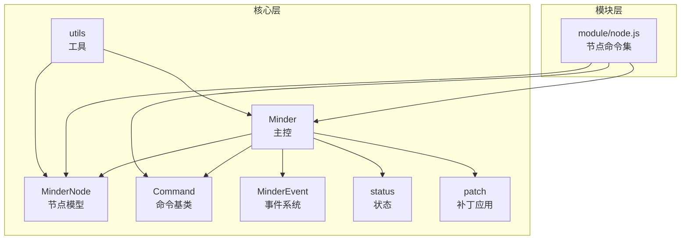
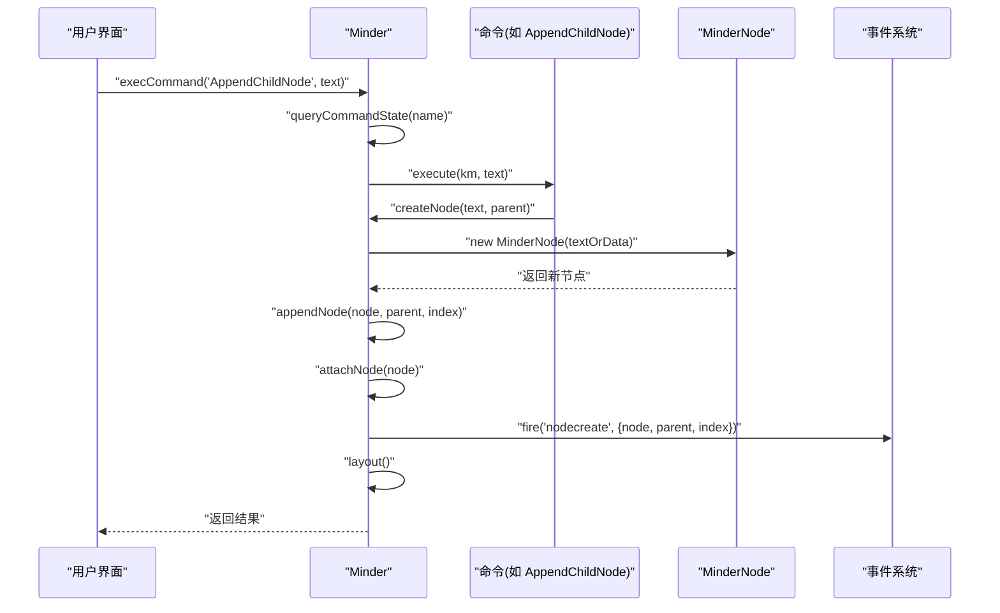
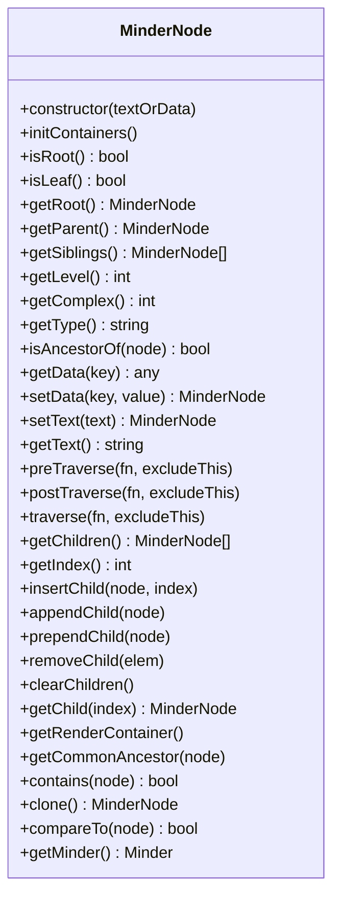
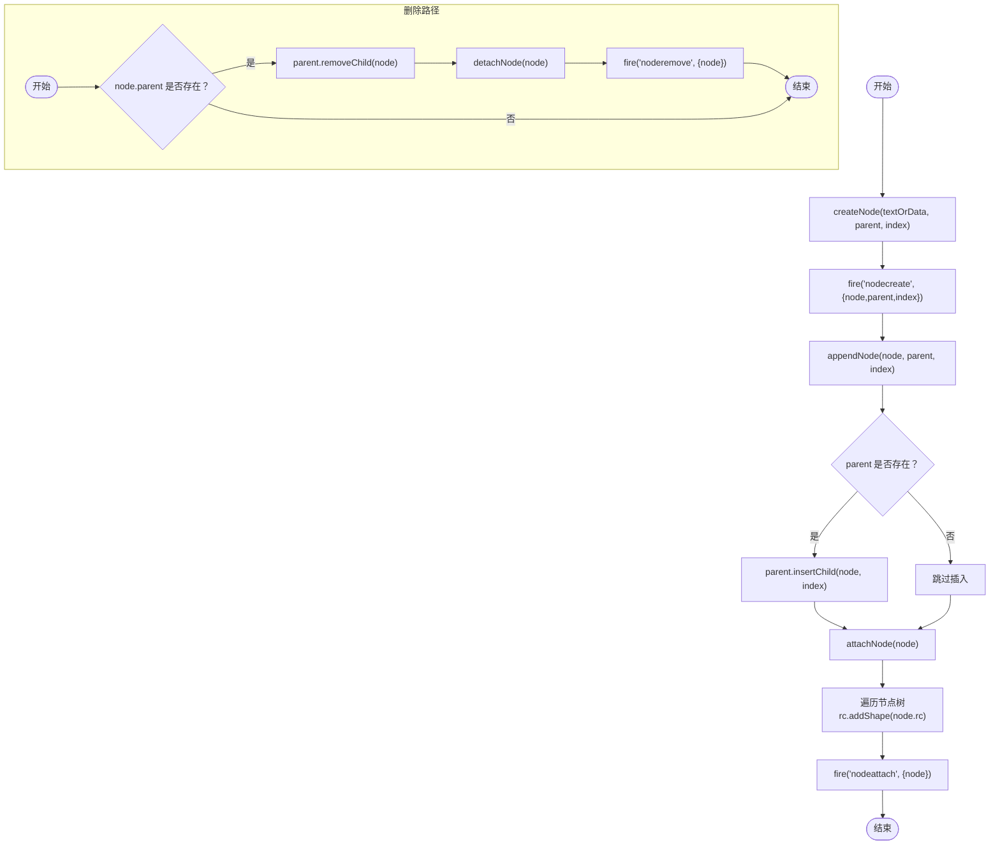
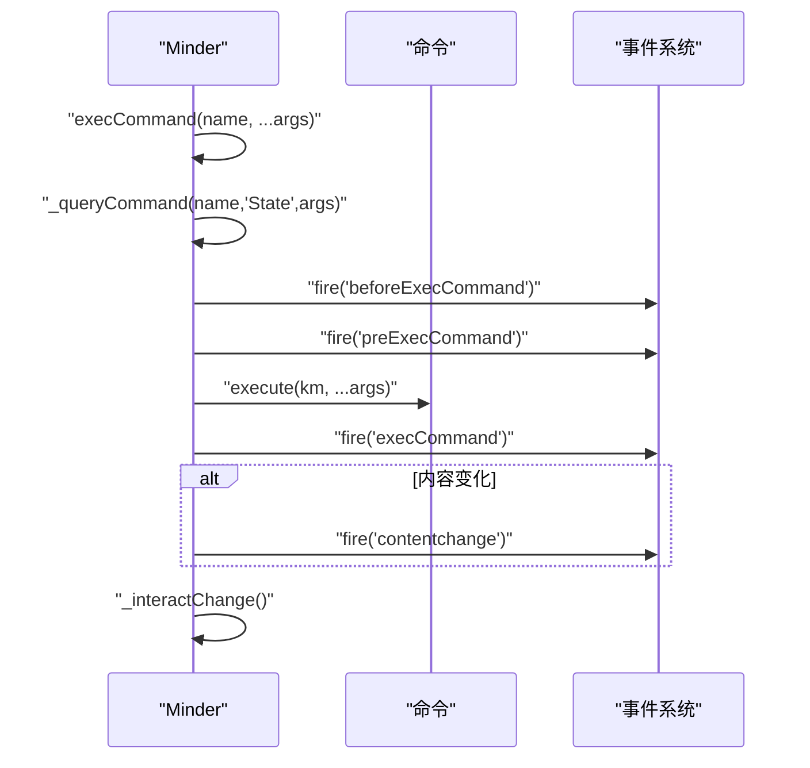
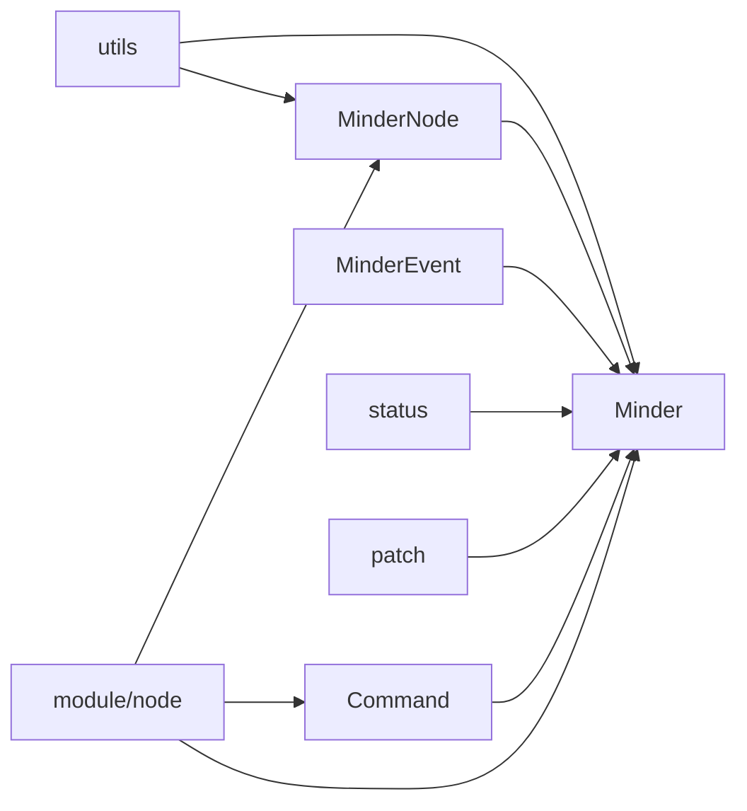

# 节点创建与删除

<cite>
**本文引用的文件**
- [src/core/node.js](file://src/core/node.js)
- [src/core/minder.js](file://src/core/minder.js)
- [src/core/command.js](file://src/core/command.js)
- [src/core/utils.js](file://src/core/utils.js)
- [src/core/event.js](file://src/core/event.js)
- [src/core/status.js](file://src/core/status.js)
- [src/core/patch.js](file://src/core/patch.js)
- [src/module/node.js](file://src/module/node.js)
- [src/core/module.js](file://src/core/module.js)
</cite>

## 目录
1. [引言](#引言)
2. [项目结构](#项目结构)
3. [核心组件](#核心组件)
4. [架构总览](#架构总览)
5. [详细组件分析](#详细组件分析)
6. [依赖分析](#依赖分析)
7. [性能考虑](#性能考虑)
8. [故障排查指南](#故障排查指南)
9. [结论](#结论)
10. [附录](#附录)

## 引言
本篇文档围绕“节点创建与删除”的主题，系统梳理 MinderNode 实例的生命周期：从 new MinderNode() 的构造过程，到通过 Minder 实例的 createNode/appendNode/removeNode 管理节点，再到命令层 execCommand('insertnode'/'removenode') 的执行流程与撤销栈联动。我们将重点解释：
- 构造函数中的节点 ID 生成、时间戳记录、渲染容器初始化（rc）以及父子/根指针设置
- 通过 Minder 的节点管理方法维护层级关系（root 指针更新）
- 删除节点时的父子关系解绑与事件触发
- 命令状态查询、事件触发（nodecreate/noderemove）以及撤销栈管理
- 安全创建带初始数据的节点、批量插入子节点、处理根节点删除等边界情况
- 常见问题的最佳实践与解决方案（重复插入、删除非叶子节点副作用、内存泄漏防范）

## 项目结构
本仓库采用模块化组织，核心与业务逻辑分层清晰：
- 核心层：节点模型（MinderNode）、主控（Minder）、命令（Command）、事件（MinderEvent）、工具（utils）、状态（status）、补丁（patch）
- 模块层：节点相关命令（src/module/node.js）等
- 初始化与模块注册：通过 module.js 注册模块，加载命令、事件、渲染器与快捷键

图表来源
- [src/core/node.js](file://src/core/node.js#L1-L407)
- [src/core/minder.js](file://src/core/minder.js#L1-L41)
- [src/core/command.js](file://src/core/command.js#L1-L169)
- [src/core/event.js](file://src/core/event.js#L1-L270)
- [src/core/utils.js](file://src/core/utils.js#L1-L66)
- [src/core/status.js](file://src/core/status.js#L1-L60)
- [src/core/patch.js](file://src/core/patch.js#L1-L110)
- [src/module/node.js](file://src/module/node.js#L1-L150)
- [src/core/module.js](file://src/core/module.js#L1-L151)

章节来源
- [src/core/node.js](file://src/core/node.js#L1-L407)
- [src/core/minder.js](file://src/core/minder.js#L1-L41)
- [src/core/module.js](file://src/core/module.js#L1-L151)

## 核心组件
- MinderNode：表示一个脑图节点，负责节点的数据、父子关系、渲染容器、遍历、克隆、比较等
- Minder：主控类，负责根节点、节点集合查询、节点创建/附加/分离、事件派发等
- Command：命令基类，提供查询状态、执行、撤销标记等能力
- MinderEvent：事件封装，提供事件传播、停止、获取目标节点等
- utils：通用工具，包括 guid、uuid、clone、类型判断等
- status：状态管理，提供状态切换与回滚
- patch：补丁应用，支持批量节点增删改
- module/node：节点相关命令（AppendChildNode、AppendSiblingNode、RemoveNode、AppendParentNode）

章节来源
- [src/core/node.js](file://src/core/node.js#L1-L407)
- [src/core/minder.js](file://src/core/minder.js#L1-L41)
- [src/core/command.js](file://src/core/command.js#L1-L169)
- [src/core/event.js](file://src/core/event.js#L1-L270)
- [src/core/utils.js](file://src/core/utils.js#L1-L66)
- [src/core/status.js](file://src/core/status.js#L1-L60)
- [src/core/patch.js](file://src/core/patch.js#L1-L110)
- [src/module/node.js](file://src/module/node.js#L1-L150)
- [src/core/module.js](file://src/core/module.js#L1-L151)

## 架构总览
节点创建与删除贯穿“模型-命令-主控-事件”链路，命令通过 Minder.execCommand 触发，内部调用命令的 queryState/execute，并在必要时触发 contentchange 与交互事件；Minder 在节点变更时发出 nodecreate/noderemove 等事件，供模块订阅与联动。

图表来源
- [src/core/command.js](file://src/core/command.js#L118-L166)
- [src/module/node.js](file://src/module/node.js#L19-L41)
- [src/core/node.js](file://src/core/node.js#L350-L375)
- [src/core/node.js](file://src/core/node.js#L377-L398)

## 详细组件分析

### MinderNode 生命周期与构造逻辑
- 节点指针
  - parent：父节点指针，初始为空
  - root：根节点指针，初始指向自身
  - children：子节点数组
- 数据与元信息
  - data.id：使用 utils.guid 生成全局唯一标识
  - data.created：创建时间戳
- 渲染容器
  - rc：kity.Group 渲染容器，设置唯一 id 并绑定 minderNode 引用
- 构造函数分支
  - 若传入字符串：调用 setText 设置文本
  - 若传入对象：使用 utils.extend 合并到 data
- 关键方法
  - insertChild/appendChild/prependChild：维护父子关系与 root 指针
  - removeChild：解除父子关系并重置 removed.root 为自身
  - getRenderContainer/rc：访问渲染容器
  - traverse/postTraverse/preTraverse：遍历子树
  - clone/compareTo：克隆与结构比较

图表来源
- [src/core/node.js](file://src/core/node.js#L19-L283)

章节来源
- [src/core/node.js](file://src/core/node.js#L19-L283)
- [src/core/utils.js](file://src/core/utils.js#L8-L15)

### Minder 节点管理：createNode/appendNode/removeNode
- createNode
  - 新建 MinderNode 实例
  - 触发 nodecreate 事件（携带 node、parent、index）
  - 调用 appendNode 完成插入与附加
- appendNode
  - 将 node 插入 parent.children（若 parent 存在）
  - 调用 attachNode 将节点及其子树附加到渲染容器
- removeNode
  - 若存在父节点：先从父节点移除，再 detachNode
  - 触发 noderemove 事件（携带 node）
- attachNode/detachNode
  - 遍历节点树，将 rc 形状加入/移出渲染容器
  - 触发 nodeattach/nodedetach 事件

图表来源
- [src/core/node.js](file://src/core/node.js#L350-L398)

章节来源
- [src/core/node.js](file://src/core/node.js#L350-L398)

### 命令层：execCommand 与节点命令
- execCommand 流程
  - 解析命令名并查询状态（queryCommandState）
  - 触发 beforeExecCommand、preExecCommand
  - 调用命令 execute
  - 触发 execCommand
  - 若命令标记内容变化，触发 contentchange
  - 触发 _interactChange
- 节点命令
  - AppendChildNode：在选中节点下追加子节点，必要时展开并布局
  - AppendSiblingNode：在选中节点后方追加兄弟节点
  - RemoveNode：删除选中节点，处理多选与公共祖先选择回退
  - AppendParentNode：将多个节点提升为同一新父节点

图表来源
- [src/core/command.js](file://src/core/command.js#L118-L166)
- [src/module/node.js](file://src/module/node.js#L19-L100)

章节来源
- [src/core/command.js](file://src/core/command.js#L1-L169)
- [src/module/node.js](file://src/module/node.js#L1-L150)

### 事件与撤销栈联动
- 事件触发
  - 节点创建：nodecreate（含 node、parent、index）
  - 节点删除：noderemove（含 node）
  - 节点附加/分离：nodeattach/nodedetach
  - 命令执行：beforeExecCommand、preExecCommand、execCommand、contentchange、interactchange
- 撤销栈
  - 命令基类提供 isNeedUndo/isContentChanged 等标记
  - 命令执行后若标记内容变化，触发 contentchange 事件，便于外部撤销栈管理器监听并入栈
  - 本仓库未直接暴露撤销栈实现，但通过事件与命令标记可与上层集成

章节来源
- [src/core/node.js](file://src/core/node.js#L350-L398)
- [src/core/command.js](file://src/core/command.js#L1-L169)
- [src/core/event.js](file://src/core/event.js#L1-L270)

### 边界情况与最佳实践
- 安全创建带初始数据的节点
  - 使用 createNode 时传入对象，内部通过 utils.extend 合并到 data
  - 若传入字符串，仅设置 text 字段
  - 章节来源
    - [src/core/node.js](file://src/core/node.js#L19-L40)
- 批量插入子节点
  - 通过 patch.applyPatches 支持批量 add/remove
  - 章节来源
    - [src/core/patch.js](file://src/core/patch.js#L1-L110)
- 处理根节点删除
  - RemoveNode 命令在执行时过滤掉根节点，避免误删根
  - 章节来源
    - [src/module/node.js](file://src/module/node.js#L78-L100)
- 防范重复插入
  - insertChild 会先检查 node.parent 并移除旧父关系，再设置新父与 root
  - 章节来源
    - [src/core/node.js](file://src/core/node.js#L199-L210)
- 删除非叶子节点的副作用
  - removeChild 会递归解绑子树，确保子树 root 回归为自身
  - 章节来源
    - [src/core/node.js](file://src/core/node.js#L220-L231)
- 内存泄漏防范
  - detachNode 会将节点树从渲染容器移除并标记 attached=false
  - destroy/reset 时通过 _garbage 清空根节点子树，模块 destroy/reset 钩子清理资源
  - 章节来源
    - [src/core/node.js](file://src/core/node.js#L377-L398)
    - [src/core/module.js](file://src/core/module.js#L120-L150)

## 依赖分析
- MinderNode 依赖 utils（guid/uuid/extend/clone）
- Minder 依赖 node/event/status/patch/module/command
- 命令模块（module/node）依赖 Minder/MinderNode/Command
- 事件系统为跨模块通信提供统一通道

图表来源
- [src/core/utils.js](file://src/core/utils.js#L1-L66)
- [src/core/node.js](file://src/core/node.js#L1-L407)
- [src/core/minder.js](file://src/core/minder.js#L1-L41)
- [src/core/event.js](file://src/core/event.js#L1-L270)
- [src/core/status.js](file://src/core/status.js#L1-L60)
- [src/core/patch.js](file://src/core/patch.js#L1-L110)
- [src/core/command.js](file://src/core/command.js#L1-L169)
- [src/module/node.js](file://src/module/node.js#L1-L150)

章节来源
- [src/core/utils.js](file://src/core/utils.js#L1-L66)
- [src/core/node.js](file://src/core/node.js#L1-L407)
- [src/core/minder.js](file://src/core/minder.js#L1-L41)
- [src/core/event.js](file://src/core/event.js#L1-L270)
- [src/core/status.js](file://src/core/status.js#L1-L60)
- [src/core/patch.js](file://src/core/patch.js#L1-L110)
- [src/core/command.js](file://src/core/command.js#L1-L169)
- [src/module/node.js](file://src/module/node.js#L1-L150)

## 性能考虑
- 节点遍历与渲染
  - traverse/postTraverse/preTraverse 用于批量渲染与布局，注意避免在高频交互中重复遍历
- 批量操作
  - 优先使用 patch.applyPatches 进行批量节点增删，减少多次事件与布局开销
- 事件风暴
  - contentchange 与 layout 调用频率应受控，建议在批处理完成后统一触发一次布局
- 内存管理
  - 删除节点后及时 detachNode，避免残留形状占用渲染容器
  - 模块销毁时调用 destroy/reset 清理资源

## 故障排查指南
- 节点无法插入
  - 检查 parent 是否存在，appendNode 仅在 parent 存在时插入
  - 章节来源
    - [src/core/node.js](file://src/core/node.js#L361-L365)
- 删除后布局异常
  - 确认已触发 layout，命令执行后会调用 _interactChange，必要时手动触发布局
  - 章节来源
    - [src/core/command.js](file://src/core/command.js#L140-L166)
- 事件未触发
  - 确认已正确监听 nodecreate/noderemove/nodeattach/nodedetach
  - 章节来源
    - [src/core/node.js](file://src/core/node.js#L350-L398)
    - [src/core/event.js](file://src/core/event.js#L232-L266)
- 根节点被误删
  - RemoveNode 命令会过滤根节点，确认未绕过该命令
  - 章节来源
    - [src/module/node.js](file://src/module/node.js#L78-L100)
- 内存泄漏
  - 确保删除节点后执行 detachNode 或使用 destroy/reset 清理
  - 章节来源
    - [src/core/node.js](file://src/core/node.js#L377-L398)
    - [src/core/module.js](file://src/core/module.js#L120-L150)

## 结论
本文从 MinderNode 的构造与生命周期出发，系统梳理了节点创建与删除在 Minder 与命令层的协作机制，明确了事件触发、层级关系维护与撤销栈联动的关键点。通过模块化设计与事件驱动，系统提供了可扩展的节点管理能力。实践中建议：
- 使用 createNode/appendNode/removeNode 进行节点管理
- 通过命令层统一入口执行节点操作，确保事件与布局一致
- 批量操作使用 patch.applyPatches 提升性能
- 注意根节点保护与内存清理，避免副作用与泄漏

## 附录
- 常用 API 路径参考
  - 构造与容器初始化：[src/core/node.js](file://src/core/node.js#L19-L45)
  - 节点插入与删除：[src/core/node.js](file://src/core/node.js#L199-L231)
  - Minder 节点管理：[src/core/node.js](file://src/core/node.js#L350-L398)
  - 命令执行流程：[src/core/command.js](file://src/core/command.js#L118-L166)
  - 节点命令实现：[src/module/node.js](file://src/module/node.js#L19-L100)
  - 事件系统：[src/core/event.js](file://src/core/event.js#L133-L266)
  - 工具函数：[src/core/utils.js](file://src/core/utils.js#L8-L15)
  - 状态管理：[src/core/status.js](file://src/core/status.js#L21-L58)
  - 批量补丁：[src/core/patch.js](file://src/core/patch.js#L1-L110)
  - 模块注册与销毁：[src/core/module.js](file://src/core/module.js#L1-L151)