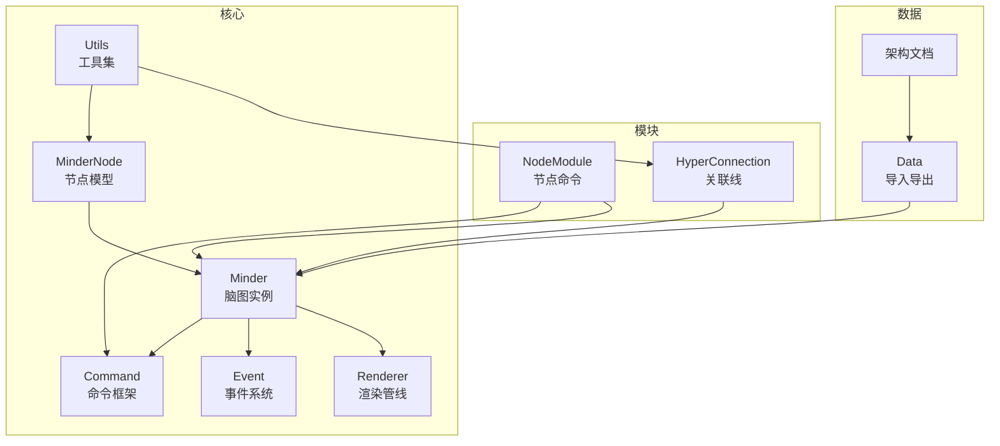
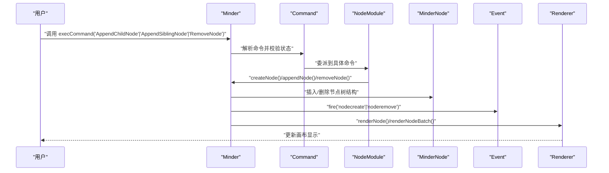
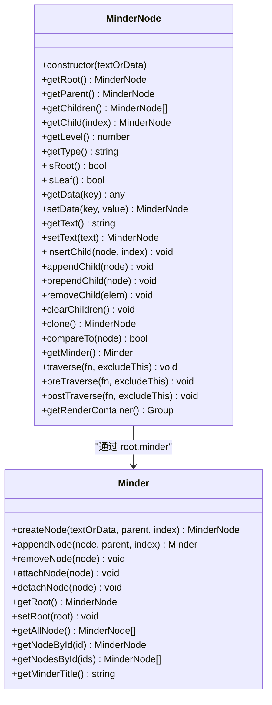
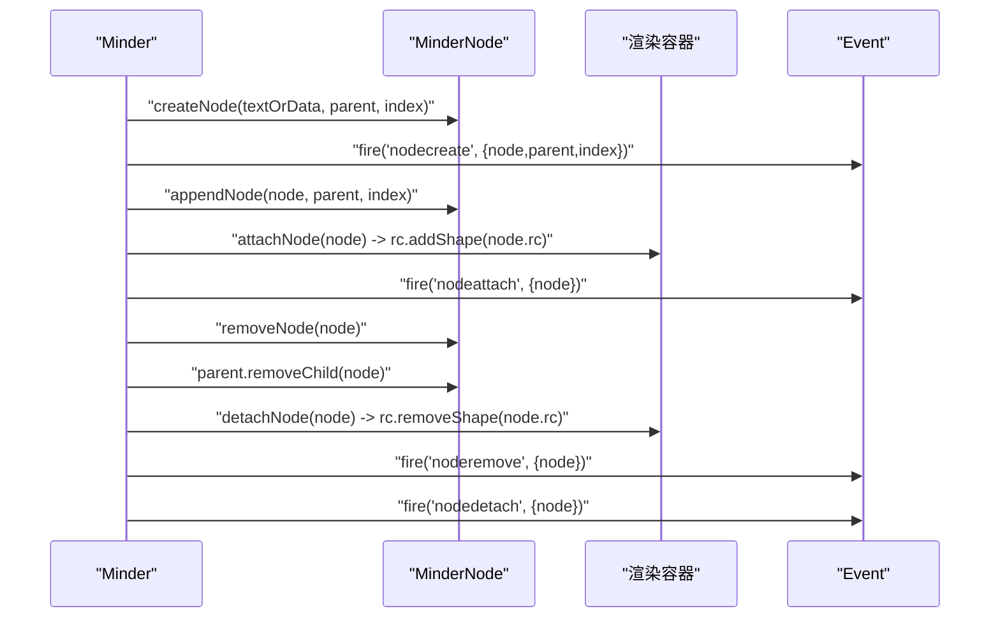
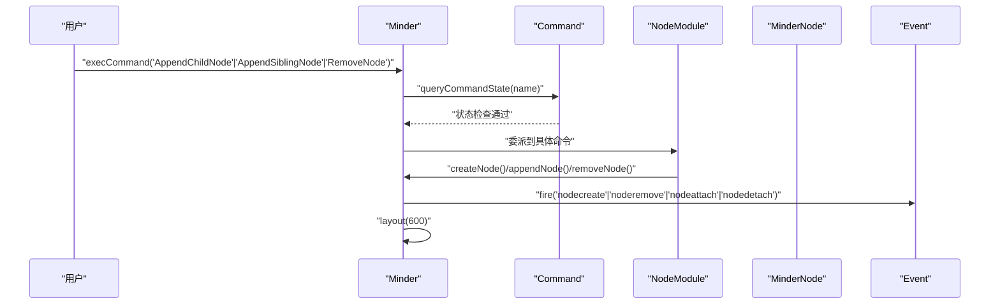
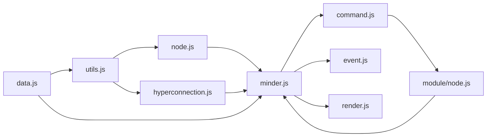

# 节点操作

<cite>
**本文引用的文件**
- [src/core/node.js](file://src/core/node.js)
- [src/core/minder.js](file://src/core/minder.js)
- [src/core/command.js](file://src/core/command.js)
- [src/core/utils.js](file://src/core/utils.js)
- [src/core/event.js](file://src/core/event.js)
- [src/core/render.js](file://src/core/render.js)
- [src/module/node.js](file://src/module/node.js)
- [src/module/hyperconnection.js](file://src/module/hyperconnection.js)
- [src/core/data.js](file://src/core/data.js)
- [doc/Architecture.md](file://doc/Architecture.md)
</cite>

## 目录
1. [简介](#简介)
2. [项目结构](#项目结构)
3. [核心组件](#核心组件)
4. [架构总览](#架构总览)
5. [详细组件分析](#详细组件分析)
6. [依赖分析](#依赖分析)
7. [性能考虑](#性能考虑)
8. [故障排查指南](#故障排查指南)
9. [结论](#结论)
10. [附录](#附录)

## 简介
本章节围绕 MinderNode 类的全生命周期管理展开，系统性阐述节点的创建、插入、删除、克隆与树结构维护机制；详解节点数据管理（setData/getData、setText/getText、自定义字段扩展）、节点类型（root/main/sub）的判定逻辑及其对渲染的影响；结合 Minder 实例的 createNode、appendNode、removeNode 等方法说明节点与实例的绑定与解绑流程；并通过 execCommand 执行“插入节点”“删除节点”等命令，解释其如何触发 nodecreate、noderemove 等事件；最后介绍节点 ID 的生成策略（utils.guid）及其在数据同步与关联线维护中的关键作用，并给出常见问题的解决方案。

## 项目结构
本仓库采用按功能域分层的组织方式，核心节点操作集中在 core 子目录，命令与交互在 module 子目录，渲染与主题在对应目录。与节点操作直接相关的文件如下：
- 核心节点模型：src/core/node.js
- 脑图实例：src/core/minder.js
- 命令框架：src/core/command.js
- 工具集：src/core/utils.js
- 事件系统：src/core/event.js
- 渲染管线：src/core/render.js
- 节点相关命令：src/module/node.js
- 关联线模块：src/module/hyperconnection.js
- 数据导入导出：src/core/data.js
- 架构文档：doc/Architecture.md

图表来源
- [src/core/node.js](file://src/core/node.js#L1-L407)
- [src/core/minder.js](file://src/core/minder.js#L1-L41)
- [src/core/command.js](file://src/core/command.js#L1-L169)
- [src/core/utils.js](file://src/core/utils.js#L1-L66)
- [src/core/event.js](file://src/core/event.js#L1-L270)
- [src/core/render.js](file://src/core/render.js#L1-L261)
- [src/module/node.js](file://src/module/node.js#L1-L150)
- [src/module/hyperconnection.js](file://src/module/hyperconnection.js#L606-L639)
- [src/core/data.js](file://src/core/data.js#L255-L289)
- [doc/Architecture.md](file://doc/Architecture.md#L598-L682)

章节来源
- [src/core/node.js](file://src/core/node.js#L1-L407)
- [src/core/minder.js](file://src/core/minder.js#L1-L41)
- [src/core/command.js](file://src/core/command.js#L1-L169)
- [src/core/utils.js](file://src/core/utils.js#L1-L66)
- [src/core/event.js](file://src/core/event.js#L1-L270)
- [src/core/render.js](file://src/core/render.js#L1-L261)
- [src/module/node.js](file://src/module/node.js#L1-L150)
- [src/module/hyperconnection.js](file://src/module/hyperconnection.js#L606-L639)
- [src/core/data.js](file://src/core/data.js#L255-L289)
- [doc/Architecture.md](file://doc/Architecture.md#L598-L682)

## 核心组件
- MinderNode：节点模型，负责节点树结构、数据存储、类型判定、克隆与遍历等。
- Minder：脑图实例，负责节点创建、附加/分离渲染容器、事件派发等。
- Command：命令框架，提供统一的命令查询与执行入口。
- Utils：通用工具，提供 guid、clone、comparePlainObject 等能力。
- Event：事件系统，提供事件注册、派发与传播控制。
- Renderer：渲染管线，负责节点图形的创建、绘制与定位。
- NodeModule：节点相关命令集合，封装插入、删除、父子关系调整等常用操作。
- HyperConnection：自由关联线模块，依赖节点 ID 维护跨树连接。
- Data：数据导入导出，确保节点 ID 唯一性与一致性。

章节来源
- [src/core/node.js](file://src/core/node.js#L1-L407)
- [src/core/minder.js](file://src/core/minder.js#L1-L41)
- [src/core/command.js](file://src/core/command.js#L1-L169)
- [src/core/utils.js](file://src/core/utils.js#L1-L66)
- [src/core/event.js](file://src/core/event.js#L1-L270)
- [src/core/render.js](file://src/core/render.js#L1-L261)
- [src/module/node.js](file://src/module/node.js#L1-L150)
- [src/module/hyperconnection.js](file://src/module/hyperconnection.js#L606-L639)
- [src/core/data.js](file://src/core/data.js#L255-L289)

## 架构总览
下图展示了从用户输入到节点树变更再到渲染更新的整体流程，重点体现命令驱动、事件触发与渲染联动。

图表来源
- [src/core/command.js](file://src/core/command.js#L118-L166)
- [src/module/node.js](file://src/module/node.js#L1-L150)
- [src/core/minder.js](file://src/core/minder.js#L350-L404)
- [src/core/render.js](file://src/core/render.js#L165-L219)
- [src/core/event.js](file://src/core/event.js#L232-L266)

## 详细组件分析

### MinderNode 类与树结构管理
- 构造与初始化
  - 初始化指针：parent、root、children。
  - 初始化数据：data 包含 id（使用 guid 生成）、created 时间戳。
  - 初始化渲染容器 rc 并挂载 minderNode 引用。
  - 支持以字符串或对象初始化文本与数据。
- 树结构操作
  - 插入：insertChild(node, index)，支持在指定索引插入；若目标节点已有父节点则先移除。
  - 追加/前置：appendChild、prependChild 均委托 insertChild。
  - 删除：removeChild(elem) 支持传入索引或节点对象；删除后重置 removed.parent 与重置其 root 为其自身。
  - 清空：clearChildren 将 children 置空。
  - 遍历：preTraverse、postTraverse、traverse 提供先序/后序/后序遍历。
  - 公共祖先：getCommonAncestor 静态方法支持多节点公共祖先查找。
- 节点类型与层次
  - getType：根据层级映射为 root/main/sub，层级上限取 2。
  - getLevel：计算深度。
  - isRoot/isLeaf：判断根/叶节点。
- 数据管理
  - getData/getText：读取 data 或 text 字段。
  - setData：支持对象批量设置或键值设置。
  - setText：便捷设置文本。
- 克隆与比较
  - clone：深拷贝 data（使用 JSON 序列化/反序列化），递归克隆子节点。
  - compareTo：比较 data、temp 与子节点结构是否一致。
- 与 Minder 绑定
  - getMinder：通过 root.minder 获取实例。

图表来源
- [src/core/node.js](file://src/core/node.js#L1-L407)
- [src/core/minder.js](file://src/core/minder.js#L316-L404)

章节来源
- [src/core/node.js](file://src/core/node.js#L1-L407)
- [src/core/minder.js](file://src/core/minder.js#L316-L404)

### 节点类型判定与渲染影响
- 类型判定逻辑
  - getType：基于 getLevel 返回 root/main/sub，层级上限为 2，确保根、主干、子节点三类样式区分。
- 渲染影响
  - 主题配置中对 root/main/sub 分别定义颜色、背景、字体大小、半径、阴影等样式，类型决定最终渲染外观。
- 实践建议
  - 在自定义主题或样式扩展时，优先依据 getType 的结果进行差异化渲染。

章节来源
- [src/core/node.js](file://src/core/node.js#L109-L116)
- [src/theme/tianpan.js](file://src/theme/tianpan.js#L9-L48)

### 数据管理机制（setData/getData、setText/getText、自定义字段）
- 数据容器
  - data 字段承载节点的所有业务数据，包含 id、created、text 等内置字段，以及用户自定义字段。
- 读写接口
  - getData(key)：当 key 为真时返回 data[key]，否则返回整个 data。
  - setData(key, value)：支持对象批量设置或单键设置。
  - getText/getText：便捷访问 text 字段。
- 深拷贝与比较
  - clone 使用 JSON 序列化/反序列化实现浅层深拷贝，适合纯对象场景；复杂对象需自定义处理。
  - compareTo 用于结构与数据一致性校验，便于差异检测与增量更新。

章节来源
- [src/core/node.js](file://src/core/node.js#L130-L161)
- [src/core/node.js](file://src/core/node.js#L253-L278)
- [src/core/utils.js](file://src/core/utils.js#L31-L33)

### 节点与 Minder 实例的绑定与解绑
- 绑定
  - setRoot：设置根节点并将 root.minder 指向 Minder 实例。
  - appendNode：在指定 parent 下插入节点后调用 attachNode，将节点及其子树加入渲染容器并触发 nodeattach 事件。
- 解绑
  - removeNode：从父节点移除后调用 detachNode，从渲染容器移除并触发 nodedetach 事件。
- 事件
  - createNode：创建节点时 fire('nodecreate')，便于监听与扩展。
  - removeNode：删除节点时 fire('noderemove')，便于清理与统计。

图表来源
- [src/core/minder.js](file://src/core/minder.js#L350-L404)
- [src/core/event.js](file://src/core/event.js#L232-L266)
- [src/core/render.js](file://src/core/render.js#L165-L219)

章节来源
- [src/core/minder.js](file://src/core/minder.js#L350-L404)
- [src/core/event.js](file://src/core/event.js#L232-L266)
- [src/core/render.js](file://src/core/render.js#L165-L219)

### 命令驱动的节点操作（execCommand）
- 命令执行流程
  - execCommand：解析命令名、校验状态、派发 before/pre/exec/contentchange/interactchange 等阶段事件，最终调用命令 execute。
- 节点相关命令
  - AppendChildNode：在选中节点下追加子节点，必要时展开父节点并渲染。
  - AppendSiblingNode：在选中节点的兄弟位置插入节点，若无父节点则退化为 AppendChildNode。
  - RemoveNode：删除多个选中节点，自动选择回退节点并重新布局。
  - AppendParentNode：将多个相邻节点提升为同一新父节点。
- 事件联动
  - createNode 触发 nodecreate；removeNode 触发 noderemove；attachNode/detachNode 触发 nodeattach/nodedetach；内容变化触发 contentchange。

图表来源
- [src/core/command.js](file://src/core/command.js#L118-L166)
- [src/module/node.js](file://src/module/node.js#L1-L150)
- [src/core/minder.js](file://src/core/minder.js#L350-L404)
- [src/core/event.js](file://src/core/event.js#L232-L266)

章节来源
- [src/core/command.js](file://src/core/command.js#L118-L166)
- [src/module/node.js](file://src/module/node.js#L1-L150)
- [src/core/minder.js](file://src/core/minder.js#L350-L404)
- [src/core/event.js](file://src/core/event.js#L232-L266)

### 节点 ID 生成策略与数据同步
- 生成策略
  - MinderNode 构造时 data.id 使用 utils.guid 生成全局唯一标识。
  - utils.guid 基于时间戳与随机数组合，转换为 36 进制字符串，具备高冲突概率低的特点。
- 数据同步与关联线维护
  - HyperConnection 模块在创建连接时依赖节点 ID（fromId/toId），若节点缺少 ID 将报错并拒绝创建。
  - Data 导入时会为缺失 ID 的节点补齐并去重，保证 connections 中引用的有效性。
- 最佳实践
  - 始终确保节点 data.id 存在且唯一，避免跨树连接失效。
  - 导入外部数据时，依赖 Data 模块的 ID 补齐与校验逻辑。

章节来源
- [src/core/node.js](file://src/core/node.js#L21-L40)
- [src/core/utils.js](file://src/core/utils.js#L13-L15)
- [src/module/hyperconnection.js](file://src/module/hyperconnection.js#L606-L639)
- [src/core/data.js](file://src/core/data.js#L255-L289)
- [doc/Architecture.md](file://doc/Architecture.md#L598-L682)

### 常见问题与解决方案
- 节点删除后子节点处理
  - 方案：RemoveNode 命令在删除多个节点时，计算公共祖先并选择回退节点（优先前一个兄弟，否则当前祖先或根），确保选区稳定。
- 跨树移动节点的根节点更新
  - 方案：MinderNode.insertChild 会将 node.root 设为 this.root，确保移动后子树根保持一致。
- 节点克隆时数据深拷贝
  - 方案：MinderNode.clone 使用 JSON 序列化/反序列化实现深拷贝，适用于纯对象；复杂对象（如函数、日期）需自定义处理。
- 关联线维护
  - 方案：HyperConnection 依赖节点 ID，Data 导入时自动补齐与校验 ID，确保 from/to 引用有效。

章节来源
- [src/module/node.js](file://src/module/node.js#L78-L100)
- [src/core/node.js](file://src/core/node.js#L199-L210)
- [src/core/node.js](file://src/core/node.js#L253-L263)
- [src/module/hyperconnection.js](file://src/module/hyperconnection.js#L606-L639)
- [src/core/data.js](file://src/core/data.js#L255-L289)

## 依赖分析
- 组件耦合
  - MinderNode 依赖 Utils（guid、clone、comparePlainObject）与 Minder（根节点绑定）。
  - Minder 依赖 Node 模块（createNode/appendNode/removeNode）与 Event（fire）。
  - NodeModule 依赖 Command 与 Minder，封装常用节点操作。
  - Renderer 依赖 MinderNode，提供渲染接口。
  - HyperConnection 依赖 Minder 与 Utils，依赖节点 ID。
  - Data 依赖 Utils 与 Minder，负责 ID 补齐与校验。
- 外部依赖
  - kity：图形库基础能力（createClass、extendClass、Utils 等）。

图表来源
- [src/core/utils.js](file://src/core/utils.js#L1-L66)
- [src/core/node.js](file://src/core/node.js#L1-L407)
- [src/core/minder.js](file://src/core/minder.js#L1-L41)
- [src/core/command.js](file://src/core/command.js#L1-L169)
- [src/core/event.js](file://src/core/event.js#L1-L270)
- [src/core/render.js](file://src/core/render.js#L1-L261)
- [src/module/node.js](file://src/module/node.js#L1-L150)
- [src/module/hyperconnection.js](file://src/module/hyperconnection.js#L606-L639)
- [src/core/data.js](file://src/core/data.js#L255-L289)

章节来源
- [src/core/utils.js](file://src/core/utils.js#L1-L66)
- [src/core/node.js](file://src/core/node.js#L1-L407)
- [src/core/minder.js](file://src/core/minder.js#L1-L41)
- [src/core/command.js](file://src/core/command.js#L1-L169)
- [src/core/event.js](file://src/core/event.js#L1-L270)
- [src/core/render.js](file://src/core/render.js#L1-L261)
- [src/module/node.js](file://src/module/node.js#L1-L150)
- [src/module/hyperconnection.js](file://src/module/hyperconnection.js#L606-L639)
- [src/core/data.js](file://src/core/data.js#L255-L289)

## 性能考虑
- 遍历与渲染
  - traverse/postTraverse 用于批量渲染与布局，建议在大量节点场景下合并渲染批次，减少重复计算。
- 事件与布局
  - 命令执行后通常触发 layout，建议在批量操作时合并多次布局调用，降低重排成本。
- 深拷贝
  - clone 使用 JSON 方法，对大体量嵌套对象可能带来额外开销，建议在高频场景下评估替代方案。

[本节为通用指导，不直接分析具体文件]

## 故障排查指南
- 节点删除后选区异常
  - 检查 RemoveNode 命令的回退节点选择逻辑，确认公共祖先与索引计算正确。
- 关联线无法创建或丢失
  - 检查节点 data.id 是否存在且唯一；导入数据时确认 Data 模块的 ID 补齐与校验流程。
- 渲染不更新
  - 确认节点已 attach，且调用 render/renderTree；检查 Renderer.shouldRender 与渲染容器可见性。
- 事件未触发
  - 检查 Minder.fire 的事件注册与传播控制，确认 before/pre/exec/after 生命周期事件链完整。

章节来源
- [src/module/node.js](file://src/module/node.js#L78-L100)
- [src/module/hyperconnection.js](file://src/module/hyperconnection.js#L606-L639)
- [src/core/data.js](file://src/core/data.js#L255-L289)
- [src/core/render.js](file://src/core/render.js#L165-L219)
- [src/core/event.js](file://src/core/event.js#L232-L266)

## 结论
通过对 MinderNode 的全生命周期管理、树结构维护、数据与事件联动、命令驱动与渲染管线的系统梳理，可以清晰地把握节点操作的核心路径。合理利用 getType、setData/clone、attach/detach、guid 等机制，能够高效构建稳定的节点编辑体验，并在跨树连接与数据同步场景中保持一致性与可靠性。

[本节为总结，不直接分析具体文件]

## 附录
- 常用命令与触发事件
  - 插入子节点：AppendChildNode → createNode → nodecreate → attachNode → nodeattach → layout
  - 插入兄弟节点：AppendSiblingNode → createNode → nodecreate → attachNode → nodeattach → layout
  - 删除节点：RemoveNode → removeNode → noderemove → detachNode → nodedetach → layout
- 节点 ID 与关联线
  - 节点 ID 必须唯一；HyperConnection 依赖节点 ID；Data 导入自动补齐与校验 ID。

章节来源
- [src/module/node.js](file://src/module/node.js#L1-L150)
- [src/core/minder.js](file://src/core/minder.js#L350-L404)
- [src/module/hyperconnection.js](file://src/module/hyperconnection.js#L606-L639)
- [src/core/data.js](file://src/core/data.js#L255-L289)