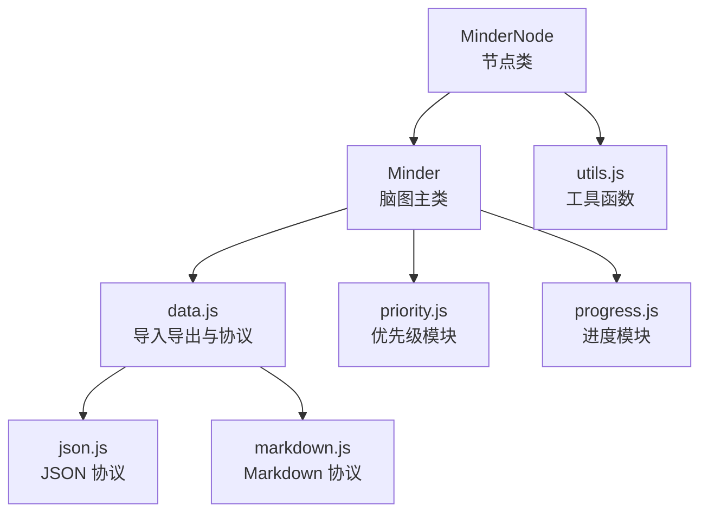
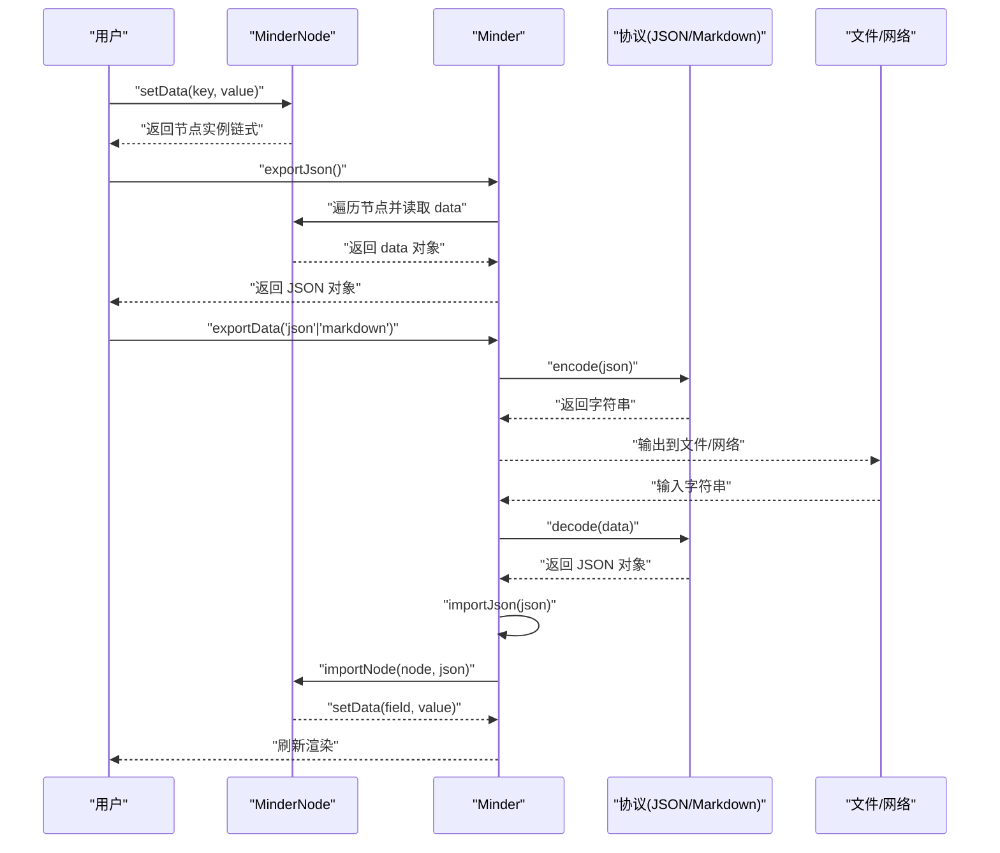
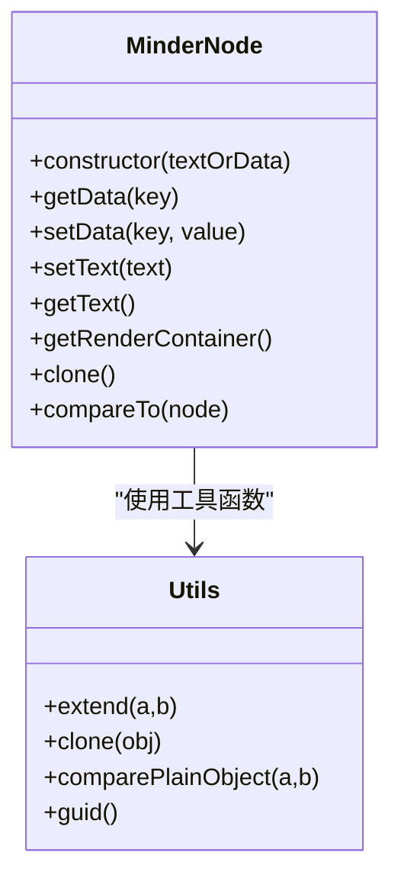
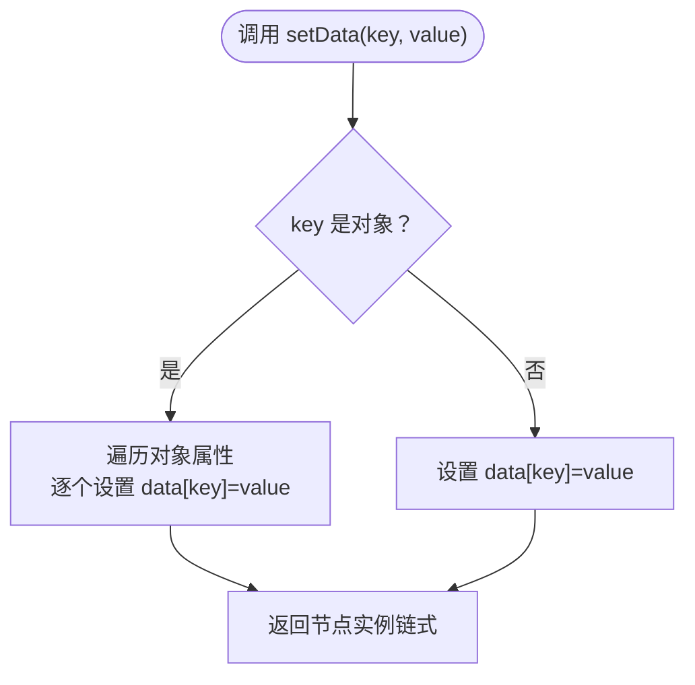
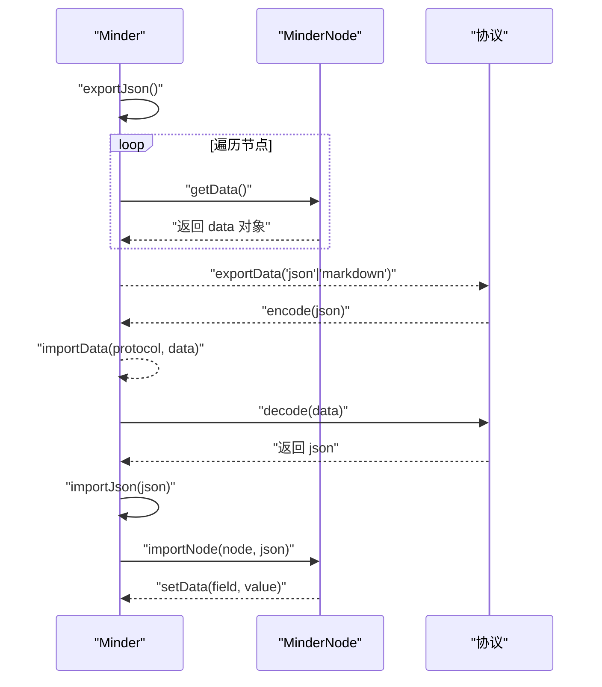
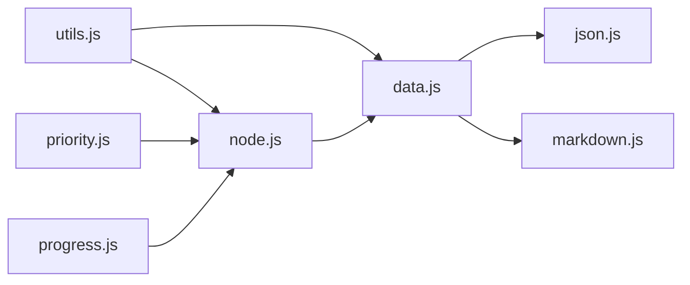

# 节点数据操作

<cite>
**本文引用的文件**
- [src/core/node.js](file://src/core/node.js)
- [src/core/data.js](file://src/core/data.js)
- [src/core/utils.js](file://src/core/utils.js)
- [doc/Architecture.md](file://doc/Architecture.md)
- [src/protocol/json.js](file://src/protocol/json.js)
- [src/protocol/markdown.js](file://src/protocol/markdown.js)
- [src/module/priority.js](file://src/module/priority.js)
- [src/module/progress.js](file://src/module/progress.js)
</cite>

## 目录
1. [简介](#简介)
2. [项目结构](#项目结构)
3. [核心组件](#核心组件)
4. [架构总览](#架构总览)
5. [详细组件分析](#详细组件分析)
6. [依赖分析](#依赖分析)
7. [性能考虑](#性能考虑)
8. [故障排查指南](#故障排查指南)
9. [结论](#结论)
10. [附录](#附录)

## 简介
本篇文档围绕 MinderNode 类的节点数据管理机制展开，重点阐释以下内容：
- setData() 与 getData() 的实现原理与使用方式：单字段赋值、对象批量扩展、以及数据变更后的同步与导出行为。
- 节点文本操作 setText() 与 getText() 的封装逻辑及其与 data.text 字段的关系。
- 节点自定义字段的扩展使用方式：如坐标、优先级、进度等业务数据，以及这些数据在导出 JSON 或 Markdown 时的持久化策略。
- 结合 Architecture.md 中“公开字段”的概念，说明哪些字段会被保留，以及如何通过 setData 接口安全地扩展元数据。
- 提供实际代码示例路径，展示如何读写复杂嵌套数据、监听数据变更事件、实现数据验证逻辑。
- 针对常见问题（数据类型错误、字段命名冲突、大数据量读写性能）给出优化建议与处理方案。

## 项目结构
本仓库采用模块化组织，与节点数据操作直接相关的核心文件包括：
- 核心节点类：src/core/node.js
- 数据导入导出与协议：src/core/data.js、src/protocol/json.js、src/protocol/markdown.js
- 工具函数：src/core/utils.js
- 架构说明：doc/Architecture.md
- 业务模块示例：src/module/priority.js、src/module/progress.js

图表来源
- [src/core/node.js](file://src/core/node.js#L1-L160)
- [src/core/data.js](file://src/core/data.js#L1-L120)
- [src/protocol/json.js](file://src/protocol/json.js#L1-L18)
- [src/protocol/markdown.js](file://src/protocol/markdown.js#L1-L60)
- [src/core/utils.js](file://src/core/utils.js#L1-L66)
- [src/module/priority.js](file://src/module/priority.js#L1-L120)
- [src/module/progress.js](file://src/module/progress.js#L1-L120)

章节来源
- [src/core/node.js](file://src/core/node.js#L1-L160)
- [src/core/data.js](file://src/core/data.js#L1-L120)
- [doc/Architecture.md](file://doc/Architecture.md#L256-L311)

## 核心组件
- MinderNode：负责节点树结构与数据存取，提供 getData()/setData()、setText()/getText()、坐标字段 x/y、文本字段 text 等能力。
- Minder：负责整棵树的导入导出、事件分发、布局刷新等，与数据协议解耦。
- Protocol：JSON/Markdown 等协议负责将内存树转换为字符串或从字符串还原为内存树。
- Utils：提供 guid/clone/comparePlainObject 等通用工具。

章节来源
- [src/core/node.js](file://src/core/node.js#L1-L160)
- [src/core/data.js](file://src/core/data.js#L50-L120)
- [src/core/utils.js](file://src/core/utils.js#L1-L66)
- [doc/Architecture.md](file://doc/Architecture.md#L256-L311)

## 架构总览
节点数据在内存中的流转路径如下：
- 用户通过 MinderNode.setData()/getData() 修改/读取节点数据。
- Minder.exportJson() 将整棵树的 data 字段序列化为 JSON。
- Minder.exportData() 通过协议 encode 将 JSON 输出为指定格式（如 JSON 文本、Markdown 文本）。
- 导入流程相反：协议 decode -> Minder.importJson -> Minder.importNode -> 节点 setData()。

图表来源
- [src/core/node.js](file://src/core/node.js#L130-L160)
- [src/core/data.js](file://src/core/data.js#L56-L120)
- [src/protocol/json.js](file://src/protocol/json.js#L1-L18)
- [src/protocol/markdown.js](file://src/protocol/markdown.js#L144-L158)

## 详细组件分析

### MinderNode 数据管理机制
- 数据容器：每个节点维护一个 data 对象，构造时可传入字符串（初始化 text）或对象（批量扩展 data 字段）。
- 单字段赋值：setData(key, value) 支持字符串键值对。
- 对象批量扩展：当 key 为对象时，遍历对象属性逐个赋值到 data。
- 读取数据：getData(key) 支持按字段读取或整体读取。
- 文本封装：setText()/getText() 直接读写 data.text 字段，保持与渲染层的一致性。
- 坐标字段：公开字段 x/y 可通过 setData()/getData() 读写，用于布局定位。
- 克隆与比较：clone() 深拷贝 data；compareTo() 比较 data 与 temp 是否一致。

图表来源
- [src/core/node.js](file://src/core/node.js#L1-L160)
- [src/core/utils.js](file://src/core/utils.js#L1-L66)

章节来源
- [src/core/node.js](file://src/core/node.js#L1-L160)
- [doc/Architecture.md](file://doc/Architecture.md#L282-L305)

### setData() 与 getData() 的实现与同步
- 单字段赋值：当 key 为字符串时，直接设置 data[key]。
- 对象批量扩展：当 key 为对象时，遍历对象属性并逐个赋值，适合一次性注入多个业务字段。
- 返回值：setData() 返回节点实例，便于链式调用。
- 自动同步：setData() 修改 data 后，后续导出时会包含这些字段；渲染模块可通过 getData() 读取并更新 UI。

图表来源
- [src/core/node.js](file://src/core/node.js#L130-L160)

章节来源
- [src/core/node.js](file://src/core/node.js#L130-L160)

### 节点文本操作：setText() 与 getText()
- setText(text)：直接设置 data.text。
- getText()：返回 data.text 或空值。
- 与渲染层的关系：业务模块（如优先级、进度）通过 getData()/setData() 读写 data 字段，从而影响渲染器的显示。

章节来源
- [src/core/node.js](file://src/core/node.js#L147-L161)
- [src/module/priority.js](file://src/module/priority.js#L95-L120)
- [src/module/progress.js](file://src/module/progress.js#L90-L125)

### 公开字段与持久化行为
- 公开字段：x/y、text 等字段属于公开字段，任何模块可读取/修改，且在导出/保存时会被保留。
- 导出策略：Minder.exportJson() 会将每个节点的 data 字段完整导出；若缺少 id，会在导出前补齐并回写节点。
- 协议层：JSON 协议直接 stringify；Markdown 协议将树结构转为标题层级与备注，仅保留 text 与 note 等字段。

章节来源
- [doc/Architecture.md](file://doc/Architecture.md#L256-L311)
- [src/core/data.js](file://src/core/data.js#L56-L120)
- [src/protocol/json.js](file://src/protocol/json.js#L1-L18)
- [src/protocol/markdown.js](file://src/protocol/markdown.js#L1-L60)

### 自定义字段扩展与业务场景
- 优先级字段：模块通过 setData('priority', value) 写入优先级，渲染器根据 getData('priority') 决定是否绘制优先级图标。
- 进度字段：模块通过 setData('progress', value) 写入进度，渲染器根据 getData('progress') 绘制进度饼图。
- 坐标字段：模块通过 setData('x'|'y', value) 写入坐标，配合布局系统使用。
- 注意事项：自定义字段应遵循“公开字段”原则，确保导出时被保留；避免与保留字段冲突。

章节来源
- [src/module/priority.js](file://src/module/priority.js#L95-L155)
- [src/module/progress.js](file://src/module/progress.js#L90-L159)
- [doc/Architecture.md](file://doc/Architecture.md#L288-L301)

### 导入导出与数据一致性
- 导出 JSON：exportJson() 遍历整棵树，将每个节点的 data 与 children 序列化为 JSON 对象。
- 导入 JSON：importJson() 先清理旧树，再通过 importNode() 逐节点 setData()，最后触发事件与刷新。
- Markdown 导入/导出：协议将树结构转换为标题层级与备注，注意仅保留 text 与 note 字段。
- 协议注册：registerProtocol() 将协议注册到全局，exportData()/importData() 通过协议名选择对应 encode/decode。

图表来源
- [src/core/data.js](file://src/core/data.js#L56-L120)
- [src/core/data.js](file://src/core/data.js#L310-L398)
- [src/protocol/json.js](file://src/protocol/json.js#L1-L18)
- [src/protocol/markdown.js](file://src/protocol/markdown.js#L144-L158)

章节来源
- [src/core/data.js](file://src/core/data.js#L56-L120)
- [src/core/data.js](file://src/core/data.js#L310-L398)
- [src/protocol/json.js](file://src/protocol/json.js#L1-L18)
- [src/protocol/markdown.js](file://src/protocol/markdown.js#L1-L60)

### 数据变更事件与监听
- 事件触发：导入完成后会 fire('import') 并触发 contentchange/interactchange 等事件，便于模块响应数据变更。
- 模块监听：业务模块可在 minder.on('import'|'contentchange'|...) 中执行渲染更新或数据校验。
- 建议：在 setData() 后，若涉及布局或渲染，调用 minder.layout()/refresh() 或模块自身的 render()。

章节来源
- [src/core/data.js](file://src/core/data.js#L292-L308)
- [src/module/priority.js](file://src/module/priority.js#L95-L120)
- [src/module/progress.js](file://src/module/progress.js#L90-L125)

### 复杂嵌套数据读写与验证
- 复杂嵌套：setData() 支持对象批量扩展，可一次性写入包含嵌套对象的业务数据。
- 数据验证：可在业务模块中对 value 进行类型校验与范围约束，失败时拒绝 setData 或抛出错误。
- 建议：对关键字段（如 id、x/y、priority、progress）建立统一的校验规则与默认值策略。

章节来源
- [src/core/node.js](file://src/core/node.js#L130-L160)
- [src/core/utils.js](file://src/core/utils.js#L1-L66)

## 依赖分析
- MinderNode 依赖 utils 提供的工具函数（extend/clone/comparePlainObject/guid）。
- Minder 依赖 data.js 提供的导入导出与协议注册能力。
- 协议模块依赖 data.js 的注册接口。
- 业务模块（priority/progress）依赖 MinderNode 的 getData()/setData() 与 Minder 的事件系统。

图表来源
- [src/core/node.js](file://src/core/node.js#L1-L160)
- [src/core/data.js](file://src/core/data.js#L1-L120)
- [src/core/utils.js](file://src/core/utils.js#L1-L66)
- [src/protocol/json.js](file://src/protocol/json.js#L1-L18)
- [src/protocol/markdown.js](file://src/protocol/markdown.js#L1-L60)
- [src/module/priority.js](file://src/module/priority.js#L1-L120)
- [src/module/progress.js](file://src/module/progress.js#L1-L120)

章节来源
- [src/core/node.js](file://src/core/node.js#L1-L160)
- [src/core/data.js](file://src/core/data.js#L1-L120)
- [src/core/utils.js](file://src/core/utils.js#L1-L66)

## 性能考虑
- 大规模树读写：exportJson() 需要遍历整棵树，节点数量较多时建议分批导出或延迟导出。
- 深拷贝与比较：clone() 使用 JSON 序列化/反序列化实现深拷贝，适用于普通对象；对包含函数/循环引用的对象需谨慎。
- 事件风暴：频繁 setData() 可能引发多次 contentchange/interactchange，建议在批量更新时合并操作或使用节流。

章节来源
- [src/core/data.js](file://src/core/data.js#L56-L120)
- [src/core/utils.js](file://src/core/utils.js#L1-L66)

## 故障排查指南
- 数据类型错误
  - 症状：渲染异常或协议 decode 失败。
  - 处理：在业务模块中对 value 进行类型判断与转换，必要时抛出错误并回滚。
  - 参考：优先级/进度模块对数值范围的约束。
- 字段命名冲突
  - 症状：与保留字段（如 id、text、x、y）冲突导致行为异常。
  - 处理：避免直接覆盖保留字段；如需扩展，请使用自定义字段名并在导出时确认其保留策略。
- 大数据量读写性能
  - 症状：导出/导入卡顿。
  - 处理：减少不必要的 setData() 调用；合并多次更新；对树进行分段处理；必要时禁用动画或延迟刷新。
- 导入后 ID 冲突
  - 症状：重复 ID 导致连接线失效。
  - 处理：导入前确保 ID 唯一；使用 importJson() 内置的 ID 冲突修复逻辑。

章节来源
- [src/module/priority.js](file://src/module/priority.js#L95-L120)
- [src/module/progress.js](file://src/module/progress.js#L90-L125)
- [src/core/data.js](file://src/core/data.js#L234-L308)

## 结论
- MinderNode 的数据模型以 data 对象为核心，通过 setData()/getData() 提供灵活的字段扩展能力。
- “公开字段”概念确保 x/y、text 等关键字段在导出/导入中得到保留，同时允许业务模块安全扩展自定义字段。
- 导入导出通过协议层解耦，JSON/Markdown 等格式可满足不同场景需求。
- 建议在业务模块中加入数据验证与事件监听，保证数据一致性与渲染及时性。

## 附录
- 实际代码示例路径（不展示具体代码内容）：
  - 单字段赋值与对象批量扩展：[setData 实现](file://src/core/node.js#L134-L145)
  - 读取 data 对象：[getData 实现](file://src/core/node.js#L130-L133)
  - 文本封装：[setText/getText](file://src/core/node.js#L147-L161)
  - 导出 JSON：[exportJson](file://src/core/data.js#L56-L120)
  - 导入 JSON：[importJson](file://src/core/data.js#L234-L308)
  - 导入/导出协议：[json 协议](file://src/protocol/json.js#L1-L18)、[markdown 协议](file://src/protocol/markdown.js#L144-L158)
  - 业务模块示例：[优先级模块](file://src/module/priority.js#L95-L155)、[进度模块](file://src/module/progress.js#L90-L159)