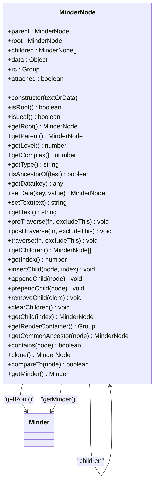
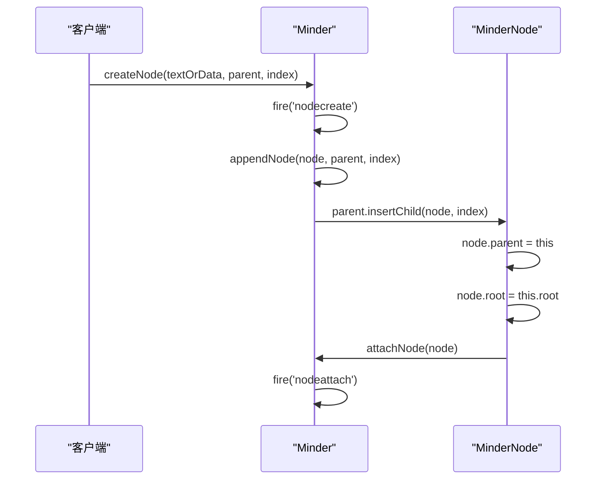
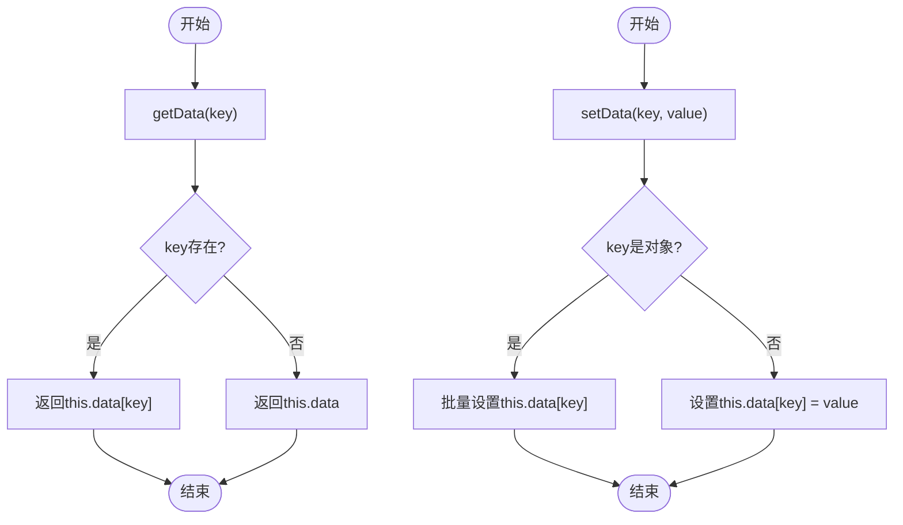
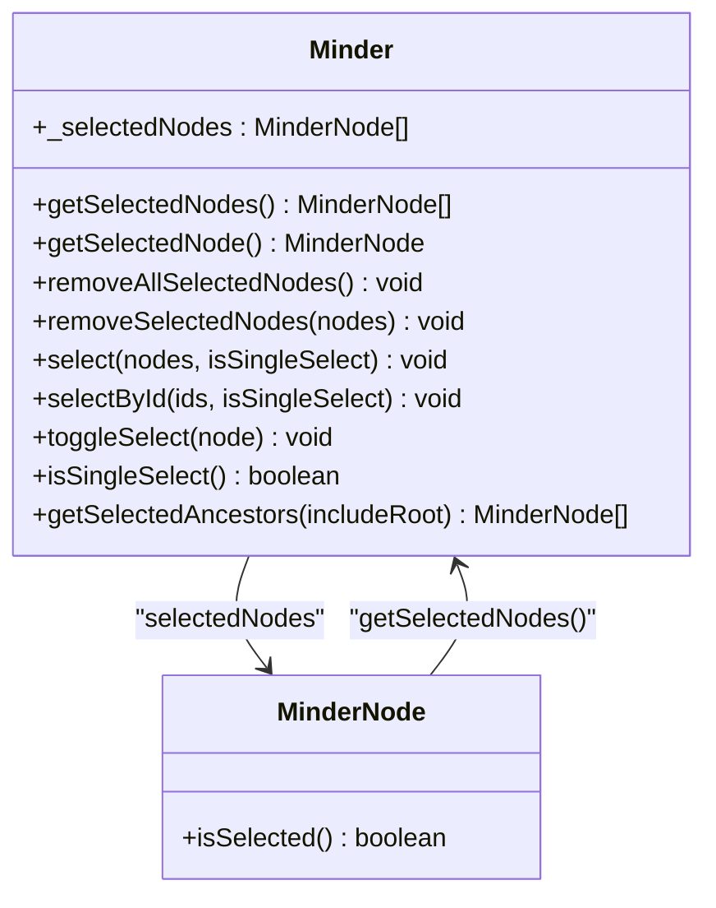
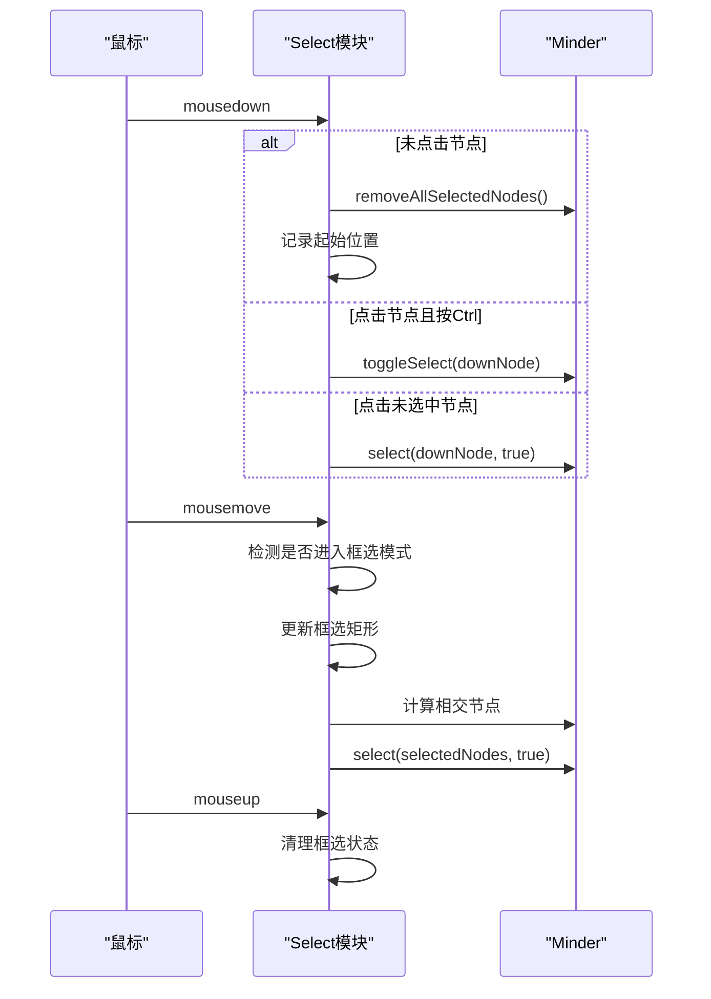
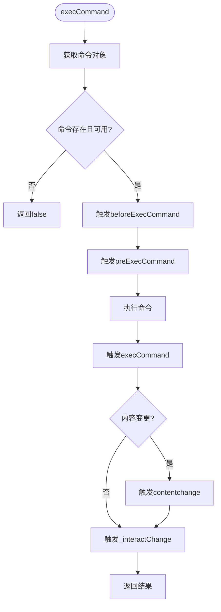
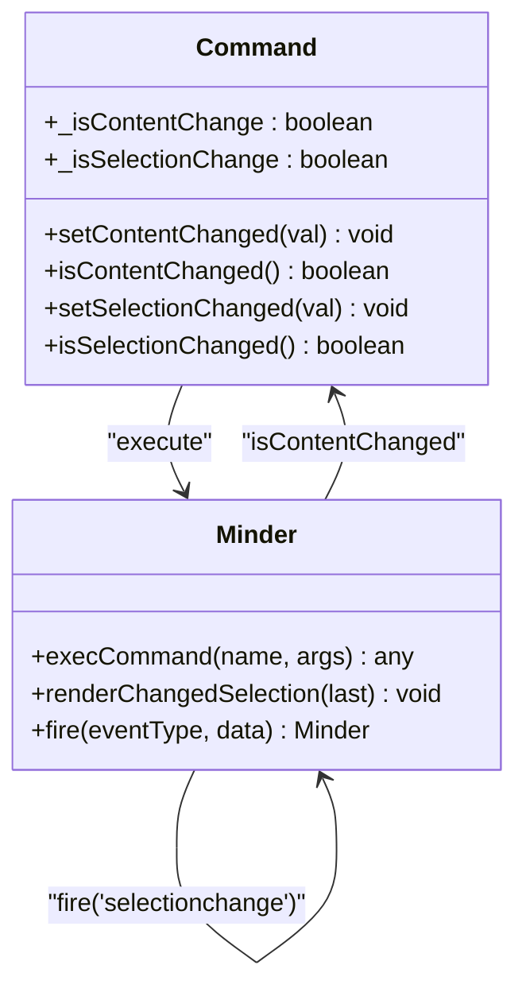
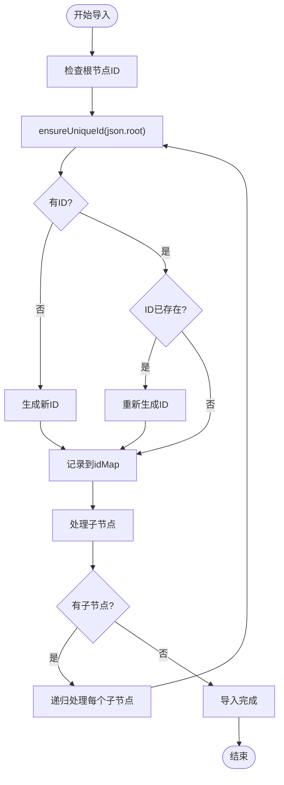

# 节点管理

<cite>
**本文档引用的文件**
- [node.js](file://src/core/node.js)
- [select.js](file://src/core/select.js)
- [select.js](file://src/module/select.js)
- [command.js](file://src/core/command.js)
- [data.js](file://src/core/data.js)
- [utils.js](file://src/core/utils.js)
- [hyperconnection.js](file://src/module/hyperconnection.js)
</cite>

## 目录
1. [MinderNode类设计与实现](#minderNode类设计与实现)
2. [节点选择系统](#节点选择系统)
3. [节点操作命令与事件](#节点操作命令与事件)
4. [节点ID生成与管理](#节点ID生成与管理)
5. [常见问题与解决方案](#常见问题与解决方案)

## MinderNode类设计与实现

MinderNode类是思维导图核心库中表示脑图节点的核心类，通过kity.createClass创建，实现了节点的创建、父子关系管理、数据存取和树遍历等核心功能。

节点创建时会初始化指针（parent、root、children）、数据（data）和绘图容器（rc）。其中data对象包含通过utils.guid()生成的唯一ID和创建时间戳。节点的父子关系通过parent指针和children数组维护，形成树形结构。



**图源**
- [node.js](file://src/core/node.js#L11-L283)

**节源**
- [node.js](file://src/core/node.js#L11-L283)

### 节点创建与父子关系管理

节点的创建通过Minder类的createNode方法实现，该方法会创建MinderNode实例并触发nodecreate事件，然后通过appendNode方法将其添加到指定父节点。父子关系的管理主要通过insertChild、appendChild、prependChild和removeChild等方法实现。

insertChild方法是核心的父子关系管理方法，它接受一个节点和索引参数，将节点插入到指定位置。如果节点已有父节点，会先从原父节点中移除。appendChild和prependChild分别是插入到末尾和开头的便捷方法。removeChild方法用于移除子节点，并清理其父节点和根节点引用。



**图源**
- [node.js](file://src/core/node.js#L350-L387)

**节源**
- [node.js](file://src/core/node.js#L199-L231)

### 树遍历与数据存取

MinderNode提供了多种树遍历方法，包括preTraverse（先序遍历）、postTraverse（后序遍历）和traverse（默认为后序遍历）。这些方法接受一个遍历函数作为参数，用于对子树中的每个节点执行操作。

数据存取通过getData和setData方法实现。getData方法可以获取指定键的数据或整个数据对象，setData方法支持单个键值对或对象形式的批量设置。此外还提供了专门的setText和getText方法用于文本数据的操作。



**图源**
- [node.js](file://src/core/node.js#L130-L161)

**节源**
- [node.js](file://src/core/node.js#L130-L161)

## 节点选择系统

节点选择系统由src/core/select.js和src/module/select.js两个文件共同实现，提供了单选、多选、切换选择和清除选择等操作。

### 核心选择功能

核心选择功能在src/core/select.js中实现，Minder类通过_selectedNodes数组维护选中节点列表。主要方法包括select（选择节点）、removeSelectedNodes（移除选中节点）、removeAllSelectedNodes（清除所有选中节点）和toggleSelect（切换选择状态）。

select方法接受节点或节点数组作为参数，支持单选模式（isSingleSelect为true时会先清空现有选择）。removeSelectedNodes方法从选中列表中移除指定节点。toggleSelect方法实现切换选择逻辑：如果节点已选中则移除，否则添加到选择中。



**图源**
- [select.js](file://src/core/select.js#L13-L139)

**节源**
- [select.js](file://src/core/select.js#L13-L139)

### 选择交互实现

选择交互在src/module/select.js中实现，通过注册Select模块处理鼠标事件。模块实现了框选功能，当鼠标按下并移动超过阈值距离时进入框选模式，显示选区矩形并计算与矩形相交的节点。

鼠标事件处理逻辑如下：mousedown时根据是否点击节点和是否按Ctrl键决定操作（清除选择、切换选择或单选）；mousemove时更新框选矩形和选中范围；mouseup时清理状态。还实现了Ctrl+A全选功能。



**图源**
- [select.js](file://src/module/select.js#L11-L184)

**节源**
- [select.js](file://src/module/select.js#L11-L184)

## 节点操作命令与事件

节点操作通过execCommand方法执行，该方法会触发一系列事件并调用相应命令的execute方法。

### 命令执行机制

execCommand方法首先获取命令对象，检查其状态，然后依次触发beforeExecCommand、preExecCommand事件，执行命令，触发execCommand事件。如果命令标记为内容变更，还会触发contentchange事件。



**图源**
- [command.js](file://src/core/command.js#L118-L165)

**节源**
- [command.js](file://src/core/command.js#L118-L165)

### 事件触发机制

节点操作会触发contentchange和selectionchange事件。contentchange事件在命令执行后且命令标记为内容变更时触发，表示内容发生变化。selectionchange事件在选择状态改变时触发，通过renderChangedSelection方法实现。



**图源**
- [command.js](file://src/core/command.js#L18-L39)
- [select.js](file://src/core/select.js#L17-L39)

**节源**
- [command.js](file://src/core/command.js#L18-L39)
- [select.js](file://src/core/select.js#L17-L39)

## 节点ID生成与管理

节点ID的生成与管理是确保数据完整性和避免冲突的关键机制。

### ID生成机制

节点ID通过utils.guid()方法生成，该方法结合时间戳和随机数创建唯一标识符。在MinderNode构造函数中，会为每个新节点生成ID：

```javascript
this.data = {
    id: utils.guid(),
    created: +new Date()
};
```

### 导入时ID冲突处理

在数据导入时，系统会检查并处理ID冲突。importJson方法中通过ensureUniqueId函数确保每个节点ID的唯一性：

1. 如果节点没有ID，生成新ID
2. 如果ID已存在（通过idMap记录），重新生成ID
3. 递归处理所有子节点



**图源**
- [data.js](file://src/core/data.js#L253-L269)

**节源**
- [data.js](file://src/core/data.js#L253-L269)

## 常见问题与解决方案

### 节点删除后关联线清理

当节点被删除时，相关的自由关联线需要被清理。系统通过检查关联线的from和to节点ID是否存在来清理无效的关联线。

在importJson方法中，导入自由关联线时会验证节点ID是否存在：

```javascript
if (json.connections) {
    var validConnections = [];
    for (var i = 0; i < json.connections.length; i++) {
        var conn = json.connections[i];
        if (idMap[conn.from] && idMap[conn.to]) {
            validConnections.push(conn);
        }
    }
    this.setHyperConnections(validConnections);
}
```

**节源**
- [data.js](file://src/core/data.js#L278-L287)

### 选择状态同步异常

选择状态同步异常可能由事件触发时机不当引起。系统通过renderChangedSelection方法确保选择状态的正确同步：

1. 记录上一次的选择状态
2. 计算变化的节点（新增和移除）
3. 如果有变化，触发selectionchange事件
4. 重新渲染变化的节点

```javascript
renderChangedSelection: function(last) {
    var current = this.getSelectedNodes();
    var changed = [];
    
    // 计算新增的节点
    current.forEach(function(node) {
        if (last.indexOf(node) == -1) {
            changed.push(node);
        }
    });
    
    // 计算移除的节点
    last.forEach(function(node) {
        if (current.indexOf(node) == -1) {
            changed.push(node);
        }
    });
    
    // 如果有变化，触发事件
    if (changed.length) {
        this._interactChange();
        this.fire('selectionchange');
    }
    
    // 重新渲染变化的节点
    while (changed.length) {
        changed.shift().render();
    }
}
```

**节源**
- [select.js](file://src/core/select.js#L17-L39)