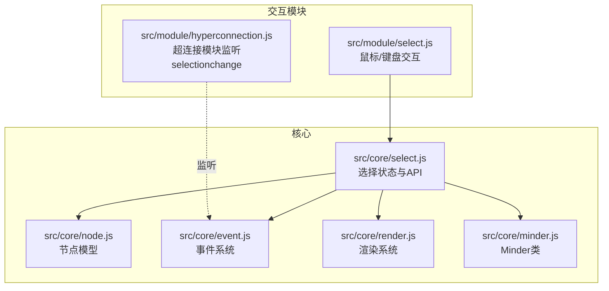
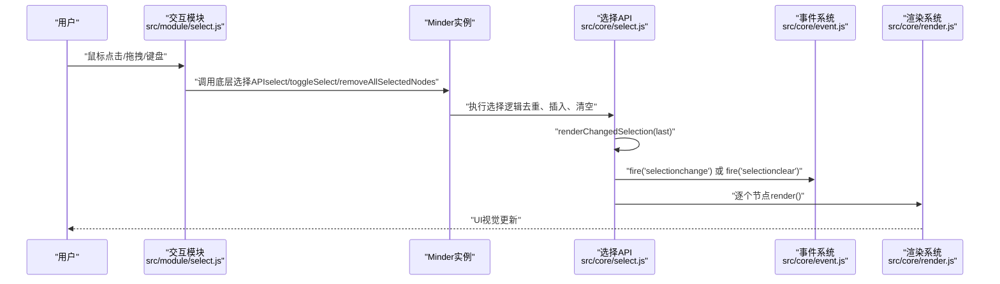
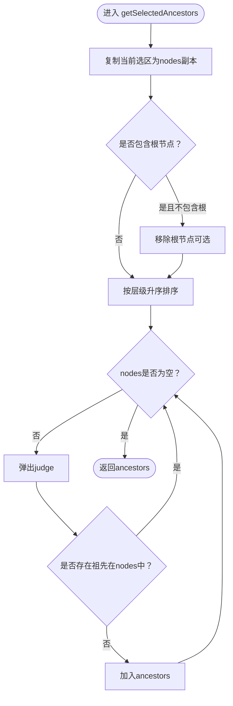
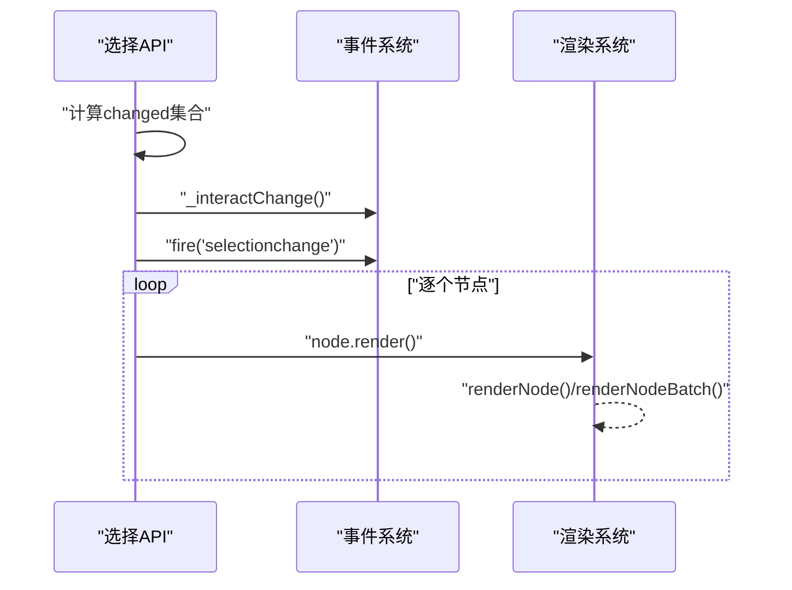
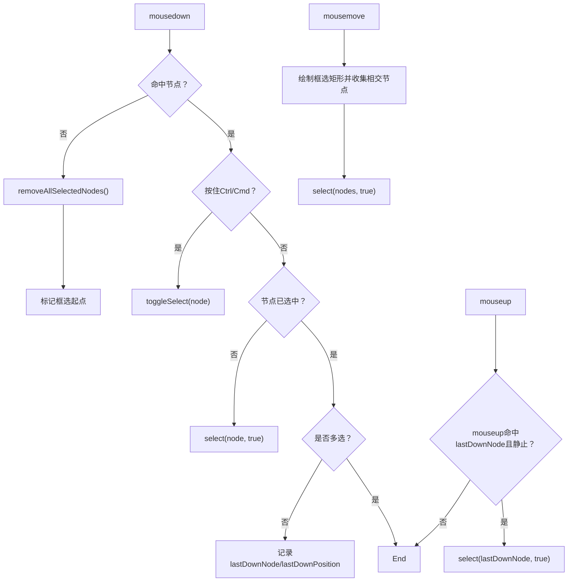
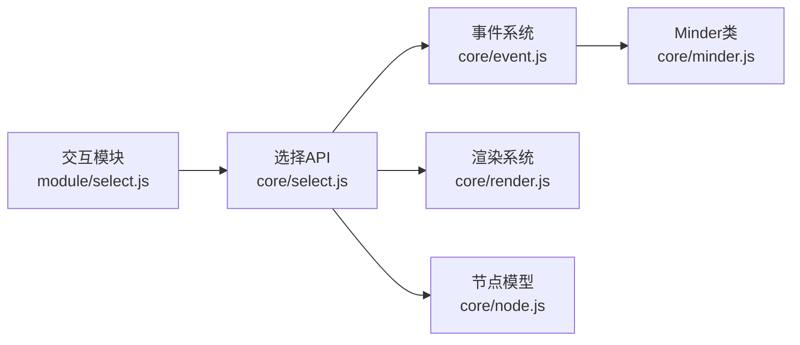

# 节点选择

<cite>
**本文引用的文件**
- [src/core/select.js](file://src/core/select.js)
- [src/module/select.js](file://src/module/select.js)
- [src/core/minder.js](file://src/core/minder.js)
- [src/core/node.js](file://src/core/node.js)
- [src/core/event.js](file://src/core/event.js)
- [src/core/render.js](file://src/core/render.js)
- [doc/Architecture.md](file://doc/Architecture.md)
- [src/module/hyperconnection.js](file://src/module/hyperconnection.js)
</cite>

## 目录
1. [简介](#简介)
2. [项目结构](#项目结构)
3. [核心组件](#核心组件)
4. [架构总览](#架构总览)
5. [详细组件分析](#详细组件分析)
6. [依赖关系分析](#依赖关系分析)
7. [性能考量](#性能考量)
8. [故障排查指南](#故障排查指南)
9. [结论](#结论)
10. [附录](#附录)

## 简介
本章节围绕思维导图中的“节点选择”系统展开，重点解释以下方面：
- Minder 实例内部的_selectedNodes数组如何管理选中节点集合
- select、removeSelectedNodes、toggleSelect等核心方法的实现原理
- 选择状态变更检测与renderChangedSelection渲染同步机制
- 单选与多选模式切换逻辑（isSingleSelect参数）
- 选择状态变更时触发的selectionchange事件传播机制
- getSelectedAncestors在复杂选择场景下的拓扑排序算法
- 结合模块交互实现，说明鼠标点击、Ctrl/Cmd多选、Shift范围选择等用户操作如何映射到底层选择API
- 提供通过selectById按ID选择节点的方法路径与监听selectionclear事件的实践建议
- 针对选择状态不同步、重复选择导致渲染性能下降、大规模节点选择时的内存占用等常见问题给出优化建议

## 项目结构
选择系统由两部分组成：
- 核心选择逻辑：位于src/core/select.js，负责选区数据结构、状态变更检测与渲染同步、API方法（select、removeSelectedNodes、toggleSelect、selectById、getSelectedAncestors等）
- 交互模块：位于src/module/select.js，负责鼠标事件、框选矩形绘制、快捷键（Ctrl/Cmd、Shift、Ctrl+A）映射到底层选择API

图表来源
- [src/core/select.js](file://src/core/select.js#L1-L146)
- [src/module/select.js](file://src/module/select.js#L1-L184)
- [src/core/minder.js](file://src/core/minder.js#L1-L41)
- [src/core/node.js](file://src/core/node.js#L1-L407)
- [src/core/event.js](file://src/core/event.js#L1-L270)
- [src/core/render.js](file://src/core/render.js#L1-L261)
- [src/module/hyperconnection.js](file://src/module/hyperconnection.js#L280-L290)

章节来源
- [src/core/select.js](file://src/core/select.js#L1-L146)
- [src/module/select.js](file://src/module/select.js#L1-L184)

## 核心组件
- Minder._selectedNodes：存放当前选中节点的数组，采用“未克隆返回”的设计，便于直接操作选区而不影响命令查询
- 选择API：
  - select(nodes, isSingleSelect)：支持单选/多选，去重插入
  - removeSelectedNodes(nodes)：从选区移除指定节点
  - removeAllSelectedNodes()：清空选区并触发selectionclear
  - toggleSelect(node)：切换节点选中状态
  - selectById(ids, isSingleSelect)：按ID批量选择
  - getSelectedAncestors(includeRoot)：在复杂选择下计算祖先节点集合（拓扑排序+祖先判定）
  - isSingleSelect()：判断是否仅有一个选中节点
- 事件与渲染：
  - renderChangedSelection(last)：比较前后选区差异，触发_interactChange与selectionchange，并逐个render节点
  - 事件传播：selectionchange、selectionclear、interactchange
  - 渲染：每个变更节点调用render，触发渲染管线

章节来源
- [src/core/select.js](file://src/core/select.js#L1-L146)
- [src/core/event.js](file://src/core/event.js#L180-L266)
- [src/core/render.js](file://src/core/render.js#L223-L261)

## 架构总览
下面的序列图展示了从用户交互到底层选择API再到事件与渲染的整体流程。

图表来源
- [src/module/select.js](file://src/module/select.js#L119-L181)
- [src/core/select.js](file://src/core/select.js#L17-L40)
- [src/core/event.js](file://src/core/event.js#L232-L266)
- [src/core/render.js](file://src/core/render.js#L223-L261)

## 详细组件分析

### 1) 选择状态与API（src/core/select.js）
- _initSelection：初始化_selectedNodes为空数组
- getSelectedNodes/getSelectedNode：返回当前选区引用（非克隆），便于命令查询一致性
- select(nodes, isSingleSelect)：
  - isSingleSelect为真时先清空选区
  - 去重后将节点unshift到选区前端（保持最近选中优先级）
  - 最后调用renderChangedSelection(last)
- removeSelectedNodes(nodes)：从选区中移除指定节点，调用renderChangedSelection(last)
- removeAllSelectedNodes()：清空选区并触发selectionclear
- toggleSelect(node)：若节点已选则移除，否则加入
- selectById(ids, isSingleSelect)：通过getNodesById按ID解析节点后委托select
- getSelectedAncestors(includeRoot)：
  - 拓扑排序：按层级升序排列
  - 从后向前扫描，使用hasAncestor(nodes, judge)判断是否已有祖先在当前nodes中，若无则加入祖先集
  - 根节点可按需排除
- isSingleSelect()：基于_selectedNodes长度判断

图表来源
- [src/core/select.js](file://src/core/select.js#L104-L136)

章节来源
- [src/core/select.js](file://src/core/select.js#L1-L146)

### 2) 事件与渲染同步（src/core/select.js + src/core/event.js + src/core/render.js）
- renderChangedSelection(last)：
  - 计算当前与上次选区的差集，若存在变化则：
    - 触发_interactChange（交互事件稀释）
    - fire('selectionchange')
  - 逐个节点调用render()，触发渲染管线
- 事件系统：
  - Minder._fire分发before/pre/execute/after四阶段事件
  - fire(type, params)统一派发事件
  - _interactChange通过setTimeout进行交互事件稀释
- 渲染系统：
  - MinderNode.render()委托Minder.renderNode()或renderNodeBatch()
  - 每个节点渲染器按顺序创建/更新图形并合并内容盒

图表来源
- [src/core/select.js](file://src/core/select.js#L17-L40)
- [src/core/event.js](file://src/core/event.js#L184-L200)
- [src/core/render.js](file://src/core/render.js#L165-L219)

章节来源
- [src/core/select.js](file://src/core/select.js#L17-L40)
- [src/core/event.js](file://src/core/event.js#L184-L200)
- [src/core/render.js](file://src/core/render.js#L165-L219)

### 3) 交互映射与用户操作（src/module/select.js）
- 鼠标点击：
  - 点击空白区域：清除选中并标记框选起点
  - 点击节点且按住Ctrl/Cmd：toggleSelect
  - 点击节点且未选中：select该节点（单选）
  - 点击已选中节点且多选：记录lastDownNode与lastDownPosition，mouseup时若静止则单选该节点
- 框选矩形：
  - 记录起始位置，移动超过阈值后绘制矩形
  - 遍历根节点树，计算节点布局盒与矩形相交，收集选中节点
  - 调用select(selectedNodes, true)完成单选覆盖
- 全选：
  - Ctrl+A：遍历所有节点，select(selectedNodes, true)

图表来源
- [src/module/select.js](file://src/module/select.js#L119-L181)

章节来源
- [src/module/select.js](file://src/module/select.js#L1-L184)

### 4) 事件传播与外部模块联动
- selectionchange事件：
  - 在顶层命令后查询是否发生选区变化，若变化则触发
  - 事件携带当前选择节点列表、新增节点与移除节点信息（参考架构文档）
- selectionclear事件：
  - 清空选区时触发
- interactchange事件：
  - 所有鼠标、键盘、触摸操作后发生，且进行稀释；命令可手动触发且不被稀释
- 示例：超连接模块监听selectionchange，当有新选中时取消当前连线选中状态

章节来源
- [src/core/select.js](file://src/core/select.js#L33-L40)
- [src/core/event.js](file://src/core/event.js#L184-L200)
- [doc/Architecture.md](file://doc/Architecture.md#L414-L438)
- [src/module/hyperconnection.js](file://src/module/hyperconnection.js#L285-L288)

### 5) 拓扑排序与祖先节点计算（getSelectedAncestors）
- 算法要点：
  - 排序：按节点层级升序，保证“自底向上”的祖先判定
  - 去重：若某节点已有祖先在当前nodes中，则跳过
  - 根节点可按需排除
- 时间复杂度：
  - 排序O(n log n)，祖先判定在最坏情况下对每个节点检查其祖先链，整体约O(n·h)，h为树高
- 空间复杂度：
  - O(n)用于nodes副本与结果集

章节来源
- [src/core/select.js](file://src/core/select.js#L104-L136)

### 6) 单选与多选模式切换（isSingleSelect）
- isSingleSelect()：基于_selectedNodes长度判断
- select(isSingleSelect)：
  - 传入true时先清空选区，实现单选覆盖
  - 传入false时保留原有选区，实现多选追加
- 交互模块：
  - 框选与Ctrl+A均调用select(nodes, true)实现单选覆盖
  - Ctrl/Cmd点击节点时toggleSelect实现多选切换

章节来源
- [src/core/select.js](file://src/core/select.js#L69-L87)
- [src/module/select.js](file://src/module/select.js#L119-L181)

### 7) 通过ID选择节点（selectById）
- selectById(ids, isSingleSelect)：
  - 将ids标准化为数组
  - 通过getNodesById(ids)解析节点
  - 委托select(nodes, isSingleSelect)完成选择
- getNodesById(ids)：
  - 遍历getAllNode()，匹配节点data.id

章节来源
- [src/core/select.js](file://src/core/select.js#L83-L87)
- [src/core/minder.js](file://src/core/minder.js#L316-L348)

### 8) 监听selectionclear事件
- removeAllSelectedNodes()在清空选区后触发selectionclear
- 外部模块可通过minder.on('selectionclear', ...)监听并执行清理逻辑（如取消高亮、隐藏工具面板等）

章节来源
- [src/core/select.js](file://src/core/select.js#L48-L54)
- [src/core/event.js](file://src/core/event.js#L232-L266)

## 依赖关系分析
- 选择API依赖：
  - 事件系统：fire('selectionchange'|'selectionclear')、_interactChange
  - 渲染系统：逐个节点render()
  - 节点模型：isSelected()、isAncestorOf()、getLevel()等
- 交互模块依赖：
  - 选择API：select、toggleSelect、removeAllSelectedNodes
  - 事件系统：通过MinderEvent封装原生事件并提供getTargetNode()

图表来源
- [src/module/select.js](file://src/module/select.js#L1-L184)
- [src/core/select.js](file://src/core/select.js#L1-L146)
- [src/core/event.js](file://src/core/event.js#L1-L270)
- [src/core/render.js](file://src/core/render.js#L1-L261)
- [src/core/node.js](file://src/core/node.js#L1-L407)
- [src/core/minder.js](file://src/core/minder.js#L1-L41)

章节来源
- [src/module/select.js](file://src/module/select.js#L1-L184)
- [src/core/select.js](file://src/core/select.js#L1-L146)
- [src/core/event.js](file://src/core/event.js#L1-L270)
- [src/core/render.js](file://src/core/render.js#L1-L261)
- [src/core/node.js](file://src/core/node.js#L1-L407)
- [src/core/minder.js](file://src/core/minder.js#L1-L41)

## 性能考量
- 重复选择导致的渲染开销：
  - renderChangedSelection会逐个节点render()，若大量节点重复选中，可能引发不必要的重绘
  - 建议：在调用select前进行“是否已在选区”的预判，避免重复插入
- 大规模节点选择：
  - 框选时遍历整棵树，复杂度与节点数相关
  - 建议：在超大图场景下限制框选阈值或采用更高效的相交检测策略
- 事件稀释：
  - _interactChange通过setTimeout进行交互事件稀释，减少频繁事件风暴
- 内存占用：
  - _selectedNodes存储节点引用，注意及时调用removeAllSelectedNodes或removeSelectedNodes释放
  - getSelectedAncestors使用nodes副本与结果集，注意在复杂选择场景下的临时对象回收

[本节为通用性能建议，不直接分析具体文件]

## 故障排查指南
- 选择状态不同步：
  - 确认是否在模块事件中正确调用底层选择API（如toggleSelect、select）
  - 检查是否遗漏调用renderChangedSelection或未触发selectionchange
- 重复选择导致渲染性能下降：
  - 在调用select前检查isSelected()或去重逻辑
  - 避免在短时间内多次触发相同选择
- 大规模节点选择内存占用高：
  - 适当拆分选择批次，或在超大图场景禁用某些渲染器
  - 及时清理选区，避免长期持有节点引用
- selectionchange未触发：
  - 确认renderChangedSelection确实检测到差异
  - 检查事件绑定与冒泡是否被拦截

章节来源
- [src/core/select.js](file://src/core/select.js#L17-L40)
- [src/core/event.js](file://src/core/event.js#L184-L200)

## 结论
本选择系统通过清晰的API边界与事件驱动的渲染同步，实现了从用户交互到底层状态变更再到UI更新的完整闭环。核心要点包括：
- 选区数据结构简单高效，支持单选/多选与按ID选择
- 选择状态变更检测与渲染同步机制确保UI一致性
- 交互模块将鼠标/键盘操作映射到底层选择API，形成一致的用户体验
- 事件系统提供selectionchange、selectionclear、interactchange等关键事件，便于外部模块联动

[本节为总结性内容，不直接分析具体文件]

## 附录

### A. 事件与状态概览
- selectionchange：选区发生变化时触发
- selectionclear：选区被清空时触发
- interactchange：交互操作后触发（稀释）

章节来源
- [src/core/select.js](file://src/core/select.js#L33-L40)
- [src/core/event.js](file://src/core/event.js#L184-L200)
- [doc/Architecture.md](file://doc/Architecture.md#L414-L438)

### B. 代码片段路径参考（不含具体代码）
- 选择API入口与状态管理：[src/core/select.js](file://src/core/select.js#L1-L146)
- 交互映射与用户操作：[src/module/select.js](file://src/module/select.js#L119-L181)
- 事件系统与稀释机制：[src/core/event.js](file://src/core/event.js#L184-L200)
- 渲染系统与逐节点渲染：[src/core/render.js](file://src/core/render.js#L223-L261)
- 节点模型与祖先判定：[src/core/node.js](file://src/core/node.js#L117-L128)
- 通过ID选择节点：[src/core/select.js](file://src/core/select.js#L83-L87)、[src/core/minder.js](file://src/core/minder.js#L335-L348)
- 监听selectionclear事件：[src/core/select.js](file://src/core/select.js#L48-L54)