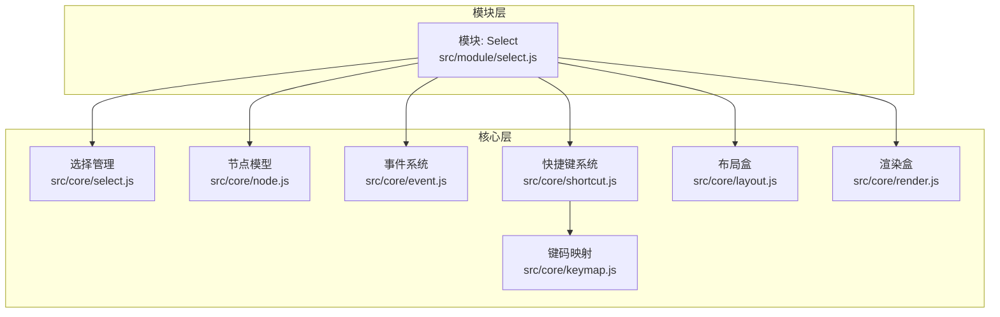
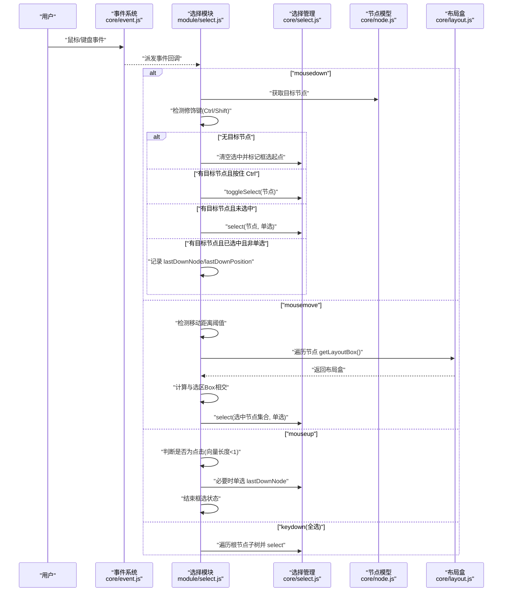
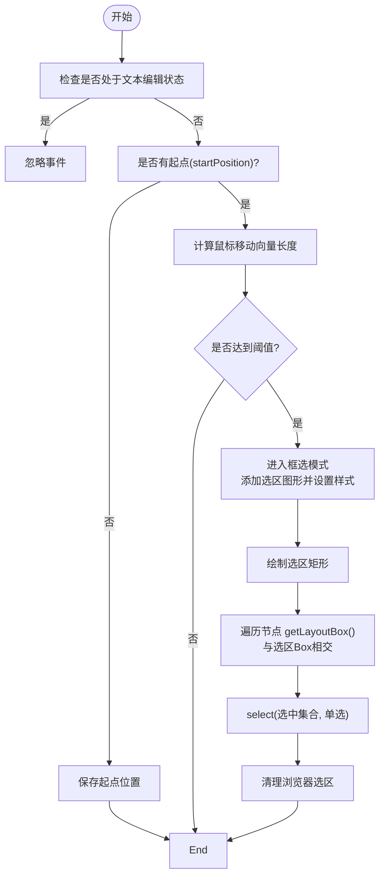
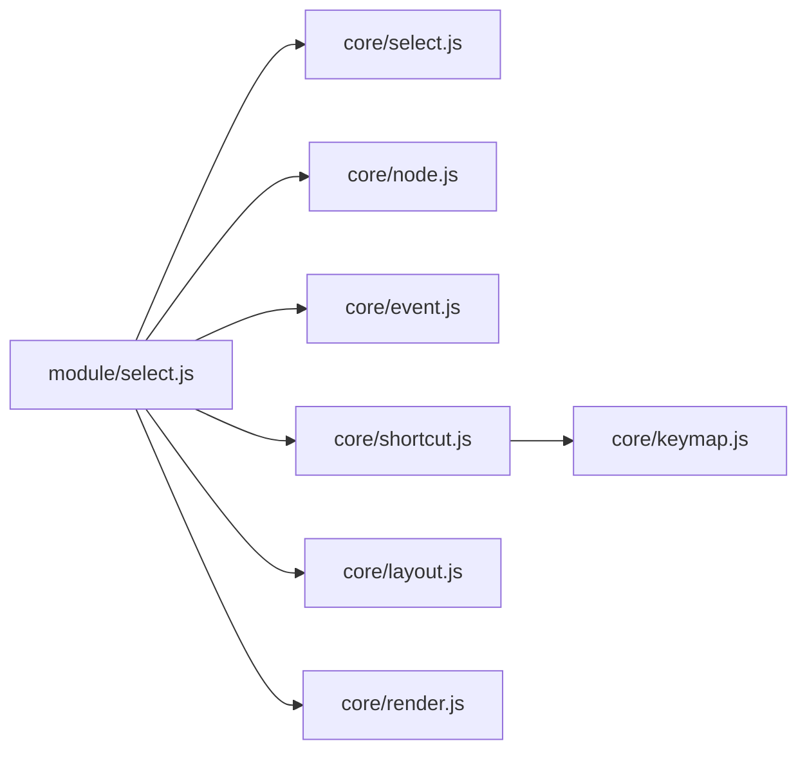

# 选择操作实现

<cite>
**本文引用的文件列表**
- [src/module/select.js](file://src/module/select.js)
- [src/core/select.js](file://src/core/select.js)
- [src/core/node.js](file://src/core/node.js)
- [src/core/event.js](file://src/core/event.js)
- [src/core/keymap.js](file://src/core/keymap.js)
- [src/core/shortcut.js](file://src/core/shortcut.js)
- [src/core/layout.js](file://src/core/layout.js)
- [src/core/render.js](file://src/core/render.js)
</cite>

## 目录
1. [简介](#简介)
2. [项目结构](#项目结构)
3. [核心组件](#核心组件)
4. [架构总览](#架构总览)
5. [详细组件分析](#详细组件分析)
6. [依赖关系分析](#依赖关系分析)
7. [性能考量](#性能考量)
8. [故障排查指南](#故障排查指南)
9. [结论](#结论)
10. [附录](#附录)

## 简介
本文件围绕用户交互式节点选择操作展开，重点解析鼠标与键盘事件驱动的选择行为，包括：
- mousedown 中对 Ctrl 键（多选）与 Shift 键（范围选择）的检测逻辑
- toggleSelect 实现节点选中状态切换
- 框选（Marquee）选择的完整流程：从 mousedown 记录起点，mousemove 检测移动距离阈值以激活框选模式，动态绘制选区矩形，遍历节点的布局盒与选区 Box 的交集判定被选中节点
- mouseup 中对拖动与点击的区分（基于 lastDownPosition 与当前位置向量长度），避免误触发单选
- 全选快捷键 Ctrl+A 的实现：遍历根节点下所有子节点并执行选择

同时提供可操作的代码示例路径与常见问题的优化建议。

## 项目结构
选择模块位于模块层，负责与核心层的事件系统、选择管理、节点模型、布局盒等协作，形成完整的交互闭环。

图表来源
- [src/module/select.js](file://src/module/select.js#L1-L184)
- [src/core/select.js](file://src/core/select.js#L1-L146)
- [src/core/node.js](file://src/core/node.js#L1-L407)
- [src/core/event.js](file://src/core/event.js#L1-L270)
- [src/core/shortcut.js](file://src/core/shortcut.js#L1-L154)
- [src/core/keymap.js](file://src/core/keymap.js#L1-L128)
- [src/core/layout.js](file://src/core/layout.js#L196-L200)
- [src/core/render.js](file://src/core/render.js#L245-L261)

章节来源
- [src/module/select.js](file://src/module/select.js#L1-L184)
- [src/core/select.js](file://src/core/select.js#L1-L146)
- [src/core/node.js](file://src/core/node.js#L1-L407)
- [src/core/event.js](file://src/core/event.js#L1-L270)
- [src/core/shortcut.js](file://src/core/shortcut.js#L1-L154)
- [src/core/keymap.js](file://src/core/keymap.js#L1-L128)
- [src/core/layout.js](file://src/core/layout.js#L196-L200)
- [src/core/render.js](file://src/core/render.js#L245-L261)

## 核心组件
- 模块层选择模块：封装鼠标与键盘事件处理、框选状态机、单选/多选/全选逻辑
- 核心选择管理：维护选中节点集合、提供 select/toggleSelect/isSingleSelect 等能力
- 节点模型：提供 isSelected、getLayoutBox 等接口
- 事件系统：统一派发鼠标/键盘事件，提供 getPosition/getTargetNode 等工具
- 快捷键系统：统一解析组合键，支持状态条件绑定
- 布局盒：提供节点全局布局盒，用于与选区 Box 进行相交判断
- 渲染盒：提供节点渲染盒，辅助定位与绘制

章节来源
- [src/module/select.js](file://src/module/select.js#L1-L184)
- [src/core/select.js](file://src/core/select.js#L1-L146)
- [src/core/node.js](file://src/core/node.js#L1-L407)
- [src/core/event.js](file://src/core/event.js#L1-L270)
- [src/core/shortcut.js](file://src/core/shortcut.js#L1-L154)
- [src/core/keymap.js](file://src/core/keymap.js#L1-L128)
- [src/core/layout.js](file://src/core/layout.js#L196-L200)
- [src/core/render.js](file://src/core/render.js#L245-L261)

## 架构总览
选择交互的控制流如下：模块层接收事件 -> 解析修饰键与目标节点 -> 根据状态执行单选/多选/框选/全选 -> 通过核心选择管理更新选中集合 -> 触发渲染变更事件。

图表来源
- [src/module/select.js](file://src/module/select.js#L114-L181)
- [src/core/select.js](file://src/core/select.js#L41-L100)
- [src/core/node.js](file://src/core/node.js#L139-L146)
- [src/core/layout.js](file://src/core/layout.js#L334-L343)

## 详细组件分析

### 选择模块（模块层）
- 事件注册与初始化
  - 初始化时监听 window 的 mouseup，确保框选结束后清理状态
  - 事件处理器包括 mousedown、mousemove、mouseup、normal.keydown
- mousedown 分支逻辑
  - 无目标节点：清除选中并标记框选起点
  - 有目标节点且按住 Ctrl：toggleSelect
  - 有目标节点且未选中：单选该节点
  - 有目标节点且已选中且非单选：记录 lastDownNode 与 lastDownPosition，等待 mouseup 判定点击或拖动
- mousemove 框选流程
  - 检测是否处于文本编辑状态，若是则忽略
  - 若未达到阈值，直接返回；达到阈值后进入框选模式并添加选区图形
  - 动态绘制选区矩形（Path），并将其四边取整以避免像素模糊
  - 遍历根节点子树，使用节点 getLayoutBox() 与选区 Box 的相交判断，收集选中节点
  - 调用 select(selectedNodes, true) 应用选中集合
  - 清理浏览器选区
- mouseup 点击/拖动区分
  - 仅当 mouseup 发生在 lastDownNode 上且向量长度小于阈值才执行单选
  - 结束框选状态，淡出并移除选区图形
- 全选快捷键
  - 监听 normal.keydown，匹配 ctrl+a 组合键
  - 遍历根节点子树，收集所有节点并执行 select，阻止默认行为

章节来源
- [src/module/select.js](file://src/module/select.js#L114-L181)

#### 框选状态机与阈值检测

图表来源
- [src/module/select.js](file://src/module/select.js#L30-L108)
- [src/core/layout.js](file://src/core/layout.js#L334-L343)

#### 修饰键与多选/单选判定
- Ctrl 键：在 mousedown 中检测，若命中目标节点且按住 Ctrl，则调用 toggleSelect 实现多选切换
- Shift 键：在当前实现中未作为范围选择的修饰键使用，范围选择由框选阈值与选区矩形决定
- 单选/多选：通过 select(nodes, isSingleSelect) 控制是否清空已有选中集合

章节来源
- [src/module/select.js](file://src/module/select.js#L120-L152)
- [src/core/select.js](file://src/core/select.js#L69-L100)

#### 全选快捷键实现
- 使用快捷键系统匹配 ctrl+a，遍历根节点子树收集节点并执行 select
- 阻止默认行为，避免浏览器复制粘贴等默认动作

章节来源
- [src/module/select.js](file://src/module/select.js#L168-L181)
- [src/core/shortcut.js](file://src/core/shortcut.js#L62-L71)
- [src/core/keymap.js](file://src/core/keymap.js#L1-L128)

### 核心选择管理
- 选中集合管理
  - 提供 getSelectedNodes/getSelectedNode/removeAllSelectedNodes/removeSelectedNodes/select/toggleSelect/isSingleSelect 等方法
  - select 支持单选与追加多选，内部维护 last 与 current 的差异，触发 selectionchange 事件
- 选中祖先节点查询
  - 提供 getSelectedAncestors，按拓扑排序过滤掉后代节点，返回最小祖先集合

章节来源
- [src/core/select.js](file://src/core/select.js#L1-L146)

### 节点模型与布局盒
- 节点选中状态
  - isSelected 通过 Minder 的选中集合判断
- 布局盒
  - getLayoutBox 返回节点全局布局盒，用于与选区 Box 进行相交判断
- 渲染盒
  - getRenderBox 返回渲染盒，可用于定位与绘制

章节来源
- [src/core/node.js](file://src/core/node.js#L139-L146)
- [src/core/layout.js](file://src/core/layout.js#L334-L343)
- [src/core/render.js](file://src/core/render.js#L245-L261)

### 事件系统与快捷键
- 事件系统
  - 统一派发鼠标/键盘事件，提供 getPosition/getTargetNode 等工具
  - 支持状态前缀事件（如 normal.keydown）
- 快捷键系统
  - isShortcutKey 支持组合键解析（Ctrl/Alt/Shift + 字母/数字/方向键等）
  - addShortcut 支持按状态绑定快捷键

章节来源
- [src/core/event.js](file://src/core/event.js#L1-L270)
- [src/core/shortcut.js](file://src/core/shortcut.js#L62-L71)
- [src/core/keymap.js](file://src/core/keymap.js#L1-L128)

## 依赖关系分析
选择模块与核心层各组件的耦合关系如下：

图表来源
- [src/module/select.js](file://src/module/select.js#L1-L184)
- [src/core/select.js](file://src/core/select.js#L1-L146)
- [src/core/node.js](file://src/core/node.js#L1-L407)
- [src/core/event.js](file://src/core/event.js#L1-L270)
- [src/core/shortcut.js](file://src/core/shortcut.js#L1-L154)
- [src/core/keymap.js](file://src/core/keymap.js#L1-L128)
- [src/core/layout.js](file://src/core/layout.js#L196-L200)
- [src/core/render.js](file://src/core/render.js#L245-L261)

章节来源
- [src/module/select.js](file://src/module/select.js#L1-L184)
- [src/core/select.js](file://src/core/select.js#L1-L146)
- [src/core/node.js](file://src/core/node.js#L1-L407)
- [src/core/event.js](file://src/core/event.js#L1-L270)
- [src/core/shortcut.js](file://src/core/shortcut.js#L1-L154)
- [src/core/keymap.js](file://src/core/keymap.js#L1-L128)
- [src/core/layout.js](file://src/core/layout.js#L196-L200)
- [src/core/render.js](file://src/core/render.js#L245-L261)

## 性能考量
- 框选遍历成本
  - 当前实现对根节点子树进行遍历，节点数越多，遍历与相交判断开销越大
  - 优化建议：
    - 使用空间索引（如四叉树/网格）对节点布局盒进行分区，仅对可能相交的分区进行相交检测
    - 缓存布局盒与选区 Box 的相交结果，减少重复计算
    - 在大规模节点场景下，采用分帧渲染或节流策略，避免阻塞主线程
- 选区图形更新
  - 选区 Path 的绘制在每次 mousemove 都会重绘，建议：
    - 使用 requestAnimationFrame 控制绘制频率
    - 对选区图形进行缓存与复用，减少频繁创建/销毁
- 选中集合变更
  - 选中集合变更会触发 selectionchange 与渲染刷新，建议：
    - 合并多次选择变更，批量应用后再触发渲染
    - 对大范围选择（如全选）采用批处理策略

[本节为通用性能讨论，不直接分析具体文件，故无章节来源]

## 故障排查指南
- 框选无效或误触发
  - 检查是否处于文本编辑状态，文本编辑状态下会忽略鼠标事件
  - 确认移动距离是否达到阈值（默认 10 像素），否则不会进入框选模式
  - 确认 mouseup 时向量长度是否小于阈值，避免拖动误判为点击
- 多选状态混乱
  - 确认 mousedown 是否正确检测 Ctrl 键，toggleSelect 会在已选中与未选中之间切换
  - 避免在非单选状态下立即单选，应等待 mouseup 判定
- 全选未生效
  - 确认快捷键组合是否为 ctrl+a，且事件状态为 normal
  - 检查是否阻止了默认行为（模块内已调用 preventDefault）

章节来源
- [src/module/select.js](file://src/module/select.js#L41-L108)
- [src/module/select.js](file://src/module/select.js#L120-L167)
- [src/module/select.js](file://src/module/select.js#L168-L181)

## 结论
该选择模块通过模块层与核心层的清晰分工，实现了完善的鼠标与键盘交互选择体验。框选采用阈值检测与布局盒相交判断，结合快捷键与多选切换，满足了常见的思维导图选择需求。针对大规模节点场景，建议引入空间索引与批处理策略以提升性能。

[本节为总结性内容，不直接分析具体文件，故无章节来源]

## 附录

### 代码示例路径（不含具体代码内容）
- 框选起点记录与阈值检测
  - [框选起点与阈值检测](file://src/module/select.js#L30-L68)
- 框选矩形绘制与相交判定
  - [选区矩形绘制与相交](file://src/module/select.js#L64-L96)
- 选中集合应用与浏览器选区清理
  - [应用选中集合与清理](file://src/module/select.js#L91-L96)
- mousedown 多选与单选分支
  - [多选与单选分支](file://src/module/select.js#L120-L152)
- mouseup 点击/拖动区分
  - [点击/拖动区分](file://src/module/select.js#L153-L167)
- 全选快捷键实现
  - [全选快捷键](file://src/module/select.js#L168-L181)
- 核心选择管理 API
  - [选择管理 API](file://src/core/select.js#L41-L100)
- 节点选中状态与布局盒
  - [节点选中状态](file://src/core/node.js#L139-L146)
  - [布局盒获取](file://src/core/layout.js#L334-L343)
- 事件系统与快捷键
  - [事件系统工具](file://src/core/event.js#L48-L127)
  - [快捷键解析](file://src/core/shortcut.js#L62-L71)
  - [键码映射](file://src/core/keymap.js#L1-L128)