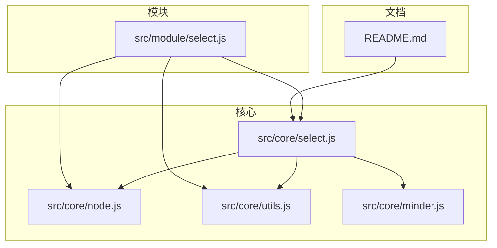
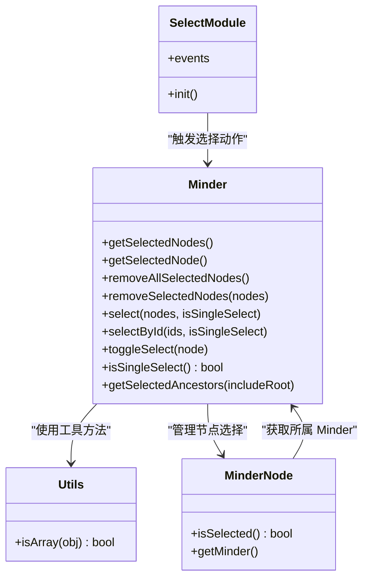
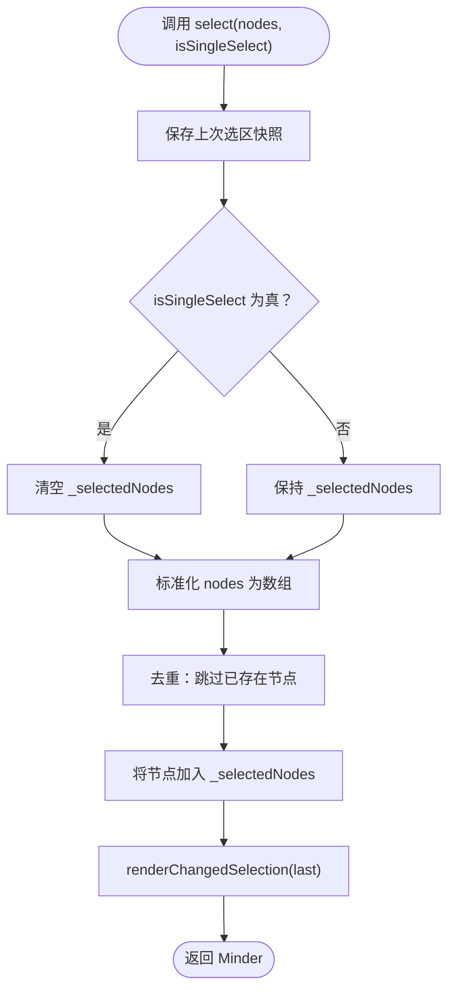
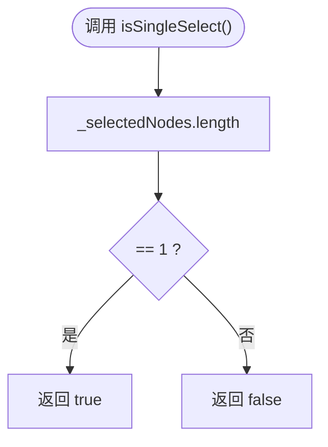
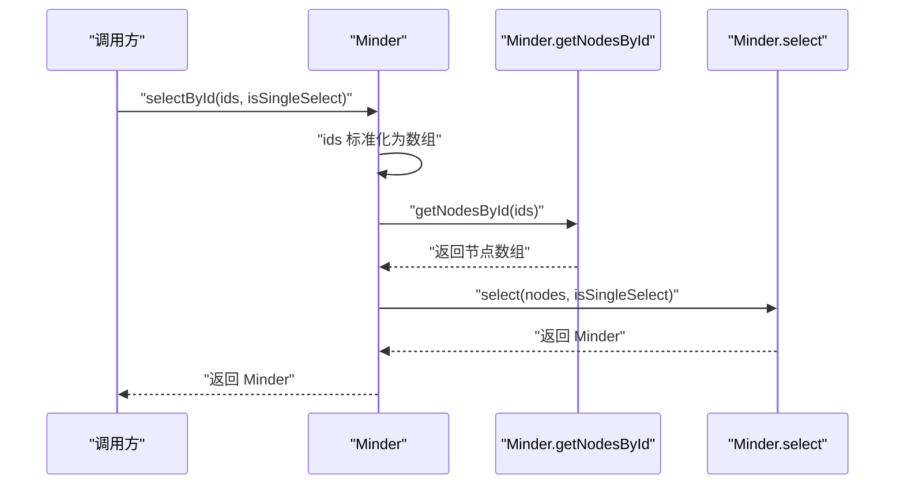
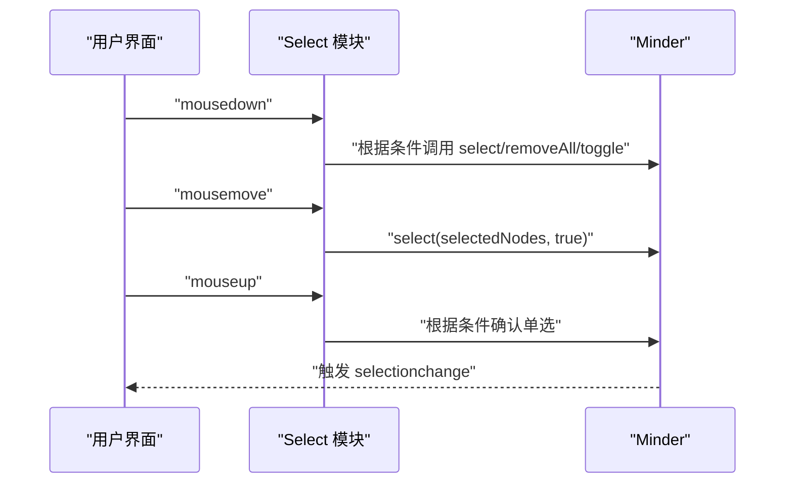
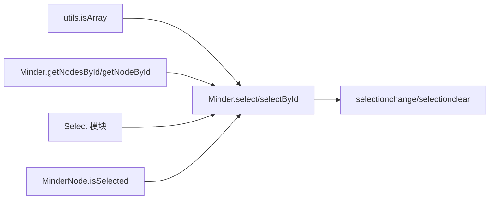

# 选择模式与API

<cite>
**本文引用的文件**
- [src/core/select.js](file://src/core/select.js)
- [src/core/node.js](file://src/core/node.js)
- [src/module/select.js](file://src/module/select.js)
- [src/core/minder.js](file://src/core/minder.js)
- [src/core/utils.js](file://src/core/utils.js)
- [README.md](file://README.md)
</cite>

## 目录
1. [简介](#简介)
2. [项目结构](#项目结构)
3. [核心组件](#核心组件)
4. [架构总览](#架构总览)
5. [详细组件分析](#详细组件分析)
6. [依赖关系分析](#依赖关系分析)
7. [性能考量](#性能考量)
8. [故障排查指南](#故障排查指南)
9. [结论](#结论)
10. [附录](#附录)

## 简介
本文件围绕“节点选择模式与核心API”展开，重点解释单选与多选模式的实现机制，深入剖析 select 方法中 isSingleSelect 参数的作用逻辑，说明其在调用时如何清空已有选择状态（_selectedNodes = []），并结合 src/core/select.js 中 select 函数的实现，阐明如何通过该参数控制选择行为。同时，解释 isSingleSelect() 如何通过判断 _selectedNodes 数组长度是否为 1 来确定当前是否为单选状态；说明 selectById API 如何通过 getNodesById 获取节点实例并委托给 select 方法完成选择操作。最后，提供使用示例路径与常见问题的解决方案与健壮性建议。

## 项目结构
本次文档聚焦于选择相关的核心文件与模块：
- 核心选择逻辑：src/core/select.js
- 节点与查询：src/core/node.js
- 交互模块（框选、点击等）：src/module/select.js
- 工具方法：src/core/utils.js
- Minder 类定义：src/core/minder.js
- 项目说明：README.md

图表来源
- [src/core/select.js](file://src/core/select.js#L1-L146)
- [src/core/node.js](file://src/core/node.js#L316-L362)
- [src/core/utils.js](file://src/core/utils.js#L1-L66)
- [src/core/minder.js](file://src/core/minder.js#L1-L41)
- [src/module/select.js](file://src/module/select.js#L1-L184)
- [README.md](file://README.md#L69-L81)

章节来源
- [README.md](file://README.md#L69-L81)

## 核心组件
- 选择状态管理与API：在 Minder 类上扩展选择相关方法，包括选择、移除、清空、切换、查询等。
- 交互模块：负责鼠标事件、框选、快捷键等触发选择行为。
- 节点查询：通过 ID 查询节点集合，供 selectById 使用。
- 工具方法：统一数组判断、类型判断等基础能力。

章节来源
- [src/core/select.js](file://src/core/select.js#L1-L146)
- [src/module/select.js](file://src/module/select.js#L1-L184)
- [src/core/node.js](file://src/core/node.js#L316-L362)
- [src/core/utils.js](file://src/core/utils.js#L1-L66)

## 架构总览
下图展示了选择相关的关键类与模块之间的关系，以及交互模块如何驱动核心选择API。

图表来源
- [src/core/select.js](file://src/core/select.js#L41-L146)
- [src/core/node.js](file://src/core/node.js#L139-L144)
- [src/module/select.js](file://src/module/select.js#L1-L184)
- [src/core/utils.js](file://src/core/utils.js#L59-L66)

## 详细组件分析

### 选择状态与API设计
- 选择状态存储：Minder 内部维护 _selectedNodes 数组，用于保存当前选中的节点集合。
- 选择API族：
  - select(nodes, isSingleSelect)：将 nodes 加入选区；当 isSingleSelect 为真时，先清空已有选择。
  - selectById(ids, isSingleSelect)：通过 ID 解析节点后委托 select 完成选择。
  - removeAllSelectedNodes()：清空选区并触发 selectionchange。
  - removeSelectedNodes(nodes)：从选区移除指定节点。
  - toggleSelect(node)：对节点执行“切换选中/取消选中”的操作。
  - isSingleSelect()：判断当前是否仅有一个节点被选中（_selectedNodes.length == 1）。
  - getSelectedAncestors(includeRoot)：计算选区中节点的最小祖先集合。
  - isSelected()：节点级判断是否被选中。

图表来源
- [src/core/select.js](file://src/core/select.js#L69-L82)

章节来源
- [src/core/select.js](file://src/core/select.js#L41-L146)

### isSingleSelect 的判定逻辑
- isSingleSelect() 通过判断 _selectedNodes.length 是否等于 1 来确定当前是否为单选状态。
- 该方法常用于交互逻辑中，例如在点击事件中区分“单选”和“多选拖拽”的场景。

图表来源
- [src/core/select.js](file://src/core/select.js#L100-L102)

章节来源
- [src/core/select.js](file://src/core/select.js#L100-L102)

### selectById 的工作流程
- selectById(ids, isSingleSelect)：
  1) 将 ids 标准化为数组；
  2) 调用 getNodesById(ids) 获取节点列表；
  3) 委托 select(nodes, isSingleSelect) 完成选择。

图表来源
- [src/core/select.js](file://src/core/select.js#L83-L87)
- [src/core/node.js](file://src/core/node.js#L339-L348)

章节来源
- [src/core/select.js](file://src/core/select.js#L83-L87)
- [src/core/node.js](file://src/core/node.js#L339-L348)

### 交互模块对选择API的驱动
- 框选（Marquee）：在鼠标移动过程中计算与节点相交的区域，调用 minder.select(selectedNodes, true) 实现“单选”覆盖。
- 点击事件：
  - 未点中节点：清除选区并标记框选开始。
  - 按住 Ctrl：切换当前节点的选中状态。
  - 点中未选中节点：单选该节点。
  - 点中已选中节点且非单选：记录点击信息，等待最终确认再单选。
- 全选：遍历所有节点，调用 minder.select(allNodes, true)。

图表来源
- [src/module/select.js](file://src/module/select.js#L120-L181)
- [src/core/select.js](file://src/core/select.js#L69-L82)

章节来源
- [src/module/select.js](file://src/module/select.js#L120-L181)

### 选择状态变更通知
- renderChangedSelection(last)：对比上次与当前选区差异，触发 selectionchange 事件，并逐个节点重新渲染。
- removeAllSelectedNodes()：清空选区后触发 selectionclear 事件。

章节来源
- [src/core/select.js](file://src/core/select.js#L17-L54)

### 选择模式与行为要点
- 单选模式：isSingleSelect 为真时，select 会先清空已有选择，然后将新节点加入选区。
- 多选模式：isSingleSelect 为假时，select 仅追加新节点，不清理旧选区。
- 切换选择：toggleSelect 支持对单个或一组节点进行切换。
- 选区最小祖先：getSelectedAncestors 提供选区节点的最小祖先集合，便于批量操作。

章节来源
- [src/core/select.js](file://src/core/select.js#L69-L103)
- [src/core/select.js](file://src/core/select.js#L104-L137)

## 依赖关系分析
- Minder 依赖 utils.isArray 进行参数标准化。
- 交互模块依赖 Minder 的选择API与节点查询API。
- 节点 isSelected() 依赖 Minder 的选区查询接口。

图表来源
- [src/core/select.js](file://src/core/select.js#L69-L87)
- [src/core/node.js](file://src/core/node.js#L335-L348)
- [src/core/utils.js](file://src/core/utils.js#L59-L66)
- [src/module/select.js](file://src/module/select.js#L120-L181)

章节来源
- [src/core/select.js](file://src/core/select.js#L69-L87)
- [src/core/node.js](file://src/core/node.js#L335-L348)
- [src/core/utils.js](file://src/core/utils.js#L59-L66)
- [src/module/select.js](file://src/module/select.js#L120-L181)

## 性能考量
- 选区对比：renderChangedSelection 通过差集计算选区变化，避免不必要的渲染。
- 去重策略：select 在加入前检查节点是否已在选区，避免重复添加。
- 查询效率：getNodesById 遍历全部节点，复杂度 O(N)；若频繁按ID查询，可在业务层缓存 ID->节点映射以降低查询成本。
- 交互性能：框选过程在移动阶段持续计算选区并调用 select，应避免在高频事件中进行昂贵操作。

章节来源
- [src/core/select.js](file://src/core/select.js#L17-L39)
- [src/core/select.js](file://src/core/select.js#L69-L82)
- [src/core/node.js](file://src/core/node.js#L339-L348)

## 故障排查指南
- isSingleSelect 判断失效
  - 现象：isSingleSelect 返回值不符合预期。
  - 排查：确认 _selectedNodes 是否被直接修改而非通过 Minder 的选择API；确保在选择操作后触发了 selectionchange。
  - 参考路径：[isSingleSelect 实现](file://src/core/select.js#L100-L102)，[selectionchange 触发](file://src/core/select.js#L33-L39)

- selectById 传入无效ID导致空选择
  - 现象：传入不存在的ID，返回空数组，最终无节点被选中。
  - 排查：确认 ID 是否存在于节点数据中；可通过 getNodeById 或 getNodesById 验证。
  - 参考路径：[selectById 实现](file://src/core/select.js#L83-L87)，[getNodesById 实现](file://src/core/node.js#L339-L348)

- 多选时误清空
  - 现象：期望追加节点但实际清空了旧选区。
  - 排查：检查调用 select 时 isSingleSelect 参数是否错误传入 true。
  - 参考路径：[select 实现](file://src/core/select.js#L69-L82)

- 交互冲突
  - 现象：框选与点击事件相互干扰。
  - 排查：确认框选阈值与状态切换逻辑；检查 mouseup 时是否正确判断点击位置与移动距离。
  - 参考路径：[框选与点击处理](file://src/module/select.js#L120-L181)

- 选区渲染异常
  - 现象：选区变化后节点未刷新。
  - 排查：确认 renderChangedSelection 是否被调用；检查 selectionchange 事件监听是否生效。
  - 参考路径：[renderChangedSelection](file://src/core/select.js#L17-L39)

## 结论
- isSingleSelect 参数是控制选择模式的关键开关：true 表示单选（先清空旧选区），false 表示多选（仅追加）。
- selectById 通过 getNodesById 将 ID 转换为节点实例，再委托 select 完成选择，保证了按ID批量选择的一致性。
- 交互模块通过鼠标事件驱动选择API，形成“用户操作 -> 选择状态 -> 视图更新”的闭环。
- 建议在业务层对 ID 查询结果进行校验，并在高频交互中注意性能优化与事件节流。

## 附录
- 使用示例路径（不展示具体代码，仅给出定位）：
  - 多节点选择：调用 [select(nodes, false)](file://src/core/select.js#L69-L82)
  - 单节点选择（覆盖）：调用 [select(nodes, true)](file://src/core/select.js#L69-L82)
  - 按ID批量选择：调用 [selectById(ids, isSingleSelect)](file://src/core/select.js#L83-L87)
  - 判断当前是否单选：调用 [isSingleSelect()](file://src/core/select.js#L100-L102)
  - 清空选区：调用 [removeAllSelectedNodes()](file://src/core/select.js#L48-L54)
  - 切换选中状态：调用 [toggleSelect(node)](file://src/core/select.js#L88-L98)
  - 获取选中节点：调用 [getSelectedNodes()](file://src/core/select.js#L41-L44)
  - 获取节点实例（按ID）：调用 [getNodeById(id)](file://src/core/node.js#L335-L337) 或 [getNodesById(ids)](file://src/core/node.js#L339-L348)